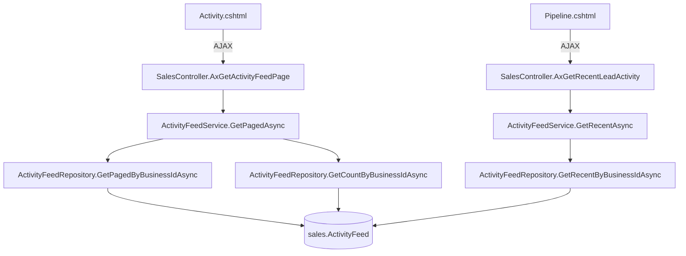

# Activity Feed Page — Technical Design

## Overview

This design moves the global Activity Feed from the Pipeline page into a dedicated `/Sales/Activity` page with full filtering, pagination, and AJAX loading. The Pipeline page retains a compact "Recent Lead Activity" widget showing the last 10 events. The implementation follows the established Meetings page pattern: Controller → Service → Repository, with AJAX endpoints prefixed `AxGet`, JSON responses shaped as `{ success, data, totalCount, currentPage, totalPages }`, BlockUI for loading states, and SweetAlert2 for errors.

**Key Design Decisions:**

1. Add a `GetPagedAsync` method to `IActivityFeedService` returning `PagedResult<ActivityFeedPageDto>` with filtering support (action type, date range)
2. Add a `GetRecentAsync` method to `IActivityFeedService` returning `List<ActivityFeedDto>` (last 10 entries, no pagination)
3. Two new repository methods with `COUNT` queries for total count support
4. Two new controller endpoints: `AxGetActivityFeedPage` (paged + filtered) and `AxGetRecentLeadActivity` (last 10)
5. New `Activity.cshtml` view following the Meetings page layout structure
6. New `activity-feed.js` following the `meetings.js` IIFE pattern
7. Navigation link inserted between Meetings and Tasks in `ModuleNavigation/Default.cshtml`

## Architecture



**Request Flow (Activity Feed Page):**

1. User navigates to `/Sales/Activity` → `SalesController.Activity()` returns `Activity.cshtml`
2. On page load, `activity-feed.js` calls `loadActivityPage(1)` with default filters
3. Fetch hits `AxGetActivityFeedPage?page=1` → service queries repository with filters → returns paged JSON
4. JS renders table rows and pagination controls
5. User applies filter → JS calls `loadActivityPage(1)` with filter params → re-renders

**Request Flow (Pipeline Recent Activity):**

1. Pipeline page loads → existing JS calls `loadRecentLeadActivity()`
2. Fetch hits `AxGetRecentLeadActivity` → service gets last 10 → returns JSON
3. JS renders compact list in the "Recent Lead Activity" section

## Components and Interfaces

### Controller — SalesController

**New Action Method:**

```csharp
public IActionResult Activity()
```
Returns `Activity.cshtml` view. No ViewBag data required (action types loaded via AJAX or hardcoded in the dropdown).

**New AJAX Endpoint — Paged Activity Feed:**

```csharp
[HttpGet]
public async Task<IActionResult> AxGetActivityFeedPage(string? actionType, DateTime? dateFrom, DateTime? dateTo, int page = 1)
```

Returns:
```json
{
  "success": true,
  "data": [ { "id", "action", "description", "performedByName", "leadName", "createdAtUtc" } ],
  "totalCount": 120,
  "currentPage": 1,
  "totalPages": 8,
  "pageSize": 15
}
```

**New AJAX Endpoint — Recent Lead Activity:**

```csharp
[HttpGet]
public async Task<IActionResult> AxGetRecentLeadActivity()
```

Returns:
```json
{
  "success": true,
  "data": [ { "id", "action", "description", "leadName", "createdAtUtc" } ]
}
```

### Service — IActivityFeedService

**New Method Signatures:**

```csharp
/// <summary>
/// Gets filtered, paginated activity feed for the Activity page.
/// </summary>
Task<PagedResult<ActivityFeedPageDto>> GetPagedAsync(ActivityFeedFilter filter, int page = 1, int pageSize = 15);

/// <summary>
/// Gets the most recent N activity entries for the pipeline summary widget.
/// </summary>
Task<List<ActivityFeedDto>> GetRecentAsync(int count = 10);
```

### Repository — ActivityFeedRepository

**New Methods:**

```csharp
/// <summary>
/// Returns paged activity entries filtered by optional action type and date range.
/// </summary>
Task<List<ActivityFeedEntry>> GetPagedByBusinessIdAsync(int businessId, string? actionType, DateTime? dateFrom, DateTime? dateTo, int page, int pageSize);

/// <summary>
/// Returns total count of activity entries matching the filter criteria.
/// </summary>
Task<int> GetCountByBusinessIdAsync(int businessId, string? actionType, DateTime? dateFrom, DateTime? dateTo);

/// <summary>
/// Returns the most recent N entries for the business, ordered by CreatedAtUtc DESC.
/// </summary>
Task<List<ActivityFeedEntry>> GetRecentByBusinessIdAsync(int businessId, int count);
```

### View — Activity.cshtml

Structure following the Meetings page pattern:

```
Topbar (eyebrow: "Sales Pipeline", heading: "Activity", subtitle)
Filter Panel (glass card-pad, margin-bottom:22px)
  - Action Type dropdown (All + distinct action types)
  - Date From input
  - Date To input
  - Filter button + Clear button
  - Quick Presets row (This Month, Last Month, Last 3 Months, Last 6 Months, This Year, Last Year, All Time)
Data Table (glass card-pad)
  - Columns: Timestamp | Action | Description | Contact/Lead | Performed By
  - Pagination controls (info + page buttons)
```

### JavaScript — activity-feed.js

IIFE pattern matching `meetings.js`:

```
(function () {
    'use strict';
    var _currentPage = 1;
    
    window.loadActivityPage = function(page) { ... }
    window.filterActivity = function() { ... }
    window.clearActivityFilters = function() { ... }
    window.setQuickPeriod = function(e, preset) { ... }
    
    function renderActivityTable(data, totalCount, currentPage, totalPages) { ... }
    function renderPagination(currentPage, totalPages, totalCount) { ... }
    function escapeHtml(str) { ... }
    function formatTimestamp(utcStr) { ... }
    function getActionBadgeHtml(action) { ... }
    
    document.addEventListener('DOMContentLoaded', function() {
        loadActivityPage(1);
    });
})();
```

### Navigation — ModuleNavigation/Default.cshtml

Insert a new `nav-sub-item` for "Activity" between the Meetings link and the Tasks link:

```razor
@{
    var isActivityActive = currentController.Equals("Sales", StringComparison.OrdinalIgnoreCase) && currentAction.Equals("Activity", StringComparison.OrdinalIgnoreCase);
}
<a class="nav-sub-item @(isActivityActive ? "active" : "")" asp-controller="Sales" asp-action="Activity">
    <span class="nav-icon"><svg width="14" height="14" fill="none" stroke="currentColor" stroke-width="2" viewBox="0 0 24 24"><path d="M22 12h-4l-3 9L9 3l-3 9H2"/></svg></span>
    <span class="nav-text">Activity</span>
</a>
```

## Data Models

### ActivityFeedFilter (new)

```csharp
namespace Portal.Infrastructure.Models.Sales;

public class ActivityFeedFilter
{
    public string? ActionType { get; set; }
    public DateTime? DateFrom { get; set; }
    public DateTime? DateTo { get; set; }
}
```

### ActivityFeedPageDto (new)

Extends the existing `ActivityFeedDto` with lead/contact name for the page table display:

```csharp
namespace Portal.Infrastructure.Models.Sales;

public class ActivityFeedPageDto
{
    public int Id { get; set; }
    public string Action { get; set; } = null!;
    public string Description { get; set; } = null!;
    public string? PerformedByName { get; set; }
    public string? LeadName { get; set; }
    public string? Metadata { get; set; }
    public DateTime CreatedAtUtc { get; set; }
}
```

The `LeadName` field is resolved by joining `[sales].[ActivityFeed]` with `[sales].[LeadRequest]` and then `[sales].[Contact]` to get the contact's full name (or business name) associated with the lead.

### Existing Models Used

- `PagedResult<T>` — generic pagination wrapper (Items, CurrentPage, PageSize, TotalCount, TotalPages)
- `ActivityFeedDto` — existing DTO used for the Recent Lead Activity endpoint (already has Id, Action, Description, PerformedByName, Metadata, CreatedAtUtc)
- `ActivityFeedEntry` — existing EF entity mapped to `[sales].[ActivityFeed]`

### Repository SQL — GetPagedByBusinessIdAsync

```sql
SELECT ActivityFeed.[Id], ActivityFeed.[BusinessId], ActivityFeed.[LeadRequestId],
       ActivityFeed.[Action], ActivityFeed.[Description],
       ActivityFeed.[PerformedByUserId], ActivityFeed.[PerformedByTeamMemberId],
       ActivityFeed.[Metadata], ActivityFeed.[CreatedAtUtc]
FROM [sales].[ActivityFeed]
WHERE ActivityFeed.[BusinessId] = @BusinessId
  AND (@ActionType IS NULL OR ActivityFeed.[Action] = @ActionType)
  AND (@DateFrom IS NULL OR ActivityFeed.[CreatedAtUtc] >= @DateFrom)
  AND (@DateTo IS NULL OR ActivityFeed.[CreatedAtUtc] < @DateTo)
ORDER BY ActivityFeed.[CreatedAtUtc] DESC
OFFSET @Offset ROWS FETCH NEXT @PageSize ROWS ONLY
```

### Repository SQL — GetCountByBusinessIdAsync

```sql
SELECT COUNT(*)
FROM [sales].[ActivityFeed]
WHERE ActivityFeed.[BusinessId] = @BusinessId
  AND (@ActionType IS NULL OR ActivityFeed.[Action] = @ActionType)
  AND (@DateFrom IS NULL OR ActivityFeed.[CreatedAtUtc] >= @DateFrom)
  AND (@DateTo IS NULL OR ActivityFeed.[CreatedAtUtc] < @DateTo)
```

### Repository SQL — GetRecentByBusinessIdAsync

```sql
SELECT TOP(@Count) ActivityFeed.[Id], ActivityFeed.[BusinessId], ActivityFeed.[LeadRequestId],
       ActivityFeed.[Action], ActivityFeed.[Description],
       ActivityFeed.[PerformedByUserId], ActivityFeed.[PerformedByTeamMemberId],
       ActivityFeed.[Metadata], ActivityFeed.[CreatedAtUtc]
FROM [sales].[ActivityFeed]
WHERE ActivityFeed.[BusinessId] = @BusinessId
ORDER BY ActivityFeed.[CreatedAtUtc] DESC
```

### Lead Name Resolution

The service layer resolves `LeadName` by loading the `LeadRequestId` from each activity entry, then looking up the contact name via the existing repository pattern. This is done in-memory after the paged query returns (similar to how `PerformedByName` is resolved via `UserNameResolver`). A batch lookup approach minimizes round trips:

1. Collect distinct `LeadRequestId` values from the paged results
2. Query `[sales].[LeadRequest]` joined with `[sales].[Contact]` to get contact full names
3. Map back to each DTO

## Correctness Properties

*A property is a characteristic or behavior that should hold true across all valid executions of a system — essentially, a formal statement about what the system should do. Properties serve as the bridge between human-readable specifications and machine-verifiable correctness guarantees.*

### Property 1: Pagination respects page size and count invariants

*For any* set of activity entries in the database and any valid filter combination (action type, date range, page number), the `GetPagedAsync` method SHALL return at most 15 items per page, and the `TotalCount` SHALL equal the actual number of entries matching the filter criteria across all pages.

**Validates: Requirements 5.1, 6.2, 6.3**

### Property 2: Filter correctness — results match specified criteria

*For any* activity feed dataset, when a non-null `ActionType` filter is applied, every returned entry SHALL have `Action` equal to the specified type; when a `DateFrom` is specified, every returned entry SHALL have `CreatedAtUtc >= DateFrom`; when a `DateTo` is specified, every returned entry SHALL have `CreatedAtUtc < DateTo`. Filters compose conjunctively — all active filters must be satisfied simultaneously.

**Validates: Requirements 3.1, 3.2, 6.2**

### Property 3: Results are always ordered by timestamp descending

*For any* response from `GetPagedAsync` or `GetRecentAsync`, for every consecutive pair of entries (entry[i], entry[i+1]) in the returned list, `entry[i].CreatedAtUtc >= entry[i+1].CreatedAtUtc` SHALL hold.

**Validates: Requirements 4.3, 6.2, 9.2**

### Property 4: Recent activity returns bounded and ordered results

*For any* dataset of activity entries, `GetRecentAsync(10)` SHALL return at most 10 entries, and those entries SHALL be the 10 most recent (highest `CreatedAtUtc`) entries for the business, ordered descending.

**Validates: Requirements 8.2, 9.1, 9.2**

## Error Handling

| Scenario | Behavior |
|----------|----------|
| `AxGetActivityFeedPage` throws exception | Log error, return `{ success: false, message: "An error occurred." }` |
| `AxGetRecentLeadActivity` throws exception | Log error, return `{ success: false, message: "An error occurred." }` |
| AJAX fetch fails (network error) | JS catches error, calls `BlockUI.hide()`, displays SweetAlert2 error |
| No results match filters | Return `{ success: true, data: [], totalCount: 0, currentPage: 1, totalPages: 0 }` — JS renders empty state row in table |
| Invalid page parameter (< 1) | Service defaults to page 1 |
| `dateFrom` > `dateTo` | Service accepts parameters as-is (returns 0 results naturally) |

All controller AJAX endpoints follow the standard pattern:

```csharp
try
{
    // service call
    return Json(new { success = true, data = ..., totalCount = ..., currentPage = ..., totalPages = ... });
}
catch (Exception ex)
{
    _logger.LogError(ex, "Error loading activity feed page");
    return Json(new { success = false, message = "An error occurred." });
}
```

## Testing Strategy

### PBT Applicability Assessment

This feature involves filtering, pagination, and data ordering logic — pure functions with clear input/output behavior where universal properties hold across a wide input space. **Property-based testing IS applicable** for the service/repository filtering and pagination logic.

**Library:** FsCheck.Xunit (already present in the project's test dependencies)

### Property-Based Tests

Each property test runs a minimum of 100 iterations and references its design property.

| Test | Property | Description |
|------|----------|-------------|
| `PagedResult_NeverExceedsPageSize_AndTotalCountMatchesFilter` | Property 1 | Generate random activity entries + random filters → assert `Items.Count <= 15` and `TotalCount` equals the actual count of matching entries |
| `FilteredResults_OnlyContainMatchingEntries` | Property 2 | Generate random entries with mixed actions and timestamps → apply random filter → all returned entries satisfy all filter predicates |
| `Results_AlwaysOrderedDescending` | Property 3 | Generate random entry sets → call both `GetPagedAsync` and `GetRecentAsync` → assert timestamp ordering invariant holds |
| `RecentActivity_BoundedByCountAndMostRecent` | Property 4 | Generate random entry sets → call `GetRecentAsync(10)` → assert `Count <= 10` and entries are the N most recent from the full set |

Tag format: `// Feature: activity-feed-page, Property {N}: {description}`

### Unit Tests

| Test | Validates |
|------|-----------|
| `AxGetActivityFeedPage_ReturnsSuccess_WithData` | Req 6.3 — JSON shape |
| `AxGetActivityFeedPage_ReturnsSuccess_EmptyDataWhenNoMatches` | Req 4.5 — empty state |
| `AxGetActivityFeedPage_ReturnsError_OnServiceException` | Req 6.4 — error response |
| `AxGetRecentLeadActivity_ReturnsLast10` | Req 9.1 — bounded result |
| `AxGetRecentLeadActivity_ReturnsError_OnServiceException` | Req 9.4 — error response |
| `Activity_ActionReturnsView` | Req 1.1 — route returns view |
| `GetPagedAsync_DefaultsToPage1_WhenInvalidPage` | Edge case — invalid page |

### Integration Tests

| Test | Validates |
|------|-----------|
| Insert 20 entries → call `GetPagedAsync` page 1 → verify 15 items, page 2 → verify 5 items | Req 5.1, 6.2 |
| Insert entries with mixed actions → filter by "stage_changed" → verify only matching entries returned | Req 3.1, 6.2 |
| Insert entries across date range → filter by date → verify only entries in range | Req 3.2, 6.2 |
| Call `GetRecentAsync(10)` with 15 entries → verify exactly 10 returned | Req 8.2, 9.1 |

### Manual Testing

- Verify navigation link appears between Meetings and Tasks
- Verify navigation link highlights as active on `/Sales/Activity`
- Verify Pipeline page no longer shows "Recent Activity" global feed section
- Verify Pipeline page shows "Recent Lead Activity" compact widget
- Verify BlockUI appears during AJAX loading
- Verify Quick Presets populate date fields correctly
- Verify empty state message displays when no results match
