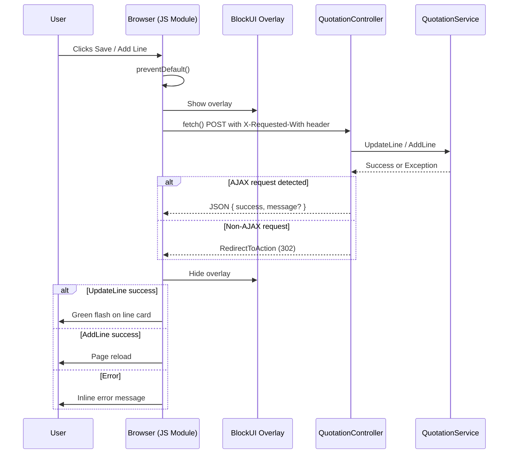

# Design Document: AJAX Line Save

## Overview

This feature converts the quotation line item Save (UpdateLine) and Add Line (AddLine) buttons from full-page form POSTs to AJAX `fetch()` calls. The goal is to eliminate page refreshes that discard unsaved edits on other lines, while providing clear visual feedback (blockUI spinner, success flash, inline errors).

The implementation is vanilla JS and CSS only — no external libraries. The server-side changes are minimal: detect the `X-Requested-With: XMLHttpRequest` header and return JSON instead of a redirect. Forms degrade gracefully to standard POST when JavaScript is unavailable.

## Architecture



The feature touches three layers:

| Layer | File | Change |
|-------|------|--------|
| Controller | `QuotationController.cs` | Add AJAX detection + JSON response path to `UpdateLine` and `AddLine` |
| JavaScript | `wwwroot/js/quotation-line-save.js` | New module — form interception, fetch, overlay, feedback |
| CSS | `wwwroot/css/quotation-line-save.css` | New stylesheet — overlay, spinner, success animation, error styles |
| View | `Views/Quotation/Edit.cshtml` | Reference new JS/CSS assets |

## Components and Interfaces

### 1. Controller: AJAX Response Branch

The existing `UpdateLine` and `AddLine` actions gain a conditional return path:

```csharp
// Helper method on the controller
private bool IsAjaxRequest()
    => Request.Headers["X-Requested-With"] == "XMLHttpRequest";
```

**UpdateLine response contract (AJAX):**
```json
{ "success": true }
// or
{ "success": false, "message": "Description is required" }
```

**AddLine response contract (AJAX):**
```json
{ "success": true }
// or
{ "success": false, "message": "Quantity must be greater than zero" }
```

Non-AJAX requests continue to return `RedirectToAction` unchanged.

### 2. JavaScript Module: `quotation-line-save.js`

A self-contained IIFE/module that:

1. On `DOMContentLoaded`, queries all forms whose `action` contains `/UpdateLine` or `/AddLine`.
2. Attaches a `submit` event listener to each.
3. On submit:
   - Calls `e.preventDefault()`
   - Shows the BlockUI overlay
   - Serializes form via `new FormData(form)`
   - Sends `fetch(form.action, { method: 'POST', headers: { 'X-Requested-With': 'XMLHttpRequest' }, body: formData })`
   - On success JSON: hides overlay, applies success animation (UpdateLine) or reloads page (AddLine)
   - On error JSON: hides overlay, renders error message adjacent to the line card
   - On network error / timeout (30s `AbortController`): hides overlay, shows generic error

**Public interface (module-scoped, not global):**

| Function | Purpose |
|----------|---------|
| `initLineSaveHandlers()` | Attaches listeners to all line forms |
| `handleSubmit(e)` | Core submit handler |
| `showOverlay()` | Creates/shows the blockUI element |
| `hideOverlay()` | Removes the blockUI element |
| `flashSuccess(lineCard)` | Adds `.line-card--saved` class, removes after 2s |
| `showError(lineCard, message)` | Inserts error element adjacent to card |
| `clearError(lineCard)` | Removes existing error element for that card |

### 3. CSS: `quotation-line-save.css`

| Selector | Purpose |
|----------|---------|
| `.blockui-overlay` | Fixed full-viewport semi-transparent backdrop with centered spinner |
| `.blockui-overlay .spinner` | CSS-only spinning circle (border animation) |
| `.line-card--saved` | `@keyframes` green highlight that fades over 2s |
| `.line-card__error` | Inline error message styling (red text, small font, margin-top) |

### 4. View Integration

The `Edit.cshtml` view adds at the bottom of the page:

```html
<link rel="stylesheet" href="~/css/quotation-line-save.css" />
<script src="~/js/quotation-line-save.js"></script>
```

No changes to `_SectionCards.cshtml` form markup are required — the JS module discovers forms by their `action` URL pattern.

## Data Models

No database changes. The only new data shape is the JSON response:

```typescript
interface LineActionResponse {
  success: boolean;
  message?: string;
}
```

This is returned by both `UpdateLine` and `AddLine` when the request includes the AJAX header.

## Correctness Properties

*A property is a characteristic or behavior that should hold true across all valid executions of a system — essentially, a formal statement about what the system should do. Properties serve as the bridge between human-readable specifications and machine-verifiable correctness guarantees.*

### Property 1: Form serialization completeness

*For any* line item form containing N input fields (including the anti-forgery token), serializing via `new FormData(form)` SHALL produce a payload containing all N field name/value pairs.

**Validates: Requirements 1.2, 1.3**

### Property 2: AJAX response shape

*For any* POST request to UpdateLine or AddLine that includes the header `X-Requested-With: XMLHttpRequest`, the controller SHALL return a JSON response with HTTP 200 containing a boolean `success` property and, when `success` is false, a non-empty `message` string property.

**Validates: Requirements 1.4, 6.1, 6.2, 6.4**

### Property 3: Non-AJAX backward compatibility

*For any* POST request to UpdateLine or AddLine that does NOT include the `X-Requested-With: XMLHttpRequest` header, the controller SHALL return an HTTP 302 redirect response (not JSON).

**Validates: Requirements 6.3, 7.1**

### Property 4: Form state preservation

*For any* page state containing multiple line item forms, after an AJAX save request completes (whether success or failure) on one form, all other forms on the page SHALL retain their original field values unchanged.

**Validates: Requirements 1.5, 5.3**

### Property 5: Overlay lifecycle

*For any* AJAX request (regardless of outcome — success, server error, network error, or timeout), the BlockUI overlay SHALL be removed from the DOM after the request completes.

**Validates: Requirements 3.3, 3.4**

### Property 6: Success animation application

*For any* line card whose UpdateLine AJAX request returns `{ success: true }`, the line card element SHALL receive the `.line-card--saved` CSS class, which is then removed after the animation duration.

**Validates: Requirements 4.1, 4.2, 4.3**

### Property 7: Error message rendering

*For any* AJAX response with `{ success: false, message: M }` where M is a non-empty string, the handler SHALL insert an element containing the text M adjacent to the affected line card.

**Validates: Requirements 5.1, 2.3**

## Error Handling

| Scenario | Handler Behavior | User Feedback |
|----------|-----------------|---------------|
| Server returns `{ success: false, message }` | Hide overlay, render error | Inline red error text on the line card |
| Network failure (fetch rejects) | Hide overlay, render generic error | "Unable to reach the server. Check your connection." |
| Timeout (30s AbortController) | Hide overlay, render timeout error | "The request timed out. Please try again." |
| Server returns non-JSON (e.g. 500 HTML page) | Catch JSON parse error, treat as failure | "An unexpected error occurred." |
| ModelState invalid (non-AJAX) | Existing redirect + TempData["LineError"] | Unchanged behavior |

Error messages are dismissible: cleared when the user clicks a dismiss button or submits the same form again.

## Testing Strategy

### Unit Tests (C# — xUnit)

Focus on the controller's AJAX detection and response branching:

- **Example**: UpdateLine with AJAX header and valid data returns `{ success: true }`
- **Example**: UpdateLine with AJAX header and invalid data returns `{ success: false, message: "..." }`
- **Example**: UpdateLine without AJAX header returns RedirectToActionResult
- **Example**: AddLine with AJAX header and valid data returns `{ success: true }`
- **Edge case**: Request with empty X-Requested-With value treated as non-AJAX
- **Edge case**: Service throws `InvalidOperationException` during AJAX request → JSON error response

### Property-Based Tests (C# — FsCheck + xUnit)

Each property test runs a minimum of 100 iterations with generated inputs.

- **Feature: ajax-line-save, Property 2: AJAX response shape** — Generate random valid/invalid `QuotationLineFormViewModel` instances, submit to controller with AJAX header, assert response is always JSON with correct shape.
- **Feature: ajax-line-save, Property 3: Non-AJAX backward compatibility** — Generate random valid `QuotationLineFormViewModel` instances, submit without AJAX header, assert response is always a redirect.

### JavaScript Tests (Jest + jsdom)

- **Feature: ajax-line-save, Property 1: Form serialization completeness** — Generate random form field configurations, create DOM forms, serialize with FormData, assert all fields present.
- **Feature: ajax-line-save, Property 4: Form state preservation** — Generate random multi-form page states, simulate one form's AJAX completion, assert other forms unchanged.
- **Feature: ajax-line-save, Property 5: Overlay lifecycle** — Simulate success, error, network failure, and timeout scenarios; assert overlay is removed in all cases.
- **Feature: ajax-line-save, Property 6: Success animation application** — Simulate success response, assert class added then removed after timer.
- **Feature: ajax-line-save, Property 7: Error message rendering** — Generate random error message strings, simulate error response, assert message appears in DOM.

### Integration / Manual Tests

- Verify graceful degradation with JavaScript disabled (forms POST normally)
- Verify no double-submit when clicking Save rapidly (overlay blocks interaction)
- Verify anti-forgery token is valid across multiple AJAX saves without page reload
