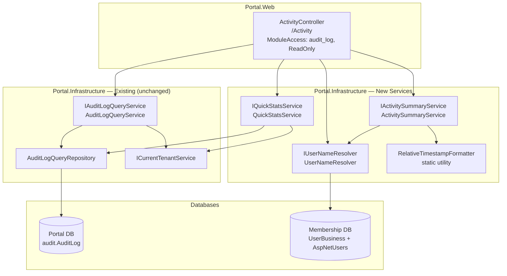

# Design Document: Activity Log (Business Manager View)

## Overview

The Activity Log is a business-facing redesign that transforms the raw, developer-oriented Audit Log viewer into a timeline-style activity feed. It reuses the existing `[audit].[AuditLog]` table and `AuditLogQueryService`/`AuditLogQueryRepository` infrastructure — no database schema changes are needed. The feature adds a new presentation layer with plain-English summaries, relative timestamps, quick stats, and business-friendly filters.

The existing `AuditController` at `/Admin/Audit` (SuperAdmin-only) remains unchanged. A new `ActivityController` at `/Activity` provides the business-manager experience, accessible to any authenticated user with the `audit_log` module at ReadOnly level or higher.

**Key principle:** Extend, don't replace. The data access layer is proven and property-tested. We add transformation and presentation services on top.


## Architecture

### Component Diagram



### Data Flow

```
User clicks Filter → ActivityController.AxGetActivities(filter)
    → maps business-friendly filter labels to AuditLogFilter params
    → calls IAuditLogQueryService.GetAuditLogsAsync(filter)
    → receives PagedResult<AuditLog>
    → calls IUserNameResolver.BatchResolve(userIds)
    → calls IActivitySummaryService.TransformBatch(auditLogs, userNames)
    → returns JSON (ActivityItemDto[] + pagination + quickStats)
```

### Key Design Decisions

1. **Single endpoint for data + stats.** The `AxGetActivities` endpoint returns both the paginated activity items AND the quick stats in one response. This avoids a second AJAX call and keeps the UX snappy. Quick stats are computed on every request (they're cheap — single aggregate query scoped to 7 days with existing index).

2. **ActivityController delegates to existing query service.** We do NOT duplicate the filter/pagination/tenant-isolation logic. The existing `IAuditLogQueryService.GetAuditLogsAsync` handles all of that. The controller maps business-friendly filter labels → `AuditLogFilter` params.

3. **Summary transformation is server-side.** The `ActivitySummaryService` runs on the server because it needs access to user names (resolved via `UserNameResolver`) and the TableName→friendly-name mapping. The front-end receives a ready-to-render summary string.

4. **Relative timestamps are client-side.** The server returns raw UTC timestamps. JavaScript computes "2 min ago" / "Yesterday at 14:32" etc. This is more accurate to the user's actual timezone and doesn't stale on long-open tabs.

5. **No database migrations.** The `[audit].[AuditLog]` table already has the required columns and indexes (including `IX_AuditLog_BusinessId_Timestamp`). No schema changes.

6. **Module key: `audit_log`** (already exists in `PortalModules.AuditLog` and in plan feature seeding). The existing constant `PortalModules.AuditLog = "audit_log"` is used directly.


## Components and Interfaces

### ActivityController

**Location:** `Portal.Web/Controllers/ActivityController.cs`
**Route:** `/Activity`

```csharp
[Authorize]
[ModuleAccess(PortalModules.AuditLog, AccessLevels.ReadOnly)]
[Route("Activity")]
public class ActivityController : Controller
{
    private readonly IAuditLogQueryService _auditLogQueryService;
    private readonly IActivitySummaryService _activitySummaryService;
    private readonly IQuickStatsService _quickStatsService;
    private readonly IUserNameResolver _userNameResolver;
    private readonly ICurrentTenantService _currentTenantService;
    private readonly MembershipDbContext _membershipDbContext;

    public ActivityController(
        IAuditLogQueryService auditLogQueryService,
        IActivitySummaryService activitySummaryService,
        IQuickStatsService quickStatsService,
        IUserNameResolver userNameResolver,
        ICurrentTenantService currentTenantService,
        MembershipDbContext membershipDbContext) { }

    // GET /Activity — serves the Index view
    [HttpGet("")]
    public async Task<IActionResult> Index();

    // GET /Activity/AxGetActivities — AJAX endpoint
    [HttpGet("AxGetActivities")]
    public async Task<IActionResult> AxGetActivities(
        [FromQuery] string? category,
        [FromQuery] string? userId,
        [FromQuery] string? changeType,
        [FromQuery] DateTime? dateFrom,
        [FromQuery] DateTime? dateTo,
        [FromQuery] int page = 1,
        [FromQuery] int pageSize = 8);

    // GET /Activity/AxGetFilterOptions — populates dropdowns
    [HttpGet("AxGetFilterOptions")]
    public async Task<IActionResult> AxGetFilterOptions();
}
```

**Index action:** Calls `AxGetFilterOptions` logic to populate `ViewBag.TeamMembers` for the "Who" dropdown (server-rendered so the dropdown is ready on page load). Returns `View()`.

**AxGetActivities action:**
1. Maps `category` → list of `TableName` values (e.g., "Invoices" → `["Invoice", "InvoiceLine"]`).
2. Maps `changeType` → `Action` filter value (e.g., "Created" → `"Insert"`, "Status changed" → special handling).
3. Builds `AuditLogFilter` with mapped values + `userId`, `dateFrom`, `dateTo`, `page`, `pageSize`.
4. Calls `_auditLogQueryService.GetAuditLogsAsync(filter)`.
5. For "Status changed" filter: post-filters results where OldValues/NewValues JSON contains a key ending in "StatusTypeId" or named "Status".
6. Calls `_userNameResolver.BatchResolveAsync(userIds)` for the page of results.
7. Calls `_activitySummaryService.TransformBatch(items, userNameMap)` to produce `ActivityItemDto[]`.
8. Calls `_quickStatsService.GetWeeklyStatsAsync()` for the stats row.
9. Returns `Json(new { success, data, quickStats, totalCount, currentPage, totalPages })`.

**AxGetFilterOptions action:**
- Returns JSON with team member list (display names + userIds) resolved from `MembershipDbContext.UserBusinesses`.

### IActivitySummaryService / ActivitySummaryService

**Location:** `Portal.Infrastructure/Services/IActivitySummaryService.cs` and `ActivitySummaryService.cs`

```csharp
public interface IActivitySummaryService
{
    /// <summary>
    /// Transforms a batch of AuditLog records into ActivityItemDtos with plain-English summaries.
    /// </summary>
    List<ActivityItemDto> TransformBatch(
        List<AuditLog> records,
        Dictionary<string, string> userNameMap);
}
```

**Transformation logic per record:**

| Action | Status Key Present | Verb | Example |
|--------|-------------------|------|---------|
| Insert | — | "created" | "John P. created Invoice INV-2026-0089" |
| Update | No | "edited" | "Maria T. edited Customer Acme — updated email address" |
| Update | Yes | "changed status of" | "John P. changed status of Invoice INV-2026-0089 from Draft to Issued" |
| Delete | — | "deleted" | "John P. deleted Purchase PUR-2026-0034 (Office Supplies, €145.00)" |

**TableName → Friendly Entity Type mapping:**

| TableName(s) | Friendly Name |
|-------------|---------------|
| Invoice, InvoiceLine | Invoice |
| Quotation, QuotationLine, QuotationContact | Quotation |
| Customer | Customer |
| Purchase | Purchase |
| Payment | Payment |
| CreditNote, CreditNoteLine | Credit Note |
| Business, BusinessProfile | Settings |
| *(any other)* | *(raw TableName)* |

**Entity identifier resolution:**
- Attempt to extract a human-readable identifier from `NewValues` (for Insert/Update) or `OldValues` (for Delete).
- Look for keys like "InvoiceNumber", "QuotationNumber", "Name", "CompanyName", "Description" in the JSON.
- Fall back to `RecordId` if no meaningful identifier found.

**Status value resolution:**
- For status changes, extract old/new values of the status key from OldValues/NewValues.
- Map numeric StatusTypeId values to their display names using a static lookup (e.g., `1 → "Draft"`, `2 → "Issued"`, `3 → "Paid"`).

### IQuickStatsService / QuickStatsService

**Location:** `Portal.Infrastructure/Services/IQuickStatsService.cs` and `QuickStatsService.cs`

```csharp
public interface IQuickStatsService
{
    Task<QuickStatsDto> GetWeeklyStatsAsync();
}
```

**Implementation:** Executes a single LINQ query against `PortalDbContext.AuditLogs` filtered by `BusinessId == currentTenantId` and `Timestamp >= sevenDaysAgo`. Uses `GroupBy` to compute:
- `TotalChanges`: total record count
- `TeamMembers`: distinct non-null `UserId` count
- `MostActiveArea`: `TableName` with highest count, mapped to friendly name
- `LastActivity`: `Max(Timestamp)`, returned as UTC DateTime for client-side formatting

Uses `AuditLogQueryRepository` with a new method `GetWeeklyAggregatesAsync(int businessId, DateTime since)` that returns raw aggregates, keeping the service layer focused on mapping.

### IUserNameResolver / UserNameResolver

**Location:** `Portal.Infrastructure/Services/IUserNameResolver.cs` and `UserNameResolver.cs`

```csharp
public interface IUserNameResolver
{
    /// <summary>
    /// Resolves a list of UserIds to display names ("{FirstName} {LastInitial}.") in a single query.
    /// Returns a dictionary: UserId → DisplayName.
    /// Null UserIds map to "System". Unresolvable UserIds map to "Unknown User".
    /// </summary>
    Task<Dictionary<string, string>> BatchResolveAsync(IEnumerable<string?> userIds);
}
```

**Implementation:**
1. Filters out null values (tracked separately as "System").
2. Queries `MembershipDbContext.UserBusinesses.Include(ub => ub.User)` where `UserId IN (distinctIds)` and `BusinessId == currentBusinessId`.
3. Builds dictionary: `userId → $"{user.FirstName} {user.LastName[0]}."`.
4. For any `userId` not found in the query result, maps to `"Unknown User"`.
5. Adds `null → "System"` entry.

**Single query guarantee:** One `WHERE UserId IN (...)` query per page of results. No N+1.

### RelativeTimestampFormatter

**Location:** `Portal.Web/wwwroot/js/relative-time.js` (client-side utility)

```javascript
/**
 * Formats a UTC ISO timestamp into a human-readable relative string.
 * @param {string} isoTimestamp - UTC ISO 8601 timestamp
 * @returns {string} Relative time string
 */
function formatRelativeTime(isoTimestamp) { ... }
```

**Bucketing rules:**

| Condition | Output |
|-----------|--------|
| < 60 seconds ago | "Just now" |
| 1–59 minutes ago | "{N} min ago" |
| 1 hour ago | "1 hour ago" |
| 2–23 hours ago | "{N} hours ago" |
| Yesterday (calendar day) | "Yesterday at {HH:mm}" |
| 2–6 days ago | "{N} days ago" |
| 7+ days ago | "dd MMM yyyy" (e.g., "03 Jul 2026") |

All comparisons use UTC. The "Yesterday" check compares UTC calendar dates.

### Filter Category Mapping (Static Utility)

**Location:** `Portal.Infrastructure/Mappings/ActivityFilterMapping.cs`

```csharp
public static class ActivityFilterMapping
{
    /// <summary>
    /// Maps business-friendly category labels to their corresponding TableName values.
    /// </summary>
    public static readonly Dictionary<string, string[]> CategoryToTableNames = new()
    {
        ["Invoices"] = new[] { "Invoice", "InvoiceLine" },
        ["Quotations"] = new[] { "Quotation", "QuotationLine", "QuotationContact" },
        ["Customers"] = new[] { "Customer" },
        ["Purchases"] = new[] { "Purchase" },
        ["Payments"] = new[] { "Payment" },
        ["Credit Notes"] = new[] { "CreditNote", "CreditNoteLine" },
        ["Settings"] = new[] { "Business", "BusinessProfile" }
    };

    /// <summary>
    /// Maps business-friendly change type labels to AuditLog Action values.
    /// "Status changed" is a special case handled separately (post-filter on JSON keys).
    /// </summary>
    public static readonly Dictionary<string, string> ChangeTypeToAction = new()
    {
        ["Created"] = "Insert",
        ["Edited"] = "Update",
        ["Deleted"] = "Delete",
        ["Status changed"] = "Update"  // combined with JSON key post-filter
    };

    /// <summary>
    /// Maps raw TableName to business-friendly entity type for summaries.
    /// </summary>
    public static string GetFriendlyEntityType(string tableName) =>
        tableName switch
        {
            "Invoice" or "InvoiceLine" => "Invoice",
            "Quotation" or "QuotationLine" or "QuotationContact" => "Quotation",
            "Customer" => "Customer",
            "Purchase" => "Purchase",
            "Payment" => "Payment",
            "CreditNote" or "CreditNoteLine" => "Credit Note",
            "Business" or "BusinessProfile" => "Settings",
            _ => tableName
        };
}
```

### Entity Link Generation (Client-Side)

**Location:** Within the Activity Feed JavaScript (in `Views/Activity/Index.cshtml`)

```javascript
const entityRoutes = {
    'Invoice': '/Invoice/Details/',
    'Customer': '/Customer/Details/',
    'Quotation': '/Quotation/Details/',
    'Purchase': '/Purchase/Details/'
};

function renderEntityLink(entityType, recordId, displayText, action) {
    if (action === 'Delete') return `<span class="entity">${displayText}</span>`;
    const baseRoute = entityRoutes[entityType];
    if (!baseRoute) return `<span class="entity">${displayText}</span>`;
    return `<a href="${baseRoute}${recordId}" class="entity">${displayText}</a>`;
}
```

Entities with known routes render as hyperlinks. Deleted entities and unknown entity types render as plain text.


## Data Models

### ActivityItemDto (new)

**Location:** `Portal.Infrastructure/Models/ActivityItemDto.cs`

```csharp
public class ActivityItemDto
{
    public long Id { get; set; }
    public string Summary { get; set; } = null!;          // Plain-English summary
    public string ActorName { get; set; } = null!;        // "John P." / "System"
    public string EntityType { get; set; } = null!;       // Friendly name: "Invoice", "Customer"
    public string EntityIdentifier { get; set; } = null!; // Human-readable: "INV-2026-0089" or RecordId
    public string RecordId { get; set; } = null!;         // Raw RecordId for link generation
    public string ActionType { get; set; } = null!;       // "created" / "edited" / "deleted" / "status-changed"
    public DateTime TimestampUtc { get; set; }            // Raw UTC for client-side relative formatting
    public string? OldValues { get; set; }                // Raw JSON for detail panel
    public string? NewValues { get; set; }                // Raw JSON for detail panel
    public bool IsStatusChange { get; set; }              // True if this is a status transition
    public string? OldStatus { get; set; }                // Resolved status name (for status changes)
    public string? NewStatus { get; set; }                // Resolved status name (for status changes)
}
```

### QuickStatsDto (new)

**Location:** `Portal.Infrastructure/Models/QuickStatsDto.cs`

```csharp
public class QuickStatsDto
{
    public int TotalChangesThisWeek { get; set; }
    public int TeamMembersActive { get; set; }
    public string MostActiveArea { get; set; } = "None";
    public DateTime? LastActivityUtc { get; set; }        // Null if no activity; client formats
}
```

### ActivityFilterOptionsDto (new)

**Location:** `Portal.Infrastructure/Models/ActivityFilterOptionsDto.cs`

```csharp
public class ActivityFilterOptionsDto
{
    public List<TeamMemberOption> TeamMembers { get; set; } = new();
}

public class TeamMemberOption
{
    public string UserId { get; set; } = null!;
    public string DisplayName { get; set; } = null!;
}
```

### Existing Models (unchanged)

- **AuditLog** — entity at `Portal.Infrastructure/Entities/AuditLog.cs` (Id, BusinessId, UserId, Action, TableName, RecordId, OldValues, NewValues, Timestamp)
- **AuditLogFilter** — filter model at `Portal.Infrastructure/Models/AuditLogFilter.cs` (TableName, Action, UserId, DateFrom, DateTo, PageNumber, PageSize)
- **PagedResult<T>** — pagination wrapper at `Portal.Infrastructure/Models/PagedResult.cs`

### AuditLog Table (existing — no changes)

```
[audit].[AuditLog]
  Id            BIGINT IDENTITY PK
  BusinessId    INT NULL FK → [portal].[Business]
  UserId        NVARCHAR(450) NULL
  Action        NVARCHAR(50) NOT NULL       -- "Insert" | "Update" | "Delete"
  TableName     NVARCHAR(200) NOT NULL
  RecordId      NVARCHAR(50) NOT NULL
  OldValues     NVARCHAR(MAX) NULL          -- JSON
  NewValues     NVARCHAR(MAX) NULL          -- JSON
  Timestamp     DATETIME2 NOT NULL DEFAULT GETUTCDATE()
```

Existing indexes: `IX_AuditLog_BusinessId_Timestamp` (supports the 7-day stats query and the default timestamp-descending ordering).


## Controller Endpoint Detail

### GET /Activity (Index)

Loads the view with server-rendered filter options:

```csharp
[HttpGet("")]
public async Task<IActionResult> Index()
{
    var businessId = _currentTenantService.CurrentBusinessId;
    var teamMembers = await _membershipDbContext.UserBusinesses
        .Include(ub => ub.User)
        .Where(ub => ub.BusinessId == businessId && ub.IsActive)
        .Select(ub => new { userId = ub.UserId, displayName = ub.User.FirstName + " " + ub.User.LastName })
        .ToListAsync();

    ViewBag.TeamMembers = teamMembers;
    return View();
}
```

### GET /Activity/AxGetActivities

```csharp
[HttpGet("AxGetActivities")]
public async Task<IActionResult> AxGetActivities(
    [FromQuery] string? category,
    [FromQuery] string? userId,
    [FromQuery] string? changeType,
    [FromQuery] DateTime? dateFrom,
    [FromQuery] DateTime? dateTo,
    [FromQuery] int page = 1,
    [FromQuery] int pageSize = 8)
{
    try
    {
        // 1. Validate dates
        if (dateFrom.HasValue && dateTo.HasValue && dateFrom.Value > dateTo.Value)
            return Json(new { success = false, message = "Date From cannot be greater than Date To." });

        // 2. Map category → TableName filter
        string? tableNameFilter = null;
        string[]? tableNames = null;
        if (!string.IsNullOrEmpty(category) && ActivityFilterMapping.CategoryToTableNames.TryGetValue(category, out var tables))
            tableNames = tables;

        // 3. Map changeType → Action
        string? actionFilter = null;
        bool isStatusChangeFilter = false;
        if (!string.IsNullOrEmpty(changeType) && changeType != "All changes")
        {
            if (changeType == "Status changed")
                isStatusChangeFilter = true;
            if (ActivityFilterMapping.ChangeTypeToAction.TryGetValue(changeType, out var action))
                actionFilter = action;
        }

        // 4. Map userId (handle "System" → null userId filter)
        string? userIdFilter = userId == "system" ? null : userId;
        bool filterBySystem = userId == "system";

        // 5. Build AuditLogFilter (NOTE: existing service accepts single TableName)
        //    For multi-table categories, we call multiple times or extend the filter.
        //    Design decision: Extend AuditLogFilter to accept TableName[] (see below)
        var filter = new AuditLogFilter
        {
            TableName = tableNames?.Length == 1 ? tableNames[0] : null,
            Action = actionFilter,
            UserId = filterBySystem ? "__NULL__" : userIdFilter, // sentinel for null
            DateFrom = dateFrom,
            DateTo = dateTo,
            PageNumber = page,
            PageSize = pageSize
        };

        // ... (call service, transform, return)
    }
    catch (Exception ex)
    {
        Log.Error(ex, "Error loading activity for business {BusinessId}", _currentTenantService.CurrentBusinessId);
        return Json(new { success = false, message = "Could not load activity data. Please try again." });
    }
}
```

**Multi-Table Filter Design Decision:**

The existing `AuditLogFilter.TableName` is a single string. Categories like "Invoices" map to multiple tables (`["Invoice", "InvoiceLine"]`). Rather than modifying the existing filter (which would affect the SuperAdmin viewer), we add a new property:

```csharp
// Extension to AuditLogFilter for multi-table support
public string[]? TableNames { get; set; }  // When set, overrides TableName
```

The `AuditLogQueryRepository.GetPagedAsync` method's WHERE clause becomes:
- If `TableNames` is set: `WHERE TableName IN (@t1, @t2, ...)`
- If `TableName` is set (single): `WHERE TableName = @tableName`
- If neither: no table filter

This is backward-compatible — existing callers using `TableName` are unaffected.

### Response Shape (AxGetActivities)

```json
{
  "success": true,
  "data": [
    {
      "id": 1042,
      "summary": "John P. created Invoice INV-2026-0095 for Sunrise Hospitality (€2,100.00)",
      "actorName": "John P.",
      "entityType": "Invoice",
      "entityIdentifier": "INV-2026-0095",
      "recordId": "1042",
      "actionType": "created",
      "timestampUtc": "2026-07-08T14:32:18Z",
      "oldValues": null,
      "newValues": "{\"InvoiceNumber\":\"INV-2026-0095\",\"CustomerName\":\"Sunrise Hospitality\",\"TotalAmount\":2100.00,\"StatusTypeId\":1}",
      "isStatusChange": false,
      "oldStatus": null,
      "newStatus": null
    }
  ],
  "quickStats": {
    "totalChangesThisWeek": 47,
    "teamMembersActive": 3,
    "mostActiveArea": "Invoicing",
    "lastActivityUtc": "2026-07-08T14:32:18Z"
  },
  "totalCount": 47,
  "currentPage": 1,
  "totalPages": 6
}
```


## View Structure

### Views/Activity/Index.cshtml

The view matches the locked mockup at `.kiro/docs/mockups/audit-log-business-view.html`.

```
Page Layout:
├── Topbar
│   ├── Eyebrow: "Business Operations"
│   ├── H1: "Activity Log" (42px Manrope 800)
│   └── Subtitle: "Everything that's happened in your business — who did what and when."
│
├── Quick Stats Row  <div class="stats-row"> (4-column grid)
│   ├── Stat Card (blue left-border): "Changes this week" → {count}
│   ├── Stat Card (green left-border): "By team members" → {count} people
│   ├── Stat Card (amber left-border): "Most active area" → {area name}
│   └── Stat Card (muted left-border): "Last activity" → {relative time}
│
├── Filter Card  <section class="glass card-pad" style="margin-bottom:22px;">
│   └── Filter row (flex, gap:14px, align-items:flex-end, flex-wrap:wrap)
│       ├── "What changed" (select, min-width:180px)
│       ├── "Who made the change" (select, min-width:180px)
│       ├── "What type of change" (select, min-width:180px)
│       ├── "Date from" (input[type=date], min-width:140px)
│       ├── "Date to" (input[type=date], min-width:140px)
│       └── Button wrapper (padding-bottom:2px, flex, gap:8px)
│           ├── [Filter] btn-primary
│           └── [Clear] btn-secondary
│
└── Activity Feed Card  <section class="glass card-pad">
    ├── <div class="activity-feed"> (vertical timeline line via ::before pseudo)
    │   └── Activity rows (repeating structure):
    │       ├── Dot indicator (32px circle, colored per action type)
    │       ├── Content area
    │       │   ├── Summary text (14px, entity links as <a> tags)
    │       │   ├── Relative timestamp (12px, muted color)
    │       │   └── Detail panel (hidden by default, slide-down on expand)
    │       └── Expand button (32px, chevron SVG, rotates 180° when open)
    │
    └── Pagination bar (margin-top:18px, flex, space-between)
        ├── "Showing X–Y of Z" (14px, muted)
        └── Page buttons (6px 12px padding, 8px radius, 13px bold)
```

### JavaScript Approach

**File:** `Views/Activity/Index.cshtml` (inline `<script>` section)

```javascript
// === State ===
let currentPage = 1;
const pageSize = 8;

// === Load Activities ===
async function loadActivities(page) {
    const category = document.getElementById('filterCategory').value;
    const userId = document.getElementById('filterUser').value;
    const changeType = document.getElementById('filterChangeType').value;
    const dateFrom = document.getElementById('filterDateFrom').value;
    const dateTo = document.getElementById('filterDateTo').value;

    // Client-side date validation
    if (dateFrom && dateTo && new Date(dateFrom) > new Date(dateTo)) {
        Swal.fire({ title: 'Invalid Date Range',
            text: 'Date From cannot be greater than Date To.',
            icon: 'warning', confirmButtonColor: '#0D5EA6' });
        return;
    }

    BlockUI.show('Loading activity...');
    try {
        const params = new URLSearchParams();
        if (category) params.set('category', category);
        if (userId) params.set('userId', userId);
        if (changeType) params.set('changeType', changeType);
        if (dateFrom) params.set('dateFrom', dateFrom);
        if (dateTo) params.set('dateTo', dateTo);
        params.set('page', page);
        params.set('pageSize', pageSize);

        const response = await fetch(`/Activity/AxGetActivities?${params}`);
        const result = await response.json();
        BlockUI.hide();

        if (result.success) {
            renderQuickStats(result.quickStats);
            renderActivityFeed(result.data);
            renderPagination(result.currentPage, result.totalPages, result.totalCount);
            currentPage = result.currentPage;
        } else {
            Swal.fire({ title: 'Error', text: result.message,
                icon: 'error', confirmButtonColor: '#0D5EA6' });
        }
    } catch (e) {
        BlockUI.hide();
        Swal.fire({ title: 'Error',
            text: 'Could not load activity data. Please try again.',
            icon: 'error', confirmButtonColor: '#0D5EA6' });
    }
}

// === On page load ===
document.addEventListener('DOMContentLoaded', () => loadActivities(1));
```

**Activity Row Rendering:**

```javascript
function renderActivityFeed(items) {
    const feed = document.getElementById('activityFeed');
    if (items.length === 0) {
        feed.innerHTML = `<div class="empty-state"><p>No activity found matching the selected filters.</p></div>`;
        return;
    }
    feed.innerHTML = items.map(item => `
        <div class="activity-row" onclick="toggleRow(this)">
            <div class="activity-dot ${getDotClass(item.actionType)}"></div>
            <div class="activity-content">
                <div class="activity-summary">${buildSummaryHtml(item)}</div>
                <div class="activity-time">${formatRelativeTime(item.timestampUtc)}</div>
                <div class="activity-detail">${buildDetailPanel(item)}</div>
            </div>
            <div class="activity-expand">
                <svg viewBox="0 0 24 24" fill="none" stroke="currentColor" stroke-width="2.5">
                    <polyline points="6 9 12 15 18 9"/>
                </svg>
            </div>
        </div>
    `).join('');
}

function getDotClass(actionType) {
    switch (actionType) {
        case 'created': return 'created';
        case 'edited': return 'edited';
        case 'deleted': return 'deleted';
        case 'status-changed': return 'status-changed';
        default: return 'edited';
    }
}

function toggleRow(row) {
    row.classList.toggle('expanded');
}
```

**Detail Panel Rendering:**

- **Created:** Table with "Field" / "Value" columns, populated from parsed `newValues` JSON.
- **Edited:** Table with "Field" / "Change" columns. Each row shows: `<span class="val-old">old</span> → <span class="val-new">new</span>`.
- **Deleted:** Table with "Field" / "Value at deletion" columns, populated from parsed `oldValues` JSON.
- **Status Changed:** Same as Edited but heading says "Status change".

**Relative Timestamp (`formatRelativeTime`):** Implemented in a reusable function at the top of the script. Uses UTC Date comparison against `new Date()`.


## Sidebar Navigation Update

The Activity Log link moves from "Administration" to "Business Operations" in the sidebar partial (`Views/Shared/_Layout.cshtml`).

**Before:** "Audit Log" under Administration section, linking to `/Admin/Audit`.
**After:** "Activity Log" under Business Operations section, linking to `/Activity`.

The SuperAdmin Audit Log at `/Admin/Audit` remains in the Administration section (unchanged). The business-level Activity Log is a separate menu item visible only to users with the `audit_log` module in their subscription plan.

**Sidebar item specification:**
- Label: "Activity Log"
- Icon: Timeline/activity icon (clock with arrow or pulse icon)
- Route: `/Activity`
- Visibility: `PortalModules.AuditLog` must be in the user's plan features
- Section: "Business Operations" (alongside Invoices, Quotations, etc.)

## Registration (Program.cs additions)

```csharp
// --- Activity Log Services ---
builder.Services.AddScoped<IActivitySummaryService, ActivitySummaryService>();
builder.Services.AddScoped<IQuickStatsService, QuickStatsService>();
builder.Services.AddScoped<IUserNameResolver, UserNameResolver>();
```

No new repository registrations needed — `QuickStatsService` uses the already-registered `AuditLogQueryRepository` (or queries directly via `PortalDbContext`).


## Correctness Properties

*A property is a characteristic or behavior that should hold true across all valid executions of a system — essentially, a formal statement about what the system should do. Properties serve as the bridge between human-readable specifications and machine-verifiable correctness guarantees.*

**Property Reflection:** Redundancy analysis was performed across all testable acceptance criteria:
- Requirements 2.2, 2.3, 2.4, 2.5 (verb selection per action type) are consolidated into a single property that covers all action/verb mappings.
- Requirements 4.1–4.6 (timestamp buckets) are consolidated into a single property covering all time-difference brackets.
- Requirements 5.1–5.3 (weekly aggregates) are consolidated into one comprehensive stats property.
- Requirements 3.1–3.3 (name resolution formats) are consolidated into one property covering all input cases.
- Requirement 2.8 (TableName mapping) is subsumed by Property 1 since the friendly name appears in the summary.
- Requirements 8.1–8.6 (entity links) are consolidated into one link-generation property.

---

### Property 1: Activity summary verb correctness

*For any* AuditLog record with a valid Action value ("Insert", "Update", "Delete"), the ActivitySummaryService SHALL produce a summary containing the correct verb: "created" for Insert, "edited" for Update (when no status key is present), "changed status of" for Update (when a status key is present in OldValues/NewValues), and "deleted" for Delete.

**Validates: Requirements 2.2, 2.3, 2.4, 2.5**

---

### Property 2: Activity summary contains actor and entity type

*For any* AuditLog record and corresponding user name map, the ActivitySummaryService SHALL produce a summary that contains both the resolved actor name and the business-friendly entity type name. When the actor name is in the map, it appears verbatim. The entity type matches `ActivityFilterMapping.GetFriendlyEntityType(record.TableName)`.

**Validates: Requirements 2.1, 2.8**

---

### Property 3: Summary fallback for unparseable JSON

*For any* AuditLog record where OldValues or NewValues contains invalid JSON (not parseable as a JSON object), the ActivitySummaryService SHALL produce a summary containing the raw TableName and RecordId values (no exception thrown).

**Validates: Requirements 2.7**

---

### Property 4: User name resolution format

*For any* set of UserIds where some are null, some match existing UserBusiness records (with FirstName/LastName), and some have no matching record, the UserNameResolver SHALL return: `null → "System"`, matched IDs → `"{FirstName} {LastInitial}."`, unmatched IDs → `"Unknown User"`.

**Validates: Requirements 3.1, 3.2, 3.3**

---

### Property 5: Relative timestamp bucket correctness

*For any* UTC timestamp and reference UTC time, the RelativeTimestampFormatter SHALL return a string matching exactly one bucket: "Just now" (< 60s), "{N} min ago" (1–59 min), "{N} hour ago" or "{N} hours ago" (1–23 hours, correct singular/plural), "Yesterday at {HH:mm}" (previous calendar day), "{N} days ago" (2–6 days), or "dd MMM yyyy" (7+ days). The bucket boundaries are non-overlapping and exhaustive.

**Validates: Requirements 4.1, 4.2, 4.3, 4.4, 4.5, 4.6**

---

### Property 6: Quick stats aggregation correctness

*For any* set of AuditLog records scoped to a business, the QuickStatsService SHALL compute: TotalChangesThisWeek equals the count of records with Timestamp within the last 7 calendar days; TeamMembersActive equals the count of distinct non-null UserIds in that same window; MostActiveArea equals the friendly name of the TableName with the highest record count in that window.

**Validates: Requirements 5.1, 5.2, 5.3**

---

### Property 7: Filter category maps to correct table names

*For any* category selection from the "What changed" dropdown and any set of AuditLog records, filtering by that category SHALL return only records whose TableName is in the corresponding `ActivityFilterMapping.CategoryToTableNames[category]` set. Records with TableNames outside the set SHALL be excluded.

**Validates: Requirements 7.1**

---

### Property 8: Status change filter correctness

*For any* set of AuditLog records with Action "Update", applying the "Status changed" filter SHALL return only records where OldValues or NewValues JSON contains at least one key ending in "StatusTypeId" or exactly named "Status". Records without such keys SHALL be excluded.

**Validates: Requirements 7.4**

---

### Property 9: Entity link generation

*For any* ActivityItemDto with a known entity type (Invoice, Customer, Quotation, Purchase) and a non-Delete action, the rendered link SHALL be an anchor tag with href matching the pattern `/{entityType}/Details/{recordId}`. For Delete actions or unknown entity types, the output SHALL be plain text (no anchor tag).

**Validates: Requirements 8.1, 8.2, 8.3, 8.4, 8.5, 8.6**


## Error Handling

| Component | Error Scenario | Behavior |
|-----------|---------------|----------|
| `ActivityController.AxGetActivities` | `dateFrom > dateTo` | Returns `Json(new { success = false, message = "Date From cannot be greater than Date To." })` |
| `ActivityController.AxGetActivities` | Service throws exception | Logs via Serilog, returns `Json(new { success = false, message = "Could not load activity data. Please try again." })` |
| `ActivitySummaryService.TransformBatch` | JSON parsing fails for OldValues/NewValues | Falls back to raw TableName + RecordId in summary. No exception thrown. |
| `ActivitySummaryService.TransformBatch` | StatusTypeId value not in known lookup | Displays raw numeric value (e.g., "changed status from 1 to 2") |
| `UserNameResolver.BatchResolveAsync` | UserId not found in MembershipDbContext | Maps to "Unknown User" — no exception |
| `UserNameResolver.BatchResolveAsync` | MembershipDbContext query fails | Exception propagates to controller; controller catches and returns error JSON |
| `QuickStatsService.GetWeeklyStatsAsync` | No records in 7-day window | Returns `QuickStatsDto` with zeros and "None" — no exception |
| `QuickStatsService.GetWeeklyStatsAsync` | DB query fails | Exception propagates to controller; controller catches and returns error JSON |
| Client JS `loadActivities` | Network error or non-JSON response | `BlockUI.hide()` then `Swal.fire` error dialog |
| Client JS `formatRelativeTime` | Invalid/null timestamp | Returns empty string (defensive check at top of function) |

### Controller-Level Pattern

All AJAX endpoints follow:

```csharp
try
{
    // ... service calls
    return Json(new { success = true, data = ..., quickStats = ..., totalCount, currentPage, totalPages });
}
catch (Exception ex)
{
    Log.Error(ex, "Error in {Action} for business {BusinessId}", nameof(AxGetActivities), _currentTenantService.CurrentBusinessId);
    return Json(new { success = false, message = "Could not load activity data. Please try again." });
}
```


## Testing Strategy

### Property-Based Testing

The project uses C# with **FsCheck** (via `FsCheck.Xunit`). Each property test runs a minimum of 100 iterations. The existing `Portal.Tests` project already uses FsCheck for the audit interceptor and query service properties.

Each property test is tagged with:
```
// Feature: audit-system-administration, Property N: <property_text>
```

**Properties 1–3 (ActivitySummaryService):** Test the transformation service in isolation. FsCheck generators produce random `AuditLog` records with varying Action values, TableName values, valid/invalid JSON in OldValues/NewValues, and random user name maps. Assertions verify verb presence, entity type presence, and fallback behavior.

**Property 4 (UserNameResolver):** Test against an in-memory `MembershipDbContext` seeded with generated UserBusiness/ApplicationUser records. Generator produces random sets of UserIds including nulls and IDs not in the database. Assertions verify the "{FirstName} {LastInitial}." format, "System" for null, and "Unknown User" for unresolvable.

**Property 5 (RelativeTimestampFormatter):** Test the client-side JS function using a C# equivalent (or test the C# server-side implementation if we provide a helper). Generators produce random timestamp/reference-time pairs covering all brackets. Alternatively, test via a Node.js/Jest runner with the `formatRelativeTime` function extracted.

**Property 6 (QuickStatsService):** Test against an in-memory `PortalDbContext` seeded with generated AuditLog records spanning various dates. Generator produces random record sets. Assertions verify count, distinct users, and most-active-area computations match a naive reference implementation.

**Properties 7–8 (Filter Mapping & Status Filter):** Test the filter logic (static mapping + JSON key inspection) with generated record sets. Property 7 verifies correct inclusion/exclusion based on TableName. Property 8 verifies JSON key detection.

**Property 9 (Entity Link Generation):** Test the `renderEntityLink` JS function logic (or a C# equivalent). Generator produces random entityType/action/recordId combinations. Assertions verify anchor vs plain-text output.

### Unit Tests (Example-Based)

- Specific examples for each action type in `ActivitySummaryService` (one Insert, one Update, one Delete, one Status Change)
- Edge cases: empty JSON `{}`, null OldValues/NewValues, unknown TableName
- `UserNameResolver` with specific users including multi-byte characters in names
- `QuickStatsService` with empty database, single record, boundary (exactly 7 days ago)
- `RelativeTimestampFormatter` at exact boundaries (59 seconds, 60 seconds, 23 hours, 24 hours, 6 days, 7 days)
- `ActivityController` date validation (dateFrom > dateTo → error JSON)
- Filter mapping: each category maps to correct table names (deterministic assertions)

### Integration Tests

- `ActivityController.AxGetActivities` returns correct JSON shape (HTTP 200, `success: true`)
- Tenant isolation: user from Business A cannot see Business B's activity
- End-to-end: create an entity → audit record written → activity endpoint returns it with correct summary
- Sidebar: Activity Log link appears for user with `audit_log` module, hidden without it

### UI / Smoke Tests

- Activity page loads (HTTP 200) for authenticated user with module access
- Page returns 403 UpgradeRequired for user without the module
- Quick stats render with correct labels
- Filter → Clear → results reset to unfiltered state
- Expand/collapse detail panels work
- Mobile viewport (640px) stacks stats and filters correctly
