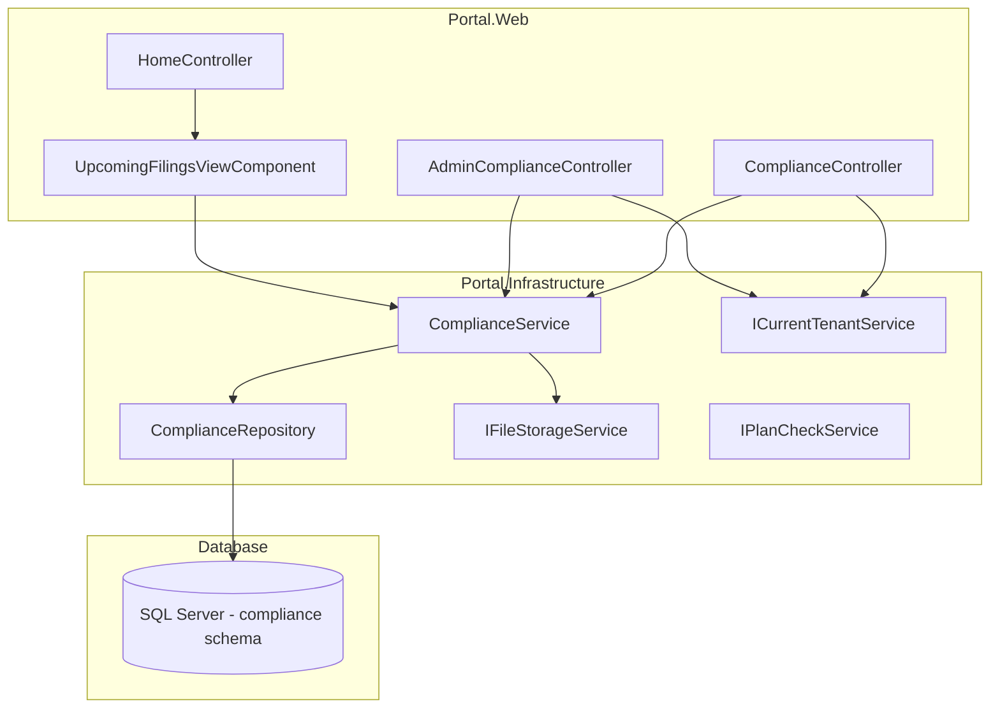
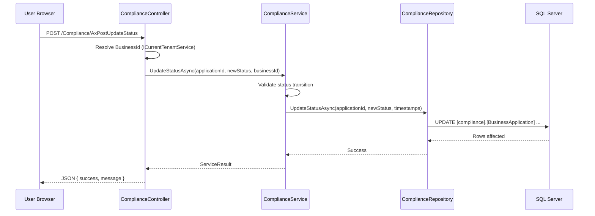

# Design Document: Business Applications Tracker

## Overview

The Business Applications Tracker (Compliance Filings) module enables businesses to track statutory filing obligations — tax returns, social insurance, VAT, levies, and employer declarations. SuperAdmins maintain a country-specific template catalog; business users import relevant templates to generate per-business filing records with calculated due dates and a controlled status workflow.

The module follows the established Portal architecture: Controller → Service → Repository, using a new `[compliance]` SQL schema, EF Core Database-First entities, and the existing `IFileStorageService` for attachment storage. Plan gating uses the `compliance` module key via `PlanPermissionFilter`.

### Key Design Decisions

| Decision | Rationale |
|----------|-----------|
| New `[compliance]` schema | Logical grouping of compliance tables; avoids polluting `[dbo]` |
| Status as NVARCHAR(20), not enum table | Limited fixed set (5 values), validated in code — simpler than a lookup table |
| Reuse `IFileStorageService` | Proven pattern from Document Attachments; no new file infrastructure needed |
| Single `ComplianceService` | All business logic (import, status transitions, due date calculation) in one service — the module is cohesive enough to avoid over-splitting |
| ViewComponent for dashboard widget | Follows existing pattern (AttachmentCountViewComponent, BusinessIdentityCardViewComponent) |
| Separate Admin controller | SuperAdmin template CRUD is distinct from business-facing operations |


## Architecture

### System Context



### Request Flow



### Layer Responsibilities

| Layer | Responsibility |
|-------|---------------|
| **Controller** | HTTP concerns, authentication, tenant resolution, request/response mapping |
| **Service** | Business logic: status transition validation, due date calculation, import orchestration, attachment rules |
| **Repository** | Raw SQL execution via `ExecuteSqlRawAsync`, parameterized queries, data mapping |


## Components and Interfaces

### 1. ComplianceController (Portal.Web)

Location: `Controllers/ComplianceController.cs`

```csharp
[Authorize]
[ModuleAccess(PortalModules.Compliance)]
public class ComplianceController : Controller
{
    // Dependencies
    private readonly IComplianceService _complianceService;
    private readonly ICurrentTenantService _currentTenantService;
    private readonly IFileStorageService _fileStorageService;

    // Page Actions
    [HttpGet] Index(string? category, string? status, DateTime? dateFrom, DateTime? dateTo, int page = 1)
    [HttpGet] Import()
    [HttpGet] Detail(int id)
    [HttpGet] Calendar(int? year)

    // AJAX Endpoints
    [HttpPost] AxPostImportTemplates(ImportTemplatesRequest request)
    [HttpPost] AxPostUpdateStatus(int id, string newStatus)
    [HttpPost] AxPostUpdateDetails(int id, string? referenceNumber, string? notes)
    [HttpPost] AxPostUploadAttachment(int id, IFormFile file)
    [HttpPost] AxPostDeleteAttachment(int attachmentId)
    [HttpGet]  AxGetAvailableTemplates(string? country)
    [HttpGet]  AxGetCalendarData(int year)
}
```

### 2. AdminComplianceController (Portal.Web)

Location: `Controllers/AdminComplianceController.cs`

```csharp
[Authorize(Roles = "SuperAdmin")]
public class AdminComplianceController : Controller
{
    private readonly IComplianceService _complianceService;

    // Page Actions
    [HttpGet] Index()
    [HttpGet] Categories()

    // AJAX Endpoints
    [HttpPost] AxPostCreateType(CreateApplicationTypeRequest request)
    [HttpPost] AxPostUpdateType(UpdateApplicationTypeRequest request)
    [HttpPost] AxPostDeactivateType(int id)
    [HttpPost] AxPostCreateCategory(CreateCategoryRequest request)
    [HttpPost] AxPostUpdateCategory(UpdateCategoryRequest request)
}
```


### 3. IComplianceService / ComplianceService (Portal.Infrastructure)

Location: `Services/IComplianceService.cs`, `Services/ComplianceService.cs`

```csharp
public interface IComplianceService
{
    // Template Catalog (Admin)
    Task<List<ApplicationTypeDto>> GetAllTypesAsync();
    Task<ServiceResult> CreateTypeAsync(CreateApplicationTypeRequest request);
    Task<ServiceResult> UpdateTypeAsync(UpdateApplicationTypeRequest request);
    Task<ServiceResult> DeactivateTypeAsync(int typeId);

    // Category Management (Admin)
    Task<List<ApplicationCategoryDto>> GetCategoriesAsync();
    Task<ServiceResult> CreateCategoryAsync(CreateCategoryRequest request);
    Task<ServiceResult> UpdateCategoryAsync(UpdateCategoryRequest request);

    // Import
    Task<List<ApplicationTypeDto>> GetAvailableTemplatesAsync(string? country);
    Task<ServiceResult<int>> ImportTemplatesAsync(int businessId, ImportTemplatesRequest request);
    Task<bool> HasDuplicatesAsync(int businessId, int[] typeIds, int year);

    // Business Applications
    Task<PagedResult<BusinessApplicationDto>> GetApplicationsAsync(
        int businessId, string? category, string? status,
        DateTime? dateFrom, DateTime? dateTo, int page, int pageSize);
    Task<BusinessApplicationDetailDto?> GetApplicationDetailAsync(int id, int businessId);
    Task<ServiceResult> UpdateStatusAsync(int id, string newStatus, int businessId);
    Task<ServiceResult> UpdateDetailsAsync(int id, string? referenceNumber, string? notes, int businessId);

    // Attachments
    Task<ServiceResult<AttachmentResultDto>> UploadAttachmentAsync(
        int applicationId, int businessId, string userId, IFormFile file);
    Task<ServiceResult> DeleteAttachmentAsync(int attachmentId, int businessId);
    Task<FileDownloadResult?> DownloadAttachmentAsync(int attachmentId, int businessId);

    // Dashboard & Calendar
    Task<List<UpcomingFilingDto>> GetUpcomingFilingsAsync(int businessId, int days = 30, int maxItems = 5);
    Task<List<CalendarFilingDto>> GetCalendarDataAsync(int businessId, int year);
}
```

#### Status Transition Logic (inside ComplianceService)

```csharp
private static readonly Dictionary<string, string[]> ValidTransitions = new()
{
    ["Pending"]    = new[] { "InProgress", "Submitted" },
    ["InProgress"] = new[] { "Submitted" },
    ["Submitted"]  = new[] { "Approved", "Rejected" },
    ["Rejected"]   = new[] { "InProgress" },
    ["Approved"]   = Array.Empty<string>() // terminal
};

private bool IsValidTransition(string currentStatus, string newStatus)
    => ValidTransitions.TryGetValue(currentStatus, out var allowed) && allowed.Contains(newStatus);
```

#### Due Date Calculation Logic (inside ComplianceService)

```csharp
private List<DateTime> CalculateDueDates(string frequency, int year, int? defaultDueMonth, int? defaultDueDay)
{
    var dueDay = defaultDueDay ?? 1;

    return frequency switch
    {
        "Monthly" => Enumerable.Range(1, 12)
            .Select(m => new DateTime(year, m, Math.Min(dueDay, DateTime.DaysInMonth(year, m))))
            .ToList(),

        "Quarterly" => new[] { 1, 4, 7, 10 }
            .Select(m => new DateTime(year, m, Math.Min(dueDay, DateTime.DaysInMonth(year, m))))
            .ToList(),

        "Annual" => new List<DateTime>
        {
            new DateTime(year, defaultDueMonth ?? 1, Math.Min(dueDay, DateTime.DaysInMonth(year, defaultDueMonth ?? 1)))
        },

        _ => new List<DateTime>() // One-off: date provided by user
    };
}
```


### 4. ComplianceRepository (Portal.Infrastructure)

Location: `Repositories/ComplianceRepository.cs`

Extends `GenericStoredProcedureRepository<BusinessApplication>`. Uses raw SQL with `SqlParameter` for all data access.

Key methods:

| Method | Purpose |
|--------|---------|
| `GetPagedAsync(businessId, filters, page, pageSize)` | Paginated list with joins to ApplicationType and ApplicationCategory |
| `GetByIdAsync(id, businessId)` | Single record with tenant check |
| `InsertBatchAsync(List<BusinessApplication>)` | Batch insert for import (multiple records) |
| `UpdateStatusAsync(id, status, submittedAt?, approvedAt?)` | Status field + timestamp update |
| `UpdateDetailsAsync(id, referenceNumber, notes)` | Notes/reference update |
| `GetUpcomingAsync(businessId, days, maxItems)` | Dashboard widget query |
| `GetCalendarAsync(businessId, year)` | All filings for a year |
| `ExistsForTypeAndPeriodAsync(businessId, typeId, year)` | Duplicate check for import |

Category/Type methods:

| Method | Purpose |
|--------|---------|
| `GetAllCategoriesAsync()` | All active categories |
| `InsertCategoryAsync(entity)` | New category |
| `UpdateCategoryAsync(entity)` | Edit category |
| `GetAllTypesAsync()` | All types with category join |
| `InsertTypeAsync(entity)` | New template |
| `UpdateTypeAsync(entity)` | Edit template |
| `DeactivateTypeAsync(id)` | Soft-deactivate template |
| `TypeExistsAsync(name, country, excludeId?)` | Duplicate check |

Attachment methods:

| Method | Purpose |
|--------|---------|
| `InsertAttachmentAsync(entity)` | New attachment record |
| `GetAttachmentByIdAsync(id, businessId)` | Single attachment with tenant check |
| `DeleteAttachmentAsync(id)` | Remove attachment record |
| `GetAttachmentCountAsync(applicationId)` | Count for max-3 enforcement |
| `GetAttachmentsForApplicationAsync(applicationId)` | List for detail view |

### 5. UpcomingFilingsViewComponent (Portal.Web)

Location: `ViewComponents/UpcomingFilingsViewComponent.cs`

```csharp
public class UpcomingFilingsViewComponent : ViewComponent
{
    private readonly IComplianceService _complianceService;
    private readonly ICurrentTenantService _currentTenantService;
    private readonly IPlanCheckService _planCheckService;

    public async Task<IViewComponentResult> InvokeAsync()
    {
        // Check if business has compliance module access
        var hasAccess = await _planCheckService.IsModuleInPlanAsync(PortalModules.Compliance);
        if (!hasAccess)
            return Content(string.Empty); // Don't render widget

        var businessId = _currentTenantService.CurrentBusinessId;
        var filings = await _complianceService.GetUpcomingFilingsAsync(businessId, days: 30, maxItems: 5);
        return View(filings);
    }
}
```

Partial view: `Views/Shared/Components/UpcomingFilings/Default.cshtml`


## Data Models

### SQL Schema: `[compliance]`

```sql
-- ============================================================
-- Compliance module schema and tables
-- ============================================================

USE [Portal]
GO

CREATE SCHEMA [compliance]
GO

-- Reference table: Application categories
CREATE TABLE [compliance].[ApplicationCategory] (
    [Id]            INT IDENTITY(1,1) NOT NULL,
    [Name]          NVARCHAR(100) NOT NULL,
    [Description]   NVARCHAR(500) NULL,
    [IsActive]      BIT NOT NULL DEFAULT 1,
    [CreatedAtUtc]  DATETIME NOT NULL DEFAULT GETUTCDATE(),
    CONSTRAINT [PK_ApplicationCategory] PRIMARY KEY CLUSTERED ([Id]),
    CONSTRAINT [UQ_ApplicationCategory_Name] UNIQUE ([Name])
);

-- Template catalog: Filing type definitions
CREATE TABLE [compliance].[ApplicationType] (
    [Id]                    INT IDENTITY(1,1) NOT NULL,
    [Name]                  NVARCHAR(200) NOT NULL,
    [Description]           NVARCHAR(1000) NULL,
    [Country]               NVARCHAR(100) NOT NULL,
    [ApplicationCategoryId] INT NOT NULL,
    [Frequency]             NVARCHAR(20) NOT NULL,
    [DefaultDueMonth]       INT NULL,
    [DefaultDueDay]         INT NULL,
    [IsActive]              BIT NOT NULL DEFAULT 1,
    [CreatedAtUtc]          DATETIME NOT NULL DEFAULT GETUTCDATE(),
    CONSTRAINT [PK_ApplicationType] PRIMARY KEY CLUSTERED ([Id]),
    CONSTRAINT [FK_ApplicationType_Category] FOREIGN KEY ([ApplicationCategoryId])
        REFERENCES [compliance].[ApplicationCategory]([Id]),
    CONSTRAINT [UQ_ApplicationType_NameCountry] UNIQUE ([Name], [Country]),
    CONSTRAINT [CK_ApplicationType_Frequency]
        CHECK ([Frequency] IN ('Monthly', 'Quarterly', 'Annual', 'One-off')),
    CONSTRAINT [CK_ApplicationType_DueMonth]
        CHECK ([DefaultDueMonth] IS NULL OR ([DefaultDueMonth] >= 1 AND [DefaultDueMonth] <= 12)),
    CONSTRAINT [CK_ApplicationType_DueDay]
        CHECK ([DefaultDueDay] IS NULL OR ([DefaultDueDay] >= 1 AND [DefaultDueDay] <= 31))
);

-- Per-business filing instances
CREATE TABLE [compliance].[BusinessApplication] (
    [Id]                INT IDENTITY(1,1) NOT NULL,
    [BusinessId]        INT NOT NULL,
    [ApplicationTypeId] INT NOT NULL,
    [DueDate]           DATE NOT NULL,
    [Status]            NVARCHAR(20) NOT NULL DEFAULT 'Pending',
    [ReferenceNumber]   NVARCHAR(100) NULL,
    [Notes]             NVARCHAR(2000) NULL,
    [SubmittedAtUtc]    DATETIME NULL,
    [ApprovedAtUtc]     DATETIME NULL,
    [CreatedAtUtc]      DATETIME NOT NULL DEFAULT GETUTCDATE(),
    CONSTRAINT [PK_BusinessApplication] PRIMARY KEY CLUSTERED ([Id]),
    CONSTRAINT [FK_BusinessApplication_Type] FOREIGN KEY ([ApplicationTypeId])
        REFERENCES [compliance].[ApplicationType]([Id]),
    CONSTRAINT [CK_BusinessApplication_Status]
        CHECK ([Status] IN ('Pending', 'InProgress', 'Submitted', 'Approved', 'Rejected'))
);

CREATE INDEX [IX_BusinessApplication_BusinessId_DueDate]
    ON [compliance].[BusinessApplication] ([BusinessId], [DueDate]);

CREATE INDEX [IX_BusinessApplication_BusinessId_Status]
    ON [compliance].[BusinessApplication] ([BusinessId], [Status]);

-- Submission evidence attachments
CREATE TABLE [compliance].[ApplicationAttachment] (
    [Id]                    INT IDENTITY(1,1) NOT NULL,
    [BusinessApplicationId] INT NOT NULL,
    [FileName]              NVARCHAR(255) NOT NULL,
    [OriginalFileName]      NVARCHAR(255) NOT NULL,
    [FilePath]              NVARCHAR(500) NOT NULL,
    [ContentType]           NVARCHAR(100) NOT NULL,
    [FileSizeBytes]         BIGINT NOT NULL,
    [UploadedByUserId]      NVARCHAR(450) NOT NULL,
    [CreatedAtUtc]          DATETIME NOT NULL DEFAULT GETUTCDATE(),
    CONSTRAINT [PK_ApplicationAttachment] PRIMARY KEY CLUSTERED ([Id]),
    CONSTRAINT [FK_ApplicationAttachment_BusinessApplication] FOREIGN KEY ([BusinessApplicationId])
        REFERENCES [compliance].[BusinessApplication]([Id])
        ON DELETE NO ACTION
);
```


### Seed Data

```sql
-- Seed categories
INSERT INTO [compliance].[ApplicationCategory] ([Name], [Description]) VALUES
    ('Tax', 'Income tax, corporate tax, and related filings'),
    ('Employee', 'Social insurance, employer declarations, and payroll-related filings'),
    ('Regulatory', 'Annual levies, registrations, and regulatory compliance filings'),
    ('Business Registration', 'Company formation, renewals, and registration filings');

-- Seed Cyprus templates
INSERT INTO [compliance].[ApplicationType]
    ([Name], [Description], [Country], [ApplicationCategoryId], [Frequency], [DefaultDueMonth], [DefaultDueDay])
VALUES
    ('IR7 Annual Tax Return', 'Annual corporate/personal income tax return', 'Cyprus', 1, 'Annual', 3, 31),
    ('Social Insurance Monthly', 'Monthly social insurance contribution declaration', 'Cyprus', 2, 'Monthly', NULL, 15),
    ('VAT Return', 'Quarterly Value Added Tax return', 'Cyprus', 1, 'Quarterly', NULL, 10),
    ('Annual Levy', 'Annual company levy to the Registrar of Companies', 'Cyprus', 3, 'Annual', 6, 30),
    ('Employer''s Declaration', 'Annual employer declaration of employee earnings', 'Cyprus', 2, 'Annual', 4, 30);
```

### EF Core Entity Classes (Portal.Infrastructure/Entities)

```csharp
// ApplicationCategory.cs
public class ApplicationCategory
{
    public int Id { get; set; }
    public string Name { get; set; } = string.Empty;
    public string? Description { get; set; }
    public bool IsActive { get; set; }
    public DateTime CreatedAtUtc { get; set; }
}

// ApplicationType.cs
public class ApplicationType
{
    public int Id { get; set; }
    public string Name { get; set; } = string.Empty;
    public string? Description { get; set; }
    public string Country { get; set; } = string.Empty;
    public int ApplicationCategoryId { get; set; }
    public string Frequency { get; set; } = string.Empty;
    public int? DefaultDueMonth { get; set; }
    public int? DefaultDueDay { get; set; }
    public bool IsActive { get; set; }
    public DateTime CreatedAtUtc { get; set; }
}

// BusinessApplication.cs
public class BusinessApplication
{
    public int Id { get; set; }
    public int BusinessId { get; set; }
    public int ApplicationTypeId { get; set; }
    public DateTime DueDate { get; set; }
    public string Status { get; set; } = "Pending";
    public string? ReferenceNumber { get; set; }
    public string? Notes { get; set; }
    public DateTime? SubmittedAtUtc { get; set; }
    public DateTime? ApprovedAtUtc { get; set; }
    public DateTime CreatedAtUtc { get; set; }
}

// ApplicationAttachment.cs
public class ApplicationAttachment
{
    public int Id { get; set; }
    public int BusinessApplicationId { get; set; }
    public string FileName { get; set; } = string.Empty;
    public string OriginalFileName { get; set; } = string.Empty;
    public string FilePath { get; set; } = string.Empty;
    public string ContentType { get; set; } = string.Empty;
    public long FileSizeBytes { get; set; }
    public string UploadedByUserId { get; set; } = string.Empty;
    public DateTime CreatedAtUtc { get; set; }
}
```


### DTO Models (Portal.Infrastructure/Models)

```csharp
// BusinessApplicationDto.cs — List view
public class BusinessApplicationDto
{
    public int Id { get; set; }
    public string ApplicationName { get; set; } = string.Empty;
    public string CategoryName { get; set; } = string.Empty;
    public DateTime DueDate { get; set; }
    public string Status { get; set; } = string.Empty;
    public string? ReferenceNumber { get; set; }
    public int AttachmentCount { get; set; }
    public string DueStatus { get; set; } = string.Empty; // "normal", "warning", "urgent", "overdue"
    public int? DaysUntilDue { get; set; }
}

// BusinessApplicationDetailDto.cs — Detail view
public class BusinessApplicationDetailDto
{
    public int Id { get; set; }
    public string ApplicationName { get; set; } = string.Empty;
    public string CategoryName { get; set; } = string.Empty;
    public string Frequency { get; set; } = string.Empty;
    public DateTime DueDate { get; set; }
    public string Status { get; set; } = string.Empty;
    public string? ReferenceNumber { get; set; }
    public string? Notes { get; set; }
    public DateTime? SubmittedAtUtc { get; set; }
    public DateTime? ApprovedAtUtc { get; set; }
    public DateTime CreatedAtUtc { get; set; }
    public string DueStatus { get; set; } = string.Empty;
    public int? DaysUntilDue { get; set; }
    public string[] AllowedTransitions { get; set; } = Array.Empty<string>();
    public List<ApplicationAttachmentDto> Attachments { get; set; } = new();
}

// ApplicationAttachmentDto.cs
public class ApplicationAttachmentDto
{
    public int Id { get; set; }
    public string OriginalFileName { get; set; } = string.Empty;
    public long FileSizeBytes { get; set; }
    public DateTime CreatedAtUtc { get; set; }
}

// ApplicationTypeDto.cs — Admin/Import view
public class ApplicationTypeDto
{
    public int Id { get; set; }
    public string Name { get; set; } = string.Empty;
    public string? Description { get; set; }
    public string Country { get; set; } = string.Empty;
    public string CategoryName { get; set; } = string.Empty;
    public int ApplicationCategoryId { get; set; }
    public string Frequency { get; set; } = string.Empty;
    public int? DefaultDueMonth { get; set; }
    public int? DefaultDueDay { get; set; }
    public bool IsActive { get; set; }
}

// ApplicationCategoryDto.cs
public class ApplicationCategoryDto
{
    public int Id { get; set; }
    public string Name { get; set; } = string.Empty;
    public string? Description { get; set; }
    public bool IsActive { get; set; }
}

// UpcomingFilingDto.cs — Dashboard widget
public class UpcomingFilingDto
{
    public int Id { get; set; }
    public string ApplicationName { get; set; } = string.Empty;
    public DateTime DueDate { get; set; }
    public string Status { get; set; } = string.Empty;
    public string DueStatus { get; set; } = string.Empty;
    public int? DaysUntilDue { get; set; }
}

// CalendarFilingDto.cs — Calendar view
public class CalendarFilingDto
{
    public int Id { get; set; }
    public string ApplicationName { get; set; } = string.Empty;
    public DateTime DueDate { get; set; }
    public string Status { get; set; } = string.Empty;
    public string DueStatus { get; set; } = string.Empty;
}

// ImportTemplatesRequest.cs
public class ImportTemplatesRequest
{
    public int[] TemplateIds { get; set; } = Array.Empty<int>();
    public int Year { get; set; }
    public DateTime? OneOffDueDate { get; set; } // Only for One-off frequency
}

// CreateApplicationTypeRequest.cs
public class CreateApplicationTypeRequest
{
    public string Name { get; set; } = string.Empty;
    public string? Description { get; set; }
    public string Country { get; set; } = string.Empty;
    public int ApplicationCategoryId { get; set; }
    public string Frequency { get; set; } = string.Empty;
    public int? DefaultDueMonth { get; set; }
    public int? DefaultDueDay { get; set; }
}

// UpdateApplicationTypeRequest.cs
public class UpdateApplicationTypeRequest
{
    public int Id { get; set; }
    public string Name { get; set; } = string.Empty;
    public string? Description { get; set; }
    public string Country { get; set; } = string.Empty;
    public int ApplicationCategoryId { get; set; }
    public string Frequency { get; set; } = string.Empty;
    public int? DefaultDueMonth { get; set; }
    public int? DefaultDueDay { get; set; }
}
```


### File Storage Convention

Attachments are stored using `IFileStorageService.UploadAsync` with:
- `entityType`: `"compliance"`
- `entityId`: `BusinessApplication.Id`
- Physical path pattern: `{businessId}/compliance/{applicationId}/{guid}_{originalFileName}`

### Permission Integration

Add to `Portal.Infrastructure/Constants/PortalModules.cs`:

```csharp
public const string Compliance = "compliance";
```

Add to `All` array and update `ModuleControllerMap`:

```csharp
[PortalModules.Compliance] = new[] { "Compliance", "AdminCompliance" }
```

Add `compliance` description to `PlanPermissionFilter.GetModuleDescription`:

```csharp
"compliance" => "Track statutory filing deadlines, manage submissions, and maintain compliance evidence.",
```

Seed `PlanFeature` records for Professional and Enterprise plans.


## Error Handling

### Controller Layer

All AJAX endpoints follow the established pattern:

```csharp
[HttpPost]
[ValidateAntiForgeryToken]
public async Task<IActionResult> AxPostUpdateStatus(int id, string newStatus)
{
    try
    {
        var businessId = _currentTenantService.CurrentBusinessId;
        var result = await _complianceService.UpdateStatusAsync(id, newStatus, businessId);

        if (result.Success)
            return Json(new { success = true, message = "Status updated successfully." });

        return Json(new { success = false, message = result.Message });
    }
    catch (Exception ex)
    {
        return Json(new { success = false, message = "An unexpected error occurred." });
    }
}
```

### Service Layer

The service returns `ServiceResult` / `ServiceResult<T>` for all operations. Validation failures return `ServiceResult.Failure("reason")` — never throw for business rule violations.

Specific error scenarios:

| Scenario | Response |
|----------|----------|
| Invalid status transition | `ServiceResult.Failure("Cannot transition from {current} to {new}.")` |
| Application not found (wrong business) | `ServiceResult.Failure("Application not found.")` — HTTP 404 for page requests |
| Max attachments reached (3) | `ServiceResult.Failure("Maximum of 3 attachments per application.")` |
| Invalid file type | `ServiceResult.Failure("Only PDF files are accepted.")` |
| File too large (>5 MB) | `ServiceResult.Failure("File size must not exceed 5 MB.")` |
| Duplicate import warning | Returns `ServiceResult` with `IsDuplicate = true` for client to confirm |
| Missing required fields (Admin) | `ServiceResult.Failure("Name and Country are required.")` |
| Duplicate template (Name+Country) | `ServiceResult.Failure("A template with this name already exists for this country.")` |

### Repository Layer

All repository methods wrap in try/catch with rethrow:

```csharp
catch (Exception ex)
{
    throw;
}
```

### Tenant Isolation Enforcement

Every query in `ComplianceRepository` includes `BusinessId` as a mandatory WHERE clause parameter. If a record is not found for the given BusinessId, the service returns "not found" — never revealing whether the record exists for another business.


## Testing Strategy

### Why Property-Based Testing Does Not Apply

This module is a CRUD-workflow feature with:
- Status transitions validated against a fixed lookup (5 states, 6 transitions)
- Due date calculations with deterministic logic (month/day arithmetic)
- File upload validation (type check, size check, count check)
- Template import generating records from fixed rules

There are no complex transformations, serialization round-trips, or unbounded input spaces that would benefit from PBT. The logic is rule-based and finite — example-based unit tests with specific scenarios provide better coverage and clarity.

### Unit Tests (Portal.Tests)

#### Status Transition Tests

| Test | Assertion |
|------|-----------|
| `UpdateStatus_PendingToInProgress_Succeeds` | Status changes, no timestamps set |
| `UpdateStatus_PendingToSubmitted_SetsSubmittedAtUtc` | Timestamp populated |
| `UpdateStatus_SubmittedToApproved_SetsApprovedAtUtc` | Timestamp populated |
| `UpdateStatus_ApprovedToAnything_Fails` | Returns failure, record unchanged |
| `UpdateStatus_InvalidTransition_ReturnsError` | Each invalid pair tested |
| `UpdateStatus_WrongBusiness_ReturnsNotFound` | Tenant isolation verified |

#### Due Date Calculation Tests

| Test | Assertion |
|------|-----------|
| `CalculateDueDates_Monthly_Returns12Dates` | One per month, correct day |
| `CalculateDueDates_Monthly_ClampsToMonthEnd` | Feb 30 → Feb 28/29 |
| `CalculateDueDates_Quarterly_Returns4Dates` | Months 1,4,7,10 |
| `CalculateDueDates_Annual_Returns1Date` | Correct month and day |
| `CalculateDueDates_OneOff_ReturnsEmpty` | User provides date separately |

#### Import Logic Tests

| Test | Assertion |
|------|-----------|
| `Import_MonthlyTemplate_Creates12Records` | All 12 with correct due dates |
| `Import_MultipleTemplates_CreatesCorrectCount` | Batch insert verified |
| `Import_DuplicateDetection_ReturnsWarning` | Existing records flagged |
| `Import_ScopedToBusinessId_Enforced` | Request BusinessId ignored, session used |

#### Attachment Tests

| Test | Assertion |
|------|-----------|
| `Upload_ValidPdf_Succeeds` | Record created, file stored |
| `Upload_NonPdf_Rejected` | Error message returned |
| `Upload_Over5Mb_Rejected` | Error message returned |
| `Upload_FourthAttachment_Rejected` | Max 3 enforced |
| `Delete_OwnAttachment_Succeeds` | Record and file removed |
| `Delete_WrongBusiness_Fails` | Tenant isolation |

#### Overdue Logic Tests

| Test | Assertion |
|------|-----------|
| `DueStatus_7DaysOut_ReturnsWarning` | For Pending/InProgress only |
| `DueStatus_3DaysOut_ReturnsUrgent` | Red indicator |
| `DueStatus_PastDue_ReturnsOverdue` | With days count |
| `DueStatus_SubmittedPastDue_ReturnsNormal` | Suppressed for terminal states |

### Integration Tests

| Test | Scope |
|------|-------|
| Full import flow | Template selection → record creation → list verification |
| Status workflow end-to-end | Pending → InProgress → Submitted → Approved |
| Attachment upload and download | File round-trip through storage |
| Dashboard widget rendering | Widget shows correct filings for business |
| Plan gating | Foundation user sees soft-gate, Professional sees module |

### Manual Testing Checklist

- [ ] Calendar view renders correctly for all 12 months
- [ ] Mobile responsive layout stacks properly below 576px
- [ ] Overdue pulse animation renders on badge
- [ ] File picker on mobile device works for PDF selection
- [ ] BlockUI/SweetAlert2 flow for all AJAX operations
- [ ] SuperAdmin can create/edit/deactivate templates
- [ ] Import duplicate warning dialog functions correctly

