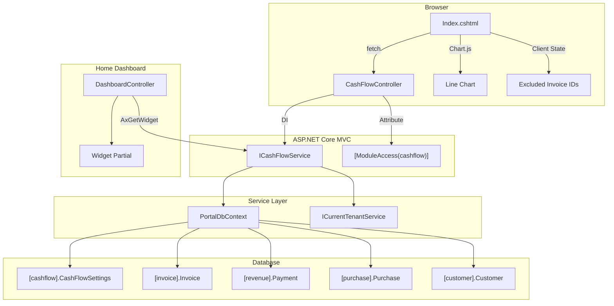

# Design Document: Cash Flow Forecasting

## Overview

The Cash Flow Forecasting module provides business owners with a forward-looking projection of their cash position by combining:
- **Inflows**: Outstanding invoices weighted by customer payment reliability (Days Late Average)
- **Outflows**: Historical 6-month averages of purchase expenses per category
- **Running Balance**: Starting balance + cumulative daily net (inflows − outflows)

The projection is computed on-demand from live data — no caching, no stored results. The module is gated to the Professional plan via the existing `cashflow` module key and `[ModuleAccess]` attribute pattern.

The UI follows the locked v2 mockup with two additions from v1: a KPI summary strip and a duplicated period selector near the chart.

## Architecture



### Request Flow

1. User navigates to `/CashFlow` → `Index()` returns the view (requires `[ModuleAccess(PortalModules.Cashflow)]`)
2. Page loads → JS calls `AxGetProjection(daysAhead=30)` → returns `CashFlowProjectionDto` as JSON
3. JS renders Chart.js line chart, hero card, KPI strip, inflow/outflow tables
4. User toggles invoice → JS re-calls `AxGetProjection` with `excludedInvoiceIds` parameter
5. User changes period (30/60/90) → JS re-calls `AxGetProjection` with new `daysAhead`
6. Settings save → JS calls `AxPostSaveSettings` → persists to `[cashflow].CashFlowSettings`

## Components and Interfaces

### Service Interface

```csharp
namespace Portal.Infrastructure.Services;

/// <summary>
/// Computes cash flow projections on-demand from live Invoice, Payment, Purchase, and Settings data.
/// All queries are scoped to the specified businessId for tenant isolation.
/// </summary>
public interface ICashFlowService
{
    /// <summary>
    /// Computes the full projection for the given horizon, optionally excluding specific invoices.
    /// </summary>
    Task<CashFlowProjectionDto> GetProjectionAsync(int businessId, int daysAhead = 30, int[]? excludedInvoiceIds = null);

    /// <summary>
    /// Returns the current settings for the business, or null if not configured.
    /// </summary>
    Task<CashFlowSettingsDto?> GetSettingsAsync(int businessId);

    /// <summary>
    /// Persists the starting balance and alert threshold for the business.
    /// </summary>
    Task SaveSettingsAsync(int businessId, decimal startingBalance, decimal alertThreshold);

    /// <summary>
    /// Returns compact widget data for the Home Dashboard (30-day projection summary).
    /// </summary>
    Task<CashFlowWidgetDto> GetWidgetDataAsync(int businessId);
}
```

### DTOs

```csharp
namespace Portal.Infrastructure.Models.CashFlow;

public class CashFlowProjectionDto
{
    public decimal StartingBalance { get; set; }
    public decimal AlertThreshold { get; set; }
    public decimal TotalInflows { get; set; }
    public decimal TotalOutflows { get; set; }
    public decimal ProjectedBalance { get; set; }
    public List<DailyBalanceDto> DailyBalances { get; set; } = new();
    public List<InflowItemDto> Inflows { get; set; } = new();
    public List<OutflowCategoryDto> Outflows { get; set; } = new();
    public DateTime? AlertBreachDate { get; set; }
}

public class DailyBalanceDto
{
    public DateOnly Date { get; set; }
    public decimal Balance { get; set; }
}

public class InflowItemDto
{
    public int InvoiceId { get; set; }
    public string CustomerName { get; set; } = null!;
    public string InvoiceNumber { get; set; } = null!;
    public decimal OutstandingAmount { get; set; }
    public DateOnly OriginalDueDate { get; set; }
    public DateOnly AdjustedDueDate { get; set; }
    public int DaysLateAverage { get; set; }
}

public class OutflowCategoryDto
{
    public int ExpenseCategoryId { get; set; }
    public string CategoryName { get; set; } = null!;
    public decimal AverageMonthlyAmount { get; set; }
    public int MonthsOfData { get; set; }
}

public class CashFlowSettingsDto
{
    public decimal StartingBalance { get; set; }
    public decimal AlertThreshold { get; set; }
    public DateTime UpdatedAtUtc { get; set; }
}

public class CashFlowWidgetDto
{
    public decimal ProjectedBalance30Days { get; set; }
    public decimal NetInflow { get; set; }
    public bool HasAlertBreach { get; set; }
    public DateTime? AlertBreachDate { get; set; }
    public bool HasSettings { get; set; }
}
```

### Controller

```csharp
namespace Portal.Web.Controllers;

[Authorize]
[ModuleAccess(PortalModules.Cashflow)]
public class CashFlowController : Controller
{
    private readonly ICashFlowService _cashFlowService;
    private readonly ICurrentTenantService _currentTenantService;

    public CashFlowController(ICashFlowService cashFlowService, ICurrentTenantService currentTenantService)
    {
        _cashFlowService = cashFlowService;
        _currentTenantService = currentTenantService;
    }

    [HttpGet]
    public IActionResult Index() => View();

    [HttpGet]
    public async Task<IActionResult> AxGetProjection(int daysAhead = 30, string? excludedInvoiceIds = null)
    {
        try
        {
            int[]? excluded = string.IsNullOrWhiteSpace(excludedInvoiceIds)
                ? null
                : excludedInvoiceIds.Split(',').Select(int.Parse).ToArray();

            var projection = await _cashFlowService.GetProjectionAsync(
                _currentTenantService.CurrentBusinessId, daysAhead, excluded);

            return Json(new { success = true, data = projection });
        }
        catch (Exception ex)
        {
            return Json(new { success = false, message = "Failed to load projection." });
        }
    }

    [HttpGet]
    public async Task<IActionResult> AxGetSettings()
    {
        try
        {
            var settings = await _cashFlowService.GetSettingsAsync(_currentTenantService.CurrentBusinessId);
            return Json(new { success = true, data = settings });
        }
        catch (Exception ex)
        {
            return Json(new { success = false, message = "Failed to load settings." });
        }
    }

    [HttpPost]
    [ValidateAntiForgeryToken]
    public async Task<IActionResult> AxPostSaveSettings(decimal startingBalance, decimal alertThreshold)
    {
        try
        {
            if (startingBalance < 0)
                return Json(new { success = false, message = "Starting balance cannot be negative." });

            if (alertThreshold < 0)
                return Json(new { success = false, message = "Alert threshold cannot be negative." });

            await _cashFlowService.SaveSettingsAsync(
                _currentTenantService.CurrentBusinessId, startingBalance, alertThreshold);

            return Json(new { success = true, message = "Settings saved successfully." });
        }
        catch (Exception ex)
        {
            return Json(new { success = false, message = "Failed to save settings." });
        }
    }

    [HttpGet]
    public async Task<IActionResult> AxGetWidget()
    {
        try
        {
            var widget = await _cashFlowService.GetWidgetDataAsync(_currentTenantService.CurrentBusinessId);
            return Json(new { success = true, data = widget });
        }
        catch (Exception ex)
        {
            return Json(new { success = false, message = "Failed to load widget data." });
        }
    }
}
```

### Computation Logic (Service Internals)

The `CashFlowService` follows this computation pipeline:

1. **Load Settings** → query `[cashflow].CashFlowSettings` for the business
2. **Compute Inflows**:
   - Query outstanding invoices (financial status 1, 2, 4; not deleted; status = Issued)
   - For each invoice, compute outstanding amount (TotalAmount − non-voided payments for PartiallyPaid)
   - Compute DaysLateAverage per customer (mean of max(0, PaymentDate − DueDate) across non-voided payments, rounded)
   - Position each inflow at max(today, DueDate + DaysLateAverage)
   - Filter to only include inflows within the projection horizon
   - Exclude any invoices in the `excludedInvoiceIds` array
3. **Compute Outflows**:
   - Query non-cancelled purchases from last 6 months, grouped by ExpenseCategory
   - For each category: count distinct months with purchase data; exclude if < 2 months
   - Calculate monthly average = sum(TotalAmount) / monthsOfData
   - Daily outflow per category = monthlyAverage / daysInMonth (for each projected month)
4. **Build Daily Balances**:
   - For each day in horizon: balance = StartingBalance + cumulative(inflows on/before day) − cumulative(outflows on/before day)
5. **Detect Alert Breach**:
   - Scan daily balances; first day where balance < AlertThreshold = AlertBreachDate

## Data Models

### Database Migration

```sql
-- ============================================================
-- Create CashFlow schema and CashFlowSettings table
-- ============================================================

USE [Portal]
GO

-- Create schema
IF NOT EXISTS (SELECT 1 FROM sys.schemas WHERE name = 'cashflow')
BEGIN
    EXEC('CREATE SCHEMA [cashflow]')
END
GO

-- Create settings table
CREATE TABLE [cashflow].[CashFlowSettings]
(
    [Id]                INT             IDENTITY(1,1) NOT NULL,
    [BusinessId]        INT             NOT NULL,
    [StartingBalance]   DECIMAL(18,2)   NOT NULL CONSTRAINT [DF_CashFlowSettings_StartingBalance] DEFAULT 0,
    [AlertThreshold]    DECIMAL(18,2)   NOT NULL CONSTRAINT [DF_CashFlowSettings_AlertThreshold] DEFAULT 0,
    [CreatedAtUtc]      DATETIME        NOT NULL CONSTRAINT [DF_CashFlowSettings_CreatedAtUtc] DEFAULT GETUTCDATE(),
    [UpdatedAtUtc]      DATETIME        NOT NULL CONSTRAINT [DF_CashFlowSettings_UpdatedAtUtc] DEFAULT GETUTCDATE(),

    CONSTRAINT [PK_CashFlowSettings] PRIMARY KEY CLUSTERED ([Id]),
    CONSTRAINT [FK_CashFlowSettings_Business] FOREIGN KEY ([BusinessId])
        REFERENCES [portal].[Business]([Id]),
    CONSTRAINT [UQ_CashFlowSettings_BusinessId] UNIQUE ([BusinessId]),
    CONSTRAINT [CK_CashFlowSettings_StartingBalance] CHECK ([StartingBalance] >= 0),
    CONSTRAINT [CK_CashFlowSettings_AlertThreshold] CHECK ([AlertThreshold] >= 0)
)
GO

-- Index for tenant isolation lookups
CREATE NONCLUSTERED INDEX [IX_CashFlowSettings_BusinessId]
    ON [cashflow].[CashFlowSettings]([BusinessId])
GO
```

### Entity Class

```csharp
namespace Portal.Infrastructure.Entities;

/// <summary>
/// Per-business configuration for the Cash Flow Forecasting module.
/// Stores the starting bank balance and alert threshold.
/// Schema: [cashflow].CashFlowSettings
/// </summary>
public class CashFlowSettings
{
    public int Id { get; set; }

    public int BusinessId { get; set; }

    public decimal StartingBalance { get; set; }

    public decimal AlertThreshold { get; set; }

    public DateTime CreatedAtUtc { get; set; }

    public DateTime UpdatedAtUtc { get; set; }

    // Navigation properties
    public Business Business { get; set; } = null!;
}
```

### EF Core Configuration

```csharp
private static void ConfigureCashFlowSettings(ModelBuilder modelBuilder)
{
    modelBuilder.Entity<CashFlowSettings>(entity =>
    {
        entity.ToTable("CashFlowSettings", "cashflow");

        entity.HasKey(e => e.Id);

        entity.HasOne(e => e.Business)
            .WithOne()
            .HasForeignKey<CashFlowSettings>(e => e.BusinessId)
            .OnDelete(DeleteBehavior.ClientSetNull);

        entity.HasIndex(e => e.BusinessId)
            .IsUnique();

        entity.Property(e => e.StartingBalance)
            .IsRequired()
            .HasColumnType("decimal(18,2)")
            .HasDefaultValue(0m);

        entity.Property(e => e.AlertThreshold)
            .IsRequired()
            .HasColumnType("decimal(18,2)")
            .HasDefaultValue(0m);

        entity.Property(e => e.CreatedAtUtc)
            .IsRequired()
            .HasDefaultValueSql("GETUTCDATE()");

        entity.Property(e => e.UpdatedAtUtc)
            .IsRequired()
            .HasDefaultValueSql("GETUTCDATE()");

        entity.ToTable(t => t.HasCheckConstraint(
            "CK_CashFlowSettings_StartingBalance", "[StartingBalance] >= 0"));

        entity.ToTable(t => t.HasCheckConstraint(
            "CK_CashFlowSettings_AlertThreshold", "[AlertThreshold] >= 0"));
    });
}
```

Add to `PortalDbContext`:

```csharp
// Cashflow schema
public DbSet<CashFlowSettings> CashFlowSettings { get; set; } = null!;
```

And call `ConfigureCashFlowSettings(modelBuilder);` inside `OnModelCreating`.

## Correctness Properties

*A property is a characteristic or behavior that should hold true across all valid executions of a system — essentially, a formal statement about what the system should do. Properties serve as the bridge between human-readable specifications and machine-verifiable correctness guarantees.*

### Property 1: Settings persistence round-trip

*For any* valid starting balance (≥ 0) and alert threshold (≥ 0), saving settings and then retrieving them SHALL return the same StartingBalance and AlertThreshold values.

**Validates: Requirements 1.5**

### Property 2: Non-negative validation rejects invalid inputs

*For any* decimal value less than zero, submitting it as Starting_Balance or Alert_Threshold SHALL result in a validation failure and no data persistence.

**Validates: Requirements 1.3, 1.4, 1.6**

### Property 3: Inflow status filtering

*For any* set of invoices with various InvoiceFinancialStatusTypeId values, the projection inflows SHALL contain only invoices with status 1 (Unpaid), 2 (PartiallyPaid), or 4 (Overdue).

**Validates: Requirements 2.1**

### Property 4: Outstanding amount calculation

*For any* outstanding invoice, the projected inflow amount SHALL equal TotalAmount minus the sum of all non-voided Payment amounts linked to that invoice (yielding TotalAmount for invoices with no payments).

**Validates: Requirements 2.2, 2.3**

### Property 5: Adjusted due date positioning with today floor

*For any* invoice with a computed Adjusted_Due_Date (DueDate + DaysLateAverage), the projected payment date SHALL be max(today, AdjustedDueDate) — never positioning an inflow in the past.

**Validates: Requirements 2.4, 2.5**

### Property 6: Horizon boundary filtering

*For any* projection with a given daysAhead value, all inflows in the result SHALL have an AdjustedDueDate that falls between today and today + daysAhead (inclusive).

**Validates: Requirements 2.6**

### Property 7: Days-late average computation

*For any* customer's payment history, the DaysLateAverage SHALL equal round(mean(max(0, PaymentDateUtc − DueDate) in days for each non-voided payment)). For customers with no payment history, DaysLateAverage SHALL be 0.

**Validates: Requirements 3.1, 3.2, 3.4**

### Property 8: Outflow category average with minimum months threshold

*For any* set of non-cancelled purchases in the last 6 months grouped by ExpenseCategory, categories with fewer than 2 distinct months of data SHALL be excluded from the outflow projection, and included categories SHALL have AverageMonthlyAmount = sum(TotalAmount) / distinctMonthsCount.

**Validates: Requirements 4.1, 4.3, 4.4**

### Property 9: Daily outflow distribution

*For any* category's monthly average, the total daily outflows attributed to that category across a full month SHALL equal the category's AverageMonthlyAmount (within rounding tolerance of ±0.01).

**Validates: Requirements 4.2**

### Property 10: Running balance invariant

*For any* starting balance and set of daily inflows and outflows, the running balance on day N SHALL equal StartingBalance + sum(inflows on days 1..N) − sum(outflows on days 1..N).

**Validates: Requirements 5.1**

### Property 11: Scenario exclusion impact

*For any* projection and any subset of excluded invoice IDs, the projected balance SHALL equal the full projection minus the sum of excluded invoices' inflow amounts positioned at their respective dates.

**Validates: Requirements 7.1, 7.2**

### Property 12: Inflow sort order

*For any* list of projected inflows, the items SHALL be ordered by AdjustedDueDate ascending. For equal dates, the order is stable.

**Validates: Requirements 6.3**

### Property 13: Outflow sort order

*For any* list of outflow categories, the items SHALL be ordered by AverageMonthlyAmount descending.

**Validates: Requirements 6.4**

### Property 14: Alert threshold breach detection

*For any* projection where the running balance drops below the AlertThreshold, the AlertBreachDate SHALL be the first date in the DailyBalances where Balance < AlertThreshold. If no breach occurs, AlertBreachDate SHALL be null.

**Validates: Requirements 8.3**

### Property 15: Tenant isolation

*For any* multi-tenant dataset, the projection for businessId X SHALL only contain inflows from invoices where Invoice.BusinessId = X, outflows from purchases where Purchase.BusinessId = X, and settings from CashFlowSettings where BusinessId = X.

**Validates: Requirements 11.1, 11.2, 11.3, 11.4**

### Property 16: On-demand freshness

*For any* data mutation (new payment, new invoice, new purchase, settings change) between two consecutive projection requests, the second projection SHALL reflect the mutation.

**Validates: Requirements 12.1, 12.3**

## Error Handling

| Scenario | Layer | Response |
|----------|-------|----------|
| No CashFlowSettings record | Service | Returns StartingBalance=0, AlertThreshold=0 (defaults) |
| Negative Starting_Balance submitted | Controller | `{ success: false, message: "Starting balance cannot be negative." }` |
| Negative Alert_Threshold submitted | Controller | `{ success: false, message: "Alert threshold cannot be negative." }` |
| Invalid `excludedInvoiceIds` format (non-numeric) | Controller | `{ success: false, message: "Failed to load projection." }` (caught by parse exception) |
| Invalid `daysAhead` (not 30/60/90) | Controller/JS | JS only sends valid values; controller accepts any positive int for flexibility |
| No outstanding invoices | Service | Returns projection with TotalInflows=0, empty inflows list |
| No purchase history (all categories < 2 months) | Service | Returns projection with TotalOutflows=0, empty outflows list |
| Database connection failure | Service → Controller | Exception caught, `{ success: false, message: "..." }` returned |
| Unauthorized (Starter plan) | ModuleAccess filter | Redirects to soft-gate upgrade view (existing infrastructure) |
| BusinessId = 0 (not authenticated) | Global query filter | Returns zero results (existing safety net) |

## View Structure

### Main Page: `Views/CashFlow/Index.cshtml`

References the locked mockup v2 layout. The page is fully server-rendered as a shell, with data populated via AJAX:

```
┌─────────────────────────────────────────────────────┐
│ Topbar: "Revenue Control" > "Cash Flow Forecast"    │
├─────────────────────────────────────────────────────┤
│ Hero Card (healthy/warning state)                   │
│   - Projected balance summary                       │
│   - Period selector (30/60/90)                      │
├─────────────────────────────────────────────────────┤
│ KPI Summary Strip (v1 addition)                     │
│   Starting Balance | Total Inflows | Total Outflows │
│   | Projected Balance                               │
├─────────────────────────────────────────────────────┤
│ Tip Bar                                             │
├─────────────────────────────────────────────────────┤
│ Flow Visualization (Money In vs Money Out)          │
├─────────────────────────────────────────────────────┤
│ Chart Card                                          │
│   - Period selector (duplicated, sticky — v1 add)   │
│   - Chart.js line chart canvas                      │
│   - Alert threshold horizontal line                 │
│   - Danger zone shading below threshold             │
├─────────────────────────────────────────────────────┤
│ Inflow Breakdown Table (with toggle switches)       │
├─────────────────────────────────────────────────────┤
│ Outflow Breakdown Table                             │
├─────────────────────────────────────────────────────┤
│ Settings Card (Starting Balance + Alert Threshold)  │
└─────────────────────────────────────────────────────┘
```

### Dashboard Widget: `Views/Shared/_CashFlowWidget.cshtml`

A partial view rendered on the Home Dashboard when the business has Professional+ plan and configured settings:
- Mini line chart (Chart.js, compact height ~60px)
- Projected balance at day 30
- Net inflow indicator
- Warning badge if breach within 30 days
- Setup prompt if no settings configured

### Chart.js Rendering Approach

```javascript
// Chart configuration
const ctx = document.getElementById('cashFlowChart').getContext('2d');
const chart = new Chart(ctx, {
    type: 'line',
    data: {
        labels: dailyBalances.map(d => d.date),
        datasets: [{
            label: 'Projected Balance',
            data: dailyBalances.map(d => d.balance),
            borderColor: '#0D5EA6',
            backgroundColor: 'rgba(13, 94, 166, 0.05)',
            fill: true,
            tension: 0.3,
            pointRadius: 0,
            pointHoverRadius: 6
        }]
    },
    options: {
        responsive: true,
        maintainAspectRatio: false,
        plugins: {
            annotation: {
                annotations: {
                    thresholdLine: {
                        type: 'line',
                        yMin: alertThreshold,
                        yMax: alertThreshold,
                        borderColor: '#C8912E',
                        borderWidth: 2,
                        borderDash: [6, 4],
                        label: {
                            display: true,
                            content: 'Safety Net: ' + currencySymbol + alertThreshold.toLocaleString(),
                            position: 'end'
                        }
                    },
                    dangerZone: {
                        type: 'box',
                        yMin: 0,
                        yMax: alertThreshold,
                        backgroundColor: 'rgba(194, 74, 74, 0.06)',
                        borderWidth: 0
                    }
                }
            }
        },
        scales: {
            x: { grid: { display: false } },
            y: {
                beginAtZero: false,
                ticks: {
                    callback: val => currencySymbol + val.toLocaleString()
                }
            }
        }
    }
});
```

Requires: `chartjs-plugin-annotation` for threshold line and danger zone shading.

### AJAX Pattern (per project standards)

```javascript
async function loadProjection(daysAhead, excludedIds) {
    BlockUI.show('Loading projection...');
    try {
        const params = new URLSearchParams({ daysAhead });
        if (excludedIds.length > 0) params.append('excludedInvoiceIds', excludedIds.join(','));

        const response = await fetch(`/CashFlow/AxGetProjection?${params}`);
        const data = await response.json();
        BlockUI.hide();

        if (data.success) {
            renderProjection(data.data);
        } else {
            Swal.fire({ title: 'Error', text: data.message, icon: 'error', confirmButtonColor: '#0D5EA6' });
        }
    } catch (e) {
        BlockUI.hide();
        Swal.fire({ title: 'Error', text: 'An unexpected error occurred.', icon: 'error', confirmButtonColor: '#0D5EA6' });
    }
}
```

## Testing Strategy

### Unit Tests (Example-Based)

- Settings controller: test validation for negative values, test defaults when no record exists
- Projection with no data: verify empty inflows/outflows, starting balance carried forward
- Widget DTO: test HasSettings flag, HasAlertBreach flag
- Permission gating: verify `[ModuleAccess(PortalModules.Cashflow)]` attribute present
- Teaser visibility: Starter plan shows teaser, Professional does not
- Period selector: only 30/60/90 accepted by JS

### Property-Based Tests (xUnit + FsCheck)

The following properties will be implemented using FsCheck with minimum 100 iterations each:

| Property | Test Class | Validates |
|----------|-----------|-----------|
| 1: Settings round-trip | `CashFlowSettingsPropertyTests` | Req 1.5 |
| 2: Non-negative validation | `CashFlowSettingsPropertyTests` | Req 1.3, 1.4, 1.6 |
| 3: Inflow status filtering | `CashFlowProjectionPropertyTests` | Req 2.1 |
| 4: Outstanding amount | `CashFlowProjectionPropertyTests` | Req 2.2, 2.3 |
| 5: Adjusted date with floor | `CashFlowProjectionPropertyTests` | Req 2.4, 2.5 |
| 6: Horizon filtering | `CashFlowProjectionPropertyTests` | Req 2.6 |
| 7: Days-late average | `CashFlowProjectionPropertyTests` | Req 3.1, 3.2, 3.4 |
| 8: Outflow category average | `CashFlowProjectionPropertyTests` | Req 4.1, 4.3, 4.4 |
| 9: Daily outflow distribution | `CashFlowProjectionPropertyTests` | Req 4.2 |
| 10: Running balance invariant | `CashFlowProjectionPropertyTests` | Req 5.1 |
| 11: Scenario exclusion | `CashFlowProjectionPropertyTests` | Req 7.1, 7.2 |
| 12: Inflow sort order | `CashFlowProjectionPropertyTests` | Req 6.3 |
| 13: Outflow sort order | `CashFlowProjectionPropertyTests` | Req 6.4 |
| 14: Alert breach detection | `CashFlowProjectionPropertyTests` | Req 8.3 |
| 15: Tenant isolation | `CashFlowTenantIsolationPropertyTests` | Req 11.1–11.4 |
| 16: On-demand freshness | `CashFlowFreshnessPropertyTests` | Req 12.1, 12.3 |

**Configuration**:
- Library: FsCheck.Xunit (already used in Portal.Tests project)
- Iterations: `MaxTest = 100` per property
- Each test tagged with: `// Feature: cash-flow-forecasting, Property N: {title}`

### Integration Tests

- Full projection with seeded data: verify correct computation end-to-end
- Settings save/load via controller endpoints
- Plan gating: Starter blocked, Professional allowed
- Widget endpoint: returns correct DTO shape

### Test Approach for Pure Computation

The `CashFlowService` computation logic (DaysLateAverage, outstanding amounts, outflow averages, running balance) is mostly pure functions operating on in-memory data after querying. For PBT:
- Extract computation methods as internal static/testable methods
- Feed them generated data (lists of invoices, payments, purchases)
- Assert properties hold without hitting the real database

For integration tests, use in-memory EF Core database or the existing test infrastructure in `Portal.Tests`.
