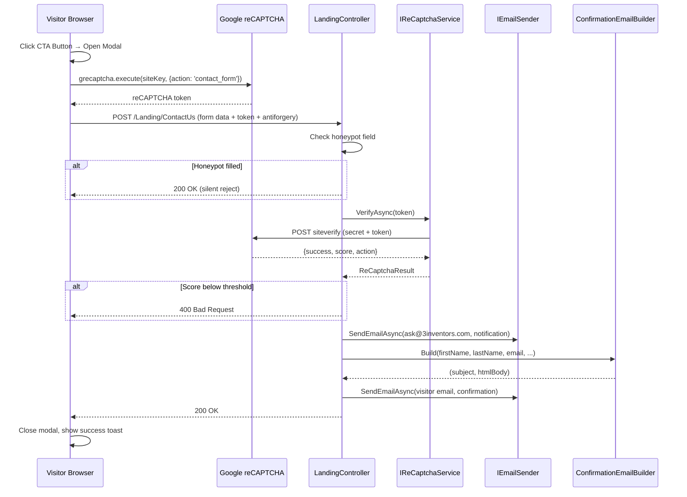
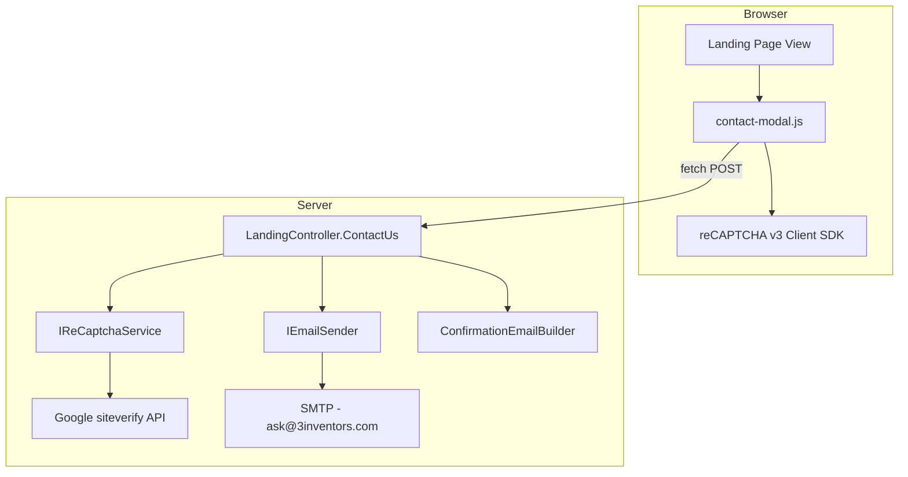

# Design Document: Contact Us Modal

## Overview

This design describes the implementation of a context-aware contact modal on the 3 Inventors Portal landing page. The modal captures visitor inquiries with contextual metadata (inquiry type, industry, pricing plan) and submits them to a new `ContactUs` action on the existing `LandingController`. The system integrates Google reCAPTCHA v3 for invisible bot protection, a honeypot field as a secondary defence layer, and sends branded confirmation emails to visitors and notification emails to the 3 Inventors team.

The feature is entirely self-contained within the landing page — no database tables are required. Form submissions trigger email notifications only; no inquiry data is persisted to the database.

### Key Design Decisions

1. **No database persistence** — Inquiries are forwarded via email only. This keeps the feature lightweight and avoids schema changes for a marketing contact form.
2. **Reuse existing `IEmailSender` with `Ask` department** — The notification email uses the existing `ask@3inventors.com` SMTP account already configured in `appsettings.json`.
3. **Reuse existing `ConfirmationEmailBuilder`** — The confirmation email builder already exists and handles both Demo Request and General Inquiry templates with full HTML-encoding and Outlook-compatible table layouts.
4. **reCAPTCHA verification as an `HttpClient` call** — A dedicated `IReCaptchaService` interface keeps the verification logic testable and decoupled from the controller.
5. **Vanilla JavaScript** — Consistent with the project's existing pattern (no jQuery). The modal logic lives in a dedicated `/js/contact-modal.js` file.
6. **Graceful degradation** — If reCAPTCHA script fails to load, the form still submits (server-side skips verification when secret key is empty).

## Architecture



### Component Diagram



## Components and Interfaces

### 1. ContactUsRequest (ViewModel / DTO)

A model class that binds the incoming form data from the modal.

```csharp
namespace Portal.Web.Models;

public class ContactUsRequest
{
    public string InquiryType { get; set; } = string.Empty;
    public string? CompanyName { get; set; }
    public string FirstName { get; set; } = string.Empty;
    public string? LastName { get; set; }
    public string Email { get; set; } = string.Empty;
    public string? Telephone { get; set; }
    public string? Industry { get; set; }
    public string? Website { get; set; }        // Honeypot field
    public string? RecaptchaToken { get; set; }
}
```

### 2. IReCaptchaService

An interface for verifying reCAPTCHA tokens against Google's API.

```csharp
namespace Portal.Web.Services;

public interface IReCaptchaService
{
    Task<ReCaptchaResult> VerifyAsync(string token);
}

public class ReCaptchaResult
{
    public bool Success { get; set; }
    public double Score { get; set; }
    public string? Action { get; set; }
    public string[]? ErrorCodes { get; set; }
}
```

### 3. ReCaptchaService (Implementation)

Uses `HttpClient` (injected via `IHttpClientFactory`) to POST to Google's siteverify endpoint. Reads `ReCaptcha:SecretKey` from configuration.

```csharp
namespace Portal.Web.Services;

public class ReCaptchaService : IReCaptchaService
{
    private readonly HttpClient _httpClient;
    private readonly string _secretKey;
    private readonly ILogger<ReCaptchaService> _logger;

    public ReCaptchaService(HttpClient httpClient, IConfiguration configuration, ILogger<ReCaptchaService> logger)
    {
        _httpClient = httpClient;
        _secretKey = configuration["ReCaptcha:SecretKey"] ?? string.Empty;
        _logger = logger;
    }

    public async Task<ReCaptchaResult> VerifyAsync(string token)
    {
        var response = await _httpClient.PostAsync(
            "https://www.google.com/recaptcha/api/siteverify",
            new FormUrlEncodedContent(new Dictionary<string, string>
            {
                ["secret"] = _secretKey,
                ["response"] = token
            }));

        var json = await response.Content.ReadFromJsonAsync<GoogleReCaptchaResponse>();
        return new ReCaptchaResult
        {
            Success = json?.Success ?? false,
            Score = json?.Score ?? 0,
            Action = json?.Action,
            ErrorCodes = json?.ErrorCodes
        };
    }
}
```

### 4. LandingController.ContactUs Action

Extends the existing `LandingController` with a new `[HttpPost]` action.

```csharp
[HttpPost]
[ValidateAntiForgeryToken]
[AllowAnonymous]
public async Task<IActionResult> ContactUs([FromForm] ContactUsRequest request)
{
    // 1. Honeypot check (before reCAPTCHA to save API calls)
    // 2. reCAPTCHA verification (skip if SecretKey is empty)
    // 3. Build notification email → send via IEmailSender (Ask department)
    // 4. Build confirmation email via ConfirmationEmailBuilder → send via IEmailSender (Ask department)
    // 5. Return Ok()
}
```

### 5. contact-modal.js (Client-Side Module)

A self-contained JavaScript module that handles:
- Modal open/close with context injection
- Form validation (required fields)
- reCAPTCHA token acquisition
- Form submission via `fetch`
- UI feedback (button states, toast notification)

### 6. Contact Modal Partial View

A Razor partial (`_ContactModal.cshtml`) rendered within the Landing page view, containing the modal HTML structure with form fields, honeypot, and antiforgery token.

## Data Models

### ContactUsRequest Properties

| Property | Type | Required | Source |
|----------|------|----------|--------|
| InquiryType | string | Yes | Hidden field (set by CTA context) |
| CompanyName | string? | No | Text input |
| FirstName | string | Yes | Text input |
| LastName | string? | No | Text input |
| Email | string | Yes | Email input |
| Telephone | string? | No | Tel input |
| Industry | string? | No | Dropdown select |
| Website | string? | No | Honeypot (hidden, off-screen) |
| RecaptchaToken | string? | No | Injected by JS before submit |

### ReCaptcha Configuration (appsettings.json)

```json
{
  "ReCaptcha": {
    "SiteKey": "",
    "SecretKey": "",
    "ScoreThreshold": 0.5
  }
}
```

### Google reCAPTCHA siteverify Response

```csharp
internal class GoogleReCaptchaResponse
{
    [JsonPropertyName("success")]
    public bool Success { get; set; }

    [JsonPropertyName("score")]
    public double Score { get; set; }

    [JsonPropertyName("action")]
    public string? Action { get; set; }

    [JsonPropertyName("error-codes")]
    public string[]? ErrorCodes { get; set; }
}
```

### Modal Context Configuration (JavaScript)

```javascript
const MODAL_CONTEXTS = {
    'Demo Request': {
        badge: 'Demo Request',
        title: 'Request a Demo',
        subtitle: 'See the platform in action. We\'ll walk you through it.'
    },
    'Pricing - Core': {
        badge: 'Core Plan',
        title: 'Interested in the Core plan?',
        subtitle: 'Tell us about your team and we\'ll help you get started.'
    },
    'Pricing - Enhanced': {
        badge: 'Enhanced Plan',
        title: 'Interested in the Enhanced plan?',
        subtitle: 'Tell us about your team and we\'ll help you get started.'
    },
    'Pricing - Enterprise': {
        badge: 'Enterprise Plan',
        title: 'Let\'s tailor a plan for you',
        subtitle: 'Tell us about your organisation and we\'ll build a custom proposal.'
    },
    'General Inquiry': {
        badge: 'Contact Us',
        title: 'Talk to Us',
        subtitle: 'Have a question? We\'ll get back to you within 24 hours.'
    }
};
```

### Industry Dropdown Options

| Value | Display Text |
|-------|-------------|
| (empty) | Select your industry (optional) |
| HORECA | HORECA (Hotels, Restaurants, Cafés) |
| Retail | Retail |
| Warehouse / Logistics | Warehouse / Logistics |
| Manufacturing | Manufacturing |
| Services | Services |
| Office | Office |
| Gym / Fitness | Gym / Fitness |
| Other | Other |


## Correctness Properties

*A property is a characteristic or behavior that should hold true across all valid executions of a system — essentially, a formal statement about what the system should do. Properties serve as the bridge between human-readable specifications and machine-verifiable correctness guarantees.*

### Property 1: Honeypot detection silently rejects and logs

*For any* `ContactUsRequest` where the `Website` (honeypot) field contains a non-empty string, the `ContactUs` action SHALL return HTTP 200 OK, SHALL NOT invoke `IEmailSender`, and SHALL log a warning message containing the word "bot".

**Validates: Requirements 7.1, 7.2**

### Property 2: reCAPTCHA score below threshold returns 400

*For any* reCAPTCHA verification result where `Success` is true but `Score` is strictly less than the configured `ScoreThreshold`, the `ContactUs` action SHALL return HTTP 400 Bad Request.

**Validates: Requirements 6.2**

### Property 3: Valid request sends both notification and confirmation emails

*For any* valid `ContactUsRequest` with an empty honeypot field and a reCAPTCHA score at or above the threshold, the `ContactUs` action SHALL invoke `IEmailSender` exactly twice: once to `ask@3inventors.com` (notification) and once to the visitor's email address (confirmation), and SHALL return HTTP 200 OK.

**Validates: Requirements 8.2, 8.3, 8.6**

### Property 4: Notification email subject and body formatting

*For any* valid `ContactUsRequest` with a non-empty `InquiryType`, the notification email subject SHALL equal `"3 Inventors Portal — {InquiryType}"`, and the HTML body SHALL contain every non-empty submitted field value (FirstName, LastName, Email, CompanyName, Telephone, Industry, InquiryType).

**Validates: Requirements 9.1, 9.3**

### Property 5: Demo confirmation template includes greeting and optional details

*For any* `ContactUsRequest` where `InquiryType` is "Demo Request" and `FirstName` is non-empty, the confirmation email output from `ConfirmationEmailBuilder.Build` SHALL contain the string `"Hi {FirstName},"` and SHALL include each provided optional field (Industry, CompanyName) in the details card while omitting fields that are null or whitespace.

**Validates: Requirements 10.4, 10.5**

### Property 6: General inquiry template subject and details card

*For any* `ContactUsRequest` where `InquiryType` is not "Demo Request" and not in the demo synonyms set, the confirmation email subject from `ConfirmationEmailBuilder.Build` SHALL equal `"3 Inventors — Message Received"`, and the HTML body SHALL include each provided field (FirstName + LastName as Name, Email, CompanyName) in the details card while omitting fields that are null or whitespace.

**Validates: Requirements 11.1, 11.3**

### Property 7: HTML encoding prevents XSS in email templates

*For any* user-provided string containing HTML special characters (`<`, `>`, `&`, `"`, `'`), when passed as any field to `ConfirmationEmailBuilder.Build`, the output HTML body SHALL contain the HTML-encoded representation (e.g., `&lt;`, `&gt;`, `&amp;`) and SHALL NOT contain the raw unencoded characters within attribute values or text content.

**Validates: Requirements 11.6**

### Property 8: No CSS gradients in confirmation emails

*For any* combination of inputs to `ConfirmationEmailBuilder.Build`, the output HTML body SHALL NOT contain the substring `"gradient"` within any `style` attribute, ensuring Outlook rendering compatibility.

**Validates: Requirements 10.8**

## Error Handling

### Client-Side Errors

| Scenario | Handling |
|----------|----------|
| reCAPTCHA script fails to load | Form still renders; `grecaptcha` check fails gracefully; button shows "Verification failed — try again" for 3s |
| reCAPTCHA token request fails | Prevent submission; show "Verification failed — try again" on button for 3s, then revert to "Send Request" |
| Network error during fetch | Catch in `fetch().catch()`; show "Connection error — try again" on button for 3s |
| Server returns 400 | Show "Something went wrong — try again" on button for 3s |
| Server returns 5xx | Same as 400 handling — generic error message |

### Server-Side Errors

| Scenario | Handling |
|----------|----------|
| Honeypot filled | Log warning with `_logger.LogWarning`; return `Ok()` silently (no email sent) |
| reCAPTCHA verification HTTP failure | Log error; return 400 with message "reCAPTCHA verification failed" |
| reCAPTCHA score below threshold | Log warning with score/action; return 400 with message "reCAPTCHA verification failed" |
| reCAPTCHA success=false | Log warning with error codes; return 400 |
| Email sending throws exception | Log error with `_logger.LogError`; return 400 (visitor sees generic error) |
| Missing SecretKey in config | Skip reCAPTCHA verification entirely; process form normally |
| Model binding failure (missing required fields) | ASP.NET Core returns 400 automatically via `[ApiController]` behavior or manual `ModelState` check |

### Logging Strategy

All logging uses Serilog structured logging via `ILogger<LandingController>`:

```csharp
// Honeypot detection
_logger.LogWarning("Honeypot triggered for contact form submission from {Email}", request.Email);

// reCAPTCHA failure
_logger.LogWarning("reCAPTCHA verification failed. Score: {Score}, Success: {Success}, Action: {Action}",
    result.Score, result.Success, result.Action);

// Email failure
_logger.LogError(ex, "Failed to send contact form emails for {Email}", request.Email);

// Successful submission
_logger.LogInformation("Contact form submitted successfully. Type: {InquiryType}, Email: {Email}",
    request.InquiryType, request.Email);
```

## Testing Strategy

### Unit Tests (Example-Based)

Unit tests cover specific scenarios, edge cases, and integration points:

| Test Area | Examples |
|-----------|----------|
| Modal context mapping | Verify each of the 5 inquiry types maps to correct badge/title/subtitle |
| Form validation | Empty first name rejected, invalid email rejected |
| Honeypot check order | Honeypot checked before reCAPTCHA (verify reCAPTCHA service not called) |
| reCAPTCHA skip | Empty SecretKey skips verification |
| reCAPTCHA success=false | Returns 400 |
| Email exception handling | Email throw → 400 response + error logged |
| Notification subject fallback | Empty InquiryType → "3 Inventors Portal — Contact Request" |
| Controller attributes | Verify `[HttpPost]`, `[ValidateAntiForgeryToken]`, `[AllowAnonymous]` via reflection |

### Property-Based Tests

Property-based tests verify universal correctness properties using **FsCheck** (via `FsCheck.Xunit` NuGet package) with the xUnit test framework already used in the project.

**Configuration:**
- Minimum 100 iterations per property test
- Each test tagged with a comment referencing the design property
- Tag format: `Feature: contact-us-modal, Property {number}: {property_text}`

**Properties to implement:**

1. **Honeypot detection** — Generate random non-empty strings for `Website` field; verify 200 + no email calls + warning logged
2. **reCAPTCHA threshold** — Generate random doubles in [0, threshold); verify 400 response
3. **Valid request dual email** — Generate valid requests (empty honeypot, score ≥ threshold); verify exactly 2 email sends
4. **Notification formatting** — Generate random form data; verify subject format and body contains all non-empty fields
5. **Demo template greeting + details** — Generate random first names and optional fields; verify greeting and conditional inclusion
6. **General template subject + details** — Generate random non-demo inquiry types; verify subject and conditional field inclusion
7. **HTML encoding** — Generate strings with HTML special chars; verify encoded output
8. **No gradients** — Generate random input combinations; verify no "gradient" in style attributes

### Integration Tests

| Test | Purpose |
|------|---------|
| Full POST to `/Landing/ContactUs` | End-to-end with mocked `IEmailSender` and `IReCaptchaService` |
| reCAPTCHA service HTTP call | Verify correct payload sent to Google (using `MockHttpMessageHandler`) |
| Antiforgery token validation | Verify POST without token returns 400 |

### Test Project Structure

```
Portal.Tests/
├── Unit/
│   ├── ContactUs/
│   │   ├── ContactUsControllerTests.cs
│   │   ├── ReCaptchaServiceTests.cs
│   │   ├── ConfirmationEmailBuilderTests.cs
│   │   └── NotificationEmailBuilderTests.cs
│   └── ...
├── Properties/
│   ├── ContactUs/
│   │   ├── HoneypotPropertyTests.cs
│   │   ├── ReCaptchaThresholdPropertyTests.cs
│   │   ├── EmailSendingPropertyTests.cs
│   │   ├── NotificationFormattingPropertyTests.cs
│   │   ├── DemoTemplatePropertyTests.cs
│   │   ├── GeneralTemplatePropertyTests.cs
│   │   ├── HtmlEncodingPropertyTests.cs
│   │   └── NoGradientsPropertyTests.cs
│   └── ...
└── Integration/
    └── ContactUs/
        └── ContactUsIntegrationTests.cs
```

### PBT Library

- **Library**: FsCheck.Xunit (NuGet: `FsCheck.Xunit`)
- **Reason**: FsCheck is the most mature property-based testing library for .NET, integrates seamlessly with xUnit, and supports custom generators via `Arb<T>`.
- **Minimum iterations**: 100 per property (configured via `[Property(MaxTest = 100)]`)
