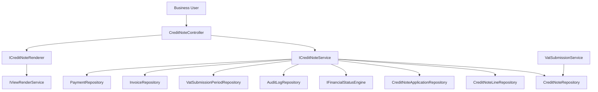
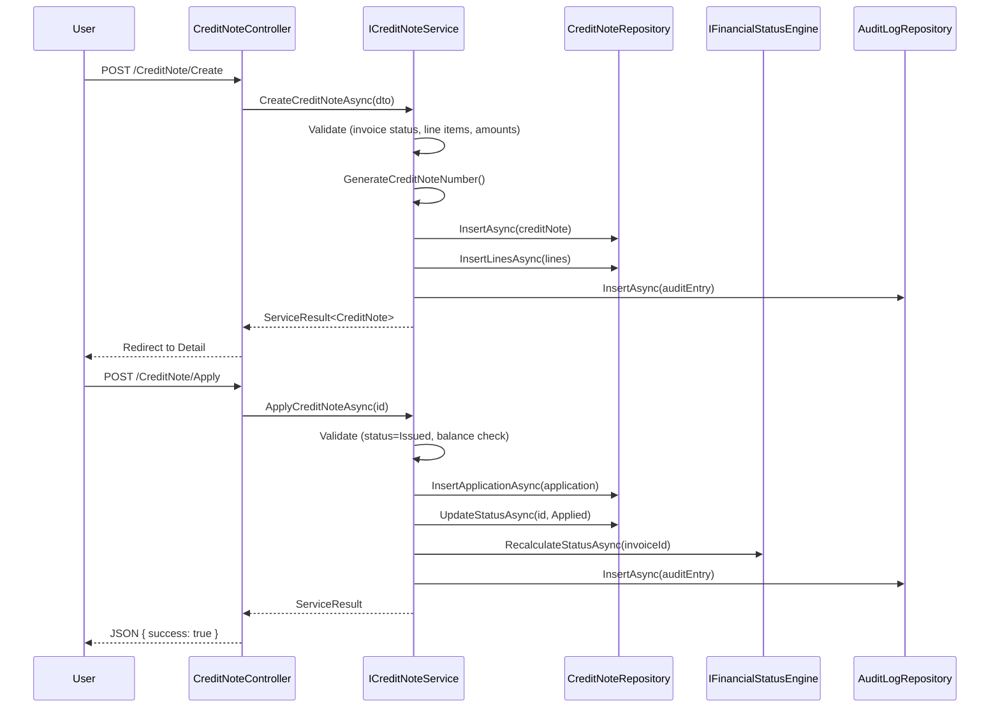

# Design Document: Credit Note Module

## Overview

The Credit Note module introduces a formal credit issuance workflow within the Portal platform. It enables businesses to issue credits against existing invoices, reducing outstanding balances and adjusting Output VAT. The module follows the established Controller → Service → Repository architecture, uses the `[credit]` SQL schema, and integrates with the existing Financial Status Engine, VAT Submission Service, and Audit Log infrastructure.

### Key Design Decisions

1. **Dedicated `[credit]` schema** — Isolates credit note tables from existing schemas, maintaining bounded context separation.
2. **Full-amount application only** — No partial application simplifies state management and reduces edge cases in financial reconciliation.
3. **FinancialStatusEngine extension** — The existing engine is extended to account for applied credit notes in outstanding balance computation rather than creating a parallel calculation path.
4. **PuppeteerSharp PDF generation** — Reuses the same HTML-to-PDF pipeline as Customer Statement (Razor partial → PuppeteerSharp).
5. **Retry-based number generation** — Handles concurrency conflicts on sequential numbering with up to 3 retry attempts.

## Architecture

### System Context Diagram



### Component Interaction Flow



## Components and Interfaces

### ICreditNoteService Interface

```csharp
namespace Portal.Infrastructure.Services;

public interface ICreditNoteService
{
    // Creation
    Task<ServiceResult<int>> CreateCreditNoteAsync(CreateCreditNoteDto dto, string userId);
    Task<ServiceResult> UpdateCreditNoteAsync(int creditNoteId, UpdateCreditNoteDto dto);

    // Lifecycle
    Task<ServiceResult> IssueCreditNoteAsync(int creditNoteId, string userId);
    Task<ServiceResult> ApplyCreditNoteAsync(int creditNoteId, string userId);
    Task<ServiceResult> VoidCreditNoteAsync(int creditNoteId, string userId);

    // Queries
    Task<PagedResult<CreditNoteListDto>> GetCreditNotesPagedAsync(
        CreditNoteFilterDto filter, int page, int pageSize = 10);
    Task<CreditNoteDetailDto?> GetCreditNoteDetailAsync(int creditNoteId);
    Task<CreditNoteKpiDto> GetKpiAsync();

    // Helpers
    Task<decimal> GetInvoiceOutstandingBalanceAsync(int invoiceId);
    Task<List<EligibleInvoiceDto>> GetEligibleInvoicesAsync();
}
```

### CreditNoteController

```csharp
namespace Portal.Web.Controllers;

[Authorize]
[ModuleAccess(PortalModules.Invoice)]
public class CreditNoteController : Controller
{
    // GET  /CreditNote              → Index (list view with KPIs, filters, pagination)
    // GET  /CreditNote/Create       → Create form
    // POST /CreditNote/Create       → Submit new credit note
    // GET  /CreditNote/Detail/{id}  → Detail view
    // GET  /CreditNote/Edit/{id}    → Edit form (Draft only)
    // POST /CreditNote/Edit/{id}    → Submit edits
    // POST /CreditNote/Issue        → Transition Draft → Issued
    // POST /CreditNote/Apply        → Apply to invoice
    // POST /CreditNote/Void         → Void credit note
    // GET  /CreditNote/PreviewPdf   → Generate and download PDF
    // GET  /CreditNote/GetInvoiceBalance → AJAX: get outstanding balance
    // GET  /CreditNote/GetEligibleInvoices → AJAX: eligible invoices dropdown
}
```

### CreditNoteRepository

```csharp
namespace Portal.Infrastructure.Repositories;

public class CreditNoteRepository : GenericStoredProcedureRepository<CreditNote>
{
    // InsertAsync(CreditNote entity) → int (OUTPUT INSERTED.Id)
    // GetByIdAndBusinessIdAsync(int id, int businessId) → CreditNote?
    // UpdateStatusAsync(int id, int newStatusId, DateTime? issuedAtUtc, DateTime? voidedAtUtc)
    // GetHighestNumberForYearAsync(int businessId, int year) → int?
    // GetPagedAsync(int businessId, CreditNoteFilterDto filter, int offset, int pageSize)
    //     → (List<CreditNoteListDto> Items, int TotalCount)
    // GetKpiDataAsync(int businessId, DateTime monthStart) → CreditNoteKpiDto
    // GetTotalAppliedCreditAsync(int invoiceId, int businessId) → decimal
    // UpdateAsync(CreditNote entity)
}
```

### CreditNoteLineRepository

```csharp
namespace Portal.Infrastructure.Repositories;

public class CreditNoteLineRepository : GenericStoredProcedureRepository<CreditNoteLine>
{
    // InsertBatchAsync(List<CreditNoteLine> lines)
    // GetByCreditNoteIdAsync(int creditNoteId) → List<CreditNoteLine>
    // DeleteByCreditNoteIdAsync(int creditNoteId)
}
```

### CreditNoteApplicationRepository

```csharp
namespace Portal.Infrastructure.Repositories;

public class CreditNoteApplicationRepository : GenericStoredProcedureRepository<CreditNoteApplication>
{
    // InsertAsync(CreditNoteApplication entity) → int
    // GetByCreditNoteIdAsync(int creditNoteId) → List<CreditNoteApplication>
    // VoidByCreditNoteIdAsync(int creditNoteId)
}
```

### ICreditNoteRenderer

```csharp
namespace Portal.Web.Services;

public interface ICreditNoteRenderer
{
    Task<string> RenderAsync(CreditNotePdfModel model);
}

public class CreditNoteRenderer : ICreditNoteRenderer
{
    private readonly IViewRenderService _viewRenderService;

    public CreditNoteRenderer(IViewRenderService viewRenderService)
    {
        _viewRenderService = viewRenderService;
    }

    public async Task<string> RenderAsync(CreditNotePdfModel model)
    {
        return await _viewRenderService.RenderViewToStringAsync(
            "~/Views/CreditNote/_CreditNotePdf.cshtml", model);
    }
}
```

### FinancialStatusEngine Extension

The existing `FinancialStatusEngine.ComputeOutstandingBalance` must be extended to subtract applied credit note amounts:

```csharp
// Updated signature
decimal ComputeOutstandingBalance(decimal totalAmount, IEnumerable<Payment> payments, decimal appliedCreditTotal);

// Implementation
public decimal ComputeOutstandingBalance(decimal totalAmount, IEnumerable<Payment> payments, decimal appliedCreditTotal)
{
    var validPaymentSum = payments.Where(p => !p.IsVoided).Sum(p => p.Amount);
    return totalAmount - validPaymentSum - appliedCreditTotal;
}
```

The `RecalculateStatusAsync` method is updated to fetch applied credit totals from `CreditNoteRepository.GetTotalAppliedCreditAsync()` and pass them to the computation.

### VatSubmissionService Integration

The `VatSubmissionService.CreateOrRecalculateAsync` method is extended to subtract credit note TaxAmount from Output VAT:

```csharp
// After computing totalOutputVat from invoices:
var creditNoteTaxReduction = await _portalDbContext.CreditNotes
    .Where(cn => cn.BusinessId == businessId
        && cn.VatSubmissionPeriodId == vatSubmissionPeriodId
        && (cn.CreditNoteStatusTypeId == 2 || cn.CreditNoteStatusTypeId == 3)) // Issued or Applied
    .SumAsync(cn => (decimal?)cn.TaxAmount) ?? 0m;

var totalOutputVat = explicitOutputVat + dateRangeOutputVat - creditNoteTaxReduction;
```

## Data Models

### Database Schema — `[credit]` Schema

#### Migration: 062_CreateCreditSchema.sql

```sql
IF NOT EXISTS (SELECT 1 FROM sys.schemas WHERE name = 'credit')
BEGIN
    EXEC('CREATE SCHEMA [credit]');
END
GO
```

#### Migration: 063_CreateCreditNoteStatusTypeTable.sql

```sql
CREATE TABLE [credit].[CreditNoteStatusType]
(
    [Id]   INT          NOT NULL,
    [Name] NVARCHAR(50) NOT NULL,
    CONSTRAINT [PK_CreditNoteStatusType] PRIMARY KEY ([Id])
);
GO

INSERT INTO [credit].[CreditNoteStatusType] ([Id], [Name])
VALUES (1, 'Draft'), (2, 'Issued'), (3, 'Applied'), (4, 'Voided');
GO
```

#### Migration: 064_CreateCreditNoteTable.sql

```sql
CREATE TABLE [credit].[CreditNote]
(
    [Id]                       INT             IDENTITY(1,1) NOT NULL,
    [BusinessId]               INT             NOT NULL,
    [InvoiceId]                INT             NOT NULL,
    [CustomerId]               INT             NOT NULL,
    [CreditNoteStatusTypeId]   INT             NOT NULL DEFAULT 1,
    [VatSubmissionPeriodId]    INT             NOT NULL,
    [CreditNoteNumber]         NVARCHAR(20)    NOT NULL,
    [IssueDate]                DATE            NOT NULL,
    [Reason]                   NVARCHAR(1000)  NOT NULL,
    [Subtotal]                 DECIMAL(18,2)   NOT NULL,
    [TaxAmount]                DECIMAL(18,2)   NOT NULL,
    [TotalAmount]              DECIMAL(18,2)   NOT NULL,
    [IssuedAtUtc]              DATETIME        NULL,
    [VoidedAtUtc]              DATETIME        NULL,
    [CreatedByUserId]          NVARCHAR(450)   NULL,
    [CreatedAtUtc]             DATETIME        NOT NULL DEFAULT GETUTCDATE(),
    CONSTRAINT [PK_CreditNote] PRIMARY KEY ([Id]),
    CONSTRAINT [FK_CreditNote_Business] FOREIGN KEY ([BusinessId])
        REFERENCES [portal].[Business]([Id]),
    CONSTRAINT [FK_CreditNote_Invoice] FOREIGN KEY ([InvoiceId])
        REFERENCES [invoice].[Invoice]([Id]),
    CONSTRAINT [FK_CreditNote_Customer] FOREIGN KEY ([CustomerId])
        REFERENCES [customer].[Customer]([Id]),
    CONSTRAINT [FK_CreditNote_StatusType] FOREIGN KEY ([CreditNoteStatusTypeId])
        REFERENCES [credit].[CreditNoteStatusType]([Id]),
    CONSTRAINT [FK_CreditNote_VatPeriod] FOREIGN KEY ([VatSubmissionPeriodId])
        REFERENCES [vat].[VatSubmissionPeriod]([Id])
);
GO

CREATE INDEX [IX_CreditNote_BusinessId] ON [credit].[CreditNote]([BusinessId]);
CREATE INDEX [IX_CreditNote_InvoiceId] ON [credit].[CreditNote]([InvoiceId]);
CREATE UNIQUE INDEX [UX_CreditNote_BusinessId_CreditNoteNumber]
    ON [credit].[CreditNote]([BusinessId], [CreditNoteNumber])
    WHERE [CreditNoteStatusTypeId] <> 4;
GO
```

#### Migration: 065_CreateCreditNoteLineTable.sql

```sql
CREATE TABLE [credit].[CreditNoteLine]
(
    [Id]            INT             IDENTITY(1,1) NOT NULL,
    [CreditNoteId]  INT             NOT NULL,
    [Description]   NVARCHAR(500)   NOT NULL,
    [Quantity]       DECIMAL(18,4)   NOT NULL,
    [UnitPrice]      DECIMAL(18,2)   NOT NULL,
    [VatRate]        DECIMAL(5,2)    NOT NULL,
    [LineTotal]      DECIMAL(18,2)   NOT NULL,
    [SortOrder]      INT             NOT NULL DEFAULT 0,
    CONSTRAINT [PK_CreditNoteLine] PRIMARY KEY ([Id]),
    CONSTRAINT [FK_CreditNoteLine_CreditNote] FOREIGN KEY ([CreditNoteId])
        REFERENCES [credit].[CreditNote]([Id]) ON DELETE CASCADE
);
GO

CREATE INDEX [IX_CreditNoteLine_CreditNoteId] ON [credit].[CreditNoteLine]([CreditNoteId]);
GO
```

#### Migration: 066_CreateCreditNoteApplicationTable.sql

```sql
CREATE TABLE [credit].[CreditNoteApplication]
(
    [Id]              INT           IDENTITY(1,1) NOT NULL,
    [CreditNoteId]    INT           NOT NULL,
    [InvoiceId]       INT           NOT NULL,
    [AmountApplied]   DECIMAL(18,2) NOT NULL,
    [AppliedAtUtc]    DATETIME      NOT NULL DEFAULT GETUTCDATE(),
    [AppliedByUserId] NVARCHAR(450) NULL,
    [IsVoided]        BIT           NOT NULL DEFAULT 0,
    [CreatedAtUtc]    DATETIME      NOT NULL DEFAULT GETUTCDATE(),
    CONSTRAINT [PK_CreditNoteApplication] PRIMARY KEY ([Id]),
    CONSTRAINT [FK_CreditNoteApplication_CreditNote] FOREIGN KEY ([CreditNoteId])
        REFERENCES [credit].[CreditNote]([Id]),
    CONSTRAINT [FK_CreditNoteApplication_Invoice] FOREIGN KEY ([InvoiceId])
        REFERENCES [invoice].[Invoice]([Id])
);
GO

CREATE INDEX [IX_CreditNoteApplication_CreditNoteId]
    ON [credit].[CreditNoteApplication]([CreditNoteId]);
CREATE INDEX [IX_CreditNoteApplication_InvoiceId]
    ON [credit].[CreditNoteApplication]([InvoiceId]);
GO
```

### Entity Classes

#### CreditNoteStatusType

```csharp
namespace Portal.Infrastructure.Entities;

public class CreditNoteStatusType
{
    public int Id { get; set; }
    public string Name { get; set; } = null!;
    public ICollection<CreditNote> CreditNotes { get; set; } = new List<CreditNote>();
}
```

#### CreditNote

```csharp
namespace Portal.Infrastructure.Entities;

public class CreditNote
{
    public int Id { get; set; }
    public int BusinessId { get; set; }
    public int InvoiceId { get; set; }
    public int CustomerId { get; set; }
    public int CreditNoteStatusTypeId { get; set; }
    public int VatSubmissionPeriodId { get; set; }
    public string CreditNoteNumber { get; set; } = null!;
    public DateOnly IssueDate { get; set; }
    public string Reason { get; set; } = null!;
    public decimal Subtotal { get; set; }
    public decimal TaxAmount { get; set; }
    public decimal TotalAmount { get; set; }
    public DateTime? IssuedAtUtc { get; set; }
    public DateTime? VoidedAtUtc { get; set; }
    public string? CreatedByUserId { get; set; }
    public DateTime CreatedAtUtc { get; set; }

    // Navigation properties
    public Business Business { get; set; } = null!;
    public Invoice Invoice { get; set; } = null!;
    public Customer Customer { get; set; } = null!;
    public CreditNoteStatusType CreditNoteStatusType { get; set; } = null!;
    public VatSubmissionPeriod VatSubmissionPeriod { get; set; } = null!;
    public ICollection<CreditNoteLine> CreditNoteLines { get; set; } = new List<CreditNoteLine>();
    public ICollection<CreditNoteApplication> CreditNoteApplications { get; set; } = new List<CreditNoteApplication>();
}
```

#### CreditNoteLine

```csharp
namespace Portal.Infrastructure.Entities;

public class CreditNoteLine
{
    public int Id { get; set; }
    public int CreditNoteId { get; set; }
    public string Description { get; set; } = null!;
    public decimal Quantity { get; set; }
    public decimal UnitPrice { get; set; }
    public decimal VatRate { get; set; }
    public decimal LineTotal { get; set; }
    public int SortOrder { get; set; }

    // Navigation properties
    public CreditNote CreditNote { get; set; } = null!;
}
```

#### CreditNoteApplication

```csharp
namespace Portal.Infrastructure.Entities;

public class CreditNoteApplication
{
    public int Id { get; set; }
    public int CreditNoteId { get; set; }
    public int InvoiceId { get; set; }
    public decimal AmountApplied { get; set; }
    public DateTime AppliedAtUtc { get; set; }
    public string? AppliedByUserId { get; set; }
    public bool IsVoided { get; set; }
    public DateTime CreatedAtUtc { get; set; }

    // Navigation properties
    public CreditNote CreditNote { get; set; } = null!;
    public Invoice Invoice { get; set; } = null!;
}
```

### DTO Models

```csharp
namespace Portal.Infrastructure.Models;

public class CreateCreditNoteDto
{
    public int InvoiceId { get; set; }
    public DateOnly IssueDate { get; set; }
    public string Reason { get; set; } = null!;
    public int VatSubmissionPeriodId { get; set; }
    public List<CreateCreditNoteLineDto> Lines { get; set; } = new();
}

public class CreateCreditNoteLineDto
{
    public string Description { get; set; } = null!;
    public decimal Quantity { get; set; }
    public decimal UnitPrice { get; set; }
    public decimal VatRate { get; set; }
}

public class UpdateCreditNoteDto
{
    public DateOnly IssueDate { get; set; }
    public string Reason { get; set; } = null!;
    public int VatSubmissionPeriodId { get; set; }
    public List<CreateCreditNoteLineDto> Lines { get; set; } = new();
}

public class CreditNoteListDto
{
    public int Id { get; set; }
    public string CreditNoteNumber { get; set; } = null!;
    public string CustomerName { get; set; } = null!;
    public string InvoiceNumber { get; set; } = null!;
    public DateOnly IssueDate { get; set; }
    public decimal TotalAmount { get; set; }
    public int CreditNoteStatusTypeId { get; set; }
    public string StatusName { get; set; } = null!;
    public string Reason { get; set; } = null!;
}

public class CreditNoteDetailDto
{
    public int Id { get; set; }
    public string CreditNoteNumber { get; set; } = null!;
    public string CustomerName { get; set; } = null!;
    public int CustomerId { get; set; }
    public int InvoiceId { get; set; }
    public string InvoiceNumber { get; set; } = null!;
    public DateOnly IssueDate { get; set; }
    public string Reason { get; set; } = null!;
    public int CreditNoteStatusTypeId { get; set; }
    public string StatusName { get; set; } = null!;
    public string VatPeriodLabel { get; set; } = null!;
    public int VatSubmissionPeriodId { get; set; }
    public decimal Subtotal { get; set; }
    public decimal TaxAmount { get; set; }
    public decimal TotalAmount { get; set; }
    public List<CreditNoteLineDto> Lines { get; set; } = new();
    public List<CreditNoteApplicationDto> Applications { get; set; } = new();
}

public class CreditNoteLineDto
{
    public int Id { get; set; }
    public string Description { get; set; } = null!;
    public decimal Quantity { get; set; }
    public decimal UnitPrice { get; set; }
    public decimal VatRate { get; set; }
    public decimal LineTotal { get; set; }
}

public class CreditNoteApplicationDto
{
    public int Id { get; set; }
    public DateTime AppliedAtUtc { get; set; }
    public string InvoiceNumber { get; set; } = null!;
    public int InvoiceId { get; set; }
    public decimal AmountApplied { get; set; }
    public string AppliedByUserId { get; set; } = null!;
    public bool IsVoided { get; set; }
}

public class CreditNoteKpiDto
{
    public int TotalIssuedCount { get; set; }
    public decimal TotalValue { get; set; }
    public int PendingApplicationCount { get; set; }
}

public class CreditNoteFilterDto
{
    public int? StatusId { get; set; }
    public int? CustomerId { get; set; }
    public DateOnly? FromDate { get; set; }
    public DateOnly? ToDate { get; set; }
    public string? SearchTerm { get; set; }
}

public class EligibleInvoiceDto
{
    public int Id { get; set; }
    public string InvoiceNumber { get; set; } = null!;
    public string CustomerName { get; set; } = null!;
    public int CustomerId { get; set; }
    public decimal TotalAmount { get; set; }
    public decimal OutstandingBalance { get; set; }
}

public class CreditNotePdfModel
{
    public string BusinessName { get; set; } = null!;
    public string? BusinessAddress { get; set; }
    public string? BusinessVatNumber { get; set; }
    public string? BusinessLogoUrl { get; set; }
    public string CustomerName { get; set; } = null!;
    public string? CustomerAddress { get; set; }
    public string CreditNoteNumber { get; set; } = null!;
    public DateOnly IssueDate { get; set; }
    public string InvoiceNumber { get; set; } = null!;
    public string Reason { get; set; } = null!;
    public string CurrencySymbol { get; set; } = "€";
    public decimal Subtotal { get; set; }
    public decimal TaxAmount { get; set; }
    public decimal TotalAmount { get; set; }
    public List<CreditNoteLineDto> Lines { get; set; } = new();
}
```

### EF Core Configuration (PortalDbContext)

```csharp
// Add to PortalDbContext DbSet declarations:
public DbSet<CreditNoteStatusType> CreditNoteStatusTypes { get; set; } = null!;
public DbSet<CreditNote> CreditNotes { get; set; } = null!;
public DbSet<CreditNoteLine> CreditNoteLines { get; set; } = null!;
public DbSet<CreditNoteApplication> CreditNoteApplications { get; set; } = null!;

// Configuration method:
private static void ConfigureCreditNoteStatusType(ModelBuilder modelBuilder)
{
    modelBuilder.Entity<CreditNoteStatusType>(entity =>
    {
        entity.ToTable("CreditNoteStatusType", "credit");
        entity.HasKey(e => e.Id);
        entity.Property(e => e.Name).IsRequired().HasMaxLength(50);
        entity.HasData(
            new CreditNoteStatusType { Id = 1, Name = "Draft" },
            new CreditNoteStatusType { Id = 2, Name = "Issued" },
            new CreditNoteStatusType { Id = 3, Name = "Applied" },
            new CreditNoteStatusType { Id = 4, Name = "Voided" }
        );
    });
}

private static void ConfigureCreditNote(ModelBuilder modelBuilder)
{
    modelBuilder.Entity<CreditNote>(entity =>
    {
        entity.ToTable("CreditNote", "credit");
        entity.HasKey(e => e.Id);

        entity.HasOne(e => e.Business).WithMany()
            .HasForeignKey(e => e.BusinessId).OnDelete(DeleteBehavior.ClientSetNull);
        entity.HasOne(e => e.Invoice).WithMany()
            .HasForeignKey(e => e.InvoiceId).OnDelete(DeleteBehavior.ClientSetNull);
        entity.HasOne(e => e.Customer).WithMany()
            .HasForeignKey(e => e.CustomerId).OnDelete(DeleteBehavior.ClientSetNull);
        entity.HasOne(e => e.CreditNoteStatusType).WithMany(s => s.CreditNotes)
            .HasForeignKey(e => e.CreditNoteStatusTypeId).OnDelete(DeleteBehavior.ClientSetNull);
        entity.HasOne(e => e.VatSubmissionPeriod).WithMany()
            .HasForeignKey(e => e.VatSubmissionPeriodId).OnDelete(DeleteBehavior.ClientSetNull);

        entity.HasIndex(e => e.BusinessId).HasDatabaseName("IX_CreditNote_BusinessId");
        entity.HasIndex(e => e.InvoiceId).HasDatabaseName("IX_CreditNote_InvoiceId");
        entity.HasIndex(e => new { e.BusinessId, e.CreditNoteNumber })
            .IsUnique()
            .HasDatabaseName("UX_CreditNote_BusinessId_CreditNoteNumber")
            .HasFilter("[CreditNoteStatusTypeId] <> 4");

        entity.Property(e => e.CreditNoteNumber).IsRequired().HasMaxLength(20);
        entity.Property(e => e.Reason).IsRequired().HasMaxLength(1000);
        entity.Property(e => e.Subtotal).HasPrecision(18, 2);
        entity.Property(e => e.TaxAmount).HasPrecision(18, 2);
        entity.Property(e => e.TotalAmount).HasPrecision(18, 2);
        entity.Property(e => e.CreatedByUserId).HasMaxLength(450);
        entity.Property(e => e.CreatedAtUtc).IsRequired().HasDefaultValueSql("GETUTCDATE()");
    });
}

private static void ConfigureCreditNoteLine(ModelBuilder modelBuilder)
{
    modelBuilder.Entity<CreditNoteLine>(entity =>
    {
        entity.ToTable("CreditNoteLine", "credit");
        entity.HasKey(e => e.Id);

        entity.HasOne(e => e.CreditNote).WithMany(cn => cn.CreditNoteLines)
            .HasForeignKey(e => e.CreditNoteId).OnDelete(DeleteBehavior.Cascade);

        entity.Property(e => e.Description).IsRequired().HasMaxLength(500);
        entity.Property(e => e.Quantity).HasPrecision(18, 4);
        entity.Property(e => e.UnitPrice).HasPrecision(18, 2);
        entity.Property(e => e.VatRate).HasPrecision(5, 2);
        entity.Property(e => e.LineTotal).HasPrecision(18, 2);
    });
}

private static void ConfigureCreditNoteApplication(ModelBuilder modelBuilder)
{
    modelBuilder.Entity<CreditNoteApplication>(entity =>
    {
        entity.ToTable("CreditNoteApplication", "credit");
        entity.HasKey(e => e.Id);

        entity.HasOne(e => e.CreditNote).WithMany(cn => cn.CreditNoteApplications)
            .HasForeignKey(e => e.CreditNoteId).OnDelete(DeleteBehavior.ClientSetNull);
        entity.HasOne(e => e.Invoice).WithMany()
            .HasForeignKey(e => e.InvoiceId).OnDelete(DeleteBehavior.ClientSetNull);

        entity.HasIndex(e => e.CreditNoteId)
            .HasDatabaseName("IX_CreditNoteApplication_CreditNoteId");
        entity.HasIndex(e => e.InvoiceId)
            .HasDatabaseName("IX_CreditNoteApplication_InvoiceId");

        entity.Property(e => e.AmountApplied).HasPrecision(18, 2);
        entity.Property(e => e.IsVoided).IsRequired().HasDefaultValue(false);
        entity.Property(e => e.AppliedByUserId).HasMaxLength(450);
        entity.Property(e => e.CreatedAtUtc).IsRequired().HasDefaultValueSql("GETUTCDATE()");
    });
}
```

### Service Logic — Key Algorithms

#### Credit Note Number Generation

```csharp
private async Task<string> GenerateCreditNoteNumberAsync(int businessId, DateOnly issueDate)
{
    int year = issueDate.Year;
    int? highestNumber = await _creditNoteRepository.GetHighestNumberForYearAsync(businessId, year);
    int nextNumber = (highestNumber ?? 0) + 1;

    if (nextNumber > 9999)
        throw new InvalidOperationException("Annual credit note limit (9999) reached for this year.");

    return $"CN-{year}-{nextNumber:D4}";
}
```

#### Validation Pipeline

```csharp
private List<string> ValidateCreditNote(CreateCreditNoteDto dto, Invoice invoice, decimal outstandingBalance)
{
    var errors = new List<string>();

    // Invoice status check
    if (invoice.InvoiceStatusTypeId != 2)
        errors.Add("Credit notes can only be raised against invoices in Issued status.");

    // Reason validation
    if (string.IsNullOrWhiteSpace(dto.Reason))
        errors.Add("A reason is required.");
    else if (dto.Reason.Length > 1000)
        errors.Add("Reason must not exceed 1000 characters.");

    // Line items validation
    if (dto.Lines.Count == 0)
        errors.Add("At least one line item is required.");
    if (dto.Lines.Count > 50)
        errors.Add("Maximum of 50 line items exceeded.");

    foreach (var line in dto.Lines)
    {
        if (string.IsNullOrWhiteSpace(line.Description))
            errors.Add("Each line item must have a description.");
        else if (line.Description.Length > 500)
            errors.Add($"Line description must not exceed 500 characters.");

        if (line.Quantity <= 0 || line.Quantity > 999_999)
            errors.Add($"Quantity must be between 0.0001 and 999,999.");

        if (line.UnitPrice <= 0 || line.UnitPrice > 999_999_999.99m)
            errors.Add($"Unit price must be between 0.01 and 999,999,999.99.");

        if (line.VatRate < 0 || line.VatRate > 100)
            errors.Add($"VAT rate must be between 0 and 100.");
    }

    // Total amount vs outstanding balance
    if (errors.Count == 0)
    {
        var computedTotal = ComputeTotalAmount(dto.Lines);
        if (computedTotal > outstandingBalance)
            errors.Add($"Credit note total ({computedTotal:F2}) exceeds the available balance ({outstandingBalance:F2}).");
    }

    return errors;
}
```

#### Amount Computation

```csharp
private (decimal Subtotal, decimal TaxAmount, decimal TotalAmount) ComputeAmounts(
    List<CreateCreditNoteLineDto> lines)
{
    decimal subtotal = 0m;
    decimal taxAmount = 0m;

    foreach (var line in lines)
    {
        decimal lineTotal = line.Quantity * line.UnitPrice;
        decimal lineTax = lineTotal * line.VatRate / 100m;
        subtotal += lineTotal;
        taxAmount += lineTax;
    }

    return (subtotal, taxAmount, subtotal + taxAmount);
}
```

#### Lifecycle State Machine

```csharp
private static readonly Dictionary<int, HashSet<int>> AllowedTransitions = new()
{
    { 1, new HashSet<int> { 2, 4 } },  // Draft → Issued, Draft → Voided
    { 2, new HashSet<int> { 3, 4 } },  // Issued → Applied, Issued → Voided
    { 3, new HashSet<int> { 4 } },     // Applied → Voided
    { 4, new HashSet<int>() }           // Voided → (terminal)
};

private bool IsTransitionAllowed(int currentStatus, int targetStatus)
{
    return AllowedTransitions.TryGetValue(currentStatus, out var allowed)
        && allowed.Contains(targetStatus);
}
```

#### Outstanding Balance Computation (for credit note context)

```csharp
public async Task<decimal> GetInvoiceOutstandingBalanceAsync(int invoiceId)
{
    var invoice = await _invoiceRepository.GetByIdAndBusinessIdAsync(invoiceId, _tenantService.CurrentBusinessId);
    if (invoice == null) return 0m;

    var totalPaid = await _paymentRepository.GetTotalPaidAsync(invoiceId, _tenantService.CurrentBusinessId);
    var totalCredited = await _creditNoteRepository.GetTotalAppliedCreditAsync(invoiceId, _tenantService.CurrentBusinessId);

    return invoice.TotalAmount - totalPaid - totalCredited;
}
```

#### Apply Credit Note (Transactional)

```csharp
public async Task<ServiceResult> ApplyCreditNoteAsync(int creditNoteId, string userId)
{
    using var transaction = await _dbContext.Database.BeginTransactionAsync();
    try
    {
        var creditNote = await _creditNoteRepository.GetByIdAndBusinessIdAsync(
            creditNoteId, _tenantService.CurrentBusinessId);

        if (creditNote == null) return ServiceResult.Fail("Credit note not found.");
        if (creditNote.CreditNoteStatusTypeId != 2)
            return ServiceResult.Fail("Only credit notes in Issued status may be applied.");

        var outstandingBalance = await GetInvoiceOutstandingBalanceAsync(creditNote.InvoiceId);
        if (creditNote.TotalAmount > outstandingBalance)
            return ServiceResult.Fail("Credit note amount exceeds the remaining invoice balance.");

        // Check invoice financial status eligibility
        var invoice = await _invoiceRepository.GetByIdAndBusinessIdAsync(
            creditNote.InvoiceId, _tenantService.CurrentBusinessId);
        if (invoice!.InvoiceFinancialStatusTypeId is 3 or 5)
            return ServiceResult.Fail("Invoice is not eligible for credit note application.");

        // Create application record
        var application = new CreditNoteApplication
        {
            CreditNoteId = creditNoteId,
            InvoiceId = creditNote.InvoiceId,
            AmountApplied = creditNote.TotalAmount,
            AppliedAtUtc = DateTime.UtcNow,
            AppliedByUserId = userId,
            IsVoided = false
        };
        await _creditNoteApplicationRepository.InsertAsync(application);

        // Transition to Applied
        await _creditNoteRepository.UpdateStatusAsync(creditNoteId, 3, null, null);

        // Recalculate invoice financial status
        await _financialStatusEngine.RecalculateStatusAsync(
            creditNote.InvoiceId, _tenantService.CurrentBusinessId);

        // Audit log
        await _auditLogRepository.InsertAsync(new AuditLog
        {
            BusinessId = _tenantService.CurrentBusinessId,
            UserId = userId,
            Action = "CreditNoteApplied",
            TableName = "CreditNote",
            RecordId = creditNoteId.ToString(),
            NewValues = $"InvoiceId={creditNote.InvoiceId}, Amount={creditNote.TotalAmount}",
            Timestamp = DateTime.UtcNow
        });

        await transaction.CommitAsync();
        return ServiceResult.Ok();
    }
    catch
    {
        await transaction.RollbackAsync();
        throw;
    }
}
```

#### Void Credit Note (Transactional with Financial Reversal)

```csharp
public async Task<ServiceResult> VoidCreditNoteAsync(int creditNoteId, string userId)
{
    using var transaction = await _dbContext.Database.BeginTransactionAsync();
    try
    {
        var creditNote = await _creditNoteRepository.GetByIdAndBusinessIdAsync(
            creditNoteId, _tenantService.CurrentBusinessId);

        if (creditNote == null) return ServiceResult.Fail("Credit note not found.");
        if (creditNote.CreditNoteStatusTypeId == 4)
            return ServiceResult.Fail("Credit note is already voided.");
        if (!IsTransitionAllowed(creditNote.CreditNoteStatusTypeId, 4))
            return ServiceResult.Fail("Credit note cannot be voided in its current status.");

        // VAT period lock check
        var vatPeriodSubmission = await _vatSubmissionRepository
            .GetByPeriodIdAndBusinessIdAsync(creditNote.VatSubmissionPeriodId, _tenantService.CurrentBusinessId);
        if (vatPeriodSubmission != null && vatPeriodSubmission.IsSubmitted
            && creditNote.CreditNoteStatusTypeId != 1) // Draft can always be voided
            return ServiceResult.Fail("Cannot void: the assigned VAT period has been submitted.");

        bool wasApplied = creditNote.CreditNoteStatusTypeId == 3;

        // If previously applied, reverse financial impact
        if (wasApplied)
        {
            await _creditNoteApplicationRepository.VoidByCreditNoteIdAsync(creditNoteId);
            await _financialStatusEngine.RecalculateStatusAsync(
                creditNote.InvoiceId, _tenantService.CurrentBusinessId);

            // Audit: reversal
            await _auditLogRepository.InsertAsync(new AuditLog
            {
                BusinessId = _tenantService.CurrentBusinessId,
                UserId = userId,
                Action = "CreditNoteReversed",
                TableName = "CreditNote",
                RecordId = creditNoteId.ToString(),
                NewValues = $"InvoiceId={creditNote.InvoiceId}, ReversedAmount={creditNote.TotalAmount}",
                Timestamp = DateTime.UtcNow
            });
        }

        // Transition to Voided
        await _creditNoteRepository.UpdateStatusAsync(creditNoteId, 4, null, DateTime.UtcNow);

        // Audit: status change
        await _auditLogRepository.InsertAsync(new AuditLog
        {
            BusinessId = _tenantService.CurrentBusinessId,
            UserId = userId,
            Action = "CreditNoteStatusChanged",
            TableName = "CreditNote",
            RecordId = creditNoteId.ToString(),
            OldValues = $"Status={creditNote.CreditNoteStatusTypeId}",
            NewValues = $"Status=4",
            Timestamp = DateTime.UtcNow
        });

        await transaction.CommitAsync();
        return ServiceResult.Ok();
    }
    catch
    {
        await transaction.RollbackAsync();
        throw;
    }
}
```

#### KPI Computation

```csharp
public async Task<CreditNoteKpiDto> GetKpiAsync()
{
    var businessId = _tenantService.CurrentBusinessId;
    var monthStart = new DateTime(DateTime.UtcNow.Year, DateTime.UtcNow.Month, 1, 0, 0, 0, DateTimeKind.Utc);

    return await _creditNoteRepository.GetKpiDataAsync(businessId, monthStart);
}
```

Repository KPI query:
```sql
-- Total Issued (this month, status 2 or 3)
SELECT COUNT(*) FROM [credit].[CreditNote]
WHERE [credit].[CreditNote].[BusinessId] = @BusinessId
  AND [credit].[CreditNote].[CreditNoteStatusTypeId] IN (2, 3)
  AND [credit].[CreditNote].[CreatedAtUtc] >= @MonthStart;

-- Total Value (this month, status 2 or 3)
SELECT ISNULL(SUM([credit].[CreditNote].[TotalAmount]), 0) FROM [credit].[CreditNote]
WHERE [credit].[CreditNote].[BusinessId] = @BusinessId
  AND [credit].[CreditNote].[CreditNoteStatusTypeId] IN (2, 3)
  AND [credit].[CreditNote].[CreatedAtUtc] >= @MonthStart;

-- Pending Application (status 2, all time)
SELECT COUNT(*) FROM [credit].[CreditNote]
WHERE [credit].[CreditNote].[BusinessId] = @BusinessId
  AND [credit].[CreditNote].[CreditNoteStatusTypeId] = 2;
```

### Views and UI Components

#### View Structure

```
Views/CreditNote/
├── Index.cshtml          (List view with KPIs, filters, table, pagination)
├── Create.cshtml         (Create form with dynamic line items)
├── Detail.cshtml         (Detail view with line items, totals, application history)
├── Edit.cshtml           (Edit form, Draft only)
├── _CreditNotePdf.cshtml (Razor partial for PDF rendering)
```

#### Index View Layout

```html
<!-- KPI Cards Row -->
<div style="display:grid;grid-template-columns:repeat(3,1fr);gap:18px;margin-bottom:22px;">
    <div class="kpi-card" style="border-left:4px solid #0D5EA6;">
        <div class="kpi-value" id="kpiTotalIssued">0</div>
        <div class="kpi-subtitle">This month</div>
        <div class="kpi-label">Total Issued</div>
    </div>
    <div class="kpi-card" style="border-left:4px solid #C24A4A;">
        <div class="kpi-value" id="kpiTotalValue">€0.00</div>
        <div class="kpi-subtitle">Credits issued this month</div>
        <div class="kpi-label">Total Value</div>
    </div>
    <div class="kpi-card" style="border-left:4px solid #C8912E;">
        <div class="kpi-value" id="kpiPending">0</div>
        <div class="kpi-subtitle">Not yet applied to invoices</div>
        <div class="kpi-label">Pending Application</div>
    </div>
</div>

<!-- Filter Panel -->
<section class="glass card-pad" style="margin-bottom:22px;">
    <div style="display:flex;gap:14px;align-items:flex-end;flex-wrap:wrap;">
        <div class="field" style="min-width:180px;">
            <label>Status</label>
            <select id="filterStatus">...</select>
        </div>
        <div class="field" style="min-width:180px;">
            <label>Customer</label>
            <select id="filterCustomer">...</select>
        </div>
        <div class="field" style="min-width:140px;">
            <label>From</label>
            <input type="date" id="filterFrom" />
        </div>
        <div class="field" style="min-width:140px;">
            <label>To</label>
            <input type="date" id="filterTo" />
        </div>
        <div class="field" style="min-width:200px;">
            <label>Search</label>
            <input type="text" id="filterSearch" maxlength="100" />
        </div>
        <div style="padding-bottom:2px;">
            <button class="btn btn-primary" onclick="applyFilters()">Filter</button>
            <button class="btn btn-secondary" onclick="clearFilters()">Clear</button>
        </div>
    </div>
</section>

<!-- Data Table -->
<section class="glass card-pad">
    <table id="creditNoteTable">...</table>
    <!-- Pagination -->
    <div style="display:flex;justify-content:space-between;align-items:center;margin-top:18px;">
        <div id="paginationInfo">Showing 1-10 of 25</div>
        <div id="paginationControls">...</div>
    </div>
</section>
```

#### Status Pill Rendering

```html
@{
    var statusColors = new Dictionary<int, string>
    {
        { 1, "#C8912E" },  // Draft = gold
        { 2, "#129867" },  // Issued = green
        { 3, "#0D5EA6" },  // Applied = blue
        { 4, "#C24A4A" }   // Voided = red
    };
}
<span class="status-pill" style="background:@(statusColors[statusId])20;color:@(statusColors[statusId]);
    padding:4px 12px;border-radius:12px;font-size:12px;font-weight:700;">
    @statusName
</span>
```

#### Void Confirmation (SweetAlert2 Two-Step)

```javascript
async function voidCreditNote(creditNoteId, isApplied) {
    var warningText = isApplied
        ? 'This will reverse the financial impact and restore the invoice balance.'
        : 'This credit note will be permanently voided.';

    var step1 = await Swal.fire({
        title: 'Void Credit Note?',
        text: warningText,
        icon: 'warning',
        showCancelButton: true,
        confirmButtonColor: '#C24A4A',
        confirmButtonText: 'Continue'
    });

    if (!step1.isConfirmed) return;

    var step2 = await Swal.fire({
        title: 'Confirm Void',
        text: 'This action cannot be undone. Are you sure?',
        icon: 'warning',
        showCancelButton: true,
        confirmButtonColor: '#C24A4A',
        confirmButtonText: 'Void Credit Note'
    });

    if (!step2.isConfirmed) return;

    BlockUI.show('Voiding credit note...');
    try {
        var response = await fetch('/CreditNote/Void', {
            method: 'POST',
            headers: {
                'Content-Type': 'application/json',
                'RequestVerificationToken': getAntiForgeryToken()
            },
            body: JSON.stringify({ creditNoteId })
        });
        var data = await response.json();
        BlockUI.hide();

        if (data.success) {
            Swal.fire({ title: 'Voided', text: 'Credit note has been voided.', icon: 'success',
                confirmButtonColor: '#0D5EA6' }).then(() => location.reload());
        } else {
            Swal.fire({ title: 'Error', text: data.message, icon: 'error',
                confirmButtonColor: '#0D5EA6' });
        }
    } catch (e) {
        BlockUI.hide();
        Swal.fire({ title: 'Error', text: 'An unexpected error occurred.', icon: 'error',
            confirmButtonColor: '#0D5EA6' });
    }
}
```

#### PDF Generation Flow

The PDF generation follows the same pattern as Customer Statement:

1. Controller action `PreviewPdf(int id)` validates status (Issued/Applied only)
2. Builds `CreditNotePdfModel` with business, customer, and credit note data
3. Calls `ICreditNoteRenderer.RenderAsync(model)` → renders `_CreditNotePdf.cshtml` to HTML string
4. Passes HTML to PuppeteerSharp with 30-second timeout
5. Returns `File(pdfBytes, "application/pdf", filename)` where filename = `CreditNote_{CreditNoteNumber}.pdf`

```csharp
[HttpGet]
public async Task<IActionResult> PreviewPdf(int id)
{
    var detail = await _creditNoteService.GetCreditNoteDetailAsync(id);
    if (detail == null) return NotFound();
    if (detail.CreditNoteStatusTypeId is not (2 or 3))
        return Json(new { success = false, message = "PDF only available for Issued or Applied credit notes." });

    try
    {
        var pdfModel = await BuildPdfModel(detail);
        var html = await _creditNoteRenderer.RenderAsync(pdfModel);

        using var cts = new CancellationTokenSource(TimeSpan.FromSeconds(30));
        var pdfBytes = await GeneratePdfFromHtmlAsync(html, cts.Token);

        var filename = $"CreditNote_{detail.CreditNoteNumber}.pdf";
        return File(pdfBytes, "application/pdf", filename);
    }
    catch (OperationCanceledException)
    {
        return Json(new { success = false, message = "PDF generation timed out. Please try again." });
    }
    catch (Exception)
    {
        return Json(new { success = false, message = "Failed to generate PDF." });
    }
}
```

## Correctness Properties

*A property is a characteristic or behavior that should hold true across all valid executions of a system — essentially, a formal statement about what the system should do. Properties serve as the bridge between human-readable specifications and machine-verifiable correctness guarantees.*

### Property 1: Amount Computation Chain

*For any* set of valid credit note lines (each with positive Quantity, positive UnitPrice, and VatRate between 0–100), the computed Subtotal SHALL equal the sum of (Quantity × UnitPrice) for each line, the computed TaxAmount SHALL equal the sum of (LineTotal × VatRate / 100) for each line, and the computed TotalAmount SHALL equal Subtotal + TaxAmount.

**Validates: Requirements 1.6, 1.7, 1.8, 1.9**

### Property 2: Credit Note Number Format and Sequencing

*For any* BusinessId and year, all generated credit note numbers SHALL match the pattern `CN-YYYY-NNNN` where YYYY equals the issue date year and NNNN is a zero-padded integer from 0001 to 9999, and for any two credit notes created sequentially for the same BusinessId and year, the second number's NNNN component SHALL be exactly one greater than the first.

**Validates: Requirements 2.1, 2.2, 2.3**

### Property 3: State Machine Validity

*For any* credit note in a given status and any requested target status, the transition SHALL succeed if and only if the (current, target) pair is in the allowed set {(Draft→Issued), (Draft→Voided), (Issued→Applied), (Issued→Voided), (Applied→Voided)}. Furthermore, editing SHALL succeed if and only if the current status is Draft.

**Validates: Requirements 3.2, 3.4, 3.5, 3.6, 3.7, 3.8, 4.2**

### Property 4: Balance Ceiling Validation

*For any* credit note where the computed TotalAmount exceeds the source invoice's outstanding balance (defined as Invoice.TotalAmount minus sum of non-voided payments minus sum of applied credit note amounts), creation or application SHALL be rejected.

**Validates: Requirements 1.10, 4.7**

### Property 5: Application Creates Correct Financial Impact

*For any* issued credit note that is applied to its source invoice, the resulting outstanding balance on the invoice SHALL equal the previous outstanding balance minus the credit note's TotalAmount, and the invoice's financial status SHALL be Paid if the new outstanding balance is zero, or PartiallyPaid if it is greater than zero but less than TotalAmount.

**Validates: Requirements 4.1, 4.3, 4.5, 4.6**

### Property 6: Void Reversal Round-Trip

*For any* previously applied credit note that is voided, the source invoice's outstanding balance SHALL be restored to the value it held before the credit note was applied (i.e., increased by the credit note's TotalAmount), and all associated CreditNoteApplication records SHALL have IsVoided set to true.

**Validates: Requirements 5.3, 5.4, 5.5**

### Property 7: Draft/Issued Void Has No Financial Side-Effect

*For any* credit note in Draft or Issued status that is voided, the source invoice's outstanding balance and financial status SHALL remain unchanged.

**Validates: Requirements 5.9**

### Property 8: VAT Output Reduction

*For any* VAT submission period computation, the total Output VAT SHALL equal the sum of TaxAmount from Issued invoices assigned to that period minus the sum of TaxAmount from credit notes in Issued or Applied status assigned to that period. Credit notes in Draft or Voided status SHALL NOT affect the Output VAT calculation.

**Validates: Requirements 6.2, 6.3**

### Property 9: VAT Period Submission Lock

*For any* credit note assigned to a VAT period that has IsSubmitted = true, creation SHALL be rejected. Furthermore, for any non-Draft credit note assigned to a submitted VAT period, voiding SHALL be rejected.

**Validates: Requirements 6.5, 6.6**

### Property 10: Validation Pipeline Returns All Errors

*For any* credit note submission containing multiple validation violations (e.g., empty reason AND invalid line quantities AND exceeding balance), the service SHALL return ALL applicable error messages in a single response rather than stopping at the first error.

**Validates: Requirements 12.10**

### Property 11: Invoice Eligibility Gate

*For any* invoice with InvoiceStatusTypeId ≠ 2 (not Issued), or with InvoiceFinancialStatusTypeId in {3, 5} (Paid or WrittenOff), credit note creation or application against that invoice SHALL be rejected.

**Validates: Requirements 1.3, 4.9, 12.1**

## Error Handling

### Service Layer Error Strategy

| Scenario | Handling | Response |
|----------|----------|----------|
| Validation failure | Collect all errors, return `ServiceResult.Fail(message)` | JSON `{ success: false, message }` |
| Entity not found | Return `ServiceResult.Fail("Credit note not found.")` | 404 or JSON error |
| Invalid state transition | Return `ServiceResult.Fail(...)` with current/target status | JSON error |
| Uniqueness violation (number) | Retry up to 3 times, then fail | JSON error |
| Transaction failure | Rollback, rethrow | Controller catches, returns JSON error |
| PDF timeout (30s) | `OperationCanceledException` caught | JSON `{ success: false, message: "PDF generation timed out." }` |
| Concurrent modification | Optimistic concurrency via unique index | Retry or fail |

### Controller Error Pattern

```csharp
[HttpPost]
[ValidateAntiForgeryToken]
public async Task<IActionResult> Apply(int creditNoteId)
{
    try
    {
        var userId = User.FindFirstValue(ClaimTypes.NameIdentifier)!;
        var result = await _creditNoteService.ApplyCreditNoteAsync(creditNoteId, userId);

        if (!result.Success)
            return Json(new { success = false, message = result.Message });

        return Json(new { success = true });
    }
    catch (Exception)
    {
        return Json(new { success = false, message = "An unexpected error occurred." });
    }
}
```

### Repository Error Pattern

All repository methods follow the established pattern:
```csharp
try
{
    // SQL execution
}
catch (Exception)
{
    throw; // Rethrow to preserve stack trace
}
```

### Concurrency Handling — Number Generation

```csharp
public async Task<ServiceResult<int>> CreateCreditNoteAsync(CreateCreditNoteDto dto, string userId)
{
    const int maxRetries = 3;
    for (int attempt = 0; attempt < maxRetries; attempt++)
    {
        try
        {
            var number = await GenerateCreditNoteNumberAsync(businessId, dto.IssueDate);
            // ... insert credit note with generated number
            return ServiceResult<int>.Ok(creditNoteId);
        }
        catch (DbUpdateException ex) when (IsUniqueConstraintViolation(ex))
        {
            if (attempt == maxRetries - 1)
                return ServiceResult<int>.Fail("Could not generate a unique credit note number. Please try again.");
            // Retry with fresh number query
        }
    }
    return ServiceResult<int>.Fail("Credit note creation failed.");
}
```

## Testing Strategy

### Property-Based Testing

**Library:** [FsCheck.Xunit](https://github.com/fscheck/FsCheck) (integrates with xUnit, the project's test framework)

**Configuration:** Minimum 100 iterations per property test.

**Tag format:** `Feature: credit-note, Property {number}: {property_text}`

Each correctness property from the design document maps to a single property-based test:

| Property | Test Focus | Generator Strategy |
|----------|-----------|-------------------|
| 1: Amount Computation | Pure arithmetic | Random lines with valid Quantity (0.0001–999999), UnitPrice (0.01–999999999.99), VatRate (0–100) |
| 2: Number Format | String format + sequencing | Random years (2020–2030), random existing counts (0–9998) |
| 3: State Machine | Transition validity | Random (currentStatus, targetStatus) pairs from {1,2,3,4}×{1,2,3,4} |
| 4: Balance Ceiling | Rejection logic | Random TotalAmount and OutstandingBalance where TotalAmount > OutstandingBalance |
| 5: Application Impact | Financial computation | Random invoice amounts, payment sums, credit amounts |
| 6: Void Reversal | Round-trip | Random applied credit notes with known pre-application balance |
| 7: Draft/Issued Void | No side-effect | Random Draft/Issued credit notes, verify invoice unchanged |
| 8: VAT Reduction | Aggregation | Random sets of credit notes with mixed statuses per period |
| 9: VAT Period Lock | Rejection | Random credit notes assigned to submitted/unsubmitted periods |
| 10: Validation Completeness | Error collection | DTOs with multiple simultaneous violations |
| 11: Invoice Eligibility | Rejection | Random invoices with various status combinations |

### Unit Tests (Example-Based)

| Area | Tests |
|------|-------|
| Number generation — first of year | Verify CN-2026-0001 when no prior notes exist |
| Number generation — retry on conflict | Mock uniqueness violation, verify retry succeeds |
| Number generation — 9999 limit | Verify rejection when limit reached |
| KPI computation | Verify counts/sums with known data sets |
| PDF model assembly | Verify all fields populated correctly |
| Filter query building | Verify SQL parameters for each filter combination |
| Eligible invoices query | Verify only Issued invoices with outstanding balance returned |
| VAT period dropdown | Verify only unsubmitted periods returned |

### Integration Tests

| Area | Tests |
|------|-------|
| Full create → issue → apply → void lifecycle | End-to-end with real database |
| Transaction atomicity | Verify rollback on mid-operation failure |
| Unique index enforcement | Verify duplicate numbers rejected at DB level |
| Tenant isolation | Verify cross-business data inaccessible |
| PDF generation | Verify PuppeteerSharp produces valid PDF bytes |
| Audit log entries | Verify correct entries written for each operation |

### Test Project Structure

```
Portal.Tests/
├── CreditNote/
│   ├── Properties/
│   │   ├── AmountComputationPropertyTests.cs
│   │   ├── NumberFormatPropertyTests.cs
│   │   ├── StateMachinePropertyTests.cs
│   │   ├── BalanceCeilingPropertyTests.cs
│   │   ├── ApplicationImpactPropertyTests.cs
│   │   ├── VoidReversalPropertyTests.cs
│   │   ├── VatReductionPropertyTests.cs
│   │   └── ValidationPipelinePropertyTests.cs
│   ├── Unit/
│   │   ├── CreditNoteServiceTests.cs
│   │   ├── CreditNoteNumberGenerationTests.cs
│   │   ├── CreditNoteKpiTests.cs
│   │   └── CreditNoteValidationTests.cs
│   └── Integration/
│       ├── CreditNoteLifecycleTests.cs
│       ├── CreditNoteRepositoryTests.cs
│       └── CreditNotePdfTests.cs
```
