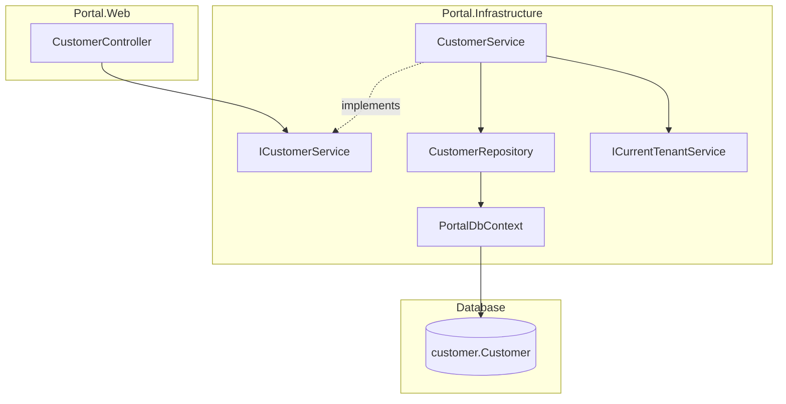

# Design Document: Customer Registry

## Overview

Customer Registry (Module 1) delivers tenant-scoped CRUD operations for managing customers within the Portal platform. It adds a `CustomerRepository`, `ICustomerService`/`CustomerService`, and `CustomerController` following the exact patterns established in Module 0 (Platform Foundation).

The Customer entity and database table (`[customer].[Customer]`) already exist. This module implements the application layer — repository, service, controller, and Razor views — to expose customer management to authenticated tenant users.

Key design decisions:
- **Repository uses raw SQL** (not EF Core LINQ) via `GenericStoredProcedureRepository<Customer>`, consistent with `BusinessRepository`
- **Tenant isolation is dual-layered**: EF Core global query filter (already configured in `PortalDbContext`) + explicit `BusinessId` parameter in repository queries
- **Soft-delete only**: Customers are deactivated (IsActive = false), never hard-deleted, preserving referential integrity with Quotations and Invoices
- **Search/filter at service level**: Name search and IsActive filtering are applied in the service layer using repository methods that accept filter parameters

## Architecture



### Layer Responsibilities

| Layer | Component | Responsibility |
|-------|-----------|---------------|
| Controller | `CustomerController` | HTTP concerns, authorization, anti-forgery, model binding, view selection |
| Service | `CustomerService` | Business logic, validation, tenant assignment, timestamp management |
| Repository | `CustomerRepository` | Raw SQL execution against `[customer].[Customer]`, null-safe parameters, try/catch rethrow |
| Infrastructure | `PortalDbContext` | Global query filter on `Customer.BusinessId` (already configured) |

## Components and Interfaces

### ICustomerService

```csharp
// Portal.Infrastructure/Services/ICustomerService.cs
public interface ICustomerService
{
    Task<List<Customer>> GetCustomersAsync(string? searchTerm = null, bool? isActive = null);
    Task<Customer?> GetCustomerByIdAsync(int id);
    Task<Customer> CreateCustomerAsync(Customer customer);
    Task UpdateCustomerAsync(Customer customer);
    Task DeactivateCustomerAsync(int id);
}
```

### CustomerService

```csharp
// Portal.Infrastructure/Services/CustomerService.cs
public class CustomerService : ICustomerService
{
    private readonly CustomerRepository _customerRepository;
    private readonly ICurrentTenantService _currentTenantService;

    public CustomerService(CustomerRepository customerRepository, ICurrentTenantService currentTenantService)
    {
        _customerRepository = customerRepository;
        _currentTenantService = currentTenantService;
    }

    // Validates Name (required, non-whitespace)
    // Validates Email format (if provided)
    // Assigns BusinessId from ICurrentTenantService
    // Sets CreatedAtUtc/UpdatedAtUtc timestamps
    // Throws ArgumentException on validation failure
}
```

### CustomerRepository

```csharp
// Portal.Infrastructure/Repositories/CustomerRepository.cs
public class CustomerRepository : GenericStoredProcedureRepository<Customer>
{
    public CustomerRepository(DbContext context) : base(context) { }

    public async Task<List<Customer>> GetAllByBusinessIdAsync(int businessId);
    public async Task<Customer?> GetByIdAndBusinessIdAsync(int id, int businessId);
    public async Task InsertAsync(Customer entity);
    public async Task UpdateAsync(Customer entity);
    public async Task DeactivateAsync(int id, int businessId);
}
```

All methods follow the established pattern:
- Full table name `[customer].[Customer]` in SQL queries (no aliases)
- `SqlParameter` with `?? (object)DBNull.Value` for nullable fields
- `try/catch` with `throw;`

### CustomerController

```csharp
// Portal.Web/Controllers/CustomerController.cs
[Authorize]
public class CustomerController : Controller
{
    private readonly ICustomerService _customerService;

    public CustomerController(ICustomerService customerService) { ... }

    [HttpGet] public async Task<IActionResult> Index(string? searchTerm, bool? isActive);
    [HttpGet] public IActionResult Create();
    [HttpPost][ValidateAntiForgeryToken] public async Task<IActionResult> Create(CustomerFormViewModel model);
    [HttpGet] public async Task<IActionResult> Edit(int id);
    [HttpPost][ValidateAntiForgeryToken] public async Task<IActionResult> Edit(int id, CustomerFormViewModel model);
    [HttpPost][ValidateAntiForgeryToken] public async Task<IActionResult> Deactivate(int id);
}
```

## Data Models

### Customer Entity (existing)

Already defined in `Portal.Infrastructure/Entities/Customer.cs`:

| Property | Type | Nullable | Description |
|----------|------|----------|-------------|
| Id | int | No | PK, identity |
| BusinessId | int | No | FK to [portal].Business |
| Name | string | No | Customer name (max 200) |
| Email | string? | Yes | Email address (max 200) |
| TelephoneNumber | string? | Yes | Phone number (max 30) |
| AddressLine1 | string? | Yes | Address line 1 (max 200) |
| AddressLine2 | string? | Yes | Address line 2 (max 200) |
| City | string? | Yes | City (max 100) |
| PostalCode | string? | Yes | Postal code (max 20) |
| Country | string? | Yes | Country (max 100) |
| IsActive | bool | No | Soft-delete flag (default true) |
| CreatedAtUtc | DateTime | No | Creation timestamp |
| UpdatedAtUtc | DateTime | No | Last update timestamp |

Note: The entity has `ContactPerson` and `MobileNumber` in the requirements but not in the current entity. These will be added as part of implementation.

### CustomerFormViewModel

```csharp
// Portal.Web/Models/CustomerFormViewModel.cs
public class CustomerFormViewModel
{
    [Required(ErrorMessage = "Customer name is required")]
    [MaxLength(200)]
    public string Name { get; set; } = null!;

    [MaxLength(200)]
    public string? ContactPerson { get; set; }

    [MaxLength(200)]
    [EmailAddress(ErrorMessage = "Email address is not in a valid format")]
    public string? Email { get; set; }

    [MaxLength(30)]
    public string? TelephoneNumber { get; set; }

    [MaxLength(30)]
    public string? MobileNumber { get; set; }

    [MaxLength(200)]
    public string? AddressLine1 { get; set; }

    [MaxLength(200)]
    public string? AddressLine2 { get; set; }

    [MaxLength(100)]
    public string? City { get; set; }

    [MaxLength(20)]
    public string? PostalCode { get; set; }

    [MaxLength(100)]
    public string? Country { get; set; }
}
```

### CustomerListViewModel

```csharp
// Portal.Web/Models/CustomerListViewModel.cs
public class CustomerListViewModel
{
    public List<Customer> Customers { get; set; } = new();
    public string? SearchTerm { get; set; }
    public bool? IsActiveFilter { get; set; }
}
```

## DI Registration

```csharp
// Program.cs — added registrations
builder.Services.AddScoped<CustomerRepository>();
builder.Services.AddScoped<ICustomerService, CustomerService>();
```

The `CustomerRepository` receives `PortalDbContext` (which inherits from `DbContext`) via constructor injection, matching the `BusinessRepository` pattern.

## Error Handling

### Strategy by Layer

| Layer | Pattern | Behaviour |
|-------|---------|-----------|
| Repository | `try/catch` with `throw;` | Never swallows exceptions. Rethrows to preserve stack trace. |
| Service | Throws `ArgumentException` | Validation failures (empty name, invalid email) throw with descriptive message. |
| Service | Throws `InvalidOperationException` | Entity not found or tenant mismatch. |
| Controller | Catches `ArgumentException` | Adds message to `ModelState`, redisplays form. |
| Controller | Returns `NotFound()` | When service returns null (customer not found or wrong tenant). |

### Specific Error Scenarios

| Scenario | Layer | Response |
|----------|-------|----------|
| Name is null/whitespace | Service | `ArgumentException("Customer name is required")` |
| Email format invalid | Service | `ArgumentException("Email address is not in a valid format")` |
| Customer not found by Id | Service | Returns `null` → Controller returns `NotFound()` |
| Customer belongs to different tenant | Service | Returns `null` (global query filter prevents access) → Controller returns `NotFound()` |
| Database connection failure | Repository | Exception propagates → global exception handler logs and returns error page |


## Correctness Properties

*A property is a characteristic or behavior that should hold true across all valid executions of a system — essentially, a formal statement about what the system should do. Properties serve as the bridge between human-readable specifications and machine-verifiable correctness guarantees.*

### Property 1: Tenant isolation on retrieval

*For any* set of customers distributed across multiple tenants, all retrieval operations (list, get by Id, search) executed in the context of a specific tenant shall return only customers whose BusinessId matches that tenant's BusinessId. Customers belonging to other tenants shall never appear in results.

**Validates: Requirements 1.2, 1.3, 2.3, 3.1, 3.3**

### Property 2: Customer creation invariants and round-trip

*For any* valid customer data (non-whitespace Name, valid or null Email), creating a customer shall produce a record where: BusinessId equals the current tenant's BusinessId (regardless of any BusinessId value passed in), IsActive is true, CreatedAtUtc and UpdatedAtUtc are set to the current UTC time, and all provided field values are persisted and retrievable with equivalent values.

**Validates: Requirements 1.4, 2.4, 3.2**

### Property 3: Customer update round-trip

*For any* existing customer and valid update data (non-whitespace Name, valid or null Email), updating the customer shall persist all changed field values and set UpdatedAtUtc to the current UTC time. Retrieving the customer after update shall return the new field values.

**Validates: Requirements 1.5, 2.5**

### Property 4: Deactivation sets IsActive to false

*For any* active customer (IsActive = true), regardless of whether it has associated Quotations or Invoices, deactivating the customer shall set IsActive to false and update UpdatedAtUtc to the current UTC time. The customer record shall remain in the database (no hard deletion).

**Validates: Requirements 1.6, 2.6, 9.2, 9.3**

### Property 5: Whitespace names are rejected

*For any* string that is null, empty, or composed entirely of whitespace characters, attempting to create or update a customer with that string as the Name shall be rejected with an ArgumentException.

**Validates: Requirements 2.7, 6.1**

### Property 6: Invalid email format is rejected

*For any* non-empty string that does not conform to a standard email format pattern, attempting to create or update a customer with that string as the Email shall be rejected with an ArgumentException. Null or empty Email values shall be accepted without error.

**Validates: Requirements 2.8, 6.2, 6.5**

### Property 7: Search and filter correctness

*For any* combination of search term and IsActive filter applied to a customer list, every customer in the returned results shall satisfy all applied conditions: if a search term is provided, the customer's Name contains the term (case-insensitive); if an IsActive filter is provided, the customer's IsActive matches the filter value. Additionally, no customer satisfying all conditions shall be excluded from results.

**Validates: Requirements 5.1, 5.2, 5.3**

### Property 8: Validation failure preserves form state

*For any* invalid model state (e.g., missing Name, invalid Email) submitted to the create or edit action, the controller shall return the form view (not a redirect) with the submitted values preserved and validation error messages present in ModelState.

**Validates: Requirements 4.7, 6.3, 6.4**

## Testing Strategy

### Dual Testing Approach

This module requires both unit tests and property-based tests for comprehensive coverage.

### Property-Based Testing

**Library**: [FsCheck.Xunit](https://github.com/fscheck/FsCheck) (v2.16+) with xUnit integration

**Configuration**:
- Minimum 100 iterations per property test
- Each test tagged with: `Feature: customer-registry, Property {number}: {property_text}`
- Custom generators for:
  - Valid customer names (non-whitespace strings, max 200 chars)
  - Valid/invalid email addresses
  - Customer entities with randomized optional fields
  - BusinessId values (positive integers representing different tenants)

**Properties to implement**:

| Property | Test Focus | Pattern |
|----------|-----------|---------|
| 1 | Tenant isolation — insert customers for multiple tenants, verify retrieval only returns current tenant's | Invariant |
| 2 | Creation round-trip — create with random valid data, retrieve and compare all fields | Round-trip |
| 3 | Update round-trip — update with random valid data, retrieve and compare changed fields | Round-trip |
| 4 | Deactivation — deactivate any active customer, verify IsActive = false | Invariant |
| 5 | Name validation — generate whitespace-only strings, verify rejection | Error condition |
| 6 | Email validation — generate invalid email strings, verify rejection; null/empty accepted | Error condition |
| 7 | Search/filter — generate customer sets, apply random filters, verify all results match conditions | Metamorphic |
| 8 | Validation failure — submit invalid models, verify view returned (not redirect) | Invariant |

### Unit Testing

**Framework**: xUnit with Moq for mocking

**Focus areas**:
- Specific examples: create customer with all fields populated, edit single field, deactivate
- Edge cases: null Email accepted, empty search returns all, deactivate already-inactive customer
- Error messages: verify exact "Customer name is required" and "Email address is not in a valid format" messages
- Controller authorization: verify `[Authorize]` attribute present
- Controller anti-forgery: verify `[ValidateAntiForgeryToken]` on all POST actions
- Integration: DI container resolves `ICustomerService` correctly

### Test Project Structure

```
tests/
  Portal.Infrastructure.Tests/
    Properties/
      CustomerServicePropertyTests.cs
      CustomerRepositoryPropertyTests.cs
    Unit/
      CustomerServiceTests.cs
      CustomerRepositoryTests.cs
  Portal.Web.Tests/
    Properties/
      CustomerControllerPropertyTests.cs
    Unit/
      CustomerControllerTests.cs
```

### Key Testing Decisions

1. **FsCheck over manual randomization** — provides shrinking, reproducibility, and statistical coverage
2. **In-memory database for repository tests** — EF Core InMemory provider for fast isolated tests (note: global query filters work with InMemory provider)
3. **Moq for service-level tests** — mock `CustomerRepository` and `ICurrentTenantService` to isolate business logic
4. **Custom Arbitraries** — generators for `Customer` entities respecting field constraints (max lengths, valid formats)
5. **Each correctness property implemented by a single property-based test** — one FsCheck `[Property]` method per design property
