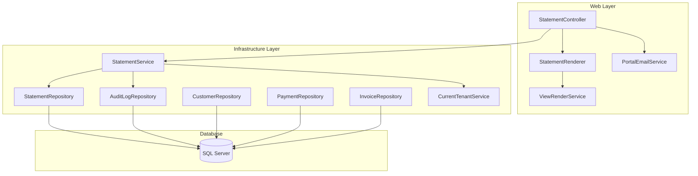
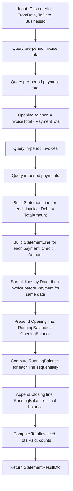

# Design Document: Customer Statement of Account

## Overview

The Customer Statement of Account module adds a financial summary view that consolidates invoices and payments for a selected customer over a date range into a chronological statement. It integrates with the existing Invoice, Payment, and Customer entities and follows the established Controller → Service → Repository architecture.

The module introduces:
- A `StatementService` in the Infrastructure layer for computation logic
- A `StatementController` in the Web layer for page rendering and AJAX endpoints
- A `StatementRepository` in the Infrastructure layer for optimised statement queries
- A `StatementRenderer` in the Web layer for PDF HTML rendering (following the `InvoiceRenderer` pattern)
- A `[customer].[StatementEmailHistory]` table to persist email send records and display email history
- Server-side pagination for the existing Customer Registry

All data access is scoped to the authenticated tenant's `BusinessId` via `ICurrentTenantService`, consistent with the existing Revenue Control and Invoicing modules.

## Architecture



### Request Flow

1. **Generate Statement (AJAX):** `StatementController.Generate` → validates input → calls `StatementService.GenerateStatementAsync` → `StatementRepository` fetches invoices/payments → service computes opening balance, builds statement lines, computes running balances → returns `StatementResultDto` → controller returns JSON
2. **Download PDF:** `StatementController.DownloadPdf` → calls `StatementService.GenerateStatementAsync` → passes model to `StatementRenderer.RenderAsync` → `ViewRenderService` renders Razor view to HTML → HTML-to-PDF conversion → returns `FileResult`
3. **Email Statement:** `StatementController.EmailStatement` → generates PDF (same as above) → calls `PortalEmailService.SendStatementEmailAsync` with PDF bytes as attachment → on success, calls `StatementService.LogEmailSentAsync` which persists to both `[dbo].[AuditLog]` and `[customer].[StatementEmailHistory]` → returns JSON success/error
4. **Get Email History (AJAX):** `StatementController.GetEmailHistory` → validates CustomerId and tenant ownership → calls `StatementService.GetEmailHistoryAsync` → `StatementRepository.GetEmailHistoryByCustomerAsync` queries `[customer].[StatementEmailHistory]` joined with `[dbo].[AspNetUsers]` for display name → returns JSON list of `StatementEmailHistoryDto`
5. **Customer Registry Pagination:** `CustomerController.Index` accepts `page`, `searchTerm`, `isActive` → calls `CustomerService.GetCustomersPagedAsync` → `CustomerRepository` executes paginated SQL → returns `PagedResult<Customer>`

## Components and Interfaces

### IStatementService (Infrastructure)

```csharp
namespace Portal.Infrastructure.Services;

public interface IStatementService
{
    /// <summary>
    /// Generates a complete statement of account for a customer within the specified period.
    /// </summary>
    Task<StatementResultDto> GenerateStatementAsync(int customerId, DateOnly fromDate, DateOnly toDate, int businessId, string userId);

    /// <summary>
    /// Logs a PDF download audit event.
    /// </summary>
    Task LogPdfDownloadAsync(int customerId, DateOnly fromDate, DateOnly toDate, int businessId, string userId);

    /// <summary>
    /// Logs an email send audit event and persists an email history record.
    /// </summary>
    Task LogEmailSentAsync(int customerId, DateOnly fromDate, DateOnly toDate, string recipientEmail, int businessId, string userId);

    /// <summary>
    /// Retrieves the email history for a customer, ordered by most recent first.
    /// </summary>
    Task<List<StatementEmailHistoryDto>> GetEmailHistoryAsync(int customerId, int businessId);
}
```

### StatementService (Infrastructure)

Implements `IStatementService`. Orchestrates:
1. Fetching pre-period invoices and payments for opening balance
2. Fetching in-period invoices and payments
3. Building `StatementLineDto` records with correct field mappings
4. Computing running balances sequentially
5. Inserting audit log entries via `AuditLogRepository`
6. Persisting email history records to `[customer].[StatementEmailHistory]` when a statement is successfully emailed
7. Querying email history for a customer via `StatementRepository.GetEmailHistoryByCustomerAsync`

### StatementRepository (Infrastructure)

```csharp
namespace Portal.Infrastructure.Repositories;

public class StatementRepository : GenericStoredProcedureRepository<Invoice>
{
    /// <summary>
    /// Gets the sum of TotalAmount for issued, non-deleted invoices before the period start date.
    /// </summary>
    Task<decimal> GetInvoicedTotalBeforeDateAsync(int customerId, int businessId, DateOnly beforeDate);

    /// <summary>
    /// Gets the sum of valid payment amounts for a customer's invoices before the period start date.
    /// </summary>
    Task<decimal> GetPaidTotalBeforeDateAsync(int customerId, int businessId, DateOnly beforeDate);

    /// <summary>
    /// Gets all issued, non-deleted invoices for a customer within the date range.
    /// </summary>
    Task<List<StatementInvoiceDto>> GetInvoicesInPeriodAsync(int customerId, int businessId, DateOnly fromDate, DateOnly toDate);

    /// <summary>
    /// Gets all valid payments for a customer's invoices within the date range, including PaymentMethodType name.
    /// </summary>
    Task<List<StatementPaymentDto>> GetPaymentsInPeriodAsync(int customerId, int businessId, DateOnly fromDate, DateOnly toDate);

    /// <summary>
    /// Gets all email history records for a customer, ordered by SentAtUtc descending.
    /// </summary>
    Task<List<StatementEmailHistoryDto>> GetEmailHistoryByCustomerAsync(int customerId, int businessId);

    /// <summary>
    /// Persists an email history record when a statement is successfully emailed.
    /// </summary>
    Task InsertEmailHistoryAsync(StatementEmailHistory entity);
}
```

### StatementController (Web)

```csharp
namespace Portal.Web.Controllers;

[Authorize]
[ModuleAccess(PortalModules.Revenue)]
public class StatementController : Controller
{
    // GET: /Statement?customerId=5
    Task<IActionResult> Index(int? customerId);

    // POST: /Statement/Generate (AJAX)
    Task<IActionResult> Generate(int? customerId, string? fromDate, string? toDate);

    // POST: /Statement/DownloadPdf (AJAX)
    Task<IActionResult> DownloadPdf(int customerId, string fromDate, string toDate);

    // POST: /Statement/EmailStatement (AJAX)
    Task<IActionResult> EmailStatement(int customerId, string fromDate, string toDate);

    // GET: /Statement/GetEmailHistory?customerId=5 (AJAX)
    Task<IActionResult> GetEmailHistory(int customerId);
}
```

### IStatementRenderer (Web)

```csharp
namespace Portal.Web.Services;

public interface IStatementRenderer
{
    /// <summary>
    /// Renders the statement Razor view to an HTML string for PDF conversion.
    /// </summary>
    Task<string> RenderAsync(StatementPdfModel model);
}
```

### CustomerController Pagination Extension

The existing `CustomerController.Index` action is extended to accept pagination parameters:

```csharp
// GET: /Customer?searchTerm=abc&isActive=true&page=1
Task<IActionResult> Index(string? searchTerm, bool? isActive, int page = 1);
```

### ICustomerService Extension

```csharp
// New method added to ICustomerService
Task<PagedResult<Customer>> GetCustomersPagedAsync(string? searchTerm, bool? isActive, int page, int pageSize, int businessId);
```

## Data Models

### StatementResultDto

```csharp
namespace Portal.Infrastructure.Models;

public class StatementResultDto
{
    public decimal OpeningBalance { get; set; }
    public decimal ClosingBalance { get; set; }
    public decimal TotalInvoiced { get; set; }
    public decimal TotalPaid { get; set; }
    public int InvoiceCount { get; set; }
    public int PaymentCount { get; set; }
    public List<StatementLineDto> Lines { get; set; } = new();
}
```

### StatementLineDto

```csharp
namespace Portal.Infrastructure.Models;

public class StatementLineDto
{
    public DateOnly Date { get; set; }
    public StatementLineType Type { get; set; }
    public string Reference { get; set; } = string.Empty;
    public string Description { get; set; } = string.Empty;
    public decimal Debit { get; set; }
    public decimal Credit { get; set; }
    public decimal RunningBalance { get; set; }
}

public enum StatementLineType
{
    Opening,
    Invoice,
    Payment,
    Closing
}
```

### StatementInvoiceDto (internal query result)

```csharp
namespace Portal.Infrastructure.Models;

public class StatementInvoiceDto
{
    public int Id { get; set; }
    public DateOnly InvoiceDate { get; set; }
    public string InvoiceNumber { get; set; } = string.Empty;
    public string? Notes { get; set; }
    public decimal TotalAmount { get; set; }
}
```

### StatementPaymentDto (internal query result)

```csharp
namespace Portal.Infrastructure.Models;

public class StatementPaymentDto
{
    public int Id { get; set; }
    public DateTime PaymentDateUtc { get; set; }
    public decimal Amount { get; set; }
    public string? Reference { get; set; }
    public string? Notes { get; set; }
    public string PaymentMethodName { get; set; } = string.Empty;
}
```

### StatementPdfModel (view model for PDF rendering)

```csharp
namespace Portal.Infrastructure.Models;

public class StatementPdfModel
{
    public string CustomerName { get; set; } = string.Empty;
    public string? CustomerAddress { get; set; }
    public string? CustomerEmail { get; set; }
    public string? CustomerPhone { get; set; }
    public string BusinessName { get; set; } = string.Empty;
    public string? BusinessLogoUrl { get; set; }
    public string CurrencySymbol { get; set; } = "€";
    public DateOnly FromDate { get; set; }
    public DateOnly ToDate { get; set; }
    public StatementResultDto Statement { get; set; } = new();
}
```

### PagedResult&lt;T&gt; (generic pagination model)

```csharp
namespace Portal.Infrastructure.Models;

public class PagedResult<T>
{
    public List<T> Items { get; set; } = new();
    public int CurrentPage { get; set; }
    public int TotalPages { get; set; }
    public int TotalCount { get; set; }
    public int PageSize { get; set; }
    public bool HasPreviousPage => CurrentPage > 1;
    public bool HasNextPage => CurrentPage < TotalPages;
}
```

### StatementEmailHistory (entity — maps to [customer].[StatementEmailHistory])

```csharp
namespace Portal.Infrastructure.Entities;

public class StatementEmailHistory
{
    public int Id { get; set; }
    public int BusinessId { get; set; }
    public int CustomerId { get; set; }
    public DateOnly FromDate { get; set; }
    public DateOnly ToDate { get; set; }
    public string RecipientEmail { get; set; } = string.Empty;
    public string SentByUserId { get; set; } = string.Empty;
    public DateTime SentAtUtc { get; set; }
    public DateTime CreatedAtUtc { get; set; }
}
```

### StatementEmailHistoryDto (query result for UI display)

```csharp
namespace Portal.Infrastructure.Models;

public class StatementEmailHistoryDto
{
    public DateTime SentAtUtc { get; set; }
    public DateOnly FromDate { get; set; }
    public DateOnly ToDate { get; set; }
    public string RecipientEmail { get; set; } = string.Empty;
    public string SentByDisplayName { get; set; } = string.Empty;
}
```

### Statement Computation Algorithm



### Key SQL Queries

**Opening Balance — Invoiced Before Period:**
```sql
SELECT ISNULL(SUM([invoice].[Invoice].[TotalAmount]), 0)
FROM [invoice].[Invoice]
WHERE [invoice].[Invoice].[CustomerId] = @CustomerId
  AND [invoice].[Invoice].[BusinessId] = @BusinessId
  AND [invoice].[Invoice].[InvoiceStatusTypeId] = 2
  AND [invoice].[Invoice].[IsDeleted] = 0
  AND [invoice].[Invoice].[InvoiceDate] < @BeforeDate
```

**Opening Balance — Paid Before Period:**
```sql
SELECT ISNULL(SUM([revenue].[Payment].[Amount]), 0)
FROM [revenue].[Payment]
INNER JOIN [invoice].[Invoice]
    ON [revenue].[Payment].[InvoiceId] = [invoice].[Invoice].[Id]
WHERE [invoice].[Invoice].[CustomerId] = @CustomerId
  AND [revenue].[Payment].[BusinessId] = @BusinessId
  AND [revenue].[Payment].[IsVoided] = 0
  AND [revenue].[Payment].[PaymentDateUtc] < @BeforeDate
```

**In-Period Invoices:**
```sql
SELECT [invoice].[Invoice].[Id],
       [invoice].[Invoice].[InvoiceDate],
       [invoice].[Invoice].[InvoiceNumber],
       [invoice].[Invoice].[Notes],
       [invoice].[Invoice].[TotalAmount]
FROM [invoice].[Invoice]
WHERE [invoice].[Invoice].[CustomerId] = @CustomerId
  AND [invoice].[Invoice].[BusinessId] = @BusinessId
  AND [invoice].[Invoice].[InvoiceStatusTypeId] = 2
  AND [invoice].[Invoice].[IsDeleted] = 0
  AND [invoice].[Invoice].[InvoiceDate] >= @FromDate
  AND [invoice].[Invoice].[InvoiceDate] <= @ToDate
ORDER BY [invoice].[Invoice].[InvoiceDate]
```

**In-Period Payments:**
```sql
SELECT [revenue].[Payment].[Id],
       [revenue].[Payment].[PaymentDateUtc],
       [revenue].[Payment].[Amount],
       [revenue].[Payment].[Reference],
       [revenue].[Payment].[Notes],
       [revenue].[PaymentMethodType].[Name]
FROM [revenue].[Payment]
INNER JOIN [invoice].[Invoice]
    ON [revenue].[Payment].[InvoiceId] = [invoice].[Invoice].[Id]
INNER JOIN [revenue].[PaymentMethodType]
    ON [revenue].[Payment].[PaymentMethodTypeId] = [revenue].[PaymentMethodType].[Id]
WHERE [invoice].[Invoice].[CustomerId] = @CustomerId
  AND [revenue].[Payment].[BusinessId] = @BusinessId
  AND [revenue].[Payment].[IsVoided] = 0
  AND [revenue].[Payment].[PaymentDateUtc] >= @FromDate
  AND [revenue].[Payment].[PaymentDateUtc] <= @ToDate
ORDER BY [revenue].[Payment].[PaymentDateUtc]
```

**Customer Pagination:**
```sql
SELECT [customer].[Customer].[Id],
       [customer].[Customer].[BusinessId],
       [customer].[Customer].[Name],
       [customer].[Customer].[ContactPerson],
       [customer].[Customer].[Email],
       [customer].[Customer].[TelephoneNumber],
       [customer].[Customer].[MobileNumber],
       [customer].[Customer].[IsActive],
       [customer].[Customer].[CreatedAtUtc]
FROM [customer].[Customer]
WHERE [customer].[Customer].[BusinessId] = @BusinessId
  AND (@SearchTerm IS NULL
       OR [customer].[Customer].[Name] LIKE @SearchPattern
       OR [customer].[Customer].[ContactPerson] LIKE @SearchPattern
       OR [customer].[Customer].[Email] LIKE @SearchPattern)
  AND (@IsActive IS NULL OR [customer].[Customer].[IsActive] = @IsActive)
ORDER BY [customer].[Customer].[Name]
OFFSET @Offset ROWS FETCH NEXT @PageSize ROWS ONLY
```

**Create StatementEmailHistory Table (Migration):**
```sql
CREATE TABLE [customer].[StatementEmailHistory]
(
    [Id]              INT IDENTITY(1,1) NOT NULL,
    [BusinessId]      INT NOT NULL,
    [CustomerId]      INT NOT NULL,
    [FromDate]        DATE NOT NULL,
    [ToDate]          DATE NOT NULL,
    [RecipientEmail]  NVARCHAR(256) NOT NULL,
    [SentByUserId]    NVARCHAR(450) NOT NULL,
    [SentAtUtc]       DATETIME NOT NULL,
    [CreatedAtUtc]    DATETIME NOT NULL DEFAULT GETUTCDATE(),
    CONSTRAINT [PK_StatementEmailHistory] PRIMARY KEY CLUSTERED ([Id]),
    CONSTRAINT [FK_StatementEmailHistory_BusinessId] FOREIGN KEY ([BusinessId])
        REFERENCES [dbo].[Business]([Id]),
    CONSTRAINT [FK_StatementEmailHistory_CustomerId] FOREIGN KEY ([CustomerId])
        REFERENCES [customer].[Customer]([Id])
);

CREATE NONCLUSTERED INDEX [IX_StatementEmailHistory_CustomerId_BusinessId]
    ON [customer].[StatementEmailHistory] ([CustomerId], [BusinessId])
    INCLUDE ([SentAtUtc]);
```

**Email History Query (by Customer):**
```sql
SELECT [customer].[StatementEmailHistory].[SentAtUtc],
       [customer].[StatementEmailHistory].[FromDate],
       [customer].[StatementEmailHistory].[ToDate],
       [customer].[StatementEmailHistory].[RecipientEmail],
       [dbo].[AspNetUsers].[FullName] AS [SentByDisplayName]
FROM [customer].[StatementEmailHistory]
INNER JOIN [dbo].[AspNetUsers]
    ON [customer].[StatementEmailHistory].[SentByUserId] = [dbo].[AspNetUsers].[Id]
WHERE [customer].[StatementEmailHistory].[CustomerId] = @CustomerId
  AND [customer].[StatementEmailHistory].[BusinessId] = @BusinessId
ORDER BY [customer].[StatementEmailHistory].[SentAtUtc] DESC
```

**Insert Email History Record:**
```sql
INSERT INTO [customer].[StatementEmailHistory]
    ([BusinessId], [CustomerId], [FromDate], [ToDate], [RecipientEmail], [SentByUserId], [SentAtUtc])
VALUES
    (@BusinessId, @CustomerId, @FromDate, @ToDate, @RecipientEmail, @SentByUserId, @SentAtUtc)
```

## Correctness Properties

*A property is a characteristic or behavior that should hold true across all valid executions of a system — essentially, a formal statement about what the system should do. Properties serve as the bridge between human-readable specifications and machine-verifiable correctness guarantees.*

### Property 1: Opening Balance Computation

*For any* customer with any combination of issued (non-deleted) invoices and valid (non-voided) payments dated before the statement period start, the Opening Balance SHALL equal the sum of all invoice TotalAmount values minus the sum of all payment Amount values for that customer and business.

**Validates: Requirements 1.1**

### Property 2: Period Filtering Correctness

*For any* customer and date range, the statement SHALL include only invoices with InvoiceDate within [fromDate, toDate], InvoiceStatusTypeId = 2, and IsDeleted = 0, and only payments with PaymentDateUtc within [fromDate, toDate] and IsVoided = 0, all scoped to the authenticated BusinessId.

**Validates: Requirements 1.2, 1.3, 10.1, 10.2**

### Property 3: Chronological Ordering with Same-Date Tiebreaker

*For any* set of statement lines between the Opening and Closing entries, the lines SHALL be sorted in non-decreasing order by Date, and when two lines share the same Date, all Invoice-type lines SHALL appear before all Payment-type lines for that date.

**Validates: Requirements 1.4, 1.8, 2.8**

### Property 4: Running Balance Invariant

*For any* statement with n lines (including Opening and Closing), for each line at index i > 0, the RunningBalance SHALL equal RunningBalance[i-1] + Debit[i] - Credit[i], where RunningBalance[0] is the Opening Balance.

**Validates: Requirements 1.5**

### Property 5: Closing Balance Equals Aggregate Formula

*For any* statement, the Closing Balance SHALL equal OpeningBalance + TotalInvoiced - TotalPaid, where TotalInvoiced is the sum of all Debit values and TotalPaid is the sum of all Credit values within the period.

**Validates: Requirements 1.6, 1.7**

### Property 6: Statement Line Field Mapping

*For any* invoice in the statement, the corresponding line SHALL have Date = InvoiceDate, Reference = InvoiceNumber, Description = Notes (or empty if null), Debit = TotalAmount, and Credit = 0.00. *For any* payment in the statement, the corresponding line SHALL have Date = PaymentDateUtc (as DateOnly), Reference = PaymentMethodType.Name + " · Ref: " + Payment.Reference (or PaymentMethodType.Name only if Reference is null/empty), Description = Notes (or empty if null), Debit = 0.00, and Credit = Amount.

**Validates: Requirements 2.2, 2.3, 2.4, 2.5**

### Property 7: Boundary Lines Structure

*For any* generated statement, the first line SHALL have Type = Opening, Date = period start date, Reference = "Balance brought forward", Debit = 0, Credit = 0, and RunningBalance = computed Opening Balance. The last line SHALL have Type = Closing, Date = period end date, Reference = "Balance carried forward", Debit = 0, Credit = 0, and RunningBalance = computed Closing Balance.

**Validates: Requirements 2.6, 2.7**

### Property 8: PDF Filename Sanitization

*For any* customer name (including spaces and special characters) and any valid date range, the generated PDF filename SHALL follow the pattern `Statement_{SanitizedName}_{yyyyMMdd}_{yyyyMMdd}.pdf` where spaces are replaced with underscores and characters invalid for filenames are removed.

**Validates: Requirements 5.2**

### Property 9: Pagination Page Size Invariant

*For any* page of customer results, the number of items returned SHALL be at most 15 (Page_Size), and exactly 15 when the page is not the last page of the result set.

**Validates: Requirements 9.1**

### Property 10: Pagination Info Correctness

*For any* page number p and total count Z with page size 15, the pagination info SHALL display "Showing X-Y of Z" where X = (p-1)*15 + 1, Y = min(p*15, Z), the Previous button SHALL be disabled when p = 1, and the Next button SHALL be disabled when p = ceil(Z/15).

**Validates: Requirements 9.2, 9.3**

### Property 11: Filter and Pagination Composition

*For any* combination of search term and status filter applied to a customer list, the total count SHALL reflect only customers matching all active filters (Name, ContactPerson, or Email contains search term AND IsActive matches status filter), and pagination SHALL be applied to the filtered result set.

**Validates: Requirements 9.4, 9.5**

### Property 12: Email History Display Completeness

*For any* email history record, the rendered output SHALL include the Date Sent (SentAtUtc), Statement Period (FromDate and ToDate), Recipient Email, and Sent By (display name of the user who triggered the email).

**Validates: Requirements 11.2**

### Property 13: Email History Ordering

*For any* set of email history records returned for a customer, the records SHALL be sorted in non-increasing order by SentAtUtc (most recent first).

**Validates: Requirements 11.3**

### Property 14: Email History Scoping

*For any* email history query for a given CustomerId and BusinessId, all returned records SHALL have a matching CustomerId AND a matching BusinessId — no records belonging to other customers or other business tenants SHALL appear in the result.

**Validates: Requirements 11.4, 11.5**

### Property 15: Email History Persistence Round-Trip

*For any* successful statement email operation with a given BusinessId, CustomerId, FromDate, ToDate, RecipientEmail, and UserId, querying the email history for that customer SHALL return a record containing all of those exact values with a SentAtUtc timestamp equal to or later than the time the operation was initiated.

**Validates: Requirements 11.6**

## Error Handling

| Scenario | Layer | Response |
|----------|-------|----------|
| Missing CustomerId on Generate | Controller | `{ success: false, message: "Please select a customer." }` |
| Missing from-date or to-date | Controller | `{ success: false, message: "Both from and to dates are required." }` |
| From-date after to-date | Controller | `{ success: false, message: "From date cannot be after to date." }` |
| Customer not found / wrong tenant | Controller | `{ success: false, message: "Customer not found." }` |
| PDF generation timeout (>30s) | Controller | `{ success: false, message: "PDF generation timed out. Please try again." }` + log error |
| PDF generation failure | Controller | `{ success: false, message: "Failed to generate PDF." }` + log error |
| Customer has no email address | Controller | `{ success: false, message: "No email address is registered for this customer." }` |
| Email sending failure | Controller | `{ success: false, message: "Failed to send email. Please try again." }` + log error |
| GetEmailHistory missing CustomerId | Controller | `{ success: false, message: "Please select a customer." }` |
| GetEmailHistory customer not found / wrong tenant | Controller | `{ success: false, message: "Customer not found." }` |
| BusinessId unresolvable (0) | Service | Returns empty `StatementResultDto` with zero balances |
| Repository exception | Repository | Rethrown (try/catch with `throw;`) — caught at controller level |

All AJAX error responses follow the standard pattern:
```javascript
BlockUI.show('Generating statement...');
try {
    var response = await fetch('/Statement/Generate', { ... });
    var data = await response.json();
    BlockUI.hide();
    if (data.success) { /* render statement */ }
    else { Swal.fire({ title: 'Error', text: data.message, icon: 'error', confirmButtonColor: '#0D5EA6' }); }
} catch (e) {
    BlockUI.hide();
    Swal.fire({ title: 'Error', text: 'An unexpected error occurred.', icon: 'error', confirmButtonColor: '#0D5EA6' });
}
```

## Testing Strategy

### Property-Based Tests (xUnit + FsCheck)

The statement computation logic is pure business logic with clear input/output behavior, making it well-suited for property-based testing. The project will use **FsCheck.Xunit** for property-based tests.

**Configuration:**
- Minimum 100 iterations per property test
- Each test tagged with: `Feature: customer-statement, Property {number}: {property_text}`

**Properties to implement:**
1. Opening balance computation (Property 1)
2. Period filtering correctness (Property 2)
3. Chronological ordering with tiebreaker (Property 3)
4. Running balance invariant (Property 4)
5. Closing balance aggregate formula (Property 5)
6. Statement line field mapping (Property 6)
7. Boundary lines structure (Property 7)
8. PDF filename sanitization (Property 8)
9. Pagination page size invariant (Property 9)
10. Pagination info correctness (Property 10)
11. Filter and pagination composition (Property 11)
12. Email history display completeness (Property 12)
13. Email history ordering (Property 13)
14. Email history scoping (Property 14)
15. Email history persistence round-trip (Property 15)

### Unit Tests (xUnit)

- Specific examples for empty period (Requirement 1.9)
- Controller validation edge cases (missing params, invalid dates, wrong tenant)
- Payment reference null/empty formatting
- Customer with no email address error path
- Page number exceeding total pages
- Email history empty state returns empty list (Requirement 11.7)
- GetEmailHistory with missing CustomerId returns error
- GetEmailHistory with customer belonging to different tenant returns not found

### Integration Tests

- Audit log creation on generate, download, and email events
- Email sending with PDF attachment (mocked SMTP)
- Tenant isolation verification (cross-tenant access returns not found)
- End-to-end statement generation against test database
- Email history record persisted after successful email send
- Email history query returns correct records joined with user display name

### UI/Example Tests

- Statement page renders filter panel with correct controls
- KPI cards display correct values
- Type pills have correct colour classes
- Statement link appears in Customer Registry actions column
- SweetAlert2 shown on success/error
- Email History table renders on Statement page with correct columns (Requirement 11.1)
- Email History table shows empty state message when no records exist (Requirement 11.7)
