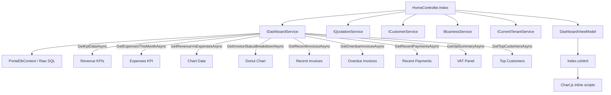

# Design Document: Dashboard Upgrade

## Overview

This design extends the existing Portal home dashboard (`/Home/Index`) from a quotation-only view to a comprehensive operational dashboard. The upgrade adds revenue KPIs, financial charts (revenue vs expenses, invoice status breakdown), invoice/payment tables, a VAT summary panel, and a top customers ranking — all rendered server-side within the existing MVC architecture.

### Design Decisions

1. **Extend existing `IDashboardService`** rather than creating a separate service. The existing service already handles KPI data, overdue invoices, and recent payments. Adding new methods (expenses KPI, chart data, VAT summary, top customers, recent invoices) keeps the dashboard logic cohesive in one service.

2. **Server-side rendering with inline Chart.js data** — All data is loaded in a single controller action and passed to the view via a strongly-typed ViewModel. Chart.js receives data as JSON-serialized arrays embedded in `<script>` tags. This avoids additional AJAX round-trips and keeps the dashboard snappy on first load.

3. **Single ViewModel** — A `DashboardViewModel` aggregates all section data, replacing the current `ViewBag`-based approach. This provides compile-time safety and cleaner view code.

4. **Reuse existing DTOs** where possible (`OverdueInvoiceDto`, `RecentPaymentDto`, `MonthlyRevenueDto`) and introduce new DTOs only for genuinely new data shapes.

## Architecture



### Request Flow

1. User navigates to `/Home/Index`
2. `HomeController.Index` resolves `BusinessId` via `ICurrentTenantService`
3. If `BusinessId` is 0 or unresolved → redirect to error page
4. Controller calls all `IDashboardService` methods in parallel using `Task.WhenAll`
5. Results are assembled into `DashboardViewModel`
6. View renders all sections server-side; Chart.js initialises from inline JSON data

## Components and Interfaces

### IDashboardService — New Methods

```csharp
/// <summary>
/// Returns expenses total and count for the current calendar month.
/// </summary>
Task<ExpensesKpiDto> GetExpensesThisMonthAsync(int businessId);

/// <summary>
/// Returns monthly revenue and expense totals for the last 6 months (including current).
/// </summary>
Task<List<RevenueVsExpensesDto>> GetRevenueVsExpensesAsync(int businessId);

/// <summary>
/// Returns the count of issued invoices grouped by financial status.
/// </summary>
Task<InvoiceStatusBreakdownDto> GetInvoiceStatusBreakdownAsync(int businessId);

/// <summary>
/// Returns the 5 most recently issued invoices.
/// </summary>
Task<List<RecentInvoiceDto>> GetRecentInvoicesAsync(int businessId);

/// <summary>
/// Returns VAT summary for the current open period (or most recent period).
/// </summary>
Task<VatSummaryDto> GetVatSummaryAsync(int businessId);

/// <summary>
/// Returns top 5 customers ranked by total invoiced amount.
/// </summary>
Task<List<TopCustomerDto>> GetTopCustomersAsync(int businessId);
```

### Existing Methods Reused

| Method | Usage |
|--------|-------|
| `GetKpiDataAsync(businessId)` | Revenue This Month, Outstanding, Overdue KPI cards |
| `GetOverdueInvoicesAsync(businessId, null, 1, 10)` | Overdue Invoices table (first 10, no search) |
| `GetRecentPaymentsAsync(businessId, null, 1, 5)` | Recent Payments table (first 5, no search) |

### HomeController Changes

The controller will:
1. Inject `IDashboardService` (new dependency)
2. Resolve `BusinessId` with guard clause (redirect if 0)
3. Execute all service calls via `Task.WhenAll` for parallel I/O
4. Construct `DashboardViewModel` and pass to view
5. Retain existing quotation KPI logic (or migrate to ViewModel)

### View Structure

```
Views/Home/Index.cshtml
├── Topbar (existing, updated eyebrow text)
├── Quick Actions row (existing, unchanged)
├── Quotation KPIs row (existing .grid-4)
├── Revenue KPIs row (new .grid-4 with coloured borders)
├── Charts row (new .grid-2)
│   ├── Revenue vs Expenses bar chart (Chart.js canvas)
│   └── Invoice Status donut chart (Chart.js canvas)
├── Tables row 1 (new .grid-2)
│   ├── Recent Invoices table
│   └── Overdue Invoices table + warning banner
├── Tables row 2 (new .grid-2)
│   ├── Recent Payments table
│   └── Recent Quotations table (existing, relocated)
└── Bottom row (new .grid-2)
    ├── VAT Summary panel
    └── Top Customers table
```

## Data Models

### New DTOs

```csharp
/// <summary>
/// Expenses KPI card data for the current month.
/// </summary>
public class ExpensesKpiDto
{
    public decimal TotalExpenses { get; set; }
    public int PurchaseCount { get; set; }
}

/// <summary>
/// Monthly revenue vs expenses data point for the bar chart.
/// </summary>
public class RevenueVsExpensesDto
{
    public int Year { get; set; }
    public int Month { get; set; }
    public string Label { get; set; } = null!; // e.g., "Jan", "Feb"
    public decimal Revenue { get; set; }
    public decimal Expenses { get; set; }
}

/// <summary>
/// Invoice count breakdown by financial status for the donut chart.
/// </summary>
public class InvoiceStatusBreakdownDto
{
    public int PaidCount { get; set; }
    public int PartiallyPaidCount { get; set; }
    public int UnpaidCount { get; set; }
    public int OverdueCount { get; set; }
    public int TotalCount { get; set; }
}

/// <summary>
/// A recent invoice row for the dashboard table.
/// </summary>
public class RecentInvoiceDto
{
    public int Id { get; set; }
    public string InvoiceNumber { get; set; } = null!;
    public string CustomerName { get; set; } = null!;
    public int InvoiceFinancialStatusTypeId { get; set; }
    public string FinancialStatusName { get; set; } = null!;
    public decimal TotalAmount { get; set; }
}

/// <summary>
/// A top customer row ranked by total invoiced amount.
/// </summary>
public class TopCustomerDto
{
    public int CustomerId { get; set; }
    public string CustomerName { get; set; } = null!;
    public decimal TotalInvoiced { get; set; }
    public decimal TotalPaid { get; set; }
}
```

### DashboardViewModel

```csharp
/// <summary>
/// Aggregated view model for the upgraded home dashboard.
/// </summary>
public class DashboardViewModel
{
    // Tenant
    public string CurrencySymbol { get; set; } = "€";

    // Quotation KPIs (existing)
    public int DraftCount { get; set; }
    public int SentThisMonthCount { get; set; }
    public decimal SentThisMonthValue { get; set; }
    public int AcceptedCount { get; set; }
    public decimal AcceptanceRate { get; set; }
    public int ActiveCustomerCount { get; set; }

    // Revenue KPIs
    public decimal RevenueThisMonth { get; set; }
    public int RevenuePaymentCount { get; set; }
    public decimal OutstandingAmount { get; set; }
    public int OutstandingInvoiceCount { get; set; }
    public decimal OverdueAmount { get; set; }
    public int OverdueInvoiceCount { get; set; }
    public decimal ExpensesThisMonth { get; set; }
    public int ExpensesPurchaseCount { get; set; }

    // Charts
    public List<RevenueVsExpensesDto> RevenueVsExpenses { get; set; } = new();
    public InvoiceStatusBreakdownDto InvoiceStatusBreakdown { get; set; } = new();

    // Tables
    public List<RecentInvoiceDto> RecentInvoices { get; set; } = new();
    public List<OverdueInvoiceDto> OverdueInvoices { get; set; } = new();
    public int TotalOverdueCount { get; set; }
    public decimal TotalOverdueAmount { get; set; }
    public List<RecentPaymentDto> RecentPayments { get; set; } = new();
    public List<QuotationListDto> RecentQuotations { get; set; } = new();

    // VAT Summary
    public decimal OutputVat { get; set; }
    public decimal InputVat { get; set; }
    public decimal NetVatPayable { get; set; }
    public string VatPeriodLabel { get; set; } = string.Empty;
    public bool HasVatData { get; set; }

    // Top Customers
    public List<TopCustomerDto> TopCustomers { get; set; } = new();
}
```

### SQL Query Patterns

All new queries follow the existing `DashboardService` pattern:
- Raw SQL via `DbConnection` from `PortalDbContext`
- Full table names (no aliases) per repository standards
- `@BusinessId` parameter in every WHERE clause
- `SqlParameter` for all inputs
- Try/catch with rethrow

**Expenses This Month:**
```sql
SELECT ISNULL(SUM([purchase].[Purchase].[TotalAmount]), 0) AS [TotalExpenses],
       COUNT(*) AS [PurchaseCount]
FROM [purchase].[Purchase]
WHERE [purchase].[Purchase].[BusinessId] = @BusinessId
  AND [purchase].[Purchase].[IsCancelled] = 0
  AND [purchase].[Purchase].[InvoiceDate] >= @MonthStart
  AND [purchase].[Purchase].[InvoiceDate] <= @MonthEnd
```

**Revenue vs Expenses (6 months):**
```sql
-- Revenue per month
SELECT YEAR([revenue].[Payment].[PaymentDateUtc]) AS [Year],
       MONTH([revenue].[Payment].[PaymentDateUtc]) AS [Month],
       ISNULL(SUM([revenue].[Payment].[Amount]), 0) AS [Revenue]
FROM [revenue].[Payment]
WHERE [revenue].[Payment].[BusinessId] = @BusinessId
  AND [revenue].[Payment].[IsVoided] = 0
  AND [revenue].[Payment].[PaymentDateUtc] >= @SixMonthsAgo
GROUP BY YEAR([revenue].[Payment].[PaymentDateUtc]), MONTH([revenue].[Payment].[PaymentDateUtc])

-- Expenses per month
SELECT YEAR([purchase].[Purchase].[InvoiceDate]) AS [Year],
       MONTH([purchase].[Purchase].[InvoiceDate]) AS [Month],
       ISNULL(SUM([purchase].[Purchase].[TotalAmount]), 0) AS [Expenses]
FROM [purchase].[Purchase]
WHERE [purchase].[Purchase].[BusinessId] = @BusinessId
  AND [purchase].[Purchase].[IsCancelled] = 0
  AND [purchase].[Purchase].[InvoiceDate] >= @SixMonthsAgo
GROUP BY YEAR([purchase].[Purchase].[InvoiceDate]), MONTH([purchase].[Purchase].[InvoiceDate])
```

**Invoice Status Breakdown:**
```sql
SELECT [invoice].[Invoice].[InvoiceFinancialStatusTypeId],
       COUNT(*) AS [Count]
FROM [invoice].[Invoice]
WHERE [invoice].[Invoice].[BusinessId] = @BusinessId
  AND [invoice].[Invoice].[IsDeleted] = 0
  AND [invoice].[Invoice].[InvoiceStatusTypeId] = 2
GROUP BY [invoice].[Invoice].[InvoiceFinancialStatusTypeId]
```

**Recent Invoices (Top 5):**
```sql
SELECT TOP 5
       [invoice].[Invoice].[Id],
       [invoice].[Invoice].[InvoiceNumber],
       [customer].[Customer].[Name] AS [CustomerName],
       [invoice].[Invoice].[InvoiceFinancialStatusTypeId],
       [invoice].[InvoiceFinancialStatusType].[Name] AS [FinancialStatusName],
       [invoice].[Invoice].[TotalAmount]
FROM [invoice].[Invoice]
INNER JOIN [customer].[Customer]
    ON [invoice].[Invoice].[CustomerId] = [customer].[Customer].[Id]
INNER JOIN [invoice].[InvoiceFinancialStatusType]
    ON [invoice].[Invoice].[InvoiceFinancialStatusTypeId] = [invoice].[InvoiceFinancialStatusType].[Id]
WHERE [invoice].[Invoice].[BusinessId] = @BusinessId
  AND [invoice].[Invoice].[IsDeleted] = 0
  AND [invoice].[Invoice].[InvoiceStatusTypeId] = 2
ORDER BY [invoice].[Invoice].[InvoiceDate] DESC
```

**VAT Summary (current open period):**
```sql
SELECT TOP 1
       [vat].[VatSubmission].[TotalOutputVat],
       [vat].[VatSubmission].[TotalInputVat],
       [vat].[VatSubmission].[NetVatPayable],
       [vat].[VatSubmissionPeriod].[PeriodLabel]
FROM [vat].[VatSubmission]
INNER JOIN [vat].[VatSubmissionPeriod]
    ON [vat].[VatSubmission].[VatSubmissionPeriodId] = [vat].[VatSubmissionPeriod].[Id]
WHERE [vat].[VatSubmission].[BusinessId] = @BusinessId
ORDER BY
    CASE WHEN [vat].[VatSubmission].[IsSubmitted] = 0 THEN 0 ELSE 1 END,
    [vat].[VatSubmissionPeriod].[PeriodEndDate] DESC
```

**Top 5 Customers:**
```sql
SELECT TOP 5
       [customer].[Customer].[Id] AS [CustomerId],
       [customer].[Customer].[Name] AS [CustomerName],
       ISNULL(SUM([invoice].[Invoice].[TotalAmount]), 0) AS [TotalInvoiced],
       ISNULL(SUM(ValidPayments.[TotalPaid]), 0) AS [TotalPaid]
FROM [invoice].[Invoice]
INNER JOIN [customer].[Customer]
    ON [invoice].[Invoice].[CustomerId] = [customer].[Customer].[Id]
LEFT JOIN (
    SELECT [revenue].[Payment].[InvoiceId],
           SUM([revenue].[Payment].[Amount]) AS [TotalPaid]
    FROM [revenue].[Payment]
    WHERE [revenue].[Payment].[IsVoided] = 0
      AND [revenue].[Payment].[BusinessId] = @BusinessId
    GROUP BY [revenue].[Payment].[InvoiceId]
) AS ValidPayments ON [invoice].[Invoice].[Id] = ValidPayments.[InvoiceId]
WHERE [invoice].[Invoice].[BusinessId] = @BusinessId
  AND [invoice].[Invoice].[IsDeleted] = 0
  AND [invoice].[Invoice].[InvoiceStatusTypeId] = 2
GROUP BY [customer].[Customer].[Id], [customer].[Customer].[Name]
ORDER BY [TotalInvoiced] DESC
```


## Correctness Properties

*A property is a characteristic or behavior that should hold true across all valid executions of a system — essentially, a formal statement about what the system should do. Properties serve as the bridge between human-readable specifications and machine-verifiable correctness guarantees.*

### Property 1: Revenue This Month includes only valid in-month payments

*For any* set of payments with varying amounts, dates, and IsVoided flags, the Revenue This Month value SHALL equal the sum of Amount from payments where IsVoided = 0 AND PaymentDateUtc falls within the current calendar month boundaries, and the count SHALL equal the number of such payments.

**Validates: Requirements 1.1, 1.5, 1.7**

### Property 2: Outstanding balance computation correctness

*For any* set of issued, non-deleted invoices with InvoiceFinancialStatusTypeId in (1, 2, 4) and their associated payments, the Outstanding amount SHALL equal the sum of (TotalAmount minus sum of non-voided payments) across all qualifying invoices, and the count SHALL equal the number of qualifying invoices.

**Validates: Requirements 1.2, 1.5**

### Property 3: Overdue amount is a subset of outstanding

*For any* set of invoices and payments, the Overdue amount SHALL equal the sum of outstanding balances for invoices where DueDate < today AND outstanding balance > 0, and the Overdue amount SHALL always be less than or equal to the Outstanding amount.

**Validates: Requirements 1.3, 1.5**

### Property 4: Expenses This Month includes only valid in-month purchases

*For any* set of purchases with varying amounts, dates, and IsCancelled flags, the Expenses This Month value SHALL equal the sum of TotalAmount from purchases where IsCancelled = 0 AND InvoiceDate falls within the current calendar month, and the count SHALL equal the number of such purchases.

**Validates: Requirements 1.4, 1.5, 1.7**

### Property 5: Tenant data isolation

*For any* two distinct BusinessIds with overlapping data, calling any dashboard service method with BusinessId A SHALL never return records belonging to BusinessId B, and vice versa.

**Validates: Requirements 1.6, 2.7, 3.5, 5.6, 7.5, 8.7, 10.1**

### Property 6: Revenue vs Expenses chart data grouping

*For any* set of payments and purchases spanning 6 months, the chart data SHALL contain exactly 6 entries ordered chronologically, where each entry's Revenue equals the sum of non-voided payments in that month and each entry's Expenses equals the sum of non-cancelled purchases in that month.

**Validates: Requirements 2.1, 2.2, 2.4, 2.6**

### Property 7: Invoice status breakdown counts sum to total

*For any* set of issued, non-deleted invoices, the sum of PaidCount + PartiallyPaidCount + UnpaidCount + OverdueCount SHALL equal TotalCount, and each individual count SHALL equal the number of invoices with that specific InvoiceFinancialStatusTypeId.

**Validates: Requirements 3.1**

### Property 8: Recent invoices ordering and filtering

*For any* set of invoices with varying statuses, dates, and deletion flags, the recent invoices result SHALL contain at most 5 items, all with InvoiceStatusTypeId = 2 and IsDeleted = 0, ordered by InvoiceDate descending.

**Validates: Requirements 4.1, 4.5**

### Property 9: Overdue invoices filtering, ordering, and cap

*For any* set of invoices and payments, the overdue invoices result SHALL contain only invoices where DueDate < today AND outstanding balance > 0, ordered by DueDate ascending, capped at 10 rows, and the warning banner total SHALL equal the sum of outstanding balances across ALL overdue invoices (not just the displayed 10).

**Validates: Requirements 5.1, 5.4, 5.7**

### Property 10: Recent payments ordering and filtering

*For any* set of payments with varying dates and voided flags, the recent payments result SHALL contain at most 5 items, all with IsVoided = 0, ordered by PaymentDateUtc descending.

**Validates: Requirements 6.1, 6.5**

### Property 11: VAT period selection logic

*For any* set of VAT submissions and periods, the selected period SHALL be the open period (IsSubmitted = 0) with the latest PeriodEndDate; if no open period exists, it SHALL be the period with the most recent PeriodEndDate regardless of submission status.

**Validates: Requirements 7.1**

### Property 12: VAT Net Payable invariant

*For any* VAT submission record, the Net Payable value SHALL equal Output VAT minus Input VAT.

**Validates: Requirements 7.2**

### Property 13: Top customers ranking and payment accuracy

*For any* set of invoices and payments across multiple customers, the top customers result SHALL contain at most 5 customers ordered by total invoiced amount descending, where Total Invoiced equals the sum of TotalAmount from issued non-deleted invoices for that customer, and Total Paid equals the sum of non-voided payment amounts against that customer's invoices.

**Validates: Requirements 8.1, 8.2, 8.5**

## Error Handling

### Controller Level

| Scenario | Handling |
|----------|----------|
| BusinessId = 0 (unresolved) | Redirect to `/Home/Error` — no partial rendering |
| Any service method throws | Log exception, redirect to error page with generic message |
| Individual section data is empty | Render section with empty-state message (never hide) |

### Service Level

| Scenario | Handling |
|----------|----------|
| Database connection failure | Exception propagates (try/catch with rethrow per repository standards) |
| No records for a KPI | Return zero amount and zero count (ISNULL in SQL) |
| No VAT submission exists | Return `VatSummaryDto` with zeros and `HasData = false` |
| No invoices/payments/purchases | Return empty list (never null) |

### Data Integrity Guards

- All monetary values use `decimal` (never `double` or `float`)
- SQL uses `ISNULL(..., 0)` to prevent null arithmetic
- Outstanding balance calculation guards against negative values (payment sum > invoice total is possible if overpaid — clamp to 0 in display)
- Date comparisons use UTC consistently (`DateTime.UtcNow`, `DateOnly.FromDateTime(DateTime.UtcNow)`)

## Testing Strategy

### Unit Tests (Example-Based)

| Area | Tests |
|------|-------|
| Controller | BusinessId = 0 redirects to error; valid BusinessId returns View with model |
| Pill mapping | Each InvoiceFinancialStatusTypeId maps to correct CSS class |
| Payment method pills | Each PaymentMethodTypeId maps to correct CSS class |
| Chart config | Correct colours assigned (green for revenue, blue for expenses) |
| Empty states | Each section renders empty message when list is empty |
| Currency formatting | Amounts formatted with "N2" and currency symbol prefix |

### Property-Based Tests

**Library**: FsCheck.Xunit (integrates with the project's existing xUnit test infrastructure)

**Configuration**: Minimum 100 iterations per property test.

**Tag format**: `Feature: dashboard-upgrade, Property {number}: {property_text}`

Each correctness property (1–13) will be implemented as a single property-based test that:
1. Generates random input data (invoices, payments, purchases, customers, VAT submissions)
2. Calls the service method under test
3. Asserts the universal property holds

**Key generators needed**:
- `InvoiceGenerator` — random invoices with varying statuses, dates, amounts, BusinessIds
- `PaymentGenerator` — random payments with varying dates, amounts, voided flags, BusinessIds
- `PurchaseGenerator` — random purchases with varying dates, amounts, cancelled flags, BusinessIds
- `VatSubmissionGenerator` — random VAT periods and submissions with varying dates and submitted flags
- `CustomerGenerator` — random customers with BusinessId scoping

**Testing approach for data access**:
- Use an in-memory SQL Server (LocalDB) or EF Core InMemory provider for property tests
- Seed generated data, call service methods, assert properties
- Each test is self-contained (setup → seed → act → assert → teardown)

### Integration Tests

| Area | Tests |
|------|-------|
| Full page load | Authenticated request to `/Home/Index` returns 200 with all sections |
| Tenant isolation | Two tenants with data — verify each sees only their own |
| Chart.js rendering | Page contains `<canvas>` elements with correct IDs |
| Empty tenant | New tenant with no data sees all sections with empty states |

