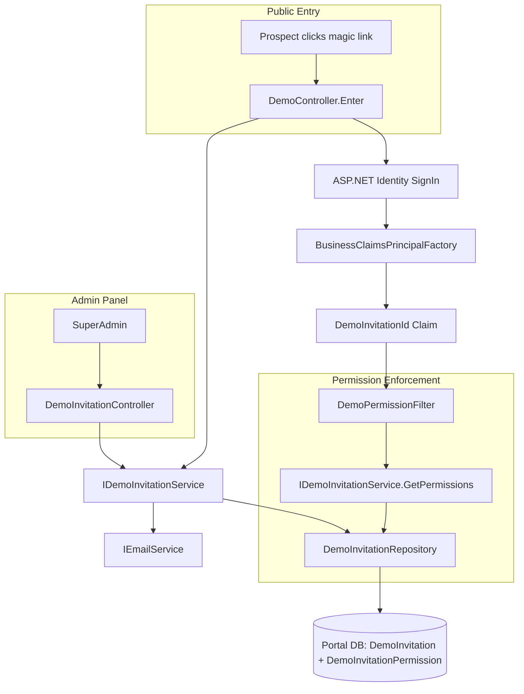
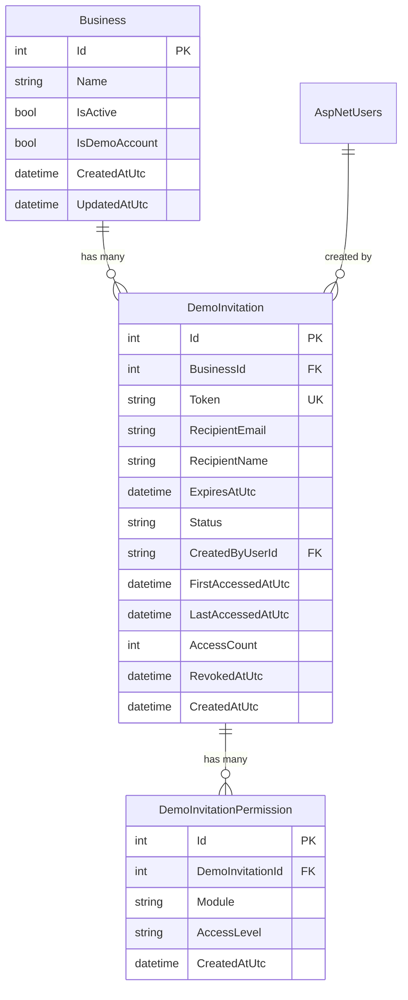

# Design Document: Demo Access Invitations

## Overview

This feature enables the SuperAdmin to create and manage demo access invitations — magic links that auto-authenticate prospects into designated demo businesses with configurable module permissions and expiry. The system separates demo invitations from the existing user invitation flow by using a dedicated `DemoInvitation` table in the Portal database (not Membership), since demo sessions are ephemeral and do not create permanent user-business relationships through the standard registration path.

### Key Design Decisions

1. **Portal DB, not Membership DB**: Demo invitations are stored in `[portal].[DemoInvitation]` because they relate to business demonstration rather than user identity management. The demo user account itself still lives in the Membership DB (ASP.NET Identity).

2. **Shared demo user per email+business**: Rather than creating a new Identity user per token access, the system creates or retrieves a single demo user per (RecipientEmail, BusinessId) pair. This avoids Identity table bloat from repeated demo accesses.

3. **Claims-based permission enforcement**: Demo sessions inject a `DemoInvitationId` claim at sign-in. An `IAuthorizationFilter` reads this claim and resolves permissions from `DemoInvitationPermission` rather than `UserBusinessPermission`, ensuring demo permissions are invitation-scoped and immutable.

4. **Token format**: 32-byte cryptographic random → Base64URL (no padding) produces a 43-character URL-safe token. This provides 256 bits of entropy — effectively unguessable.

5. **Sliding session expiry**: Demo sessions use a dedicated cookie authentication scheme (`DemoScheme`) with a 2-hour sliding expiry, isolated from the primary authentication cookie so regular users are unaffected.

## Architecture



### Component Interaction Flow

**Invitation Creation:**
```
SuperAdmin → POST /Admin/DemoInvitations/Create
  → DemoInvitationController.Create()
  → IDemoInvitationService.CreateAsync()
    → Generate token (32-byte crypto random → Base64URL)
    → Persist DemoInvitation + DemoInvitationPermission records
    → IEmailService.SendDemoInvitationEmailAsync()
  → Return JSON { success: true }
```

**Demo Entry:**
```
Prospect → GET /Demo/Enter?token=XXXXX
  → DemoController.Enter()
  → IDemoInvitationService.ValidateAndTrackAccessAsync()
    → Lookup token, check status + expiry
    → Update FirstAccessedAtUtc / LastAccessedAtUtc / AccessCount
  → Create/retrieve demo ApplicationUser
  → SignIn with DemoScheme (includes DemoInvitationId claim)
  → Redirect to Dashboard
```

**Permission Check (every request):**
```
Request → DemoPermissionFilter (global)
  → Check if DemoInvitationId claim exists
  → If yes: resolve module from route, check DemoInvitationPermission
  → If access denied: return 403 / restricted page
```

## Components and Interfaces

### 1. Database Migrations

| Migration | File | Description |
|-----------|------|-------------|
| 089 | `089_AddIsDemoAccountToBusiness.sql` | Adds `IsDemoAccount BIT NOT NULL DEFAULT 0` + filtered index |
| 090 | `090_CreateDemoInvitationTable.sql` | Creates `[portal].[DemoInvitation]` with all columns, constraints, indexes |
| 091 | `091_CreateDemoInvitationPermissionTable.sql` | Creates `[portal].[DemoInvitationPermission]` with FK, unique constraint, check constraints |

### 2. Entity Models

```csharp
// Portal.Infrastructure/Entities/DemoInvitation.cs
namespace Portal.Infrastructure.Entities;

public class DemoInvitation
{
    public int Id { get; set; }
    public int BusinessId { get; set; }
    public string Token { get; set; } = null!;
    public string RecipientEmail { get; set; } = null!;
    public string? RecipientName { get; set; }
    public DateTime ExpiresAtUtc { get; set; }
    public string Status { get; set; } = null!; // 'sent', 'accessed', 'expired', 'revoked'
    public string CreatedByUserId { get; set; } = null!;
    public DateTime? FirstAccessedAtUtc { get; set; }
    public DateTime? LastAccessedAtUtc { get; set; }
    public int AccessCount { get; set; }
    public DateTime? RevokedAtUtc { get; set; }
    public DateTime CreatedAtUtc { get; set; }

    // Navigation
    public Business Business { get; set; } = null!;
    public ICollection<DemoInvitationPermission> Permissions { get; set; } = new List<DemoInvitationPermission>();
}
```

```csharp
// Portal.Infrastructure/Entities/DemoInvitationPermission.cs
namespace Portal.Infrastructure.Entities;

public class DemoInvitationPermission
{
    public int Id { get; set; }
    public int DemoInvitationId { get; set; }
    public string Module { get; set; } = null!;
    public string AccessLevel { get; set; } = null!;
    public DateTime CreatedAtUtc { get; set; }

    // Navigation
    public DemoInvitation DemoInvitation { get; set; } = null!;
}
```

### 3. Repository Layer

```csharp
// Portal.Infrastructure/Repositories/DemoInvitationRepository.cs
public class DemoInvitationRepository : GenericStoredProcedureRepository<DemoInvitation>
{
    public DemoInvitationRepository(DbContext context) : base(context) { }

    public async Task<DemoInvitation?> GetByTokenAsync(string token);
    public async Task<List<DemoInvitation>> GetAllAsync();
    public async Task<List<DemoInvitation>> GetPagedAsync(int page, int pageSize);
    public async Task<int> GetTotalCountAsync();
    public async Task InsertAsync(DemoInvitation invitation, List<DemoInvitationPermission> permissions);
    public async Task UpdateStatusAsync(int id, string status, DateTime? revokedAtUtc = null);
    public async Task UpdateAccessTrackingAsync(int id, DateTime accessedAtUtc, bool isFirstAccess);
    public async Task<List<DemoInvitationPermission>> GetPermissionsByInvitationIdAsync(int invitationId);
    public async Task<List<Business>> GetDemoBusinessesAsync();
}
```

### 4. Service Layer

```csharp
// Portal.Infrastructure/Services/IDemoInvitationService.cs
public interface IDemoInvitationService
{
    Task<DemoInvitation> CreateAsync(CreateDemoInvitationRequest request, string createdByUserId);
    Task<DemoInvitationValidationResult> ValidateAndTrackAccessAsync(string token);
    Task RevokeAsync(int invitationId);
    Task ResendEmailAsync(int invitationId);
    Task<PagedResult<DemoInvitationListItem>> GetAllPagedAsync(int page, int pageSize);
    Task<List<DemoBusinessItem>> GetDemoBusinessesAsync();
    Task<Dictionary<string, string>> GetPermissionsForInvitationAsync(int invitationId);
    string GenerateToken();
}
```

### 5. Controllers

```csharp
// Portal.Web/Controllers/DemoController.cs
[AllowAnonymous]
public class DemoController : Controller
{
    // GET /Demo/Enter?token=XXXXX — public entry endpoint
    [HttpGet("Demo/Enter")]
    public async Task<IActionResult> Enter(string? token);
}

// Portal.Web/Controllers/DemoInvitationController.cs
[Authorize(Roles = "SuperAdmin")]
[Route("Admin/DemoInvitations")]
public class DemoInvitationController : Controller
{
    // GET /Admin/DemoInvitations — list view
    [HttpGet("")]
    public async Task<IActionResult> Index(int page = 1);

    // GET /Admin/DemoInvitations/Create — create form
    [HttpGet("Create")]
    public async Task<IActionResult> Create();

    // POST /Admin/DemoInvitations/Create — AJAX create
    [HttpPost("Create")]
    [ValidateAntiForgeryToken]
    public async Task<IActionResult> Create([FromBody] CreateDemoInvitationRequest request);

    // POST /Admin/DemoInvitations/Revoke — AJAX revoke
    [HttpPost("Revoke")]
    [ValidateAntiForgeryToken]
    public async Task<IActionResult> Revoke([FromBody] RevokeRequest request);

    // POST /Admin/DemoInvitations/Resend — AJAX resend
    [HttpPost("Resend")]
    [ValidateAntiForgeryToken]
    public async Task<IActionResult> Resend([FromBody] ResendRequest request);
}
```

### 6. Permission Enforcement Filter

```csharp
// Portal.Web/Filters/DemoPermissionFilter.cs
public class DemoPermissionFilter : IAsyncAuthorizationFilter
{
    // Checks DemoInvitationId claim → resolves module from route → enforces access level
    // Skips for non-demo users (no DemoInvitationId claim)
    // Returns 403 for 'none' access, blocks writes for 'readonly'
}
```

### 7. Email Service Extension

```csharp
// Added to IEmailService interface
Task SendDemoInvitationEmailAsync(string toEmail, string magicLink, string businessName, DateTime expiresAtUtc);
```

## Data Models

### Database Schema

#### Migration 089: Add IsDemoAccount to Business

```sql
-- 089_AddIsDemoAccountToBusiness.sql
ALTER TABLE [portal].[Business]
    ADD [IsDemoAccount] BIT NOT NULL
    CONSTRAINT [DF_Business_IsDemoAccount] DEFAULT (0);
GO

CREATE NONCLUSTERED INDEX [IX_Business_IsDemoAccount]
    ON [portal].[Business] ([IsDemoAccount])
    WHERE [IsDemoAccount] = 1;
GO

-- Mark existing demo business
UPDATE [portal].[Business]
SET [IsDemoAccount] = 1
WHERE [Id] = 1000;
GO
```

#### Migration 090: Create DemoInvitation Table

```sql
-- 090_CreateDemoInvitationTable.sql
CREATE TABLE [portal].[DemoInvitation]
(
    [Id]                  INT            IDENTITY(1,1) NOT NULL,
    [BusinessId]          INT            NOT NULL,
    [Token]               NVARCHAR(100)  NOT NULL,
    [RecipientEmail]      NVARCHAR(256)  NOT NULL,
    [RecipientName]       NVARCHAR(200)  NULL,
    [ExpiresAtUtc]        DATETIME2      NOT NULL,
    [Status]              NVARCHAR(20)   NOT NULL,
    [CreatedByUserId]     NVARCHAR(450)  NOT NULL,
    [FirstAccessedAtUtc]  DATETIME2      NULL,
    [LastAccessedAtUtc]   DATETIME2      NULL,
    [AccessCount]         INT            NOT NULL CONSTRAINT [DF_DemoInvitation_AccessCount] DEFAULT (0),
    [RevokedAtUtc]        DATETIME2      NULL,
    [CreatedAtUtc]        DATETIME2      NOT NULL CONSTRAINT [DF_DemoInvitation_CreatedAtUtc] DEFAULT (GETUTCDATE()),

    CONSTRAINT [PK_DemoInvitation] PRIMARY KEY CLUSTERED ([Id]),
    CONSTRAINT [FK_DemoInvitation_Business] FOREIGN KEY ([BusinessId])
        REFERENCES [portal].[Business] ([Id]),
    CONSTRAINT [FK_DemoInvitation_CreatedByUser] FOREIGN KEY ([CreatedByUserId])
        REFERENCES [dbo].[AspNetUsers] ([Id]),
    CONSTRAINT [CK_DemoInvitation_Status] CHECK ([Status] IN ('sent', 'accessed', 'expired', 'revoked'))
);
GO

CREATE UNIQUE NONCLUSTERED INDEX [UX_DemoInvitation_Token]
    ON [portal].[DemoInvitation] ([Token]);
GO

CREATE NONCLUSTERED INDEX [IX_DemoInvitation_Status]
    ON [portal].[DemoInvitation] ([Status])
    INCLUDE ([ExpiresAtUtc], [RecipientEmail]);
GO
```

#### Migration 091: Create DemoInvitationPermission Table

```sql
-- 091_CreateDemoInvitationPermissionTable.sql
CREATE TABLE [portal].[DemoInvitationPermission]
(
    [Id]                  INT            IDENTITY(1,1) NOT NULL,
    [DemoInvitationId]    INT            NOT NULL,
    [Module]              NVARCHAR(50)   NOT NULL,
    [AccessLevel]         NVARCHAR(20)   NOT NULL,
    [CreatedAtUtc]        DATETIME2      NOT NULL CONSTRAINT [DF_DemoInvitationPermission_CreatedAtUtc] DEFAULT (GETUTCDATE()),

    CONSTRAINT [PK_DemoInvitationPermission] PRIMARY KEY CLUSTERED ([Id]),
    CONSTRAINT [FK_DemoInvitationPermission_DemoInvitation] FOREIGN KEY ([DemoInvitationId])
        REFERENCES [portal].[DemoInvitation] ([Id]),
    CONSTRAINT [UQ_DemoInvitationPermission_Module] UNIQUE ([DemoInvitationId], [Module]),
    CONSTRAINT [CK_DemoInvitationPermission_Module] CHECK ([Module] IN ('customer', 'quotation', 'invoice', 'revenue', 'purchase', 'vat', 'credit', 'audit', 'products')),
    CONSTRAINT [CK_DemoInvitationPermission_AccessLevel] CHECK ([AccessLevel] IN ('full', 'readonly', 'none'))
);
GO
```

### Entity Relationship Diagram



### Request/Response Models

```csharp
// Portal.Infrastructure/Models/CreateDemoInvitationRequest.cs
public class CreateDemoInvitationRequest
{
    public int BusinessId { get; set; }
    public string RecipientEmail { get; set; } = null!;
    public string? RecipientName { get; set; }
    public DateTime ExpiresAtUtc { get; set; }
    public List<ModulePermissionEntry> Permissions { get; set; } = new();
}

public class ModulePermissionEntry
{
    public string Module { get; set; } = null!;
    public string AccessLevel { get; set; } = null!;
}

// Portal.Infrastructure/Models/DemoInvitationValidationResult.cs
public class DemoInvitationValidationResult
{
    public bool IsValid { get; set; }
    public string? ErrorReason { get; set; } // "invalid", "expired", "revoked"
    public DemoInvitation? Invitation { get; set; }
}

// Portal.Infrastructure/Models/DemoInvitationListItem.cs
public class DemoInvitationListItem
{
    public int Id { get; set; }
    public string RecipientEmail { get; set; } = null!;
    public string? RecipientName { get; set; }
    public string BusinessName { get; set; } = null!;
    public string Status { get; set; } = null!;
    public DateTime ExpiresAtUtc { get; set; }
    public int AccessCount { get; set; }
    public DateTime? FirstAccessedAtUtc { get; set; }
    public DateTime CreatedAtUtc { get; set; }
}

// Portal.Infrastructure/Models/DemoBusinessItem.cs
public class DemoBusinessItem
{
    public int Id { get; set; }
    public string Name { get; set; } = null!;
}
```

### Token Generation Algorithm

```csharp
public string GenerateToken()
{
    Span<byte> bytes = stackalloc byte[32];
    RandomNumberGenerator.Fill(bytes);
    // Base64URL encoding (no padding): RFC 4648 §5
    return Convert.ToBase64String(bytes)
        .Replace('+', '-')
        .Replace('/', '_')
        .TrimEnd('=');
}
```

**Uniqueness check pseudocode:**
```
for attempt in 1..3:
    token = GenerateToken()
    if not exists in DB:
        return token
throw InvalidOperationException("Token generation failed after 3 attempts")
```

### Demo Session Creation Flow

```csharp
// Pseudocode for DemoController.Enter
async Task<IActionResult> Enter(string? token)
{
    if (string.IsNullOrWhiteSpace(token))
        return View("DemoInvalid");

    var result = await _demoInvitationService.ValidateAndTrackAccessAsync(token);

    if (!result.IsValid)
        return result.ErrorReason switch
        {
            "expired" => View("DemoExpired"),
            "revoked" => View("DemoRevoked"),
            _ => View("DemoInvalid")
        };

    var invitation = result.Invitation!;
    
    // Create or retrieve demo user
    var user = await _userManager.FindByEmailAsync(invitation.RecipientEmail);
    if (user == null)
    {
        user = new ApplicationUser
        {
            UserName = invitation.RecipientEmail,
            Email = invitation.RecipientEmail,
            EmailConfirmed = true,
            FirstName = invitation.RecipientName?.Split(' ').FirstOrDefault() ?? "Demo",
            LastName = invitation.RecipientName?.Split(' ').LastOrDefault() ?? "User",
            BusinessId = invitation.BusinessId,
            IsActive = true,
            CreatedAtUtc = DateTime.UtcNow
        };
        await _userManager.CreateAsync(user, GenerateRandomPassword());
    }

    // Ensure UserBusiness exists for this business
    await _demoInvitationService.EnsureDemoUserBusinessAsync(user.Id, invitation.BusinessId);

    // Sign in with additional claims
    var additionalClaims = new List<Claim>
    {
        new Claim("DemoInvitationId", invitation.Id.ToString()),
        new Claim("BusinessId", invitation.BusinessId.ToString()),
        new Claim("IsDemoSession", "true")
    };

    await _signInManager.SignInWithClaimsAsync(user, new AuthenticationProperties
    {
        IsPersistent = false,
        ExpiresUtc = DateTimeOffset.UtcNow.AddHours(2),
        AllowRefresh = true // sliding expiry
    }, additionalClaims);

    return RedirectToAction("Index", "Home");
}
```

### DemoPermissionFilter Logic

```csharp
public class DemoPermissionFilter : IAsyncAuthorizationFilter
{
    private readonly IDemoInvitationService _demoService;

    // Module-to-controller mapping
    private static readonly Dictionary<string, string[]> ModuleControllers = new()
    {
        ["customer"] = new[] { "Customer", "Customers" },
        ["quotation"] = new[] { "Quotation", "Quotations", "Proposal" },
        ["invoice"] = new[] { "Invoice", "Invoices" },
        ["revenue"] = new[] { "Payment", "Payments", "Revenue" },
        ["purchase"] = new[] { "Purchase", "Purchases", "Supplier", "Expense" },
        ["vat"] = new[] { "Vat", "VatSubmission" },
        ["credit"] = new[] { "CreditNote", "CreditNotes" },
        ["audit"] = new[] { "AuditLog", "Audit" },
        ["products"] = new[] { "Product", "Products" }
    };

    public async Task OnAuthorizationAsync(AuthorizationFilterContext context)
    {
        var demoInvitationIdClaim = context.HttpContext.User.FindFirst("DemoInvitationId");
        if (demoInvitationIdClaim == null) return; // Not a demo session, skip

        var invitationId = int.Parse(demoInvitationIdClaim.Value);
        var controllerName = context.RouteData.Values["controller"]?.ToString();
        
        if (string.IsNullOrEmpty(controllerName)) return;

        // Find which module this controller belongs to
        var module = ModuleControllers
            .FirstOrDefault(kv => kv.Value.Contains(controllerName, StringComparer.OrdinalIgnoreCase))
            .Key;

        if (module == null) return; // Not a module controller (Home, Account, etc.)

        var permissions = await _demoService.GetPermissionsForInvitationAsync(invitationId);
        
        if (!permissions.TryGetValue(module, out var accessLevel) || accessLevel == AccessLevels.None)
        {
            context.Result = new ViewResult { ViewName = "DemoAccessRestricted" };
            return;
        }

        if (accessLevel == AccessLevels.ReadOnly && IsWriteAction(context))
        {
            context.Result = new JsonResult(new { success = false, message = "Demo access is read-only for this module." })
            { StatusCode = 403 };
            return;
        }
    }

    private static bool IsWriteAction(AuthorizationFilterContext context)
    {
        return context.HttpContext.Request.Method != "GET";
    }
}
```

### Email Template

The demo invitation email follows the existing branded template pattern (same as `BuildInvitationHtml`):

```csharp
public async Task SendDemoInvitationEmailAsync(string toEmail, string magicLink, string businessName, DateTime expiresAtUtc)
{
    var subject = $"You're invited to explore {businessName} on Portal";
    var htmlBody = BuildDemoInvitationHtml(magicLink, businessName, expiresAtUtc);
    await _emailSender.SendEmailAsync(toEmail, subject, htmlBody, EmailDepartmentEnum.Sales);
}
```

Key differences from standard invitation email:
- CTA button text: "Explore Demo" (not "Create Account")
- Includes expiry date in human-readable format
- Uses `EmailDepartmentEnum.Sales` routing (not `InvitationRequest`)
- Body text emphasizes exploration, not account creation

### Views

| View | Path | Description |
|------|------|-------------|
| Index | `Views/DemoInvitation/Index.cshtml` | Admin list with status badges, pagination, revoke/resend buttons |
| Create | `Views/DemoInvitation/Create.cshtml` | Form: business dropdown, email, name, expiry datepicker, module permissions grid |
| DemoInvalid | `Views/Demo/DemoInvalid.cshtml` | Error page: "This demo link is not valid." |
| DemoExpired | `Views/Demo/DemoExpired.cshtml` | Friendly page: "This demo link has expired." |
| DemoRevoked | `Views/Demo/DemoRevoked.cshtml` | Friendly page: "This demo link has been revoked." |
| DemoAccessRestricted | `Views/Shared/DemoAccessRestricted.cshtml` | 403 page for demo users accessing restricted modules |
| DemoSessionExpired | `Views/Demo/DemoSessionExpired.cshtml` | Shown after 2-hour inactivity timeout |


## Correctness Properties

*A property is a characteristic or behavior that should hold true across all valid executions of a system — essentially, a formal statement about what the system should do. Properties serve as the bridge between human-readable specifications and machine-verifiable correctness guarantees.*

### Property 1: Token Format Validity

*For any* generated token, decoding it from Base64URL (replacing `-` with `+`, `_` with `/`, and restoring padding) SHALL produce exactly 32 bytes, and the token string SHALL contain only characters from the set `[A-Za-z0-9_-]` with no `=` padding.

**Validates: Requirements 4.1, 4.2**

### Property 2: Demo Business Filtering

*For any* set of Business records with varying `IsDemoAccount` values, calling `GetDemoBusinessesAsync()` SHALL return exactly the businesses where `IsDemoAccount = 1` and SHALL NOT include any business where `IsDemoAccount = 0`.

**Validates: Requirements 1.2**

### Property 3: Token Validation — Valid vs Expired

*For any* DemoInvitation, if its Status is in `{'sent', 'accessed'}` and `ExpiresAtUtc > UtcNow`, then `ValidateAndTrackAccessAsync(token)` SHALL return `IsValid = true`. Conversely, *for any* DemoInvitation where `ExpiresAtUtc <= UtcNow`, the system SHALL return `IsValid = false` with `ErrorReason = "expired"` and update the Status to `'expired'`.

**Validates: Requirements 7.2, 7.4**

### Property 4: Access Tracking Invariants

*For any* valid token access, the system SHALL increment `AccessCount` by exactly 1 and set `LastAccessedAtUtc` to the current UTC time. Additionally, if `FirstAccessedAtUtc` was null before the access, it SHALL be set to the current UTC time and the Status SHALL become `'accessed'`.

**Validates: Requirements 9.1, 9.2**

### Property 5: Demo Permission Enforcement

*For any* demo session with a `DemoInvitationId` claim and *for any* controller mapped to a PortalModule, the `DemoPermissionFilter` SHALL: (a) deny access when the module's AccessLevel is `'none'` or the module has no permission entry, (b) allow GET requests but block non-GET requests when AccessLevel is `'readonly'`, and (c) allow all requests when AccessLevel is `'full'`.

**Validates: Requirements 8.5, 14.1, 14.2, 14.3, 14.4**

### Property 6: Invitation Creation Validation

*For any* `CreateDemoInvitationRequest` where the email format is invalid, OR the BusinessId does not reference a business with `IsDemoAccount = 1`, OR `ExpiresAtUtc` is not in the future, OR no module has AccessLevel `'full'` or `'readonly'`, calling `CreateAsync()` SHALL return a validation error and SHALL NOT persist any record.

**Validates: Requirements 5.2**

### Property 7: Email Content Completeness

*For any* business name and expiry date, the generated demo invitation email HTML SHALL contain the business name, the expiry date in human-readable format, and an anchor element whose `href` contains the magic link URL.

**Validates: Requirements 6.2**

### Property 8: Invitation List Ordering

*For any* set of DemoInvitations, `GetAllPagedAsync()` SHALL return results sorted by `CreatedAtUtc` in descending order (newest first), such that for every adjacent pair `(result[i], result[i+1])`, `result[i].CreatedAtUtc >= result[i+1].CreatedAtUtc`.

**Validates: Requirements 10.2**

### Property 9: Pagination Correctness

*For any* total count N of invitations and *for any* valid page P with page size 10, `GetAllPagedAsync(P, 10)` SHALL return at most 10 items, the items SHALL correspond to the correct offset `(P-1)*10` in the sorted list, and the total count SHALL equal N.

**Validates: Requirements 10.4**

### Property 10: Revocation State Transition

*For any* DemoInvitation with Status `'sent'` or `'accessed'`, calling `RevokeAsync(id)` SHALL set the Status to `'revoked'` and set `RevokedAtUtc` to a timestamp within a reasonable tolerance of the current UTC time.

**Validates: Requirements 11.3**

## Error Handling

### Token Validation Errors

| Scenario | Behaviour | User-Facing |
|----------|-----------|-------------|
| Token is null/empty | Return immediately | DemoInvalid view |
| Token not found in DB | Return invalid result | DemoInvalid view |
| Token expired | Update status → 'expired', return expired | DemoExpired view |
| Token revoked | Return revoked result | DemoRevoked view |
| Token collision during generation | Retry up to 3 times | If all fail: exception + error JSON to admin |

### Service Layer Errors

| Scenario | Behaviour |
|----------|-----------|
| Email send failure | Log error, still persist invitation, return success = false with message |
| Database failure during creation | Exception propagates, controller catches and returns error JSON |
| Invalid module/access level in request | Validation rejects before DB write |
| Business not found or not demo | Validation error returned |

### Controller Error Handling Pattern

```csharp
[HttpPost("Create")]
public async Task<IActionResult> Create([FromBody] CreateDemoInvitationRequest request)
{
    try
    {
        var userId = User.FindFirstValue(ClaimTypes.NameIdentifier)!;
        var result = await _demoInvitationService.CreateAsync(request, userId);
        return Json(new { success = true, message = $"Invitation sent to {request.RecipientEmail}" });
    }
    catch (ValidationException ex)
    {
        return Json(new { success = false, message = ex.Message });
    }
    catch (Exception ex)
    {
        Log.Error(ex, "Failed to create demo invitation for {Email}", request.RecipientEmail);
        return Json(new { success = false, message = "An unexpected error occurred. Please try again." });
    }
}
```

### Demo Session Expiry

When the 2-hour sliding cookie expires:
1. ASP.NET Core middleware rejects the request (cookie expired)
2. The `Events.OnRedirectToLogin` handler checks for `IsDemoSession` claim in the expired cookie
3. If demo session: redirect to `/Demo/SessionExpired` instead of `/Account/Login`
4. If regular user: standard login redirect

## Testing Strategy

### Unit Tests (Example-Based)

| Area | Tests |
|------|-------|
| Token generation | Generates non-null, non-empty string |
| Token collision retry | Retries on collision, fails after 3 |
| Validation: missing token | Returns invalid |
| Validation: revoked token | Returns revoked error |
| Revoke: already revoked | No-op or appropriate response |
| Controller authorization | 403 for non-SuperAdmin |
| Email failure handling | Invitation persisted despite email failure |

### Property-Based Tests (Universal)

**Library**: [FsCheck](https://fscheck.github.io/FsCheck/) via FsCheck.Xunit (already available in .NET ecosystem, integrates with xUnit)

**Configuration**: Minimum 100 iterations per property test.

| Property # | Test Description | Tag |
|------------|-----------------|-----|
| 1 | Token format validity | Feature: demo-access-invitations, Property 1: Token format |
| 2 | Demo business filtering | Feature: demo-access-invitations, Property 2: Demo business filtering |
| 3 | Token validation logic | Feature: demo-access-invitations, Property 3: Validation valid vs expired |
| 4 | Access tracking invariants | Feature: demo-access-invitations, Property 4: Access tracking |
| 5 | Permission enforcement | Feature: demo-access-invitations, Property 5: Permission enforcement |
| 6 | Input validation rejection | Feature: demo-access-invitations, Property 6: Validation rejection |
| 7 | Email content completeness | Feature: demo-access-invitations, Property 7: Email content |
| 8 | List ordering | Feature: demo-access-invitations, Property 8: List ordering |
| 9 | Pagination correctness | Feature: demo-access-invitations, Property 9: Pagination |
| 10 | Revocation state transition | Feature: demo-access-invitations, Property 10: Revocation |

### Integration Tests

| Area | Tests |
|------|-------|
| Database constraints | Unique token, check constraint on status, FK enforcement |
| Full entry flow | Valid token → user creation → sign-in → redirect |
| Email delivery | Verify SMTP call with correct parameters |
| Concurrent access | Two simultaneous token accesses increment correctly |

### Test Organization

```
Portal.Tests/
├── PropertyBased/
│   └── DemoInvitation/
│       ├── TokenGenerationPropertyTests.cs
│       ├── TokenValidationPropertyTests.cs
│       ├── AccessTrackingPropertyTests.cs
│       ├── PermissionEnforcementPropertyTests.cs
│       ├── InvitationListPropertyTests.cs
│       └── EmailContentPropertyTests.cs
├── Unit/
│   └── DemoInvitation/
│       ├── DemoInvitationServiceTests.cs
│       ├── DemoControllerTests.cs
│       └── DemoPermissionFilterTests.cs
└── Integration/
    └── DemoInvitation/
        ├── DemoInvitationRepositoryTests.cs
        └── DemoEntryFlowTests.cs
```
