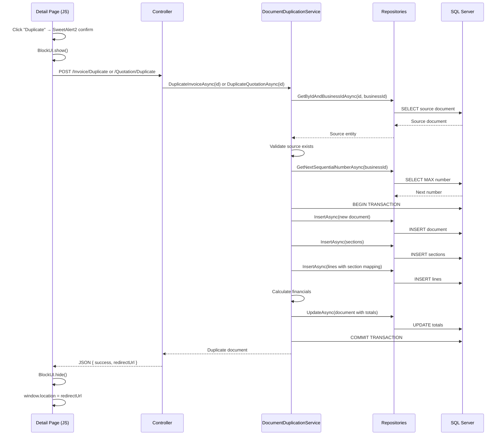

# Design Document: Document Duplication

## Overview

The Document Duplication feature adds the ability for managers to duplicate existing invoices and quotations, creating new standalone documents in Draft status. This supports recurring billing scenarios where the same document structure is reused periodically.

The feature follows the existing patterns established by the Quotation-to-Invoice conversion flow (`ConvertFromQuotationAsync`), reusing the same transactional approach, repository layer, and service architecture. A new `IDocumentDuplicationService` encapsulates all duplication logic for both document types, keeping the existing `IInvoiceService` and `IQuotationService` interfaces unchanged.

**Key Design Decisions:**
- Single dedicated service (`DocumentDuplicationService`) rather than adding methods to existing services — keeps duplication logic cohesive and avoids bloating existing interfaces.
- Reuses existing repositories (`InvoiceRepository`, `QuotationRepository`, etc.) — no new data access layer needed.
- Duration/validity gap calculation happens in the service layer as a pure computation — easily testable.
- Financial recalculation reuses the same formula already used in `ConvertFromQuotationAsync`.

## Architecture



### Layer Responsibilities

| Layer | Responsibility |
|-------|---------------|
| **View (JS)** | Confirmation dialog, BlockUI, AJAX call, redirect |
| **Controller** | HTTP concerns, tenant resolution, JSON response |
| **Service** | Validation, date calculations, orchestration, transaction management |
| **Repository** | Data access (existing repositories, no changes) |

## Components and Interfaces

### New Service Interface

```csharp
namespace Portal.Infrastructure.Services;

/// <summary>
/// Handles duplication of invoices and quotations into new Draft documents.
/// </summary>
public interface IDocumentDuplicationService
{
    /// <summary>
    /// Duplicates an existing invoice, creating a new Draft invoice with fresh dates,
    /// a new sequential number, and all sections/lines copied.
    /// </summary>
    Task<Invoice> DuplicateInvoiceAsync(int sourceInvoiceId, string userId);

    /// <summary>
    /// Duplicates an existing quotation, creating a new Draft quotation with a fresh
    /// validity period, a new sequential reference, and all sections/lines copied.
    /// </summary>
    Task<Quotation> DuplicateQuotationAsync(int sourceQuotationId, string userId);
}
```

### Service Implementation

```csharp
namespace Portal.Infrastructure.Services;

public class DocumentDuplicationService : IDocumentDuplicationService
{
    private readonly ICurrentTenantService _currentTenantService;
    private readonly InvoiceRepository _invoiceRepository;
    private readonly InvoiceLineRepository _invoiceLineRepository;
    private readonly InvoiceSectionRepository _invoiceSectionRepository;
    private readonly QuotationRepository _quotationRepository;
    private readonly QuotationLineRepository _quotationLineRepository;
    private readonly ProposalSectionRepository _proposalSectionRepository;
    private readonly AuditLogRepository _auditLogRepository;
    private readonly PortalDbContext _portalDbContext;

    // Constructor with DI...
}
```

### Controller Endpoints

**InvoiceController** — new endpoint:

```csharp
[HttpPost]
[ValidateAntiForgeryToken]
public async Task<IActionResult> Duplicate(int id)
{
    try
    {
        var userId = User.FindFirstValue(ClaimTypes.NameIdentifier)!;
        var duplicate = await _duplicationService.DuplicateInvoiceAsync(id, userId);
        return Json(new { success = true, redirectUrl = Url.Action("Details", new { id = duplicate.Id }) });
    }
    catch (InvalidOperationException ex)
    {
        return Json(new { success = false, message = ex.Message });
    }
}
```

**QuotationController** — new endpoint:

```csharp
[HttpPost]
[ValidateAntiForgeryToken]
public async Task<IActionResult> Duplicate(int id)
{
    try
    {
        var userId = User.FindFirstValue(ClaimTypes.NameIdentifier)!;
        var duplicate = await _duplicationService.DuplicateQuotationAsync(id, userId);
        return Json(new { success = true, redirectUrl = Url.Action("Details", new { id = duplicate.Id }) });
    }
    catch (InvalidOperationException ex)
    {
        return Json(new { success = false, message = ex.Message });
    }
}
```

### UI Component (JavaScript)

Standard AJAX pattern per project conventions:

```javascript
async function duplicateDocument(documentId, documentType) {
    const result = await Swal.fire({
        title: 'Duplicate Document',
        text: `Are you sure you want to duplicate this ${documentType}?`,
        icon: 'question',
        showCancelButton: true,
        confirmButtonColor: '#0D5EA6',
        confirmButtonText: 'Yes, duplicate it'
    });

    if (!result.isConfirmed) return;

    BlockUI.show('Duplicating...');
    try {
        var response = await fetch(`/${documentType}/Duplicate`, {
            method: 'POST',
            headers: {
                'Content-Type': 'application/x-www-form-urlencoded',
                'RequestVerificationToken': getAntiForgeryToken()
            },
            body: `id=${documentId}`
        });
        var data = await response.json();
        BlockUI.hide();

        if (data.success) {
            window.location = data.redirectUrl;
        } else {
            Swal.fire({ title: 'Error', text: data.message, icon: 'error', confirmButtonColor: '#0D5EA6' });
        }
    } catch (e) {
        BlockUI.hide();
        Swal.fire({ title: 'Error', text: 'An unexpected error occurred.', icon: 'error', confirmButtonColor: '#0D5EA6' });
    }
}
```

## Data Models

### Entities Involved (No Schema Changes Required)

The duplication feature operates entirely on existing entities. No new tables or columns are needed.

| Entity | Schema | Role in Duplication |
|--------|--------|-------------------|
| `Invoice` | `[invoice].[Invoice]` | Source and target for invoice duplication |
| `InvoiceLine` | `[invoice].[InvoiceLine]` | Copied from source to duplicate |
| `InvoiceSection` | `[invoice].[InvoiceSection]` | Copied from source to duplicate |
| `Quotation` | `[quotation].[Quotation]` | Source and target for quotation duplication |
| `QuotationLine` | `[quotation].[QuotationLine]` | Copied from source to duplicate |
| `ProposalSection` | `[quotation].[ProposalSection]` | Copied from source to duplicate |
| `AuditLog` | `[dbo].[AuditLog]` | Records duplication event |

### Field Mapping: Invoice Duplication

| Source Field | Duplicate Field | Rule |
|-------------|----------------|------|
| — | `Id` | New (auto-generated) |
| `BusinessId` | `BusinessId` | Same (current tenant) |
| `CustomerId` | `CustomerId` | Copied |
| `QuotationId` | `QuotationId` | Always `null` |
| — | `InvoiceStatusTypeId` | Always `1` (Draft) |
| — | `InvoiceFinancialStatusTypeId` | Always `1` (Unpaid) |
| — | `InvoiceNumber` | New sequential (`INV-{BusinessId}-{N:D5}`) |
| — | `InvoiceDate` | Today (`DateOnly.FromDateTime(DateTime.UtcNow)`) |
| `DueDate - InvoiceDate` | `DueDate` | Today + duration gap |
| `Subtotal` | `Subtotal` | Recalculated |
| `TaxAmount` | `TaxAmount` | Recalculated |
| `TotalAmount` | `TotalAmount` | Recalculated |
| `CurrencyCode` | `CurrencyCode` | Copied |
| `Notes` | `Notes` | Copied |
| `IsGrandTotalShown` | `IsGrandTotalShown` | Copied |
| `IsQuotationReferenceShown` | `IsQuotationReferenceShown` | Copied |
| — | `CreatedAtUtc` | `DateTime.UtcNow` |
| — | `UpdatedAtUtc` | `DateTime.UtcNow` |

### Field Mapping: Quotation Duplication

| Source Field | Duplicate Field | Rule |
|-------------|----------------|------|
| — | `Id` | New (auto-generated) |
| `BusinessId` | `BusinessId` | Same (current tenant) |
| `CustomerId` | `CustomerId` | Copied |
| — | `QuotationStatusTypeId` | Always `1` (Draft) |
| — | `Reference` | New sequential (`QUO-{BusinessId}-{N:D5}`) |
| `ValidUntil - CreatedAtUtc` | `ValidUntil` | Today + validity gap (or `null`) |
| `Subtotal` | `Subtotal` | Recalculated |
| `TaxAmount` | `TaxAmount` | Recalculated |
| `TotalAmount` | `TotalAmount` | Recalculated |
| `Notes` | `Notes` | Copied |
| `IsGrandTotalShown` | `IsGrandTotalShown` | Copied |
| `QuotationContactId` | `QuotationContactId` | Always `null` |
| — | `CreatedAtUtc` | `DateTime.UtcNow` |
| — | `UpdatedAtUtc` | `DateTime.UtcNow` |

### Financial Calculation Formula

```
For each line item:
  if DiscountType == "Percentage":
    discountedPrice = UnitPrice * (1 - Discount / 100)
  else: // "Fixed"
    discountedPrice = UnitPrice - Discount

  lineTotal = Quantity * discountedPrice

Document totals:
  Subtotal  = SUM(lineTotal for all lines)
  TaxAmount = SUM(ROUND(lineTotal * VatRate / 100, 2) for all lines)
  TotalAmount = Subtotal + TaxAmount
```

## Correctness Properties

*A property is a characteristic or behavior that should hold true across all valid executions of a system — essentially, a formal statement about what the system should do. Properties serve as the bridge between human-readable specifications and machine-verifiable correctness guarantees.*

### Property 1: Invoice header duplication correctness

*For any* source invoice (regardless of its current status, dates, or linked quotation), the duplicate invoice SHALL have `InvoiceStatusTypeId = 1`, `InvoiceFinancialStatusTypeId = 1`, `QuotationId = null`, `InvoiceDate = today`, and the same `CustomerId`, `Notes`, `IsGrandTotalShown`, `IsQuotationReferenceShown`, and `CurrencyCode` as the source.

**Validates: Requirements 3.1, 3.3, 3.5, 3.6, 3.7**

### Property 2: Invoice duration gap preservation

*For any* source invoice with any `InvoiceDate` and `DueDate`, the duplicate's `DueDate` SHALL equal today's date plus the number of days between the source's `InvoiceDate` and `DueDate` (the duration gap).

**Validates: Requirements 3.4**

### Property 3: Quotation header duplication correctness

*For any* source quotation (regardless of its current status or linked contact), the duplicate quotation SHALL have `QuotationStatusTypeId = 1`, `QuotationContactId = null`, and the same `CustomerId`, `Notes`, and `IsGrandTotalShown` as the source.

**Validates: Requirements 4.1, 4.4, 4.5, 4.6**

### Property 4: Quotation validity period preservation

*For any* source quotation, if `ValidUntil` is not null, the duplicate's `ValidUntil` SHALL equal today's date plus the number of days between the source's `CreatedAtUtc` date and its `ValidUntil` date. If `ValidUntil` is null, the duplicate's `ValidUntil` SHALL also be null.

**Validates: Requirements 4.3**

### Property 5: Line item field preservation

*For any* source document (invoice or quotation) with any number of line items containing any valid field values, the duplicate SHALL contain the same number of line items, and each line's `Description`, `Quantity`, `UnitPrice`, `VatRate`, `Discount`, `DiscountType`, `CostPrice`, `SortOrder`, `ReferenceUrl`, and `Subtitle` SHALL be identical to the corresponding source line.

**Validates: Requirements 5.1, 5.2**

### Property 6: Section-to-line mapping preservation

*For any* source document with sections and line items, if a source line belongs to a section, the corresponding duplicate line SHALL belong to the corresponding duplicate section. If a source line does not belong to any section, the duplicate line SHALL also have a null section assignment.

**Validates: Requirements 5.3, 5.4**

### Property 7: Section field preservation

*For any* source document (invoice or quotation) with any number of sections containing any valid field values, the duplicate SHALL contain the same number of sections, and each section's `Name`, `SortOrder`, `ColumnConfiguration`, `SectionType`, `Description`, `Notes`, `IsEmphasized`, `AccentColor`, `Label`, and `IsTotalsTableShown` SHALL be identical to the corresponding source section.

**Validates: Requirements 6.1, 6.2**

### Property 8: Financial calculation correctness

*For any* set of line items with valid `Quantity`, `UnitPrice`, `Discount`, `DiscountType`, and `VatRate` values, the duplicate document's `Subtotal` SHALL equal the sum of all line totals, `TaxAmount` SHALL equal the sum of each line's VAT contribution (`ROUND(lineTotal * VatRate / 100, 2)`), and `TotalAmount` SHALL equal `Subtotal + TaxAmount`.

**Validates: Requirements 7.1, 7.2, 7.3, 7.4**

### Property 9: Document independence — new identifiers

*For any* source document, the duplicate document, all its sections, and all its line items SHALL have different primary key identifiers than the source document's corresponding entities.

**Validates: Requirements 8.2**

## Error Handling

| Scenario | Handling | User Feedback |
|----------|----------|---------------|
| Source document not found | `InvalidOperationException` thrown by service | SweetAlert2 error: "Invoice not found" / "Quotation not found" |
| Source belongs to different business | `InvalidOperationException` thrown by service | SweetAlert2 error: same as not found (no information leakage) |
| Database error during transaction | Transaction rolled back, exception rethrown | SweetAlert2 error: "An unexpected error occurred." |
| Network failure (AJAX) | `catch` block in JavaScript | SweetAlert2 error: "An unexpected error occurred." |
| Sequential number generation failure | Transaction rolled back | SweetAlert2 error: "An unexpected error occurred." |

### Transaction Rollback Strategy

Following the established pattern from `ConvertFromQuotationAsync`:

```csharp
using var transaction = await _portalDbContext.Database.BeginTransactionAsync();
try
{
    // All duplication operations...
    await transaction.CommitAsync();
    return duplicate;
}
catch
{
    await transaction.RollbackAsync();
    throw;
}
```

This ensures atomicity — either the complete document (header + sections + lines + totals) is created, or nothing is persisted.

## Testing Strategy

### Property-Based Tests (via FsCheck + xUnit)

The project will use **FsCheck** with **xUnit** for property-based testing. Each property test runs a minimum of 100 iterations with randomly generated inputs.

**Target: Pure computation logic extracted into testable static methods.**

The duplication service's core logic (date calculations, financial calculations, field mapping) will be tested via properties:

| Property | What's Generated | What's Verified |
|----------|-----------------|-----------------|
| Property 1 | Random Invoice entities with varied statuses, dates, fields | Header fields on duplicate |
| Property 2 | Random InvoiceDate/DueDate pairs | DueDate = today + gap |
| Property 3 | Random Quotation entities with varied statuses, contacts | Header fields on duplicate |
| Property 4 | Random CreatedAtUtc/ValidUntil pairs (including null) | ValidUntil calculation |
| Property 5 | Random lists of line items with varied field values | All specified fields preserved |
| Property 6 | Random documents with sections and mixed line assignments | Section mapping preserved |
| Property 7 | Random lists of sections with varied field values | All specified fields preserved |
| Property 8 | Random line items with varied Quantity/UnitPrice/Discount/VatRate | Financial totals correct |
| Property 9 | Random source documents with sections and lines | All IDs differ |

**Configuration:**
- Minimum 100 iterations per property
- Tag format: `Feature: document-duplication, Property {N}: {title}`
- Library: FsCheck 2.x + FsCheck.Xunit

### Unit Tests (xUnit)

Focused on specific examples and edge cases:

- Source document not found → throws `InvalidOperationException`
- Source document belongs to different business → throws `InvalidOperationException`
- Source invoice with `QuotationId` set → duplicate has `QuotationId = null`
- Source quotation with `ValidUntil = null` → duplicate has `ValidUntil = null`
- Source document with zero line items → duplicate has zero line items
- Controller returns correct JSON structure on success
- Controller returns correct JSON structure on failure

### Integration Tests

- Full duplication flow with in-memory database verifying transaction commit
- Transaction rollback on simulated failure (no partial data)
- Sequential number generation produces unique numbers across concurrent duplications
