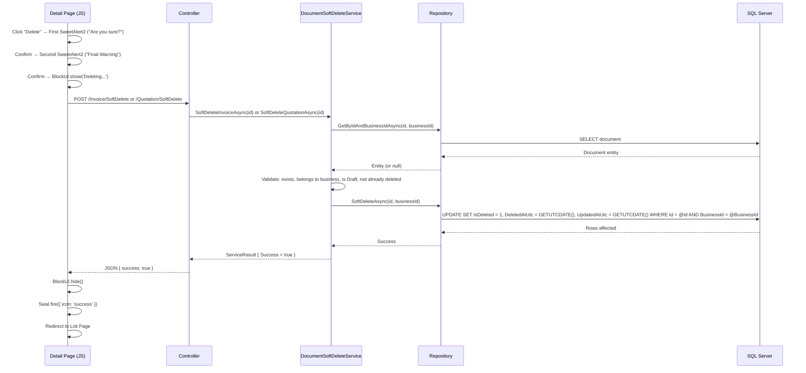
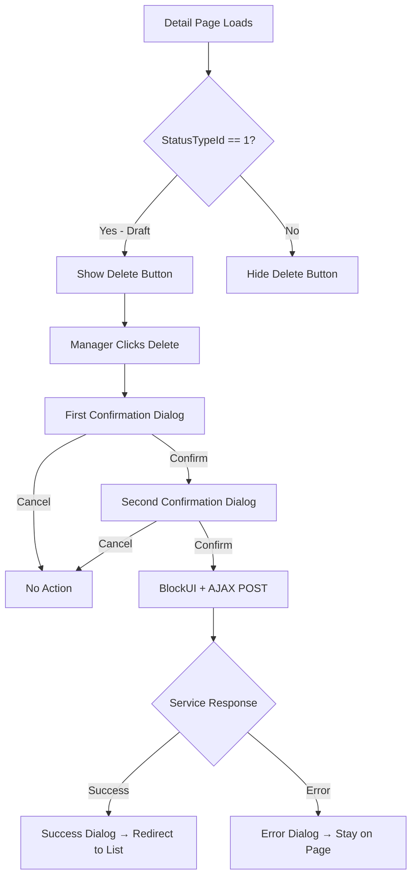

# Design Document: Document Soft Delete

## Overview

The Document Soft Delete feature adds the ability for managers to soft-delete invoices and quotations that are in Draft status. Rather than permanently removing records, a new `IsDeleted` BIT column and a `DeletedAtUtc` DATETIME2 column are added to both the `[invoice].[Invoice]` and `[quotation].[Quotation]` tables. When soft-deleted, documents are flagged (`IsDeleted = 1`) and timestamped (`DeletedAtUtc = GETUTCDATE()`) then excluded from all listing pages.

The feature introduces a new `IDocumentSoftDeleteService` that encapsulates all soft-delete validation and execution logic for both document types. This keeps the existing `IInvoiceService` and `IQuotationService` interfaces unchanged and follows the same single-responsibility pattern established by `IDocumentDuplicationService`.

**Key Design Decisions:**
- Dedicated service (`DocumentSoftDeleteService`) rather than adding delete methods to existing services — keeps deletion logic cohesive with its own validation rules.
- Two-step SweetAlert2 confirmation flow in the UI prevents accidental deletion with a single misclick.
- Only Draft status documents (StatusTypeId = 1) are eligible for deletion — enforced at both UI and service layers.
- Soft-delete is an atomic UPDATE (IsDeleted = 1, DeletedAtUtc = GETUTCDATE(), UpdatedAtUtc = GETUTCDATE()) — no data is permanently removed.
- Existing repository queries are modified to filter `WHERE IsDeleted = 0` — soft-deleted records become invisible to listing pages.
- Post-deletion redirect to the list page prevents the manager from viewing a deleted document.

## Architecture



### Layer Responsibilities

| Layer | Responsibility |
|-------|---------------|
| **View (JS)** | Two-step confirmation dialogs, BlockUI, AJAX POST, success/error display, redirect |
| **Controller** | HTTP concerns, tenant resolution, antiforgery validation, JSON response |
| **Service** | Eligibility validation (Draft status, not already deleted, ownership), orchestration |
| **Repository** | Atomic UPDATE query setting IsDeleted = 1, DeletedAtUtc, and UpdatedAtUtc |
| **Database** | Schema (IsDeleted column, DeletedAtUtc column, default constraint, composite index) |

### Delete Button Visibility Logic



## Components and Interfaces

### New Service Interface

```csharp
namespace Portal.Infrastructure.Services;

/// <summary>
/// Handles soft-deletion of invoices and quotations.
/// Only Draft status documents are eligible for soft-delete.
/// </summary>
public interface IDocumentSoftDeleteService
{
    /// <summary>
    /// Soft-deletes a Draft invoice by setting IsDeleted = 1.
    /// Returns a result indicating success or failure with an error message.
    /// </summary>
    Task<ServiceResult> SoftDeleteInvoiceAsync(int invoiceId);

    /// <summary>
    /// Soft-deletes a Draft quotation by setting IsDeleted = 1.
    /// Returns a result indicating success or failure with an error message.
    /// </summary>
    Task<ServiceResult> SoftDeleteQuotationAsync(int quotationId);
}
```

### Service Result Model

```csharp
namespace Portal.Infrastructure.Models;

/// <summary>
/// Represents the outcome of a service operation with optional error message.
/// </summary>
public class ServiceResult
{
    public bool Success { get; set; }
    public string? Message { get; set; }

    public static ServiceResult Ok() => new() { Success = true };
    public static ServiceResult Fail(string message) => new() { Success = false, Message = message };
}
```

### Service Implementation

```csharp
namespace Portal.Infrastructure.Services;

public class DocumentSoftDeleteService : IDocumentSoftDeleteService
{
    private readonly ICurrentTenantService _currentTenantService;
    private readonly InvoiceRepository _invoiceRepository;
    private readonly QuotationRepository _quotationRepository;

    private const int DraftInvoiceStatusTypeId = 1;
    private const int DraftQuotationStatusTypeId = 1;

    public DocumentSoftDeleteService(
        ICurrentTenantService currentTenantService,
        InvoiceRepository invoiceRepository,
        QuotationRepository quotationRepository)
    {
        _currentTenantService = currentTenantService;
        _invoiceRepository = invoiceRepository;
        _quotationRepository = quotationRepository;
    }

    public async Task<ServiceResult> SoftDeleteInvoiceAsync(int invoiceId)
    {
        try
        {
            var businessId = _currentTenantService.CurrentBusinessId;
            var invoice = await _invoiceRepository.GetByIdAndBusinessIdAsync(invoiceId, businessId);

            if (invoice == null)
                return ServiceResult.Fail("Invoice not found.");

            if (invoice.BusinessId != businessId)
                return ServiceResult.Fail("Invoice does not belong to this business.");

            if (invoice.IsDeleted)
                return ServiceResult.Fail("Invoice has already been deleted.");

            if (invoice.InvoiceStatusTypeId != DraftInvoiceStatusTypeId)
                return ServiceResult.Fail("Only draft invoices can be deleted.");

            await _invoiceRepository.SoftDeleteAsync(invoiceId, businessId);
            return ServiceResult.Ok();
        }
        catch (Exception)
        {
            throw;
        }
    }

    public async Task<ServiceResult> SoftDeleteQuotationAsync(int quotationId)
    {
        try
        {
            var businessId = _currentTenantService.CurrentBusinessId;
            var quotation = await _quotationRepository.GetByIdAndBusinessIdAsync(quotationId, businessId);

            if (quotation == null)
                return ServiceResult.Fail("Quotation not found.");

            if (quotation.BusinessId != businessId)
                return ServiceResult.Fail("Quotation does not belong to this business.");

            if (quotation.IsDeleted)
                return ServiceResult.Fail("Quotation has already been deleted.");

            if (quotation.QuotationStatusTypeId != DraftQuotationStatusTypeId)
                return ServiceResult.Fail("Only draft quotations can be deleted.");

            await _quotationRepository.SoftDeleteAsync(quotationId, businessId);
            return ServiceResult.Ok();
        }
        catch (Exception)
        {
            throw;
        }
    }
}
```

### New Repository Methods

Added to `InvoiceRepository`:

```csharp
public async Task SoftDeleteAsync(int id, int businessId)
{
    try
    {
        const string query = @"
            UPDATE [invoice].[Invoice]
            SET [invoice].[Invoice].[IsDeleted] = 1,
                [invoice].[Invoice].[DeletedAtUtc] = GETUTCDATE(),
                [invoice].[Invoice].[UpdatedAtUtc] = GETUTCDATE()
            WHERE [invoice].[Invoice].[Id] = @Id
              AND [invoice].[Invoice].[BusinessId] = @BusinessId
              AND [invoice].[Invoice].[IsDeleted] = 0";

        await _context.Database.ExecuteSqlRawAsync(query,
            new SqlParameter("@Id", id),
            new SqlParameter("@BusinessId", businessId));
    }
    catch (Exception)
    {
        throw;
    }
}
```

Added to `QuotationRepository`:

```csharp
public async Task SoftDeleteAsync(int id, int businessId)
{
    try
    {
        const string query = @"
            UPDATE [quotation].[Quotation]
            SET [quotation].[Quotation].[IsDeleted] = 1,
                [quotation].[Quotation].[DeletedAtUtc] = GETUTCDATE(),
                [quotation].[Quotation].[UpdatedAtUtc] = GETUTCDATE()
            WHERE [quotation].[Quotation].[Id] = @Id
              AND [quotation].[Quotation].[BusinessId] = @BusinessId
              AND [quotation].[Quotation].[IsDeleted] = 0";

        await _context.Database.ExecuteSqlRawAsync(query,
            new SqlParameter("@Id", id),
            new SqlParameter("@BusinessId", businessId));
    }
    catch (Exception)
    {
        throw;
    }
}
```

### Controller Actions

Added to `InvoiceController`:

```csharp
[HttpPost]
[ValidateAntiForgeryToken]
[ModuleAccess(PortalModules.Invoice, AccessLevels.Full)]
public async Task<IActionResult> SoftDelete(int id)
{
    var result = await _softDeleteService.SoftDeleteInvoiceAsync(id);

    if (result.Success)
        return Json(new { success = true, message = "Invoice deleted successfully." });

    return Json(new { success = false, message = result.Message });
}
```

Added to `QuotationController`:

```csharp
[HttpPost]
[ValidateAntiForgeryToken]
[ModuleAccess(PortalModules.Quotation, AccessLevels.Full)]
public async Task<IActionResult> SoftDelete(int id)
{
    var result = await _softDeleteService.SoftDeleteQuotationAsync(id);

    if (result.Success)
        return Json(new { success = true, message = "Quotation deleted successfully." });

    return Json(new { success = false, message = result.Message });
}
```

### JavaScript UI Flow (Invoice Detail Page)

```javascript
async function deleteInvoice(invoiceId) {
    // Step 1: First confirmation
    const firstResult = await Swal.fire({
        title: 'Are you sure?',
        text: 'This invoice will be deleted.',
        icon: 'warning',
        showCancelButton: true,
        confirmButtonColor: '#C24A4A',
        cancelButtonColor: '#6c757d',
        confirmButtonText: 'Yes, delete it'
    });

    if (!firstResult.isConfirmed) return;

    // Step 2: Second confirmation
    const secondResult = await Swal.fire({
        title: 'Final Warning',
        text: 'This action cannot be easily undone. Are you sure you want to proceed?',
        icon: 'warning',
        showCancelButton: true,
        confirmButtonColor: '#C24A4A',
        cancelButtonColor: '#6c757d',
        confirmButtonText: 'Yes, delete permanently'
    });

    if (!secondResult.isConfirmed) return;

    // Step 3: Execute deletion
    BlockUI.show('Deleting...');
    try {
        var response = await fetch('/Invoice/SoftDelete', {
            method: 'POST',
            headers: {
                'Content-Type': 'application/x-www-form-urlencoded',
                'RequestVerificationToken': getAntiForgeryToken()
            },
            body: `id=${invoiceId}`
        });
        var data = await response.json();
        BlockUI.hide();

        if (data.success) {
            await Swal.fire({
                title: 'Deleted!',
                text: 'The invoice has been deleted.',
                icon: 'success',
                confirmButtonColor: '#0D5EA6'
            });
            window.location.href = '/Invoice';
        } else {
            Swal.fire({
                title: 'Error',
                text: data.message,
                icon: 'error',
                confirmButtonColor: '#0D5EA6'
            });
        }
    } catch (e) {
        BlockUI.hide();
        Swal.fire({
            title: 'Error',
            text: 'An unexpected error occurred.',
            icon: 'error',
            confirmButtonColor: '#0D5EA6'
        });
    }
}
```

### JavaScript UI Flow (Quotation Detail Page)

```javascript
async function deleteQuotation(quotationId, reference) {
    // Step 1: First confirmation
    const firstResult = await Swal.fire({
        title: 'Are you sure?',
        text: `Quotation ${reference} will be deleted.`,
        icon: 'warning',
        showCancelButton: true,
        confirmButtonColor: '#C24A4A',
        cancelButtonColor: '#6c757d',
        confirmButtonText: 'Yes, delete it'
    });

    if (!firstResult.isConfirmed) return;

    // Step 2: Second confirmation
    const secondResult = await Swal.fire({
        title: 'Final Warning',
        text: 'This action cannot be easily undone. Are you sure you want to proceed?',
        icon: 'warning',
        showCancelButton: true,
        confirmButtonColor: '#C24A4A',
        cancelButtonColor: '#6c757d',
        confirmButtonText: 'Yes, delete permanently'
    });

    if (!secondResult.isConfirmed) return;

    // Step 3: Execute deletion
    BlockUI.show('Deleting...');
    try {
        var response = await fetch('/Quotation/SoftDelete', {
            method: 'POST',
            headers: {
                'Content-Type': 'application/x-www-form-urlencoded',
                'RequestVerificationToken': getAntiForgeryToken()
            },
            body: `id=${quotationId}`
        });
        var data = await response.json();
        BlockUI.hide();

        if (data.success) {
            await Swal.fire({
                title: 'Deleted!',
                text: 'The quotation has been deleted.',
                icon: 'success',
                confirmButtonColor: '#0D5EA6'
            });
            window.location.href = '/Quotation';
        } else {
            Swal.fire({
                title: 'Error',
                text: data.message,
                icon: 'error',
                confirmButtonColor: '#0D5EA6'
            });
        }
    } catch (e) {
        BlockUI.hide();
        Swal.fire({
            title: 'Error',
            text: 'An unexpected error occurred.',
            icon: 'error',
            confirmButtonColor: '#0D5EA6'
        });
    }
}
```

### Listing Query Modifications

The existing `GetAllByBusinessIdAsync` methods in both repositories must add an `IsDeleted = 0` filter:

**InvoiceRepository** — add to WHERE clause:
```sql
AND [invoice].[Invoice].[IsDeleted] = 0
```

**QuotationRepository** — add to WHERE clause:
```sql
AND [quotation].[Quotation].[IsDeleted] = 0
```

## Data Models

### Schema Changes

#### Migration: 043_AddIsDeletedToInvoice.sql

```sql
/*
    Migration: 043_AddIsDeletedToInvoice
    Description: Adds IsDeleted BIT column and DeletedAtUtc DATETIME2 column to [invoice].[Invoice] for soft-delete support.
                 IsDeleted has a named default constraint. DeletedAtUtc is nullable with no default (only populated on delete).
                 Includes a composite index for filtered queries.
    This script is idempotent — safe to run multiple times.
*/

IF NOT EXISTS (
    SELECT 1
    FROM INFORMATION_SCHEMA.COLUMNS
    WHERE TABLE_SCHEMA = 'invoice'
      AND TABLE_NAME = 'Invoice'
      AND COLUMN_NAME = 'IsDeleted'
)
BEGIN
    ALTER TABLE [invoice].[Invoice]
        ADD [IsDeleted] BIT NOT NULL
        CONSTRAINT [DF_Invoice_IsDeleted] DEFAULT (0);
END
GO

IF NOT EXISTS (
    SELECT 1
    FROM INFORMATION_SCHEMA.COLUMNS
    WHERE TABLE_SCHEMA = 'invoice'
      AND TABLE_NAME = 'Invoice'
      AND COLUMN_NAME = 'DeletedAtUtc'
)
BEGIN
    ALTER TABLE [invoice].[Invoice]
        ADD [DeletedAtUtc] DATETIME2 NULL;
END
GO

IF NOT EXISTS (
    SELECT 1
    FROM sys.indexes
    WHERE [name] = 'IX_Invoice_BusinessId_IsDeleted'
      AND [object_id] = OBJECT_ID('[invoice].[Invoice]')
)
BEGIN
    CREATE NONCLUSTERED INDEX [IX_Invoice_BusinessId_IsDeleted]
        ON [invoice].[Invoice] ([BusinessId], [IsDeleted]);
END
GO
```

#### Migration: 044_AddIsDeletedToQuotation.sql

```sql
/*
    Migration: 044_AddIsDeletedToQuotation
    Description: Adds IsDeleted BIT column and DeletedAtUtc DATETIME2 column to [quotation].[Quotation] for soft-delete support.
                 IsDeleted has a named default constraint. DeletedAtUtc is nullable with no default (only populated on delete).
                 Existing rows default IsDeleted to 0 and DeletedAtUtc to NULL.
    This script is idempotent — safe to run multiple times.
*/

IF NOT EXISTS (
    SELECT 1
    FROM INFORMATION_SCHEMA.COLUMNS
    WHERE TABLE_SCHEMA = 'quotation'
      AND TABLE_NAME = 'Quotation'
      AND COLUMN_NAME = 'IsDeleted'
)
BEGIN
    ALTER TABLE [quotation].[Quotation]
        ADD [IsDeleted] BIT NOT NULL
        CONSTRAINT [DF_Quotation_IsDeleted] DEFAULT (0);
END
GO

IF NOT EXISTS (
    SELECT 1
    FROM INFORMATION_SCHEMA.COLUMNS
    WHERE TABLE_SCHEMA = 'quotation'
      AND TABLE_NAME = 'Quotation'
      AND COLUMN_NAME = 'DeletedAtUtc'
)
BEGIN
    ALTER TABLE [quotation].[Quotation]
        ADD [DeletedAtUtc] DATETIME2 NULL;
END
GO
```

### Entity Changes

**Invoice.cs** — add properties:
```csharp
public bool IsDeleted { get; set; }
public DateTime? DeletedAtUtc { get; set; }
```

**Quotation.cs** — add properties:
```csharp
public bool IsDeleted { get; set; }
public DateTime? DeletedAtUtc { get; set; }
```

## Correctness Properties

*A property is a characteristic or behavior that should hold true across all valid executions of a system — essentially, a formal statement about what the system should do. Properties serve as the bridge between human-readable specifications and machine-verifiable correctness guarantees.*

### Property 1: Draft invoice soft-delete atomicity

*For any* Draft invoice (InvoiceStatusTypeId = 1, IsDeleted = 0) belonging to the current business, calling `SoftDeleteInvoiceAsync` SHALL set IsDeleted to 1, set DeletedAtUtc to the current UTC timestamp, and update UpdatedAtUtc to the current UTC timestamp, and the operation SHALL return a success result.

**Validates: Requirements 3.4, 7.1**

### Property 2: Non-Draft invoice soft-delete rejection

*For any* invoice with InvoiceStatusTypeId not equal to 1, calling `SoftDeleteInvoiceAsync` SHALL return a failure result with an error message, and the invoice record SHALL remain unchanged (IsDeleted stays 0, DeletedAtUtc stays NULL, UpdatedAtUtc unchanged).

**Validates: Requirements 3.5**

### Property 3: Draft quotation soft-delete atomicity

*For any* Draft quotation (QuotationStatusTypeId = 1, IsDeleted = 0) belonging to the current business, calling `SoftDeleteQuotationAsync` SHALL set IsDeleted to 1, set DeletedAtUtc to the current UTC timestamp, and update UpdatedAtUtc to the current UTC timestamp, and the operation SHALL return a success result.

**Validates: Requirements 4.4, 8.1**

### Property 4: Non-Draft quotation soft-delete rejection

*For any* quotation with QuotationStatusTypeId not equal to 1, calling `SoftDeleteQuotationAsync` SHALL return a failure result with an error message, and the quotation record SHALL remain unchanged (IsDeleted stays 0, DeletedAtUtc stays NULL, UpdatedAtUtc unchanged).

**Validates: Requirements 4.5**

### Property 5: Invoice listing excludes soft-deleted records

*For any* set of invoices belonging to a business (with varying IsDeleted values) and *for any* combination of status, financial status, and customer filters, the invoice listing query SHALL return only invoices where IsDeleted = 0 — no invoice with IsDeleted = 1 SHALL ever appear in the results.

**Validates: Requirements 9.1, 9.3, 9.5**

### Property 6: Quotation listing excludes soft-deleted records

*For any* set of quotations belonging to a business (with varying IsDeleted values) and *for any* combination of status, customer, and date range filters, the quotation listing query SHALL return only quotations where IsDeleted = 0 — no quotation with IsDeleted = 1 SHALL ever appear in the results.

**Validates: Requirements 9.2, 9.4, 9.6**

## Error Handling

### Service Layer Errors

| Condition | Response | HTTP Status |
|-----------|----------|-------------|
| Invoice/Quotation not found | `ServiceResult.Fail("... not found.")` | 200 (JSON with `success: false`) |
| Document belongs to different business | `ServiceResult.Fail("... does not belong to this business.")` | 200 (JSON with `success: false`) |
| Document already soft-deleted | `ServiceResult.Fail("... has already been deleted.")` | 200 (JSON with `success: false`) |
| Document not in Draft status | `ServiceResult.Fail("Only draft ... can be deleted.")` | 200 (JSON with `success: false`) |
| Database exception | Exception propagates to controller; controller returns `success: false` with generic message | 200 (JSON with `success: false`) |

### Controller Error Handling

```csharp
[HttpPost]
[ValidateAntiForgeryToken]
public async Task<IActionResult> SoftDelete(int id)
{
    try
    {
        var result = await _softDeleteService.SoftDeleteInvoiceAsync(id);
        return Json(new { success = result.Success, message = result.Message ?? "Invoice deleted successfully." });
    }
    catch (Exception)
    {
        return Json(new { success = false, message = "An unexpected error occurred while deleting the invoice." });
    }
}
```

### UI Error Handling

- **BlockUI always hidden**: Both success and error paths call `BlockUI.hide()` before showing any dialog.
- **Network failure**: The `catch` block in the fetch call handles network errors with a generic error message.
- **No redirect on error**: The manager stays on the Detail Page when deletion fails, with the document data unchanged.

### Validation Order

The service validates in this order (fail-fast):
1. Document exists (not null from repository)
2. Document belongs to current business (BusinessId match)
3. Document is not already deleted (IsDeleted = 0)
4. Document is in Draft status (StatusTypeId = 1)

This order ensures the most specific error message is returned for each failure condition.

## Testing Strategy

### Unit Tests (Example-Based)

| Test | Validates |
|------|-----------|
| Delete button visible for Draft invoice | Req 3.1 |
| Delete button hidden for non-Draft invoice | Req 3.2 |
| Delete button visible for Draft quotation | Req 4.1 |
| Delete button hidden for non-Draft quotation | Req 4.2 |
| First confirmation dialog shows correct title and message | Req 5.1, 6.1 |
| Second confirmation dialog shows after first confirm | Req 5.2, 6.2 |
| Cancel at first dialog takes no action | Req 5.3, 6.3 |
| Cancel at second dialog takes no action | Req 5.4, 6.4 |
| Success path: BlockUI → fetch → hide → success dialog → redirect | Req 5.5, 6.5, 6.6, 10.1–10.4 |
| Error path: BlockUI → fetch → hide → error dialog → stay | Req 5.6, 6.7, 10.5 |
| Service rejects non-existent invoice | Req 7.2 |
| Service rejects invoice from wrong business | Req 7.3 |
| Service rejects already-deleted invoice | Req 7.4 |
| Service rejects non-existent/wrong-business/already-deleted quotation | Req 8.2 |

### Property-Based Tests

Property-based tests use **xUnit + FsCheck** (the established PBT library for .NET in this project). Each test runs a minimum of 100 iterations.

| Property | Test Description | Tag |
|----------|-----------------|-----|
| Property 1 | Generate random Draft invoices, soft-delete, verify IsDeleted = 1, DeletedAtUtc is set, and UpdatedAtUtc updated | Feature: document-soft-delete, Property 1: Draft invoice soft-delete atomicity |
| Property 2 | Generate invoices with random non-Draft statuses (2, 3), attempt soft-delete, verify rejection and unchanged state (IsDeleted = 0, DeletedAtUtc = NULL) | Feature: document-soft-delete, Property 2: Non-Draft invoice soft-delete rejection |
| Property 3 | Generate random Draft quotations, soft-delete, verify IsDeleted = 1, DeletedAtUtc is set, and UpdatedAtUtc updated | Feature: document-soft-delete, Property 3: Draft quotation soft-delete atomicity |
| Property 4 | Generate quotations with random non-Draft statuses (2–5), attempt soft-delete, verify rejection and unchanged state (IsDeleted = 0, DeletedAtUtc = NULL) | Feature: document-soft-delete, Property 4: Non-Draft quotation soft-delete rejection |
| Property 5 | Generate random invoice sets with mixed IsDeleted values, apply random filters, verify no deleted records in results | Feature: document-soft-delete, Property 5: Invoice listing excludes soft-deleted records |
| Property 6 | Generate random quotation sets with mixed IsDeleted values, apply random filters, verify no deleted records in results | Feature: document-soft-delete, Property 6: Quotation listing excludes soft-deleted records |

### Integration Tests

| Test | Validates |
|------|-----------|
| Migration 043 is idempotent (run twice, no error) | Req 1.1–1.3 |
| Migration 044 is idempotent (run twice, no error) | Req 2.1–2.3 |
| Existing rows get IsDeleted = 0 after migration | Req 2.2 |
| Full end-to-end: create Draft invoice → soft-delete → verify not in listing | Req 3.4, 9.1 |
| Full end-to-end: create Draft quotation → soft-delete → verify not in listing | Req 4.4, 9.2 |
| Database failure during soft-delete returns error gracefully | Req 7.5, 8.3 |
