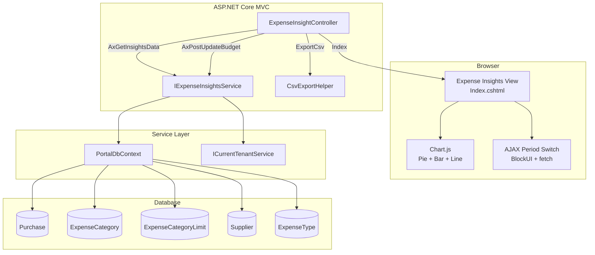
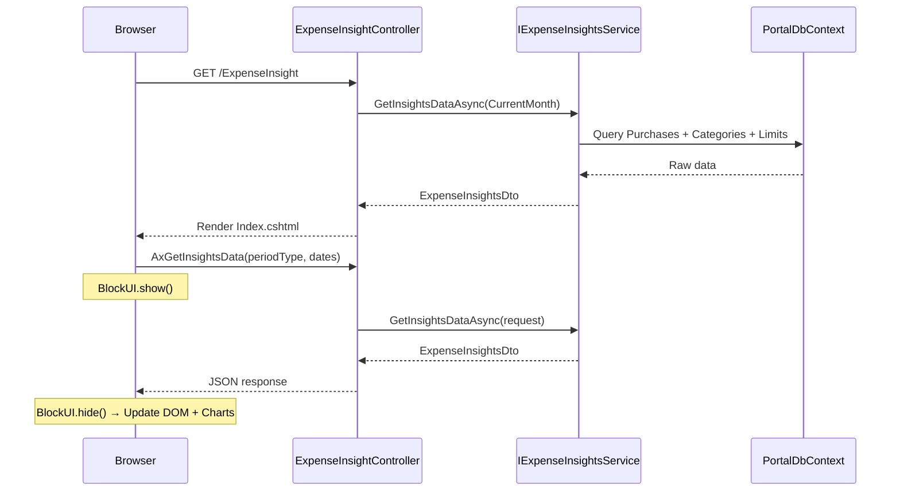
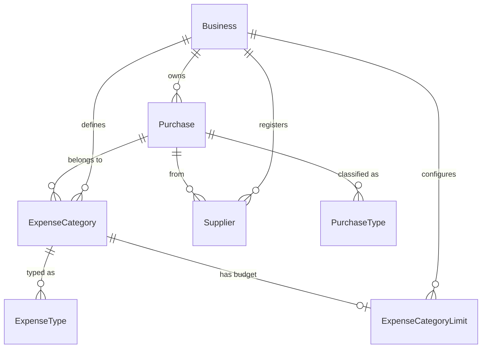

# Design Document: Expense Categorisation Insights

## Overview

The Expense Categorisation Insights module provides visual analytics and budget management for the Portal platform. It aggregates existing Purchase and ExpenseCategory data to deliver:

- **Category breakdown**: spend-by-category with percentage and type classification
- **Trend analysis**: 12-month line chart showing spending patterns per category
- **Budget alerts**: threshold warnings when categories approach or exceed configured limits
- **Top suppliers**: per-category supplier drill-down (top 3 by spend)
- **CSV export**: downloadable expense breakdown for offline analysis

The module follows the same architectural patterns as the existing P&L module (period resolution, service-layer aggregation, Chart.js rendering) and reuses the `PnlPeriodType` enum for period filtering. It operates within the existing tenant isolation model via `ICurrentTenantService` and global query filters.

**Access control**: Gated to Professional/Enterprise plans via `[ModuleAccess(PortalModules.ExpenseInsights)]`. Starter users see a soft-gate teaser on the Purchase list.

---

## Architecture

### High-Level Component Diagram



### Request Flow



---

## Components and Interfaces

### IExpenseInsightsService

The primary service interface for all expense analytics computations.

```csharp
namespace Portal.Infrastructure.Services;

public interface IExpenseInsightsService
{
    /// <summary>
    /// Computes the full expense insights dataset for the given period.
    /// Includes category breakdown, summary KPIs, budget status, and top suppliers.
    /// </summary>
    Task<ExpenseInsightsDto> GetInsightsDataAsync(ExpenseInsightsPeriodRequest request);

    /// <summary>
    /// Computes monthly totals per category for the last 12 months (trend data).
    /// </summary>
    Task<ExpenseInsightsTrendDto> GetTrendDataAsync();

    /// <summary>
    /// Creates or updates a budget limit for a category.
    /// Returns null PeriodLimitEur to clear the limit.
    /// </summary>
    Task<ServiceResult> UpsertBudgetLimitAsync(int expenseCategoryId, decimal? periodLimitEur);

    /// <summary>
    /// Resolves a period type to concrete start/end dates.
    /// Reuses the same logic as PnlService.
    /// </summary>
    ExpenseInsightsDateRange ResolvePeriod(PnlPeriodType periodType, DateTime referenceDate);

    /// <summary>
    /// Validates a custom date range.
    /// </summary>
    ExpenseInsightsValidationResult ValidateCustomRange(DateOnly startDate, DateOnly endDate);

    /// <summary>
    /// Generates CSV content for the current breakdown.
    /// </summary>
    Task<ExportResult> ExportCsvAsync(ExpenseInsightsPeriodRequest request);
}
```

### ExpenseInsightController

```csharp
namespace Portal.Web.Controllers;

[Authorize]
[ModuleAccess(PortalModules.ExpenseInsights)]
public class ExpenseInsightController : Controller
{
    // GET: /ExpenseInsight
    public async Task<IActionResult> Index();

    // GET: /ExpenseInsight/AxGetInsightsData?periodType=CurrentMonth&startDate=&endDate=
    [HttpGet]
    public async Task<IActionResult> AxGetInsightsData(
        PnlPeriodType periodType,
        DateOnly? startDate = null,
        DateOnly? endDate = null);

    // GET: /ExpenseInsight/AxGetTrendData
    [HttpGet]
    public async Task<IActionResult> AxGetTrendData();

    // GET: /ExpenseInsight/ExportCsv?periodType=CurrentMonth&startDate=&endDate=
    [HttpGet]
    public IActionResult ExportCsv(
        PnlPeriodType periodType,
        DateOnly? startDate = null,
        DateOnly? endDate = null);

    // POST: /ExpenseInsight/AxPostUpdateBudget
    [HttpPost]
    [ValidateAntiForgeryToken]
    public async Task<IActionResult> AxPostUpdateBudget(
        int expenseCategoryId,
        decimal? periodLimitEur);
}
```

### Service Implementation — Key Methods (Pseudocode)

#### GetInsightsDataAsync

```csharp
public async Task<ExpenseInsightsDto> GetInsightsDataAsync(ExpenseInsightsPeriodRequest request)
{
    var businessId = _currentTenantService.CurrentBusinessId;
    if (businessId == 0) return ExpenseInsightsDto.Empty();

    var dateRange = request.PeriodType == PnlPeriodType.Custom
        ? new ExpenseInsightsDateRange { StartDate = request.CustomStartDate!.Value, EndDate = request.CustomEndDate!.Value }
        : ResolvePeriod(request.PeriodType, DateTime.UtcNow);

    // 1. Fetch non-cancelled purchases in period for this business
    var purchases = await _dbContext.Purchases
        .Include(p => p.ExpenseCategory).ThenInclude(ec => ec.ExpenseType)
        .Include(p => p.Supplier)
        .Where(p => p.BusinessId == businessId
                    && !p.IsCancelled
                    && p.InvoiceDate >= dateRange.StartDate
                    && p.InvoiceDate <= dateRange.EndDate)
        .ToListAsync();

    // 2. Compute category breakdown
    var totalSpend = purchases.Sum(p => p.TotalAmount);
    var breakdown = ComputeCategoryBreakdown(purchases, totalSpend);

    // 3. Compute MoM variance
    var previousMonthPurchases = await GetPreviousMonthPurchases(dateRange, businessId);
    EnrichWithVariance(breakdown, previousMonthPurchases);

    // 4. Fetch budget limits and compute status
    var limits = await _dbContext.ExpenseCategoryLimits
        .Where(l => l.BusinessId == businessId)
        .ToListAsync();
    EnrichWithBudgetStatus(breakdown, limits);

    // 5. Compute top suppliers per category
    EnrichWithTopSuppliers(breakdown, purchases);

    // 6. Build summary KPIs
    var summary = BuildSummary(breakdown, totalSpend);

    return new ExpenseInsightsDto { Summary = summary, Categories = breakdown, Period = dateRange };
}
```

#### ComputeCategoryBreakdown

```csharp
private List<ExpenseCategoryBreakdownDto> ComputeCategoryBreakdown(
    List<Purchase> purchases, decimal totalSpend)
{
    if (totalSpend == 0) return new List<ExpenseCategoryBreakdownDto>();

    return purchases
        .GroupBy(p => new { p.ExpenseCategoryId, p.ExpenseCategory.Name, p.ExpenseCategory.ExpenseType })
        .Select(g => new ExpenseCategoryBreakdownDto
        {
            ExpenseCategoryId = g.Key.ExpenseCategoryId,
            CategoryName = g.Key.Name,
            ExpenseTypeName = g.Key.ExpenseType?.Name ?? "Uncategorised",
            TotalSpend = g.Sum(p => p.TotalAmount),
            PercentageOfTotal = Math.Round((g.Sum(p => p.TotalAmount) / totalSpend) * 100m, 2)
        })
        .OrderByDescending(c => c.TotalSpend)
        .ToList();
}
```

#### ComputeMonthOverMonthVariance

```csharp
private string ComputeVariance(decimal currentSpend, decimal previousSpend, bool hasPreviousData)
{
    if (!hasPreviousData) return "N/A";
    if (previousSpend == 0 && currentSpend > 0) return "New";
    if (previousSpend == 0 && currentSpend == 0) return "—";
    if (currentSpend == 0 && previousSpend > 0) return "-100.0";

    var variance = Math.Round(((currentSpend - previousSpend) / previousSpend) * 100m, 1);
    return variance.ToString("F1");
}
```

#### ComputeBudgetStatus

```csharp
private BudgetStatus ComputeBudgetStatus(decimal spend, decimal? limit)
{
    if (limit == null || limit <= 0) return BudgetStatus.NoLimit;
    var ratio = spend / limit.Value;
    if (ratio >= 1.0m) return BudgetStatus.Exceeded;
    if (ratio >= 0.8m) return BudgetStatus.Approaching;
    return BudgetStatus.WithinLimit;
}
```

#### Top Suppliers

```csharp
private List<TopSupplierDto> ComputeTopSuppliers(
    IEnumerable<Purchase> categoryPurchases, decimal categoryTotal)
{
    return categoryPurchases
        .GroupBy(p => new { p.SupplierId, p.Supplier.Name })
        .Select(g => new TopSupplierDto
        {
            SupplierId = g.Key.SupplierId,
            SupplierName = g.Key.Name,
            TotalSpend = g.Sum(p => p.TotalAmount),
            PercentageOfCategory = categoryTotal == 0
                ? 0m
                : Math.Round((g.Sum(p => p.TotalAmount) / categoryTotal) * 100m, 1)
        })
        .OrderByDescending(s => s.TotalSpend)
        .ThenBy(s => s.SupplierId)
        .Take(3)
        .ToList();
}
```

#### CSV Export

```csharp
public async Task<ExportResult> ExportCsvAsync(ExpenseInsightsPeriodRequest request)
{
    var data = await GetInsightsDataAsync(request);
    var sb = new StringBuilder();

    // Header
    sb.AppendLine("Category Name,Expense Type,Total Spend,Percentage of Total,Month-Over-Month Variance,Budget Limit,Budget Status");

    foreach (var cat in data.Categories)
    {
        sb.AppendLine($"{EscapeCsv(cat.CategoryName)},{EscapeCsv(cat.ExpenseTypeName)},{cat.TotalSpend:F2},{cat.PercentageOfTotal:F1},{FormatVarianceForCsv(cat.Variance)},{FormatBudgetLimit(cat.BudgetLimit)},{cat.BudgetStatus}");
    }

    var businessName = SanitizeFileName(await GetBusinessName());
    var filename = $"ExpenseInsights_{businessName}_{data.Period.StartDate:yyyyMMdd}_{data.Period.EndDate:yyyyMMdd}.csv";

    return new ExportResult
    {
        Content = Encoding.UTF8.GetBytes(sb.ToString()),
        FileName = filename,
        ContentType = "text/csv"
    };
}
```

---

## Data Models

### Request/Response DTOs

```csharp
namespace Portal.Infrastructure.Models.ExpenseInsights;

/// <summary>
/// Request model for expense insights period queries.
/// </summary>
public class ExpenseInsightsPeriodRequest
{
    public PnlPeriodType PeriodType { get; set; }
    public DateOnly? CustomStartDate { get; set; }
    public DateOnly? CustomEndDate { get; set; }
}

/// <summary>
/// Resolved date range for expense insights queries.
/// </summary>
public class ExpenseInsightsDateRange
{
    public DateOnly StartDate { get; set; }
    public DateOnly EndDate { get; set; }
}

/// <summary>
/// Validation result for custom date ranges.
/// </summary>
public class ExpenseInsightsValidationResult
{
    public bool IsValid { get; set; }
    public string? ErrorMessage { get; set; }
}

/// <summary>
/// Top-level response containing all insights data for a period.
/// </summary>
public class ExpenseInsightsDto
{
    public ExpenseInsightsSummaryDto Summary { get; set; } = null!;
    public List<ExpenseCategoryBreakdownDto> Categories { get; set; } = new();
    public ExpenseInsightsDateRange Period { get; set; } = null!;
    public int BudgetExceededCount { get; set; }
    public int BudgetApproachingCount { get; set; }
    public bool HasData { get; set; }

    public static ExpenseInsightsDto Empty() => new()
    {
        Summary = new ExpenseInsightsSummaryDto(),
        Categories = new List<ExpenseCategoryBreakdownDto>(),
        Period = new ExpenseInsightsDateRange(),
        HasData = false
    };
}

/// <summary>
/// Summary KPI cards data.
/// </summary>
public class ExpenseInsightsSummaryDto
{
    public decimal TotalSpend { get; set; }
    public int CategoriesWithSpend { get; set; }
    public string? TopCategoryName { get; set; }
    public decimal AveragePerCategory { get; set; }
}

/// <summary>
/// A single category row in the breakdown table.
/// </summary>
public class ExpenseCategoryBreakdownDto
{
    public int ExpenseCategoryId { get; set; }
    public string CategoryName { get; set; } = null!;
    public string ExpenseTypeName { get; set; } = null!;
    public decimal TotalSpend { get; set; }
    public decimal PercentageOfTotal { get; set; }
    public string Variance { get; set; } = "—";
    public decimal? VarianceValue { get; set; }
    public decimal? BudgetLimit { get; set; }
    public string BudgetStatus { get; set; } = "No Limit";
    public List<TopSupplierDto> TopSuppliers { get; set; } = new();
}

/// <summary>
/// A supplier row within a category expansion.
/// </summary>
public class TopSupplierDto
{
    public int SupplierId { get; set; }
    public string SupplierName { get; set; } = null!;
    public decimal TotalSpend { get; set; }
    public decimal PercentageOfCategory { get; set; }
}

/// <summary>
/// Budget status enumeration for threshold alerts.
/// </summary>
public enum BudgetStatus
{
    NoLimit,
    WithinLimit,
    Approaching,
    Exceeded
}

/// <summary>
/// Trend data for the 12-month line chart.
/// </summary>
public class ExpenseInsightsTrendDto
{
    public List<string> MonthLabels { get; set; } = new(); // "MMM yyyy"
    public List<TrendCategorySeriesDto> Series { get; set; } = new();
    public bool HasSufficientData { get; set; }
}

/// <summary>
/// A single category's monthly data points for the trend chart.
/// </summary>
public class TrendCategorySeriesDto
{
    public string CategoryName { get; set; } = null!;
    public List<decimal> MonthlyTotals { get; set; } = new(); // 12 values, one per month
}

/// <summary>
/// Request model for budget limit updates.
/// </summary>
public class UpdateBudgetLimitRequest
{
    public int ExpenseCategoryId { get; set; }
    public decimal? PeriodLimitEur { get; set; }
}
```

### View Model

```csharp
namespace Portal.Web.Models;

public class ExpenseInsightsViewModel
{
    public ExpenseInsightsDto InsightsData { get; set; } = null!;
    public ExpenseInsightsTrendDto TrendData { get; set; } = null!;
    public List<ExpenseCategoryLimitViewModel> BudgetConfig { get; set; } = new();
    public string CurrencySymbol { get; set; } = "€";
    public PnlPeriodType SelectedPeriod { get; set; } = PnlPeriodType.CurrentMonth;
}
```

### Entity Relationship (Existing — No Schema Changes)



No new database tables are required. All data is sourced from existing entities.

---

## Correctness Properties

*A property is a characteristic or behavior that should hold true across all valid executions of a system — essentially, a formal statement about what the system should do. Properties serve as the bridge between human-readable specifications and machine-verifiable correctness guarantees.*

### Property 1: Category aggregation correctness

*For any* set of Purchase records (with varied IsCancelled flags, InvoiceDates, and ExpenseCategoryIds) and *for any* valid date range, the category breakdown SHALL:
- Include only non-cancelled purchases whose InvoiceDate falls within [startDate, endDate]
- Group correctly by ExpenseCategoryId
- Sum TotalAmount correctly per group
- Be ordered by TotalSpend descending

**Validates: Requirements 1.1, 1.4, 1.5**

### Property 2: Percentage invariant

*For any* non-empty category breakdown (where total spend > 0), the sum of all PercentageOfTotal values across categories SHALL equal 100.0 (within a rounding tolerance of ±0.1 per category due to 2-decimal rounding).

**Validates: Requirements 1.2**

### Property 3: Period resolution correctness

*For any* reference date and *for any* period type (CurrentMonth, PreviousMonth, CurrentQuarter, CurrentYear), the resolved date range SHALL satisfy:
- CurrentMonth: StartDate = 1st of month, EndDate = reference date (as DateOnly)
- PreviousMonth: StartDate = 1st of prior month, EndDate = last day of prior month
- CurrentQuarter: StartDate = 1st of quarter (Jan/Apr/Jul/Oct), EndDate = reference date
- CurrentYear: StartDate = Jan 1, EndDate = reference date

**Validates: Requirements 2.2, 2.3, 2.4, 2.5**

### Property 4: Custom range validation

*For any* pair of DateOnly values (startDate, endDate), the validation SHALL:
- Accept when startDate <= endDate AND (endDate - startDate).Days <= 366
- Reject with error when startDate > endDate
- Reject with error when range exceeds 366 days

**Validates: Requirements 2.6, 2.7**

### Property 5: Budget status threshold classification

*For any* category spend (>= 0) and *for any* configured PeriodLimitEur (positive decimal or null), the budget status SHALL be:
- "Exceeded" when limit is not null AND spend >= limit
- "Approaching" when limit is not null AND spend >= 0.8 * limit AND spend < limit
- "Within Limit" when limit is not null AND spend < 0.8 * limit
- "No Limit" when limit is null

**Validates: Requirements 7.1, 7.2, 7.3**

### Property 6: Top suppliers ranking

*For any* set of non-cancelled purchases within a category, the top suppliers list SHALL:
- Contain at most 3 entries
- Be ordered by TotalSpend descending, with SupplierId ascending as tie-breaker
- Each supplier's PercentageOfCategory equals (supplierSpend / categoryTotal) × 100 rounded to 1 decimal place
- Only include suppliers with spend > 0

**Validates: Requirements 8.1, 8.3, 8.4**

### Property 7: Month-over-month variance computation

*For any* pair (currentMonthSpend, previousMonthSpend) where both are >= 0, and *for any* hasPreviousData flag, the variance SHALL be:
- "N/A" when hasPreviousData is false
- "New" when previousMonthSpend == 0 AND currentMonthSpend > 0
- "—" when both are 0
- "-100.0" when currentMonthSpend == 0 AND previousMonthSpend > 0
- Otherwise: ((current - previous) / previous) × 100 rounded to 1 decimal place

**Validates: Requirements 9.1, 9.4, 9.5, 9.6, 9.7**

### Property 8: CSV export round-trip

*For any* non-empty category breakdown, the generated CSV SHALL:
- Contain exactly one header row plus one data row per category
- Parse back into the same number of categories with matching CategoryName, TotalSpend (to 2dp), and BudgetStatus values
- Use UTF-8 encoding and comma delimiters

**Validates: Requirements 10.1, 10.2, 10.4**

### Property 9: Tenant isolation invariant

*For any* BusinessId and *for any* set of purchases spanning multiple businesses, the service SHALL return only data where Purchase.BusinessId matches the current tenant's BusinessId — never including records from other tenants.

**Validates: Requirements 13.1, 13.2, 13.3, 13.4**

---

## Error Handling

| Scenario | Handling |
|----------|----------|
| `ICurrentTenantService.CurrentBusinessId == 0` | Return `ExpenseInsightsDto.Empty()` immediately — no DB query executed |
| Custom range validation failure | Return `{ success: false, message: "..." }` JSON — no computation |
| Budget value out of range (≤0 or >999,999,999.99) | Return validation error JSON — no DB write |
| Database exception during aggregation | Catch in controller, return `{ success: false, message: "An error occurred..." }`, log via existing patterns |
| No data for selected period | Return valid DTO with `HasData = false`, empty categories list, zero summary |
| Concurrent budget update (optimistic) | EF Core handles; last-write-wins is acceptable for single-value update |
| CSV generation with special characters in category names | Escape double quotes per RFC 4180 (wrap field in quotes, escape internal quotes) |

### Controller Error Pattern

```csharp
[HttpGet]
public async Task<IActionResult> AxGetInsightsData(PnlPeriodType periodType, DateOnly? startDate, DateOnly? endDate)
{
    try
    {
        if (periodType == PnlPeriodType.Custom)
        {
            if (startDate == null || endDate == null)
                return Json(new { success = false, message = "Both start and end dates are required for custom range." });

            var validation = _service.ValidateCustomRange(startDate.Value, endDate.Value);
            if (!validation.IsValid)
                return Json(new { success = false, message = validation.ErrorMessage });
        }

        var request = new ExpenseInsightsPeriodRequest
        {
            PeriodType = periodType,
            CustomStartDate = startDate,
            CustomEndDate = endDate
        };

        var data = await _service.GetInsightsDataAsync(request);
        return Json(new { success = true, data });
    }
    catch (Exception ex)
    {
        return Json(new { success = false, message = "An error occurred loading expense insights." });
    }
}
```

---

## Testing Strategy

### Property-Based Tests (xUnit + FsCheck)

The project will use **FsCheck.Xunit** for property-based testing, which is the standard .NET PBT library and integrates seamlessly with the existing xUnit test infrastructure.

**Configuration:**
- Minimum 100 iterations per property test
- Each test tagged with the design property it validates
- Tests run against the service layer with an in-memory EF Core database (SQLite provider)

**Tag format:** `// Feature: expense-categorisation-insights, Property {N}: {title}`

Properties to implement:
1. Category aggregation correctness (generates random purchases, verifies sum/order/filter)
2. Percentage invariant (verifies percentages sum to ~100%)
3. Period resolution correctness (generates random DateTime, verifies all period types)
4. Custom range validation (generates random DateOnly pairs, verifies accept/reject)
5. Budget status threshold (generates random spend/limit pairs, verifies classification)
6. Top suppliers ranking (generates random multi-supplier purchases, verifies top-3 order)
7. MoM variance computation (generates random spend pairs, verifies formula)
8. CSV export round-trip (generates random breakdown data, verifies parse-back)
9. Tenant isolation (generates multi-tenant data, verifies no cross-tenant leakage)

### Unit Tests (xUnit)

Example-based tests for:
- Edge cases: null ExpenseTypeId → "Uncategorised", empty data → empty result
- Budget CRUD: create, update, clear operations
- CSV filename sanitisation (special characters in business name)
- Controller validation: missing dates for custom range, non-numeric budget input

### Integration Tests

- Plan permission gating (Starter blocked, Professional/Enterprise allowed)
- AJAX endpoint response shape validation
- Soft-gate teaser rendering based on plan status
- Full page load with seeded data

### Manual / Visual Tests

- Mobile responsiveness at 375px, 768px, 810px viewports
- Chart.js rendering (pie/bar/line) with realistic data
- BlockUI + SweetAlert2 flow verification
- Touch target size validation (44×44px minimum)
