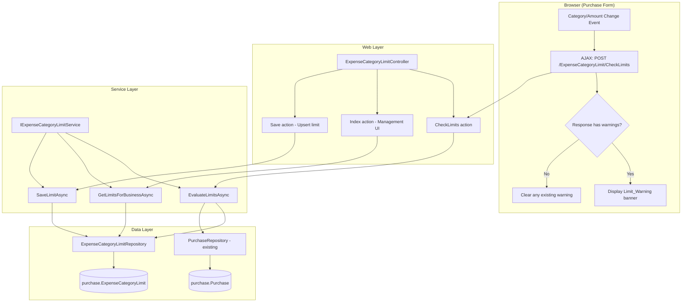
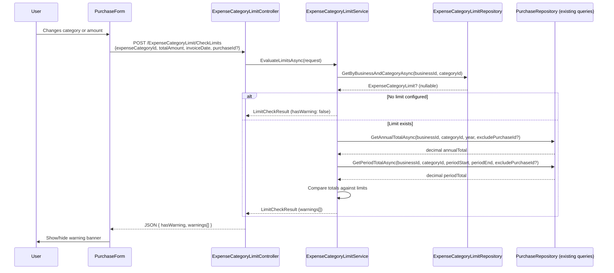

# Design Document: Expense Category Limits

## Overview

This feature adds advisory spending limit management to the Portal's purchase module. Business owners can configure an annual (calendar year) and/or a per-VAT-period spending threshold for any expense category. When a user creates or edits a purchase, the system evaluates the cumulative spending against configured limits in real time via AJAX and displays soft warnings — never blocking the save.

The design follows the existing Controller → Service → Repository layering, uses raw SQL for data access, and integrates with the existing autocomplete-based purchase form via client-side event hooks.

### Key Design Decisions

1. **Soft warnings only** — The limit check is advisory. The purchase form never disables the submit button or rejects a save based on limits. This keeps the feature non-intrusive.
2. **Single AJAX endpoint** — A dedicated `CheckLimits` action on a new `ExpenseCategoryLimitController` handles both create and edit scenarios. The purchase form calls it on category/amount/date change.
3. **Cancelled purchases excluded** — Cumulative spending calculations exclude cancelled purchases (`IsCancelled = 0`).
4. **Upsert pattern** — The limit management UI uses a single save endpoint that creates or updates the `ExpenseCategoryLimit` record, leveraging the unique constraint on `(BusinessId, ExpenseCategoryId)`.
5. **Fail-safe design** — If the AJAX call fails, or the category has no limits, or the category ID is invalid, the system returns no warnings and the user proceeds without disruption.

## Architecture



### Data Flow: Limit Check on Purchase Form



## Components and Interfaces

### 1. ExpenseCategoryLimitController

New controller under `Portal.Web.Controllers`. Handles the management UI and the AJAX limit check endpoint.

```csharp
[Authorize]
[ModuleAccess(PortalModules.Purchase)]
public class ExpenseCategoryLimitController : Controller
{
    // GET /ExpenseCategoryLimit — Management UI (list categories + their limits)
    Task<IActionResult> Index();

    // POST /ExpenseCategoryLimit/Save — Upsert a limit for a category (AJAX)
    Task<IActionResult> Save([FromBody] SaveLimitRequest request);

    // POST /ExpenseCategoryLimit/Clear — Clear a specific limit field (AJAX)
    Task<IActionResult> Clear([FromBody] ClearLimitRequest request);

    // POST /ExpenseCategoryLimit/CheckLimits — Real-time limit evaluation (AJAX)
    Task<IActionResult> CheckLimits([FromBody] CheckLimitsRequest request);
}
```

### 2. IExpenseCategoryLimitService / ExpenseCategoryLimitService

Service interface and implementation in `Portal.Infrastructure.Services`.

```csharp
public interface IExpenseCategoryLimitService
{
    /// Returns all configured limits for the current business, joined with category names.
    Task<List<ExpenseCategoryLimitViewModel>> GetLimitsForBusinessAsync();

    /// Evaluates annual and period limits for a given category/amount/date combination.
    Task<LimitCheckResult> EvaluateLimitsAsync(LimitCheckRequest request);

    /// Creates or updates the limit configuration for a business + category.
    Task<ServiceResult> SaveLimitAsync(int expenseCategoryId, decimal? annualLimitEur, decimal? periodLimitEur);

    /// Clears a specific limit field (annual or period) for a category.
    Task<ServiceResult> ClearLimitAsync(int expenseCategoryId, string limitType);
}
```

### 3. ExpenseCategoryLimitRepository

New repository in `Portal.Infrastructure.Repositories`, extending `GenericStoredProcedureRepository<ExpenseCategoryLimit>`.

```csharp
public class ExpenseCategoryLimitRepository : GenericStoredProcedureRepository<ExpenseCategoryLimit>
{
    Task<ExpenseCategoryLimit?> GetByBusinessAndCategoryAsync(int businessId, int expenseCategoryId);
    Task<List<ExpenseCategoryLimit>> GetAllByBusinessIdAsync(int businessId);
    Task InsertAsync(ExpenseCategoryLimit entity);
    Task UpdateAsync(ExpenseCategoryLimit entity);
    Task ClearLimitFieldAsync(int businessId, int expenseCategoryId, string fieldName);
}
```

### 4. Spending Aggregation (added to PurchaseRepository or a helper)

New query methods for cumulative spending calculations:

```csharp
// Sum TotalAmount for a category within a calendar year, optionally excluding a purchase
Task<decimal> GetAnnualSpendingAsync(int businessId, int expenseCategoryId, int year, int? excludePurchaseId);

// Sum TotalAmount for a category within a date range, optionally excluding a purchase
Task<decimal> GetPeriodSpendingAsync(int businessId, int expenseCategoryId, DateOnly periodStart, DateOnly periodEnd, int? excludePurchaseId);
```

### 5. Purchase Form Modifications

Client-side JavaScript additions to `Create.cshtml` and `Edit.cshtml`:
- Event hooks on category selection (`onSelect` callback) and amount change (`oninput`)
- Debounced AJAX call to `CheckLimits` endpoint
- Warning banner rendering/clearing logic
- No changes to form submission — warnings are purely visual

### 6. Limit Management View

New Razor view at `Views/ExpenseCategoryLimit/Index.cshtml`:
- Table listing all active expense categories
- Inline editable fields for AnnualLimitEur and PeriodLimitEur
- Save button per row (AJAX upsert)
- Clear button per limit field
- SweetAlert2 confirmation on save, BlockUI during requests

## Data Models

### Database Table: `[purchase].[ExpenseCategoryLimit]`

| Column | Type | Nullable | Default | Description |
|--------|------|----------|---------|-------------|
| Id | INT IDENTITY(1,1) | NOT NULL | — | Primary key |
| BusinessId | INT | NOT NULL | — | FK → [portal].[Business].[Id] |
| ExpenseCategoryId | INT | NOT NULL | — | FK → [purchase].[ExpenseCategory].[Id] |
| AnnualLimitEur | DECIMAL(18,2) | NULL | — | Max annual spend (calendar year) |
| PeriodLimitEur | DECIMAL(18,2) | NULL | — | Max spend per VAT period |
| CreatedAtUtc | DATETIME2 | NOT NULL | GETUTCDATE() | Record creation timestamp |

**Constraints:**
- `PK_ExpenseCategoryLimit` — PRIMARY KEY on `[Id]`
- `UX_ExpenseCategoryLimit_Business_Category` — UNIQUE on `(BusinessId, ExpenseCategoryId)`
- `FK_ExpenseCategoryLimit_Business` → `[portal].[Business].[Id]`
- `FK_ExpenseCategoryLimit_ExpenseCategory` → `[purchase].[ExpenseCategory].[Id]`
- `IX_ExpenseCategoryLimit_BusinessId` — Non-clustered index on `BusinessId`

### Entity Class: `ExpenseCategoryLimit`

```csharp
namespace Portal.Infrastructure.Entities;

public class ExpenseCategoryLimit
{
    public int Id { get; set; }
    public int BusinessId { get; set; }
    public int ExpenseCategoryId { get; set; }
    public decimal? AnnualLimitEur { get; set; }
    public decimal? PeriodLimitEur { get; set; }
    public DateTime CreatedAtUtc { get; set; }

    // Navigation properties
    public Business Business { get; set; } = null!;
    public ExpenseCategory ExpenseCategory { get; set; } = null!;
}
```

### Request/Response Models

```csharp
// Request model for the CheckLimits AJAX endpoint
public class CheckLimitsRequest
{
    public int ExpenseCategoryId { get; set; }
    public decimal TotalAmount { get; set; }
    public DateOnly InvoiceDate { get; set; }
    public int? PurchaseId { get; set; } // null for create, set for edit
}

// Response model for the CheckLimits endpoint
public class LimitCheckResult
{
    public bool HasWarning { get; set; }
    public List<LimitWarning> Warnings { get; set; } = new();
}

public class LimitWarning
{
    public string LimitType { get; set; } = null!;  // "annual" or "period"
    public decimal ConfiguredLimit { get; set; }
    public decimal CumulativeTotal { get; set; }
    public decimal ProjectedTotal { get; set; }
    public decimal ExceededBy { get; set; }
}

// Request model for saving a limit
public class SaveLimitRequest
{
    public int ExpenseCategoryId { get; set; }
    public decimal? AnnualLimitEur { get; set; }
    public decimal? PeriodLimitEur { get; set; }
}

// View model for the management UI
public class ExpenseCategoryLimitViewModel
{
    public int ExpenseCategoryId { get; set; }
    public string CategoryName { get; set; } = null!;
    public decimal? AnnualLimitEur { get; set; }
    public decimal? PeriodLimitEur { get; set; }
}
```

### SQL Migration Script (088_CreateExpenseCategoryLimitTable.sql)

```sql
IF NOT EXISTS (
    SELECT 1
    FROM INFORMATION_SCHEMA.TABLES
    WHERE TABLE_SCHEMA = 'purchase'
      AND TABLE_NAME = 'ExpenseCategoryLimit'
)
BEGIN
    CREATE TABLE [purchase].[ExpenseCategoryLimit]
    (
        [Id]                  INT            IDENTITY(1,1)  NOT NULL,
        [BusinessId]          INT                           NOT NULL,
        [ExpenseCategoryId]   INT                           NOT NULL,
        [AnnualLimitEur]      DECIMAL(18,2)                 NULL,
        [PeriodLimitEur]      DECIMAL(18,2)                 NULL,
        [CreatedAtUtc]        DATETIME2                     NOT NULL  CONSTRAINT [DF_ExpenseCategoryLimit_CreatedAtUtc] DEFAULT (GETUTCDATE()),

        CONSTRAINT [PK_ExpenseCategoryLimit] PRIMARY KEY CLUSTERED ([Id]),
        CONSTRAINT [FK_ExpenseCategoryLimit_Business] FOREIGN KEY ([BusinessId]) REFERENCES [portal].[Business] ([Id]),
        CONSTRAINT [FK_ExpenseCategoryLimit_ExpenseCategory] FOREIGN KEY ([ExpenseCategoryId]) REFERENCES [purchase].[ExpenseCategory] ([Id])
    );
END
GO

-- Unique constraint: one limit record per business per category
IF NOT EXISTS (
    SELECT 1
    FROM sys.indexes
    WHERE [name] = 'UX_ExpenseCategoryLimit_BusinessId_ExpenseCategoryId'
      AND [object_id] = OBJECT_ID('[purchase].[ExpenseCategoryLimit]')
)
BEGIN
    CREATE UNIQUE NONCLUSTERED INDEX [UX_ExpenseCategoryLimit_BusinessId_ExpenseCategoryId]
        ON [purchase].[ExpenseCategoryLimit] ([BusinessId], [ExpenseCategoryId]);
END
GO

-- Non-clustered index on BusinessId for tenant-filtered query optimisation
IF NOT EXISTS (
    SELECT 1
    FROM sys.indexes
    WHERE [name] = 'IX_ExpenseCategoryLimit_BusinessId'
      AND [object_id] = OBJECT_ID('[purchase].[ExpenseCategoryLimit]')
)
BEGIN
    CREATE NONCLUSTERED INDEX [IX_ExpenseCategoryLimit_BusinessId]
        ON [purchase].[ExpenseCategoryLimit] ([BusinessId]);
END
GO
```

## Correctness Properties

*A property is a characteristic or behavior that should hold true across all valid executions of a system — essentially, a formal statement about what the system should do. Properties serve as the bridge between human-readable specifications and machine-verifiable correctness guarantees.*

### Property 1: Annual spending summation scoped to calendar year

*For any* business, expense category, and invoice date, the annual cumulative total calculated by the Limit_Service SHALL equal the sum of `TotalAmount` from all non-cancelled purchases in that category for that business where the `InvoiceDate` falls within January 1 to December 31 of the same year as the given invoice date.

**Validates: Requirements 3.1**

### Property 2: Annual warning if and only if projected total exceeds annual limit

*For any* expense category with a configured `AnnualLimitEur` value L, cumulative annual total C, and new purchase amount A: the Limit_Service SHALL return an annual warning if and only if (C + A) > L.

**Validates: Requirements 3.2, 3.3, 3.4**

### Property 3: Period spending summation scoped to VAT period date range

*For any* business, expense category, and VAT submission period with start date S and end date E, the period cumulative total calculated by the Limit_Service SHALL equal the sum of `TotalAmount` from all non-cancelled purchases in that category for that business where `InvoiceDate` falls within S and E (inclusive).

**Validates: Requirements 4.1, 4.2**

### Property 4: Period warning if and only if projected total exceeds period limit

*For any* expense category with a configured `PeriodLimitEur` value L, cumulative period total C, and new purchase amount A: the Limit_Service SHALL return a period warning if and only if (C + A) > L.

**Validates: Requirements 4.3, 4.4, 4.5**

### Property 5: Null limit produces no warning

*For any* expense category and any purchase amount: if `AnnualLimitEur` is null, no annual warning SHALL be returned; if `PeriodLimitEur` is null, no period warning SHALL be returned; if both are null, no warnings of any type SHALL be returned.

**Validates: Requirements 2.3, 3.5, 4.6, 10.3**

### Property 6: Edit-mode exclusion from cumulative totals

*For any* purchase being edited (identified by PurchaseId), the cumulative spending totals used for limit evaluation SHALL exclude that purchase's `TotalAmount` from both annual and period calculations, such that the cumulative total equals what it would be if that purchase did not exist.

**Validates: Requirements 7.1, 7.2, 7.3**

### Property 7: Limit value validation rejects non-positive values

*For any* decimal value V submitted as a limit: the validation SHALL accept V if and only if V > 0. Values less than or equal to zero SHALL be rejected.

**Validates: Requirements 2.4, 8.6**

### Property 8: Upsert produces exactly one record per business-category pair

*For any* business and expense category, after calling `SaveLimitAsync` with limit values, querying `ExpenseCategoryLimit` for that business and category SHALL return exactly one record containing the saved values. Calling save multiple times SHALL not create duplicate records.

**Validates: Requirements 8.5**

### Property 9: Tenant isolation on all limit queries and spending calculations

*For any* set of `ExpenseCategoryLimit` records and purchases across multiple businesses, all queries and spending calculations performed by the Limit_Service for a given tenant SHALL return only data where `BusinessId` matches the current tenant's business ID. No cross-tenant data leakage SHALL occur.

**Validates: Requirements 9.1, 9.2**

### Property 10: API response structure contains required warning fields

*For any* valid `CheckLimits` request that triggers at least one warning, the response SHALL contain `hasWarning: true` and each warning object SHALL include `limitType` (either "annual" or "period"), `configuredLimit`, `cumulativeTotal`, `projectedTotal`, and `exceededBy` — all with correct computed values where `projectedTotal = cumulativeTotal + requestedAmount` and `exceededBy = projectedTotal - configuredLimit`.

**Validates: Requirements 5.5, 10.2**

## Error Handling

| Scenario | Behaviour | Rationale |
|----------|-----------|-----------|
| AJAX `CheckLimits` call fails (network/server error) | Client clears any visible warning, does not block form | Fail-safe: limits are advisory, never block |
| Invalid `ExpenseCategoryId` in CheckLimits request | Return `{ hasWarning: false, warnings: [] }` | Fail-safe: don't confuse the user |
| Category belongs to different business | Return no warnings (tenant filter excludes it) | Tenant isolation prevents cross-business evaluation |
| No VAT period covers the invoice date | Skip period evaluation, return no period warning | Graceful degradation — no period context available |
| Database timeout on cumulative query | Catch exception, return no warnings, log error | Advisory feature should never block purchase entry |
| Concurrent limit save (race on upsert) | Unique constraint prevents duplicates; retry or return error message | Database enforces correctness |
| Limit value <= 0 submitted | Service returns `ServiceResult.Fail("Limit must be greater than zero.")` | Client-side validation is the primary guard; server-side is the safety net |

### Exception Strategy

- **Repository layer**: `try/catch` with rethrow (per project convention)
- **Service layer**: Catches repository exceptions in `EvaluateLimitsAsync` and returns a safe `LimitCheckResult` with no warnings. Logs the error. For CRUD operations (`SaveLimitAsync`), exceptions propagate to the controller.
- **Controller layer**: `CheckLimits` wraps the service call in try/catch and always returns a valid JSON response. Management actions (`Save`, `Clear`) return `Json(new { success, message })`.

## Testing Strategy

### Unit Tests (Example-Based)

- **Schema validation**: Verify migration creates table with correct columns, constraints, and indexes (smoke tests)
- **Null limit handling**: Verify service returns no warnings when limits are null
- **Edge cases**: Invoice date with no matching VAT period, invalid category ID, zero-amount purchase
- **UI rendering**: Warning banner appears/disappears based on AJAX response
- **Upsert**: Save creates new record, subsequent save updates existing record
- **Clearing limits**: Clear annual without affecting period, and vice versa

### Property-Based Tests

Property-based testing is appropriate for this feature because the core limit evaluation logic is a pure function with clear input/output behaviour. Given a set of purchases, a limit configuration, and a new purchase amount, the evaluation deterministically produces warnings.

**Library**: [FsCheck](https://fscheck.github.io/FsCheck/) (C# integration with xUnit)

**Configuration**: Minimum 100 iterations per property test.

**Tag format**: `Feature: expense-category-limits, Property {N}: {description}`

Each correctness property (1–10 above) will be implemented as a single property-based test that generates random inputs (categories, amounts, purchase histories, limit values, dates) and asserts the invariant holds across all generated cases.

### Integration Tests

- **End-to-end AJAX flow**: Verify the full round trip from form event → controller → service → repository → response → UI update
- **Tenant isolation**: Verify cross-business queries return empty results
- **Concurrent saves**: Verify unique constraint prevents duplicate records under concurrency
