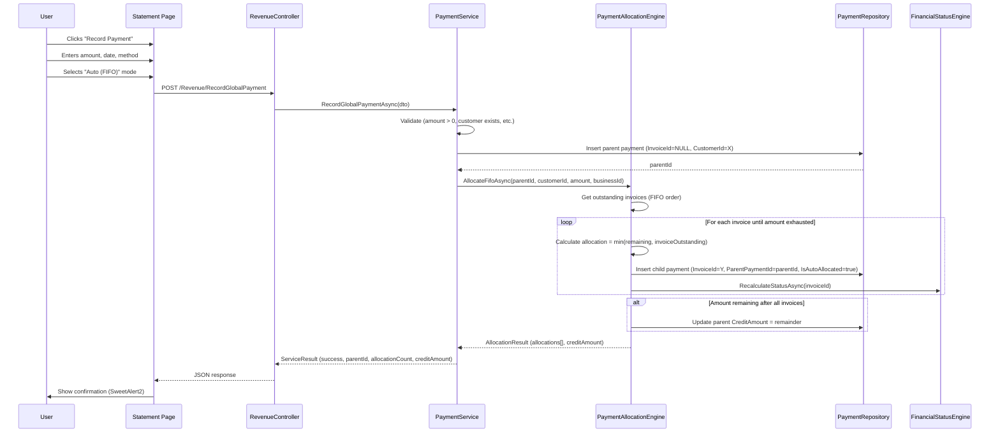

# Design Document: Global Payment Allocation

## Overview

This feature extends the payment system to support customer-level payments that are automatically distributed across multiple outstanding invoices. The core principle is a parent-child payment model where the parent represents the actual money received and children represent allocations to specific invoices.

### Key Design Decisions

1. **Parent-child model** — One parent Payment (customer-level, InvoiceId=NULL) with N child Payments (each linked to an invoice via InvoiceId and back to parent via ParentPaymentId).
2. **FIFO as default** — Oldest invoice first, ordered by InvoiceDate ASC then Id ASC.
3. **Manual override available** — User can choose specific invoices and amounts.
4. **Auto-allocated flag** — Children have `IsAutoAllocated = true` for FIFO, `false` for manual selection.
5. **Cascading void** — Voiding parent voids all children and recalculates all affected invoices.
6. **Credit balance on parent** — Overpayment remainder stored as `CreditAmount` on the parent, not allocated to any invoice.
7. **Backward compatible** — Existing per-invoice payments remain unchanged (ParentPaymentId=NULL, InvoiceId set).

## Architecture

### Payment Flow: Global Payment with FIFO Allocation



### Data Model Changes

#### Modified Table: `[revenue].[Payment]`

| Column | Type | Change | Description |
|--------|------|--------|-------------|
| InvoiceId | INT | **Changed to NULL** | NULL for parent payments, set for children and per-invoice |
| ParentPaymentId | INT NULL | **NEW** | FK to self — links child to parent |
| IsAutoAllocated | BIT NOT NULL DEFAULT 0 | **NEW** | True for FIFO-allocated children |
| CustomerId | INT NULL | **NEW** | FK to Customer — set on parent payments |
| CreditAmount | DECIMAL(18,2) NOT NULL DEFAULT 0 | **NEW** | Unallocated overpayment remainder |

#### Payment Record Types

| Scenario | InvoiceId | ParentPaymentId | IsAutoAllocated | CustomerId | CreditAmount |
|----------|-----------|----------------|-----------------|------------|--------------|
| Per-invoice (existing) | Set | NULL | false | NULL | 0 |
| Global parent | NULL | NULL | false | Set | 0 or overpayment |
| FIFO child | Set | parent.Id | true | NULL | 0 |
| Manual child | Set | parent.Id | false | NULL | 0 |

### Updated Entity: Payment

```csharp
public class Payment
{
    public int Id { get; set; }
    public int BusinessId { get; set; }
    public int? InvoiceId { get; set; }          // Nullable for parent payments
    public int? ParentPaymentId { get; set; }    // NEW: FK to self
    public bool IsAutoAllocated { get; set; }    // NEW
    public int? CustomerId { get; set; }         // NEW: for parent payments
    public decimal CreditAmount { get; set; }    // NEW: overpayment remainder
    public int PaymentMethodTypeId { get; set; }
    public DateTime PaymentDateUtc { get; set; }
    public decimal Amount { get; set; }
    public string? Reference { get; set; }
    public string? Notes { get; set; }
    public bool IsVoided { get; set; }
    public DateTime CreatedAtUtc { get; set; }
    public string? CreatedByUserId { get; set; }

    // Navigation properties
    public Business Business { get; set; } = null!;
    public Invoice? Invoice { get; set; }
    public Customer? Customer { get; set; }
    public Payment? ParentPayment { get; set; }
    public ICollection<Payment> ChildAllocations { get; set; } = new List<Payment>();
    public PaymentMethodType PaymentMethodType { get; set; } = null!;
}
```

### New Service: IPaymentAllocationEngine

```csharp
public interface IPaymentAllocationEngine
{
    /// Allocates a payment amount across outstanding invoices using FIFO.
    Task<AllocationResult> AllocateFifoAsync(int parentPaymentId, int customerId, decimal amount, int businessId, string userId);

    /// Allocates a payment using user-specified invoice/amount pairs.
    Task<AllocationResult> AllocateManualAsync(int parentPaymentId, List<ManualAllocationItem> allocations, int businessId, string userId);
}

public class AllocationResult
{
    public List<AllocationDetail> Allocations { get; set; } = new();
    public decimal CreditAmount { get; set; }
    public int AllocatedCount { get; set; }
    public decimal TotalAllocated { get; set; }
}

public class AllocationDetail
{
    public int ChildPaymentId { get; set; }
    public int InvoiceId { get; set; }
    public string InvoiceNumber { get; set; } = null!;
    public decimal AllocatedAmount { get; set; }
    public decimal InvoiceOutstandingAfter { get; set; }
}

public class ManualAllocationItem
{
    public int InvoiceId { get; set; }
    public decimal Amount { get; set; }
}
```

### New DTO: RecordGlobalPaymentDto

```csharp
public class RecordGlobalPaymentDto
{
    public int CustomerId { get; set; }
    public decimal Amount { get; set; }
    public DateTime PaymentDateUtc { get; set; }
    public int PaymentMethodTypeId { get; set; }
    public string? Reference { get; set; }
    public string? Notes { get; set; }
    public string AllocationMode { get; set; } = "fifo"; // "fifo" or "manual"
    public List<ManualAllocationItem>? ManualAllocations { get; set; }
    // Note: In manual mode, any remainder (Amount - sum of ManualAllocations) is stored as credit.
    // There is no "remainder mode" option — manual means explicit, remainder = credit.
}
```

### Controller Endpoints

```csharp
// POST: /Revenue/RecordGlobalPayment — AJAX endpoint for global payment with allocation
[HttpPost]
[ValidateAntiForgeryToken]
Task<IActionResult> AxPostRecordGlobalPayment([FromBody] RecordGlobalPaymentDto request);

// GET: /Revenue/GetOutstandingInvoicesForCustomer?customerId=X — for manual allocation UI
[HttpGet]
Task<IActionResult> AxGetOutstandingInvoicesForCustomer(int customerId);

// POST: /Revenue/VoidGlobalPayment — voids parent + cascades to children
[HttpPost]
[ValidateAntiForgeryToken]
Task<IActionResult> AxPostVoidGlobalPayment(int paymentId);
```

### SQL Migration

```sql
-- Add ParentPaymentId (self-referencing FK)
ALTER TABLE [revenue].[Payment]
ADD [ParentPaymentId] INT NULL;

ALTER TABLE [revenue].[Payment]
ADD CONSTRAINT [FK_Payment_ParentPayment]
FOREIGN KEY ([ParentPaymentId]) REFERENCES [revenue].[Payment]([Id]);

-- Add IsAutoAllocated
ALTER TABLE [revenue].[Payment]
ADD [IsAutoAllocated] BIT NOT NULL CONSTRAINT [DF_Payment_IsAutoAllocated] DEFAULT (0);

-- Add CustomerId (FK to customer)
ALTER TABLE [revenue].[Payment]
ADD [CustomerId] INT NULL;

ALTER TABLE [revenue].[Payment]
ADD CONSTRAINT [FK_Payment_Customer]
FOREIGN KEY ([CustomerId]) REFERENCES [customer].[Customer]([Id]);

-- Add CreditAmount
ALTER TABLE [revenue].[Payment]
ADD [CreditAmount] DECIMAL(18,2) NOT NULL CONSTRAINT [DF_Payment_CreditAmount] DEFAULT (0);

-- Make InvoiceId nullable
ALTER TABLE [revenue].[Payment]
ALTER COLUMN [InvoiceId] INT NULL;

-- Index for parent-child queries
CREATE NONCLUSTERED INDEX [IX_Payment_ParentPaymentId]
ON [revenue].[Payment] ([ParentPaymentId])
WHERE [ParentPaymentId] IS NOT NULL;

-- Index for customer-level payment queries
CREATE NONCLUSTERED INDEX [IX_Payment_CustomerId]
ON [revenue].[Payment] ([CustomerId])
WHERE [CustomerId] IS NOT NULL;
```

### FIFO Allocation SQL Pattern

```sql
-- Get outstanding invoices for a customer (FIFO order)
-- Excludes: Paid (FinancialStatus=3) and WrittenOff (FinancialStatus=5)
-- Uses UPDLOCK to prevent race conditions with concurrent allocations
SELECT [invoice].[Invoice].[Id],
       [invoice].[Invoice].[InvoiceNumber],
       [invoice].[Invoice].[InvoiceDate],
       [invoice].[Invoice].[TotalAmount],
       [invoice].[Invoice].[TotalAmount] - ISNULL(
           (SELECT SUM([revenue].[Payment].[Amount])
            FROM [revenue].[Payment]
            WHERE [revenue].[Payment].[InvoiceId] = [invoice].[Invoice].[Id]
              AND [revenue].[Payment].[IsVoided] = 0
              AND [revenue].[Payment].[BusinessId] = @BusinessId), 0
       ) - ISNULL(
           (SELECT SUM([credit].[CreditNoteApplication].[AmountApplied])
            FROM [credit].[CreditNoteApplication]
            WHERE [credit].[CreditNoteApplication].[InvoiceId] = [invoice].[Invoice].[Id]
              AND [credit].[CreditNoteApplication].[IsVoided] = 0), 0
       ) AS OutstandingBalance
FROM [invoice].[Invoice] WITH (UPDLOCK)
WHERE [invoice].[Invoice].[BusinessId] = @BusinessId
  AND [invoice].[Invoice].[CustomerId] = @CustomerId
  AND [invoice].[Invoice].[InvoiceStatusTypeId] = 2
  AND [invoice].[Invoice].[InvoiceFinancialStatusTypeId] NOT IN (3, 5)
  AND [invoice].[Invoice].[IsDeleted] = 0
  AND ([invoice].[Invoice].[TotalAmount] - ISNULL(
           (SELECT SUM([revenue].[Payment].[Amount])
            FROM [revenue].[Payment]
            WHERE [revenue].[Payment].[InvoiceId] = [invoice].[Invoice].[Id]
              AND [revenue].[Payment].[IsVoided] = 0
              AND [revenue].[Payment].[BusinessId] = @BusinessId), 0
       ) - ISNULL(
           (SELECT SUM([credit].[CreditNoteApplication].[AmountApplied])
            FROM [credit].[CreditNoteApplication]
            WHERE [credit].[CreditNoteApplication].[InvoiceId] = [invoice].[Invoice].[Id]
              AND [credit].[CreditNoteApplication].[IsVoided] = 0), 0
       )) > 0
ORDER BY [invoice].[Invoice].[InvoiceDate] ASC, [invoice].[Invoice].[Id] ASC
```

> **Concurrency note**: The `WITH (UPDLOCK)` hint prevents concurrent transactions from reading stale outstanding balances. Combined with a serializable transaction isolation level in the allocation engine, this ensures no invoice can be overpaid due to a race condition.

### Void Cascade Logic

```
1. Load parent payment → validate ownership, not already voided
2. Load all children WHERE ParentPaymentId = parent.Id AND IsVoided = 0
3. Collect affected InvoiceIds
4. Void parent (IsVoided = 1)
5. Void all children (IsVoided = 1)
6. Zero parent's CreditAmount
7. For each affected InvoiceId → RecalculateStatusAsync
8. Revert instalment matches for each child
```

### UI: Global Payment Form (Statement Page)

The form appears as a modal or inline panel when the user clicks "Record Payment" on the Statement page:

- **Pre-filled**: Customer name, total outstanding balance
- **Fields**: Amount, Payment Date (default: today), Payment Method (dropdown), Reference, Notes
- **Allocation toggle**: "Auto (FIFO)" (default) | "Manual"
- **Manual mode**: Shows table of outstanding invoices with amount input per row
- **Overpayment warning**: SweetAlert2 confirmation when amount > total outstanding
- **BlockUI during save**, SweetAlert2 for result

### UI: Payment Display on Invoice Detail

Auto-allocated payments show with a badge:
```
€500.00  |  15 Jul 2026  |  Bank Transfer  |  🔗 Auto-allocated from Payment REF-001
```

### UI: Customer Statement Display

Parent payments show as primary transaction lines:
```
15 Jul 2026  |  PAYMENT  |  €1,000.00  |  Ref: REF-001  |  Allocated: 2 invoices
```

With expandable detail showing child allocations.

## Concurrency Strategy

The allocation engine operates within a **serializable transaction** with `UPDLOCK` hints on the invoice read query. This prevents race conditions where two concurrent global payments for the same customer could both allocate to the same invoice, causing overpayment.

```csharp
// In PaymentAllocationEngine.AllocateFifoAsync:
using var transaction = await _dbContext.Database.BeginTransactionAsync(IsolationLevel.Serializable);
try
{
    // The FIFO query uses WITH (UPDLOCK) — locks rows until transaction completes
    var outstandingInvoices = await GetOutstandingInvoicesWithLockAsync(customerId, businessId);
    // ... allocate ...
    await transaction.CommitAsync();
}
catch
{
    await transaction.RollbackAsync();
    throw;
}
```

If two requests arrive simultaneously, the second will wait for the first to commit (or will timeout if the first takes too long). This is acceptable because global payment recording is not a high-frequency operation.

## Backward Compatibility: Nullable InvoiceId

Making `Payment.InvoiceId` nullable impacts all existing code that reads this property. The following changes are required:

### Entity Change
```csharp
// Before
public int InvoiceId { get; set; }
public Invoice Invoice { get; set; } = null!;

// After
public int? InvoiceId { get; set; }
public Invoice? Invoice { get; set; }
```

### Code Changes Required
1. `PaymentService.VoidPaymentAsync` — add `if (payment.InvoiceId.HasValue)` guard before calling `RecalculateStatusAsync` and `RevertPaymentMatchAsync`
2. `PaymentService.RecordPaymentAsync` — unchanged (always passes a non-null InvoiceId)
3. `PaymentRepository.InsertAsync` — handle nullable InvoiceId with `SqlDbType.Int` and `DBNull.Value`
4. `PaymentRepository.GetByIdAndBusinessIdAsync` — SELECT must include new columns
5. `PaymentRepository.GetValidPaymentsByInvoiceIdAsync` — unchanged (always queries with a specific InvoiceId)
6. All EF Core queries using `.Include(p => p.Invoice)` — add null checks on navigation property
7. Void cascade: parent payment void does NOT call RecalculateStatusAsync for itself (no InvoiceId), only for children

### Navigation Property Safety
```csharp
// Parent payments have Invoice = null — always check before accessing
if (payment.Invoice != null)
{
    // safe to use payment.Invoice.InvoiceNumber etc.
}
```

## Credit Balance Application

Credit balances are fully functional:
- Displayed in the payment modal as "Available credit: €X.XX"
- "Apply Credit" button allocates credit to outstanding invoices via FIFO
- Reduces parent payment's `CreditAmount` and creates child allocations
- Recalculates invoice financial statuses
- No automatic application — user must click "Apply Credit" explicitly

## Error Handling

| Scenario | Behaviour |
|----------|-----------|
| Customer has no outstanding invoices | Warning: "No outstanding invoices. Record as credit?" |
| Amount = 0 or negative | Validation error: "Amount must be greater than zero." |
| Future payment date | Validation error: "Payment date cannot be in the future." |
| Manual allocation sum > payment amount | Validation error: "Allocations exceed payment amount." |
| Manual allocation > invoice outstanding | Validation error: "Amount exceeds outstanding balance for [InvoiceNumber]." |
| Parent void with already-voided children | Skip already-voided children, process remaining |
| Database error during allocation | Roll back entire transaction (parent + all children) |

## Testing Strategy

### Property-Based Tests

1. **FIFO ordering is deterministic** — For any set of invoices, FIFO allocation always processes oldest first
2. **Sum of allocations = payment amount (or payment - credit)** — Total allocated + credit = parent amount
3. **No invoice receives more than its outstanding** — Each child amount ≤ invoice outstanding at time of allocation
4. **Void cascade completeness** — Voiding parent voids exactly all its children
5. **Tenant isolation** — Allocations never cross business boundaries
6. **Financial status consistency** — After allocation, every affected invoice has the correct status
