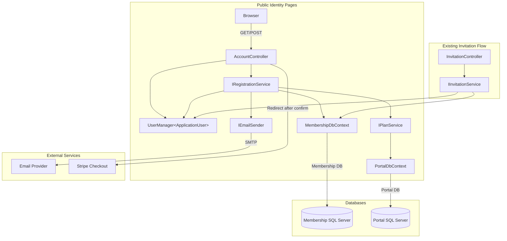
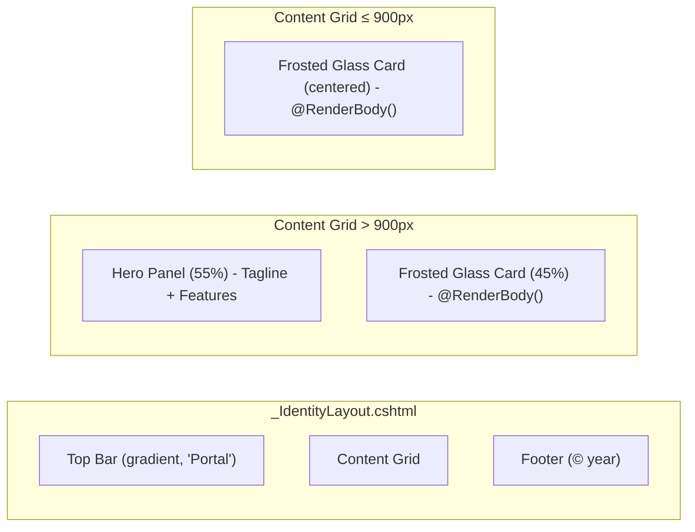

# Design Document: Identity Pages

## Overview

This design defines the technical architecture for the public-facing identity pages: Registration, Confirm Account, Forgot Password, and Reset Password. These pages provide self-service onboarding for new users who select a subscription plan, register, confirm their email, and proceed to Stripe checkout.

The implementation extends the existing `AccountController` with new actions, introduces a dedicated `IRegistrationService` for the public registration flow, and adds a new `PendingRegistration` entity to track plan selection between registration and email confirmation. A shared Razor layout (`_IdentityLayout.cshtml`) implements the Identity Page Design Guide with frosted glass cards, particle background, and responsive two-column/single-column layout.

The existing invitation-only flow via `InvitationController` remains completely untouched. Both flows share the same `ApplicationUser` entity in the Membership database.

## Architecture



### Request Flow

1. **Registration**: `GET /Account/Register` → renders form with plan selection → `POST /Account/Register` → `IRegistrationService.RegisterAsync()` → creates `ApplicationUser` (EmailConfirmed=false) + `PendingRegistration` record → sends verification email → redirects to "check your email" view.

2. **Confirm Email**: `GET /Account/ConfirmEmail?userId=X&token=Y` → `UserManager.ConfirmEmailAsync()` → on success, retrieves `PendingRegistration` to build Stripe checkout URL → displays success with CTA button.

3. **Forgot Password**: `GET /Account/ForgotPassword` → renders email form → `POST /Account/ForgotPassword` → always redirects to confirmation view (uniform response) → if email matches confirmed account, generates token and sends email.

4. **Reset Password**: `GET /Account/ResetPassword?userId=X&token=Y` → validates token before showing form → `POST /Account/ResetPassword` → `UserManager.ResetPasswordAsync()` → displays success with login link.

## Components and Interfaces

### Controllers

**AccountController** (extended — existing Login/Logout actions preserved):

```csharp
public class AccountController : Controller
{
    // Existing: Login, Logout, AccessDenied

    // New actions:
    [HttpGet, AllowAnonymous]
    public async Task<IActionResult> Register(string? plan = null);

    [HttpPost, AllowAnonymous, ValidateAntiForgeryToken]
    public async Task<IActionResult> Register(RegisterViewModel model);

    [HttpGet, AllowAnonymous]
    public IActionResult RegisterConfirmation();

    [HttpGet, AllowAnonymous]
    public async Task<IActionResult> ConfirmEmail(string? userId, string? token);

    [HttpGet, AllowAnonymous]
    public IActionResult ForgotPassword();

    [HttpPost, AllowAnonymous, ValidateAntiForgeryToken]
    public async Task<IActionResult> ForgotPassword(ForgotPasswordViewModel model);

    [HttpGet, AllowAnonymous]
    public IActionResult ForgotPasswordConfirmation();

    [HttpGet, AllowAnonymous]
    public async Task<IActionResult> ResetPassword(string? userId, string? token);

    [HttpPost, AllowAnonymous, ValidateAntiForgeryToken]
    public async Task<IActionResult> ResetPassword(ResetPasswordViewModel model);

    [HttpGet, AllowAnonymous]
    public IActionResult ResetPasswordConfirmation();
}
```

### Services

**IRegistrationService** (new):

```csharp
public interface IRegistrationService
{
    Task<RegistrationResult> RegisterAsync(RegisterViewModel model);
    Task<PendingRegistration?> GetPendingRegistrationByUserIdAsync(string userId);
    Task MarkPendingRegistrationCompletedAsync(string userId);
}
```

**IPlanService** (new):

```csharp
public interface IPlanService
{
    Task<List<Plan>> GetActivePlansOrderedAsync();
    Task<Plan?> GetPlanBySlugAsync(string slug);
}
```

**IEmailSender** (existing — extended with new methods):

```csharp
// New methods added to existing interface or a new IIdentityEmailService:
public interface IIdentityEmailService
{
    Task SendEmailConfirmationAsync(string email, string confirmationLink);
    Task SendPasswordResetAsync(string email, string resetLink);
}
```

### View Models

```csharp
public class RegisterViewModel
{
    [Required, MaxLength(100)]
    public string FirstName { get; set; } = null!;

    [Required, MaxLength(100)]
    public string LastName { get; set; } = null!;

    [Required, EmailAddress, MaxLength(256)]
    public string Email { get; set; } = null!;

    [Required, MinLength(8)]
    public string Password { get; set; } = null!;

    [Required, Compare(nameof(Password))]
    public string ConfirmPassword { get; set; } = null!;

    [Required]
    public int? SelectedPlanId { get; set; }

    // For display
    public List<PlanDisplayModel>? AvailablePlans { get; set; }
    public PlanDisplayModel? PreSelectedPlan { get; set; }
}

public class ForgotPasswordViewModel
{
    [Required, EmailAddress, MaxLength(256)]
    public string Email { get; set; } = null!;
}

public class ResetPasswordViewModel
{
    [Required]
    public string UserId { get; set; } = null!;

    [Required]
    public string Token { get; set; } = null!;

    [Required, MinLength(8)]
    public string Password { get; set; } = null!;

    [Required, Compare(nameof(Password))]
    public string ConfirmPassword { get; set; } = null!;
}

public class PlanDisplayModel
{
    public int Id { get; set; }
    public string Name { get; set; } = null!;
    public string Slug { get; set; } = null!;
    public decimal MonthlyPriceEur { get; set; }
    public string? Description { get; set; }
}
```

### Views Structure

```
Views/
├── Account/
│   ├── Register.cshtml
│   ├── RegisterConfirmation.cshtml
│   ├── ConfirmEmail.cshtml
│   ├── ForgotPassword.cshtml
│   ├── ForgotPasswordConfirmation.cshtml
│   ├── ResetPassword.cshtml
│   ├── ResetPasswordConfirmation.cshtml
│   ├── Login.cshtml (existing)
│   └── AccessDenied.cshtml (existing)
├── Shared/
│   ├── _Layout.cshtml (existing)
│   └── _IdentityLayout.cshtml (new)
```

### Layout Component: `_IdentityLayout.cshtml`

The shared identity layout implements:
- **Top bar**: Gradient background (`linear-gradient(180deg, #1A6BB8 0%, #0D5EA6 100%)`), "Portal" text left-aligned
- **Content area**: Two-column grid (55%/45%) above 900px, single centered card at/below 900px
- **Frosted glass card**: `backdrop-filter: blur(16px)`, `border-radius: 24px`, `max-width: 420px`
- **Particle background**: Canvas with `aria-hidden="true"`, `pointer-events: none`, disabled via `prefers-reduced-motion: reduce`
- **Footer**: "© {year} Portal · 3 Inventors" centered, year rendered server-side
- **Meta tags**: `<title>`, `og:title`, `og:description`, `og:type`, `og:url`, `<meta name="description">`, favicon, conditional `noindex`



## Data Models

### New Entity: PendingRegistration

Stored in the **Membership database** to track the plan selection between registration and email confirmation.

```csharp
namespace Portal.Infrastructure.Entities.Identity;

/// <summary>
/// Tracks a user's selected plan between registration and email confirmation.
/// Once the user confirms their email and completes Stripe checkout, this record
/// is marked as completed.
/// </summary>
public class PendingRegistration
{
    public int Id { get; set; }

    /// <summary>
    /// FK to AspNetUsers.Id
    /// </summary>
    public string UserId { get; set; } = null!;

    /// <summary>
    /// FK to Portal.Plan.Id (cross-database reference stored as int)
    /// </summary>
    public int PlanId { get; set; }

    /// <summary>
    /// Whether the user has completed email confirmation and Stripe checkout.
    /// </summary>
    public bool IsCompleted { get; set; }

    public DateTime CreatedAtUtc { get; set; }

    public DateTime? CompletedAtUtc { get; set; }

    // Navigation
    public ApplicationUser User { get; set; } = null!;
}
```

**SQL Migration:**

```sql
CREATE TABLE [membership].[PendingRegistration]
(
    [Id]              INT IDENTITY(1,1) NOT NULL,
    [UserId]          NVARCHAR(450) NOT NULL,
    [PlanId]          INT NOT NULL,
    [IsCompleted]     BIT NOT NULL DEFAULT 0,
    [CreatedAtUtc]    DATETIME NOT NULL DEFAULT GETUTCDATE(),
    [CompletedAtUtc]  DATETIME NULL,
    CONSTRAINT [PK_PendingRegistration] PRIMARY KEY ([Id]),
    CONSTRAINT [FK_PendingRegistration_User] FOREIGN KEY ([UserId])
        REFERENCES [dbo].[AspNetUsers]([Id]) ON DELETE NO ACTION,
    CONSTRAINT [UX_PendingRegistration_UserId] UNIQUE ([UserId])
);
```

### Existing Entities (unchanged)

| Entity | Database | Role in this feature |
|--------|----------|---------------------|
| `ApplicationUser` | Membership | User record created at registration (BusinessId = null) |
| `Plan` | Portal | Read-only lookup for plan selection display |
| `PlanFeature` | Portal | Read-only for displaying plan features |
| `Invitation` | Membership | Untouched — used only by InvitationController |
| `UserBusiness` | Membership | Not created during public registration; created later when user accepts invitation |
| `UserBusinessPermission` | Membership | Not created during public registration |

### EF Core Configuration (MembershipDbContext addition)

```csharp
builder.Entity<PendingRegistration>(entity =>
{
    entity.ToTable("PendingRegistration", "membership");
    entity.HasKey(e => e.Id);
    entity.HasIndex(e => e.UserId).IsUnique();
    entity.Property(e => e.UserId).HasMaxLength(450).IsRequired();
    entity.Property(e => e.CreatedAtUtc).IsRequired().HasDefaultValueSql("GETUTCDATE()");
    entity.HasOne(e => e.User)
          .WithOne()
          .HasForeignKey<PendingRegistration>(e => e.UserId)
          .OnDelete(DeleteBehavior.NoAction);
});
```

## Correctness Properties

*A property is a characteristic or behavior that should hold true across all valid executions of a system — essentially, a formal statement about what the system should do. Properties serve as the bridge between human-readable specifications and machine-verifiable correctness guarantees.*

### Property 1: Plan listing is ordered by DisplayOrder

*For any* set of active plans in the database, the `IPlanService.GetActivePlansOrderedAsync()` method SHALL return them sorted in ascending order by their `DisplayOrder` value.

**Validates: Requirements 2.5**

### Property 2: Valid registration creates unconfirmed user with correct pending state

*For any* valid registration input (valid name, valid email, valid password, valid plan selection), the registration service SHALL create an `ApplicationUser` with `EmailConfirmed = false` and a corresponding `PendingRegistration` record storing the selected `PlanId`.

**Validates: Requirements 2.6, 2.7, 2.8**

### Property 3: Public registration creates user without business or permissions

*For any* user registered via the public Registration Page, the created `ApplicationUser` SHALL have `BusinessId = null`, and no `UserBusiness` or `UserBusinessPermission` records SHALL exist for that user.

**Validates: Requirements 2.14, 6.3**

### Property 4: Duplicate email is rejected

*For any* email address that already exists in the Identity user store, attempting to register with that same email SHALL return a failure result indicating the email is already in use.

**Validates: Requirements 2.10**

### Property 5: Password policy validation returns specific errors per unmet criterion

*For any* password string, the validation logic SHALL return an error for each unmet criterion independently: missing uppercase letter, missing digit, missing special character, or insufficient length (< 8 characters). A password meeting all criteria SHALL pass validation.

**Validates: Requirements 2.11, 5.7**

### Property 6: Name validation rejects empty or oversized names

*For any* first name or last name that is empty (whitespace-only) or exceeds 100 characters, the registration validation SHALL reject it. Names between 1 and 100 non-whitespace characters SHALL be accepted.

**Validates: Requirements 2.12**

### Property 7: Password confirmation mismatch is rejected

*For any* pair of strings where password ≠ confirmPassword, the validation SHALL return an error indicating the passwords must match.

**Validates: Requirements 2.15, 5.8**

### Property 8: Email format validation rejects malformed addresses

*For any* string that does not conform to a well-formed email format (missing @, missing domain, invalid characters), the validation SHALL reject it. Well-formed email addresses SHALL be accepted.

**Validates: Requirements 2.17, 4.7**

### Property 9: Valid token confirms email and sets EmailConfirmed to true

*For any* user with a valid (non-expired) email verification token, calling the confirmation logic SHALL set `EmailConfirmed = true` on that user's record.

**Validates: Requirements 3.2, 3.6**

### Property 10: Invalid or missing token returns generic error without revealing user existence

*For any* request to ConfirmEmail or ResetPassword with an invalid token, expired token, non-existent userId, or missing parameters, the system SHALL return the same generic error message regardless of whether the userId corresponds to a real user.

**Validates: Requirements 3.4, 3.5, 5.6, 5.9, 5.10**

### Property 11: Forgot password returns uniform response regardless of email existence

*For any* email address submitted to the Forgot Password form (whether it matches an existing confirmed account, an unconfirmed account, or no account at all), the system SHALL redirect to the same confirmation view. Only confirmed accounts SHALL trigger actual email sending.

**Validates: Requirements 4.4, 4.5, 4.8**

### Property 12: Invalid reset token prevents password form display

*For any* request to the Reset Password page with an invalid or expired token, the system SHALL display an error message and SHALL NOT render the password input form.

**Validates: Requirements 5.3, 5.6**

### Property 13: Valid reset token and valid password updates the user's password

*For any* valid reset token and password meeting the policy requirements, the reset operation SHALL successfully update the user's password such that the user can subsequently authenticate with the new password.

**Validates: Requirements 5.4**

### Property 14: Existing public user can accept invitation without re-registration

*For any* user who registered via the public Registration Page (BusinessId = null) and subsequently receives an invitation, accepting the invitation SHALL assign the existing user to the inviting Business and grant the specified permissions without creating a duplicate user record.

**Validates: Requirements 6.5**

## Error Handling

### Controller-Level Error Handling

| Scenario | Behaviour |
|----------|-----------|
| Model validation failure | Return view with `ModelState` errors; set `aria-invalid` on failed fields |
| `UserManager` operation failure | Map `IdentityError` codes to user-friendly messages; add to `ModelState` |
| Email sending failure | Log error via Serilog; still redirect to confirmation view (do not reveal failure to user) |
| Database exception | Catch in service layer, rethrow; controller catches, logs, returns generic error view |
| Invalid/expired token | Display user-friendly error; never reveal whether userId exists |
| Stripe checkout URL generation failure | Log error; display fallback message with support contact |

### Security Error Handling

- **Information disclosure prevention**: All token-based pages (ConfirmEmail, ResetPassword) return identical generic error messages for invalid userId, invalid token, expired token, and missing parameters.
- **Timing attack mitigation**: The Forgot Password endpoint always performs the same redirect regardless of email existence, preventing enumeration via response timing.
- **Rate limiting**: Consider adding rate limiting middleware on POST endpoints to prevent brute-force attacks (implementation deferred to infrastructure layer).

### Validation Error Display Pattern

```html
<!-- Server-side validation error rendering pattern -->
<div class="field-group">
    <label for="Email">Email address</label>
    <input id="Email" name="Email" type="email"
           asp-for="Email"
           aria-required="true"
           aria-invalid="@(ViewData.ModelState["Email"]?.Errors.Any() == true ? "true" : null)"
           aria-describedby="@(ViewData.ModelState["Email"]?.Errors.Any() == true ? "Email-error" : null)" />
    <span id="Email-error" asp-validation-for="Email" role="alert" class="field-error"></span>
</div>
```

## Testing Strategy

### Test Framework and Libraries

| Tool | Purpose |
|------|---------|
| xUnit | Test runner |
| FsCheck + FsCheck.Xunit | Property-based testing |
| Moq | Mocking dependencies |
| Microsoft.AspNetCore.Mvc.Testing | Integration tests |
| Microsoft.EntityFrameworkCore.InMemory | In-memory database for unit tests |

### Property-Based Tests (FsCheck)

Each correctness property maps to a property-based test with minimum 100 iterations. Tests use FsCheck generators to produce random valid/invalid inputs and verify universal properties hold.

**Test file location**: `Portal.Tests/PropertyBased/Identity/`

| Property | Test Class | What Varies |
|----------|-----------|-------------|
| 1: Plan ordering | `PlanOrderingPropertyTests` | Random plan sets with varying DisplayOrder |
| 2: Registration creates correct state | `RegistrationStatePropertyTests` | Random valid names, emails, passwords, plan IDs |
| 3: No business/permissions on public reg | `PublicRegistrationIsolationPropertyTests` | Random valid registration inputs |
| 4: Duplicate email rejection | `DuplicateEmailPropertyTests` | Random emails pre-seeded in user store |
| 5: Password policy validation | `PasswordPolicyPropertyTests` | Random strings with/without uppercase, digits, special chars |
| 6: Name validation | `NameValidationPropertyTests` | Random strings of varying lengths (0, 1-100, 101+) |
| 7: Password mismatch | `PasswordMismatchPropertyTests` | Random string pairs where a ≠ b |
| 8: Email format validation | `EmailFormatPropertyTests` | Random valid/invalid email strings |
| 9: Token confirms email | `EmailConfirmationPropertyTests` | Random users with generated tokens |
| 10: Generic error for invalid tokens | `TokenErrorUniformityPropertyTests` | Random invalid/expired tokens, non-existent userIds |
| 11: Uniform forgot password response | `ForgotPasswordUniformityPropertyTests` | Random emails (existing confirmed, unconfirmed, non-existent) |
| 12: Invalid reset token hides form | `ResetTokenGatePropertyTests` | Random invalid/expired tokens |
| 13: Valid reset updates password | `PasswordResetPropertyTests` | Random valid passwords + valid tokens |
| 14: Invitation merge without re-reg | `InvitationMergePropertyTests` | Random existing users + random invitations |

**Configuration**: Each test uses `[Property(MaxTest = 100)]` and includes a tag comment:
```csharp
// Feature: identity-pages, Property {N}: {property_text}
```

### Unit Tests (Example-Based)

| Area | Test Focus |
|------|-----------|
| Layout rendering | Verify structural elements (top bar, footer, card, canvas) are present |
| Route accessibility | Verify all identity routes return 200 without authentication |
| Form field presence | Verify all required form fields render correctly |
| Accessibility attributes | Verify `aria-required`, `role="alert"`, `aria-describedby` |
| SEO meta tags | Verify title format, OG tags, description, noindex on token pages |
| Responsive breakpoint | Verify CSS media query at 900px |
| Login/Forgot Password links | Verify navigation links are present on each page |

### Integration Tests

| Scenario | Approach |
|----------|----------|
| Full registration → confirm → Stripe redirect | End-to-end with `WebApplicationFactory` |
| Invitation flow still works | Verify `InvitationController` routes unchanged |
| Existing user accepts invitation | Create public user, then process invitation |
| Concurrent duplicate email registration | Verify only one succeeds |

### Accessibility Testing

- Automated: Verify ARIA attributes, label associations, role="alert" via rendered HTML assertions
- Manual: Keyboard navigation, screen reader testing, contrast ratio verification (WCAG AA)
- Note: Full WCAG compliance validation requires manual testing with assistive technologies and expert accessibility review
