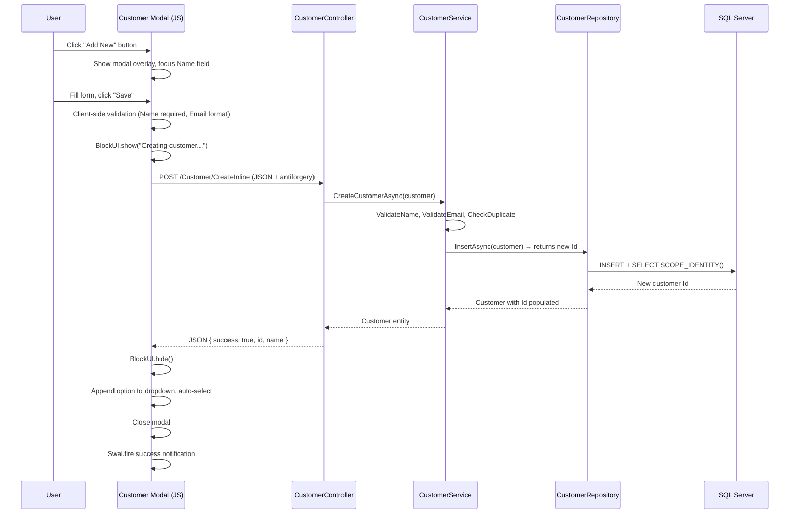

# Design Document: Inline Customer Creation

## Overview

This feature adds inline customer creation to the Quotation and Invoice create/edit forms. Users can create a new customer via a modal dialog without navigating away, preserving all in-progress form data. The modal submits via AJAX to a new JSON endpoint on the existing `CustomerController`, and on success, the customer dropdown is updated and auto-selects the new customer.

### Key Design Decisions

| Decision | Choice | Rationale |
|----------|--------|-----------|
| Endpoint location | New action on existing `CustomerController` | Keeps customer CRUD cohesive; avoids a new controller |
| Repository change | Modify `InsertAsync` to return new customer Id via `SCOPE_IDENTITY()` | Required for JSON response; minimal change to existing method |
| Modal implementation | Shared Razor partial `_CustomerModal.cshtml` | Reusable across 4 views (Quotation Create/Edit, Invoice Create/Edit) |
| JavaScript | Single `customer-modal.js` module in `wwwroot/js/` | Vanilla JS with fetch, BlockUI, SweetAlert2 per project conventions |
| Duplicate detection | Server-side Name uniqueness check per tenant | Prevents confusion from duplicate customer names within the same business |

## Architecture



### Integration Points

- **Quotation Create/Edit views** — Render `_CustomerModal` partial, include `customer-modal.js`
- **Invoice Create/Edit views** — Same partial and JS module
- **CustomerController** — New `CreateInline` POST action
- **CustomerService** — Enhanced with duplicate name check
- **CustomerRepository** — `InsertAsync` modified to return the new Id

## Components and Interfaces

### 1. CustomerController — New Action

```csharp
[HttpPost]
[ValidateAntiForgeryToken]
[ModuleAccess(PortalModules.Customer, AccessLevels.Full)]
public async Task<IActionResult> CreateInline(CustomerFormViewModel model)
{
    // Returns: Json(new { success, id, name, message })
}
```

**Request**: Standard form-encoded POST with antiforgery token (same `CustomerFormViewModel` used by the existing Create action).

**Response shape**:
```json
{ "success": true, "id": 42, "name": "Acme Corp" }
// or on error:
{ "success": false, "message": "Customer name already exists" }
```

### 2. CustomerRepository — Enhanced InsertAsync

```csharp
public async Task<int> InsertAsync(Customer entity)
{
    // INSERT INTO ... ; SELECT CAST(SCOPE_IDENTITY() AS INT)
    // Returns: the new customer Id
}
```

The return type changes from `Task` to `Task<int>`. The existing `Create` action (full-page post) calls this method but can discard the return value, so it remains backward-compatible.

### 3. CustomerService — Enhanced CreateCustomerAsync

```csharp
public async Task<Customer> CreateCustomerAsync(Customer customer)
{
    ValidateName(customer.Name);
    ValidateEmail(customer.Email);
    await ValidateUniqueNameAsync(customer.Name, customer.BusinessId); // NEW

    customer.BusinessId = _currentTenantService.CurrentBusinessId;
    customer.IsActive = true;
    customer.CreatedAtUtc = DateTime.UtcNow;
    customer.UpdatedAtUtc = DateTime.UtcNow;

    customer.Id = await _customerRepository.InsertAsync(customer); // NOW returns Id

    return customer;
}
```

New private method:
```csharp
private async Task ValidateUniqueNameAsync(string name, int businessId)
{
    var existing = await _customerRepository.GetAllByBusinessIdAsync(businessId);
    if (existing.Any(c => c.Name.Equals(name, StringComparison.OrdinalIgnoreCase) && c.IsActive))
        throw new ArgumentException("A customer with this name already exists");
}
```

### 4. Shared Partial View — `_CustomerModal.cshtml`

Located at `Portal.Web/Views/Shared/_CustomerModal.cshtml`.

Rendered in each of the 4 target views via:
```razor
@await Html.PartialAsync("_CustomerModal")
```

Contains:
- Fixed overlay backdrop (`position:fixed; inset:0; z-index:10000`)
- Inner card (24px radius, 32px padding, max-width 460px)
- Form grid with all 10 customer fields
- Save + Cancel buttons
- Hidden antiforgery token input

### 5. JavaScript Module — `customer-modal.js`

Located at `Portal.Web/wwwroot/js/customer-modal.js`.

Exports (via global namespace pattern consistent with the project):
- `openCustomerModal()` — Shows modal, clears fields, focuses Name
- `closeCustomerModal()` — Hides modal
- `submitCustomerModal(dropdownId)` — Validates, submits, updates dropdown

**Dropdown targeting**: The `openCustomerModal()` function accepts the `id` of the target `<select>` element, so it knows which dropdown to update on success. This handles the difference between Quotation views (`CustomerId` with asp-for) and Invoice views (`customerId` with raw HTML).

## Data Models

### Customer Entity (unchanged)

The `Customer` entity remains unchanged. The `Id` property is populated by the repository after insert.

### CustomerFormViewModel (reused)

The existing `CustomerFormViewModel` is reused for the inline creation endpoint — same validation attributes, same field set.

### JSON Response Model (implicit)

No new class needed — the controller returns an anonymous object:
```csharp
Json(new { success = true, id = customer.Id, name = customer.Name })
```

### Database Change

The `InsertAsync` SQL changes from:
```sql
INSERT INTO [customer].[Customer] (...) VALUES (...)
```
To:
```sql
INSERT INTO [customer].[Customer] (...) VALUES (...);
SELECT CAST(SCOPE_IDENTITY() AS INT);
```

No schema migration needed — this is a query change only.

## Correctness Properties

*A property is a characteristic or behavior that should hold true across all valid executions of a system — essentially, a formal statement about what the system should do. Properties serve as the bridge between human-readable specifications and machine-verifiable correctness guarantees.*

### Property 1: Whitespace Name rejection

*For any* string composed entirely of whitespace characters (spaces, tabs, newlines, or empty string), submitting the customer modal form SHALL be prevented by client-side validation, and no server request SHALL be made.

**Validates: Requirements 3.1**

### Property 2: Email format validation

*For any* non-empty string that does not match the pattern `local-part@domain.tld` (missing @, missing domain, multiple @, whitespace, etc.), submitting the customer modal form SHALL be prevented by client-side validation. Conversely, *for any* empty email string, no validation error SHALL be displayed.

**Validates: Requirements 3.2, 3.4**

### Property 3: Form data preservation during modal lifecycle

*For any* set of values entered in the underlying quotation or invoice form fields, opening the customer modal, performing any action (submit success, submit failure, cancel, click outside, press Escape), and closing the modal SHALL leave all underlying form field values unchanged.

**Validates: Requirements 4.8, 5.3, 7.3**

### Property 4: Dropdown update and auto-selection after creation

*For any* valid customer Id (positive integer) and Name (non-empty string) returned in a success response, the customer dropdown SHALL contain a new option with that Id as value and Name as display text, and the dropdown's selected value SHALL equal that Id.

**Validates: Requirements 5.1, 5.2**

### Property 5: Customer creation persists correctly

*For any* valid customer form data (non-empty Name, valid or empty Email, all fields within max length), calling `CreateCustomerAsync` SHALL produce a Customer entity with `IsActive = true`, `BusinessId` matching the current tenant, `CreatedAtUtc` and `UpdatedAtUtc` set to approximately now, and an `Id > 0`.

**Validates: Requirements 6.2**

### Property 6: Server-side Name validation

*For any* customer Name that is null, empty, or composed entirely of whitespace, calling `CreateCustomerAsync` SHALL throw an `ArgumentException` and no database record SHALL be created.

**Validates: Requirements 6.3**

### Property 7: Duplicate Name rejection within same tenant

*For any* customer Name that already exists (case-insensitive) as an active customer within the same BusinessId, calling `CreateCustomerAsync` with that same Name and BusinessId SHALL throw an `ArgumentException`. Creating a customer with the same Name but a different BusinessId SHALL succeed.

**Validates: Requirements 6.5**

## Error Handling

| Scenario | Handler | User Experience |
|----------|---------|-----------------|
| Client-side validation failure (Name empty) | JS validation in `submitCustomerModal()` | Inline red message below Name field; form not submitted |
| Client-side validation failure (Email invalid) | JS validation in `submitCustomerModal()` | Inline red message below Email field; form not submitted |
| Server returns `{ success: false, message }` | JS catch in fetch `.then()` | BlockUI.hide(), Swal.fire error with server message |
| Network error / 500 | JS `.catch()` handler | BlockUI.hide(), Swal.fire with "An unexpected error occurred." |
| Server-side validation (Name missing) | `CreateCustomerAsync` throws `ArgumentException` | Controller catches, returns `{ success: false, message }` |
| Server-side duplicate name | `ValidateUniqueNameAsync` throws `ArgumentException` | Controller catches, returns `{ success: false, message: "A customer with this name already exists" }` |
| Malformed success response (missing Id/Name) | JS null check on response data | Dropdown unchanged, Swal.fire warning: "Customer created but dropdown could not be updated" |
| Antiforgery token missing/invalid | ASP.NET Core middleware (400) | JS receives non-JSON error, falls into catch block with generic error |

### Error Flow Priority

1. Client-side validation runs first (no network call)
2. If client validation passes → BlockUI → fetch
3. Server validates independently (defense in depth)
4. Response handled: success path OR error path
5. BlockUI.hide() always called in both paths

## Testing Strategy

### Unit Tests (Example-Based)

| Area | Tests |
|------|-------|
| Modal rendering | Verify all 4 views render the `_CustomerModal` partial with correct structure |
| Button placement | Verify "Add New" button is adjacent to customer dropdown in each view |
| Modal open/close | Click Add New → modal visible; Click Cancel/Escape/Backdrop → modal hidden |
| BlockUI integration | Verify BlockUI.show() called on submit, BlockUI.hide() on response |
| SweetAlert2 notifications | Verify correct icon/message for success and error responses |
| Controller action attributes | Verify `[HttpPost]`, `[ValidateAntiForgeryToken]`, `[ModuleAccess]` present |

### Property-Based Tests

Property-based tests validate universal correctness properties across generated inputs. Each test runs a minimum of 100 iterations.

| Property | Library | Strategy |
|----------|---------|----------|
| 1: Whitespace Name rejection | fast-check (JS) | Generate random whitespace-only strings, verify `validateCustomerForm()` returns false |
| 2: Email format validation | fast-check (JS) | Generate random invalid/valid emails, verify `validateEmail()` correctly accepts/rejects |
| 3: Form data preservation | fast-check (JS) | Generate random form field values, simulate modal lifecycle, verify values unchanged |
| 4: Dropdown update + selection | fast-check (JS) | Generate random `{id, name}` pairs, verify DOM manipulation correctness |
| 5: Customer creation persists | FsCheck (.NET) or custom | Generate random valid CustomerFormViewModel, call service, assert entity properties |
| 6: Server-side Name validation | FsCheck (.NET) | Generate whitespace-only strings, verify ArgumentException thrown |
| 7: Duplicate Name rejection | FsCheck (.NET) | Generate random names, insert once, attempt duplicate, verify rejection |

**Test Tag Format**: `Feature: inline-customer-creation, Property {number}: {property_text}`

### Integration Tests

| Test | Scope |
|------|-------|
| POST `/Customer/CreateInline` with valid data → 200 JSON with Id | Controller + Service + Repository |
| POST `/Customer/CreateInline` with missing Name → 200 JSON with error | Controller + Service validation |
| POST `/Customer/CreateInline` without auth → 401 | Auth middleware |
| End-to-end: Create customer inline, verify appears in dropdown on reload | Full stack |
