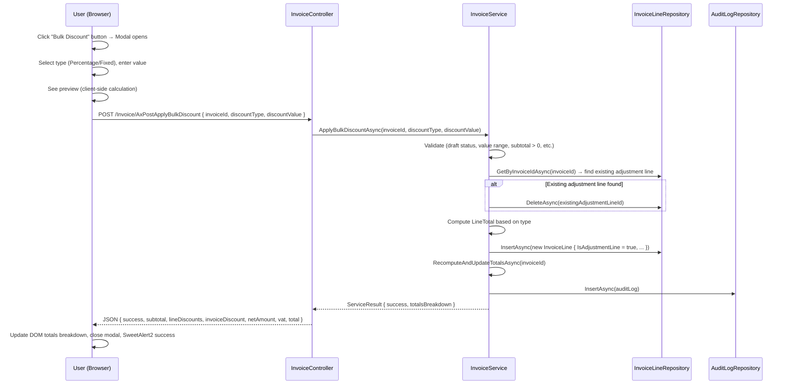
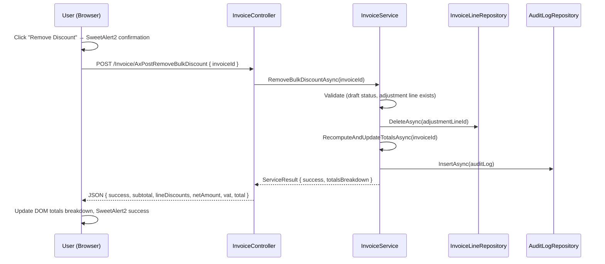

# Design Document: Invoice Bulk Discount

## Overview

This design introduces an invoice-level bulk discount feature to the existing invoicing module. The core mechanism is an **Adjustment Line** — a special `InvoiceLine` flagged with `IsAdjustmentLine = true` that carries a negative `LineTotal` representing the invoice-level discount. This approach reuses the existing line item infrastructure (storage, recomputation, PDF rendering) while clearly separating adjustment lines from user-editable line items.

### Design Decisions

| Decision | Rationale |
|----------|-----------|
| Reuse `InvoiceLine` table with a flag column | Avoids a separate table, leverages existing repository/service patterns, and the adjustment line participates naturally in `RecomputeAndUpdateTotalsAsync`. |
| Single `IsAdjustmentLine` BIT column | Simple, extensible. All existing rows default to `0` with no data migration needed. |
| VatRate = 0 on adjustment lines | The discount is pre-tax; VAT is computed only on normal lines. This keeps VAT compliance straightforward. |
| Replace-not-stack semantics | Only one adjustment line per invoice simplifies UX and computation. Replacement is atomic (delete old → insert new). |
| Dedicated service methods + controller endpoints | Keeps bulk discount logic isolated from standard line CRUD, preventing accidental modification of adjustment lines through the normal flow. |
| Preview calculation in the modal (client-side) | Instant feedback without a server round-trip. The authoritative calculation happens server-side on confirm. |
| Totals breakdown in both Edit UI and PDF | Users and customers see the same financial transparency. |
| Auto-recalculate percentage discounts on line changes | When a normal line is added/removed/updated and a percentage adjustment line exists, `RecomputeAndUpdateTotalsAsync` recalculates the adjustment `LineTotal` based on the new subtotal. Fixed-amount adjustments remain unchanged. This ensures "15% off" stays at 15% regardless of line edits. |
| Currency-aware description formatting | Adjustment line descriptions use the invoice's `CurrencyCode` to resolve the correct symbol (e.g. €, £, $) rather than hardcoding €. |
| Explicit `IDbContextTransaction` for atomicity | Since the repository uses `ExecuteSqlRawAsync` (not EF change tracking), atomic operations require an explicit database transaction via `_context.Database.BeginTransactionAsync()`. |
| Gross Subtotal in DTO, Net Subtotal on Invoice entity | The `InvoiceTotalsBreakdown` DTO exposes `GrossSubtotal` (sum of Qty × UnitPrice) for display, while `Invoice.Subtotal` on the entity remains the sum of normal `LineTotal` values (after per-line discounts), matching existing behavior. |
| Tax rounded at aggregate level | Maintains the existing rounding behavior: `Math.Round(lines.Sum(l => l.LineTotal * l.VatRate / 100m), 2)` — rounded once at the sum level, not per-line. This matches current production behavior and avoids penny discrepancies. |
| Invoice duplication copies adjustment lines | When an invoice is duplicated, the adjustment line is included but its `LineTotal` is recalculated based on the new invoice's subtotal (for percentage type). Fixed-amount adjustments are copied as-is. |

---

## Architecture

### High-Level Flow — Apply Bulk Discount



### High-Level Flow — Remove Bulk Discount



---

## Components and Interfaces

### 1. Database Layer

**Migration Script** (`Portal.Database/Migrations/XXX_AddIsAdjustmentLineToInvoiceAndQuotationLine.sql`):

```sql
USE [PortalDb]
GO

-- Add to InvoiceLine
ALTER TABLE [invoice].[InvoiceLine]
ADD [IsAdjustmentLine] BIT NOT NULL CONSTRAINT [DF_InvoiceLine_IsAdjustmentLine] DEFAULT (0);
GO

-- Add to QuotationLine
ALTER TABLE [quotation].[QuotationLine]
ADD [IsAdjustmentLine] BIT NOT NULL CONSTRAINT [DF_QuotationLine_IsAdjustmentLine] DEFAULT (0);
GO
```

### 2. Entity Layer

**InvoiceLine.cs** — Add property:

```csharp
public bool IsAdjustmentLine { get; set; }
```

### 3. Repository Layer

**InvoiceLineRepository** — Update all SELECT queries to include `[IsAdjustmentLine]` in the column list. Add a helper method:

```csharp
public async Task<InvoiceLine?> GetAdjustmentLineByInvoiceIdAsync(int invoiceId)
{
    try
    {
        const string query = @"
            SELECT [Id], [InvoiceId], [Description], [Quantity], [UnitPrice], [VatRate],
                   [Discount], [DiscountType], [CostPrice], [LineTotal], [SortOrder],
                   [ReferenceUrl], [Subtitle], [InvoiceSectionId], [ProductCode],
                   [IsReverseCharge], [ProductTypeId], [ProductPriceTierId], [PriceTierName],
                   [IsAdjustmentLine]
            FROM [invoice].[InvoiceLine]
            WHERE [InvoiceId] = @InvoiceId AND [IsAdjustmentLine] = 1";

        return await ExecuteSingleRecordStoredProcedure(query, new SqlParameter("@InvoiceId", invoiceId));
    }
    catch (Exception ex)
    {
        throw;
    }
}
```

### 4. Service Layer

**IInvoiceService** — New interface methods:

```csharp
Task<BulkDiscountResult> ApplyBulkDiscountAsync(int invoiceId, string discountType, decimal discountValue);
Task<BulkDiscountResult> RemoveBulkDiscountAsync(int invoiceId);
Task<InvoiceTotalsBreakdown> GetTotalsBreakdownAsync(int invoiceId);
```

**InvoiceService** — New methods:

```csharp
public async Task<BulkDiscountResult> ApplyBulkDiscountAsync(int invoiceId, string discountType, decimal discountValue)
{
    // 1. Validate draft status
    // 2. Validate discountType is "Percentage" or "Fixed"
    // 3. Get all normal lines, compute subtotal and lineDiscounts
    // 4. Validate value range based on type
    // 5. Compute LineTotal
    // 6. Delete existing adjustment line if present (capture old values for audit)
    // 7. Insert new adjustment line
    // 8. RecomputeAndUpdateTotalsAsync
    // 9. Write audit log (create or replace)
    // 10. Return totals breakdown
}

public async Task<BulkDiscountResult> RemoveBulkDiscountAsync(int invoiceId)
{
    // 1. Validate draft status
    // 2. Find existing adjustment line (throw if not found)
    // 3. Capture values for audit
    // 4. Delete adjustment line
    // 5. RecomputeAndUpdateTotalsAsync
    // 6. Write audit log
    // 7. Return totals breakdown
}
```

**RecomputeAndUpdateTotalsAsync** — Updated logic (includes auto-recalculation of percentage adjustments):

```csharp
private async Task RecomputeAndUpdateTotalsAsync(int invoiceId)
{
    var businessId = _currentTenantService.CurrentBusinessId;

    using var transaction = await _context.Database.BeginTransactionAsync();
    try
    {
        var lines = await _invoiceLineRepository.GetByInvoiceIdAsync(invoiceId);

        var normalLines = lines.Where(l => !l.IsAdjustmentLine).ToList();
        var adjustmentLine = lines.FirstOrDefault(l => l.IsAdjustmentLine);

        // Subtotal = sum of normal line totals only (after per-line discounts)
        var subtotal = normalLines.Sum(l => l.LineTotal);

        // Auto-recalculate percentage adjustment lines when subtotal changes
        if (adjustmentLine != null && adjustmentLine.DiscountType == "Percentage")
        {
            var expectedLineTotal = -Math.Round(subtotal * adjustmentLine.Discount / 100m, 2, MidpointRounding.AwayFromZero);
            if (adjustmentLine.LineTotal != expectedLineTotal)
            {
                adjustmentLine.LineTotal = expectedLineTotal;
                // Update description to reflect current subtotal context
                adjustmentLine.Description = $"Invoice Discount ({adjustmentLine.Discount}%)";
                await _invoiceLineRepository.UpdateAsync(adjustmentLine);
            }
        }

        // Tax = sum of per-line tax (only normal lines contribute tax)
        // Rounded at aggregate level to match existing production behavior
        var taxAmount = Math.Round(normalLines.Sum(l => l.LineTotal * l.VatRate / 100m), 2);

        // TotalAmount = sum of ALL line totals (including adjustment) + tax
        var adjustmentAmount = adjustmentLine?.LineTotal ?? 0m;
        var totalAmount = subtotal + adjustmentAmount + taxAmount;

        var invoice = await _invoiceRepository.GetByIdAndBusinessIdAsync(invoiceId, businessId);
        if (invoice != null)
        {
            invoice.Subtotal = subtotal;
            invoice.TaxAmount = taxAmount;
            invoice.TotalAmount = totalAmount;
            invoice.UpdatedAtUtc = DateTime.UtcNow;
            await _invoiceRepository.UpdateAsync(invoice);
        }

        await transaction.CommitAsync();
    }
    catch
    {
        await transaction.RollbackAsync();
        throw;
    }
}
```

**Key behavior**: When a normal line is added, removed, or updated, the existing `AddLineAsync`, `UpdateLineAsync`, and `RemoveLineAsync` methods already call `RecomputeAndUpdateTotalsAsync`. The updated method now detects percentage adjustment lines and recalculates their `LineTotal` based on the new subtotal. Fixed-amount adjustment lines are left unchanged.

**Transaction nesting safety**: `RecomputeAndUpdateTotalsAsync` is called from multiple contexts — some already within a transaction (e.g. `ApplyBulkDiscountAsync`), some not (e.g. `AddLineAsync`). To avoid nested transaction exceptions, the method checks `_context.Database.CurrentTransaction != null` before creating a new transaction. If a transaction is already active, it participates in the existing one:

```csharp
var ownsTransaction = _context.Database.CurrentTransaction == null;
IDbContextTransaction? transaction = ownsTransaction
    ? await _context.Database.BeginTransactionAsync()
    : null;
try
{
    // ... logic ...
    if (ownsTransaction) await transaction!.CommitAsync();
}
catch
{
    if (ownsTransaction) await transaction!.RollbackAsync();
    throw;
}
```

### 5. Controller Layer

**InvoiceController** — New endpoints:

```csharp
[HttpPost]
[ValidateAntiForgeryToken]
public async Task<IActionResult> AxPostApplyBulkDiscount(int invoiceId, string discountType, decimal discountValue)
{
    try
    {
        var result = await _invoiceService.ApplyBulkDiscountAsync(invoiceId, discountType, discountValue);
        return Json(new { success = true, data = result });
    }
    catch (ArgumentException ex)
    {
        return Json(new { success = false, message = ex.Message });
    }
    catch (InvalidOperationException ex)
    {
        return Json(new { success = false, message = ex.Message });
    }
    catch (Exception ex)
    {
        return Json(new { success = false, message = "An unexpected error occurred." });
    }
}

[HttpPost]
[ValidateAntiForgeryToken]
public async Task<IActionResult> AxPostRemoveBulkDiscount(int invoiceId)
{
    try
    {
        var result = await _invoiceService.RemoveBulkDiscountAsync(invoiceId);
        return Json(new { success = true, data = result });
    }
    catch (InvalidOperationException ex)
    {
        return Json(new { success = false, message = ex.Message });
    }
    catch (Exception ex)
    {
        return Json(new { success = false, message = "An unexpected error occurred." });
    }
}
```

### 6. Standard Line Item Guards

**InvoiceService.UpdateLineAsync** and **RemoveLineAsync** — Add guard at the top:

```csharp
if (line.IsAdjustmentLine)
    throw new InvalidOperationException("Adjustment lines cannot be modified through the line item editing flow. Use the Bulk Discount feature instead.");
```

### 7. UI Components

**Bulk Discount Modal** — Added to the Invoice Edit view. Contains:
- Toggle: Percentage / Fixed Amount (default: Percentage)
- Numeric input with validation
- Live preview showing calculated discount amount
- Confirm and Cancel buttons

**Totals Breakdown** — Replaces the simple subtotal/tax/total display with:
- Gross Subtotal (sum of Qty × UnitPrice for all normal lines — before per-line discounts)
- Line Discounts (GrossSubtotal − NetSubtotal) — conditionally shown when > 0
- Net Subtotal (sum of LineTotals for normal lines — after per-line discounts)
- Invoice Discount (adjustment line amount) — conditionally shown
- Net Amount (Net Subtotal − Invoice Discount)
- VAT
- Total (Net Amount + VAT)

**Adjustment Line Rendering** — In the line items list, the adjustment line renders as a non-editable row with a muted style, label "System-managed discount", and negative amount. No edit/delete icons — only the "Remove Discount" button in the totals area.

### 8. PDF Snapshot Changes

**Snapshot.cshtml** — Updates:
1. Filter adjustment lines out of section line item tables (they render in totals only)
2. Replace the simple `totals-card` with the full breakdown (Gross Subtotal, Line Discounts, Invoice Discount, Net Amount, VAT, Total)
3. Conditionally show/hide Line Discounts and Invoice Discount rows
4. Format the adjustment line description using the invoice's currency symbol: "Invoice Discount (X%)" or "Invoice Discount (−{symbol}X.XX)"

**InvoiceRenderer** — No changes needed; it already passes all lines to the model. The Snapshot view handles filtering.

---

## Data Models

### BulkDiscountResult DTO

```csharp
public class BulkDiscountResult
{
    public bool Success { get; set; }
    public string? Message { get; set; }
    public InvoiceTotalsBreakdown? Totals { get; set; }
}
```

### InvoiceTotalsBreakdown DTO

```csharp
public class InvoiceTotalsBreakdown
{
    /// <summary>Sum of (Quantity × UnitPrice) for all normal lines (before per-line discounts).</summary>
    public decimal GrossSubtotal { get; set; }

    /// <summary>Sum of LineTotal for all normal lines (after per-line discounts). This matches Invoice.Subtotal.</summary>
    public decimal NetSubtotal { get; set; }

    /// <summary>Aggregate per-line discounts: GrossSubtotal - NetSubtotal.</summary>
    public decimal LineDiscounts { get; set; }

    /// <summary>Invoice-level discount (positive value, e.g. 50.00 means 50 off in currency).</summary>
    public decimal InvoiceDiscount { get; set; }

    /// <summary>NetSubtotal - InvoiceDiscount.</summary>
    public decimal NetAmount { get; set; }

    /// <summary>VAT computed on normal lines after their per-line discounts (aggregate-rounded).</summary>
    public decimal Vat { get; set; }

    /// <summary>NetAmount + Vat. Final amount payable.</summary>
    public decimal Total { get; set; }

    /// <summary>Discount type if adjustment line exists: "Percentage" or "Fixed".</summary>
    public string? DiscountType { get; set; }

    /// <summary>The raw discount value entered by the user.</summary>
    public decimal? DiscountValue { get; set; }

    /// <summary>Whether an adjustment line currently exists.</summary>
    public bool HasInvoiceDiscount { get; set; }

    /// <summary>Whether any per-line discounts exist.</summary>
    public bool HasLineDiscounts { get; set; }

    /// <summary>The invoice's currency code (e.g. "EUR", "GBP", "USD").</summary>
    public string CurrencyCode { get; set; } = "EUR";
}
```

**Computation logic for `GetTotalsBreakdownAsync`:**
```csharp
var normalLines = lines.Where(l => !l.IsAdjustmentLine).ToList();
var adjustmentLine = lines.FirstOrDefault(l => l.IsAdjustmentLine);

var grossSubtotal = normalLines.Sum(l => l.Quantity * l.UnitPrice);
var netSubtotal = normalLines.Sum(l => l.LineTotal); // after per-line discounts
var lineDiscounts = grossSubtotal - netSubtotal;
var invoiceDiscount = adjustmentLine != null ? Math.Abs(adjustmentLine.LineTotal) : 0m;
var netAmount = netSubtotal - invoiceDiscount;
var vat = Math.Round(normalLines.Sum(l => l.LineTotal * l.VatRate / 100m), 2);
var total = netAmount + vat;
```

### Adjustment Line Field Values

| Field | Percentage Discount | Fixed Discount |
|-------|-------------------|----------------|
| IsAdjustmentLine | `true` | `true` |
| Description | `"Invoice Discount ({value}%)"` | `"Invoice Discount (-{currencySymbol}{value})"` |
| Quantity | `1` | `1` |
| UnitPrice | `0` | `0` |
| VatRate | `0` | `0` |
| Discount | User-entered percentage | User-entered fixed amount |
| DiscountType | `"Percentage"` | `"Fixed"` |
| LineTotal | `-(Subtotal × percentage / 100)` | `-(fixed amount)` |
| SortOrder | `MAX(existing) + 1` | `MAX(existing) + 1` |
| InvoiceSectionId | `null` | `null` |
| CostPrice | `null` | `null` |
| IsReverseCharge | `false` | `false` |

**Currency symbol resolution**: The service resolves the currency symbol from the invoice's `CurrencyCode` field (e.g. "EUR" → "€", "GBP" → "£", "USD" → "$") when formatting the fixed-amount description. A helper method `GetCurrencySymbol(string currencyCode)` provides this mapping.

---

## Correctness Properties

*A property is a characteristic or behavior that should hold true across all valid executions of a system — essentially, a formal statement about what the system should do. Properties serve as the bridge between human-readable specifications and machine-verifiable correctness guarantees.*

### Property 1: Adjustment Line Field Invariants

*For any* valid discount operation (percentage or fixed), the resulting adjustment line SHALL have `IsAdjustmentLine = true`, `VatRate = 0`, `Quantity = 1`, `DiscountType` matching the requested type, and `Discount` equal to the user-entered value.

**Validates: Requirements 1.2, 1.3, 2.2, 2.3**

### Property 2: LineTotal Computation Correctness

*For any* valid percentage discount value `p` (0.01 ≤ p ≤ 100) applied to an invoice with subtotal `S > 0`, the adjustment line's `LineTotal` SHALL equal `-Round(S × p / 100, 2, MidpointRounding.AwayFromZero)`. *For any* valid fixed discount value `f` (0.01 ≤ f ≤ NetAmount), the adjustment line's `LineTotal` SHALL equal `-f`.

**Validates: Requirements 1.1, 2.1**

### Property 3: Invalid Discount Values Are Rejected

*For any* percentage value outside [0.01, 100] or *for any* fixed amount less than 0.01, with more than 2 decimal places, or exceeding 999,999,999.99, the service SHALL reject the operation and the invoice state SHALL remain unchanged.

**Validates: Requirements 1.5, 2.5**

### Property 4: Fixed Amount Cannot Exceed Net Amount

*For any* invoice with a pre-adjustment net amount `N`, and *for any* fixed discount value `f > N`, the service SHALL reject the operation and the invoice state SHALL remain unchanged.

**Validates: Requirements 2.4**

### Property 5: Non-Draft Invoice Rejection

*For any* invoice with `InvoiceStatusTypeId ≠ 1`, any bulk discount apply or remove operation SHALL be rejected with an error, and the invoice state SHALL remain unchanged.

**Validates: Requirements 3.3, 3.4**

### Property 6: Single Adjustment Line Invariant

*For any* sequence of bulk discount operations (apply, replace, remove) on an invoice, the number of adjustment lines on that invoice SHALL be at most 1 at any point in time.

**Validates: Requirements 4.1, 4.2, 4.3**

### Property 7: Invoice Totals Computation

*For any* set of invoice lines where some are normal and at most one is an adjustment line:
- `Subtotal` SHALL equal the sum of `LineTotal` for all normal lines
- `TaxAmount` SHALL equal the sum of `Round(line.LineTotal × line.VatRate / 100, 2)` for each normal line
- `TotalAmount` SHALL equal the sum of ALL `LineTotal` values (including adjustment) plus `TaxAmount`

**Validates: Requirements 5.2, 5.3, 5.4**

### Property 8: Adjustment Line Description Formatting

*For any* percentage discount with value `p`, the adjustment line description SHALL match the format `"Invoice Discount ({p}%)"`. *For any* fixed discount with value `f` on an invoice with currency code `C`, the description SHALL match `"Invoice Discount (-{symbol}{f formatted to 2dp})"` where `{symbol}` is the currency symbol resolved from `C`.

**Validates: Requirements 9.3**

### Property 9: Standard Endpoints Reject Adjustment Line Operations

*For any* invoice line where `IsAdjustmentLine = true`, an update or delete request through the standard line item endpoints (UpdateLineAsync, RemoveLineAsync) SHALL be rejected with an error.

**Validates: Requirements 12.4**

### Property 10: Percentage Adjustment Auto-Recalculation

*For any* invoice or quotation with a percentage adjustment line (DiscountType = "Percentage", Discount = p), after any normal line is added, removed, or updated, the adjustment line's `LineTotal` SHALL equal `-Round(newSubtotal × p / 100, 2, MidpointRounding.AwayFromZero)` where `newSubtotal` is the updated sum of normal line totals.

**Validates: Requirements 5.1, 13.4**

### Property 11: Fixed Adjustment Immutability on Line Changes

*For any* invoice or quotation with a fixed-amount adjustment line (DiscountType = "Fixed", LineTotal = -f), after any normal line is added, removed, or updated, the adjustment line's `LineTotal` SHALL remain `-f` (unchanged).

**Validates: Requirements 5.1, 13.4**

---

## Error Handling

| Scenario | Service Behavior | Controller Response |
|----------|-----------------|---------------------|
| Invoice not found | `InvalidOperationException` | `{ success: false, message: "Invoice not found" }` |
| Invoice not in Draft status | `InvalidOperationException` | `{ success: false, message: "Invoice can only be edited in Draft status" }` |
| Invalid percentage (out of range) | `ArgumentException` | `{ success: false, message: "Percentage must be between 0.01 and 100 inclusive..." }` |
| Invalid fixed amount (out of range / precision) | `ArgumentException` | `{ success: false, message: "Fixed amount must be between 0.01 and 999,999,999.99..." }` |
| Fixed amount exceeds net | `ArgumentException` | `{ success: false, message: "Discount cannot exceed the available net amount (€X.XX)" }` |
| Zero subtotal for percentage | `ArgumentException` | `{ success: false, message: "Cannot apply percentage discount to an invoice with zero subtotal" }` |
| No adjustment line to remove | `InvalidOperationException` | `{ success: false, message: "No bulk discount exists on this invoice" }` |
| Audit log persistence failure | Transaction rollback, rethrow | `{ success: false, message: "An unexpected error occurred." }` |
| Standard endpoint targets adjustment line | `InvalidOperationException` | `{ success: false, message: "Adjustment lines cannot be modified through the line item editing flow..." }` |

### Transaction Strategy

The `ApplyBulkDiscountAsync` method wraps the delete-old + insert-new + recompute + audit-log sequence in an explicit database transaction using `_context.Database.BeginTransactionAsync()`. This is required because the repository uses `ExecuteSqlRawAsync` (not EF change tracking), so operations are not automatically batched. If any step fails (including audit log persistence), the entire transaction rolls back via `transaction.RollbackAsync()`. This ensures:
- The single-adjustment-line invariant is never violated
- Audit coverage is guaranteed
- No partial state persists on failure

```csharp
using var transaction = await _context.Database.BeginTransactionAsync();
try
{
    // ... delete old, insert new, recompute, audit ...
    await transaction.CommitAsync();
}
catch
{
    await transaction.RollbackAsync();
    throw;
}
```

### Invoice Duplication Handling

When an invoice is duplicated (existing `DuplicateInvoiceAsync` method), the adjustment line must be handled:

1. **Copy the adjustment line** to the new invoice with `IsAdjustmentLine = true`
2. **For percentage adjustments**: Recalculate `LineTotal` based on the new invoice's subtotal (which should be identical since all normal lines are copied too). The description remains the same.
3. **For fixed-amount adjustments**: Copy `LineTotal` as-is since the user intentionally chose a specific amount.
4. **After duplication**: Call `RecomputeAndUpdateTotalsAsync` on the new invoice, which will auto-correct the percentage adjustment if any lines differ.

The existing duplication code iterates all `InvoiceLines` for the source invoice — the new `IsAdjustmentLine` property is simply copied along with all other fields. No special-case logic needed beyond the standard `RecomputeAndUpdateTotalsAsync` call at the end.

### Quotation-to-Invoice Conversion

When a quotation is converted to an invoice, the conversion code creates new `InvoiceLine` records from `QuotationLine` records. The adjustment line is handled as follows:

1. **Explicitly copy `IsAdjustmentLine`**: The conversion mapping must include `IsAdjustmentLine = line.IsAdjustmentLine` in the `new InvoiceLine { ... }` block. This field is NOT automatically inherited — it must be explicitly added to the field mapping alongside `Discount`, `DiscountType`, etc.
2. **Replace inline totals computation with `RecomputeAndUpdateTotalsAsync`**: The current conversion code computes totals inline (`invoiceLines.Sum(l => l.LineTotal)` etc.). After this feature, it must call `RecomputeAndUpdateTotalsAsync(invoiceId)` instead, which correctly excludes adjustment lines from subtotal/tax and auto-recalculates percentage adjustments.
3. **For percentage adjustments**: The `LineTotal` is recalculated automatically by `RecomputeAndUpdateTotalsAsync` based on the new invoice's subtotal.
4. **For fixed-amount adjustments**: The `LineTotal` is copied as-is. If reverse charge adjustments change line totals during conversion, the fixed discount is preserved unchanged — it will not exceed the net amount because the quotation already validated this constraint. However, if the converted invoice's net amount ends up lower than the fixed discount (edge case with RC VAT zeroing), `RecomputeAndUpdateTotalsAsync` will NOT auto-remove it. The UI should display a warning if `TotalAmount < 0` after conversion.
5. **After conversion**: `RecomputeAndUpdateTotalsAsync` handles everything — no inline totals computation needed.

### Quotation Bulk Discount (QuotationService)

The quotation module receives the same bulk discount capability as invoices:

**QuotationService** — New methods (mirrors InvoiceService):

```csharp
Task<BulkDiscountResult> ApplyBulkDiscountAsync(int quotationId, string discountType, decimal discountValue);
Task<BulkDiscountResult> RemoveBulkDiscountAsync(int quotationId);
Task<QuotationTotalsBreakdown> GetTotalsBreakdownAsync(int quotationId);
```

**QuotationController** — New endpoints:

```csharp
[HttpPost] AxPostApplyBulkDiscount(int quotationId, string discountType, decimal discountValue)
[HttpPost] AxPostRemoveBulkDiscount(int quotationId)
```

**QuotationLine.cs** — Add property:
```csharp
public bool IsAdjustmentLine { get; set; }
```

**RecomputeQuotationTotalsAsync** — Updated with the same logic as `RecomputeAndUpdateTotalsAsync` for invoices: excludes adjustment lines from subtotal/tax, auto-recalculates percentage adjustments when normal lines change.

**Quotation Edit UI** — Same "Bulk Discount" button, same modal, same totals breakdown display.

**Quotation PDF (Proposal/Snapshot.cshtml)** — The existing quotation PDF already shows a "Discount" row in grand totals. The update:
- Filters adjustment lines from section line item tables
- Shows the adjustment line amount in the grand totals as "Quotation Discount (X%)" or "Quotation Discount (-{symbol}X.XX)"
- Conditionally shows Line Discounts and Document Discount as separate rows
- Note: Description format is context-aware — quotation adjustment lines use "Quotation Discount (...)" while invoice adjustment lines use "Invoice Discount (...)"

### Database Migration (Combined)

```sql
USE [PortalDb]
GO

-- Add to InvoiceLine
ALTER TABLE [invoice].[InvoiceLine]
ADD [IsAdjustmentLine] BIT NOT NULL CONSTRAINT [DF_InvoiceLine_IsAdjustmentLine] DEFAULT (0);
GO

-- Add to QuotationLine
ALTER TABLE [quotation].[QuotationLine]
ADD [IsAdjustmentLine] BIT NOT NULL CONSTRAINT [DF_QuotationLine_IsAdjustmentLine] DEFAULT (0);
GO
```

---

## Testing Strategy

### Property-Based Tests (FsCheck + xUnit)

The project already uses FsCheck (visible in `build_check/FsCheck.dll` and `Portal.Tests/PropertyBased/`). Property tests will use FsCheck with minimum 100 iterations per property.

Each property test references its design property:

```csharp
// Feature: invoice-bulk-discount, Property 2: LineTotal Computation Correctness
[Property(MaxTest = 100)]
public Property PercentageDiscount_LineTotal_IsCorrect() { ... }
```

**Properties to implement:**
1. Adjustment line field invariants (Property 1)
2. LineTotal computation for percentage and fixed (Property 2)
3. Invalid value rejection (Property 3)
4. Fixed amount cap at net amount (Property 4)
5. Non-draft rejection (Property 5)
6. Single adjustment line invariant (Property 6)
7. Invoice totals computation (Property 7)
8. Description formatting with currency (Property 8)
9. Standard endpoint guard (Property 9)
10. Percentage adjustment auto-recalculation on line changes (Property 10)
11. Fixed adjustment immutability on line changes (Property 11)

### Unit Tests (xUnit)

- **Edge cases**: Zero subtotal percentage rejection, exactly-at-boundary values (0.01, 100, NetAmount)
- **Audit logging**: Verify correct audit log content for create/replace/remove
- **Transaction rollback**: Mock audit failure, verify no adjustment line persists
- **Integration**: Full apply → recompute → verify totals flow with real-ish data

### Manual Testing

- UI flow: Open modal, toggle types, verify preview, confirm, verify DOM update
- PDF rendering: Generate PDF with discount, verify breakdown display
- Status guard: Non-draft invoice should not show button
