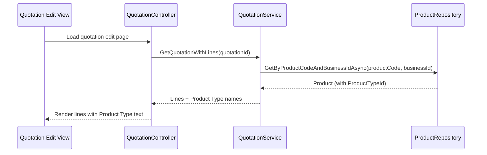
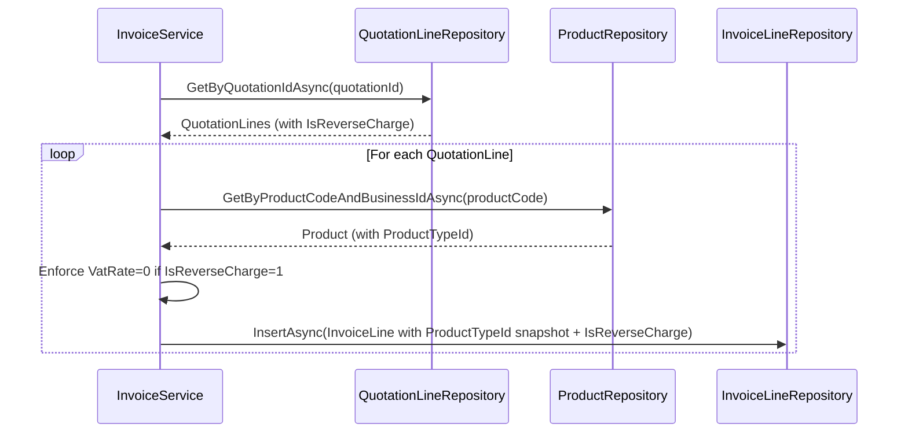
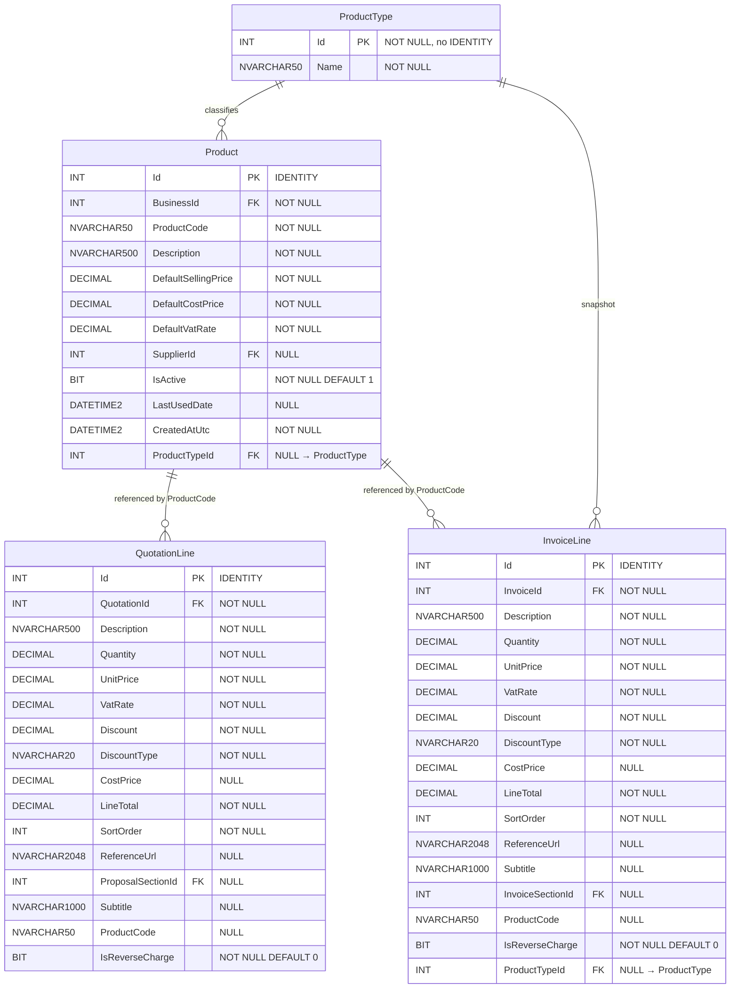

# Design Document: Invoice Line Product Type & Reverse Charge

## Overview

This feature introduces two classification properties to the sales pipeline:

1. **Product Type** — A system-wide lookup (Services/Goods) stored on the Product master record, displayed read-only on quotation lines (derived at read-time from the linked product) and persisted as an immutable snapshot on invoice lines during quotation-to-invoice conversion.

2. **Reverse Charge** — A boolean flag on quotation and invoice lines indicating the reverse charge VAT mechanism applies, forcing VatRate to 0% and enforcing this invariant at the service layer regardless of entry point.

The design follows established patterns in the codebase: the lookup table mirrors `[purchase].[ExpenseType]` (migration 067), the FK column on Product mirrors `ExpenseTypeId` on `ExpenseCategory`, and the boolean flag follows the `IsReverseCharge` naming convention per the BIT column standard.

### Key Design Decisions

| Decision | Rationale |
|----------|-----------|
| ProductType on Product (not on line) | Single source of truth; quotation lines derive at read-time, invoice lines snapshot at conversion |
| ProductTypeId nullable on Product | Backward compatibility with legacy products created before this feature |
| ProductTypeId stored on InvoiceLine | Immutable snapshot — invoice lines must not change after conversion |
| ProductTypeId NOT stored on QuotationLine | Derived from product at read-time; avoids stale data |
| IsReverseCharge on both line tables | Each line independently tracks its reverse charge status |
| Service-layer validation for RC invariant | Ensures constraint regardless of entry point (UI, conversion, API) |
| VatRate restoration uses product DefaultVatRate | Consistent with how VatRate is populated from product autocomplete |

## Architecture

```mermaid
graph TD
    subgraph "Database Layer"
        PT[product.ProductType<br/>Lookup: Services=1, Goods=2]
        P[product.Product<br/>+ ProductTypeId INT NULL FK]
        QL[quotation.QuotationLine<br/>+ IsReverseCharge BIT NOT NULL DEFAULT 0]
        IL[invoice.InvoiceLine<br/>+ IsReverseCharge BIT NOT NULL DEFAULT 0<br/>+ ProductTypeId INT NULL]
        PT -->|FK| P
        PT -->|FK| IL
    end

    subgraph "Service Layer"
        QS[QuotationService<br/>+ AddLineAsync (with IsReverseCharge)<br/>+ UpdateLineAsync (with IsReverseCharge)]
        IS[InvoiceService<br/>+ ConvertFromQuotationAsync<br/>+ AddLineAsync / UpdateLineAsync]
        PS[ProductService<br/>+ CreateAsync (requires ProductTypeId)<br/>+ UpdateAsync]
        VL[Validation: RC Invariant<br/>IsReverseCharge=1 → VatRate=0]
    end

    subgraph "Controller / UI Layer"
        QC[QuotationController<br/>AddLine / UpdateLine]
        IC[InvoiceController<br/>AddLine / UpdateLine]
        PC[ProductController<br/>Create / Edit]
        QV[Quotation Edit View<br/>RC checkbox + Product Type display]
        IV[Invoice Detail View<br/>RC label + Product Type display]
    end

    QC --> QS
    IC --> IS
    PC --> PS
    QS --> VL
    IS --> VL
    QS --> QL
    IS --> IL
    PS --> P
```

### Data Flow: Quotation Line Product Type (Read-Time Derivation)



### Data Flow: Quotation-to-Invoice Conversion (Snapshot)



## Components and Interfaces

### Database Migration: 071_CreateProductTypeTable.sql

Creates the `[product].[ProductType]` lookup table, seeds Services/Goods, adds nullable `ProductTypeId` FK to `[product].[Product]`.

```sql
-- Step 1: Create [product].[ProductType] lookup table
CREATE TABLE [product].[ProductType]
(
    [Id]    INT            NOT NULL,
    [Name]  NVARCHAR(50)   NOT NULL,
    CONSTRAINT [PK_ProductType] PRIMARY KEY CLUSTERED ([Id])
);

-- Step 2: Seed data (idempotent)
INSERT INTO [product].[ProductType] ([Id], [Name]) VALUES (1, 'Services');
INSERT INTO [product].[ProductType] ([Id], [Name]) VALUES (2, 'Goods');

-- Step 3: Add ProductTypeId to [product].[Product]
ALTER TABLE [product].[Product]
    ADD [ProductTypeId] INT NULL;

-- Step 4: FK constraint
ALTER TABLE [product].[Product]
    ADD CONSTRAINT [FK_Product_ProductType]
        FOREIGN KEY ([ProductTypeId])
        REFERENCES [product].[ProductType] ([Id]);
```

### Database Migration: 072_AddIsReverseChargeToLines.sql

Adds `IsReverseCharge` (BIT NOT NULL DEFAULT 0) to both `[quotation].[QuotationLine]` and `[invoice].[InvoiceLine]`. Adds `ProductTypeId` (INT NULL FK) to `[invoice].[InvoiceLine]`.

```sql
-- Step 1: Add IsReverseCharge to QuotationLine
ALTER TABLE [quotation].[QuotationLine]
    ADD [IsReverseCharge] BIT NOT NULL
        CONSTRAINT [DF_QuotationLine_IsReverseCharge] DEFAULT (0);

-- Step 2: Add IsReverseCharge to InvoiceLine
ALTER TABLE [invoice].[InvoiceLine]
    ADD [IsReverseCharge] BIT NOT NULL
        CONSTRAINT [DF_InvoiceLine_IsReverseCharge] DEFAULT (0);

-- Step 3: Add ProductTypeId to InvoiceLine (snapshot)
ALTER TABLE [invoice].[InvoiceLine]
    ADD [ProductTypeId] INT NULL;

-- Step 4: FK constraint on InvoiceLine.ProductTypeId
ALTER TABLE [invoice].[InvoiceLine]
    ADD CONSTRAINT [FK_InvoiceLine_ProductType]
        FOREIGN KEY ([ProductTypeId])
        REFERENCES [product].[ProductType] ([Id]);
```

### Entity Changes

#### ProductType.cs (New Entity)

```csharp
namespace Portal.Infrastructure.Entities;

/// <summary>
/// Lookup table classifying the type of a Product.
/// Schema: [product].ProductType
/// Values: Services (1), Goods (2)
/// </summary>
public class ProductType
{
    public int Id { get; set; }
    public string Name { get; set; } = null!;
}
```

#### Product.cs (Modified)

```csharp
// Add to existing Product entity:
public int? ProductTypeId { get; set; }

// Navigation property:
public ProductType? ProductType { get; set; }
```

#### QuotationLine.cs (Modified)

```csharp
// Add to existing QuotationLine entity:
public bool IsReverseCharge { get; set; }
```

#### InvoiceLine.cs (Modified)

```csharp
// Add to existing InvoiceLine entity:
public bool IsReverseCharge { get; set; }
public int? ProductTypeId { get; set; }

// Navigation property:
public ProductType? ProductType { get; set; }
```

### Repository Changes

#### ProductRepository.cs (Modified)

All SELECT queries add `[ProductTypeId]` to the column list. INSERT adds `@ProductTypeId` parameter. UPDATE adds `[ProductTypeId] = @ProductTypeId`.

```csharp
// In InsertAsync — add parameter:
command.Parameters.Add(new SqlParameter("@ProductTypeId", product.ProductTypeId ?? (object)DBNull.Value));

// In UpdateAsync — add to SET clause:
// [ProductTypeId] = @ProductTypeId
// Add parameter:
new SqlParameter("@ProductTypeId", product.ProductTypeId ?? (object)DBNull.Value)
```

#### QuotationLineRepository.cs (Modified)

All SELECT queries add `[IsReverseCharge]`. INSERT adds `[IsReverseCharge]` column and `@IsReverseCharge` parameter. UPDATE adds `[IsReverseCharge] = @IsReverseCharge`.

```csharp
// In InsertAsync — add parameter:
new SqlParameter("@IsReverseCharge", entity.IsReverseCharge)

// In UpdateAsync — add to SET clause and parameter:
new SqlParameter("@IsReverseCharge", entity.IsReverseCharge)
```

#### InvoiceLineRepository.cs (Modified)

All SELECT queries add `[IsReverseCharge]`, `[ProductTypeId]`. INSERT adds both columns and parameters. UPDATE adds both to SET clause.

```csharp
// In InsertAsync — add parameters:
command.Parameters.Add(new SqlParameter("@IsReverseCharge", entity.IsReverseCharge));
command.Parameters.Add(new SqlParameter("@ProductTypeId", entity.ProductTypeId ?? (object)DBNull.Value));

// In UpdateAsync — add to SET clause and parameters:
new SqlParameter("@IsReverseCharge", entity.IsReverseCharge),
new SqlParameter("@ProductTypeId", entity.ProductTypeId ?? (object)DBNull.Value)
```

#### ProductTypeRepository.cs (New — Read-Only)

```csharp
namespace Portal.Infrastructure.Repositories;

public class ProductTypeRepository : GenericStoredProcedureRepository<ProductType>
{
    public ProductTypeRepository(DbContext context) : base(context) { }

    public async Task<List<ProductType>> GetAllAsync()
    {
        try
        {
            const string query = @"
                SELECT [Id], [Name]
                FROM [product].[ProductType]
                ORDER BY [Id]";

            return await ExecuteStoredProcedure(query);
        }
        catch (Exception)
        {
            throw;
        }
    }

    public async Task<ProductType?> GetByIdAsync(int id)
    {
        try
        {
            const string query = @"
                SELECT [Id], [Name]
                FROM [product].[ProductType]
                WHERE [Id] = @Id";

            return await ExecuteSingleRecordStoredProcedure(query, new SqlParameter("@Id", id));
        }
        catch (Exception)
        {
            throw;
        }
    }
}
```

### Service Layer Changes

#### QuotationService.AddLineAsync (Modified Signature)

```csharp
public async Task<QuotationLine> AddLineAsync(
    int quotationId, string description, decimal quantity, decimal unitPrice,
    decimal vatRate, string? referenceUrl = null, decimal discount = 0,
    string discountType = "Percentage", string? subtitle = null,
    decimal? costPrice = null, string? productCode = null,
    bool isReverseCharge = false)
{
    // Validation: Reverse Charge Invariant
    if (isReverseCharge && vatRate > 0)
        throw new ArgumentException("Reverse charge lines require 0% VAT");

    // ... existing validation ...

    var line = new QuotationLine
    {
        // ... existing fields ...
        IsReverseCharge = isReverseCharge
    };

    await _quotationLineRepository.InsertAsync(line);
    // ... rest of method ...
}
```

#### QuotationService.UpdateLineAsync (Modified Signature)

```csharp
public async Task UpdateLineAsync(
    int lineId, string description, decimal quantity, decimal unitPrice,
    decimal vatRate, string? referenceUrl = null, decimal discount = 0,
    string discountType = "Percentage", string? subtitle = null,
    decimal? costPrice = null, bool isReverseCharge = false)
{
    // Validation: Reverse Charge Invariant
    if (isReverseCharge && vatRate > 0)
        throw new ArgumentException("Reverse charge lines require 0% VAT");

    // ... existing logic ...
    line.IsReverseCharge = isReverseCharge;
    // ... persist ...
}
```

#### InvoiceService.ConvertFromQuotationAsync (Modified Line Copy)

```csharp
// Inside the line copy loop:
foreach (var line in quotationLines)
{
    // Resolve ProductTypeId from product (snapshot)
    int? productTypeId = null;
    if (!string.IsNullOrEmpty(line.ProductCode))
    {
        var product = await _productRepository.GetByProductCodeAndBusinessIdAsync(
            line.ProductCode, businessId);
        productTypeId = product?.ProductTypeId;
    }

    // Enforce RC invariant during conversion
    var invoiceVatRate = line.IsReverseCharge ? 0m : line.VatRate;

    var invoiceLine = new InvoiceLine
    {
        InvoiceId = invoiceId,
        Description = line.Description,
        Quantity = line.Quantity,
        UnitPrice = line.UnitPrice,
        VatRate = invoiceVatRate,
        Discount = line.Discount,
        DiscountType = line.DiscountType,
        CostPrice = line.CostPrice,
        LineTotal = line.LineTotal,
        SortOrder = line.SortOrder,
        ReferenceUrl = line.ReferenceUrl,
        Subtitle = line.Subtitle,
        InvoiceSectionId = invoiceSectionId,
        ProductCode = line.ProductCode,
        IsReverseCharge = line.IsReverseCharge,
        ProductTypeId = productTypeId
    };

    await _invoiceLineRepository.InsertAsync(invoiceLine);
}
```

#### InvoiceService.AddLineAsync / UpdateLineAsync (Modified)

```csharp
// Add validation at the start of both methods:
if (isReverseCharge && vatRate > 0)
    throw new ArgumentException("Reverse charge lines require 0% VAT");
```

#### ProductService.CreateAsync (Modified Validation)

```csharp
// For new products, require ProductTypeId:
if (!productTypeId.HasValue)
    throw new ArgumentException("Product Type is required for new products");

if (productTypeId != 1 && productTypeId != 2)
    throw new ArgumentException("Product Type must be Services (1) or Goods (2)");
```

### Controller Changes

#### QuotationController.AddLine / UpdateLine

Add `isReverseCharge` parameter from form submission:

```csharp
[HttpPost]
[ValidateAntiForgeryToken]
public async Task<IActionResult> AddLine(int quotationId, QuotationLineFormViewModel model)
{
    // ... existing validation ...
    await _quotationService.AddLineAsync(
        quotationId, model.Description, model.Quantity, model.UnitPrice,
        model.VatRate, model.ReferenceUrl, model.Discount, model.DiscountType,
        model.Subtitle, costPrice: model.CostPrice, productCode: model.ProductCode,
        isReverseCharge: model.IsReverseCharge);
    // ...
}
```

#### ProductController.Create / Edit

Add `productTypeId` parameter:

```csharp
// Create action — require ProductTypeId
// Edit action — allow ProductTypeId change, allow NULL for legacy
```

### ViewModel Changes

#### QuotationLineFormViewModel.cs (Modified)

```csharp
public bool IsReverseCharge { get; set; }
```

#### QuotationLineDisplayViewModel (New or Extended)

```csharp
// Used when rendering quotation lines with derived product type:
public string? ProductTypeName { get; set; }  // Derived from product at read-time
```

### UI Changes

#### Quotation Edit View (_SectionCards.cshtml)

Each line form gains:
1. A **Reverse Charge checkbox** (`<input type="checkbox" name="IsReverseCharge">`)
2. A **Product Type read-only display** (populated via product lookup or AJAX autocomplete response)
3. JavaScript to enforce VatRate=0 when checkbox is checked and restore on uncheck

```html
<!-- Reverse Charge checkbox -->
<div class="field" style="display:flex;align-items:center;gap:6px;">
    <input type="checkbox" name="IsReverseCharge" value="true"
           onchange="toggleReverseCharge(this)" />
    <label style="margin:0;font-size:12px;">Reverse Charge</label>
</div>

<!-- Product Type display (read-only) -->
<span class="product-type-badge" style="font-size:11px;font-weight:700;
    letter-spacing:.06em;text-transform:uppercase;color:var(--muted);
    background:rgba(13,94,166,.06);padding:3px 8px;border-radius:6px;">
    @productTypeName
</span>
```

#### JavaScript: Reverse Charge Toggle

```javascript
function toggleReverseCharge(checkbox) {
    const lineCard = checkbox.closest('.line-card') || checkbox.closest('form');
    const vatInput = lineCard.querySelector('input[name="VatRate"]');

    if (checkbox.checked) {
        // Store current VatRate for restoration
        vatInput.dataset.previousVatRate = vatInput.value;
        vatInput.value = '0';
        vatInput.readOnly = true;
        vatInput.style.opacity = '0.6';
    } else {
        // Restore previous VatRate (or product default, or 0)
        const previousRate = vatInput.dataset.previousVatRate || '0';
        vatInput.value = previousRate;
        vatInput.readOnly = false;
        vatInput.style.opacity = '1';
    }
}
```

#### Invoice Detail View

Each invoice line gains:
1. A **"Reverse Charge" label** (conditionally shown when `IsReverseCharge == true`)
2. A **Product Type read-only display** (from stored `ProductTypeId` snapshot)

```html
@if (line.IsReverseCharge)
{
    <span style="font-size:10px;font-weight:700;letter-spacing:.08em;
        text-transform:uppercase;color:#C8912E;background:rgba(200,145,46,.08);
        padding:3px 8px;border-radius:6px;">Reverse Charge</span>
}
@if (line.ProductTypeName != null)
{
    <span style="font-size:10px;font-weight:700;letter-spacing:.08em;
        text-transform:uppercase;color:var(--muted);background:rgba(13,94,166,.06);
        padding:3px 8px;border-radius:6px;">@line.ProductTypeName</span>
}
```

## Data Models

### Database Schema (Final State)



### Lookup Data

| Id | Name |
|----|------|
| 1 | Services |
| 2 | Goods |

## Correctness Properties

*A property is a characteristic or behavior that should hold true across all valid executions of a system — essentially, a formal statement about what the system should do. Properties serve as the bridge between human-readable specifications and machine-verifiable correctness guarantees.*

### Property 1: Reverse charge invariant (quotation lines)

*For any* quotation line submission where `IsReverseCharge` is true and `VatRate` is greater than 0, the service layer SHALL reject the submission with a validation error, and no line shall be persisted or updated.

**Validates: Requirements 5.3, 5.6, 8.1, 8.5**

### Property 2: Reverse charge invariant (invoice lines)

*For any* invoice line submission or update where `IsReverseCharge` is true and `VatRate` is greater than 0, the service layer SHALL reject the operation with a validation error, and no line shall be persisted or updated.

**Validates: Requirements 6.4, 8.2, 8.5**

### Property 3: Conversion preserves reverse charge semantics

*For any* quotation with N lines having arbitrary `IsReverseCharge` values, after conversion to an invoice: (a) each resulting invoice line SHALL have the same `IsReverseCharge` value as its source quotation line, (b) invoice lines with `IsReverseCharge=true` SHALL have `VatRate=0` regardless of the source quotation line's VatRate, and (c) invoice lines with `IsReverseCharge=false` SHALL have the same `VatRate` as the source quotation line.

**Validates: Requirements 7.1, 7.2, 7.3**

### Property 4: New product creation requires ProductTypeId

*For any* product creation request where `ProductTypeId` is not provided (null), the service layer SHALL reject the creation with a validation error. For any creation request where `ProductTypeId` is 1 or 2, the product SHALL be created successfully (assuming all other fields are valid).

**Validates: Requirements 2.2**

### Property 5: ProductTypeId accepts only valid values

*For any* `ProductTypeId` value that is not NULL, 1, or 2, the system SHALL reject the value — either via service-layer validation or database FK constraint violation.

**Validates: Requirements 8.3**

### Property 6: Product type derivation on quotation lines

*For any* quotation line, the displayed product type is derived from the linked product's current `ProductTypeId`. If the line has no `ProductCode`, or the referenced product has `ProductTypeId = NULL`, then no product type SHALL be displayed. If the product's `ProductTypeId` is changed, subsequent retrievals of quotation lines SHALL reflect the new value without modifying any persisted invoice lines.

**Validates: Requirements 2.5, 3.2, 3.3**

### Property 7: Reverse charge VatRate restoration

*For any* quotation line where reverse charge is disabled (toggled from true to false), the VatRate SHALL be restored to the linked product's `DefaultVatRate` if a product is associated, or to 0% if no product is linked.

**Validates: Requirements 5.4, 5.7**

## Error Handling

### Validation Errors

| Scenario | Error Message | HTTP Response |
|----------|--------------|---------------|
| RC line with VatRate > 0 (add/update) | "Reverse charge lines require 0% VAT" | 400 / JSON `{success: false, message}` |
| New product without ProductTypeId | "Product Type is required for new products" | 400 / JSON `{success: false, message}` |
| Invalid ProductTypeId (not 1 or 2) | "Product Type must be Services (1) or Goods (2)" | 400 / JSON `{success: false, message}` |
| FK violation on ProductTypeId | Database exception (caught, rethrown) | 500 / JSON `{success: false, message}` |

### Transaction Safety

- **Quotation-to-invoice conversion** already uses `BeginTransactionAsync` with try/catch rollback. The additional fields (`IsReverseCharge`, `ProductTypeId`) are included in the same transaction — no additional transaction management needed.
- **Line add/update operations** validate the RC invariant *before* any persistence call, ensuring no partial writes.

### Edge Cases

| Edge Case | Handling |
|-----------|----------|
| Legacy product with NULL ProductTypeId | Allowed on update; quotation lines show no type; invoice lines store NULL |
| Quotation line with no ProductCode + RC enabled | Valid — VatRate forced to 0, no ProductTypeId to resolve |
| Product deleted/deactivated after invoice created | Invoice line retains its snapshot ProductTypeId — no impact |
| Concurrent edit: user enables RC while another saves VatRate > 0 | Service-layer validation catches the conflict on the second save |

## Testing Strategy

### Unit Tests (Example-Based)

| Test | Validates |
|------|-----------|
| Product form rejects creation without ProductTypeId | Req 2.2 |
| Product form allows edit of legacy product without ProductTypeId | Req 2.4 |
| Quotation line with no ProductCode shows no product type | Req 3.2 |
| Invoice line with ProductTypeId=1 displays "Services" | Req 4.1 |
| Invoice line with NULL ProductTypeId displays nothing | Req 4.2 |
| RC checkbox renders on quotation line form | Req 5.2 |
| RC label renders on invoice line when IsReverseCharge=1 | Req 6.2 |
| Conversion rolls back on failure | Req 7.4 |
| Migration is idempotent (re-run safe) | Req 8.4 |

### Property-Based Tests (Universal Properties)

**Library**: FsCheck (C# / .NET) — minimum 100 iterations per property.

Each property test is tagged with a comment referencing the design property:

| Property Test | Tag |
|---------------|-----|
| RC invariant rejects VatRate > 0 on quotation lines | Feature: invoice-line-product-type-reverse-charge, Property 1: Reverse charge invariant (quotation lines) |
| RC invariant rejects VatRate > 0 on invoice lines | Feature: invoice-line-product-type-reverse-charge, Property 2: Reverse charge invariant (invoice lines) |
| Conversion preserves IsReverseCharge and enforces VatRate | Feature: invoice-line-product-type-reverse-charge, Property 3: Conversion preserves reverse charge semantics |
| New product creation requires valid ProductTypeId | Feature: invoice-line-product-type-reverse-charge, Property 4: New product creation requires ProductTypeId |
| ProductTypeId only accepts NULL/1/2 | Feature: invoice-line-product-type-reverse-charge, Property 5: ProductTypeId accepts only valid values |
| Product type derivation reflects current product state | Feature: invoice-line-product-type-reverse-charge, Property 6: Product type derivation on quotation lines |
| VatRate restoration on RC disable | Feature: invoice-line-product-type-reverse-charge, Property 7: Reverse charge VatRate restoration |

### Integration Tests

| Test | Validates |
|------|-----------|
| Full quotation-to-invoice conversion with mixed RC/non-RC lines | Req 7.1-7.4 |
| Database FK constraint rejects invalid ProductTypeId | Req 8.3 |
| Migration applies cleanly to existing data | Req 8.4 |

### Smoke Tests

| Test | Validates |
|------|-----------|
| ProductType table exists with 2 rows after migration | Req 1.1 |
| IsReverseCharge column exists on QuotationLine with DEFAULT 0 | Req 5.1 |
| IsReverseCharge column exists on InvoiceLine with DEFAULT 0 | Req 6.1 |
| ProductTypeId column exists on Product (nullable) | Req 2.1 |
