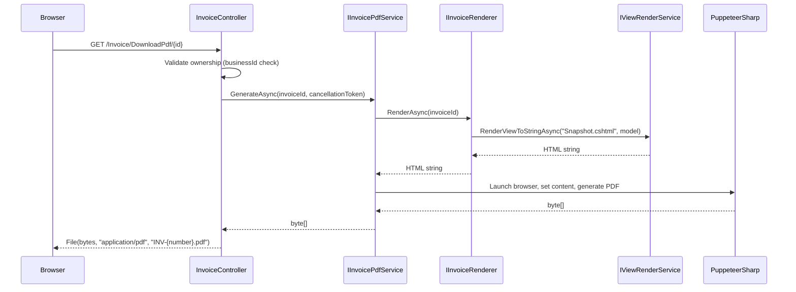

# Design Document: Invoice PDF Download

## Overview

This feature adds a dedicated PDF download capability for individual invoices, using PuppeteerSharp to render the existing `Snapshot.cshtml` Razor view into a downloadable PDF file. The design follows the same pattern already established by the Customer Statement and Credit Note PDF generation in the codebase, but introduces a dedicated `IInvoicePdfService` to decouple PDF generation from the controller for reusability (e.g., future email attachments).

**Key Design Decisions:**
1. **Dedicated service over inline controller logic** — Unlike the existing Statement/CreditNote controllers that embed `GeneratePdfFromHtmlAsync` as a private method, this feature extracts PDF generation into `IInvoicePdfService`. This enables reuse for emailing invoice PDFs without duplicating code.
2. **Reuse of existing `IInvoiceRenderer`** — The `InvoiceRenderer` already fetches all invoice data and renders `Snapshot.cshtml` to HTML. The PDF service delegates HTML generation to it rather than duplicating data-fetching logic.
3. **GET endpoint (not POST)** — The download endpoint uses HTTP GET because it's an idempotent read operation that produces a file. This enables direct linking from both the Detail page and the Index table actions column.
4. **Zero margins on PDF** — The Snapshot view has its own internal padding (40px body padding). Using zero PuppeteerSharp margins prevents double-spacing and ensures the PDF matches the browser-rendered view exactly.

## Architecture



The architecture follows the existing MVC + Service Layer pattern:
- **Controller** — HTTP concerns, authorization, error handling, filename generation
- **Service (`IInvoicePdfService`)** — Orchestrates HTML rendering + PDF conversion
- **Renderer (`IInvoiceRenderer`)** — Fetches data, renders Razor view to HTML (already exists)
- **PuppeteerSharp** — Chromium-based HTML-to-PDF conversion (already in use)

## Components and Interfaces

### IInvoicePdfService (New)

```csharp
namespace Portal.Infrastructure.Services;

/// <summary>
/// Generates a PDF byte array for a given invoice using the Snapshot view.
/// </summary>
public interface IInvoicePdfService
{
    /// <summary>
    /// Renders the invoice snapshot to HTML and converts it to a PDF document.
    /// </summary>
    /// <param name="invoiceId">The invoice identifier.</param>
    /// <param name="cancellationToken">Optional cancellation token (30-second timeout applied by caller).</param>
    /// <returns>PDF file as a byte array.</returns>
    /// <exception cref="InvalidOperationException">Thrown when the invoice is not found.</exception>
    Task<byte[]> GenerateAsync(int invoiceId, CancellationToken cancellationToken = default);
}
```

### InvoicePdfService (New)

```csharp
namespace Portal.Web.Services;

public class InvoicePdfService : IInvoicePdfService
{
    private readonly IInvoiceRenderer _invoiceRenderer;
    private readonly IWebHostEnvironment _environment;
    private readonly ILogoService _logoService;
    private readonly ICurrentTenantService _tenantService;

    // Constructor with DI

    public async Task<byte[]> GenerateAsync(int invoiceId, CancellationToken cancellationToken = default)
    {
        // 1. Get HTML from existing IInvoiceRenderer
        var html = await _invoiceRenderer.RenderAsync(invoiceId);

        // 2. Post-process HTML: replace logo  with base64 data URI
        html = await EmbedLogoAsBase64Async(html);

        // 3. Launch PuppeteerSharp and generate PDF
        return await GeneratePdfFromHtmlAsync(html, cancellationToken);
    }
}
```

**Design Note on Logo Embedding:** The existing `InvoiceRenderer.RenderAsync` sets `LogoUrl` to the relative public URL (e.g., `/uploads/logos/filename.png`). Since PuppeteerSharp renders from a string (not a served page), relative URLs won't resolve. The `InvoicePdfService` post-processes the HTML to replace the `` with a `data:` URI, following the same `GetLogoAsDataUri` pattern used in `StatementController` and `CreditNoteController`.

### InvoiceController Additions

New action method following the `AxGet` naming convention for AJAX endpoints:

```csharp
[HttpGet]
public async Task<IActionResult> AxGetDownloadPdf(int id)
{
    // 1. Validate invoice exists and belongs to current business
    // 2. Call IInvoicePdfService.GenerateAsync with 30-second CancellationTokenSource
    // 3. Generate filename: INV-{invoiceNumber}.pdf (sanitized)
    // 4. Return File(pdfBytes, "application/pdf", filename)
    // Error handling: 404 for not found, 500 JSON for timeout/failure
}
```

### Client-Side JavaScript Function (shared)

A reusable `downloadInvoicePdf(invoiceId)` function used by both the Detail page and the Index page:

```javascript
async function downloadInvoicePdf(invoiceId) {
    BlockUI.show('Generating PDF...');
    try {
        var response = await fetch('/Invoice/AxGetDownloadPdf/' + invoiceId);

        if (!response.ok || response.headers.get('content-type') !== 'application/pdf') {
            var data = await response.json();
            BlockUI.hide();
            Swal.fire({ title: 'Error', text: data.message || 'Failed to generate PDF.', icon: 'error', confirmButtonColor: '#0D5EA6' });
            return;
        }

        var blob = await response.blob();
        var filename = getFilenameFromHeader(response) || 'invoice.pdf';
        var url = URL.createObjectURL(blob);
        var a = document.createElement('a');
        a.href = url;
        a.download = filename;
        document.body.appendChild(a);
        a.click();
        document.body.removeChild(a);
        URL.revokeObjectURL(url);
        BlockUI.hide();
    } catch (e) {
        BlockUI.hide();
        Swal.fire({ title: 'Error', text: 'An unexpected error occurred.', icon: 'error', confirmButtonColor: '#0D5EA6' });
    }
}
```

## Data Models

No new database tables or entities are required. The feature reuses existing models:

| Model | Purpose | Location |
|-------|---------|----------|
| `Invoice` | Invoice entity (ID, InvoiceNumber, CustomerId, BusinessId) | `Portal.Infrastructure.Entities` |
| `InvoiceSnapshotModel` | View model for Snapshot.cshtml rendering | `Portal.Infrastructure.Models` |
| `BusinessLogo` | Logo entity (PublicUrl, ContentType) | `Portal.Infrastructure.Entities` |
| `InvoiceShare` | Shared invoice snapshot (Token, SnapshotHtml, IsActive, ExpiresAtUtc) | `Portal.Infrastructure.Entities` |

### Anonymous PDF Download (InvoiceViewController)

The `InvoiceViewController` already serves shared invoices via token-based URLs without authentication. A new endpoint generates a PDF directly from the stored `SnapshotHtml`:

```csharp
[HttpGet("/invoice-view/{token}/download-pdf")]
public async Task<IActionResult> DownloadPdf(string token)
{
    // 1. Validate token — get share, check active + not expired
    // 2. Generate PDF from SnapshotHtml using PuppeteerSharp (same pattern as InvoicePdfService)
    // 3. Extract invoice number from HTML or share metadata for filename
    // 4. Return File(pdfBytes, "application/pdf", filename)
    // Error handling: 404 for invalid/expired token, 500 JSON for generation failure
}
```

**Key difference from authenticated flow:** The anonymous endpoint uses `share.SnapshotHtml` directly (already a complete, self-contained HTML string with embedded styles) rather than calling `IInvoiceRenderer`. The logo in `SnapshotHtml` still references a relative URL, so the same base64 embedding logic applies.

**Security:** Token-based authorization — no authentication required. The token itself is the access credential. Expired/inactive shares return 404.

### Shared View Button Replacement

The current `InvoiceViewController.ViewInvoice` action injects a button that calls `window.print()`. This will be replaced with a proper fetch-based download button that hits `/invoice-view/{token}/download-pdf`.

```javascript
async function downloadInvoicePdf() {
    BlockUI.show('Generating PDF...');
    try {
        var response = await fetch('/invoice-view/{token}/download-pdf');
        if (!response.ok || !response.headers.get('content-type')?.includes('application/pdf')) {
            var data = await response.json();
            BlockUI.hide();
            Swal.fire({ title: 'Error', text: data.message || 'Failed to generate PDF.', icon: 'error', confirmButtonColor: '#0D5EA6' });
            return;
        }
        var blob = await response.blob();
        var contentDisposition = response.headers.get('content-disposition');
        var filename = 'invoice.pdf';
        if (contentDisposition) {
            var match = contentDisposition.match(/filename[^;=\n]*=((['"]).*?\2|[^;\n]*)/);
            if (match && match[1]) filename = match[1].replace(/['"]/g, '');
        }
        var url = URL.createObjectURL(blob);
        var a = document.createElement('a');
        a.href = url;
        a.download = filename;
        document.body.appendChild(a);
        a.click();
        document.body.removeChild(a);
        URL.revokeObjectURL(url);
        BlockUI.hide();
    } catch (e) {
        BlockUI.hide();
        Swal.fire({ title: 'Error', text: 'An unexpected error occurred.', icon: 'error', confirmButtonColor: '#0D5EA6' });
    }
}
```

### Filename Generation Logic (Pure Function)

```csharp
private static string GenerateInvoicePdfFilename(string invoiceNumber)
{
    // 1. Remove invalid filename characters: < > : " / \ | ? *
    var invalidChars = new[] { '<', '>', ':', '"', '/', '\\', '|', '?', '*' };
    var sanitized = new string(invoiceNumber.Where(c => !invalidChars.Contains(c)).ToArray());

    // 2. Fallback if empty after sanitization
    if (string.IsNullOrWhiteSpace(sanitized))
        return "INV-download.pdf";

    return $"INV-{sanitized}.pdf";
}
```

## Correctness Properties

*A property is a characteristic or behavior that should hold true across all valid executions of a system — essentially, a formal statement about what the system should do. Properties serve as the bridge between human-readable specifications and machine-verifiable correctness guarantees.*

### Property 1: Invoice PDF filename format

*For any* valid invoice number string, the generated filename SHALL match the pattern `INV-{sanitizedNumber}.pdf` where the sanitized number is the input with invalid filename characters removed.

**Validates: Requirements 2.2, 5.1**

### Property 2: Filename sanitization removes all invalid characters

*For any* arbitrary string used as an invoice number, the sanitized filename SHALL NOT contain any of the characters `< > : " / \ | ? *`, and if the sanitized number is empty the filename SHALL be exactly `INV-download.pdf`.

**Validates: Requirements 5.2, 5.3**

### Property 3: Logo data URI encoding round-trip

*For any* non-empty byte array and valid MIME content type, the `GetLogoAsDataUri` function SHALL produce a string matching the format `data:{contentType};base64,{base64String}` where decoding the base64 portion yields the original byte array.

**Validates: Requirements 4.3**

## Error Handling

| Scenario | Service Layer | Controller Response |
|----------|---------------|---------------------|
| Invoice not found | `IInvoiceRenderer` throws `InvalidOperationException` | 404 Not Found |
| Invoice belongs to different business | N/A (checked before service call) | 404 Not Found |
| Invalid invoice ID (non-integer) | N/A (ASP.NET route constraint) | 404 Not Found |
| PDF generation timeout (>30s) | `OperationCanceledException` propagates | 500 JSON `{ success: false, message: "PDF generation timed out. Please try again." }` |
| Unexpected error (PuppeteerSharp crash, etc.) | Exception propagates | 500 JSON `{ success: false, message: "Failed to generate PDF. Please try again." }` (internal details logged, not exposed) |
| Logo file missing on disk | `GetLogoAsDataUri` returns `null` | PDF renders without logo (no broken image) |

**Logging:** All errors are logged via `ILogger<InvoiceController>` with structured properties (invoice ID, business ID) before returning the sanitized error response.

## Testing Strategy

### Unit Tests

| Test | What it verifies |
|------|-----------------|
| `GenerateInvoicePdfFilename_ValidNumber_ReturnsCorrectFormat` | Filename matches `INV-{number}.pdf` |
| `GenerateInvoicePdfFilename_InvalidChars_RemovesThem` | Invalid chars stripped from filename |
| `GenerateInvoicePdfFilename_AllInvalidChars_ReturnsFallback` | Returns `INV-download.pdf` for empty sanitized result |
| `GetLogoAsDataUri_NullLogo_ReturnsNull` | No broken image when logo is missing |
| `GetLogoAsDataUri_ValidLogo_ReturnsDataUri` | Correct base64 data URI format |
| `AxGetDownloadPdf_InvoiceNotFound_Returns404` | Controller returns NotFound for missing invoice |
| `AxGetDownloadPdf_WrongBusiness_Returns404` | Controller returns NotFound for cross-tenant access |
| `AxGetDownloadPdf_TimeoutException_Returns500Json` | Timeout produces correct error JSON |
| `AxGetDownloadPdf_GenericException_Returns500JsonNoDetails` | Generic error doesn't expose internals |

### Property-Based Tests

Property-based testing is appropriate for the filename generation logic — it's a pure function with a large input space (any string) and clear universal properties.

**Library:** FsCheck.xUnit (already available in .NET ecosystem, integrates with xUnit)

**Configuration:** Minimum 100 iterations per property test.

| Property Test | Design Property | Tag |
|---------------|-----------------|-----|
| Filename format property | Property 1 | `Feature: invoice-pdf-download, Property 1: Invoice PDF filename format` |
| Filename sanitization property | Property 2 | `Feature: invoice-pdf-download, Property 2: Filename sanitization removes all invalid characters` |
| Logo data URI round-trip property | Property 3 | `Feature: invoice-pdf-download, Property 3: Logo data URI encoding round-trip` |

### Integration Tests

| Test | What it verifies |
|------|-----------------|
| `AxGetDownloadPdf_ValidInvoice_ReturnsPdfFile` | End-to-end: endpoint returns `application/pdf` with correct Content-Disposition |
| `InvoicePdfService_GenerateAsync_ProducesValidPdf` | Generated bytes start with `%PDF` header |

### Manual/E2E Tests

- Download PDF from Invoice Detail page — verify file downloads, BlockUI shows/hides
- Download PDF from Invoice Index actions column — verify same behavior
- Error scenario — verify SweetAlert2 displays on failure
- Visual fidelity — compare PDF output to browser-rendered Snapshot view
