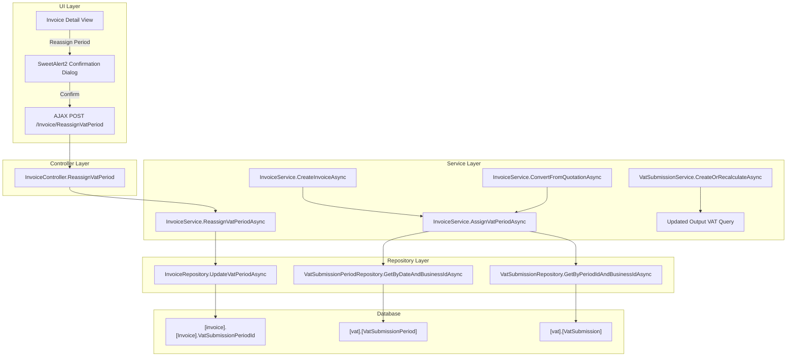

# Design Document: Invoice VAT Period Assignment

## Overview

This feature extends the Invoice entity with an explicit `VatSubmissionPeriodId` foreign key, mirroring the existing pattern on the Purchase table (migration 041). The goal is to allow invoices to be assigned to specific VAT periods independently of their `InvoiceDate`, enabling legitimate deferral scenarios (e.g., combined VAT corrections under €1,000 threshold).

The design introduces:
1. A database migration (048) adding the nullable FK column with backfill logic
2. Auto-assignment logic during invoice creation (both standalone and quotation-conversion)
3. A manual reassignment endpoint with validation and confirmation dialog
4. An updated Output VAT computation in `VatSubmissionService.CreateOrRecalculateAsync` that respects explicit assignments while maintaining backward compatibility for invoices with NULL assignment

The approach follows the established Purchase pattern exactly — nullable FK, filtered index, cascading assignment when the natural period is already submitted.

## Architecture



### Key Architectural Decisions

1. **Private helper method for assignment**: `AssignVatPeriodAsync` is a private method within `InvoiceService` called by both creation paths. This avoids duplication and ensures consistent assignment logic.

2. **Same-transaction guarantee**: Period assignment executes within the existing creation transaction, so an invoice is never persisted without the assignment attempt having completed.

3. **Backward compatibility via UNION approach**: The Output VAT query uses two mutually exclusive sets — explicitly assigned invoices (non-NULL `VatSubmissionPeriodId`) and date-range matched invoices (NULL `VatSubmissionPeriodId`). This ensures no double-counting and no breaking change for existing data.

4. **Validation-heavy reassignment**: The reassignment endpoint performs 7 validation checks before executing, matching the defensive pattern used throughout the codebase.

## Components and Interfaces

### 1. Database Migration (048)

**File**: `Portal.Database/Migrations/048_AddVatSubmissionPeriodIdToInvoice.sql`

Adds:
- Nullable `VatSubmissionPeriodId INT` column to `[invoice].[Invoice]`
- Foreign key `FK_Invoice_VatSubmissionPeriod` → `[vat].[VatSubmissionPeriod].[Id]`
- Filtered non-clustered index `IX_Invoice_VatSubmissionPeriodId`
- Backfill logic for existing invoices (date-range matching, earliest period wins)
- Fully idempotent (IF NOT EXISTS guards on all DDL and DML)

### 2. Invoice Entity Update

**File**: `Portal.Infrastructure/Entities/Invoice.cs`

New properties:
```csharp
public int? VatSubmissionPeriodId { get; set; }
public VatSubmissionPeriod? VatSubmissionPeriod { get; set; }
```

### 3. InvoiceRepository Updates

**File**: `Portal.Infrastructure/Repositories/InvoiceRepository.cs`

New method:
```csharp
public async Task UpdateVatPeriodAsync(int invoiceId, int? vatSubmissionPeriodId)
```

Updated methods:
- `InsertAsync` — includes `VatSubmissionPeriodId` parameter
- `GetByIdAndBusinessIdAsync` — includes `VatSubmissionPeriodId` in SELECT
- `UpdateAsync` — includes `VatSubmissionPeriodId` in SET clause

### 4. VatSubmissionPeriodRepository Updates

**File**: `Portal.Infrastructure/Repositories/VatSubmissionPeriodRepository.cs`

New method:
```csharp
public async Task<VatSubmissionPeriod?> GetByDateAndBusinessIdAsync(DateOnly invoiceDate, int businessId)
```

Returns the period where `PeriodStartDate <= invoiceDate AND PeriodEndDate >= invoiceDate`. If multiple match, returns the one with earliest `PeriodStartDate`.

New method:
```csharp
public async Task<List<VatSubmissionPeriod>> GetUnsubmittedPeriodsFromAsync(int businessId, DateOnly fromDate)
```

Returns periods ordered by `PeriodStartDate ASC` where `PeriodStartDate >= fromDate` and the period either has no VatSubmission or has one with `IsSubmitted = false`.

### 5. InvoiceService Updates

**File**: `Portal.Infrastructure/Services/InvoiceService.cs`

New private method:
```csharp
private async Task<int?> AssignVatPeriodAsync(int businessId, DateOnly invoiceDate)
```

Logic:
1. Find the natural period (date-range match for businessId)
2. If no period found → return null
3. Check if natural period has a submitted VatSubmission
4. If not submitted (or no submission exists) → return natural period's Id
5. If submitted → search forward for first unsubmitted period (Cascading Assignment)
6. If no unsubmitted period found → return null

New public method:
```csharp
public async Task<ServiceResult> ReassignVatPeriodAsync(int invoiceId, int targetPeriodId)
```

Validation sequence:
1. Invoice exists and belongs to current business
2. Invoice is not deleted
3. Target period exists
4. Target period belongs to same business
5. Target period is not already submitted
6. Invoice is not already assigned to target period
7. Execute update + audit log

Updated methods:
- `CreateInvoiceAsync` — calls `AssignVatPeriodAsync` and sets `VatSubmissionPeriodId` before insert
- `ConvertFromQuotationAsync` — calls `AssignVatPeriodAsync` and sets `VatSubmissionPeriodId` before insert

### 6. IInvoiceService Interface Update

New method signature:
```csharp
Task<ServiceResult> ReassignVatPeriodAsync(int invoiceId, int targetPeriodId);
```

### 7. VatSubmissionService Update

**File**: `Portal.Infrastructure/Services/VatSubmissionService.cs`

Updated `CreateOrRecalculateAsync` — replaces the single Output VAT query with a two-part computation:

```csharp
// Part 1: Invoices explicitly assigned to this period
var explicitOutputVat = await _portalDbContext.Invoices
    .Where(i => i.BusinessId == businessId
        && i.InvoiceStatusTypeId == 2
        && !i.IsDeleted
        && i.VatSubmissionPeriodId == vatSubmissionPeriodId)
    .SumAsync(i => (decimal?)i.TaxAmount) ?? 0m;

// Part 2: Invoices with NULL assignment falling in date range (backward compat)
var dateRangeOutputVat = await _portalDbContext.Invoices
    .Where(i => i.BusinessId == businessId
        && i.InvoiceStatusTypeId == 2
        && !i.IsDeleted
        && i.VatSubmissionPeriodId == null
        && i.InvoiceDate >= period.PeriodStartDate
        && i.InvoiceDate <= period.PeriodEndDate)
    .SumAsync(i => (decimal?)i.TaxAmount) ?? 0m;

var totalOutputVat = explicitOutputVat + dateRangeOutputVat;
```

### 8. InvoiceController Update

**File**: `Portal.Web/Controllers/InvoiceController.cs`

New endpoint:
```csharp
[HttpPost]
[ValidateAntiForgeryToken]
[ModuleAccess(PortalModules.Invoice, AccessLevels.Full)]
public async Task<IActionResult> ReassignVatPeriod(int invoiceId, int targetPeriodId)
```

Returns `Json(new { success, message })`.

New endpoint for pre-confirmation data:
```csharp
[HttpGet]
public async Task<IActionResult> GetReassignmentImpact(int invoiceId, int targetPeriodId)
```

Returns JSON with invoice number, source/target period labels, tax amount, and projected Output VAT totals for both periods.

### 9. UI: Reassignment Dialog

**Location**: Invoice Detail view (JavaScript)

Triggered by a "Reassign VAT Period" dropdown/button. Flow:
1. User selects target period from dropdown of available (unsubmitted) periods
2. AJAX GET to `GetReassignmentImpact` to fetch financial impact data
3. SweetAlert2 confirmation dialog with destructive styling (`#C24A4A`)
4. On confirm: BlockUI.show → POST to `ReassignVatPeriod` → BlockUI.hide → Swal.fire result
5. On success: refresh page to reflect updated assignment

## Data Models

### Database Schema Change

```sql
-- New column on [invoice].[Invoice]
VatSubmissionPeriodId INT NULL
    CONSTRAINT FK_Invoice_VatSubmissionPeriod
    FOREIGN KEY REFERENCES [vat].[VatSubmissionPeriod]([Id])

-- Filtered index
CREATE NONCLUSTERED INDEX IX_Invoice_VatSubmissionPeriodId
ON [invoice].[Invoice] ([VatSubmissionPeriodId])
WHERE [VatSubmissionPeriodId] IS NOT NULL;
```

### Updated Invoice Entity

```csharp
public class Invoice
{
    // ... existing properties ...
    public int? VatSubmissionPeriodId { get; set; }

    // Navigation properties
    // ... existing navigation properties ...
    public VatSubmissionPeriod? VatSubmissionPeriod { get; set; }
}
```

### Updated VatSubmissionPeriod Entity (Navigation)

```csharp
public class VatSubmissionPeriod
{
    // ... existing properties ...
    public ICollection<Invoice> Invoices { get; set; } = new List<Invoice>();
}
```

### ReassignmentImpactDto (New)

```csharp
public class ReassignmentImpactDto
{
    public string InvoiceNumber { get; set; } = null!;
    public decimal TaxAmount { get; set; }
    public string SourcePeriodLabel { get; set; } = null!;
    public string TargetPeriodLabel { get; set; } = null!;
    public decimal SourcePeriodProjectedOutputVat { get; set; }
    public decimal TargetPeriodProjectedOutputVat { get; set; }
    public string CurrencySymbol { get; set; } = "€";
}
```

### EF Core DbContext Configuration

```csharp
// In PortalDbContext OnModelCreating
modelBuilder.Entity<Invoice>(entity =>
{
    // ... existing configuration ...
    entity.Property(e => e.VatSubmissionPeriodId).IsRequired(false);
    entity.HasOne(e => e.VatSubmissionPeriod)
        .WithMany(p => p.Invoices)
        .HasForeignKey(e => e.VatSubmissionPeriodId)
        .OnDelete(DeleteBehavior.SetNull);
});
```


## Correctness Properties

*A property is a characteristic or behavior that should hold true across all valid executions of a system — essentially, a formal statement about what the system should do. Properties serve as the bridge between human-readable specifications and machine-verifiable correctness guarantees.*

### Property 1: Explicit assignment determines period inclusion

*For any* invoice with a non-NULL `VatSubmissionPeriodId`, the Output VAT computation SHALL include that invoice's `TaxAmount` only in the period referenced by `VatSubmissionPeriodId`, regardless of the invoice's `InvoiceDate`.

**Validates: Requirements 1.3, 5.1**

### Property 2: NULL assignment falls back to date-range matching

*For any* invoice with a NULL `VatSubmissionPeriodId`, `InvoiceStatusTypeId` = 2, and `IsDeleted` = false, the Output VAT computation SHALL include that invoice's `TaxAmount` in the period whose `PeriodStartDate` <= `InvoiceDate` <= `PeriodEndDate` for the same `BusinessId`.

**Validates: Requirements 1.2, 5.2**

### Property 3: Mutual exclusivity — no invoice counted in multiple periods

*For any* set of invoices and any two distinct VAT periods, an invoice SHALL contribute its `TaxAmount` to at most one period's `TotalOutputVat`. An invoice with a non-NULL `VatSubmissionPeriodId` is evaluated only by explicit assignment; an invoice with a NULL `VatSubmissionPeriodId` is evaluated only by date-range matching.

**Validates: Requirements 5.3, 5.4**

### Property 4: Auto-assignment selects natural unsubmitted period

*For any* newly created invoice whose `InvoiceDate` falls within a period's date range and that period either has no `VatSubmission` record or has one with `IsSubmitted` = false, the `VatSubmissionPeriodId` SHALL be set to that period's `Id`.

**Validates: Requirements 2.1, 2.2**

### Property 5: Cascading assignment finds first unsubmitted period forward

*For any* newly created invoice whose natural period (by date-range) has a `VatSubmission` with `IsSubmitted` = true, the `VatSubmissionPeriodId` SHALL be set to the `Id` of the first period (ordered by `PeriodStartDate` ascending) after the natural period that either has no `VatSubmission` or has one with `IsSubmitted` = false.

**Validates: Requirements 2.3**

### Property 6: Reassignment rejects submitted target periods

*For any* reassignment request where the target `VatSubmissionPeriod` has a `VatSubmission` with `IsSubmitted` = true, the service SHALL reject the request and leave the invoice's `VatSubmissionPeriodId` unchanged.

**Validates: Requirements 3.6**

### Property 7: Reassignment rejects cross-business attempts

*For any* reassignment request where the target `VatSubmissionPeriod`'s `BusinessId` does not equal the invoice's `BusinessId`, the service SHALL reject the request and leave the invoice unchanged.

**Validates: Requirements 3.4, 3.5**

### Property 8: Successful reassignment updates period and timestamp

*For any* valid reassignment request (all validations pass), the invoice's `VatSubmissionPeriodId` SHALL equal the target period's `Id` and `UpdatedAtUtc` SHALL be greater than or equal to the time the request was initiated.

**Validates: Requirements 3.9**

### Property 9: Submitted period computation is immutable

*For any* period that has a `VatSubmission` with `IsSubmitted` = true, calling `CreateOrRecalculateAsync` SHALL return the existing `TotalOutputVat`, `TotalInputVat`, and `NetVatPayable` values without modification.

**Validates: Requirements 5.5**

### Property 10: Backfill assigns earliest matching period by date range

*For any* existing invoice with NULL `VatSubmissionPeriodId` and `IsDeleted` = false, the backfill logic SHALL set `VatSubmissionPeriodId` to the `Id` of the period with the earliest `PeriodStartDate` whose date range contains the invoice's `InvoiceDate` and whose `BusinessId` matches.

**Validates: Requirements 6.4, 6.6**

### Property 11: Projected impact is arithmetic over current totals

*For any* reassignment impact computation, the source period's projected Output VAT SHALL equal its current `TotalOutputVat` minus the invoice's `TaxAmount`, and the target period's projected Output VAT SHALL equal its current `TotalOutputVat` plus the invoice's `TaxAmount`.

**Validates: Requirements 4.4**

## Error Handling

### Service Layer Errors

| Scenario | Response | HTTP Status |
|----------|----------|-------------|
| Invoice not found | `ServiceResult.Fail("Invoice not found.")` | 404 via controller |
| Target period not found | `ServiceResult.Fail("Target VAT period not found.")` | 404 via controller |
| Business mismatch | `ServiceResult.Fail("Target period does not belong to this business.")` | 400 via controller |
| Target period submitted | `ServiceResult.Fail("Cannot reassign to a period that has already been submitted.")` | 400 via controller |
| Invoice is deleted | `ServiceResult.Fail("Cannot reassign a deleted invoice.")` | 400 via controller |
| Already assigned to target | `ServiceResult.Fail("Invoice is already assigned to this period.")` | 400 via controller |

### Auto-Assignment Edge Cases

| Scenario | Behavior |
|----------|----------|
| No period matches invoice date | `VatSubmissionPeriodId` remains NULL — invoice uses date-range fallback |
| Natural period submitted, no unsubmitted period exists | `VatSubmissionPeriodId` remains NULL |
| Multiple periods match date (overlapping) | Assign earliest by `PeriodStartDate` |

### Database Migration Errors

| Scenario | Behavior |
|----------|----------|
| Column already exists | Skip ALTER TABLE (IF NOT EXISTS guard) |
| FK already exists | Skip ADD CONSTRAINT |
| Index already exists | Skip CREATE INDEX |
| Backfill on already-set rows | WHERE clause excludes rows with non-NULL `VatSubmissionPeriodId` |

### UI Error Handling

- AJAX failure (network error): BlockUI.hide() → Swal.fire with generic error message
- Server returns `success: false`: BlockUI.hide() → Swal.fire with `data.message`
- Impact endpoint failure: Show error toast, do not open confirmation dialog

## Testing Strategy

### Unit Tests (Example-Based)

Focus on specific scenarios and edge cases:

1. **Auto-assignment**: Invoice date matches period → period assigned
2. **Auto-assignment**: Invoice date matches no period → NULL
3. **Auto-assignment**: Natural period submitted, next period available → cascading works
4. **Auto-assignment**: All periods submitted → NULL
5. **Reassignment validation**: Each rejection case (not found, deleted, submitted, mismatch, same period)
6. **Reassignment success**: Valid request updates VatSubmissionPeriodId
7. **Output VAT computation**: Mix of explicit and NULL assignments produces correct sum
8. **Output VAT computation**: Submitted period returns cached values
9. **Impact projection**: Arithmetic correctness

### Property-Based Tests

**Library**: FsCheck (via FsCheck.Xunit for .NET)

**Configuration**: Minimum 100 iterations per property test.

Each property test references its design document property with the tag format:
`Feature: invoice-vat-period-assignment, Property {number}: {property_text}`

Properties to implement:
- Property 1: Explicit assignment determines period inclusion
- Property 2: NULL assignment falls back to date-range matching
- Property 3: Mutual exclusivity — no double-counting
- Property 4: Auto-assignment selects natural unsubmitted period
- Property 5: Cascading assignment finds first unsubmitted forward
- Property 6: Reassignment rejects submitted target periods
- Property 7: Reassignment rejects cross-business attempts
- Property 8: Successful reassignment updates period and timestamp
- Property 9: Submitted period computation is immutable
- Property 10: Backfill assigns earliest matching period
- Property 11: Projected impact is arithmetic

### Integration Tests

1. **Migration idempotency**: Run migration 048 twice, verify no errors and identical schema state
2. **Transaction atomicity**: Verify invoice creation + assignment are atomic (rollback on failure)
3. **End-to-end reassignment**: Create invoice → reassign → verify Output VAT recalculation reflects change
4. **Backfill correctness**: Seed invoices without assignment → run migration → verify correct assignments

### Test Data Generators (for PBT)

- **InvoiceGenerator**: Random `InvoiceDate`, `TaxAmount` (0.01–10000), `BusinessId`, `InvoiceStatusTypeId` (1–3), `IsDeleted` (weighted toward false)
- **PeriodGenerator**: Random non-overlapping date ranges with `BusinessId`, `PeriodLabel`
- **SubmissionStateGenerator**: Random `IsSubmitted` boolean per period
- **ReassignmentRequestGenerator**: Random invoice/period combinations (both valid and invalid)
