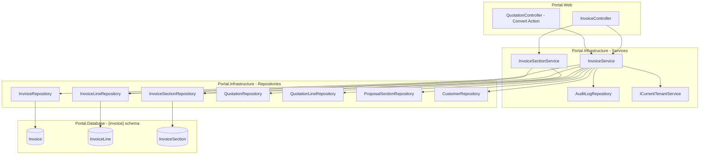
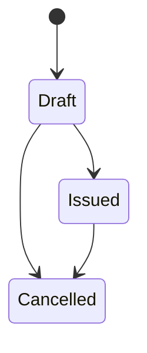
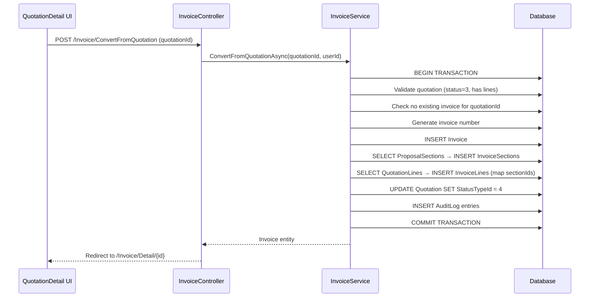

# Design Document: Invoicing Module

## Overview

The Invoicing module extends the Portal platform with the ability to create, manage, and track invoices. Invoices can be created either by converting an accepted quotation (deterministic, transactional copy) or as standalone documents for ad-hoc billing. The module mirrors the quotation platform's section-based presentation structure (InvoiceSection, extended InvoiceLine properties, IsGrandTotalShown) and enforces strict tenant isolation, sequential numbering, idempotent conversion, and lifecycle state management.

The design follows the established Controller → Service → Repository pattern with raw SQL data access via `GenericStoredProcedureRepository<T>`, matching the conventions in `QuotationService`, `QuotationRepository`, and `ProposalSectionService`.

## Architecture



### Key Architectural Decisions

1. **Single InvoiceService** handles both conversion and standalone creation. Conversion logic is a method within InvoiceService rather than a separate service, keeping the transaction boundary simple.

2. **Transaction scope for conversion**: The conversion operation wraps quotation status update, invoice insert, section copy, and line copy in a single `IDbContextTransaction` to guarantee atomicity.

3. **Invoice number generation** uses a `SELECT MAX + 1` pattern scoped to BusinessId (matching QuotationRepository.GetNextSequentialNumberAsync). The filtered unique index on QuotationId provides idempotency at the database level.

4. **InvoiceSectionService** mirrors `ProposalSectionService` exactly — same interface shape, same CRUD + reorder + move patterns — applied to the `[invoice]` schema.

5. **No EF Core navigation loading** — all queries use raw SQL via repositories, consistent with the existing codebase.

## Components and Interfaces

### IInvoiceService

```csharp
public interface IInvoiceService
{
    // Conversion
    Task<Invoice> ConvertFromQuotationAsync(int quotationId, string userId);

    // Standalone creation
    Task<Invoice> CreateInvoiceAsync(int customerId, DateOnly invoiceDate, DateOnly dueDate,
        string? notes, bool isGrandTotalShown, List<CreateInvoiceLineDto> lines,
        List<CreateInvoiceSectionDto>? sections);

    // Queries
    Task<List<InvoiceListDto>> GetInvoicesAsync(int? statusFilter = null,
        int? financialStatusFilter = null, int? customerFilter = null);
    Task<Invoice?> GetInvoiceByIdAsync(int id);
    Task<List<InvoiceLine>> GetInvoiceLinesAsync(int invoiceId);

    // Lifecycle
    Task TransitionStatusAsync(int invoiceId, int newStatusId, string userId);

    // Line management
    Task<InvoiceLine> AddLineAsync(int invoiceId, string description, decimal quantity,
        decimal unitPrice, decimal vatRate, decimal discount, string discountType,
        decimal? costPrice, string? referenceUrl, string? subtitle, int? invoiceSectionId);
    Task UpdateLineAsync(int lineId, string description, decimal quantity,
        decimal unitPrice, decimal vatRate, decimal discount, string discountType,
        decimal? costPrice, string? referenceUrl, string? subtitle, int? invoiceSectionId);
    Task RemoveLineAsync(int lineId);
}
```

### IInvoiceSectionService

```csharp
public interface IInvoiceSectionService
{
    Task<List<InvoiceSection>> GetByInvoiceIdAsync(int invoiceId);
    Task AddSectionAsync(int invoiceId, string name, string? description,
        string columnConfiguration = "OneTime", string sectionType = "LineItems",
        bool isEmphasized = false, string? accentColor = null, string? label = null,
        bool isTotalsTableShown = false);
    Task RemoveSectionAsync(int sectionId, int invoiceId);
    Task ReorderSectionsAsync(int invoiceId, List<int> orderedSectionIds);
    Task MoveLineToSectionAsync(int lineId, int? targetSectionId);
    Task ReorderLinesAsync(List<int> orderedLineIds);
    Task UpdateSectionAsync(int sectionId, string name, string? description, string? notes,
        string? columnConfiguration = null, string? sectionType = null,
        bool? isEmphasized = null, string? accentColor = null, string? label = null,
        bool? isTotalsTableShown = null);
}
```

### InvoiceController

```csharp
[Authorize]
[ModuleAccess(PortalModules.Invoice)]
public class InvoiceController : Controller
{
    // GET  /Invoice              → Index (list with filters)
    // GET  /Invoice/Detail/{id}  → Detail view
    // POST /Invoice/Create       → Standalone invoice creation
    // POST /Invoice/ConvertFromQuotation → Quotation-to-invoice conversion
    // POST /Invoice/TransitionStatus     → Status lifecycle transition
    // POST /Invoice/AddLine, UpdateLine, RemoveLine → Line CRUD
    // POST /Invoice/AddSection, UpdateSection, RemoveSection, ReorderSections → Section CRUD
    // POST /Invoice/MoveLineToSection, ReorderLines → Line movement
}
```

### Repositories

| Repository | Schema | Responsibility |
|---|---|---|
| `InvoiceRepository` | `[invoice].[Invoice]` | CRUD, GetAllByBusinessId, GetByIdAndBusinessId, GetNextSequentialNumber |
| `InvoiceLineRepository` | `[invoice].[InvoiceLine]` | CRUD, GetByInvoiceId, BulkInsert (for conversion) |
| `InvoiceSectionRepository` | `[invoice].[InvoiceSection]` | CRUD, GetByInvoiceId, BulkInsert (for conversion) |


## Data Models

### Extended Entity: Invoice

```csharp
public class Invoice
{
    public int Id { get; set; }
    public int BusinessId { get; set; }
    public int CustomerId { get; set; }
    public int? QuotationId { get; set; }
    public int InvoiceStatusTypeId { get; set; }
    public int InvoiceFinancialStatusTypeId { get; set; }
    public string InvoiceNumber { get; set; } = null!;
    public DateOnly InvoiceDate { get; set; }
    public DateOnly DueDate { get; set; }
    public decimal Subtotal { get; set; }
    public decimal TaxAmount { get; set; }
    public decimal TotalAmount { get; set; }
    public string CurrencyCode { get; set; } = null!;
    public string? Notes { get; set; }
    public bool IsGrandTotalShown { get; set; } = true;  // NEW
    public DateTime CreatedAtUtc { get; set; }
    public DateTime UpdatedAtUtc { get; set; }

    // Navigation properties
    public Business Business { get; set; } = null!;
    public Customer Customer { get; set; } = null!;
    public Quotation? Quotation { get; set; }
    public InvoiceStatusType InvoiceStatusType { get; set; } = null!;
    public InvoiceFinancialStatusType InvoiceFinancialStatusType { get; set; } = null!;
    public ICollection<InvoiceLine> InvoiceLines { get; set; } = new List<InvoiceLine>();
    public ICollection<InvoiceSection> InvoiceSections { get; set; } = new List<InvoiceSection>();
    public ICollection<Payment> Payments { get; set; } = new List<Payment>();
}
```

### Extended Entity: InvoiceLine

```csharp
public class InvoiceLine
{
    public int Id { get; set; }
    public int InvoiceId { get; set; }
    public string Description { get; set; } = null!;
    public decimal Quantity { get; set; }
    public decimal UnitPrice { get; set; }
    public decimal VatRate { get; set; }              // NEW
    public decimal Discount { get; set; }             // NEW
    public string DiscountType { get; set; } = "Percentage"; // NEW
    public decimal? CostPrice { get; set; }           // NEW
    public decimal LineTotal { get; set; }
    public int SortOrder { get; set; }
    public string? ReferenceUrl { get; set; }         // NEW
    public string? Subtitle { get; set; }             // NEW
    public int? InvoiceSectionId { get; set; }        // NEW

    // Navigation properties
    public Invoice Invoice { get; set; } = null!;
    public InvoiceSection? InvoiceSection { get; set; }
}
```

### New Entity: InvoiceSection

```csharp
public class InvoiceSection
{
    public int Id { get; set; }
    public int InvoiceId { get; set; }
    public string Name { get; set; } = null!;
    public int SortOrder { get; set; }
    public string ColumnConfiguration { get; set; } = null!;
    public string SectionType { get; set; } = "LineItems";
    public string? Description { get; set; }
    public string? Notes { get; set; }
    public bool IsEmphasized { get; set; }
    public string? AccentColor { get; set; }
    public string? Label { get; set; }
    public bool IsTotalsTableShown { get; set; }

    // Navigation properties
    public Invoice Invoice { get; set; } = null!;
    public ICollection<InvoiceLine> InvoiceLines { get; set; } = new List<InvoiceLine>();
}
```

### DTOs

```csharp
public class InvoiceListDto
{
    public int Id { get; set; }
    public string InvoiceNumber { get; set; } = null!;
    public string CustomerName { get; set; } = null!;
    public DateOnly InvoiceDate { get; set; }
    public DateOnly DueDate { get; set; }
    public decimal TotalAmount { get; set; }
    public string StatusName { get; set; } = null!;
    public string FinancialStatusName { get; set; } = null!;
    public int InvoiceStatusTypeId { get; set; }
    public int InvoiceFinancialStatusTypeId { get; set; }
}

public class CreateInvoiceLineDto
{
    public string Description { get; set; } = null!;
    public decimal Quantity { get; set; }
    public decimal UnitPrice { get; set; }
    public decimal VatRate { get; set; }
    public decimal Discount { get; set; }
    public string DiscountType { get; set; } = "Percentage";
    public decimal? CostPrice { get; set; }
    public string? ReferenceUrl { get; set; }
    public string? Subtitle { get; set; }
    public int? SectionIndex { get; set; } // Maps to section by position during creation
}

public class CreateInvoiceSectionDto
{
    public string Name { get; set; } = null!;
    public string ColumnConfiguration { get; set; } = "OneTime";
    public string SectionType { get; set; } = "LineItems";
    public string? Description { get; set; }
    public string? Notes { get; set; }
    public bool IsEmphasized { get; set; }
    public string? AccentColor { get; set; }
    public string? Label { get; set; }
    public bool IsTotalsTableShown { get; set; }
}
```

### Database Migrations

#### Migration 036: Add IsGrandTotalShown to Invoice

```sql
IF NOT EXISTS (
    SELECT 1 FROM sys.columns
    WHERE [object_id] = OBJECT_ID('[invoice].[Invoice]')
      AND [name] = 'IsGrandTotalShown'
)
BEGIN
    ALTER TABLE [invoice].[Invoice]
    ADD [IsGrandTotalShown] BIT NOT NULL CONSTRAINT [DF_Invoice_IsGrandTotalShown] DEFAULT (1);
END
GO
```

#### Migration 037: Extend InvoiceLine with new columns

```sql
IF NOT EXISTS (
    SELECT 1 FROM sys.columns
    WHERE [object_id] = OBJECT_ID('[invoice].[InvoiceLine]')
      AND [name] = 'VatRate'
)
BEGIN
    ALTER TABLE [invoice].[InvoiceLine]
    ADD [VatRate] DECIMAL(18,2) NOT NULL CONSTRAINT [DF_InvoiceLine_VatRate] DEFAULT (0);
END
GO

IF NOT EXISTS (
    SELECT 1 FROM sys.columns
    WHERE [object_id] = OBJECT_ID('[invoice].[InvoiceLine]')
      AND [name] = 'Discount'
)
BEGIN
    ALTER TABLE [invoice].[InvoiceLine]
    ADD [Discount] DECIMAL(18,2) NOT NULL CONSTRAINT [DF_InvoiceLine_Discount] DEFAULT (0);
END
GO

IF NOT EXISTS (
    SELECT 1 FROM sys.columns
    WHERE [object_id] = OBJECT_ID('[invoice].[InvoiceLine]')
      AND [name] = 'DiscountType'
)
BEGIN
    ALTER TABLE [invoice].[InvoiceLine]
    ADD [DiscountType] NVARCHAR(20) NOT NULL CONSTRAINT [DF_InvoiceLine_DiscountType] DEFAULT ('Percentage');
END
GO

IF NOT EXISTS (
    SELECT 1 FROM sys.columns
    WHERE [object_id] = OBJECT_ID('[invoice].[InvoiceLine]')
      AND [name] = 'CostPrice'
)
BEGIN
    ALTER TABLE [invoice].[InvoiceLine]
    ADD [CostPrice] DECIMAL(18,2) NULL;
END
GO

IF NOT EXISTS (
    SELECT 1 FROM sys.columns
    WHERE [object_id] = OBJECT_ID('[invoice].[InvoiceLine]')
      AND [name] = 'ReferenceUrl'
)
BEGIN
    ALTER TABLE [invoice].[InvoiceLine]
    ADD [ReferenceUrl] NVARCHAR(2048) NULL;
END
GO

IF NOT EXISTS (
    SELECT 1 FROM sys.columns
    WHERE [object_id] = OBJECT_ID('[invoice].[InvoiceLine]')
      AND [name] = 'Subtitle'
)
BEGIN
    ALTER TABLE [invoice].[InvoiceLine]
    ADD [Subtitle] NVARCHAR(500) NULL;
END
GO

IF NOT EXISTS (
    SELECT 1 FROM sys.columns
    WHERE [object_id] = OBJECT_ID('[invoice].[InvoiceLine]')
      AND [name] = 'InvoiceSectionId'
)
BEGIN
    ALTER TABLE [invoice].[InvoiceLine]
    ADD [InvoiceSectionId] INT NULL;
END
GO
```

#### Migration 038: Create InvoiceSection table

```sql
IF NOT EXISTS (
    SELECT 1 FROM INFORMATION_SCHEMA.TABLES
    WHERE TABLE_SCHEMA = 'invoice' AND TABLE_NAME = 'InvoiceSection'
)
BEGIN
    CREATE TABLE [invoice].[InvoiceSection]
    (
        [Id]                    INT            IDENTITY(1,1) NOT NULL,
        [InvoiceId]             INT                          NOT NULL,
        [Name]                  NVARCHAR(200)                NOT NULL,
        [SortOrder]             INT                          NOT NULL,
        [ColumnConfiguration]   NVARCHAR(50)                 NOT NULL CONSTRAINT [DF_InvoiceSection_ColumnConfiguration] DEFAULT ('OneTime'),
        [SectionType]           NVARCHAR(20)                 NOT NULL CONSTRAINT [DF_InvoiceSection_SectionType] DEFAULT ('LineItems'),
        [Description]           NVARCHAR(MAX)                NULL,
        [Notes]                 NVARCHAR(MAX)                NULL,
        [IsEmphasized]          BIT                          NOT NULL CONSTRAINT [DF_InvoiceSection_IsEmphasized] DEFAULT (0),
        [AccentColor]           NVARCHAR(20)                 NULL,
        [Label]                 NVARCHAR(100)                NULL,
        [IsTotalsTableShown]    BIT                          NOT NULL CONSTRAINT [DF_InvoiceSection_IsTotalsTableShown] DEFAULT (0),

        CONSTRAINT [PK_InvoiceSection] PRIMARY KEY CLUSTERED ([Id]),
        CONSTRAINT [FK_InvoiceSection_Invoice] FOREIGN KEY ([InvoiceId]) REFERENCES [invoice].[Invoice] ([Id]) ON DELETE CASCADE
    );
END
GO

-- Add FK from InvoiceLine to InvoiceSection (after InvoiceSection table exists)
IF NOT EXISTS (
    SELECT 1 FROM sys.foreign_keys
    WHERE [name] = 'FK_InvoiceLine_InvoiceSection'
)
BEGIN
    ALTER TABLE [invoice].[InvoiceLine]
    ADD CONSTRAINT [FK_InvoiceLine_InvoiceSection]
        FOREIGN KEY ([InvoiceSectionId]) REFERENCES [invoice].[InvoiceSection] ([Id]);
END
GO
```

### Invoice Status Lifecycle



Valid transitions map:
```csharp
private static readonly Dictionary<int, List<int>> ValidTransitionsMap = new()
{
    { 1, new List<int> { 2, 3 } },  // Draft → Issued, Cancelled
    { 2, new List<int> { 3 } },     // Issued → Cancelled
};
```

### Invoice Number Format

Format: `INV-{BusinessId}-{SequentialNumber:D5}`

Example: `INV-1-00001`, `INV-1-00002`

Generated via:
```sql
SELECT ISNULL(MAX(CAST(RIGHT([InvoiceNumber], 5) AS INT)), 0) + 1
FROM [invoice].[Invoice]
WHERE [BusinessId] = @BusinessId
```

### Conversion Flow (Sequence)




## Correctness Properties

*A property is a characteristic or behavior that should hold true across all valid executions of a system — essentially, a formal statement about what the system should do. Properties serve as the bridge between human-readable specifications and machine-verifiable correctness guarantees.*

### Property 1: Conversion data fidelity

*For any* accepted quotation with lines and sections, converting it to an invoice SHALL produce an invoice where: every QuotationLine field (Description, Quantity, UnitPrice, VatRate, Discount, DiscountType, CostPrice, LineTotal, SortOrder, ReferenceUrl, Subtitle) is identical in the corresponding InvoiceLine; every ProposalSection field (Name, SortOrder, ColumnConfiguration, SectionType, Description, Notes, IsEmphasized, AccentColor, Label, IsTotalsTableShown) is identical in the corresponding InvoiceSection; the Invoice's CustomerId, BusinessId, and IsGrandTotalShown match the source Quotation; and each InvoiceLine's InvoiceSectionId maps to the InvoiceSection that corresponds to its original ProposalSection.

**Validates: Requirements 1.3, 1.6, 1.7, 1.8, 1.9**

### Property 2: Conversion transitions quotation to Converted

*For any* accepted quotation that is successfully converted, the source quotation's QuotationStatusTypeId SHALL equal 4 (Converted) after the operation completes.

**Validates: Requirements 1.2**

### Property 3: Invoice totals computation invariant

*For any* invoice (created via conversion or standalone) with a set of invoice lines, the Invoice.Subtotal SHALL equal the sum of all InvoiceLine.LineTotal values, the Invoice.TaxAmount SHALL equal the sum of (InvoiceLine.LineTotal × InvoiceLine.VatRate / 100) rounded to 2 decimal places, and the Invoice.TotalAmount SHALL equal Subtotal + TaxAmount.

**Validates: Requirements 1.4, 3.2**

### Property 4: New invoice initial state

*For any* newly created invoice (whether from conversion or standalone creation), the InvoiceStatusTypeId SHALL be 1 (Draft) and the InvoiceFinancialStatusTypeId SHALL be 1 (Unpaid).

**Validates: Requirements 1.5, 3.3**

### Property 5: Conversion precondition enforcement

*For any* quotation with QuotationStatusTypeId not equal to 3 (Accepted), attempting conversion SHALL be rejected with a precondition failure error, and no invoice SHALL be created.

**Validates: Requirements 1.10**

### Property 6: Conversion idempotency

*For any* quotation that has already been successfully converted to an invoice, a subsequent conversion attempt SHALL be rejected with a duplicate conversion error, and no additional invoice SHALL be created.

**Validates: Requirements 2.2**

### Property 7: Standalone invoice has null QuotationId

*For any* standalone invoice created without a source quotation, the Invoice.QuotationId SHALL be NULL.

**Validates: Requirements 3.1**

### Property 8: Standalone creation validation

*For any* standalone invoice creation request that is missing CustomerId, InvoiceDate, DueDate, or has zero line items, the Invoice_Service SHALL reject the request and no invoice SHALL be created.

**Validates: Requirements 3.4**

### Property 9: Invoice number sequential uniqueness

*For any* BusinessId, when N invoices are created sequentially, each invoice SHALL receive a unique InvoiceNumber, and the numeric portion of each subsequent number SHALL be exactly one greater than the previous.

**Validates: Requirements 4.1, 4.2**

### Property 10: Invoice number format constraint

*For any* BusinessId (including large values) and any sequential number, the formatted InvoiceNumber string SHALL not exceed 50 characters and SHALL follow the pattern `INV-{BusinessId}-{SequentialNumber:D5}`.

**Validates: Requirements 4.4**

### Property 11: Status machine correctness

*For any* invoice with a given InvoiceStatusTypeId and any target status, the transition SHALL succeed if and only if the (current, target) pair is in the valid transitions map {(1→2), (1→3), (2→3)}. On success, UpdatedAtUtc SHALL be updated. On invalid transitions, the service SHALL reject with an error and the invoice status SHALL remain unchanged.

**Validates: Requirements 5.1, 5.2, 5.3, 5.4, 5.5**

### Property 12: Tenant isolation

*For any* invoice belonging to BusinessId X, querying with a different BusinessId Y SHALL NOT return that invoice. Additionally, *for any* customer belonging to BusinessId X, attempting to create an invoice for that customer under BusinessId Y SHALL be rejected.

**Validates: Requirements 6.1, 6.2, 6.3**

### Property 13: Invoice list ordering

*For any* set of invoices belonging to a business, the list returned by GetInvoicesAsync SHALL be ordered by InvoiceDate descending.

**Validates: Requirements 7.1**

### Property 14: Invoice list filtering

*For any* set of invoices and any combination of status, financial status, and customer filters, the returned list SHALL contain only invoices where all applied filter criteria match.

**Validates: Requirements 7.4**

### Property 15: Per-section totals computation

*For any* InvoiceSection with IsTotalsTableShown enabled and one or more InvoiceLines, the section totals SHALL equal: section subtotal = sum of line LineTotals, section discount = sum of line-level discounts, section VAT = sum of (LineTotal × VatRate / 100), section total = subtotal + VAT.

**Validates: Requirements 8.6, 12.5**

### Property 16: Audit logging for invoice creation

*For any* invoice creation (conversion or standalone), an AuditLog entry SHALL exist with Action = "Created", TableName = "Invoice", RecordId = the new Invoice Id, and BusinessId and UserId populated from the authenticated context.

**Validates: Requirements 11.1, 11.4**

### Property 17: Audit logging for status transition

*For any* successful invoice status transition, an AuditLog entry SHALL exist with Action = "StatusChanged", TableName = "Invoice", RecordId = the Invoice Id, OldValues = previous status name, NewValues = new status name, and BusinessId and UserId populated from context.

**Validates: Requirements 11.2, 11.4**

### Property 18: Audit logging for conversion

*For any* successful quotation-to-invoice conversion, an AuditLog entry SHALL exist with Action = "Converted", TableName = "Quotation", RecordId = the Quotation Id, NewValues referencing the created Invoice Id, and BusinessId and UserId populated from context.

**Validates: Requirements 11.3, 11.4**

### Property 19: Section CRUD round-trip

*For any* valid InvoiceSection data (name, configuration, type), adding a section to an invoice and then retrieving sections for that invoice SHALL return a section with identical field values.

**Validates: Requirements 12.7**

### Property 20: Line section movement

*For any* InvoiceLine and any target InvoiceSection (or NULL for default), moving the line to that section SHALL result in the line's InvoiceSectionId equalling the target section's Id (or NULL).

**Validates: Requirements 12.8**

### Property 21: Line grouping by section

*For any* invoice with lines assigned to sections, grouping lines by InvoiceSectionId SHALL produce groups where every line in a group has the same InvoiceSectionId, and lines with NULL InvoiceSectionId form a separate "unsectioned" group.

**Validates: Requirements 8.2**

### Property 22: Controller validation error responses

*For any* invalid input to any Invoice controller endpoint (missing required fields, invalid IDs, malformed data), the controller SHALL return a validation error response and no state change SHALL occur.

**Validates: Requirements 10.6**

## Error Handling

### Service Layer Errors

| Scenario | Exception Type | Message |
|---|---|---|
| Quotation not in Accepted status | `InvalidOperationException` | "Quotation must be in Accepted status to convert" |
| Quotation has zero lines | `InvalidOperationException` | "Quotation must have at least one line item to convert" |
| Duplicate conversion attempt | `InvalidOperationException` | "Quotation has already been converted to an invoice" |
| Customer not found / wrong tenant | `ArgumentException` | "Customer not found or does not belong to this business" |
| Invoice not found | `InvalidOperationException` | "Invoice not found" |
| Invalid status transition | `InvalidOperationException` | "Cannot transition from {current} to {target}" |
| Invoice not in Draft (for edits) | `InvalidOperationException` | "Invoice can only be edited in Draft status" |
| Missing required fields | `ArgumentException` | Specific field validation message |
| Invalid line input (qty ≤ 0, etc.) | `ArgumentException` | Specific validation message |
| Section name empty | `ArgumentException` | "Section name cannot be empty or whitespace" |
| Invalid SectionType | `ArgumentException` | "SectionType must be either 'LineItems' or 'Narrative'" |

### Controller Error Handling

The controller follows the same pattern as `QuotationController`:
- `ArgumentException` → `ModelState.AddModelError` + return view with errors
- `InvalidOperationException` → `ModelState.AddModelError` or `TempData["Error"]` + redirect
- AJAX requests → `Json(new { success = false, message = ex.Message })`
- Not found → `return NotFound()`

### Transaction Failure

If any step within the conversion transaction throws, the `IDbContextTransaction` is rolled back via `using` block disposal. No partial state is committed. The exception propagates to the controller for standard error handling.

### Database Constraint Violations

The filtered unique index `UX_Invoice_QuotationId` provides a safety net for concurrent duplicate conversion attempts. If the application-level check passes but a concurrent request wins the race, the `SqlException` (unique constraint violation) is caught and translated to a user-friendly duplicate conversion error.

## Testing Strategy

### Property-Based Testing

**Library**: [FsCheck.Xunit](https://github.com/fscheck/FsCheck) (C# integration with xUnit)

**Configuration**: Minimum 100 iterations per property test.

**Tag format**: `// Feature: invoicing, Property {number}: {property_text}`

Each correctness property (1–22) maps to a single property-based test. Key generators needed:

- **QuotationGenerator**: Random quotations with valid fields, random line counts (1–20), random sections (0–5)
- **InvoiceLineGenerator**: Random lines with valid Description, Quantity > 0, UnitPrice ≥ 0, VatRate 0–100, Discount ≥ 0, DiscountType ∈ {Percentage, Fixed}
- **InvoiceSectionGenerator**: Random sections with valid Name, SortOrder, ColumnConfiguration, SectionType ∈ {LineItems, Narrative}
- **StatusTransitionGenerator**: Random (currentStatus, targetStatus) pairs covering both valid and invalid combinations
- **BusinessIdGenerator**: Random positive integers for tenant isolation tests

### Unit Tests

Unit tests complement property tests for:
- Specific edge cases: empty quotation lines (Requirement 1.11), zero-quantity lines, maximum invoice number length
- Integration points: controller action results, redirect URLs, TempData messages
- Error message verification: exact exception messages match expected strings
- Audit log field verification: specific field values in audit entries

### Test Project Structure

```
Portal.Tests/
├── Properties/
│   ├── InvoiceConversionProperties.cs
│   ├── InvoiceTotalsProperties.cs
│   ├── InvoiceStatusMachineProperties.cs
│   ├── InvoiceNumberProperties.cs
│   ├── InvoiceTenantIsolationProperties.cs
│   ├── InvoiceFilteringProperties.cs
│   ├── InvoiceSectionProperties.cs
│   └── InvoiceAuditProperties.cs
├── Generators/
│   ├── QuotationGenerator.cs
│   ├── InvoiceLineGenerator.cs
│   ├── InvoiceSectionGenerator.cs
│   └── StatusTransitionGenerator.cs
└── Unit/
    ├── InvoiceServiceTests.cs
    ├── InvoiceSectionServiceTests.cs
    └── InvoiceControllerTests.cs
```

