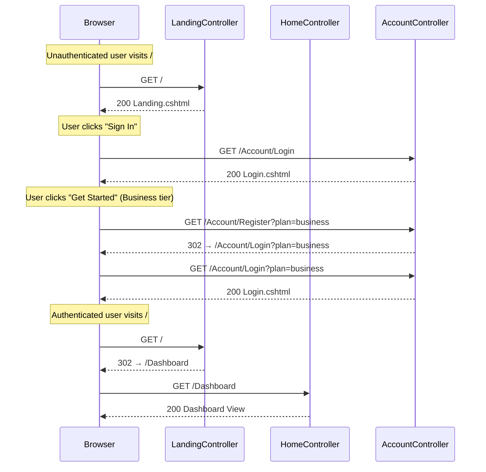

# Design Document: Landing Page Routing

## Overview

This feature introduces a public-facing landing page at the root URL (`/`) for unauthenticated visitors, while authenticated users continue to be redirected to the Dashboard. The implementation follows the existing standalone Razor view pattern (as used by the Login page) with `Layout = null` and inline CSS, faithfully reproducing the HTML mock at `.kiro/docs/LandingPage/3_inventors_portal_landing_page.html`.

The design requires:
1. A new `LandingController` that checks authentication state and either renders the landing page or redirects to `/Dashboard`
2. A standalone Razor view with all CSS inline (no external stylesheets beyond Google Fonts)
3. A registration URL placeholder that redirects `/Account/Register` to `/Account/Login`
4. SEO meta tags and responsive breakpoints at 980px and 640px

### Key Design Decisions

| Decision | Rationale |
|----------|-----------|
| New `LandingController` instead of modifying `HomeController` | `HomeController` is `[Authorize]` and tightly coupled to the Dashboard. A separate controller avoids breaking existing authenticated routing and keeps concerns separated. |
| Route attribute `[Route("/")]` on `LandingController.Index` | Overrides the default convention route for the root URL. The `HomeController.Index` remains accessible at `/Home/Index` and `/Dashboard` via a redirect. |
| `Register` action on `AccountController` | Keeps registration URL handling within the existing account flow. Simple redirect to Login with plan parameter preserved. |
| Inline CSS in the view | Matches the Login page pattern. No external CSS file needed — the landing page is self-contained. |
| No JavaScript (except smooth scroll) | The HTML mock uses no JS. CSS handles all animations and responsive behavior. Smooth scrolling is handled by `scroll-behavior: smooth` on `html`. |

## Architecture

```mermaid
flowchart TD
    A[Browser requests /] --> B{LandingController.Index}
    B -->|User.Identity.IsAuthenticated == true| C[302 Redirect to /Dashboard]
    B -->|User.Identity.IsAuthenticated == false| D[Render Landing.cshtml]
    
    E[Browser requests /Dashboard] --> F[DashboardController.Index]
    F -->|Authorize| G[Render Dashboard View]
    
    H[Browser requests /Account/Register?plan=X] --> I[AccountController.Register]
    I --> J[302 Redirect to /Account/Login?plan=X]
    
    K[Landing Page Sign In button] --> L[/Account/Login]
    M[Landing Page Get Started buttons] --> N[/Account/Register?plan=tier]
```

### Routing Changes

The current routing setup uses the convention `{controller=Home}/{action=Index}/{id?}`. The root URL (`/`) currently maps to `HomeController.Index` which requires `[Authorize]`.

**New routing strategy:**
1. `LandingController` uses `[Route("/")]` attribute routing to claim the root URL
2. `HomeController` gets a new route attribute `[Route("/Dashboard")]` on its `Index` action (or a new `DashboardController` is introduced)
3. The default convention route continues to work for all other controllers

Since `HomeController` already serves as the Dashboard, the simplest approach is to add `[Route("Dashboard")]` as an additional route on `HomeController.Index`. This way:
- `/` → `LandingController.Index` (attribute route, no auth required)
- `/Dashboard` → `HomeController.Index` (attribute route, `[Authorize]`)
- `/Home/Index` → `HomeController.Index` (convention route, `[Authorize]`)

### Authentication Flow

The `LandingController` uses `[AllowAnonymous]` and checks `User.Identity?.IsAuthenticated` to determine behavior. This avoids the authentication challenge redirect that `[Authorize]` triggers.

## Components and Interfaces

### 1. LandingController

**Location:** `Portal.Web/Controllers/LandingController.cs`

```csharp
namespace Portal.Web.Controllers;

[AllowAnonymous]
public class LandingController : Controller
{
    [HttpGet]
    [Route("/")]
    public IActionResult Index()
    {
        if (User.Identity?.IsAuthenticated == true)
        {
            return RedirectToAction("Index", "Home");
        }

        return View();
    }
}
```

**Design notes:**
- No constructor dependencies — this controller has no service layer needs
- `[Route("/")]` takes precedence over the convention route for the root URL
- Returns `RedirectToAction` which produces an HTTP 302 by default
- The view is located at `Views/Landing/Index.cshtml`

### 2. AccountController.Register (New Action)

**Location:** `Portal.Web/Controllers/AccountController.cs` (existing file, new action)

```csharp
[HttpGet]
[AllowAnonymous]
public IActionResult Register(string? plan = null)
{
    var loginUrl = string.IsNullOrWhiteSpace(plan)
        ? Url.Action("Login", "Account")
        : Url.Action("Login", "Account", new { plan });

    return Redirect(loginUrl!);
}
```

**Design notes:**
- Preserves the `plan` query parameter by passing it through to the Login URL
- `[AllowAnonymous]` since unauthenticated visitors trigger this
- Simple redirect — no view, no model

### 3. HomeController Route Update

**Location:** `Portal.Web/Controllers/HomeController.cs` (existing file, route addition)

Add `[Route("Dashboard")]` attribute to the `Index` action so authenticated users can be redirected to `/Dashboard`:

```csharp
[HttpGet]
[Route("/Dashboard")]
public async Task<IActionResult> Index()
{
    // ... existing implementation unchanged
}
```

### 4. Landing Page View

**Location:** `Portal.Web/Views/Landing/Index.cshtml`

A standalone Razor view with:
- `Layout = null`
- Full HTML document structure
- All CSS inline in a `<style>` element
- SEO meta tags in `<head>`
- Responsive breakpoints at 980px and 640px
- Content faithfully reproduced from the HTML mock

The view contains no `@model` directive — it is a static marketing page with no dynamic data.

### Component Interaction Diagram



## Data Models

This feature introduces **no new data models or database changes**. The landing page is entirely static content rendered from a Razor view. No entities, repositories, or services are required.

The only data involved is:
- `User.Identity?.IsAuthenticated` — read from the existing ASP.NET Core Identity authentication cookie
- Query parameter `plan` (string) — passed through URL routing, not persisted

## Correctness Properties

*A property is a characteristic or behavior that should hold true across all valid executions of a system — essentially, a formal statement about what the system should do. Properties serve as the bridge between human-readable specifications and machine-verifiable correctness guarantees.*

> **Note:** This feature is primarily static UI rendering and simple boolean routing, which limits the applicability of property-based testing. The properties below capture the routing invariants that must hold regardless of request context, user state, or plan parameter values.

### Property 1: Unauthenticated users always see the landing page

*For any* HTTP request to the root URL (`/`) where the user is not authenticated, the `LandingController` SHALL return a `ViewResult` (HTTP 200) rendering the landing page — never a redirect, error, or other response type.

**Validates: Requirements 1.1, 1.4**

### Property 2: Authenticated users always get redirected to Dashboard

*For any* HTTP request to the root URL (`/`) where the user is authenticated (regardless of roles, claims, or session state), the `LandingController` SHALL return an HTTP 302 redirect to `/Dashboard` — never the landing page view.

**Validates: Requirements 1.2, 1.3**

### Property 3: Registration URL redirect preserves plan parameter

*For any* string value of the `plan` query parameter (including empty, whitespace, special characters, and long strings), navigating to `/Account/Register?plan={value}` SHALL redirect to `/Account/Login?plan={value}` with the plan parameter value preserved exactly as provided.

**Validates: Requirements 8.1, 8.2, 8.3, 8.4**

### Property 4: Landing page renders without authenticated layout

*For any* rendering of the landing page view, the output HTML SHALL NOT contain the authenticated layout elements (sidebar navigation, topbar with user menu) — the view operates with `Layout = null` as a standalone document.

**Validates: Requirements 2.1**

## Error Handling

This feature has a minimal error surface due to its static nature:

| Scenario | Handling | Response |
|----------|----------|----------|
| Unauthenticated user visits `/` | Normal flow — render landing page | 200 OK |
| Authenticated user visits `/` | Redirect to Dashboard | 302 Found |
| Visit `/Account/Register` without `plan` param | Redirect to `/Account/Login` (no plan param) | 302 Found |
| Visit `/Account/Register?plan=invalid` | Redirect to `/Account/Login?plan=invalid` (pass-through, no validation) | 302 Found |
| Visit `/Account/Register?plan=business` | Redirect to `/Account/Login?plan=business` | 302 Found |
| Authentication cookie expired mid-session | ASP.NET Core Identity handles this — user sees landing page on next `/` visit | 200 OK |
| Static asset (Google Fonts) fails to load | Page renders with system fallback fonts (`system-ui, -apple-system, BlinkMacSystemFont, "Segoe UI", sans-serif`) | Graceful degradation |

**No custom error handling is required** — the controller actions are simple redirects and view renders with no service dependencies, database calls, or external API interactions that could throw exceptions.

The `LandingController` does not need try/catch blocks because:
- `User.Identity?.IsAuthenticated` is a null-safe property read from the authentication middleware
- `View()` and `RedirectToAction()` are framework methods that don't throw under normal conditions
- There are no async operations or I/O

## Testing Strategy

### Why Property-Based Testing Does Not Apply

Property-based testing is **not appropriate** for this feature because:

1. **Static UI rendering** — The landing page is a fixed HTML document with no dynamic data. There are no functions that transform varying inputs into outputs.
2. **Simple boolean routing** — The authentication check is a single `if/else` branch. There is no input space to explore — the user is either authenticated or not.
3. **Trivial URL redirect** — The registration placeholder passes a query parameter through. This is not a function with meaningful input variation.
4. **No data transformations** — No parsers, serializers, algorithms, or business logic that would benefit from randomized input testing.

### Recommended Testing Approach

#### Unit Tests (Controller Logic)

| Test | Scenario | Assertion |
|------|----------|-----------|
| `LandingController_Index_UnauthenticatedUser_ReturnsView` | User is not authenticated | Returns `ViewResult` |
| `LandingController_Index_AuthenticatedUser_RedirectsToDashboard` | User is authenticated | Returns `RedirectToActionResult` to `Index` on `Home` |
| `AccountController_Register_WithPlan_RedirectsToLoginWithPlan` | `plan=business` | Redirects to `/Account/Login?plan=business` |
| `AccountController_Register_WithoutPlan_RedirectsToLogin` | No plan parameter | Redirects to `/Account/Login` |
| `AccountController_Register_WithStarterPlan_RedirectsCorrectly` | `plan=starter` | Redirects to `/Account/Login?plan=starter` |
| `AccountController_Register_WithEnterprisePlan_RedirectsCorrectly` | `plan=enterprise` | Redirects to `/Account/Login?plan=enterprise` |

#### Integration Tests (Routing & HTTP)

| Test | Scenario | Assertion |
|------|----------|-----------|
| `RootUrl_Unauthenticated_Returns200` | Anonymous GET `/` | HTTP 200, response contains landing page HTML |
| `RootUrl_Authenticated_Returns302ToDashboard` | Authenticated GET `/` | HTTP 302, Location header = `/Dashboard` |
| `Dashboard_Unauthenticated_RedirectsToLogin` | Anonymous GET `/Dashboard` | HTTP 302, Location contains `/Account/Login` |
| `Register_WithPlan_Returns302ToLogin` | GET `/Account/Register?plan=business` | HTTP 302, Location = `/Account/Login?plan=business` |
| `LoginPage_Unchanged` | GET `/Account/Login` | HTTP 200, response matches existing Login view |

#### View Rendering Tests (Smoke Tests)

| Test | Scenario | Assertion |
|------|----------|-----------|
| `LandingPage_ContainsSeoTitle` | Render landing view | HTML contains `<title>3 Inventors Portal — Business Management Platform</title>` |
| `LandingPage_ContainsMetaDescription` | Render landing view | HTML contains meta description tag |
| `LandingPage_ContainsThemeColor` | Render landing view | HTML contains `<meta name="theme-color" content="#0D5EA6">` |
| `LandingPage_ContainsNavigation` | Render landing view | HTML contains nav links (Features, Pricing, Sign In, Get Started) |
| `LandingPage_ContainsPricingSection` | Render landing view | HTML contains all three pricing tiers |
| `LandingPage_ContainsRegistrationLinks` | Render landing view | HTML contains `/Account/Register?plan=starter`, `business`, `enterprise` |
| `LandingPage_HasResponsiveBreakpoints` | Render landing view | CSS contains `@media(max-width:980px)` and `@media(max-width:640px)` |

#### Manual Testing Checklist

- [ ] Visual comparison of rendered page against HTML mock at multiple viewport widths (1440px, 980px, 640px, 375px)
- [ ] Verify sticky navigation behavior during scroll
- [ ] Verify anchor link smooth scrolling (#features, #pricing)
- [ ] Verify Sign In button navigates to `/Account/Login`
- [ ] Verify Get Started buttons navigate to `/Account/Register?plan={tier}` and redirect to Login
- [ ] Verify authenticated user visiting `/` is redirected to Dashboard
- [ ] Verify existing Login page is unchanged
- [ ] Verify existing Dashboard continues to work at `/Dashboard`
- [ ] Verify protected routes still redirect to `/Account/Login` (not landing page)

