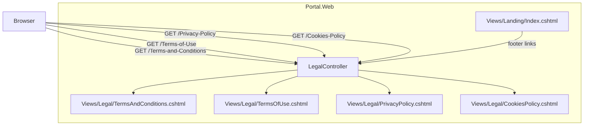

# Design Document

## Overview

This design adds four standalone legal pages (Terms & Conditions, Terms of Use, Privacy Policy, Cookie Policy) to the 3 Inventors Portal. The pages are served by a new `LegalController` with anonymous access and attribute-routed URLs. Each page is a self-contained Razor view (`Layout = null`, inline CSS) that mirrors the landing page's visual language — same colour palette, typography, background gradients, and frosted-glass card styling.

No database changes are required. The feature also updates the landing page footer to link to the actual legal page URLs instead of placeholder `#` anchors.

## Architecture



### Design Decisions

1. **Standalone views (Layout = null)** — Matches the existing landing page pattern. Legal pages are public-facing marketing content, not part of the authenticated app shell. Inline CSS avoids dependency on shared stylesheets that may change.

2. **Attribute routing with hyphenated URLs** — URLs like `/Terms-and-Conditions` are human-readable and SEO-friendly. Attribute routing (`[Route("/Terms-and-Conditions")]`) gives explicit control over URL shape without relying on convention-based routing.

3. **Single controller for all legal pages** — All four pages share the same access policy, layout structure, and navigation. A single `LegalController` keeps the routing grouped and discoverable.

4. **No shared partial views** — Although the header/footer HTML is repeated across four views, keeping each view fully self-contained (like the landing page) avoids coupling between legal pages and simplifies future per-page customisation.

## Components and Interfaces

### LegalController

```csharp
namespace Portal.Web.Controllers;

[AllowAnonymous]
public class LegalController : Controller
{
    [HttpGet]
    [Route("/Terms-and-Conditions")]
    public IActionResult TermsAndConditions() => View();

    [HttpGet]
    [Route("/Terms-of-Use")]
    public IActionResult TermsOfUse() => View();

    [HttpGet]
    [Route("/Privacy-Policy")]
    public IActionResult PrivacyPolicy() => View();

    [HttpGet]
    [Route("/Cookies-Policy")]
    public IActionResult CookiesPolicy() => View();
}
```

- Decorated with `[AllowAnonymous]` at class level (same pattern as `LandingController`)
- Each action uses `[HttpGet]` + `[Route("...")]` for explicit URL control
- No service or repository dependencies — views contain static content

### View Structure (per legal page)

Each `.cshtml` file follows this structure:

```
@{ Layout = null; }
<!DOCTYPE html>
<html lang="en">
<head>
    <!-- Meta tags, favicon links, Google Fonts (Manrope + Inter) -->
    <style>
        /* Full inline CSS — reset, variables, nav, hero, content, footer, responsive */
    </style>
</head>
<body>
    <!-- Legal_Header: sticky nav with logo, page links, Sign In + Back to Site -->
    <!-- Hero_Section: eyebrow, heading, description, last-updated -->
    <!-- Content_Card: frosted-glass container with legal text -->
    <!-- Legal_Footer: copyright + legal links -->
</body>
</html>
```

### Legal_Header Component

```html
<nav class="nav">
    <div class="container">
        <div class="nav-inner">
            <!-- Left: Logo -->
            <a class="brand" href="/">
                
            </a>
            <!-- Centre: Legal page navigation links -->
            <div class="nav-links-centre">
                <a href="/Terms-and-Conditions">Terms & Conditions</a>
                <a href="/Terms-of-Use">Terms of Use</a>
                <a href="/Privacy-Policy">Privacy Policy</a>
                <a href="/Cookies-Policy">Cookies Policy</a>
            </div>
            <!-- Right: Action buttons -->
            <div class="nav-links">
                <a class="btn btn-secondary" href="/">Back to Site</a>
                <a class="btn btn-primary" href="/Account/Login">Sign In</a>
            </div>
        </div>
    </div>
</nav>
```

- Sticky positioning with `backdrop-filter: blur(14px)` matching landing page nav
- Height: 76px (consistent with landing page)
- Current page link highlighted with active state (colour: `var(--blue)`, font-weight: 800)

### Hero_Section Component

```html
<section class="hero">
    <div class="container">
        <div class="hero-content">
            <span class="eyebrow"><span class="dot"></span> Legal & Policy</span>
            <h1>{Page Title}</h1>
            <p class="hero-desc">{Brief description of the document}</p>
            <p class="last-updated">Last updated: {date}</p>
        </div>
    </div>
</section>
```

| Page | Title | Description |
|------|-------|-------------|
| Terms & Conditions | Terms & Conditions | The rules and guidelines governing your use of the 3 Inventors Portal platform and services. |
| Terms of Use | Terms of Use | Acceptable use policies and user responsibilities when accessing the platform. |
| Privacy Policy | Privacy Policy | How we collect, use, store, and protect your personal information. |
| Cookie Policy | Cookie Policy | Information about cookies and tracking technologies used on this platform. |

### Content_Card Component

```html
<section class="content-section">
    <div class="container">
        <div class="content-card">
            <h2>{Document Title}</h2>
            <h3>{Section Heading}</h3>
            <p>{Paragraph text}</p>
            <ul>
                <li>{List item}</li>
            </ul>
            <!-- Repeated for all sections -->
        </div>
    </div>
</section>
```

- Frosted-glass styling: `background: rgba(255,255,255,.78); backdrop-filter: blur(12px); border: 1px solid rgba(13,94,166,.09); border-radius: 28px; box-shadow: 0 24px 70px rgba(13,94,166,.11)`
- Heading hierarchy: `h2` for document title, `h3` for section headings, `p` for paragraphs, `ul/li` for lists
- Max-width: 860px centred within the container for optimal reading line length
- Padding: 48px (desktop), reduced at mobile breakpoint

### Legal_Footer Component

```html
<footer class="footer-bottom">
    <div class="container">
        <div class="footer-inner">
            <span>© 2026 3 Inventors. All rights reserved.</span>
            <div class="footer-links">
                <a href="/Terms-and-Conditions">Terms & Conditions</a>
                <a href="/Terms-of-Use">Terms of Use</a>
                <a href="/Privacy-Policy">Privacy Policy</a>
                <a href="/Cookies-Policy">Cookie Policy</a>
            </div>
        </div>
    </div>
</footer>
```

- Matches the landing page `footer-bottom` pattern (horizontal bar with copyright left, links right)
- Border-top separator: `1px solid rgba(13,94,166,.08)`

### Landing Page Footer Update

The existing `Views/Landing/Index.cshtml` footer links change from:

```html
<a href="#">Terms &amp; Conditions</a>
<a href="#">Terms of Use</a>
<a href="#">Privacy Policy</a>
<a href="#">Cookie Policy</a>
```

To:

```html
<a href="/Terms-and-Conditions">Terms &amp; Conditions</a>
<a href="/Terms-of-Use">Terms of Use</a>
<a href="/Privacy-Policy">Privacy Policy</a>
<a href="/Cookies-Policy">Cookie Policy</a>
```

## Data Models

No database tables, entities, or migrations are required for this feature. All legal page content is static HTML embedded directly in the Razor views.

## Error Handling

| Scenario | Handling |
|----------|----------|
| Invalid URL (e.g., `/Terms-and-Condition` typo) | Standard ASP.NET Core 404 handling — no custom logic needed |
| Authenticated user visits legal page | Page renders normally (no redirect) — `[AllowAnonymous]` ensures access regardless of auth state |
| Missing view file | ASP.NET Core returns 500 with developer exception page (dev) or generic error page (prod) — standard framework behaviour |

No custom error handling is needed. The controller actions are simple view returns with no data dependencies that could fail.

## Testing Strategy

### Why Property-Based Testing Does Not Apply

This feature consists entirely of:
- A controller with four actions that return views (no logic, no input processing)
- Static HTML/CSS views (UI rendering)
- A one-line href change in an existing view

There are no pure functions, data transformations, parsers, serializers, or business logic with meaningful input variation. PBT is not appropriate here.

### Recommended Testing Approach

**Unit Tests (Controller)**:
- Verify each action returns a `ViewResult`
- Verify the controller class has `[AllowAnonymous]` attribute
- Verify each action has the correct `[Route]` attribute value

**Integration Tests (Routing)**:
- `GET /Terms-and-Conditions` returns 200 OK
- `GET /Terms-of-Use` returns 200 OK
- `GET /Privacy-Policy` returns 200 OK
- `GET /Cookies-Policy` returns 200 OK
- All routes accessible without authentication

**Manual/Visual Tests**:
- Legal_Header renders correctly with logo, nav links, and buttons
- Hero_Section displays correct title, description, and last-updated date per page
- Content_Card uses frosted-glass styling and proper heading hierarchy
- Legal_Footer displays copyright and links
- Responsive layout at ≤720px: single column, reduced padding, stacked footer
- Landing page footer links navigate to correct legal pages
- Active nav link is highlighted on the current page

### Responsive Design Verification

Test at viewport widths:
- **Desktop (>720px)**: Full nav links visible, content card with 48px padding, footer links horizontal
- **Mobile (≤720px)**: Nav links remain accessible (may wrap or use compact layout), content card padding reduced to 24px, footer stacks vertically (copyright above, links below)
