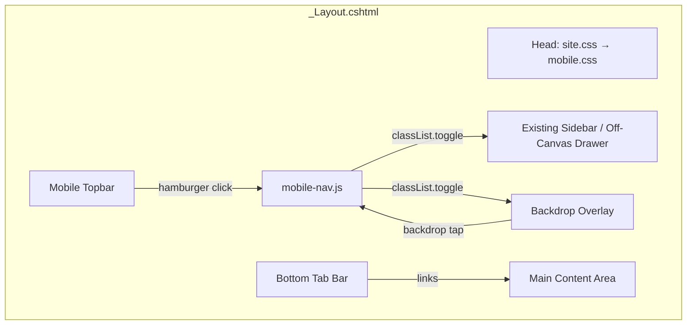

# Design Document: Mobile Responsive Layout

## Overview

This feature introduces a fully responsive mobile layout to the Portal platform — an ASP.NET Core MVC 8 multi-tenant back-office application. The existing layout uses a fixed CSS grid (`grid-template-columns: 280px 1fr`) with a single `@media (max-width:1100px)` breakpoint that currently hides the sidebar entirely, leaving mobile users without navigation.

The solution is purely additive: a dedicated `mobile.css` stylesheet loaded after `site.css` provides responsive overrides via media queries, while minimal HTML additions to `_Layout.cshtml` introduce the mobile topbar, off-canvas drawer, backdrop, and bottom tab bar. Vanilla JavaScript handles mobile interactions, reusing the existing `classList.toggle` pattern. Desktop layout remains completely untouched above 1100px.

### Design Decisions

| Decision | Rationale |
|----------|-----------|
| Separate `mobile.css` file | Isolation of responsive rules prevents desktop regression; easier maintenance |
| Media queries only (no JS-based breakpoints) | Pure CSS approach is performant, standards-compliant, and doesn't require resize listeners |
| Vanilla JS interactions | No new dependencies; consistent with existing sidebar toggle pattern |
| Two breakpoints (768px / 1100px) | Covers phone and tablet; aligns with existing 1100px collapse point |
| Off-canvas drawer reuses sidebar content | Single source of truth for navigation; no duplicate markup beyond wrapper |
| Bottom tab bar for phone only | Quick module access on the smallest screens where drawer access is slower |

## Architecture

### Component Diagram



### File Structure

```
Portal.Web/
├── Views/Shared/
│   └── _Layout.cshtml          (modified — add topbar, bottom bar, backdrop elements)
├── wwwroot/css/
│   ├── site.css                (unchanged)
│   └── mobile.css              (new — all responsive rules)
└── wwwroot/js/
    └── mobile-nav.js           (new — drawer/topbar/account interactions)
```

### Breakpoint Strategy

| Viewport | Range | Behaviour |
|----------|-------|-----------|
| Desktop | > 1100px | Existing layout unchanged; mobile elements hidden |
| Tablet | 769px – 1100px | Topbar visible, sidebar hidden, content full-width (18px padding), grids collapse to 2-col |
| Phone | ≤ 768px | Topbar visible, bottom tab bar visible, content full-width (16px padding), grids collapse to 1-col |

## Components and Interfaces

### 1. Mobile Topbar (`<header class="mobile-topbar">`)

**Location**: Immediately inside `.app` before `<aside class="sidebar">`

**Structure**:
```html
<header class="mobile-topbar">
    <button class="mobile-topbar__hamburger" aria-label="Open navigation">
        <!-- SVG hamburger icon -->
    </button>
    <a class="mobile-topbar__logo" href="/">
        
    </a>
    <button class="mobile-topbar__avatar" aria-label="Account menu">
        <!-- User initials or avatar -->
    </button>
</header>
```

**CSS Behaviour**:
- Hidden above 1100px (`display: none`)
- Sticky at top, `z-index: 100`
- Semi-transparent white background with `backdrop-filter: blur(10px)`
- Flex layout: hamburger left, logo center, avatar right

### 2. Off-Canvas Drawer (repurposes existing `<aside class="sidebar">`)

The existing sidebar markup stays intact. On mobile viewports, CSS transforms it into a fixed off-canvas panel:

**CSS Behaviour** (≤ 1100px):
- `position: fixed; top: 0; left: -280px; width: 280px; height: 100vh; z-index: 300`
- Transition: `left .3s cubic-bezier(.4, 0, .2, 1)`
- When `.drawer-open` class is on the `#appShell`: `left: 0`
- Overflow-y: auto for scrollable nav content

**JS Interface**:
- `openDrawer()` — adds `.drawer-open` to `#appShell`
- `closeDrawer()` — removes `.drawer-open` from `#appShell`

### 3. Backdrop (`<div class="mobile-backdrop">`)

**Location**: After the sidebar element, before `<main>`

**CSS Behaviour**:
- `position: fixed; inset: 0; z-index: 200`
- `background: rgba(0, 0, 0, 0.4)`
- Hidden by default (`opacity: 0; pointer-events: none`)
- When `.drawer-open` on `#appShell`: `opacity: 1; pointer-events: auto`
- Transition: `opacity .25s`

### 4. Bottom Tab Bar (`<nav class="bottom-tab-bar">`)

**Location**: After `<main>`, before closing `</div>` of `.app`

**Structure**:
```html
<nav class="bottom-tab-bar" aria-label="Quick navigation">
    <a href="/" class="bottom-tab-bar__item @(active)">
        <!-- SVG icon -->
        <span>Dashboard</span>
    </a>
    <a href="/Quotation" class="bottom-tab-bar__item">
        <!-- SVG icon -->
        <span>Quotes</span>
    </a>
    <a href="/Invoice" class="bottom-tab-bar__item">
        <!-- SVG icon -->
        <span>Invoices</span>
    </a>
    <a href="/Revenue" class="bottom-tab-bar__item">
        <!-- SVG icon -->
        <span>Revenue</span>
    </a>
</nav>
```

**CSS Behaviour**:
- Hidden above 768px (`display: none`)
- Phone: `position: fixed; bottom: 0; left: 0; right: 0; z-index: 50`
- Flex with `justify-content: space-around`
- Semi-transparent white background with `backdrop-filter: blur(10px)`
- Active item highlighted with `color: var(--blue)`
- Content area gets `padding-bottom` equal to tab bar height (~60px)

### 5. Mobile Account Dropdown

**Triggered by**: Avatar button in Mobile Topbar

**Behaviour**:
- On phone/tablet, the desktop `#accountMenu` is hidden via CSS (`display: none`)
- The mobile topbar avatar opens a dropdown positioned below the avatar (absolute, right-aligned)
- Contains: signed-in identity, billing link (owners only), sign-out action
- Closed when tapping outside (reuses existing click-outside pattern)

### 6. Responsive Content Adaptations

**Tables** (≤ 1100px):
- Wrapped in scrollable container: `overflow-x: auto; -webkit-overflow-scrolling: touch`
- Scroll hint text visible above table: `← Scroll horizontally →`
- Table maintains desktop `min-width` to preserve column structure

**Grids** (Phone):
- `.grid-4`, `.grid-3`, `.grid-2`, `.form-grid` → `grid-template-columns: 1fr`
- `.gauge-row` → `grid-template-columns: 1fr 1fr`

**Grids** (Tablet):
- `.grid-4`, `.grid-3` → `grid-template-columns: 1fr 1fr`
- `.grid-2`, `.form-grid` → retain `1fr 1fr`
- `.gauge-row` → `grid-template-columns: 1fr 1fr`

**Filters** (Phone):
- All filter panels → `flex-direction: column; width: 100%`
- Filter buttons → full-width stacked or split-row

**Action Buttons** (Phone):
- `.btn-primary`, `.btn-green`, `.btn-danger` inside `.content` → `width: 100%; display: block`

### 7. JavaScript Module (`mobile-nav.js`)

**Responsibilities**:
- Hamburger click → open drawer
- Close button click → close drawer
- Backdrop tap → close drawer
- Navigation link click → close drawer
- Avatar click → toggle mobile account dropdown
- Outside click → close account dropdown

**Pattern** (matching existing code style):
```javascript
(function() {
    var appShell = document.getElementById('appShell');
    // Event listeners using classList.toggle / classList.add / classList.remove
    // No frameworks, no dependencies
})();
```

## Data Models

This feature is purely a front-end/CSS concern. No database tables, entities, or API endpoints are affected. The data models relevant to this feature are limited to the rendering context in `_Layout.cshtml`:

### View Context Data (already available)

| Data | Source | Usage |
|------|--------|-------|
| `currentController` | `ViewContext.RouteData.Values["controller"]` | Highlight active nav item and bottom tab |
| `User.Identity?.Name` | ASP.NET Identity claims | Display in mobile account dropdown |
| `User.HasClaim("IsOwner", "true")` | Identity claims | Show/hide billing link in mobile account menu |
| `User.IsInRole("SuperAdmin")` | Identity roles | Show/hide admin nav items in drawer |
| Module permissions | `ModuleNavigationViewComponent` | Render drawer nav items (via existing ViewComponent) |

### CSS Custom Properties (reused from `site.css`)

| Variable | Value | Mobile Usage |
|----------|-------|--------------|
| `--bg` | `#F7FAFC` | Page background |
| `--bg2` | `#EEF4F8` | Secondary surfaces |
| `--blue` | `#0D5EA6` | Active tab, active nav highlight |
| `--cyan` | `#57B8E8` | Accent elements |
| `--line` | `rgba(13,94,166,.10)` | Borders, dividers |
| `--muted` | `#5E7385` | Inactive tab text, scroll hint |
| `--text` | `#0B1B28` | Body text |

No new CSS variables are introduced — the mobile stylesheet exclusively uses the existing design system tokens.


## Correctness Properties

*Property-based testing is not applicable to this feature.*

This feature consists entirely of:
- **CSS media query rules** — declarative rendering at specific viewport widths
- **Simple JS class toggles** — `classList.add/remove` for open/close states
- **HTML structural additions** — static elements added to `_Layout.cshtml`

None of these have the characteristics that make PBT valuable:
- There is no meaningful input variation (breakpoints are fixed values, not a range of inputs)
- There are no pure functions with input/output behaviour to verify
- There are no parsers, serializers, or data transformations
- Behaviour is fully determined by viewport width, not by variable user data

The appropriate testing strategy for this feature is **example-based viewport testing** (Playwright at specific widths) and **visual regression testing**.

## Error Handling

This feature introduces no server-side logic, API calls, or data mutations. Error handling considerations are limited to:

### CSS Graceful Degradation

| Scenario | Handling |
|----------|----------|
| Browser doesn't support `backdrop-filter` | Topbar and bottom bar fallback to solid `background: rgba(255,255,255,.97)` — no blur but fully functional |
| Browser doesn't support CSS Grid | Unlikely for target audience (modern mobile browsers); flexbox fallback not needed |
| `mobile.css` fails to load (CDN/network issue) | Existing `site.css` responsive rule already collapses to single column at ≤1100px; users have basic mobile access |

### JavaScript Error Resilience

| Scenario | Handling |
|----------|----------|
| `mobile-nav.js` fails to load | Navigation remains accessible via direct URL entry; drawer cannot open but page content is still usable |
| `document.getElementById('appShell')` returns null | Guard with null check before attaching listeners; fail silently |
| User rapidly taps hamburger/close | CSS transitions handle interrupted animations gracefully via `transition` property (browser handles mid-animation state changes) |

### Accessibility Fallbacks

| Scenario | Handling |
|----------|----------|
| Screen reader user | `aria-label` on hamburger button, `aria-hidden` on backdrop, semantic `<nav>` for tab bar |
| Keyboard navigation | Drawer close on `Escape` key press; focus trap inside open drawer |
| Reduced motion preference | `@media (prefers-reduced-motion: reduce)` disables transitions in `mobile.css` |

## Testing Strategy

### Testing Approach

Since property-based testing is not applicable (see Correctness Properties section), this feature uses:

1. **Manual viewport testing** — Primary validation during development
2. **Automated Playwright tests** — Example-based tests at specific viewport widths
3. **Visual regression tests** — Screenshot comparison at breakpoints

### Automated Test Plan (Playwright)

#### Viewport Configurations

| Name | Width × Height | Purpose |
|------|----------------|---------|
| iPhone SE | 375 × 667 | Small phone |
| iPhone 14 | 390 × 844 | Standard phone |
| iPad Mini | 768 × 1024 | Breakpoint boundary |
| iPad | 810 × 1080 | Tablet |
| Laptop | 1200 × 800 | Desktop (no mobile elements) |

#### Test Suites

**Suite 1: Element Visibility by Viewport**
- At 375px: topbar visible, bottom tab bar visible, sidebar hidden, desktop account menu hidden
- At 900px: topbar visible, bottom tab bar hidden, sidebar hidden, desktop account menu hidden
- At 1200px: topbar hidden, bottom tab bar hidden, sidebar visible, desktop account menu visible

**Suite 2: Off-Canvas Drawer Interactions**
- Click hamburger → drawer visible (left: 0), backdrop visible
- Click backdrop → drawer hidden, backdrop hidden
- Click close button → drawer hidden, backdrop hidden
- Click nav link → drawer closes, page navigates

**Suite 3: Grid Collapse Rules**
- At 375px: `.grid-4` is 1-column, `.gauge-row` is 2-column
- At 900px: `.grid-4` is 2-column, `.gauge-row` is 2-column
- At 1200px: `.grid-4` is 4-column, `.gauge-row` is 4-column

**Suite 4: Table Scroll Behaviour**
- At 375px: table container has `overflow-x: auto`
- Scroll hint text is visible above table

**Suite 5: Action Buttons**
- At 375px: `.btn-primary` in content is full-width
- At 900px: `.btn-primary` in content retains intrinsic width

**Suite 6: Filter Stacking**
- At 375px: filter panel children are stacked vertically
- At 900px: filter panel allows side-by-side fields

**Suite 7: Account Menu (Mobile)**
- At 375px: click avatar → mobile dropdown appears with expected items
- At 1200px: desktop account menu functions normally

**Suite 8: Bottom Tab Bar**
- At 375px: tab bar is fixed at bottom, correct 4 items displayed
- Active tab matches current controller route
- Page content has bottom padding to avoid obscured content

**Suite 9: Desktop Preservation**
- At 1200px: grid is `280px 1fr`, sidebar toggle works, no mobile elements visible
- Sidebar collapse/expand via existing toggle persists in localStorage

### Manual Testing Checklist

- [ ] All portal views checked on iPhone (Safari) — no horizontal overflow
- [ ] All portal views checked on iPad (Safari) — 2-column layouts correct
- [ ] Drawer opens/closes smoothly (no jank)
- [ ] Drawer closes when navigating between pages
- [ ] Bottom tab bar highlights correct active module
- [ ] Account dropdown works from mobile topbar avatar
- [ ] Desktop layout completely unchanged at 1440px
- [ ] Reduced motion: transitions disabled with `prefers-reduced-motion`
- [ ] Landscape phone orientation — layout still usable
- [ ] Existing sidebar toggle still works on desktop after changes

### Test Coverage Mapping

| Requirement | Test Type | Suite |
|-------------|-----------|-------|
| Req 1 (Stylesheet loading) | Smoke | HTML inspection |
| Req 2 (Mobile Topbar) | Example | Suite 1, 7 |
| Req 3 (Off-Canvas Drawer) | Example | Suite 2 |
| Req 4 (Responsive Content) | Example | Suite 1 |
| Req 5 (Scrollable Tables) | Example | Suite 4 |
| Req 6 (Grid Collapse) | Example | Suite 3 |
| Req 7 (Stacked Filters) | Example | Suite 6 |
| Req 8 (Full-Width Buttons) | Example | Suite 5 |
| Req 9 (Bottom Tab Bar) | Example | Suite 8 |
| Req 10 (Account Menu) | Example | Suite 7 |
| Req 11 (Desktop Preservation) | Example | Suite 9 |
| Req 12 (Vanilla JS) | Smoke | Code review |
| Req 13 (HTML Additions) | Smoke | HTML inspection |
| Req 14 (Per-View Adaptation) | Visual Regression | Manual + screenshots |
