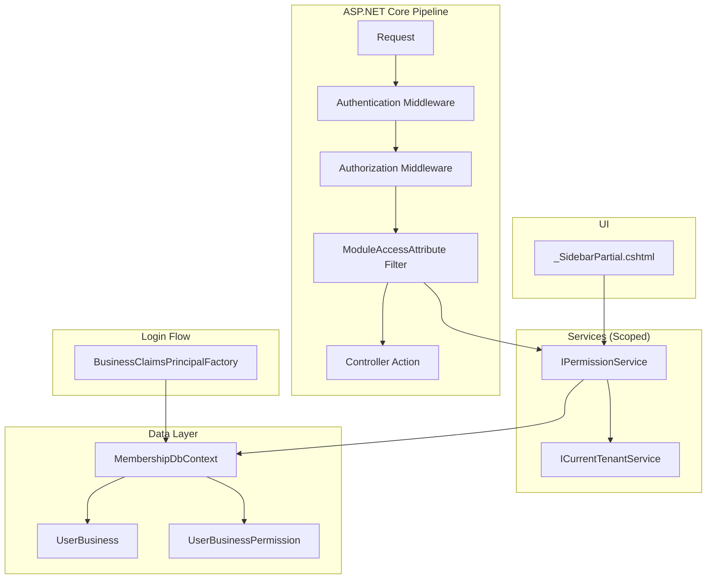
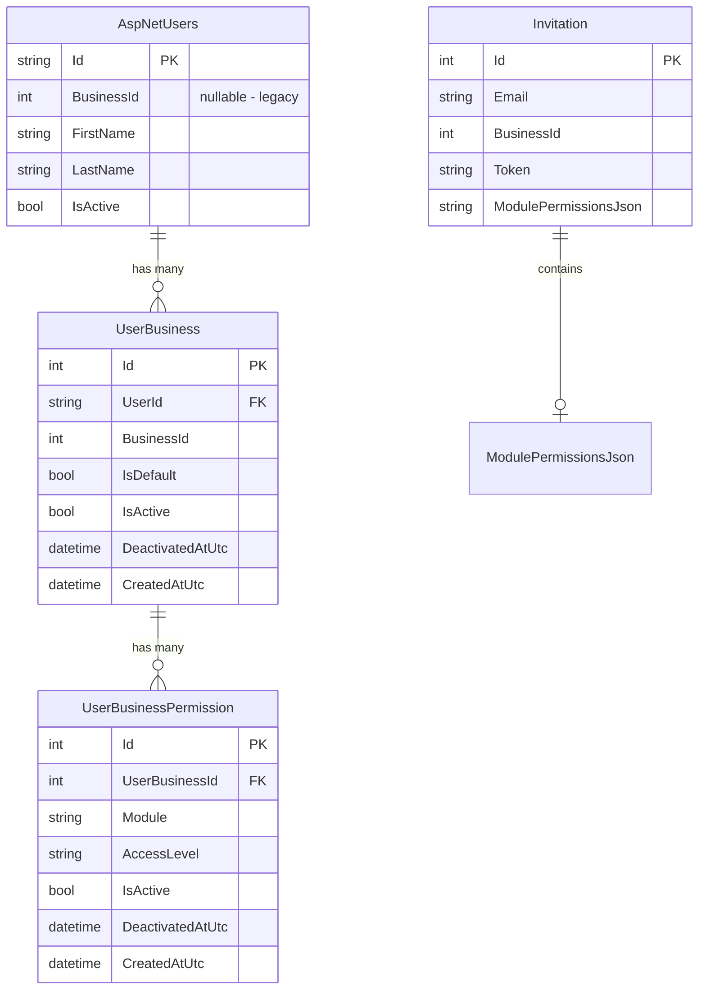

# Design Document: Multi-Business Permissions

## Overview

This design introduces a multi-business membership model with granular per-module permissions into the Portal platform. Currently, `ApplicationUser.BusinessId` binds each user to a single business. The new model replaces this with a `UserBusiness` junction table (one-to-many) and a `UserBusinessPermission` child table that grants module-level access (`full`, `readonly`, `none`) per mapping.

The system enforces permissions at runtime via a custom `IAuthorizationFilter` attribute (`ModuleAccessAttribute`) and hides inaccessible modules from the sidebar. A `PermissionService` centralizes all permission queries. The `BusinessClaimsPrincipalFactory` is updated to resolve the `BusinessId` claim from the user's default `UserBusiness` record rather than `ApplicationUser.BusinessId`.

Backward compatibility is maintained: the `BusinessId` claim type and `ICurrentTenantService` contract remain unchanged. Existing users are migrated via a one-time SQL script that creates `UserBusiness` + full-access permission records from their current `ApplicationUser.BusinessId`.

## Architecture



### Key Design Decisions

1. **EF Core over raw SQL for permission queries** — Permission lookups are simple key-based reads that benefit from EF Core's change tracking and LINQ composition. No stored procedures needed.
2. **IAuthorizationFilter (not policy-based auth)** — A filter attribute is simpler to apply declaratively per-action and avoids the complexity of dynamic policy registration for 7 modules × 2 access levels.
3. **Invitation stores permissions in a JSON column** — Adding a separate `InvitationPermission` table adds migration complexity for a transient entity. A JSON column (`ModulePermissionsJson`) on the existing `Invitation` table is sufficient since invitations are short-lived and never queried by module.
4. **No caching in PermissionService** — Permissions are scoped per-request. The query hits a small table with indexed lookups. Caching adds invalidation complexity without measurable benefit at current scale.
5. **ViewComponent for sidebar filtering** — A `ModuleNavigationViewComponent` encapsulates the permission query and renders only accessible menu items, keeping layout views clean.

## Components and Interfaces

### New Entities

#### UserBusiness

```csharp
namespace Portal.Infrastructure.Entities.Identity;

public class UserBusiness
{
    public int Id { get; set; }
    public string UserId { get; set; } = null!;
    public int BusinessId { get; set; }
    public bool IsDefault { get; set; }
    public bool IsActive { get; set; } = true;
    public DateTime? DeactivatedAtUtc { get; set; }
    public DateTime CreatedAtUtc { get; set; } = DateTime.UtcNow;

    // Navigation
    public ApplicationUser User { get; set; } = null!;
}
```

#### UserBusinessPermission

```csharp
namespace Portal.Infrastructure.Entities.Identity;

public class UserBusinessPermission
{
    public int Id { get; set; }
    public int UserBusinessId { get; set; }
    public string Module { get; set; } = null!;
    public string AccessLevel { get; set; } = null!;
    public bool IsActive { get; set; } = true;
    public DateTime? DeactivatedAtUtc { get; set; }
    public DateTime CreatedAtUtc { get; set; } = DateTime.UtcNow;

    // Navigation
    public UserBusiness UserBusiness { get; set; } = null!;
}
```

### Enums / Constants

```csharp
namespace Portal.Infrastructure.Constants;

public static class PortalModules
{
    public const string Customer = "customer";
    public const string Quotation = "quotation";
    public const string Invoice = "invoice";
    public const string Revenue = "revenue";
    public const string Purchase = "purchase";
    public const string Vat = "vat";
    public const string Audit = "audit";

    public static readonly string[] All = { Customer, Quotation, Invoice, Revenue, Purchase, Vat, Audit };

    public static bool IsValid(string module) => All.Contains(module);
}

public static class AccessLevels
{
    public const string Full = "full";
    public const string ReadOnly = "readonly";
    public const string None = "none";

    public static readonly string[] All = { Full, ReadOnly, None };

    public static bool IsValid(string level) => All.Contains(level);

    /// <summary>
    /// Returns true if 'actual' meets or exceeds 'required'.
    /// Hierarchy: full > readonly > none
    /// </summary>
    public static bool MeetsRequirement(string actual, string required)
    {
        if (actual == Full) return true;
        if (actual == ReadOnly && required == ReadOnly) return true;
        return false;
    }
}
```

### IPermissionService

```csharp
namespace Portal.Infrastructure.Services;

public interface IPermissionService
{
    /// <summary>
    /// Gets the access level for a specific module. Returns "none" if no active record exists.
    /// Uses ICurrentTenantService.CurrentBusinessId when businessId is null.
    /// </summary>
    Task<string> GetAccessLevelAsync(string userId, string module, int? businessId = null);

    /// <summary>
    /// Gets all module access levels for the current user/business combination.
    /// Returns a dictionary of module → accessLevel.
    /// </summary>
    Task<Dictionary<string, string>> GetAllAccessLevelsAsync(string userId, int? businessId = null);
}
```

### PermissionService Implementation

```csharp
namespace Portal.Infrastructure.Services;

public class PermissionService : IPermissionService
{
    private readonly MembershipDbContext _dbContext;
    private readonly ICurrentTenantService _tenantService;

    public PermissionService(MembershipDbContext dbContext, ICurrentTenantService tenantService)
    {
        _dbContext = dbContext;
        _tenantService = tenantService;
    }

    public async Task<string> GetAccessLevelAsync(string userId, string module, int? businessId = null)
    {
        try
        {
            var resolvedBusinessId = businessId ?? _tenantService.CurrentBusinessId;

            var permission = await _dbContext.UserBusinessPermissions
                .Where(p => p.UserBusiness.UserId == userId
                         && p.UserBusiness.BusinessId == resolvedBusinessId
                         && p.UserBusiness.IsActive
                         && p.Module == module
                         && p.IsActive)
                .Select(p => p.AccessLevel)
                .FirstOrDefaultAsync();

            return permission ?? AccessLevels.None;
        }
        catch (Exception)
        {
            throw;
        }
    }

    public async Task<Dictionary<string, string>> GetAllAccessLevelsAsync(string userId, int? businessId = null)
    {
        try
        {
            var resolvedBusinessId = businessId ?? _tenantService.CurrentBusinessId;

            var permissions = await _dbContext.UserBusinessPermissions
                .Where(p => p.UserBusiness.UserId == userId
                         && p.UserBusiness.BusinessId == resolvedBusinessId
                         && p.UserBusiness.IsActive
                         && p.IsActive)
                .ToDictionaryAsync(p => p.Module, p => p.AccessLevel);

            return permissions;
        }
        catch (Exception)
        {
            throw;
        }
    }
}
```

### ModuleAccessAttribute (Authorization Filter)

```csharp
namespace Portal.Web.Security;

[AttributeUsage(AttributeTargets.Class | AttributeTargets.Method, AllowMultiple = true)]
public class ModuleAccessAttribute : Attribute, IAsyncAuthorizationFilter
{
    public string Module { get; }
    public string RequiredLevel { get; }

    public ModuleAccessAttribute(string module, string requiredLevel = AccessLevels.ReadOnly)
    {
        Module = module;
        RequiredLevel = requiredLevel;
    }

    public async Task OnAuthorizationAsync(AuthorizationFilterContext context)
    {
        var user = context.HttpContext.User;

        // SuperAdmin bypasses all checks
        if (user.IsInRole("SuperAdmin"))
            return;

        var userId = user.FindFirstValue(ClaimTypes.NameIdentifier);
        if (string.IsNullOrEmpty(userId))
        {
            context.Result = new ForbidResult();
            return;
        }

        var permissionService = context.HttpContext.RequestServices
            .GetRequiredService<IPermissionService>();

        var accessLevel = await permissionService.GetAccessLevelAsync(userId, Module);

        if (!AccessLevels.MeetsRequirement(accessLevel, RequiredLevel))
        {
            context.Result = new ForbidResult();
        }
    }
}
```

### Updated BusinessClaimsPrincipalFactory

```csharp
namespace Portal.Web.Security;

public class BusinessClaimsPrincipalFactory : UserClaimsPrincipalFactory<ApplicationUser, IdentityRole>
{
    private readonly MembershipDbContext _membershipDbContext;

    public BusinessClaimsPrincipalFactory(
        UserManager<ApplicationUser> userManager,
        RoleManager<IdentityRole> roleManager,
        IOptions<IdentityOptions> options,
        MembershipDbContext membershipDbContext)
        : base(userManager, roleManager, options)
    {
        _membershipDbContext = membershipDbContext;
    }

    protected override async Task<ClaimsIdentity> GenerateClaimsAsync(ApplicationUser user)
    {
        var identity = await base.GenerateClaimsAsync(user);

        // Try new model first: resolve from UserBusiness
        var defaultBusiness = await _membershipDbContext.UserBusinesses
            .Where(ub => ub.UserId == user.Id && ub.IsDefault && ub.IsActive)
            .Select(ub => ub.BusinessId)
            .FirstOrDefaultAsync();

        if (defaultBusiness > 0)
        {
            identity.AddClaim(new Claim("BusinessId", defaultBusiness.ToString()));
        }
        else if (user.BusinessId.HasValue)
        {
            // Fallback: legacy single-business field (backward compatibility during transition)
            identity.AddClaim(new Claim("BusinessId", user.BusinessId.Value.ToString()));
        }

        return identity;
    }
}
```

### ModuleNavigationViewComponent

```csharp
namespace Portal.Web.ViewComponents;

public class ModuleNavigationViewComponent : ViewComponent
{
    private readonly IPermissionService _permissionService;

    public ModuleNavigationViewComponent(IPermissionService permissionService)
    {
        _permissionService = permissionService;
    }

    public async Task<IViewComponentResult> InvokeAsync()
    {
        var userId = UserClaimsPrincipal.FindFirstValue(ClaimTypes.NameIdentifier);
        var isSuperAdmin = UserClaimsPrincipal.IsInRole("SuperAdmin");

        Dictionary<string, string> permissions;

        if (isSuperAdmin)
        {
            // SuperAdmin sees everything
            permissions = PortalModules.All.ToDictionary(m => m, _ => AccessLevels.Full);
        }
        else if (!string.IsNullOrEmpty(userId))
        {
            permissions = await _permissionService.GetAllAccessLevelsAsync(userId);
        }
        else
        {
            permissions = new Dictionary<string, string>();
        }

        return View(permissions);
    }
}
```

### Updated Invitation Entity

```csharp
// Added property to existing Invitation class
public class Invitation
{
    // ... existing properties ...

    /// <summary>
    /// JSON-serialized list of module permissions to apply on registration.
    /// Format: [{"Module":"customer","AccessLevel":"full"}, ...]
    /// </summary>
    public string? ModulePermissionsJson { get; set; }
}
```

### Invitation Permission DTO

```csharp
namespace Portal.Infrastructure.Models;

public class InvitationModulePermission
{
    public string Module { get; set; } = null!;
    public string AccessLevel { get; set; } = null!;
}
```

## Data Models

### Database Schema (Membership Database)

```sql
-- [membership].[UserBusiness]
CREATE TABLE [membership].[UserBusiness] (
    [Id]               INT IDENTITY(1,1) NOT NULL,
    [UserId]           NVARCHAR(450) NOT NULL,
    [BusinessId]       INT NOT NULL,
    [IsDefault]        BIT NOT NULL DEFAULT 0,
    [IsActive]         BIT NOT NULL DEFAULT 1,
    [DeactivatedAtUtc] DATETIME2 NULL,
    [CreatedAtUtc]     DATETIME2 NOT NULL DEFAULT GETUTCDATE(),
    CONSTRAINT [PK_UserBusiness] PRIMARY KEY CLUSTERED ([Id]),
    CONSTRAINT [FK_UserBusiness_AspNetUsers] FOREIGN KEY ([UserId])
        REFERENCES [dbo].[AspNetUsers] ([Id]),
    CONSTRAINT [UQ_UserBusiness_UserId_BusinessId] UNIQUE ([UserId], [BusinessId])
);

CREATE NONCLUSTERED INDEX [IX_UserBusiness_UserId_IsActive]
    ON [membership].[UserBusiness] ([UserId], [IsActive])
    INCLUDE ([BusinessId], [IsDefault]);
```

```sql
-- [membership].[UserBusinessPermission]
CREATE TABLE [membership].[UserBusinessPermission] (
    [Id]               INT IDENTITY(1,1) NOT NULL,
    [UserBusinessId]   INT NOT NULL,
    [Module]           NVARCHAR(50) NOT NULL,
    [AccessLevel]      NVARCHAR(20) NOT NULL,
    [IsActive]         BIT NOT NULL DEFAULT 1,
    [DeactivatedAtUtc] DATETIME2 NULL,
    [CreatedAtUtc]     DATETIME2 NOT NULL DEFAULT GETUTCDATE(),
    CONSTRAINT [PK_UserBusinessPermission] PRIMARY KEY CLUSTERED ([Id]),
    CONSTRAINT [FK_UserBusinessPermission_UserBusiness] FOREIGN KEY ([UserBusinessId])
        REFERENCES [membership].[UserBusiness] ([Id]),
    CONSTRAINT [UQ_UserBusinessPermission_UserBusinessId_Module] UNIQUE ([UserBusinessId], [Module]),
    CONSTRAINT [CK_UserBusinessPermission_Module] CHECK (
        [Module] IN ('customer', 'quotation', 'invoice', 'revenue', 'purchase', 'vat', 'audit')
    ),
    CONSTRAINT [CK_UserBusinessPermission_AccessLevel] CHECK (
        [AccessLevel] IN ('full', 'readonly', 'none')
    )
);

CREATE NONCLUSTERED INDEX [IX_UserBusinessPermission_UserBusinessId_IsActive]
    ON [membership].[UserBusinessPermission] ([UserBusinessId], [IsActive])
    INCLUDE ([Module], [AccessLevel]);
```

```sql
-- Add ModulePermissionsJson to Invitations
ALTER TABLE [dbo].[Invitations]
    ADD [ModulePermissionsJson] NVARCHAR(MAX) NULL;
```

### MembershipDbContext Updates

```csharp
public class MembershipDbContext : IdentityDbContext<ApplicationUser, IdentityRole, string>
{
    // ... existing constructor ...

    public DbSet<Invitation> Invitations { get; set; } = null!;
    public DbSet<UserBusiness> UserBusinesses { get; set; } = null!;
    public DbSet<UserBusinessPermission> UserBusinessPermissions { get; set; } = null!;

    protected override void OnModelCreating(ModelBuilder builder)
    {
        base.OnModelCreating(builder);

        // Existing Invitation config...

        builder.Entity<UserBusiness>(entity =>
        {
            entity.ToTable("UserBusiness", "membership");
            entity.HasKey(e => e.Id);
            entity.HasIndex(e => new { e.UserId, e.BusinessId }).IsUnique();
            entity.Property(e => e.UserId).HasMaxLength(450).IsRequired();
            entity.HasOne(e => e.User)
                  .WithMany()
                  .HasForeignKey(e => e.UserId)
                  .OnDelete(DeleteBehavior.NoAction);
        });

        builder.Entity<UserBusinessPermission>(entity =>
        {
            entity.ToTable("UserBusinessPermission", "membership");
            entity.HasKey(e => e.Id);
            entity.HasIndex(e => new { e.UserBusinessId, e.Module }).IsUnique();
            entity.Property(e => e.Module).HasMaxLength(50).IsRequired();
            entity.Property(e => e.AccessLevel).HasMaxLength(20).IsRequired();
            entity.HasOne(e => e.UserBusiness)
                  .WithMany()
                  .HasForeignKey(e => e.UserBusinessId)
                  .OnDelete(DeleteBehavior.NoAction);
        });
    }
}
```

### Entity Relationship Diagram



### Data Migration Script

```sql
-- Migration: Create UserBusiness records from existing ApplicationUser.BusinessId
-- Run ONCE after deploying the new schema

INSERT INTO [membership].[UserBusiness] ([UserId], [BusinessId], [IsDefault], [IsActive], [CreatedAtUtc])
SELECT
    AspNetUsers.[Id],
    AspNetUsers.[BusinessId],
    1,  -- IsDefault
    1,  -- IsActive
    GETUTCDATE()
FROM [dbo].[AspNetUsers]
WHERE AspNetUsers.[BusinessId] IS NOT NULL
  AND AspNetUsers.[IsActive] = 1;

-- Grant full access to all modules for migrated users
INSERT INTO [membership].[UserBusinessPermission] ([UserBusinessId], [Module], [AccessLevel], [IsActive], [CreatedAtUtc])
SELECT
    UserBusiness.[Id],
    Modules.[Module],
    'full',
    1,
    GETUTCDATE()
FROM [membership].[UserBusiness]
CROSS JOIN (
    VALUES ('customer'), ('quotation'), ('invoice'), ('revenue'), ('purchase'), ('vat'), ('audit')
) AS Modules([Module])
WHERE UserBusiness.[IsActive] = 1;
```

### DI Registration Changes (Program.cs)

```csharp
// Add after existing service registrations:
builder.Services.AddScoped<IPermissionService, PermissionService>();
```

No other DI changes needed — `MembershipDbContext` and `ICurrentTenantService` are already registered as scoped.


## Correctness Properties

*A property is a characteristic or behavior that should hold true across all valid executions of a system — essentially, a formal statement about what the system should do. Properties serve as the bridge between human-readable specifications and machine-verifiable correctness guarantees.*

### Property 1: Unique constraint enforcement

*For any* user and business combination, attempting to create a second `UserBusiness` record with the same `(UserId, BusinessId)` pair shall be rejected. Similarly, *for any* `UserBusiness` and module combination, attempting to create a second `UserBusinessPermission` with the same `(UserBusinessId, Module)` pair shall be rejected.

**Validates: Requirements 1.2, 2.2**

### Property 2: Default business invariant

*For any* user with one or more active `UserBusiness` records, exactly one record shall have `IsDefault = true`. Setting a new default shall unset the previous default atomically.

**Validates: Requirements 1.3**

### Property 3: Soft-delete sets correct fields

*For any* active `UserBusiness` or `UserBusinessPermission` record, calling the deactivation operation shall result in `IsActive = false` and `DeactivatedAtUtc` being set to a value within a small tolerance of the current UTC time.

**Validates: Requirements 3.1, 3.2**

### Property 4: Module and AccessLevel validation rejects invalid values

*For any* string that is not in the set `{customer, quotation, invoice, revenue, purchase, vat, audit}`, the system shall reject it as a module name. *For any* string that is not in the set `{full, readonly, none}`, the system shall reject it as an access level. This applies to both invitation creation and direct permission assignment.

**Validates: Requirements 2.3, 2.4, 4.5, 4.6**

### Property 5: Registration round-trip preserves invitation permissions

*For any* valid invitation containing N module-access-level pairs, completing registration shall produce exactly one `UserBusiness` record with `IsDefault = true` and exactly N `UserBusinessPermission` records whose `(Module, AccessLevel)` pairs match the invitation specification.

**Validates: Requirements 4.2, 4.3**

### Property 6: PermissionService returns "none" for inactive or missing records

*For any* `(userId, businessId, module)` combination where either no `UserBusinessPermission` record exists, or the `UserBusiness.IsActive` is false, or the `UserBusinessPermission.IsActive` is false, `GetAccessLevelAsync` shall return `"none"`.

**Validates: Requirements 3.3, 5.2, 5.3**

### Property 7: PermissionService tenant fallback equivalence

*For any* call to `GetAccessLevelAsync(userId, module, businessId: null)`, the result shall equal the result of `GetAccessLevelAsync(userId, module, businessId: ICurrentTenantService.CurrentBusinessId)`.

**Validates: Requirements 5.4**

### Property 8: Access level hierarchy (MeetsRequirement)

*For any* `(actual, required)` pair of access levels, `MeetsRequirement(actual, required)` shall return `true` if and only if `actual` is at least as permissive as `required` according to the ordering `full > readonly > none`. Specifically: `full` meets both `full` and `readonly`; `readonly` meets only `readonly`; `none` meets neither.

**Validates: Requirements 6.3, 6.4, 6.5**

### Property 9: SuperAdmin bypasses all permission checks

*For any* module and *for any* required access level, a user with the `SuperAdmin` role shall always pass the `ModuleAccessAttribute` filter without querying `IPermissionService`.

**Validates: Requirements 6.6**

### Property 10: Sidebar visibility matches access level

*For any* set of module permissions for a user, the rendered sidebar shall include a menu item for module M if and only if the user's access level for M is not `"none"` (i.e., is `"readonly"` or `"full"`).

**Validates: Requirements 7.2, 7.3**

### Property 11: Claims factory resolves BusinessId from default UserBusiness

*For any* user with an active `UserBusiness` record where `IsDefault = true`, the `BusinessClaimsPrincipalFactory` shall produce a `BusinessId` claim whose value equals that record's `BusinessId`.

**Validates: Requirements 8.1**

### Property 12: Migration creates correct records based on legacy BusinessId

*For any* set of users, after migration: users with non-null `BusinessId` shall have exactly one `UserBusiness` record (with `IsDefault = true`, `IsActive = true`) and exactly 7 `UserBusinessPermission` records (all with `AccessLevel = "full"`). Users with null `BusinessId` shall have zero `UserBusiness` records.

**Validates: Requirements 9.1, 9.2, 9.3**

## Error Handling

| Scenario | Handling |
|----------|----------|
| `PermissionService` DB query fails | Exception rethrown (try/catch + throw pattern). Controller-level error handling logs and returns 500. |
| `ModuleAccessAttribute` cannot resolve userId from claims | Returns `ForbidResult` (HTTP 403). |
| Invalid module name in invitation creation | Validation rejects before persistence. Returns `ModelState` error to view. |
| Invalid access level in invitation creation | Same as above — validation at service layer. |
| Duplicate `UserBusiness` insert (race condition) | Unique constraint throws `DbUpdateException`. Service catches and returns meaningful error. |
| No active default `UserBusiness` on login | `BusinessClaimsPrincipalFactory` falls back to `ApplicationUser.BusinessId`. If also null, no claim added → `ICurrentTenantService` returns 0. |
| `ModulePermissionsJson` is malformed on invitation | `JsonSerializer.Deserialize` returns null/empty list → default "none" for all modules (requirement 4.4). |
| User deactivated mid-session | Next request's `PermissionService` query returns "none" for all modules since `UserBusiness.IsActive = false`. Cookie remains valid until expiry but access is denied. |

## Testing Strategy

### Dual Testing Approach

This feature requires both unit tests and property-based tests:

- **Unit tests**: Verify specific examples, edge cases (requirement 4.4 default permissions, requirement 8.3 fallback to 0), integration between components (filter → service → DbContext), and HTTP response codes.
- **Property tests**: Verify universal properties (Properties 1–12 above) across randomized inputs using a property-based testing library.

### Property-Based Testing Configuration

- **Library**: [FsCheck.Xunit](https://github.com/fscheck/FsCheck) (mature .NET PBT library, integrates with xUnit)
- **Minimum iterations**: 100 per property test
- **Tag format**: Each test method includes a comment: `// Feature: multi-business-permissions, Property {N}: {title}`

### Test Organization

```
Portal.Tests/
├── Properties/
│   ├── AccessLevelHierarchyProperties.cs    (Property 8)
│   ├── PermissionServiceProperties.cs       (Properties 6, 7)
│   ├── ValidationProperties.cs             (Property 4)
│   ├── RegistrationRoundTripProperties.cs  (Property 5)
│   ├── SoftDeleteProperties.cs             (Property 3)
│   ├── DefaultBusinessProperties.cs        (Properties 2, 11)
│   ├── SidebarVisibilityProperties.cs      (Property 10)
│   ├── SuperAdminBypassProperties.cs       (Property 9)
│   ├── UniqueConstraintProperties.cs       (Property 1)
│   └── MigrationProperties.cs             (Property 12)
├── Unit/
│   ├── ModuleAccessAttributeTests.cs
│   ├── InvitationServiceTests.cs
│   ├── BusinessClaimsPrincipalFactoryTests.cs
│   └── CurrentTenantServiceTests.cs
```

### Key Testing Notes

- Property tests for database constraints (Properties 1, 3, 12) use an in-memory or SQLite provider for speed, with a separate integration test suite against SQL Server for constraint verification.
- `AccessLevels.MeetsRequirement` (Property 8) is a pure function — ideal for exhaustive property testing with no DB dependency.
- `PortalModules.IsValid` and `AccessLevels.IsValid` (Property 4) are pure functions testable with generated random strings.
- Properties 5, 6, 7, 11 require a seeded `MembershipDbContext` — use EF Core InMemory provider with generated test data.
- Each correctness property maps to exactly one property-based test method.
