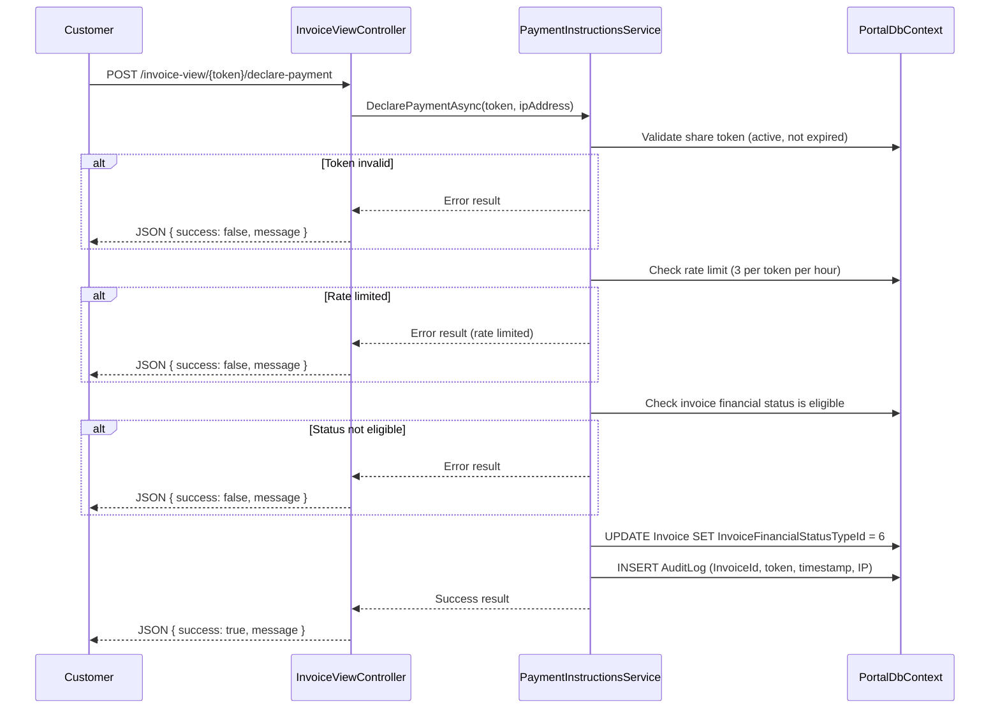

# Design Document: Payment Instructions

## Overview

Payment Instructions replaces the original Module 4 (Stripe Connect) with a lightweight bank-transfer payment flow on the shared invoice page. Customers can view the business's bank details directly from the anonymous shared invoice link and declare when they have made a payment. The business retains full control via a settings toggle.

The feature introduces:
- A business-level toggle (`IsPaymentInstructionsEnabled`) to control visibility
- A "Pay by Bank Transfer" button on the shared invoice page (injected into the HTML snapshot)
- A modal displaying bank details, outstanding amount, and a suggested transfer reference
- A "payment declaration" endpoint that sets the invoice to a new `PaymentOnboard` (Id=6) financial status
- Rate-limited, audited anonymous endpoint for the declaration
- A SWIFT/BIC field extension on `BusinessPaymentDetail`

Stripe Connect remains documented as a future upgrade path (Option C).

---

## Architecture

### High-Level Flow

```mermaid
flowchart TB
    subgraph Customer["Customer (Anonymous)"]
        A[Shared Invoice Page<br>/invoice-view/{token}]
        B[Pay by Bank Transfer Button]
        C[Payment Instructions Modal]
        D["I've made the payment" Button]
    end

    subgraph Server["ASP.NET Core MVC"]
        E[InvoiceViewController<br>AllowAnonymous]
        F[IPaymentInstructionsService]
        G[BusinessPaymentDetailRepository]
        H[PortalDbContext]
        I[AuditLog]
    end

    subgraph BusinessOwner["Business Owner (Authenticated)"]
        J[MyBusinessController<br>Settings Page]
        K[Toggle Endpoint]
    end

    A --> |GET /invoice-view/{token}| E
    E --> |Injects button HTML if eligible| B
    B --> |Click opens| C
    C --> |Fetches bank details via| F
    F --> G
    G --> H
    D --> |POST /invoice-view/{token}/declare-payment| E
    E --> F
    F --> |Updates InvoiceFinancialStatusTypeId=6| H
    F --> |Creates audit log entry| I
    J --> |POST AxPostTogglePaymentInstructions| K
    K --> F
```

### Sequence Diagram — Payment Declaration



---

## Components and Interfaces

### IPaymentInstructionsService

New service interface in `Portal.Infrastructure.Services`:

```csharp
public interface IPaymentInstructionsService
{
    /// <summary>
    /// Gets payment instruction data for the shared invoice modal.
    /// Returns null if the toggle is disabled or no active payment details exist.
    /// </summary>
    Task<PaymentInstructionsData?> GetPaymentInstructionsAsync(int invoiceId, int businessId);

    /// <summary>
    /// Processes a customer's payment declaration. Validates share token, rate limit,
    /// updates invoice status to PaymentOnboard, and creates an audit log entry.
    /// </summary>
    Task<PaymentDeclarationResult> DeclarePaymentAsync(string shareToken, string ipAddress);

    /// <summary>
    /// Enables or disables the payment instructions toggle for a business.
    /// Returns false if the business has no active payment details (cannot enable).
    /// </summary>
    Task<ToggleResult> SetPaymentInstructionsEnabledAsync(int businessId, bool enabled);

    /// <summary>
    /// Checks whether the payment instructions toggle is enabled for a business.
    /// </summary>
    Task<bool> IsEnabledForBusinessAsync(int businessId);
}
```

### Models

```csharp
public class PaymentInstructionsData
{
    public string BusinessName { get; set; } = null!;
    public string BankName { get; set; } = null!;
    public string Iban { get; set; } = null!;
    public string PayeeName { get; set; } = null!;
    public string? SwiftBic { get; set; }
    public decimal OutstandingAmount { get; set; }
    public string CurrencySymbol { get; set; } = null!;
    public DateOnly DueDate { get; set; }
    public string TransferReference { get; set; } = null!;
}

public class PaymentDeclarationResult
{
    public bool Success { get; set; }
    public string Message { get; set; } = null!;
    public DateTime? DeclaredAtUtc { get; set; }
}

public class ToggleResult
{
    public bool Success { get; set; }
    public string Message { get; set; } = null!;
}
```

### Controller Endpoints

#### InvoiceViewController (AllowAnonymous)

| Method | Route | Purpose |
|--------|-------|---------|
| `POST` | `/invoice-view/{token}/declare-payment` | Customer declares payment was made |
| `GET` | `/invoice-view/{token}/payment-instructions` | AJAX fetch of bank details for modal |

The `GET /invoice-view/{token}` action (existing) is extended to inject the "Pay by Bank Transfer" button and modal HTML when eligible.

#### MyBusinessController (Authenticated)

| Method | Name | Purpose |
|--------|------|---------|
| `POST` | `AxPostTogglePaymentInstructions` | Enable/disable the toggle |

### Button Visibility Logic

The "Pay by Bank Transfer" button is injected into the shared invoice page HTML when ALL of the following conditions are met:

1. `Business.IsPaymentInstructionsEnabled == true`
2. The business has at least one active `BusinessPaymentDetail` record
3. The invoice `InvoiceFinancialStatusTypeId` is in `{1 (Unpaid), 2 (PartiallyPaid), 4 (Overdue)}`

The button is NOT shown when:
- The toggle is disabled
- The invoice status is `Paid (3)`, `WrittenOff (5)`, or `PaymentOnboard (6)`

### Modal Injection Pattern

Following the existing pattern in `InvoiceViewController.ViewInvoice()`, the modal HTML and JavaScript are injected directly into the snapshot HTML string. The modal fetches bank details via an AJAX call to `/invoice-view/{token}/payment-instructions` to avoid embedding sensitive bank data in the initial page HTML (allows the data to be loaded on-demand only when the customer clicks the button).

### Rate Limiting Strategy

Simple SQL-based rate limiting using the `AuditLog` table:

```sql
SELECT COUNT(*)
FROM [audit].[AuditLog]
WHERE [TableName] = 'Invoice'
  AND [Action] = 'PaymentDeclared'
  AND [RecordId] = @InvoiceId
  AND [OldValues] LIKE '%' + @ShareToken + '%'
  AND [Timestamp] >= @OneHourAgo
```

If count >= 3, reject with a rate-limit error message.

---

## Data Models

### Database Migrations

#### Migration 1: Add SwiftBic to BusinessPaymentDetail

```sql
-- ============================================================
-- Add SwiftBic column to BusinessPaymentDetail
-- ============================================================

USE [Portal]
GO

ALTER TABLE [portal].[BusinessPaymentDetail]
ADD [SwiftBic] NVARCHAR(11) NULL;
GO
```

#### Migration 2: Add IsPaymentInstructionsEnabled to Business

```sql
-- ============================================================
-- Add IsPaymentInstructionsEnabled to Business table
-- ============================================================

USE [Portal]
GO

ALTER TABLE [portal].[Business]
ADD [IsPaymentInstructionsEnabled] BIT NOT NULL CONSTRAINT DF_Business_IsPaymentInstructionsEnabled DEFAULT 0;
GO
```

#### Migration 3: Insert PaymentOnboard Financial Status

```sql
-- ============================================================
-- Add PaymentOnboard financial status type (Id=6)
-- ============================================================

USE [Portal]
GO

SET IDENTITY_INSERT [invoice].[InvoiceFinancialStatusType] ON;

INSERT INTO [invoice].[InvoiceFinancialStatusType] ([Id], [Name])
VALUES (6, 'PaymentOnboard');

SET IDENTITY_INSERT [invoice].[InvoiceFinancialStatusType] OFF;
GO
```

### Updated Entity Classes

#### BusinessPaymentDetail (updated)

```csharp
public class BusinessPaymentDetail
{
    public int Id { get; set; }
    public int BusinessId { get; set; }
    public string Label { get; set; } = null!;
    public string BankName { get; set; } = null!;
    public string Iban { get; set; } = null!;
    public string PayeeName { get; set; } = null!;
    public string? SwiftBic { get; set; }          // NEW
    public int SortOrder { get; set; }
    public bool IsActive { get; set; } = true;
    public DateTime CreatedAtUtc { get; set; }
    public Business Business { get; set; } = null!;
}
```

#### Business (updated)

```csharp
public class Business
{
    // ... existing properties ...
    public bool IsPaymentInstructionsEnabled { get; set; }  // NEW — default false
}
```

#### InvoiceFinancialStatusType (updated seed values)

```
Id=1: Unpaid
Id=2: PartiallyPaid
Id=3: Paid
Id=4: Overdue
Id=5: WrittenOff
Id=6: PaymentOnboard  ← NEW
```

### EF Core Configuration Updates

```csharp
// In ConfigureBusinessPaymentDetail:
entity.Property(e => e.SwiftBic)
    .HasMaxLength(11)
    .IsRequired(false);

// In ConfigureBusiness:
entity.Property(e => e.IsPaymentInstructionsEnabled)
    .IsRequired()
    .HasDefaultValue(false);
```

### Repository Updates

`BusinessPaymentDetailRepository` queries need to include `[SwiftBic]` in SELECT statements and the `InsertAsync`/`UpdateAsync` methods need to accept and persist the new field.

---

## Correctness Properties

*A property is a characteristic or behavior that should hold true across all valid executions of a system — essentially, a formal statement about what the system should do. Properties serve as the bridge between human-readable specifications and machine-verifiable correctness guarantees.*

### Property 1: Toggle persistence

*For any* business, calling the toggle-enable endpoint with a value of `true` or `false` should result in `IsPaymentInstructionsEnabled` reflecting that exact value when subsequently queried.

**Validates: Requirements 1.2, 1.3**

### Property 2: Toggle requires active bank details

*For any* business with zero active `BusinessPaymentDetail` records, attempting to enable the payment instructions toggle should be rejected, and `IsPaymentInstructionsEnabled` should remain `false`.

**Validates: Requirements 1.5**

### Property 3: Button visibility rule

*For any* invoice and its associated business, the "Pay by Bank Transfer" button is visible on the shared invoice page if and only if `IsPaymentInstructionsEnabled == true` AND `InvoiceFinancialStatusTypeId` is in `{1, 2, 4}` (Unpaid, PartiallyPaid, Overdue).

**Validates: Requirements 2.1, 2.2, 2.3**

### Property 4: Modal content completeness

*For any* valid invoice with an eligible financial status and an associated active `BusinessPaymentDetail`, the payment instructions data returned by the service should contain all required fields: business name, bank name, IBAN, payee name, outstanding amount, due date, and transfer reference.

**Validates: Requirements 3.1**

### Property 5: Transfer reference format

*For any* invoice number and business name, the generated transfer reference should equal the string `"{InvoiceNumber} — {BusinessName}"` (with an em-dash separator).

**Validates: Requirements 3.2**

### Property 6: Lowest SortOrder selection

*For any* business with multiple active `BusinessPaymentDetail` records, the service should return the record with the minimum `SortOrder` value for display in the modal.

**Validates: Requirements 3.5**

### Property 7: Outstanding amount calculation

*For any* invoice with `TotalAmount = T` and a set of non-voided payments summing to `P`, the outstanding amount should equal `T - P`. If `P >= T`, the outstanding amount should be `0`.

**Validates: Requirements 3.6**

### Property 8: Payment declaration state transition

*For any* invoice with `InvoiceFinancialStatusTypeId` in `{1, 2, 4}` (eligible statuses), calling the declare-payment endpoint with a valid, active, non-expired share token should result in `InvoiceFinancialStatusTypeId = 6` (PaymentOnboard) and an audit log entry with a non-null UTC timestamp.

**Validates: Requirements 4.2, 4.3**

### Property 9: PaymentOnboard does not lock invoice

*For any* invoice with `InvoiceFinancialStatusTypeId = 6` (PaymentOnboard), the business owner should still be able to record payments and change the financial status manually (the endpoints accept requests normally).

**Validates: Requirements 5.3**

### Property 10: Auto-transition to Paid on full payment

*For any* invoice where the sum of non-voided payment amounts (including a newly recorded payment) equals or exceeds the invoice `TotalAmount`, the financial status should transition to `Paid (Id=3)` regardless of the previous status (including PaymentOnboard).

**Validates: Requirements 5.5**

### Property 11: SwiftBic conditional display

*For any* `BusinessPaymentDetail`, the SWIFT/BIC field appears in the payment instructions data if and only if `SwiftBic` is non-null and non-empty.

**Validates: Requirements 6.3, 6.4**

### Property 12: Audit log creation on declaration

*For any* successful payment declaration, an audit log entry must be created containing: the invoice ID, the share token used, the declaration timestamp in UTC, and the customer's IP address.

**Validates: Requirements 7.1**

### Property 13: Share token validation

*For any* share token that is inactive, expired, or does not match an existing invoice, the declare-payment endpoint should reject the request with an error result.

**Validates: Requirements 7.2, 7.3**

### Property 14: Rate limiting

*For any* share token that has received 3 or more payment declarations within the last hour, the next declaration attempt should be rejected with a rate-limit error.

**Validates: Requirements 7.4**

### Property 15: No Payment record created on declaration

*For any* payment declaration (successful or not), the `[revenue].[Payment]` table should not gain any new rows. Only the invoice financial status and audit log are affected.

**Validates: Requirements 7.5**

---

## Error Handling

| Scenario | Component | Response | User-Facing Message |
|----------|-----------|----------|---------------------|
| Share token not found | InvoiceViewController | 404 NotFound | Page shows "Unavailable" view |
| Share token expired/inactive | PaymentInstructionsService | JSON `{ success: false }` | "This invoice link is no longer active." |
| Toggle enabled with no bank details | PaymentInstructionsService | JSON `{ success: false }` | "Add bank details in your payment details section before enabling this option." |
| Rate limited (3 per token/hour) | PaymentInstructionsService | JSON `{ success: false }` | "Too many payment declarations. Please try again later." |
| Invoice status not eligible | PaymentInstructionsService | JSON `{ success: false }` | "This invoice is not eligible for payment declaration." |
| Invoice already PaymentOnboard | PaymentInstructionsService | JSON `{ success: false }` | "A payment declaration has already been recorded for this invoice." |
| Database exception | Service layer | JSON `{ success: false }` + log | "An unexpected error occurred. Please try again." |
| SwiftBic exceeds 11 chars (input) | MyBusinessController | Validation error | "SWIFT/BIC code must be 11 characters or fewer." |
| Missing required bank fields | MyBusinessController | Validation error | Field-specific validation messages |

All errors follow the project standard:
- `try/catch (Exception ex) { throw; }` in repositories
- Controllers catch, log via `_logger`, and return `Json(new { success = false, message = "..." })`
- SweetAlert2 on the client side for all error/success feedback
- BlockUI wraps all AJAX calls

---

## Testing Strategy

### Unit Tests (Example-Based)

| Test | What it verifies |
|------|-----------------|
| Toggle renders on settings page with correct label | Requirement 1.1 |
| Default toggle value is `false` for new business | Requirement 1.4 |
| Modal includes copy buttons for IBAN and reference | Requirements 3.3, 3.4 |
| Declaration button exists in modal HTML | Requirement 4.1 |
| Confirmation message shown on success | Requirement 4.4 |
| Error SweetAlert2 shown on failure | Requirement 4.6 |
| PaymentOnboard appears in filter dropdowns | Requirement 5.4 |
| SWIFT/BIC input field renders in settings | Requirement 6.2 |

### Property-Based Tests

Property-based testing library: **FsCheck** (FsCheck.Xunit for .NET)

Each property test runs a minimum of 100 iterations with randomized input data.

| Property | Test Tag |
|----------|----------|
| Toggle persistence | Feature: payment-instructions, Property 1: Toggle persistence |
| Toggle requires active bank details | Feature: payment-instructions, Property 2: Toggle requires active bank details |
| Button visibility rule | Feature: payment-instructions, Property 3: Button visibility rule |
| Modal content completeness | Feature: payment-instructions, Property 4: Modal content completeness |
| Transfer reference format | Feature: payment-instructions, Property 5: Transfer reference format |
| Lowest SortOrder selection | Feature: payment-instructions, Property 6: Lowest SortOrder selection |
| Outstanding amount calculation | Feature: payment-instructions, Property 7: Outstanding amount calculation |
| Payment declaration state transition | Feature: payment-instructions, Property 8: Payment declaration state transition |
| PaymentOnboard does not lock invoice | Feature: payment-instructions, Property 9: PaymentOnboard does not lock invoice |
| Auto-transition to Paid | Feature: payment-instructions, Property 10: Auto-transition to Paid on full payment |
| SwiftBic conditional display | Feature: payment-instructions, Property 11: SwiftBic conditional display |
| Audit log creation | Feature: payment-instructions, Property 12: Audit log creation on declaration |
| Share token validation | Feature: payment-instructions, Property 13: Share token validation |
| Rate limiting | Feature: payment-instructions, Property 14: Rate limiting |
| No Payment record on declaration | Feature: payment-instructions, Property 15: No Payment record created on declaration |

### Integration Tests

- End-to-end flow: share invoice → load page → verify button appears → declare payment → verify status change
- Rate limit enforcement with real timing
- Toggle enable/disable cycle with page reload verification

---

## Option C: Stripe Connect (Future)

### Overview

Stripe Connect would supplement (not replace) bank transfer instructions. Both payment methods would coexist on the shared invoice page — customers could choose "Pay by Card" (Stripe) or "Pay by Bank Transfer" (existing).

### Capabilities

- **Card payment support**: Customers pay via Stripe Checkout (credit/debit card, Apple Pay, Google Pay)
- **Automatic reconciliation**: Stripe webhooks (`checkout.session.completed`) auto-create a `Payment` record and update invoice financial status to `Paid`
- **OAuth Connect flow**: Business owners connect their Stripe account via OAuth in Settings → Payment Gateway

### Required Database Tables (from original Module 4 design)

| Table | Schema | Purpose |
|-------|--------|---------|
| `BusinessPaymentGateway` | `[portal]` | Stores Stripe Connect credentials per business (StripeAccountId, AccessToken, IsConnected) |
| `InvoicePaymentLink` | `[invoice]` | Tracks Stripe Checkout Sessions per invoice (SessionId, PaymentIntentId, Status, Amount, CreatedAtUtc) |

### Integration Points

- The shared invoice page would add a "Pay by Card" button alongside the existing "Pay by Bank Transfer" button
- The `IPaymentInstructionsService` interface remains unchanged — Stripe would have its own `IPaymentGatewayService`
- Webhook endpoint: `POST /api/stripe/webhook` with signature verification
- Auto-reconciliation: webhook → create Payment record → update invoice status → send confirmation email

### Why Deferred

Stripe Connect requires:
- Platform account registration with Stripe
- OAuth flow implementation and token management
- Webhook infrastructure and idempotency handling
- PCI compliance considerations
- External dependency on Stripe API availability

The bank transfer flow delivers 80% of the value (visibility + customer notification) with zero external dependencies.

---

## View Structure (Referencing Locked Mockup)

The locked mockup at `.kiro/docs/mockups/payment-instructions.html` defines five sections:

1. **Customer View — Shared Invoice Page**: Shows the "Pay by Bank Transfer" green button below the acceptance section
2. **Payment Instructions Modal**: Full modal with info card (amount, due date, reference), bank details section, warning note, and "I've made the payment" button
3. **Confirmation State**: Status badge "Payment Onboard — Awaiting Verification" replaces the Pay button
4. **Business Owner View — Invoice Detail**: Amber info banner with declaration warning and "Record Payment" CTA
5. **Business Settings**: Toggle row with label and green check note when enabled

### Modal HTML/JS Injection

The modal HTML and JavaScript are injected into the shared invoice page using the same pattern as the existing acceptance UI and download buttons in `InvoiceViewController.ViewInvoice()`:

1. The "Pay by Bank Transfer" button HTML is inserted after the acceptance section HTML
2. The modal HTML (hidden by default, `display:none`) is inserted at the end of the page body
3. An inline `<script>` block handles:
   - Button click → show modal (set `display:flex` on overlay)
   - Close button → hide modal
   - Copy-to-clipboard buttons
   - "I've made the payment" click → BlockUI → fetch POST → BlockUI hide → SweetAlert2 result → replace button with status badge

The AJAX call to fetch bank details is made when the modal opens (not on page load) to keep the initial page lightweight and avoid exposing bank data in the page source until requested.
