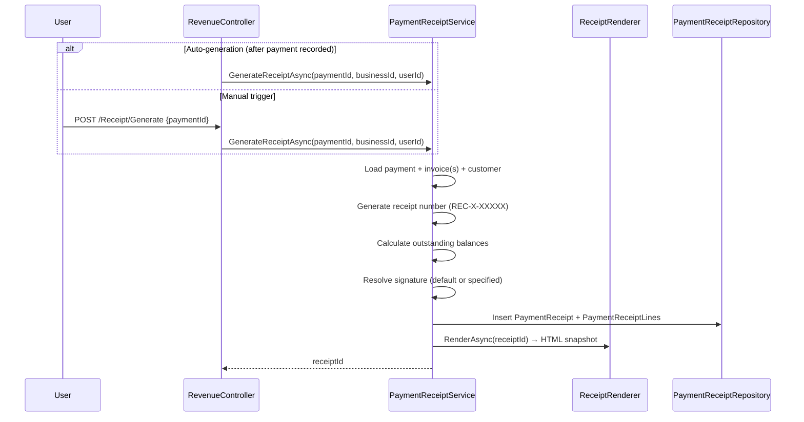

# Design Document: Payment Receipts & Signature Management

## Overview

Payment Receipts are formal documents confirming receipt of payment. They are auto-generated (configurable) or manually triggered, cover one or multiple invoices, and can be shared with customers. A Signature Library allows businesses to manage digital signatures with permission-based access control.

### Key Design Decisions

1. **One receipt per payment event** — A single invoice payment gets one receipt. A global payment (covering multiple invoices) gets one receipt with multiple line items.
2. **Receipt = snapshot** — The receipt captures the state at generation time (amounts, balances). It doesn't change if the invoice is later modified.
3. **Signature is business-level, permission-controlled** — Signatures belong to the business, not individual users. Usage requires explicit permission.
4. **Auto-receipt is opt-in** — A business-level flag `IsAutoReceiptEnabled` controls automatic generation. Default: off.
5. **Share pattern mirrors invoices** — Same token-based sharing, HTML snapshot, PDF download, expiry.
6. **Void cascades from payment** — When a payment is voided, its receipt is automatically voided.

## Data Model

### New Tables

#### `[revenue].[PaymentReceipt]`

| Column | Type | Nullable | Default | Description |
|--------|------|----------|---------|-------------|
| Id | INT IDENTITY | NOT NULL | — | PK |
| BusinessId | INT | NOT NULL | — | FK → Business |
| ReceiptNumber | NVARCHAR(50) | NOT NULL | — | Sequential: REC-{BizId}-{Seq} |
| CustomerId | INT | NOT NULL | — | FK → Customer |
| PaymentId | INT | NOT NULL | — | FK → Payment (parent for global, direct for per-invoice) |
| ReceiptDate | DATETIME | NOT NULL | — | Date shown on receipt |
| TotalAmountReceived | DECIMAL(18,2) | NOT NULL | — | Total payment amount |
| OutstandingBalanceAfter | DECIMAL(18,2) | NOT NULL | — | Customer's total outstanding after this payment |
| PaymentMethodTypeId | INT | NOT NULL | — | FK → PaymentMethodType |
| PaymentReference | NVARCHAR(200) | NULL | — | Bank ref / transaction ID |
| Notes | NVARCHAR(500) | NULL | — | Optional notes |
| SignatureId | INT | NULL | — | FK → Signature (if signed) |
| IsVoided | BIT | NOT NULL | 0 | Soft-void flag |
| CreatedByUserId | NVARCHAR(450) | NOT NULL | — | Who generated it |
| CreatedAtUtc | DATETIME | NOT NULL | GETUTCDATE() | Creation timestamp |

#### `[revenue].[PaymentReceiptLine]`

| Column | Type | Nullable | Default | Description |
|--------|------|----------|---------|-------------|
| Id | INT IDENTITY | NOT NULL | — | PK |
| PaymentReceiptId | INT | NOT NULL | — | FK → PaymentReceipt |
| PaymentId | INT | NOT NULL | — | FK → Payment (child allocation or per-invoice payment) |
| InvoiceId | INT | NOT NULL | — | FK → Invoice |
| InvoiceNumber | NVARCHAR(50) | NOT NULL | — | Snapshot of invoice number |
| Amount | DECIMAL(18,2) | NOT NULL | — | Amount applied to this invoice |
| InvoiceTotal | DECIMAL(18,2) | NOT NULL | — | Invoice total at time of receipt |
| OutstandingBefore | DECIMAL(18,2) | NOT NULL | — | Outstanding before this payment |
| OutstandingAfter | DECIMAL(18,2) | NOT NULL | — | Outstanding after this payment |

#### `[revenue].[PaymentReceiptShare]`

Same pattern as `[invoice].[InvoiceShare]` — token, HTML snapshot, email, expiry, IsActive.

#### `[portal].[Signature]`

| Column | Type | Nullable | Default | Description |
|--------|------|----------|---------|-------------|
| Id | INT IDENTITY | NOT NULL | — | PK |
| BusinessId | INT | NOT NULL | — | FK → Business |
| Label | NVARCHAR(100) | NOT NULL | — | Display name (e.g., "John — Director") |
| FileName | NVARCHAR(200) | NOT NULL | — | Original file name |
| ContentType | NVARCHAR(50) | NOT NULL | — | MIME type (image/png, image/svg+xml) |
| FilePath | NVARCHAR(500) | NOT NULL | — | Relative path to stored file |
| IsDefault | BIT | NOT NULL | 0 | Business default signature |
| IsActive | BIT | NOT NULL | 1 | Active/deactivated |
| UploadedByUserId | NVARCHAR(450) | NOT NULL | — | Who uploaded |
| CreatedAtUtc | DATETIME | NOT NULL | GETUTCDATE() | Upload timestamp |

### Modified Table: `[portal].[Business]`

| Column | Type | Change | Description |
|--------|------|--------|-------------|
| IsAutoReceiptEnabled | BIT NOT NULL DEFAULT 0 | **NEW** | Business-level auto-receipt toggle |

## Architecture

### Receipt Generation Flow



### Permission Model

```
signature_manage → Can upload, edit, set default, deactivate signatures
signature_use   → Can select and apply signatures when generating receipts/documents

Owner/SuperAdmin → Both implicitly granted
```

These are added to the existing `UserBusinessPermission` system as module-level permissions. They don't need PlanFeature entries (available on all plans — Foundation feature).

### Signature Storage

Signatures are stored as files under:
```
/uploads/signatures/{businessId}/{filename}
```

The `FilePath` column stores the relative path. The image is served via a controller action that validates business ownership before returning the file.

### Receipt Rendering

Uses the same `IViewRenderService` pattern as invoices:
- Razor view: `Views/Receipt/Snapshot.cshtml`
- PDF generation via PuppeteerSharp (same as invoices)
- HTML snapshot stored in PaymentReceiptShare for sharing

### Auto-Receipt Integration

In `PaymentService.RecordPaymentAsync` and `RecordGlobalPaymentAsync`:

```csharp
// After successful payment recording
if (business.IsAutoReceiptEnabled)
{
    await _receiptService.GenerateReceiptAsync(paymentId, businessId, userId);
}
```

### Void Cascade

When a payment is voided:
1. Existing void logic runs (void payment, recalculate statuses)
2. NEW: Find receipt where PaymentId = voidedPayment.Id
3. If found: set IsVoided = 1 on the receipt
4. Deactivate any active share links for that receipt

## UI Components

### Receipt Detail Page (`/Receipt/Detail/{id}`)

Shows the full receipt with:
- Business header + logo
- Customer details
- Payment line items table
- Total received
- Signature (if attached)
- Actions: Share, Download PDF, Void

### Receipt List Page (`/Receipt/Index`)

Table of all receipts with filters (customer, date, status).

### Signature Management Page (`/MyBusiness/Signatures`)

- Upload form (drag & drop or file picker)
- Gallery of existing signatures with labels
- Set Default toggle
- Deactivate/Reactivate actions
- Permission-gated: only visible to users with `signature_manage`

### Receipt Generation in Statement/Invoice/Dashboard

- "Generate Receipt" button next to payments
- Modal: confirms details, allows signature selection, notes
- If auto-receipt is on: shows "Receipt auto-generated" toast notification

## Tier Placement

**Foundation** — Receipts and signatures are core accounting features available on all plans. No PlanFeature gating needed.
