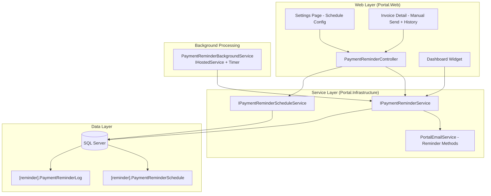
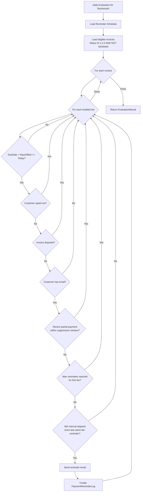

# Design Document: Payment Reminders

## Overview

The Payment Reminders feature adds automated and manual email reminder capabilities to the Portal platform for unpaid/overdue invoices. It introduces a configurable escalation schedule (Friendly → Firm → Formal), a background evaluation engine, comprehensive audit logging, and plan-gated access (manual for Starter, automated for Professional).

The system evaluates invoices daily against configured trigger points, applies exclusion rules (opt-out, disputed, recent partial payment, max reminders), and sends tier-appropriate emails using the existing `IEmailSender` infrastructure.

## Architecture



### Key Architectural Decisions

1. **IHostedService with Timer** — No existing background service pattern in the codebase. A `BackgroundService` (inherits `Microsoft.Extensions.Hosting.BackgroundService`) with a daily timer is the simplest approach. MassTransit scheduling would be overkill for a single daily job.

2. **Service-layer evaluation logic** — All reminder evaluation rules live in `IPaymentReminderService`, keeping controllers thin. The background job calls the same service method as would be used for testing.

3. **Tenant iteration in background job** — The background service queries all eligible businesses and processes them sequentially, creating a scoped service for each to maintain proper tenant context.

4. **Existing email infrastructure** — New `BuildReminderHtml` methods added to `PortalEmailService` following the established pattern (BuildInvitationHtml, BuildInvoiceHtml, etc.).

## Components and Interfaces

### 1. IPaymentReminderScheduleService

Manages schedule CRUD and default resolution.

```csharp
namespace Portal.Infrastructure.Services;

public interface IPaymentReminderScheduleService
{
    /// Returns the schedule for the current tenant, or system defaults if none configured.
    Task<List<PaymentReminderScheduleDto>> GetScheduleAsync(int businessId);

    /// Saves or updates the full schedule (3 tiers) for a business.
    Task SaveScheduleAsync(int businessId, List<SaveReminderScheduleRequest> tiers);

    /// Validates tier ordering and value constraints.
    ValidationResult ValidateSchedule(List<SaveReminderScheduleRequest> tiers);
}
```

### 2. IPaymentReminderService

Core evaluation, sending, and querying logic.

```csharp
namespace Portal.Infrastructure.Services;

public interface IPaymentReminderService
{
    /// Evaluates all invoices for a business on a given date and sends applicable reminders.
    Task<ReminderEvaluationResult> EvaluateAndSendAsync(int businessId, DateOnly evaluationDate);

    /// Sends a manual reminder for a specific invoice.
    Task<ManualReminderResult> SendManualReminderAsync(int businessId, int invoiceId, string escalationTier);

    /// Gets reminder history for an invoice.
    Task<List<PaymentReminderLogDto>> GetHistoryByInvoiceAsync(int businessId, int invoiceId);

    /// Gets dashboard widget data for the current week.
    Task<ReminderDashboardWidgetDto> GetDashboardWidgetDataAsync(int businessId);

    /// Gets all business IDs that have the payment_reminder_auto permission (for background job).
    Task<List<int>> GetEligibleBusinessIdsAsync();
}
```

### 3. PaymentReminderBackgroundService

```csharp
namespace Portal.Web.BackgroundServices;

/// <summary>
/// Daily background job that evaluates all eligible businesses for payment reminders.
/// Runs at a configurable time (default 06:00 UTC), processes businesses sequentially,
/// and is resilient to individual business failures.
/// </summary>
public class PaymentReminderBackgroundService : BackgroundService
{
    private readonly IServiceScopeFactory _scopeFactory;
    private readonly ILogger<PaymentReminderBackgroundService> _logger;
    private readonly TimeOnly _scheduledTime; // default 06:00 UTC

    protected override async Task ExecuteAsync(CancellationToken stoppingToken)
    {
        while (!stoppingToken.IsCancellationRequested)
        {
            var delay = CalculateDelayUntilNextRun();
            await Task.Delay(delay, stoppingToken);

            await RunDailyEvaluationAsync(stoppingToken);
        }
    }

    private async Task RunDailyEvaluationAsync(CancellationToken ct)
    {
        using var scope = _scopeFactory.CreateScope();
        var service = scope.ServiceProvider.GetRequiredService<IPaymentReminderService>();

        var businessIds = await service.GetEligibleBusinessIdsAsync();

        foreach (var businessId in businessIds)
        {
            try
            {
                using var bizScope = _scopeFactory.CreateScope();
                var bizService = bizScope.ServiceProvider.GetRequiredService<IPaymentReminderService>();
                await bizService.EvaluateAndSendAsync(businessId, DateOnly.FromDateTime(DateTime.UtcNow));
            }
            catch (Exception ex)
            {
                _logger.LogError(ex, "Reminder evaluation failed for BusinessId={BusinessId}", businessId);
                // Continue processing remaining businesses
            }
        }
    }
}
```

### 4. PaymentReminderController

```csharp
namespace Portal.Web.Controllers;

[Authorize]
[ModuleAccess(PortalModules.PaymentReminderManual)]
public class PaymentReminderController : Controller
{
    // --- Page Actions ---
    [ModuleAccess(PortalModules.PaymentReminderAuto)]
    public async Task<IActionResult> Settings() // Schedule configuration page

    // --- AJAX Endpoints ---
    [HttpPost] [ValidateAntiForgeryToken]
    [ModuleAccess(PortalModules.PaymentReminderAuto, AccessLevels.Full)]
    public async Task<IActionResult> AxPostSaveSchedule(SaveScheduleViewModel model)

    [HttpPost] [ValidateAntiForgeryToken]
    public async Task<IActionResult> AxPostSendManualReminder(int invoiceId, string tier)

    [HttpGet]
    public async Task<IActionResult> AxGetReminderHistory(int invoiceId)

    [HttpGet]
    public async Task<IActionResult> AxGetDashboardWidget()
}
```

### 5. Email Template Builder Methods

Added to `PortalEmailService` following the existing pattern:

```csharp
// New email department
public enum EmailDepartmentEnum
{
    // ... existing values ...
    PaymentReminder
}

// New methods in PortalEmailService
public async Task SendPaymentReminderEmailAsync(
    string toEmail, string customerName, string invoiceNumber,
    decimal outstandingAmount, DateOnly dueDate, string businessName,
    string escalationTier, string? invoiceShareToken, string baseUrl)
{
    var subject = escalationTier switch
    {
        "Friendly" => $"Invoice approaching due date — {invoiceNumber}",
        "Firm" => $"Invoice overdue — action required — {invoiceNumber}",
        "Formal" => $"Final payment notice — {invoiceNumber}",
        _ => $"Payment reminder — {invoiceNumber}"
    };

    var htmlBody = BuildPaymentReminderHtml(
        customerName, invoiceNumber, outstandingAmount, dueDate,
        businessName, escalationTier, invoiceShareToken, baseUrl);

    await _emailSender.SendEmailAsync(toEmail, subject, htmlBody, EmailDepartmentEnum.PaymentReminder);
}

private static string BuildPaymentReminderHtml(...) { /* Tier-specific HTML per locked mockups */ }
```

Email templates follow the locked mockup designs:
- **Friendly**: Blue accent line (#0D5EA6), "Payment Reminder" badge, "View Invoice" CTA button (blue)
- **Firm**: Amber accent line (#C8912E), "Payment Overdue" badge, "Pay Now" CTA button (amber)
- **Formal**: Red accent line (#C24A4A), "Final Notice" badge, "Settle Invoice" CTA button (red)
- Footer: Business name + "Powered by 3 Inventors"

## Data Models

### Database Schema (Migrations)

#### Migration: Create [reminder] Schema and Tables

```sql
-- ============================================================
-- Create [reminder] schema and PaymentReminderSchedule table
-- ============================================================

USE [Portal]
GO

CREATE SCHEMA [reminder]
GO

CREATE TABLE [reminder].[PaymentReminderSchedule] (
    [Id]                            INT IDENTITY(1,1) NOT NULL,
    [BusinessId]                    INT NOT NULL,
    [EscalationTier]                VARCHAR(20) NOT NULL,
    [DaysOffset]                    INT NOT NULL,
    [MaxRemindersPerTier]           INT NOT NULL DEFAULT 1,
    [MinIntervalDays]               INT NOT NULL DEFAULT 3,
    [PartialPaymentSuppressionDays] INT NOT NULL DEFAULT 7,
    [IsEnabled]                     BIT NOT NULL DEFAULT 1,
    [CreatedAtUtc]                  DATETIME NOT NULL DEFAULT GETUTCDATE(),
    [UpdatedAtUtc]                  DATETIME NOT NULL DEFAULT GETUTCDATE(),

    CONSTRAINT [PK_PaymentReminderSchedule] PRIMARY KEY CLUSTERED ([Id]),
    CONSTRAINT [FK_PaymentReminderSchedule_Business] FOREIGN KEY ([BusinessId])
        REFERENCES [portal].[Business]([Id]),
    CONSTRAINT [CK_PaymentReminderSchedule_EscalationTier]
        CHECK ([EscalationTier] IN ('Friendly', 'Firm', 'Formal'))
)
GO

CREATE INDEX [IX_PaymentReminderSchedule_BusinessId]
    ON [reminder].[PaymentReminderSchedule]([BusinessId])
GO
```

#### Migration: Create PaymentReminderLog Table

```sql
-- ============================================================
-- Create PaymentReminderLog table
-- ============================================================

USE [Portal]
GO

CREATE TABLE [reminder].[PaymentReminderLog] (
    [Id]                  INT IDENTITY(1,1) NOT NULL,
    [BusinessId]          INT NOT NULL,
    [InvoiceId]           INT NOT NULL,
    [CustomerId]          INT NOT NULL,
    [RecipientEmail]      NVARCHAR(200) NOT NULL,
    [EscalationTier]      VARCHAR(20) NOT NULL,
    [IsSentSuccessfully]  BIT NOT NULL,
    [ErrorMessage]        NVARCHAR(1000) NULL,
    [IsManualTrigger]     BIT NOT NULL DEFAULT 0,
    [SentAtUtc]           DATETIME NOT NULL DEFAULT GETUTCDATE(),
    [CreatedAtUtc]        DATETIME NOT NULL DEFAULT GETUTCDATE(),

    CONSTRAINT [PK_PaymentReminderLog] PRIMARY KEY CLUSTERED ([Id]),
    CONSTRAINT [FK_PaymentReminderLog_Business] FOREIGN KEY ([BusinessId])
        REFERENCES [portal].[Business]([Id]),
    CONSTRAINT [FK_PaymentReminderLog_Invoice] FOREIGN KEY ([InvoiceId])
        REFERENCES [invoice].[Invoice]([Id]),
    CONSTRAINT [FK_PaymentReminderLog_Customer] FOREIGN KEY ([CustomerId])
        REFERENCES [customer].[Customer]([Id]),
    CONSTRAINT [CK_PaymentReminderLog_EscalationTier]
        CHECK ([EscalationTier] IN ('Friendly', 'Firm', 'Formal'))
)
GO

CREATE INDEX [IX_PaymentReminderLog_BusinessId_InvoiceId]
    ON [reminder].[PaymentReminderLog]([BusinessId], [InvoiceId])
GO

CREATE INDEX [IX_PaymentReminderLog_BusinessId_SentAtUtc]
    ON [reminder].[PaymentReminderLog]([BusinessId], [SentAtUtc])
GO
```

#### Migration: Add IsReminderOptedOut to Customer, IsDisputed to Invoice

```sql
-- ============================================================
-- Add opt-out and disputed columns
-- ============================================================

USE [Portal]
GO

ALTER TABLE [customer].[Customer]
    ADD [IsReminderOptedOut] BIT NOT NULL DEFAULT 0
GO

ALTER TABLE [invoice].[Invoice]
    ADD [IsDisputed] BIT NOT NULL DEFAULT 0
GO
```

### Entity Classes

#### PaymentReminderSchedule

```csharp
namespace Portal.Infrastructure.Entities;

/// <summary>
/// Per-tier reminder schedule configuration for a Business.
/// Each row represents one escalation tier (Friendly, Firm, or Formal).
/// Schema: [reminder].PaymentReminderSchedule
/// </summary>
public class PaymentReminderSchedule
{
    public int Id { get; set; }
    public int BusinessId { get; set; }
    public string EscalationTier { get; set; } = null!;
    public int DaysOffset { get; set; }
    public int MaxRemindersPerTier { get; set; }
    public int MinIntervalDays { get; set; }
    public int PartialPaymentSuppressionDays { get; set; }
    public bool IsEnabled { get; set; }
    public DateTime CreatedAtUtc { get; set; }
    public DateTime UpdatedAtUtc { get; set; }

    // Navigation
    public Business Business { get; set; } = null!;
}
```

#### PaymentReminderLog

```csharp
namespace Portal.Infrastructure.Entities;

/// <summary>
/// Audit record for each reminder email sent (or failed).
/// Schema: [reminder].PaymentReminderLog
/// </summary>
public class PaymentReminderLog
{
    public int Id { get; set; }
    public int BusinessId { get; set; }
    public int InvoiceId { get; set; }
    public int CustomerId { get; set; }
    public string RecipientEmail { get; set; } = null!;
    public string EscalationTier { get; set; } = null!;
    public bool IsSentSuccessfully { get; set; }
    public string? ErrorMessage { get; set; }
    public bool IsManualTrigger { get; set; }
    public DateTime SentAtUtc { get; set; }
    public DateTime CreatedAtUtc { get; set; }

    // Navigation
    public Business Business { get; set; } = null!;
    public Invoice Invoice { get; set; } = null!;
    public Customer Customer { get; set; } = null!;
}
```

#### Updated Entities

```csharp
// Customer.cs — add property:
public bool IsReminderOptedOut { get; set; }

// Invoice.cs — add property:
public bool IsDisputed { get; set; }
```

### DbContext Configuration

New entries in `PortalDbContext`:

```csharp
// Reminder schema
public DbSet<PaymentReminderSchedule> PaymentReminderSchedules { get; set; } = null!;
public DbSet<PaymentReminderLog> PaymentReminderLogs { get; set; } = null!;
```

Fluent API configuration:

```csharp
private static void ConfigurePaymentReminderSchedule(ModelBuilder modelBuilder)
{
    modelBuilder.Entity<PaymentReminderSchedule>(entity =>
    {
        entity.ToTable("PaymentReminderSchedule", "reminder");
        entity.HasKey(e => e.Id);

        entity.HasOne(e => e.Business)
            .WithMany()
            .HasForeignKey(e => e.BusinessId)
            .OnDelete(DeleteBehavior.ClientSetNull);

        entity.HasIndex(e => e.BusinessId)
            .HasDatabaseName("IX_PaymentReminderSchedule_BusinessId");

        entity.Property(e => e.EscalationTier)
            .IsRequired()
            .HasMaxLength(20);

        entity.Property(e => e.MaxRemindersPerTier)
            .IsRequired()
            .HasDefaultValue(1);

        entity.Property(e => e.MinIntervalDays)
            .IsRequired()
            .HasDefaultValue(3);

        entity.Property(e => e.PartialPaymentSuppressionDays)
            .IsRequired()
            .HasDefaultValue(7);

        entity.Property(e => e.IsEnabled)
            .IsRequired()
            .HasDefaultValue(true);

        entity.Property(e => e.CreatedAtUtc)
            .IsRequired()
            .HasDefaultValueSql("GETUTCDATE()");

        entity.Property(e => e.UpdatedAtUtc)
            .IsRequired()
            .HasDefaultValueSql("GETUTCDATE()");
    });
}

private static void ConfigurePaymentReminderLog(ModelBuilder modelBuilder)
{
    modelBuilder.Entity<PaymentReminderLog>(entity =>
    {
        entity.ToTable("PaymentReminderLog", "reminder");
        entity.HasKey(e => e.Id);

        entity.HasOne(e => e.Business)
            .WithMany()
            .HasForeignKey(e => e.BusinessId)
            .OnDelete(DeleteBehavior.ClientSetNull);

        entity.HasOne(e => e.Invoice)
            .WithMany()
            .HasForeignKey(e => e.InvoiceId)
            .OnDelete(DeleteBehavior.ClientSetNull);

        entity.HasOne(e => e.Customer)
            .WithMany()
            .HasForeignKey(e => e.CustomerId)
            .OnDelete(DeleteBehavior.ClientSetNull);

        entity.HasIndex(e => new { e.BusinessId, e.InvoiceId })
            .HasDatabaseName("IX_PaymentReminderLog_BusinessId_InvoiceId");

        entity.HasIndex(e => new { e.BusinessId, e.SentAtUtc })
            .HasDatabaseName("IX_PaymentReminderLog_BusinessId_SentAtUtc");

        entity.Property(e => e.RecipientEmail)
            .IsRequired()
            .HasMaxLength(200);

        entity.Property(e => e.EscalationTier)
            .IsRequired()
            .HasMaxLength(20);

        entity.Property(e => e.ErrorMessage)
            .HasMaxLength(1000);

        entity.Property(e => e.IsManualTrigger)
            .IsRequired()
            .HasDefaultValue(false);

        entity.Property(e => e.SentAtUtc)
            .IsRequired()
            .HasDefaultValueSql("GETUTCDATE()");

        entity.Property(e => e.CreatedAtUtc)
            .IsRequired()
            .HasDefaultValueSql("GETUTCDATE()");
    });
}
```

### DTOs and View Models

```csharp
// Schedule DTO returned to UI
public class PaymentReminderScheduleDto
{
    public string EscalationTier { get; set; } = null!;
    public int DaysOffset { get; set; }
    public int MaxRemindersPerTier { get; set; }
    public int MinIntervalDays { get; set; }
    public int PartialPaymentSuppressionDays { get; set; }
    public bool IsEnabled { get; set; }
}

// Save request from UI
public class SaveReminderScheduleRequest
{
    public string EscalationTier { get; set; } = null!;
    public int DaysOffset { get; set; }
    public int MaxRemindersPerTier { get; set; }
    public int MinIntervalDays { get; set; }
    public int PartialPaymentSuppressionDays { get; set; }
    public bool IsEnabled { get; set; }
}

// Reminder log DTO for history display
public class PaymentReminderLogDto
{
    public string EscalationTier { get; set; } = null!;
    public string RecipientEmail { get; set; } = null!;
    public DateTime SentAtUtc { get; set; }
    public bool IsManualTrigger { get; set; }
    public bool IsSentSuccessfully { get; set; }
    public string? ErrorMessage { get; set; }
}

// Dashboard widget DTO
public class ReminderDashboardWidgetDto
{
    public int TotalRemindersSentThisWeek { get; set; }
    public int PaymentsReceivedAfterReminder { get; set; }
    public decimal AmountReceivedAfterReminder { get; set; }
}

// Evaluation result
public class ReminderEvaluationResult
{
    public int InvoicesEvaluated { get; set; }
    public int RemindersSent { get; set; }
    public int RemindersFailed { get; set; }
}

// Manual send result
public class ManualReminderResult
{
    public bool Success { get; set; }
    public string? ErrorMessage { get; set; }
    public bool CustomerOptedOut { get; set; }
}
```

### Evaluation Logic (Core Algorithm)



#### Idempotency Implementation

To prevent duplicate reminders when the job runs twice for the same date:

1. Before sending, check if a `PaymentReminderLog` already exists for (InvoiceId, EscalationTier, SentAtUtc date == today, IsSentSuccessfully == true).
2. If a matching log exists, skip that invoice/tier combination.
3. This makes the evaluation naturally idempotent without requiring external state tracking.

### View Structure

| View | Route | Purpose |
|------|-------|---------|
| `Views/PaymentReminder/Settings.cshtml` | `/PaymentReminder/Settings` | Schedule config (per locked mockup) |
| Partial: `_ReminderHistoryPanel.cshtml` | Included on Invoice Detail | History of reminders for an invoice |
| Partial: `_ReminderDashboardWidget.cshtml` | Included on Revenue Dashboard | Weekly summary widget |
| Partial: `_ReminderTeaserCard.cshtml` | Included on Revenue Dashboard (Starter) | Soft-gate teaser |

#### Settings Page UI (per locked mockup)

- **Card 1**: Reminder Schedule table with per-tier toggles, days offset, max reminders, min interval inputs
- **Card 2**: Suppression Rules (partial payment days + system-wide toggle)
- **Card 3**: Email Preview with tabbed interface (Friendly/Firm/Formal)
- Save button uses BlockUI + SweetAlert2 pattern

#### AJAX Flow (Save Schedule)

```javascript
async function saveSchedule() {
    // Collect form data
    const tiers = collectTierData();

    BlockUI.show('Saving schedule...');
    try {
        const response = await fetch('/PaymentReminder/AxPostSaveSchedule', {
            method: 'POST',
            headers: {
                'Content-Type': 'application/json',
                'RequestVerificationToken': getAntiForgeryToken()
            },
            body: JSON.stringify({ tiers })
        });
        const data = await response.json();
        BlockUI.hide();

        if (data.success) {
            Swal.fire({ icon: 'success', title: 'Saved', text: 'Reminder schedule updated.', confirmButtonColor: '#0D5EA6' });
        } else {
            Swal.fire({ icon: 'error', title: 'Validation Error', text: data.message, confirmButtonColor: '#0D5EA6' });
        }
    } catch (e) {
        BlockUI.hide();
        Swal.fire({ icon: 'error', title: 'Error', text: 'An unexpected error occurred.', confirmButtonColor: '#0D5EA6' });
    }
}
```

### Plan Gating Integration

| Feature | Module Constant | Gating Mechanism |
|---------|----------------|-----------------|
| Manual Send Reminder button | `PortalModules.PaymentReminderManual` | `[ModuleAccess]` on controller class |
| Schedule settings page | `PortalModules.PaymentReminderAuto` | `[ModuleAccess]` on Settings action |
| Background job evaluation | `payment_reminder_auto` | Query `PlanFeature` table in `GetEligibleBusinessIdsAsync` |
| Dashboard widget | `payment_reminder_manual` | Check in view partial |
| Reminder history | `payment_reminder_manual` | Inherits from controller-level gate |

When a Starter user navigates to `/PaymentReminder/Settings`, the `[ModuleAccess(PortalModules.PaymentReminderAuto)]` attribute triggers the existing `UpgradeRequired.cshtml` soft-gate page.

### Service Registration (Program.cs)

```csharp
// Payment Reminders
builder.Services.AddScoped<IPaymentReminderService, PaymentReminderService>();
builder.Services.AddScoped<IPaymentReminderScheduleService, PaymentReminderScheduleService>();
builder.Services.AddHostedService<PaymentReminderBackgroundService>();
```

### Configuration (appsettings.json)

```json
{
  "PaymentReminders": {
    "ScheduledTimeUtc": "06:00",
    "EnableBackgroundJob": true
  }
}
```

## Correctness Properties

*A property is a characteristic or behavior that should hold true across all valid executions of a system — essentially, a formal statement about what the system should do. Properties serve as the bridge between human-readable specifications and machine-verifiable correctness guarantees.*

### Property 1: Schedule Persistence Round-Trip

*For any* valid `PaymentReminderSchedule` configuration (3 tiers with integer offsets, max reminders, min interval, suppression days, and enabled flags), saving the schedule and immediately retrieving it SHALL produce an identical configuration.

**Validates: Requirements 1.1, 1.2, 1.5, 1.6, 12.1**

### Property 2: Schedule Validation Enforces Tier Ordering

*For any* triplet of integer day-offsets (friendlyOffset, firmOffset, formalOffset), the validation function SHALL accept the schedule if and only if friendlyOffset < firmOffset < formalOffset.

**Validates: Requirements 1.4**

### Property 3: Evaluation Trigger Matching

*For any* set of invoices with random due dates, and any schedule configuration with enabled tiers and day offsets, and any evaluation date, the evaluation SHALL return exactly the invoices where (evaluationDate - DueDate).Days equals a configured DaysOffset for an enabled tier (subject to all other exclusion rules passing).

**Validates: Requirements 2.1, 2.10**

### Property 4: Financial Status Filter

*For any* invoice, the evaluation engine SHALL include it in candidate consideration if and only if its InvoiceFinancialStatusTypeId is in {1 (Unpaid), 2 (PartiallyPaid), 4 (Overdue)}. This same filter SHALL determine whether the manual "Send Reminder" action is available.

**Validates: Requirements 2.2, 5.6**

### Property 5: Opt-Out Exclusion

*For any* invoice whose associated Customer has `IsReminderOptedOut = true`, the evaluation engine SHALL exclude that invoice from results, regardless of all other conditions being met.

**Validates: Requirements 2.3, 7.2**

### Property 6: Disputed Invoice Exclusion

*For any* invoice with `IsDisputed = true`, the evaluation engine SHALL exclude it from both automated and manual reminder evaluation, regardless of all other conditions being met.

**Validates: Requirements 2.4, 11.2**

### Property 7: Partial Payment Suppression Window

*For any* invoice that has received a non-voided Payment within the last N days (where N is the configured `PartialPaymentSuppressionDays`), the evaluation engine SHALL suppress reminders. Conversely, if the most recent payment is older than N days, the invoice SHALL NOT be suppressed by this rule.

**Validates: Requirements 2.5, 12.2, 12.3**

### Property 8: Max Reminders Per Tier Cap

*For any* invoice and escalation tier, if the count of successful `PaymentReminderLog` entries matching (InvoiceId, EscalationTier) is greater than or equal to `MaxRemindersPerTier`, the evaluation SHALL exclude that invoice from that tier.

**Validates: Requirements 2.7**

### Property 9: Minimum Interval Enforcement

*For any* invoice and escalation tier, if the most recent successful `PaymentReminderLog` entry for (InvoiceId, EscalationTier) has `SentAtUtc` within the last `MinIntervalDays`, the evaluation SHALL exclude that invoice from that tier.

**Validates: Requirements 2.8**

### Property 10: Tenant Isolation

*For any* two distinct BusinessIds, evaluating reminders for BusinessId A SHALL never return invoices, customers, or log records belonging to BusinessId B. Log queries for BusinessId A SHALL never include records from BusinessId B.

**Validates: Requirements 2.9, 4.5, 7.4**

### Property 11: Email Content Completeness

*For any* invoice with a valid customer name, invoice number, outstanding amount, due date, and business name, the rendered reminder email HTML SHALL contain all four data points (invoice number, outstanding amount, due date, business name) regardless of the escalation tier selected.

**Validates: Requirements 3.3**

### Property 12: Evaluation Idempotency

*For any* business and evaluation date, running `EvaluateAndSendAsync` twice for the same date SHALL produce the same total number of `PaymentReminderLog` entries — the second run SHALL NOT create duplicate entries.

**Validates: Requirements 8.4**

### Property 13: Dashboard Widget Calculation

*For any* set of `PaymentReminderLog` entries and `Payment` records for a business, the widget SHALL report "payments received after reminder" as exactly the count of Payments where (Payment.PaymentDateUtc - LatestReminderLog.SentAtUtc for the same InvoiceId) is between 0 and 7 days inclusive.

**Validates: Requirements 10.1, 10.4**

## Error Handling

| Scenario | Handling | User Impact |
|----------|----------|-------------|
| Email send failure | Log to `PaymentReminderLog` with `IsSentSuccessfully = false` and `ErrorMessage`. No retry in same cycle. | Background: silent (logged). Manual: SweetAlert2 error shown. |
| Business evaluation failure in background job | Catch exception, log error, continue to next business. | No user-facing impact; ops team monitors logs. |
| Schedule save validation failure | Return `{ success: false, message: "..." }` from controller. | SweetAlert2 warning with specific validation message. |
| Customer has no email (manual send) | Return `{ success: false, message: "Customer has no email address." }`. | SweetAlert2 error shown on Invoice Detail page. |
| Customer opted out (manual send) | Return `{ success: true, customerOptedOut: true }` as a warning state. | SweetAlert2 warning with confirmation prompt before proceeding. |
| Invoice is disputed (manual send) | Return `{ success: false, message: "Cannot send reminders for disputed invoices." }`. | SweetAlert2 error shown. |
| Database connection failure | Standard repository pattern — throw from catch block; controller returns error JSON. | SweetAlert2 generic error. |

### Logging Strategy

- `ILogger<PaymentReminderBackgroundService>` — LogInformation for each business processed, LogError for failures
- `ILogger<PaymentReminderService>` — LogInformation for each reminder sent, LogWarning for skipped invoices
- `ILogger<PaymentReminderController>` — LogError for AJAX endpoint failures

All log entries include `BusinessId` for tenant-scoped filtering in production monitoring.

## Testing Strategy

### Property-Based Testing (PBT)

**Library**: FsCheck.Xunit (already available in .NET ecosystem; pairs with xUnit test projects)

**Configuration**: Minimum 100 iterations per property test.

Each property from the Correctness Properties section maps to a single property-based test class. Tests use in-memory SQLite or EF Core InMemory provider to keep execution fast.

**Tag format**: `Feature: payment-reminders, Property {N}: {title}`

#### Property Tests to Implement

| Property | Test Class | Generator Strategy |
|----------|-----------|-------------------|
| 1: Schedule Round-Trip | `SchedulePersistencePropertyTests` | Generate random tier configs (offset ∈ [-30, 90], max ∈ [1,5], interval ∈ [1,30], suppression ∈ [1,30], enabled ∈ {true, false}) |
| 2: Validation Ordering | `ScheduleValidationPropertyTests` | Generate random int triplets, verify accept/reject matches ordering predicate |
| 3: Trigger Matching | `EvaluationTriggerPropertyTests` | Generate invoices with random DueDates, schedule with random offsets, random evaluation dates |
| 4: Status Filter | `StatusFilterPropertyTests` | Generate invoices with random InvoiceFinancialStatusTypeId ∈ [1..5] |
| 5: Opt-Out Exclusion | `OptOutExclusionPropertyTests` | Generate customers with random IsReminderOptedOut |
| 6: Disputed Exclusion | `DisputedExclusionPropertyTests` | Generate invoices with random IsDisputed |
| 7: Partial Payment Suppression | `PartialPaymentSuppressionPropertyTests` | Generate payments with random dates relative to evaluation date |
| 8: Max Reminders Cap | `MaxRemindersCapPropertyTests` | Generate varying counts of existing logs per tier |
| 9: Min Interval | `MinIntervalPropertyTests` | Generate last-reminder dates at varying distances from today |
| 10: Tenant Isolation | `TenantIsolationPropertyTests` | Generate data for 2 businesses, verify cross-contamination impossible |
| 11: Email Content | `EmailContentPropertyTests` | Generate random invoice/customer/business data, verify HTML output |
| 12: Idempotency | `IdempotencyPropertyTests` | Generate a state, run evaluation twice, compare log counts |
| 13: Dashboard Widget | `DashboardWidgetPropertyTests` | Generate random logs and payments, verify calculation |

### Unit Tests (Example-Based)

- Default schedule applied when no config exists (Req 1.3)
- Manual send with opted-out customer shows warning (Req 5.4)
- Manual send with no email returns error (Req 5.3)
- Email templates use correct tier-specific subject lines and CTA buttons (Req 3.4, 3.5, 3.6)
- Background job continues after single business failure (Req 8.3)
- History ordered descending by date (Req 6.4)
- Empty state rendered when no history (Req 6.3)

### Integration Tests

- End-to-end evaluation with real EF Core + SQL (Req 2.1–2.10 combined)
- Schedule save and retrieve via controller (Req 1.4)
- Plan gating blocks/allows access (Req 9.1–9.5)
