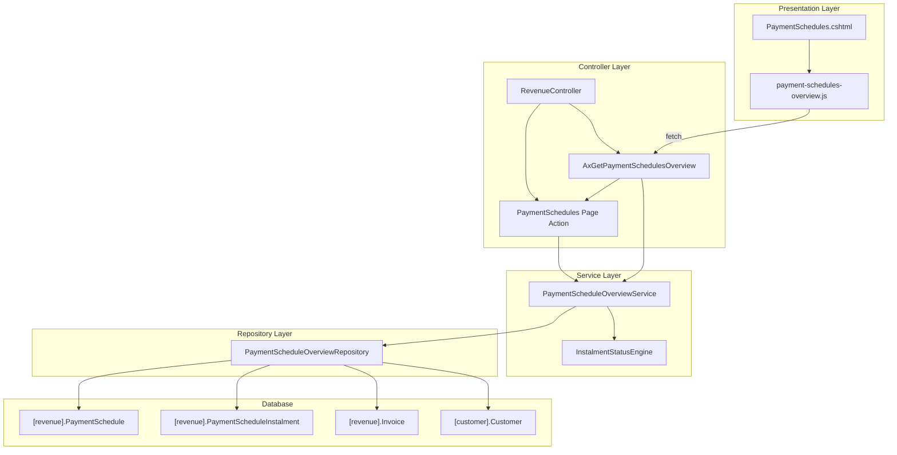
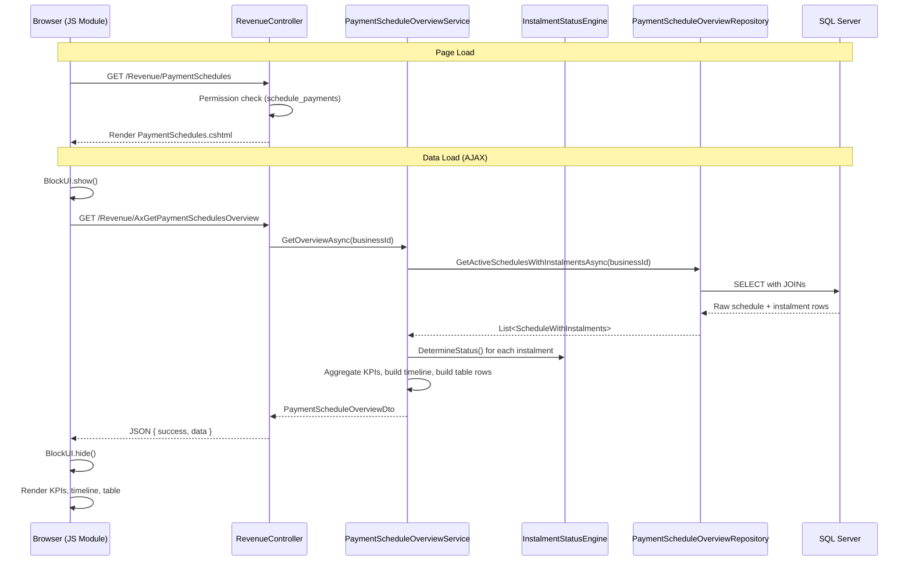

# Design Document: Payment Schedules Overview Page

## Overview

The Payment Schedules Overview adds a dedicated page at `/Revenue/PaymentSchedules` that provides a bird's-eye view of all active payment schedules for a business. The page is read-only — it aggregates existing data from `[revenue].[PaymentSchedule]` and `[revenue].[PaymentScheduleInstalment]`, computes KPI metrics, groups instalments by month for a timeline view, and renders a filterable/paginated table of active schedules with progress indicators.

No new database tables are required. The page reuses existing entities, repositories, and the `InstalmentStatusEngine` for status computation. The only new code surfaces are:

1. A **query service** (`IPaymentScheduleOverviewService`) with aggregation logic
2. **DTOs** for the overview response shape
3. A **controller endpoint** (`AxGetPaymentSchedulesOverview`)
4. A **Razor view** (`PaymentSchedules.cshtml`)
5. A **JavaScript module** (`payment-schedules-overview.js`)
6. A **sidebar navigation link** (permission-gated)

### Key Design Decisions

| Decision | Rationale |
|----------|-----------|
| Separate `IPaymentScheduleOverviewService` | Keeps read-only aggregation logic out of the mutation-focused `IPaymentScheduleService` |
| Single AJAX endpoint returning full payload | Avoids multiple round-trips; page is simple enough for one response object |
| Client-side filtering & pagination | Reduces server calls; dataset is bounded (active schedules per business) |
| No new DB tables or indexes | All data already exists; aggregation is done in a single query with JOINs |
| Status computed at read time | Consistent with existing pattern — `InstalmentStatusEngine.DetermineStatus()` |

## Architecture



### Request Flow



## Components and Interfaces

### Service Layer

#### IPaymentScheduleOverviewService

A new read-only service dedicated to aggregating payment schedule data for the overview page.

```csharp
namespace Portal.Infrastructure.Services;

public interface IPaymentScheduleOverviewService
{
    /// <summary>
    /// Retrieves all overview data for the Payment Schedules page:
    /// KPI metrics, monthly timeline, and table rows for all active schedules.
    /// </summary>
    Task<PaymentScheduleOverviewDto> GetOverviewAsync(int businessId);
}
```

#### PaymentScheduleOverviewService Implementation

```csharp
public class PaymentScheduleOverviewService : IPaymentScheduleOverviewService
{
    private readonly PaymentScheduleOverviewRepository _repository;
    private readonly IInstalmentStatusEngine _statusEngine;
    private readonly IBusinessService _businessService;

    public PaymentScheduleOverviewService(
        PaymentScheduleOverviewRepository repository,
        IInstalmentStatusEngine statusEngine,
        IBusinessService businessService)
    {
        _repository = repository;
        _statusEngine = statusEngine;
        _businessService = businessService;
    }

    public async Task<PaymentScheduleOverviewDto> GetOverviewAsync(int businessId)
    {
        // 1. Fetch all active schedules with their instalments, invoice number, and customer name
        var rawData = await _repository.GetActiveSchedulesWithInstalmentsAsync(businessId);

        // 2. Compute status for each instalment using InstalmentStatusEngine
        // 3. Aggregate KPIs (totalScheduled, collected, dueThisMonth, overdue)
        // 4. Build monthly timeline entries grouped by year/month
        // 5. Build table rows with progress and computed schedule status
        // 6. Get currency symbol from business profile

        var profile = await _businessService.GetBusinessProfileAsync(businessId);
        var currencySymbol = profile?.CurrencySymbol ?? "€";

        // ... aggregation logic ...

        return new PaymentScheduleOverviewDto { /* ... */ };
    }
}
```

### Repository Layer

#### PaymentScheduleOverviewRepository

A new repository with a single read-only query that fetches all the data needed for the overview in one round-trip.

```csharp
namespace Portal.Infrastructure.Repositories;

public class PaymentScheduleOverviewRepository : GenericStoredProcedureRepository<ScheduleOverviewRawRow>
{
    public PaymentScheduleOverviewRepository(DbContext context) : base(context) { }

    /// <summary>
    /// Gets all active payment schedules with their instalments, invoice numbers, and customer names.
    /// Single query with JOINs — avoids N+1.
    /// </summary>
    public virtual async Task<List<ScheduleOverviewRawRow>> GetActiveSchedulesWithInstalmentsAsync(int businessId)
    {
        try
        {
            const string query = @"
                SELECT [revenue].[PaymentSchedule].[Id] AS ScheduleId,
                       [revenue].[PaymentSchedule].[InvoiceId],
                       [revenue].[Invoice].[InvoiceNumber],
                       [customer].[Customer].[Name] AS CustomerName,
                       [revenue].[Invoice].[CustomerId],
                       [revenue].[PaymentScheduleInstalment].[Id] AS InstalmentId,
                       [revenue].[PaymentScheduleInstalment].[Amount],
                       [revenue].[PaymentScheduleInstalment].[MatchedAmount],
                       [revenue].[PaymentScheduleInstalment].[DueDate],
                       [revenue].[PaymentScheduleInstalment].[SequenceNumber]
                FROM [revenue].[PaymentSchedule]
                INNER JOIN [revenue].[PaymentScheduleInstalment]
                    ON [revenue].[PaymentSchedule].[Id] = [revenue].[PaymentScheduleInstalment].[PaymentScheduleId]
                INNER JOIN [revenue].[Invoice]
                    ON [revenue].[PaymentSchedule].[InvoiceId] = [revenue].[Invoice].[Id]
                INNER JOIN [customer].[Customer]
                    ON [revenue].[Invoice].[CustomerId] = [customer].[Customer].[Id]
                WHERE [revenue].[PaymentSchedule].[BusinessId] = @BusinessId
                  AND [revenue].[PaymentSchedule].[IsActive] = 1
                ORDER BY [revenue].[PaymentSchedule].[Id], [revenue].[PaymentScheduleInstalment].[SequenceNumber]";

            return await ExecuteStoredProcedure(query,
                new SqlParameter("@BusinessId", businessId));
        }
        catch (Exception ex)
        {
            throw;
        }
    }
}
```

### Controller Layer

Two endpoints on `RevenueController`:

```csharp
// Page action — renders the view (permission-gated)
[HttpGet]
public async Task<IActionResult> PaymentSchedules()
{
    var businessId = _tenantService.CurrentBusinessId;
    var userId = User.FindFirst(ClaimTypes.NameIdentifier)?.Value ?? string.Empty;

    var accessLevel = await _permissionService.GetAccessLevelAsync(userId, PortalModules.SchedulePayments, businessId);
    if (accessLevel == "none")
        return RedirectToAction(nameof(Dashboard));

    return View();
}

// AJAX data endpoint
[HttpGet]
public async Task<IActionResult> AxGetPaymentSchedulesOverview()
{
    try
    {
        var businessId = _tenantService.CurrentBusinessId;
        var userId = User.FindFirst(ClaimTypes.NameIdentifier)?.Value ?? string.Empty;

        var accessLevel = await _permissionService.GetAccessLevelAsync(userId, PortalModules.SchedulePayments, businessId);
        if (accessLevel == "none")
            return Json(new { success = false, message = "You do not have permission to view payment schedules." });

        var overview = await _paymentScheduleOverviewService.GetOverviewAsync(businessId);
        return Json(new { success = true, data = overview });
    }
    catch (Exception ex)
    {
        return Json(new { success = false, message = "An unexpected error occurred loading payment schedules." });
    }
}
```

### Sidebar Navigation

A new link is added to the `ModuleNavigation` component **after the Cash Flow link**, gated by `schedule_payments` permission:

```html
@if (hasSchedulePaymentsAccess)
{
    var isPaymentSchedulesActive = currentController.Equals("Revenue", StringComparison.OrdinalIgnoreCase)
        && currentAction.Equals("PaymentSchedules", StringComparison.OrdinalIgnoreCase);
    <a class="nav-item @(isPaymentSchedulesActive ? "active" : "")" asp-controller="Revenue" asp-action="PaymentSchedules">
        <span class="nav-icon"><svg width="18" height="18" fill="none" stroke="currentColor" stroke-width="2" viewBox="0 0 24 24"><path d="M4 6h16M4 10h16M4 14h10M4 18h6"/><path d="M18 14l2 2 4-4"/></svg></span>
        <span class="nav-text">Payment Schedules</span>
    </a>
}
```

The `hasSchedulePaymentsAccess` boolean is resolved via the same permission lookup pattern used for other nav items (`schedule_payments` module).

## Data Models

### Raw Entity (from repository query)

```csharp
namespace Portal.Infrastructure.Models;

/// <summary>
/// Flat row returned by the overview query — one row per instalment.
/// Grouped in-memory by ScheduleId to build the overview.
/// </summary>
public class ScheduleOverviewRawRow
{
    public int ScheduleId { get; set; }
    public int InvoiceId { get; set; }
    public string InvoiceNumber { get; set; } = null!;
    public string CustomerName { get; set; } = null!;
    public int CustomerId { get; set; }
    public int InstalmentId { get; set; }
    public decimal Amount { get; set; }
    public decimal MatchedAmount { get; set; }
    public DateOnly? DueDate { get; set; }
    public int SequenceNumber { get; set; }
}
```

### Response DTOs

```csharp
namespace Portal.Infrastructure.Models;

/// <summary>
/// Top-level response DTO for the Payment Schedules Overview page.
/// Contains all data needed by the JS module to render KPIs, timeline, and table.
/// </summary>
public class PaymentScheduleOverviewDto
{
    public OverviewKpiDto Kpis { get; set; } = new();
    public List<MonthlyTimelineEntryDto> Timeline { get; set; } = new();
    public List<ScheduleTableRowDto> Schedules { get; set; } = new();
    public List<int> AvailableYears { get; set; } = new();
    public string CurrencySymbol { get; set; } = "€";
}

/// <summary>
/// KPI summary metrics for the overview page.
/// </summary>
public class OverviewKpiDto
{
    public decimal TotalScheduled { get; set; }
    public decimal Collected { get; set; }
    public decimal DueThisMonth { get; set; }
    public decimal Overdue { get; set; }
}

/// <summary>
/// A single month row in the monthly payment timeline.
/// </summary>
public class MonthlyTimelineEntryDto
{
    public int Year { get; set; }
    public int Month { get; set; }
    public string MonthName { get; set; } = null!;
    public decimal TotalAmount { get; set; }
    public int InstalmentCount { get; set; }
    public bool HasOverdue { get; set; }
    public bool IsNoDueDate { get; set; }
}

/// <summary>
/// A single row in the Active Schedules table.
/// </summary>
public class ScheduleTableRowDto
{
    public int ScheduleId { get; set; }
    public int InvoiceId { get; set; }
    public string InvoiceNumber { get; set; } = null!;
    public string CustomerName { get; set; } = null!;
    public decimal ScheduleTotal { get; set; }
    public decimal Paid { get; set; }
    public decimal Remaining { get; set; }
    public string? NextDue { get; set; }
    public int ProgressPercentage { get; set; }
    public string Status { get; set; } = null!; // "On Track", "Has Overdue", "Completed"
}
```

### Aggregation Logic (Service Implementation Detail)

The service groups the raw rows by `ScheduleId` and computes:

**KPIs:**
- `TotalScheduled` = sum of all instalment `Amount` across all active schedules
- `Collected` = sum of all instalment `MatchedAmount` across all active schedules
- `DueThisMonth` = sum of `Amount` for instalments where `DueDate` is in the current calendar month AND status is Pending, Due, or Overdue
- `Overdue` = sum of `Amount - MatchedAmount` for instalments where computed status = Overdue (3)

**Monthly Timeline:**
- Group instalments by `DueDate.Year` and `DueDate.Month`
- Instalments with `DueDate == null` go into a special "No date assigned" entry
- `HasOverdue` = true if any instalment in that month has status = Overdue
- `AvailableYears` = distinct years from instalment due dates

**Schedule Table Rows:**
- `ScheduleTotal` = sum of instalment amounts for the schedule
- `Paid` = sum of instalment matched amounts for the schedule
- `Remaining` = `ScheduleTotal - Paid`
- `NextDue` = earliest `DueDate` among instalments with status Due/Overdue/Pending (priority: Overdue first, then Due, then Pending)
- `ProgressPercentage` = `(Paid / ScheduleTotal) * 100`, capped at 100
- `Status`:
  - "Completed" if all instalments have status = Paid
  - "Has Overdue" if any instalment has status = Overdue
  - "On Track" otherwise
- Sort: overdue-first, then by `NextDue` ascending

## Error Handling

| Scenario | Handling |
|----------|----------|
| User without `schedule_payments` permission visits page | Redirect to Revenue Dashboard |
| User without permission calls AJAX endpoint | Return `{ success: false, message: "..." }` |
| Repository query fails (DB timeout, connection error) | Catch in controller, return `{ success: false, message: "An unexpected error occurred..." }` |
| No active schedules exist | Return valid response with zero KPIs, empty timeline, empty schedules array |
| Business has no profile (edge case) | Default currency symbol to `€` |

The JS module handles errors using the standard Portal AJAX pattern:
1. `BlockUI.show('Loading payment schedules...')`
2. `fetch('/Revenue/AxGetPaymentSchedulesOverview')`
3. `BlockUI.hide()`
4. If `!data.success` → `Swal.fire({ icon: 'error', title: 'Error', text: data.message })`

## Testing Strategy

### Why Property-Based Testing Does NOT Apply

This feature is a **read-only overview page** with no mutations, no data transformations that vary meaningfully with input shape, and no serialization/parsing logic. The code:

- Reads existing data via SQL JOINs
- Calls an existing pure engine (`InstalmentStatusEngine`) that is already PBT-tested
- Performs arithmetic aggregation (sums, percentages)
- Renders HTML with JavaScript

PBT is not cost-effective here because:
1. The aggregation logic is simple arithmetic (sum, divide, group-by)
2. The `InstalmentStatusEngine` is already independently tested with property-based tests
3. The UI rendering is HTML/JS — not amenable to property testing
4. No round-trip or idempotence properties exist

### Recommended Test Approach

**Unit Tests (example-based):**

| Test | What it verifies |
|------|-----------------|
| `GetOverviewAsync_NoActiveSchedules_ReturnsZeroKpis` | Empty state produces all-zero KPIs and empty arrays |
| `GetOverviewAsync_SingleSchedule_CorrectKpis` | Basic KPI calculation with known data |
| `GetOverviewAsync_MixedStatuses_CorrectOverdue` | Overdue amount only includes overdue instalments |
| `GetOverviewAsync_DueThisMonth_OnlyCurrentMonth` | Due This Month KPI only counts current month instalments |
| `GetOverviewAsync_Timeline_GroupsByMonth` | Instalments grouped correctly by year/month |
| `GetOverviewAsync_Timeline_NoDueDateSeparate` | Null-date instalments in separate "No date assigned" entry |
| `GetOverviewAsync_TableSort_OverdueFirst` | Schedules with overdue instalments sort to top |
| `GetOverviewAsync_ProgressPercentage_Calculation` | Percentage = Paid/Total * 100, capped at 100 |
| `GetOverviewAsync_ScheduleStatus_Completed` | All-paid schedule shows "Completed" |
| `GetOverviewAsync_ScheduleStatus_HasOverdue` | Schedule with overdue instalment shows "Has Overdue" |
| `GetOverviewAsync_ScheduleStatus_OnTrack` | Schedule with no overdue shows "On Track" |

**Integration Tests:**

| Test | What it verifies |
|------|-----------------|
| `PaymentSchedules_Page_RequiresPermission` | Users without `schedule_payments` are redirected |
| `AxGetPaymentSchedulesOverview_ReturnsValidJson` | Endpoint returns expected JSON shape |
| `PaymentSchedules_Page_RendersForAuthorizedUser` | Authorized user gets 200 OK |

**Manual/Visual Tests:**

| Test | What it verifies |
|------|-----------------|
| Responsive layout at 768px breakpoint | KPI cards switch to 2x2 grid, timeline count hidden |
| Empty state display | Correct message when no schedules exist |
| Year selector interaction | Timeline filters correctly by selected year |
| Filter controls | Status, invoice, customer filters work correctly |
| Pagination | Pages switch correctly, info label updates |
| Invoice link navigation | Clicking invoice number navigates to `/Revenue/InvoiceDetail/{id}` |

### Test Framework

- Unit tests: xUnit + Moq (existing project pattern)
- Integration tests: `WebApplicationFactory<Program>` with test database
- No PBT library needed for this feature
