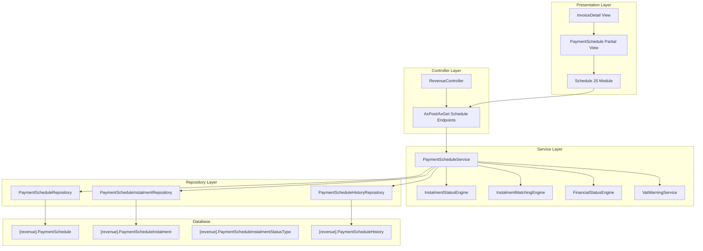
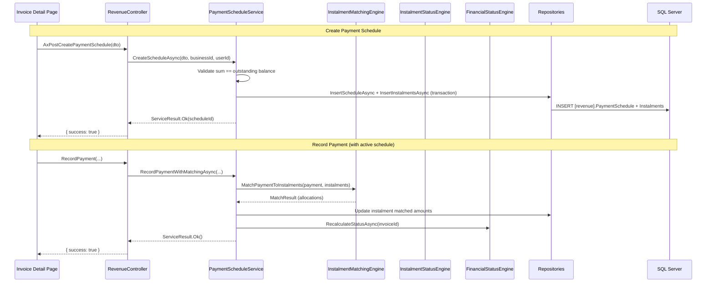
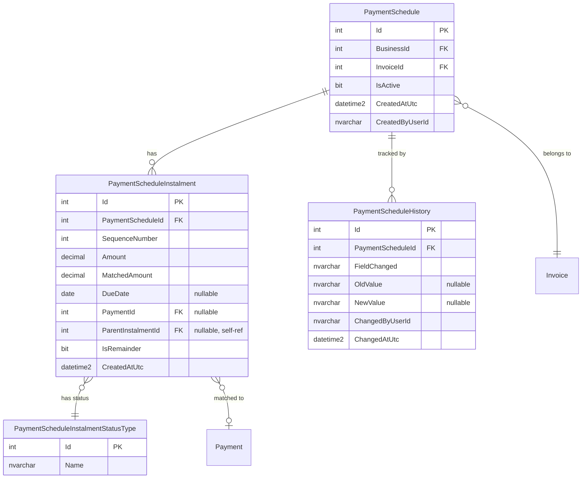

# Design Document: Payment Schedules (Instalment Plans)

## Overview

The Payment Schedules feature adds instalment plan management to the Portal's revenue module. It enables businesses to attach structured payment plans to invoices, automatically match incoming payments to instalments, track instalment status progression, and maintain a full audit history of schedule modifications.

The feature integrates with the existing `FinancialStatusEngine` to keep invoice financial status synchronised with schedule progress, and surfaces VAT deadline warnings when instalment timing creates cash flow risk.

### Key Design Decisions

| Decision | Rationale |
|----------|-----------|
| Tables in `[revenue]` schema | Payment schedules are a revenue concern; keeps related tables together |
| Computed status (not stored) | Instalment status is derived from due date + matched payments — avoids stale state |
| Single active schedule per invoice | Simplifies matching logic; enforced via unique filtered index |
| Remainder instalments as child rows | Maintains traceability back to original instalment for audit clarity |
| History table (not audit log) | Schedule-specific history with structured old/new values enables targeted display |

## Architecture



### Request Flow



## Components and Interfaces

### Service Layer

#### IPaymentScheduleService

```csharp
public interface IPaymentScheduleService
{
    Task<ServiceResult> CreateScheduleAsync(CreatePaymentScheduleDto dto, int businessId, string userId);
    Task<ServiceResult> UpdateInstalmentAsync(UpdateInstalmentDto dto, int businessId, string userId);
    Task<ServiceResult> AddInstalmentAsync(AddInstalmentDto dto, int businessId, string userId);
    Task<ServiceResult> RemoveInstalmentAsync(int instalmentId, int businessId, string userId);
    Task<ServiceResult> DeleteScheduleAsync(int scheduleId, int businessId, string userId);
    Task<PaymentScheduleDetailDto?> GetScheduleByInvoiceIdAsync(int invoiceId, int businessId);
    Task<List<PaymentScheduleHistoryDto>> GetScheduleHistoryAsync(int scheduleId, int businessId);
    Task<VatWarningDto?> GetVatWarningAsync(int invoiceId, DateOnly? firstInstalmentDueDate, decimal firstInstalmentAmount, int businessId);
    Task MatchPaymentToScheduleAsync(int paymentId, int invoiceId, int businessId, string userId);
    Task RevertPaymentMatchAsync(int paymentId, int invoiceId, int businessId);
}
```

#### IInstalmentStatusEngine

A pure computation engine (no I/O) that determines the current status of an instalment based on its due date and matched payment total.

```csharp
public interface IInstalmentStatusEngine
{
    /// <summary>
    /// Determines the instalment status based on due date, current date, and payment state.
    /// Pure function — no side effects.
    /// </summary>
    int DetermineStatus(DateOnly? dueDate, decimal instalmentAmount, decimal matchedTotal);
}
```

**Status determination rules (priority order):**
1. `matchedTotal >= instalmentAmount` → Paid (4)
2. `matchedTotal > 0 && matchedTotal < instalmentAmount` → PartiallyPaid (5)
3. `dueDate == null` → Pending (1)
4. `dueDate > today` → Pending (1)
5. `dueDate == today` → Due (2)
6. `dueDate < today` → Overdue (3)

#### IInstalmentMatchingEngine

A pure computation engine that determines how a payment should be allocated across instalments.

```csharp
public interface IInstalmentMatchingEngine
{
    /// <summary>
    /// Allocates a payment amount across eligible instalments following priority rules.
    /// Returns allocation instructions without performing any I/O.
    /// </summary>
    MatchResult AllocatePayment(decimal paymentAmount, List<InstalmentMatchCandidate> candidates);
}

public class InstalmentMatchCandidate
{
    public int InstalmentId { get; set; }
    public decimal Amount { get; set; }
    public decimal AlreadyMatched { get; set; }
    public int ComputedStatusId { get; set; }
    public int SequenceNumber { get; set; }
}

public class MatchResult
{
    public List<MatchAllocation> Allocations { get; set; } = new();
    public RemainderInstalment? Remainder { get; set; }
}

public class MatchAllocation
{
    public int InstalmentId { get; set; }
    public decimal AllocatedAmount { get; set; }
    public bool IsFullyPaid { get; set; }
}

public class RemainderInstalment
{
    public int ParentInstalmentId { get; set; }
    public decimal Amount { get; set; }
}
```

**Matching priority:** Due (2) → Overdue (3) → Pending (1), then by SequenceNumber ascending within each status group.

### Repository Layer

#### PaymentScheduleRepository

```csharp
public class PaymentScheduleRepository : GenericStoredProcedureRepository<PaymentSchedule>
{
    public PaymentScheduleRepository(DbContext context) : base(context) { }

    public async Task<int> InsertAsync(PaymentSchedule entity);
    public async Task<PaymentSchedule?> GetByInvoiceIdAsync(int invoiceId, int businessId);
    public async Task<PaymentSchedule?> GetByIdAndBusinessIdAsync(int id, int businessId);
    public async Task DeleteAsync(int scheduleId);
}
```

#### PaymentScheduleInstalmentRepository

```csharp
public class PaymentScheduleInstalmentRepository : GenericStoredProcedureRepository<PaymentScheduleInstalment>
{
    public PaymentScheduleInstalmentRepository(DbContext context) : base(context) { }

    public async Task<int> InsertAsync(PaymentScheduleInstalment entity);
    public async Task<List<PaymentScheduleInstalment>> GetByScheduleIdAsync(int scheduleId);
    public async Task UpdateMatchedAmountAsync(int instalmentId, decimal newMatchedAmount, int? paymentId);
    public async Task UpdateAmountAsync(int instalmentId, decimal newAmount);
    public async Task UpdateDueDateAsync(int instalmentId, DateOnly? newDueDate);
    public async Task DeleteAsync(int instalmentId);
    public async Task DeleteByScheduleIdAsync(int scheduleId);
    public async Task<PaymentScheduleInstalment?> GetByIdAsync(int id);
}
```

#### PaymentScheduleHistoryRepository

```csharp
public class PaymentScheduleHistoryRepository : GenericStoredProcedureRepository<PaymentScheduleHistory>
{
    public PaymentScheduleHistoryRepository(DbContext context) : base(context) { }

    public async Task InsertAsync(PaymentScheduleHistory entity);
    public async Task<List<PaymentScheduleHistory>> GetByScheduleIdAsync(int scheduleId);
}
```

### Controller Endpoints

All payment schedule AJAX endpoints live on the existing `RevenueController` to maintain cohesion with existing payment operations.

| HTTP | Endpoint | Method Name | Purpose |
|------|----------|-------------|---------|
| POST | /Revenue/AxPostCreatePaymentSchedule | `AxPostCreatePaymentSchedule` | Create schedule + instalments |
| POST | /Revenue/AxPostUpdateInstalment | `AxPostUpdateInstalment` | Modify instalment amount/date |
| POST | /Revenue/AxPostAddInstalment | `AxPostAddInstalment` | Add instalment to existing schedule |
| POST | /Revenue/AxPostRemoveInstalment | `AxPostRemoveInstalment` | Remove unmatched instalment |
| POST | /Revenue/AxPostDeletePaymentSchedule | `AxPostDeletePaymentSchedule` | Delete entire schedule |
| GET  | /Revenue/AxGetPaymentSchedule | `AxGetPaymentSchedule` | Get schedule detail for invoice |
| GET  | /Revenue/AxGetScheduleHistory | `AxGetScheduleHistory` | Get modification history |
| GET  | /Revenue/AxGetVatWarning | `AxGetVatWarning` | Check VAT deadline conflict |

### DTOs (Models)

```csharp
// === Request DTOs ===

public class CreatePaymentScheduleDto
{
    public int InvoiceId { get; set; }
    public List<CreateInstalmentDto> Instalments { get; set; } = new();
}

public class CreateInstalmentDto
{
    public decimal Amount { get; set; }
    public DateOnly? DueDate { get; set; }
}

public class UpdateInstalmentDto
{
    public int InstalmentId { get; set; }
    public int ScheduleId { get; set; }
    public decimal? NewAmount { get; set; }
    public DateOnly? NewDueDate { get; set; }
    public bool ClearDueDate { get; set; }
}

public class AddInstalmentDto
{
    public int ScheduleId { get; set; }
    public decimal Amount { get; set; }
    public DateOnly? DueDate { get; set; }
}

// === Response DTOs ===

public class PaymentScheduleDetailDto
{
    public int Id { get; set; }
    public int InvoiceId { get; set; }
    public List<InstalmentDetailDto> Instalments { get; set; } = new();
    public decimal TotalPaid { get; set; }
    public decimal TotalRemaining { get; set; }
    public int CompletedCount { get; set; }
    public int TotalCount { get; set; }
    public DateTime CreatedAtUtc { get; set; }
}

public class InstalmentDetailDto
{
    public int Id { get; set; }
    public int SequenceNumber { get; set; }
    public decimal Amount { get; set; }
    public decimal MatchedAmount { get; set; }
    public DateOnly? DueDate { get; set; }
    public int StatusId { get; set; }
    public string StatusName { get; set; } = null!;
    public int? ParentInstalmentId { get; set; }
    public bool IsRemainder { get; set; }
    public int? PaymentId { get; set; }
}

public class PaymentScheduleHistoryDto
{
    public int Id { get; set; }
    public string FieldChanged { get; set; } = null!;
    public string? OldValue { get; set; }
    public string? NewValue { get; set; }
    public string ChangedByUserId { get; set; } = null!;
    public DateTime ChangedAtUtc { get; set; }
}

public class VatWarningDto
{
    public bool ShowWarning { get; set; }
    public bool HighlightVatAmount { get; set; }
    public decimal TaxAmount { get; set; }
    public DateOnly SubmissionDeadline { get; set; }
    public string Message { get; set; } = null!;
}
```

### View Integration

The payment schedule UI is rendered as a **partial view** embedded within the existing invoice detail pages:

- `Views/Revenue/InvoiceDetail.cshtml` — includes `_PaymentScheduleSection.cshtml`
- `Views/Invoice/Detail.cshtml` — includes `_PaymentScheduleSection.cshtml`

The partial view renders:
1. A progress summary bar (total paid / total / completion count)
2. An instalment table with sequence, amount, due date, status badge, and actions
3. Create/Edit/Delete controls (visible only with `schedule_payments` permission)
4. A history accordion showing modification log

JavaScript is isolated in a `payment-schedule.js` module that handles:
- Dynamic instalment row addition/removal in create form
- Real-time balance validation (sum check)
- VAT warning fetch on first instalment date change
- AJAX calls with BlockUI + SweetAlert2 pattern

## Data Models

### Database Schema



### SQL Migration Scripts

#### Migration 106: CreatePaymentScheduleInstalmentStatusTypeTable

```sql
-- ============================================================
-- Migration: 106_CreatePaymentScheduleInstalmentStatusTypeTable
-- Description: Reference table for instalment status types
-- ============================================================

USE [Portal]
GO

IF NOT EXISTS (
    SELECT 1 FROM INFORMATION_SCHEMA.TABLES
    WHERE TABLE_SCHEMA = 'revenue' AND TABLE_NAME = 'PaymentScheduleInstalmentStatusType'
)
BEGIN
    CREATE TABLE [revenue].[PaymentScheduleInstalmentStatusType]
    (
        [Id]   INT           NOT NULL,
        [Name] NVARCHAR(50)  NOT NULL,

        CONSTRAINT [PK_PaymentScheduleInstalmentStatusType] PRIMARY KEY CLUSTERED ([Id])
    );

    INSERT INTO [revenue].[PaymentScheduleInstalmentStatusType] ([Id], [Name])
    VALUES
        (1, 'Pending'),
        (2, 'Due'),
        (3, 'Overdue'),
        (4, 'Paid'),
        (5, 'PartiallyPaid');
END
GO
```

#### Migration 107: CreatePaymentScheduleTable

```sql
-- ============================================================
-- Migration: 107_CreatePaymentScheduleTable
-- Description: Creates the [revenue].PaymentSchedule table — a structured
--              instalment plan attached to an invoice.
-- ============================================================

USE [Portal]
GO

IF NOT EXISTS (
    SELECT 1 FROM INFORMATION_SCHEMA.TABLES
    WHERE TABLE_SCHEMA = 'revenue' AND TABLE_NAME = 'PaymentSchedule'
)
BEGIN
    CREATE TABLE [revenue].[PaymentSchedule]
    (
        [Id]              INT            IDENTITY(1,1) NOT NULL,
        [BusinessId]      INT                          NOT NULL,
        [InvoiceId]       INT                          NOT NULL,
        [IsActive]        BIT                          NOT NULL CONSTRAINT [DF_PaymentSchedule_IsActive] DEFAULT (1),
        [CreatedAtUtc]    DATETIME2                    NOT NULL CONSTRAINT [DF_PaymentSchedule_CreatedAtUtc] DEFAULT (GETUTCDATE()),
        [CreatedByUserId] NVARCHAR(450)                NULL,

        CONSTRAINT [PK_PaymentSchedule] PRIMARY KEY CLUSTERED ([Id]),
        CONSTRAINT [FK_PaymentSchedule_Business] FOREIGN KEY ([BusinessId]) REFERENCES [portal].[Business] ([Id]),
        CONSTRAINT [FK_PaymentSchedule_Invoice] FOREIGN KEY ([InvoiceId]) REFERENCES [invoice].[Invoice] ([Id])
    );
END
GO

-- Unique filtered index: only one active schedule per invoice
IF NOT EXISTS (
    SELECT 1 FROM sys.indexes
    WHERE [name] = 'UX_PaymentSchedule_InvoiceId_Active'
      AND [object_id] = OBJECT_ID('[revenue].[PaymentSchedule]')
)
BEGIN
    CREATE UNIQUE NONCLUSTERED INDEX [UX_PaymentSchedule_InvoiceId_Active]
        ON [revenue].[PaymentSchedule] ([InvoiceId])
        WHERE [IsActive] = 1;
END
GO

IF NOT EXISTS (
    SELECT 1 FROM sys.indexes
    WHERE [name] = 'IX_PaymentSchedule_BusinessId'
      AND [object_id] = OBJECT_ID('[revenue].[PaymentSchedule]')
)
BEGIN
    CREATE NONCLUSTERED INDEX [IX_PaymentSchedule_BusinessId]
        ON [revenue].[PaymentSchedule] ([BusinessId]);
END
GO
```

#### Migration 108: CreatePaymentScheduleInstalmentTable

```sql
-- ============================================================
-- Migration: 108_CreatePaymentScheduleInstalmentTable
-- Description: Creates the [revenue].PaymentScheduleInstalment table —
--              individual instalment records within a payment schedule.
-- ============================================================

USE [Portal]
GO

IF NOT EXISTS (
    SELECT 1 FROM INFORMATION_SCHEMA.TABLES
    WHERE TABLE_SCHEMA = 'revenue' AND TABLE_NAME = 'PaymentScheduleInstalment'
)
BEGIN
    CREATE TABLE [revenue].[PaymentScheduleInstalment]
    (
        [Id]                  INT            IDENTITY(1,1) NOT NULL,
        [PaymentScheduleId]   INT                          NOT NULL,
        [SequenceNumber]      INT                          NOT NULL,
        [Amount]              DECIMAL(18,2)                NOT NULL,
        [MatchedAmount]       DECIMAL(18,2)                NOT NULL CONSTRAINT [DF_PSInstalment_MatchedAmount] DEFAULT (0),
        [DueDate]             DATE                         NULL,
        [PaymentId]           INT                          NULL,
        [ParentInstalmentId]  INT                          NULL,
        [IsRemainder]         BIT                          NOT NULL CONSTRAINT [DF_PSInstalment_IsRemainder] DEFAULT (0),
        [CreatedAtUtc]        DATETIME2                    NOT NULL CONSTRAINT [DF_PSInstalment_CreatedAtUtc] DEFAULT (GETUTCDATE()),

        CONSTRAINT [PK_PaymentScheduleInstalment] PRIMARY KEY CLUSTERED ([Id]),
        CONSTRAINT [FK_PSInstalment_PaymentSchedule] FOREIGN KEY ([PaymentScheduleId])
            REFERENCES [revenue].[PaymentSchedule] ([Id]),
        CONSTRAINT [FK_PSInstalment_Payment] FOREIGN KEY ([PaymentId])
            REFERENCES [revenue].[Payment] ([Id]),
        CONSTRAINT [FK_PSInstalment_ParentInstalment] FOREIGN KEY ([ParentInstalmentId])
            REFERENCES [revenue].[PaymentScheduleInstalment] ([Id])
    );
END
GO

IF NOT EXISTS (
    SELECT 1 FROM sys.indexes
    WHERE [name] = 'IX_PSInstalment_PaymentScheduleId'
      AND [object_id] = OBJECT_ID('[revenue].[PaymentScheduleInstalment]')
)
BEGIN
    CREATE NONCLUSTERED INDEX [IX_PSInstalment_PaymentScheduleId]
        ON [revenue].[PaymentScheduleInstalment] ([PaymentScheduleId])
        INCLUDE ([SequenceNumber], [Amount], [MatchedAmount], [DueDate]);
END
GO
```

#### Migration 109: CreatePaymentScheduleHistoryTable

```sql
-- ============================================================
-- Migration: 109_CreatePaymentScheduleHistoryTable
-- Description: Creates the [revenue].PaymentScheduleHistory table —
--              audit trail of all schedule modifications.
-- ============================================================

USE [Portal]
GO

IF NOT EXISTS (
    SELECT 1 FROM INFORMATION_SCHEMA.TABLES
    WHERE TABLE_SCHEMA = 'revenue' AND TABLE_NAME = 'PaymentScheduleHistory'
)
BEGIN
    CREATE TABLE [revenue].[PaymentScheduleHistory]
    (
        [Id]                  INT            IDENTITY(1,1) NOT NULL,
        [PaymentScheduleId]   INT                          NOT NULL,
        [FieldChanged]        NVARCHAR(100)                NOT NULL,
        [OldValue]            NVARCHAR(500)                NULL,
        [NewValue]            NVARCHAR(500)                NULL,
        [ChangedByUserId]     NVARCHAR(450)                NOT NULL,
        [ChangedAtUtc]        DATETIME2                    NOT NULL CONSTRAINT [DF_PSHistory_ChangedAtUtc] DEFAULT (GETUTCDATE()),

        CONSTRAINT [PK_PaymentScheduleHistory] PRIMARY KEY CLUSTERED ([Id]),
        CONSTRAINT [FK_PSHistory_PaymentSchedule] FOREIGN KEY ([PaymentScheduleId])
            REFERENCES [revenue].[PaymentSchedule] ([Id])
    );
END
GO

IF NOT EXISTS (
    SELECT 1 FROM sys.indexes
    WHERE [name] = 'IX_PSHistory_PaymentScheduleId'
      AND [object_id] = OBJECT_ID('[revenue].[PaymentScheduleHistory]')
)
BEGIN
    CREATE NONCLUSTERED INDEX [IX_PSHistory_PaymentScheduleId]
        ON [revenue].[PaymentScheduleHistory] ([PaymentScheduleId])
        INCLUDE ([ChangedAtUtc]);
END
GO
```

### Entity Classes

```csharp
namespace Portal.Infrastructure.Entities;

/// <summary>
/// A structured instalment plan attached to an invoice defining how the outstanding
/// balance will be collected across multiple instalments over time.
/// Schema: [revenue].PaymentSchedule
/// </summary>
public class PaymentSchedule
{
    public int Id { get; set; }
    public int BusinessId { get; set; }
    public int InvoiceId { get; set; }
    public bool IsActive { get; set; }
    public DateTime CreatedAtUtc { get; set; }
    public string? CreatedByUserId { get; set; }

    // Navigation properties
    public Business Business { get; set; } = null!;
    public Invoice Invoice { get; set; } = null!;
    public ICollection<PaymentScheduleInstalment> Instalments { get; set; } = new List<PaymentScheduleInstalment>();
    public ICollection<PaymentScheduleHistory> History { get; set; } = new List<PaymentScheduleHistory>();
}

/// <summary>
/// A single planned payment within a Payment Schedule with a target amount and optional due date.
/// Schema: [revenue].PaymentScheduleInstalment
/// </summary>
public class PaymentScheduleInstalment
{
    public int Id { get; set; }
    public int PaymentScheduleId { get; set; }
    public int SequenceNumber { get; set; }
    public decimal Amount { get; set; }
    public decimal MatchedAmount { get; set; }
    public DateOnly? DueDate { get; set; }
    public int? PaymentId { get; set; }
    public int? ParentInstalmentId { get; set; }
    public bool IsRemainder { get; set; }
    public DateTime CreatedAtUtc { get; set; }

    // Navigation properties
    public PaymentSchedule PaymentSchedule { get; set; } = null!;
    public Payment? Payment { get; set; }
    public PaymentScheduleInstalment? ParentInstalment { get; set; }
}

/// <summary>
/// Reference table for instalment status types.
/// Schema: [revenue].PaymentScheduleInstalmentStatusType
/// </summary>
public class PaymentScheduleInstalmentStatusType
{
    public int Id { get; set; }
    public string Name { get; set; } = null!;
}

/// <summary>
/// An audit record capturing a single modification to a Payment Schedule or its instalments.
/// Schema: [revenue].PaymentScheduleHistory
/// </summary>
public class PaymentScheduleHistory
{
    public int Id { get; set; }
    public int PaymentScheduleId { get; set; }
    public string FieldChanged { get; set; } = null!;
    public string? OldValue { get; set; }
    public string? NewValue { get; set; }
    public string ChangedByUserId { get; set; } = null!;
    public DateTime ChangedAtUtc { get; set; }

    // Navigation properties
    public PaymentSchedule PaymentSchedule { get; set; } = null!;
}
```

### Permission Constant

Add to `PortalModules.cs`:

```csharp
public const string SchedulePayments = "schedule_payments";
```

And include in the `All` array.

### Integration with Existing PaymentService

The existing `PaymentService.RecordPaymentAsync` method needs modification to trigger instalment matching after a payment is recorded. The approach:

1. After inserting the payment in `PaymentService.RecordPaymentAsync`, check if the invoice has an active schedule
2. If yes, delegate to `PaymentScheduleService.MatchPaymentToScheduleAsync`
3. The matching engine allocates the payment, updates instalment matched amounts
4. The `FinancialStatusEngine.RecalculateStatusAsync` call (already present) continues to work — but now considers schedule-level status for the invoice financial status update

Similarly, `PaymentService.VoidPaymentAsync` needs to call `PaymentScheduleService.RevertPaymentMatchAsync` before recalculating financial status.

### Status Computation Note

Instalment status is **computed at read time** by the `InstalmentStatusEngine`, not stored in the database. This avoids stale state issues (e.g., an instalment becoming Overdue overnight without a write event). The `PaymentScheduleInstalmentStatusType` table exists for display lookup and reference integrity in history entries, but no `StatusTypeId` column exists on the instalment row itself.

## Correctness Properties

*A property is a characteristic or behavior that should hold true across all valid executions of a system — essentially, a formal statement about what the system should do. Properties serve as the bridge between human-readable specifications and machine-verifiable correctness guarantees.*

### Property 1: Instalment Status Determination

*For any* instalment with a given due date (or null), current date, instalment amount, and matched payment total, the `InstalmentStatusEngine.DetermineStatus` function SHALL return the correct status according to the priority rules: Paid when matchedTotal >= amount, PartiallyPaid when 0 < matchedTotal < amount, Pending when dueDate is null or in the future, Due when dueDate is today, Overdue when dueDate is in the past.

**Validates: Requirements 2.2, 2.3, 2.4, 2.5, 2.6, 2.7**

### Property 2: Payment Matching Correctness

*For any* payment amount and ordered list of eligible instalments (sorted by status priority Due > Overdue > Pending, then by sequence number), the `InstalmentMatchingEngine.AllocatePayment` function SHALL allocate the full payment amount such that: (a) the sum of all allocations plus any remainder equals the original payment amount, (b) each allocation does not exceed the instalment's remaining balance, (c) instalments are filled in priority order, and (d) a remainder instalment is created only when the final allocation partially fills an instalment.

**Validates: Requirements 3.1, 3.3, 3.4, 3.5**

### Property 3: Schedule Balance Invariant

*For any* payment schedule at any point in its lifecycle (after creation, after payment matching, after modification), the sum of all instalment amounts (excluding remainder instalments that replaced their parent) SHALL equal the invoice's outstanding balance at the time the schedule was created or last revalidated.

**Validates: Requirements 1.4, 4.4, 5.6**

### Property 4: Invoice Financial Status Derivation

*For any* invoice with an active payment schedule, the derived `InvoiceFinancialStatusTypeId` SHALL be: Paid (3) when all instalments have computed status Paid, PartiallyPaid (2) when at least one instalment is Paid or PartiallyPaid but others are not, and unchanged when no instalments have any matched payments. Additionally, voiding a payment that was matched to an instalment SHALL correctly revert the instalment's matched amount and trigger recalculation.

**Validates: Requirements 6.1, 6.2, 6.3, 6.4**

### Property 5: Modification History Completeness

*For any* modification to a payment schedule (amount change, due date change, instalment addition, instalment removal, or schedule deletion), the system SHALL produce a `PaymentScheduleHistory` entry with non-null values for: FieldChanged, ChangedByUserId, and ChangedAtUtc. For value changes, OldValue and NewValue SHALL accurately reflect the before/after state.

**Validates: Requirements 5.1, 11.4**

### Property 6: VAT Warning Logic

*For any* invoice with an assigned VAT submission period, when the first instalment's due date is after the period's submission deadline, the VAT warning SHALL be displayed. Furthermore, when the first instalment's amount is less than the invoice's TaxAmount AND the due date exceeds the deadline, the warning SHALL additionally highlight the VAT amount. When no VAT period is assigned, no warning SHALL be produced.

**Validates: Requirements 7.2, 7.4, 7.5**

### Property 7: Progress Summary Correctness

*For any* payment schedule with N instalments in various states, the progress summary SHALL satisfy: TotalPaid + TotalRemaining == schedule total amount (sum of leaf instalment amounts), and CompletedCount == count of instalments with computed status Paid.

**Validates: Requirements 8.3**

### Property 8: Deletion Protection

*For any* payment schedule, deletion SHALL be blocked if and only if at least one instalment has a MatchedAmount > 0 (indicating a payment has been matched). Schedules where all instalments have MatchedAmount == 0 SHALL be deletable.

**Validates: Requirements 11.2**

## Error Handling

### Validation Errors (returned to user via ServiceResult.Fail)

| Scenario | Error Message |
|----------|---------------|
| Sum of instalments ≠ outstanding balance | "The total of all instalments ({sum}) does not equal the outstanding balance ({balance})." |
| Attempt to modify Paid instalment | "This instalment has already been paid and cannot be modified." |
| Attempt to remove matched instalment | "This instalment has a matched payment and cannot be removed." |
| Attempt to delete schedule with payments | "This schedule has matched payments and cannot be deleted. Remove the payments first." |
| Schedule already exists for invoice | "A payment schedule already exists for this invoice." |
| Invoice not found or wrong tenant | "Invoice not found." |
| Permission denied | Handled at controller level via permission check — returns 403 |

### System Errors (caught, logged, generic message to user)

| Scenario | Handling |
|----------|----------|
| Database constraint violation (unique index) | Catch `DbUpdateException`, return "A schedule already exists" |
| Transaction failure during creation | Entire operation rolls back; return "Failed to create schedule" |
| Concurrent modification (optimistic concurrency) | Retry once, then return "Please refresh and try again" |

### Controller Error Pattern

```csharp
[HttpPost]
[ValidateAntiForgeryToken]
public async Task<IActionResult> AxPostCreatePaymentSchedule([FromBody] CreatePaymentScheduleDto dto)
{
    try
    {
        var businessId = _tenantService.CurrentBusinessId;
        var userId = User.FindFirst(ClaimTypes.NameIdentifier)?.Value ?? string.Empty;

        // Permission check
        var accessLevel = await _permissionService.GetAccessLevelAsync(userId, PortalModules.SchedulePayments, businessId);
        if (accessLevel == AccessLevels.None)
            return Json(new { success = false, message = "You do not have permission to manage payment schedules." });

        var result = await _paymentScheduleService.CreateScheduleAsync(dto, businessId, userId);
        return Json(new { success = result.Success, message = result.Success ? "Payment schedule created." : result.Message });
    }
    catch (Exception ex)
    {
        return Json(new { success = false, message = "An unexpected error occurred." });
    }
}
```

## Testing Strategy

### Property-Based Testing

The feature's core logic (status determination, payment matching, balance validation) is implemented as **pure computation engines** with no I/O dependencies, making them ideal candidates for property-based testing.

**Library:** [FsCheck](https://fscheck.github.io/FsCheck/) with xUnit integration (`FsCheck.Xunit`)

**Configuration:** Minimum 100 iterations per property test.

**Tag format:** `Feature: payment-schedules, Property {N}: {description}`

#### Property Tests to Implement

| Property | Target | Generator Strategy |
|----------|--------|-------------------|
| 1: Status Determination | `InstalmentStatusEngine.DetermineStatus` | Random DateOnly? (null, past, today, future), random decimal amounts (0..10000), random matched totals (0..amount) |
| 2: Payment Matching | `InstalmentMatchingEngine.AllocatePayment` | Random payment amounts, random lists of 1-10 instalment candidates with varying amounts and statuses |
| 3: Balance Invariant | `PaymentScheduleService` validation logic | Random lists of instalment amounts, random outstanding balances |
| 4: Financial Status Derivation | Integration of status engine + financial status logic | Random schedules with mixed instalment states |
| 5: History Completeness | `PaymentScheduleService` modification methods | Random field changes with random old/new values |
| 6: VAT Warning | `VatWarningService` logic | Random VAT deadlines, random due dates, random amounts vs tax amounts |
| 7: Progress Summary | Summary calculation function | Random lists of instalments with varying matched amounts |
| 8: Deletion Protection | `PaymentScheduleService.DeleteScheduleAsync` validation | Random schedules with varying matched amounts (0 and >0) |

### Unit Tests (Example-Based)

| Area | Test Cases |
|------|-----------|
| Permission enforcement | Create/modify/delete without permission returns failure |
| Schedule creation | Valid creation persists correctly; duplicate blocked |
| Instalment modification | Paid instalment rejects changes; unpaid allows |
| Instalment removal | Matched instalment rejects; unmatched succeeds |
| VAT warning edge cases | No VAT period → no warning; null due date → no warning |
| Payment matching bypass | No active schedule → normal payment flow unchanged |

### Integration Tests

| Area | Test Cases |
|------|-----------|
| Transaction atomicity | Schedule + instalments created atomically |
| Unique constraint | Second active schedule insert fails |
| Cascade behaviour | Schedule deletion removes all child instalments |
| Payment recording flow | End-to-end: record payment → matching → status update |
| Void flow | Void payment → revert match → recalculate status |

### Manual Testing Checklist

- [ ] Create schedule on invoice detail page (verify form validation)
- [ ] Record payment and verify auto-matching on UI
- [ ] Partial payment → verify remainder instalment appears
- [ ] Modify instalment amount → verify history entry
- [ ] Delete schedule → verify SweetAlert2 confirmation and removal
- [ ] VAT warning appears when first instalment is after deadline
- [ ] Read-only view for users without `schedule_payments` permission
- [ ] Progress bar updates correctly as payments are recorded
