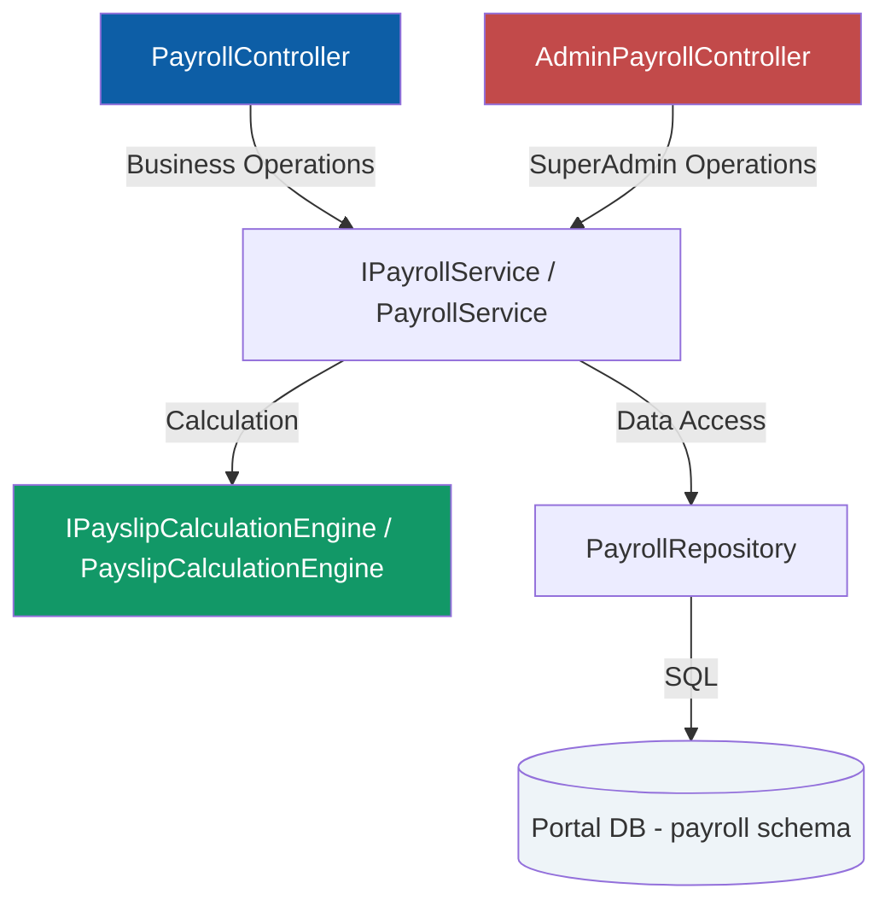
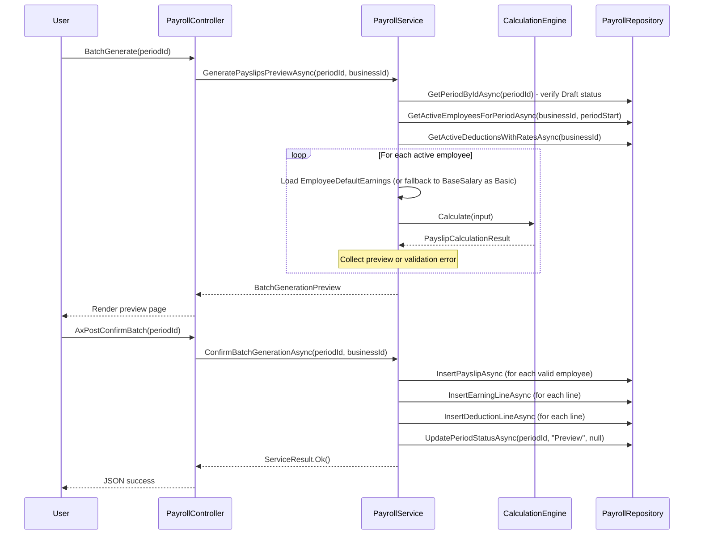

# Design Document — Payroll Phase A (Core Engine)

## Overview

Phase A delivers the minimum viable payslip generation capability for the Portal platform. It introduces a dedicated `[payroll]` schema with 9 tables, a pure calculation engine that computes net salary and employer contributions from configurable earning lines and historically-accurate deduction rates, and a batch generation workflow with preview/confirm semantics.

The module is gated to Enterprise-tier subscribers via the existing `ModuleAccess` attribute pattern and follows the established Controller → Service → Repository architecture.

### Key Design Decisions

| # | Decision | Rationale |
|---|----------|-----------|
| 1 | Dedicated `[payroll]` schema | Logical grouping, granular security, prevents table name collisions |
| 2 | Single `PayrollRepository` | Mirrors `ComplianceRepository` — one repository per bounded context |
| 3 | Separate `PayslipCalculationEngine` | Pure calculation logic isolated from orchestration — independently testable |
| 4 | Rate history with date-range lookup | Ensures payslips always use the rate effective at the period date |
| 5 | EUR only | Multi-currency deferred to future phase — simplifies calculation logic |
| 8 | Business-scoped deductions | DeductionType has BusinessId — each business has its own set. Templates (BusinessId=NULL, IsTemplate=1) are importable. |
| 9 | EarningType is global/system-level | Shared across all businesses. No business-specific earning type customisation in Phase A. |
| 10 | EmployeeDefaultEarnings | Pre-configured recurring earning lines per employee, used as defaults during batch generation. |
| 6 | Batch generation with preview | Users confirm before committing — prevents accidental payslip creation |
| 7 | Status lifecycle: Draft → Preview → Finalised | Clear workflow gates prevent premature edits to finalised data |
| 11 | DeductionCategoryType lookup | Each DeductionType belongs to exactly one category (1=Deduction from employee, 2=Contribution by employer). Cleaner separation than boolean flags. |
| 12 | Payslip PDF + Email in Phase A | PDF generation, optional signature, email send (single + batch) included in core engine — not deferred to Phase C. |

---

## Architecture



### Layer Responsibilities

| Layer | Component | Responsibility |
|-------|-----------|---------------|
| Controller | `PayrollController` | HTTP concerns, model binding, auth, `[ModuleAccess(PortalModules.Payroll)]` |
| Controller | `AdminPayrollController` | SuperAdmin-only: deduction/earning type management, `[Authorize(Roles = "SuperAdmin")]` |
| Service | `PayrollService` | Business orchestration, validation, batch generation workflow |
| Engine | `PayslipCalculationEngine` | Pure computation: earnings → deductions → net salary (no I/O) |
| Repository | `PayrollRepository` | All SQL data access for the `[payroll]` schema |

---

## Components and Interfaces

### 1. PayrollController (Business-Facing)

```csharp
[Authorize]
[ModuleAccess(PortalModules.Payroll)]
public class PayrollController : Controller
{
    // === Page Actions ===
    Task<IActionResult> Departments()                         // Department list
    Task<IActionResult> DepartmentForm(int? id)               // Create/Edit department
    Task<IActionResult> Employees()                           // Employee list
    Task<IActionResult> EmployeeForm(int? id)                 // Create/Edit employee
    Task<IActionResult> Periods()                             // Payslip period list
    Task<IActionResult> PeriodDetail(int id)                  // Period with payslips
    Task<IActionResult> PayslipDetail(int id)                 // Individual payslip view
    Task<IActionResult> BatchGenerate(int periodId)           // Batch generation preview

    // === AJAX Endpoints ===
    Task<IActionResult> AxPostCreateDepartment([FromBody] CreateDepartmentRequest request)
    Task<IActionResult> AxPostUpdateDepartment([FromBody] UpdateDepartmentRequest request)
    Task<IActionResult> AxPostToggleDepartment(int id)
    Task<IActionResult> AxPostCreateEmployee([FromBody] CreateEmployeeRequest request)
    Task<IActionResult> AxPostUpdateEmployee([FromBody] UpdateEmployeeRequest request)
    Task<IActionResult> AxPostToggleEmployee(int id)
    Task<IActionResult> AxPostCreatePeriod([FromBody] CreatePeriodRequest request)
    Task<IActionResult> AxPostGeneratePayslips(int periodId)
    Task<IActionResult> AxPostConfirmBatch(int periodId)
    Task<IActionResult> AxPostFinalisePeriod(int periodId)
    Task<IActionResult> AxPostSaveEarningLines([FromBody] SaveEarningLinesRequest request)
    Task<IActionResult> AxPostSaveManagerNotes([FromBody] SaveManagerNotesRequest request)
    Task<IActionResult> AxGetDownloadPayslipPdf(int payslipId)
    Task<IActionResult> AxPostSendPayslipEmail(int payslipId, bool includeSignature)
    Task<IActionResult> AxPostSendAllPayslipEmails(int periodId, bool includeSignature)
}
```

### 2. AdminPayrollController (SuperAdmin)

```csharp
[Authorize(Roles = "SuperAdmin")]
public class AdminPayrollController : Controller
{
    // === Page Actions ===
    Task<IActionResult> EarningTypes()                        // Manage earning types
    Task<IActionResult> DeductionTypes()                      // Manage deduction types
    Task<IActionResult> DeductionRateHistory(int id)          // Rate history for a deduction

    // === AJAX Endpoints ===
    Task<IActionResult> AxPostCreateEarningType([FromBody] CreateEarningTypeRequest request)
    Task<IActionResult> AxPostToggleEarningType(int id)
    Task<IActionResult> AxPostCreateDeductionType([FromBody] CreateDeductionTypeRequest request)
    Task<IActionResult> AxPostToggleDeductionType(int id)
    Task<IActionResult> AxPostAddRateHistory([FromBody] AddRateHistoryRequest request)
}
```

### 3. IPayrollService / PayrollService

```csharp
public interface IPayrollService
{
    // Department Management
    Task<List<DepartmentDto>> GetDepartmentsAsync(int businessId);
    Task<DepartmentDto?> GetDepartmentByIdAsync(int id, int businessId);
    Task<ServiceResult> CreateDepartmentAsync(int businessId, CreateDepartmentRequest request);
    Task<ServiceResult> UpdateDepartmentAsync(int businessId, UpdateDepartmentRequest request);
    Task<ServiceResult> ToggleDepartmentAsync(int id, int businessId);

    // Employee Management
    Task<PagedResult<EmployeeDto>> GetEmployeesAsync(int businessId, string? search, int? departmentId, bool? isActive, int page, int pageSize);
    Task<EmployeeDetailDto?> GetEmployeeByIdAsync(int id, int businessId);
    Task<ServiceResult> CreateEmployeeAsync(int businessId, CreateEmployeeRequest request);
    Task<ServiceResult> UpdateEmployeeAsync(int businessId, UpdateEmployeeRequest request);
    Task<ServiceResult> ToggleEmployeeAsync(int id, int businessId);

    // Earning Types (Admin)
    Task<List<EarningTypeDto>> GetEarningTypesAsync();
    Task<ServiceResult> CreateEarningTypeAsync(CreateEarningTypeRequest request);
    Task<ServiceResult> ToggleEarningTypeAsync(int id);

    // Deduction Types (Admin)
    Task<List<DeductionTypeDto>> GetDeductionTypesAsync();
    Task<ServiceResult> CreateDeductionTypeAsync(CreateDeductionTypeRequest request);
    Task<ServiceResult> ToggleDeductionTypeAsync(int id);
    Task<List<DeductionRateHistoryDto>> GetRateHistoryAsync(int deductionTypeId);
    Task<ServiceResult> AddRateHistoryAsync(AddRateHistoryRequest request);

    // Deduction Template Import
    Task<List<DeductionTypeDto>> GetDeductionTemplatesAsync(string country);
    Task<ServiceResult> ImportDeductionTemplatesAsync(int businessId, int[] templateIds);

    // Employee Default Earnings
    Task<List<EmployeeDefaultEarningsDto>> GetDefaultEarningsAsync(int employeeId, int businessId);
    Task<ServiceResult> SaveDefaultEarningsAsync(int businessId, int employeeId, List<EmployeeDefaultEarningInput> lines);

    // Period Management
    Task<List<PayslipPeriodDto>> GetPeriodsAsync(int businessId);
    Task<PayslipPeriodDetailDto?> GetPeriodDetailAsync(int id, int businessId);
    Task<ServiceResult> CreatePeriodAsync(int businessId, CreatePeriodRequest request);
    Task<ServiceResult> FinalisePeriodAsync(int id, int businessId);

    // Payslip Generation
    Task<BatchGenerationPreview> GeneratePayslipsPreviewAsync(int periodId, int businessId);
    Task<ServiceResult> ConfirmBatchGenerationAsync(int periodId, int businessId);
    Task<PayslipDetailDto?> GetPayslipDetailAsync(int id, int businessId);
    Task<ServiceResult> SaveEarningLinesAsync(int businessId, SaveEarningLinesRequest request);
    Task<ServiceResult> SaveManagerNotesAsync(int businessId, SaveManagerNotesRequest request);

    // Payslip PDF & Email
    Task<byte[]> GeneratePayslipPdfAsync(int payslipId, int businessId, bool includeSignature);
    Task<ServiceResult> SendPayslipEmailAsync(int payslipId, int businessId, bool includeSignature);
    Task<ServiceResult> SendAllPayslipEmailsAsync(int periodId, int businessId, bool includeSignature);
}
```

### 4. IPayslipCalculationEngine / PayslipCalculationEngine

This is the core computation component — a pure function with no database I/O.

```csharp
public interface IPayslipCalculationEngine
{
    PayslipCalculationResult Calculate(PayslipCalculationInput input);
}

public class PayslipCalculationEngine : IPayslipCalculationEngine
{
    public PayslipCalculationResult Calculate(PayslipCalculationInput input)
    {
        // Step 1: Resolve each earning line amount
        // Step 2: Compute TotalEarnings
        // Step 3: For each deduction, compute CalculatedAmount
        // Step 4: Separate employee vs employer portions
        // Step 5: Compute NetSalary
        // Returns complete result with all computed values
    }
}
```

#### Calculation Algorithm (Pseudocode)

```
FUNCTION Calculate(input: PayslipCalculationInput) -> PayslipCalculationResult

  // Step 1: Resolve earning line amounts
  FOR EACH earningLine IN input.EarningLines:
    IF earningLine.EarningTypeCode == "Overtime":
      multiplier = earningLine.OvertimeMultiplier ?? 1.5
      VALIDATE multiplier >= 1.0 AND multiplier <= 4.0
      earningLine.Amount = earningLine.OvertimeHours * input.Employee.HourlyRate * multiplier
    ELSE:
      // Amount is already set (manually entered)
      VALIDATE earningLine.Amount > 0

  // Step 2: Compute TotalEarnings
  totalEarnings = SUM(earningLine.Amount FOR EACH earningLine IN input.EarningLines)

  // Step 3: For each applicable deduction, look up rate and compute
  deductionLines = []
  FOR EACH deductionType IN input.ApplicableDeductions:
    rateHistory = FindEffectiveRate(deductionType.RateHistories, input.PeriodDate)
    IF rateHistory IS NULL:
      RAISE ValidationError("No valid rate for {deductionType.Name} on {input.PeriodDate}")

    IF deductionType.IsPercentage:
      calculatedAmount = ROUND(totalEarnings * (rateHistory.Rate / 100), 2, MidpointRounding.AwayFromZero)
    ELSE:
      calculatedAmount = rateHistory.Rate  // Fixed amount

    // Each DeductionType belongs to exactly one category (Deduction or Contribution)
    deductionLines.ADD(new DeductionLine {
      DeductionTypeId, BaseAmount = totalEarnings, Rate = rateHistory.Rate,
      CalculatedAmount = calculatedAmount,
      DeductionCategoryTypeId = deductionType.DeductionCategoryTypeId,
      DeductionRateHistoryId = rateHistory.Id
    })

  // Step 4: Compute totals
  totalEmployeeDeductions = SUM(line.CalculatedAmount WHERE line.DeductionCategoryTypeId == 1)  // Deductions
  totalEmployerContributions = SUM(line.CalculatedAmount WHERE line.DeductionCategoryTypeId == 2)  // Contributions

  // Step 5: Compute NetSalary
  netSalary = totalEarnings - totalEmployeeDeductions

  RETURN PayslipCalculationResult {
    TotalEarnings = totalEarnings,
    TotalEmployeeDeductions = totalEmployeeDeductions,
    NetSalary = netSalary,
    TotalEmployerContributions = totalEmployerContributions,
    EarningLines = resolvedEarningLines,
    DeductionLines = deductionLines
  }

FUNCTION FindEffectiveRate(histories, periodDate) -> DeductionRateHistory?
  RETURN histories.WHERE(h => h.EffectiveFromUtc <= periodDate
                           AND (h.EffectiveToUtc IS NULL OR h.EffectiveToUtc > periodDate))
                  .SINGLE_OR_DEFAULT()
```

### 5. PayrollRepository

Single repository for all payroll data access, following the `ComplianceRepository` pattern.

```csharp
public class PayrollRepository : GenericStoredProcedureRepository<PayslipPeriod>
{
    public PayrollRepository(DbContext context) : base(context) { }

    // Department
    Task<List<Department>> GetDepartmentsByBusinessAsync(int businessId)
    Task<Department?> GetDepartmentByIdAsync(int id, int businessId)
    Task<int> InsertDepartmentAsync(Department entity)
    Task UpdateDepartmentAsync(Department entity)
    Task<bool> DepartmentNameExistsAsync(int businessId, string name, int? excludeId)
    Task<bool> DepartmentHasActiveEmployeesAsync(int id)

    // Employee
    Task<(List<Employee> Items, int TotalCount)> GetEmployeesAsync(int businessId, string? search, int? departmentId, bool? isActive, int page, int pageSize)
    Task<Employee?> GetEmployeeByIdAsync(int id, int businessId)
    Task<int> InsertEmployeeAsync(Employee entity)
    Task UpdateEmployeeAsync(Employee entity)
    Task<bool> SocialInsuranceNumberExistsAsync(int businessId, string sin, int? excludeId)
    Task<bool> IdNumberExistsAsync(int businessId, string idNumber, int? excludeId)
    Task<List<Employee>> GetActiveEmployeesForPeriodAsync(int businessId, DateTime periodStart)

    // Earning Types
    Task<List<EarningType>> GetAllEarningTypesAsync()
    Task<int> InsertEarningTypeAsync(EarningType entity)
    Task ToggleEarningTypeAsync(int id)

    // Deduction Types
    Task<List<DeductionType>> GetAllDeductionTypesAsync()
    Task<int> InsertDeductionTypeAsync(DeductionType entity)
    Task ToggleDeductionTypeAsync(int id)
    Task<List<DeductionRateHistory>> GetRateHistoryAsync(int deductionTypeId)
    Task<int> InsertRateHistoryAsync(DeductionRateHistory entity)
    Task CloseCurrentRateAsync(int deductionTypeId, DateTime effectiveToUtc)
    Task<List<DeductionType>> GetActiveDeductionsWithRatesAsync(int businessId)

    // Deduction Templates
    Task<List<DeductionType>> GetTemplatesByCountryAsync(string country)
    Task InsertDeductionTypeWithRatesAsync(DeductionType type, List<DeductionRateHistory> rates)

    // Payslip Period
    Task<List<PayslipPeriod>> GetPeriodsByBusinessAsync(int businessId)
    Task<PayslipPeriod?> GetPeriodByIdAsync(int id, int businessId)
    Task<int> InsertPeriodAsync(PayslipPeriod entity)
    Task UpdatePeriodStatusAsync(int id, string status, DateTime? processedAtUtc)
    Task<bool> PeriodExistsAsync(int businessId, int year, int month)

    // Payslip
    Task<int> InsertPayslipAsync(Payslip entity)
    Task<List<Payslip>> GetPayslipsByPeriodAsync(int periodId)
    Task<Payslip?> GetPayslipDetailAsync(int id, int businessId)
    Task UpdatePayslipTotalsAsync(Payslip entity)
    Task UpdateManagerNotesAsync(int payslipId, string? notes)

    // Earning Lines
    Task InsertEarningLineAsync(PayslipEarningLine entity)
    Task DeleteEarningLinesByPayslipAsync(int payslipId)
    Task<List<PayslipEarningLine>> GetEarningLinesByPayslipAsync(int payslipId)

    // Deduction Lines
    Task InsertDeductionLineAsync(PayslipDeductionLine entity)
    Task DeleteDeductionLinesByPayslipAsync(int payslipId)
    Task<List<PayslipDeductionLine>> GetDeductionLinesByPayslipAsync(int payslipId)

    // Employee Default Earnings
    Task<List<EmployeeDefaultEarnings>> GetDefaultEarningsByEmployeeAsync(int employeeId)
    Task InsertDefaultEarningAsync(EmployeeDefaultEarnings entity)
    Task UpdateDefaultEarningAsync(EmployeeDefaultEarnings entity)
    Task DeleteDefaultEarningAsync(int id)

    // Email Log
    Task InsertEmailLogAsync(PayslipEmailLog entity)
    Task<List<PayslipEmailLog>> GetEmailLogsByPayslipAsync(int payslipId)
}
```

---

## Data Models

### Database Schema (SQL DDL)

```sql
-- ============================================================
-- Payroll Phase A — Schema and Table Creation
-- ============================================================

USE [Portal]
GO

-- Create the payroll schema
IF NOT EXISTS (SELECT 1 FROM sys.schemas WHERE name = 'payroll')
    EXEC('CREATE SCHEMA [payroll]')
GO

-- ============================================================
-- 0. PayslipStatusType (Lookup)
-- ============================================================
CREATE TABLE [payroll].[PayslipStatusType] (
    [Id]    TINYINT NOT NULL,
    [Name]  NVARCHAR(20) NOT NULL,
    CONSTRAINT [PK_PayslipStatusType] PRIMARY KEY CLUSTERED ([Id])
)
GO

INSERT INTO [payroll].[PayslipStatusType] ([Id], [Name]) VALUES
    (1, 'Draft'),
    (2, 'Preview'),
    (3, 'Finalised')
GO

-- ============================================================
-- 0b. DeductionCategoryType (Lookup)
-- ============================================================
CREATE TABLE [payroll].[DeductionCategoryType] (
    [Id]    TINYINT NOT NULL,
    [Name]  NVARCHAR(20) NOT NULL,
    CONSTRAINT [PK_DeductionCategoryType] PRIMARY KEY CLUSTERED ([Id])
)
GO

INSERT INTO [payroll].[DeductionCategoryType] ([Id], [Name]) VALUES
    (1, 'Deduction'),
    (2, 'Contribution')
GO

-- ============================================================
-- 1. Department
-- ============================================================
CREATE TABLE [payroll].[Department] (
    [Id]            INT IDENTITY(1,1) NOT NULL,
    [BusinessId]    INT NOT NULL,
    [Name]          NVARCHAR(200) NOT NULL,
    [IsActive]      BIT NOT NULL DEFAULT 1,
    [CreatedAtUtc]  DATETIME NOT NULL DEFAULT GETUTCDATE(),
    CONSTRAINT [PK_Department] PRIMARY KEY CLUSTERED ([Id]),
    CONSTRAINT [UQ_Department_BusinessId_Name] UNIQUE ([BusinessId], [Name])
)
GO

-- ============================================================
-- 2. Employee
-- ============================================================
CREATE TABLE [payroll].[Employee] (
    [Id]                      INT IDENTITY(1,1) NOT NULL,
    [BusinessId]              INT NOT NULL,
    [DepartmentId]            INT NULL,
    [Name]                    NVARCHAR(300) NOT NULL,
    [Position]                NVARCHAR(200) NULL,
    [SocialInsuranceNumber]   NVARCHAR(50) NOT NULL,
    [IdNumber]                NVARCHAR(50) NOT NULL,
    [Phone]                   NVARCHAR(50) NULL,
    [Email]                   NVARCHAR(200) NULL,
    [StartDate]               DATE NOT NULL,
    [EndDate]                 DATE NULL,
    [SalaryType]              NVARCHAR(50) NOT NULL,
    [BaseSalary]              DECIMAL(18,2) NOT NULL,
    [HourlyRate]              DECIMAL(18,2) NULL,
    [BankAccount]             NVARCHAR(100) NULL,
    [IsActive]                BIT NOT NULL DEFAULT 1,
    [CreatedAtUtc]            DATETIME NOT NULL DEFAULT GETUTCDATE(),
    CONSTRAINT [PK_Employee] PRIMARY KEY CLUSTERED ([Id]),
    CONSTRAINT [FK_Employee_Department] FOREIGN KEY ([DepartmentId])
        REFERENCES [payroll].[Department]([Id]),
    CONSTRAINT [UQ_Employee_BusinessId_SIN] UNIQUE ([BusinessId], [SocialInsuranceNumber]),
    CONSTRAINT [UQ_Employee_BusinessId_IdNumber] UNIQUE ([BusinessId], [IdNumber])
)
GO
```

**Valid SalaryType values:** "Full-time", "Part-time", "Hourly". All are overtime-eligible. HourlyRate is required for overtime earning line calculation regardless of SalaryType.

```sql
-- ============================================================
-- 2b. EmployeeDefaultEarnings
-- ============================================================
CREATE TABLE [payroll].[EmployeeDefaultEarnings] (
    [Id]                  INT IDENTITY(1,1) NOT NULL,
    [EmployeeId]          INT NOT NULL,
    [EarningTypeId]       INT NOT NULL,
    [Description]         NVARCHAR(300) NULL,
    [Amount]              DECIMAL(18,2) NULL,
    [OvertimeMultiplier]  DECIMAL(4,2) NULL,
    [OvertimeHours]       DECIMAL(6,2) NULL,
    [CreatedAtUtc]        DATETIME NOT NULL DEFAULT GETUTCDATE(),
    CONSTRAINT [PK_EmployeeDefaultEarnings] PRIMARY KEY CLUSTERED ([Id]),
    CONSTRAINT [FK_EmployeeDefaultEarnings_Employee] FOREIGN KEY ([EmployeeId])
        REFERENCES [payroll].[Employee]([Id]),
    CONSTRAINT [FK_EmployeeDefaultEarnings_EarningType] FOREIGN KEY ([EarningTypeId])
        REFERENCES [payroll].[EarningType]([Id])
)
GO
```

```sql
-- ============================================================
-- 3. EarningType
-- ============================================================
CREATE TABLE [payroll].[EarningType] (
    [Id]            INT IDENTITY(1,1) NOT NULL,
    [Name]          NVARCHAR(100) NOT NULL,
    [Code]          NVARCHAR(50) NOT NULL,
    [IsActive]      BIT NOT NULL DEFAULT 1,
    [SortOrder]     INT NOT NULL DEFAULT 0,
    [CreatedAtUtc]  DATETIME NOT NULL DEFAULT GETUTCDATE(),
    CONSTRAINT [PK_EarningType] PRIMARY KEY CLUSTERED ([Id]),
    CONSTRAINT [UQ_EarningType_Code] UNIQUE ([Code])
)
GO

-- ============================================================
-- 4. DeductionType
-- ============================================================
CREATE TABLE [payroll].[DeductionType] (
    [Id]                      INT IDENTITY(1,1) NOT NULL,
    [Name]                    NVARCHAR(200) NOT NULL,
    [Code]                    NVARCHAR(50) NOT NULL,
    [IsPercentage]            BIT NOT NULL DEFAULT 1,
    [DeductionCategoryTypeId] TINYINT NOT NULL,
    [IsActive]                BIT NOT NULL DEFAULT 1,
    [BusinessId]              INT NULL,
    [Country]                 NVARCHAR(50) NOT NULL DEFAULT 'CY',
    [IsTemplate]              BIT NOT NULL DEFAULT 0,
    [CreatedAtUtc]            DATETIME NOT NULL DEFAULT GETUTCDATE(),
    CONSTRAINT [PK_DeductionType] PRIMARY KEY CLUSTERED ([Id]),
    CONSTRAINT [UQ_DeductionType_BusinessId_Code] UNIQUE ([BusinessId], [Code]),
    CONSTRAINT [FK_DeductionType_CategoryType] FOREIGN KEY ([DeductionCategoryTypeId])
        REFERENCES [payroll].[DeductionCategoryType]([Id])
)
GO

-- ============================================================
-- 5. DeductionRateHistory
-- ============================================================
CREATE TABLE [payroll].[DeductionRateHistory] (
    [Id]                INT IDENTITY(1,1) NOT NULL,
    [DeductionTypeId]   INT NOT NULL,
    [Rate]              DECIMAL(6,2) NOT NULL,
    [EffectiveFromUtc]  DATETIME NOT NULL,
    [EffectiveToUtc]    DATETIME NULL,
    [CreatedAtUtc]      DATETIME NOT NULL DEFAULT GETUTCDATE(),
    CONSTRAINT [PK_DeductionRateHistory] PRIMARY KEY CLUSTERED ([Id]),
    CONSTRAINT [FK_DeductionRateHistory_DeductionType] FOREIGN KEY ([DeductionTypeId])
        REFERENCES [payroll].[DeductionType]([Id])
)
GO

-- Index for business-specific deduction lookup
CREATE NONCLUSTERED INDEX [IX_DeductionType_BusinessId]
    ON [payroll].[DeductionType] ([BusinessId], [IsActive]) INCLUDE ([Code], [Name])
GO
```

```sql
-- ============================================================
-- 6. PayslipPeriod
-- ============================================================
CREATE TABLE [payroll].[PayslipPeriod] (
    [Id]              INT IDENTITY(1,1) NOT NULL,
    [BusinessId]      INT NOT NULL,
    [Year]            INT NOT NULL,
    [Month]           INT NOT NULL,
    [PayslipStatusTypeId]  TINYINT NOT NULL DEFAULT 1,
    [ProcessedAtUtc]  DATETIME NULL,
    [CreatedAtUtc]    DATETIME NOT NULL DEFAULT GETUTCDATE(),
    CONSTRAINT [PK_PayslipPeriod] PRIMARY KEY CLUSTERED ([Id]),
    CONSTRAINT [UQ_PayslipPeriod_Business_YearMonth] UNIQUE ([BusinessId], [Year], [Month]),
    CONSTRAINT [FK_PayslipPeriod_StatusType] FOREIGN KEY ([PayslipStatusTypeId])
        REFERENCES [payroll].[PayslipStatusType]([Id])
)
GO

-- ============================================================
-- 7. Payslip
-- ============================================================
CREATE TABLE [payroll].[Payslip] (
    [Id]                          INT IDENTITY(1,1) NOT NULL,
    [EmployeeId]                  INT NOT NULL,
    [PayslipPeriodId]             INT NOT NULL,
    [TotalEarnings]               DECIMAL(18,2) NOT NULL DEFAULT 0,
    [TotalEmployeeDeductions]     DECIMAL(18,2) NOT NULL DEFAULT 0,
    [NetSalary]                   DECIMAL(18,2) NOT NULL DEFAULT 0,
    [TotalEmployerContributions]  DECIMAL(18,2) NOT NULL DEFAULT 0,
    [ManagerNotes]                NVARCHAR(2000) NULL,
    [PayslipStatusTypeId]         TINYINT NOT NULL DEFAULT 1,
    [CreatedAtUtc]                DATETIME NOT NULL DEFAULT GETUTCDATE(),
    CONSTRAINT [PK_Payslip] PRIMARY KEY CLUSTERED ([Id]),
    CONSTRAINT [FK_Payslip_Employee] FOREIGN KEY ([EmployeeId])
        REFERENCES [payroll].[Employee]([Id]),
    CONSTRAINT [FK_Payslip_PayslipPeriod] FOREIGN KEY ([PayslipPeriodId])
        REFERENCES [payroll].[PayslipPeriod]([Id]),
    CONSTRAINT [FK_Payslip_StatusType] FOREIGN KEY ([PayslipStatusTypeId])
        REFERENCES [payroll].[PayslipStatusType]([Id])
)
GO

-- ============================================================
-- 8. PayslipEarningLine
-- ============================================================
CREATE TABLE [payroll].[PayslipEarningLine] (
    [Id]                  INT IDENTITY(1,1) NOT NULL,
    [PayslipId]           INT NOT NULL,
    [EarningTypeId]       INT NOT NULL,
    [Description]         NVARCHAR(300) NULL,
    [Amount]              DECIMAL(18,2) NOT NULL,
    [OvertimeMultiplier]  DECIMAL(4,2) NULL,
    [OvertimeHours]       DECIMAL(6,2) NULL,
    [CreatedAtUtc]        DATETIME NOT NULL DEFAULT GETUTCDATE(),
    CONSTRAINT [PK_PayslipEarningLine] PRIMARY KEY CLUSTERED ([Id]),
    CONSTRAINT [FK_PayslipEarningLine_Payslip] FOREIGN KEY ([PayslipId])
        REFERENCES [payroll].[Payslip]([Id]),
    CONSTRAINT [FK_PayslipEarningLine_EarningType] FOREIGN KEY ([EarningTypeId])
        REFERENCES [payroll].[EarningType]([Id]),
    CONSTRAINT [CK_PayslipEarningLine_Multiplier] CHECK (
        [OvertimeMultiplier] IS NULL OR ([OvertimeMultiplier] >= 1.0 AND [OvertimeMultiplier] <= 4.0)
    )
)
GO
```

```sql
-- ============================================================
-- 9. PayslipDeductionLine
-- ============================================================
CREATE TABLE [payroll].[PayslipDeductionLine] (
    [Id]                      INT IDENTITY(1,1) NOT NULL,
    [PayslipId]               INT NOT NULL,
    [DeductionTypeId]         INT NOT NULL,
    [BaseAmount]              DECIMAL(18,2) NOT NULL,
    [Rate]                    DECIMAL(6,2) NOT NULL,
    [CalculatedAmount]        DECIMAL(18,2) NOT NULL,
    [DeductionCategoryTypeId] TINYINT NOT NULL,
    [DeductionRateHistoryId]  INT NOT NULL,
    [CreatedAtUtc]            DATETIME NOT NULL DEFAULT GETUTCDATE(),
    CONSTRAINT [PK_PayslipDeductionLine] PRIMARY KEY CLUSTERED ([Id]),
    CONSTRAINT [FK_PayslipDeductionLine_Payslip] FOREIGN KEY ([PayslipId])
        REFERENCES [payroll].[Payslip]([Id]),
    CONSTRAINT [FK_PayslipDeductionLine_DeductionType] FOREIGN KEY ([DeductionTypeId])
        REFERENCES [payroll].[DeductionType]([Id]),
    CONSTRAINT [FK_PayslipDeductionLine_RateHistory] FOREIGN KEY ([DeductionRateHistoryId])
        REFERENCES [payroll].[DeductionRateHistory]([Id]),
    CONSTRAINT [FK_PayslipDeductionLine_CategoryType] FOREIGN KEY ([DeductionCategoryTypeId])
        REFERENCES [payroll].[DeductionCategoryType]([Id])
)
GO
```

```sql
-- ============================================================
-- 10. PayslipEmailLog
-- ============================================================
CREATE TABLE [payroll].[PayslipEmailLog] (
    [Id]                INT IDENTITY(1,1) NOT NULL,
    [PayslipId]         INT NOT NULL,
    [SentByUserId]      NVARCHAR(450) NOT NULL,
    [SentToEmail]       NVARCHAR(200) NOT NULL,
    [IsSignatureIncluded] BIT NOT NULL DEFAULT 0,
    [SentAtUtc]         DATETIME NOT NULL DEFAULT GETUTCDATE(),
    [CreatedAtUtc]      DATETIME NOT NULL DEFAULT GETUTCDATE(),
    CONSTRAINT [PK_PayslipEmailLog] PRIMARY KEY CLUSTERED ([Id]),
    CONSTRAINT [FK_PayslipEmailLog_Payslip] FOREIGN KEY ([PayslipId])
        REFERENCES [payroll].[Payslip]([Id])
)
GO
```

### Indexes

```sql
-- Performance indexes for common query patterns
CREATE NONCLUSTERED INDEX [IX_Employee_BusinessId_IsActive]
    ON [payroll].[Employee] ([BusinessId], [IsActive]) INCLUDE ([Name], [DepartmentId])
GO

CREATE NONCLUSTERED INDEX [IX_Payslip_PayslipPeriodId]
    ON [payroll].[Payslip] ([PayslipPeriodId]) INCLUDE ([EmployeeId], [NetSalary])
GO

CREATE NONCLUSTERED INDEX [IX_PayslipPeriod_BusinessId_Status]
    ON [payroll].[PayslipPeriod] ([BusinessId], [PayslipStatusTypeId]) INCLUDE ([Year], [Month])
GO

CREATE NONCLUSTERED INDEX [IX_DeductionRateHistory_Lookup]
    ON [payroll].[DeductionRateHistory] ([DeductionTypeId], [EffectiveFromUtc]) INCLUDE ([EffectiveToUtc], [Rate])
GO

CREATE NONCLUSTERED INDEX [IX_PayslipEarningLine_PayslipId]
    ON [payroll].[PayslipEarningLine] ([PayslipId])
GO

CREATE NONCLUSTERED INDEX [IX_PayslipDeductionLine_PayslipId]
    ON [payroll].[PayslipDeductionLine] ([PayslipId])
GO
```

### Entity Classes

```csharp
namespace Portal.Infrastructure.Entities;

public class Department
{
    public int Id { get; set; }
    public int BusinessId { get; set; }
    public string Name { get; set; } = string.Empty;
    public bool IsActive { get; set; } = true;
    public DateTime CreatedAtUtc { get; set; }
}

public class Employee
{
    public int Id { get; set; }
    public int BusinessId { get; set; }
    public int? DepartmentId { get; set; }
    public string Name { get; set; } = string.Empty;
    public string? Position { get; set; }
    public string SocialInsuranceNumber { get; set; } = string.Empty;
    public string IdNumber { get; set; } = string.Empty;
    public string? Phone { get; set; }
    public string? Email { get; set; }
    public DateTime StartDate { get; set; }
    public DateTime? EndDate { get; set; }
    public string SalaryType { get; set; } = string.Empty;
    public decimal BaseSalary { get; set; }
    public decimal? HourlyRate { get; set; }
    public string? BankAccount { get; set; }
    public bool IsActive { get; set; } = true;
    public DateTime CreatedAtUtc { get; set; }
}

public class EarningType
{
    public int Id { get; set; }
    public string Name { get; set; } = string.Empty;
    public string Code { get; set; } = string.Empty;
    public bool IsActive { get; set; } = true;
    public int SortOrder { get; set; }
    public DateTime CreatedAtUtc { get; set; }
}

public class DeductionType
{
    public int Id { get; set; }
    public string Name { get; set; } = string.Empty;
    public string Code { get; set; } = string.Empty;
    public bool IsPercentage { get; set; } = true;
    public byte DeductionCategoryTypeId { get; set; }
    public int? BusinessId { get; set; }
    public bool IsActive { get; set; } = true;
    public string Country { get; set; } = "CY";
    public bool IsTemplate { get; set; }
    public DateTime CreatedAtUtc { get; set; }
}

public class DeductionRateHistory
{
    public int Id { get; set; }
    public int DeductionTypeId { get; set; }
    public decimal Rate { get; set; }
    public DateTime EffectiveFromUtc { get; set; }
    public DateTime? EffectiveToUtc { get; set; }
    public DateTime CreatedAtUtc { get; set; }
}

public class PayslipPeriod
{
    public int Id { get; set; }
    public int BusinessId { get; set; }
    public int Year { get; set; }
    public int Month { get; set; }
    public byte PayslipStatusTypeId { get; set; } = 1;
    public DateTime? ProcessedAtUtc { get; set; }
    public DateTime CreatedAtUtc { get; set; }
}
```

```csharp
public class Payslip
{
    public int Id { get; set; }
    public int EmployeeId { get; set; }
    public int PayslipPeriodId { get; set; }
    public decimal TotalEarnings { get; set; }
    public decimal TotalEmployeeDeductions { get; set; }
    public decimal NetSalary { get; set; }
    public decimal TotalEmployerContributions { get; set; }
    public string? ManagerNotes { get; set; }
    public byte PayslipStatusTypeId { get; set; } = 1;
    public DateTime CreatedAtUtc { get; set; }
}

public class PayslipEarningLine
{
    public int Id { get; set; }
    public int PayslipId { get; set; }
    public int EarningTypeId { get; set; }
    public string? Description { get; set; }
    public decimal Amount { get; set; }
    public decimal? OvertimeMultiplier { get; set; }
    public decimal? OvertimeHours { get; set; }
    public DateTime CreatedAtUtc { get; set; }
}

public class PayslipDeductionLine
{
    public int Id { get; set; }
    public int PayslipId { get; set; }
    public int DeductionTypeId { get; set; }
    public decimal BaseAmount { get; set; }
    public decimal Rate { get; set; }
    public decimal CalculatedAmount { get; set; }
    public byte DeductionCategoryTypeId { get; set; }
    public int DeductionRateHistoryId { get; set; }
    public DateTime CreatedAtUtc { get; set; }
}

public class PayslipStatusType
{
    public byte Id { get; set; }
    public string Name { get; set; } = string.Empty;
}

public class DeductionCategoryType
{
    public byte Id { get; set; }
    public string Name { get; set; } = string.Empty;
}

public class EmployeeDefaultEarnings
{
    public int Id { get; set; }
    public int EmployeeId { get; set; }
    public int EarningTypeId { get; set; }
    public string? Description { get; set; }
    public decimal? Amount { get; set; }
    public decimal? OvertimeMultiplier { get; set; }
    public decimal? OvertimeHours { get; set; }
    public DateTime CreatedAtUtc { get; set; }
}

public class PayslipEmailLog
{
    public int Id { get; set; }
    public int PayslipId { get; set; }
    public string SentByUserId { get; set; } = string.Empty;
    public string SentToEmail { get; set; } = string.Empty;
    public bool IsSignatureIncluded { get; set; }
    public DateTime SentAtUtc { get; set; }
    public DateTime CreatedAtUtc { get; set; }
}
```

### DTO Models

```csharp
namespace Portal.Infrastructure.Models.Payroll;

// --- Department ---
public class DepartmentDto
{
    public int Id { get; set; }
    public string Name { get; set; } = string.Empty;
    public bool IsActive { get; set; }
    public int EmployeeCount { get; set; }
    public DateTime CreatedAtUtc { get; set; }
}

public class CreateDepartmentRequest
{
    public string Name { get; set; } = string.Empty;
}

public class UpdateDepartmentRequest
{
    public int Id { get; set; }
    public string Name { get; set; } = string.Empty;
}

// --- Employee ---
public class EmployeeDto
{
    public int Id { get; set; }
    public string Name { get; set; } = string.Empty;
    public string? Position { get; set; }
    public string? DepartmentName { get; set; }
    public string SalaryType { get; set; } = string.Empty;
    public decimal BaseSalary { get; set; }
    public bool IsActive { get; set; }
    public DateTime StartDate { get; set; }
}

public class EmployeeDetailDto
{
    public int Id { get; set; }
    public int? DepartmentId { get; set; }
    public string Name { get; set; } = string.Empty;
    public string? Position { get; set; }
    public string SocialInsuranceNumber { get; set; } = string.Empty;
    public string IdNumber { get; set; } = string.Empty;
    public string? Phone { get; set; }
    public string? Email { get; set; }
    public DateTime StartDate { get; set; }
    public DateTime? EndDate { get; set; }
    public string SalaryType { get; set; } = string.Empty;
    public decimal BaseSalary { get; set; }
    public decimal? HourlyRate { get; set; }
    public string? BankAccount { get; set; }
    public bool IsActive { get; set; }
}

public class CreateEmployeeRequest
{
    public int? DepartmentId { get; set; }
    public string Name { get; set; } = string.Empty;
    public string? Position { get; set; }
    public string SocialInsuranceNumber { get; set; } = string.Empty;
    public string IdNumber { get; set; } = string.Empty;
    public string? Phone { get; set; }
    public string? Email { get; set; }
    public DateTime StartDate { get; set; }
    public DateTime? EndDate { get; set; }
    public string SalaryType { get; set; } = string.Empty;
    public decimal BaseSalary { get; set; }
    public decimal? HourlyRate { get; set; }
    public string? BankAccount { get; set; }
}

public class UpdateEmployeeRequest : CreateEmployeeRequest
{
    public int Id { get; set; }
}
```

```csharp
// --- Earning Types ---
public class EarningTypeDto
{
    public int Id { get; set; }
    public string Name { get; set; } = string.Empty;
    public string Code { get; set; } = string.Empty;
    public bool IsActive { get; set; }
    public int SortOrder { get; set; }
}

public class CreateEarningTypeRequest
{
    public string Name { get; set; } = string.Empty;
    public string Code { get; set; } = string.Empty;
    public int SortOrder { get; set; }
}

// --- Deduction Types ---
public class DeductionTypeDto
{
    public int Id { get; set; }
    public string Name { get; set; } = string.Empty;
    public string Code { get; set; } = string.Empty;
    public bool IsPercentage { get; set; }
    public byte DeductionCategoryTypeId { get; set; }
    public string CategoryName { get; set; } = string.Empty; // "Deduction" or "Contribution"
    public bool IsActive { get; set; }
    public string Country { get; set; } = string.Empty;
    public decimal? CurrentRate { get; set; }
}

public class CreateDeductionTypeRequest
{
    public string Name { get; set; } = string.Empty;
    public string Code { get; set; } = string.Empty;
    public bool IsPercentage { get; set; } = true;
    public byte DeductionCategoryTypeId { get; set; }
    public string Country { get; set; } = "CY";
    public decimal InitialRate { get; set; }
    public DateTime EffectiveFromUtc { get; set; }
}

public class DeductionRateHistoryDto
{
    public int Id { get; set; }
    public decimal Rate { get; set; }
    public DateTime EffectiveFromUtc { get; set; }
    public DateTime? EffectiveToUtc { get; set; }
    public bool IsCurrent => EffectiveToUtc == null;
}

public class AddRateHistoryRequest
{
    public int DeductionTypeId { get; set; }
    public decimal Rate { get; set; }
    public DateTime EffectiveFromUtc { get; set; }
}

// --- Payslip Period ---
public class PayslipPeriodDto
{
    public int Id { get; set; }
    public int Year { get; set; }
    public int Month { get; set; }
    public string Status { get; set; } = string.Empty;
    public DateTime? ProcessedAtUtc { get; set; }
    public int PayslipCount { get; set; }
    public decimal TotalNetSalary { get; set; }
}

public class PayslipPeriodDetailDto
{
    public int Id { get; set; }
    public int Year { get; set; }
    public int Month { get; set; }
    public string Status { get; set; } = string.Empty;
    public DateTime? ProcessedAtUtc { get; set; }
    public List<PayslipSummaryDto> Payslips { get; set; } = new();
}

public class CreatePeriodRequest
{
    public int Year { get; set; }
    public int Month { get; set; }
}
```

```csharp
// --- Payslip ---
public class PayslipSummaryDto
{
    public int Id { get; set; }
    public string EmployeeName { get; set; } = string.Empty;
    public string? DepartmentName { get; set; }
    public decimal TotalEarnings { get; set; }
    public decimal TotalEmployeeDeductions { get; set; }
    public decimal NetSalary { get; set; }
    public decimal TotalEmployerContributions { get; set; }
}

public class PayslipDetailDto
{
    public int Id { get; set; }
    public string EmployeeName { get; set; } = string.Empty;
    public string? EmployeePosition { get; set; }
    public string? DepartmentName { get; set; }
    public int Year { get; set; }
    public int Month { get; set; }
    public string PeriodStatus { get; set; } = string.Empty;
    public decimal TotalEarnings { get; set; }
    public decimal TotalEmployeeDeductions { get; set; }
    public decimal NetSalary { get; set; }
    public decimal TotalEmployerContributions { get; set; }
    public decimal TotalCostToBusiness => TotalEarnings + TotalEmployerContributions;
    public string? ManagerNotes { get; set; }
    public List<EarningLineDto> EarningLines { get; set; } = new();
    public List<DeductionLineDto> EmployeeDeductions { get; set; } = new();
    public List<DeductionLineDto> EmployerContributions { get; set; } = new();
}

public class EarningLineDto
{
    public int Id { get; set; }
    public string EarningTypeName { get; set; } = string.Empty;
    public string EarningTypeCode { get; set; } = string.Empty;
    public string? Description { get; set; }
    public decimal Amount { get; set; }
    public decimal? OvertimeMultiplier { get; set; }
    public decimal? OvertimeHours { get; set; }
}

public class DeductionLineDto
{
    public int Id { get; set; }
    public string DeductionTypeName { get; set; } = string.Empty;
    public decimal BaseAmount { get; set; }
    public decimal Rate { get; set; }
    public decimal CalculatedAmount { get; set; }
}

// --- Batch Generation ---
public class BatchGenerationPreview
{
    public int PeriodId { get; set; }
    public int Year { get; set; }
    public int Month { get; set; }
    public List<PayslipPreviewDto> Payslips { get; set; } = new();
    public List<BatchValidationError> Errors { get; set; } = new();
    public decimal TotalPayrollCost { get; set; }
    public decimal TotalEmployerContributions { get; set; }
    public int TotalEmployeesProcessed { get; set; }
    public int TotalEmployeesExcluded { get; set; }
}

public class PayslipPreviewDto
{
    public int EmployeeId { get; set; }
    public string EmployeeName { get; set; } = string.Empty;
    public decimal TotalEarnings { get; set; }
    public decimal TotalEmployeeDeductions { get; set; }
    public decimal NetSalary { get; set; }
    public decimal TotalEmployerContributions { get; set; }
    public List<EarningLineDto> EarningLines { get; set; } = new();
    public List<DeductionLineDto> DeductionLines { get; set; } = new();
}

public class BatchValidationError
{
    public int EmployeeId { get; set; }
    public string EmployeeName { get; set; } = string.Empty;
    public string Error { get; set; } = string.Empty;
}
```

```csharp
// --- Calculation Engine I/O ---
public class PayslipCalculationInput
{
    public Employee Employee { get; set; } = null!;
    public List<EarningLineInput> EarningLines { get; set; } = new();
    public List<DeductionTypeWithHistory> ApplicableDeductions { get; set; } = new();
    public DateTime PeriodDate { get; set; }
}

public class EarningLineInput
{
    public int EarningTypeId { get; set; }
    public string EarningTypeCode { get; set; } = string.Empty;
    public string? Description { get; set; }
    public decimal? Amount { get; set; }
    public decimal? OvertimeMultiplier { get; set; }
    public decimal? OvertimeHours { get; set; }
}

public class DeductionTypeWithHistory
{
    public int Id { get; set; }
    public string Name { get; set; } = string.Empty;
    public string Code { get; set; } = string.Empty;
    public bool IsPercentage { get; set; }
    public byte DeductionCategoryTypeId { get; set; }
    public List<DeductionRateHistory> RateHistories { get; set; } = new();
}

public class PayslipCalculationResult
{
    public bool IsValid { get; set; } = true;
    public string? ValidationError { get; set; }
    public decimal TotalEarnings { get; set; }
    public decimal TotalEmployeeDeductions { get; set; }
    public decimal NetSalary { get; set; }
    public decimal TotalEmployerContributions { get; set; }
    public List<ComputedEarningLine> EarningLines { get; set; } = new();
    public List<ComputedDeductionLine> DeductionLines { get; set; } = new();
}

public class ComputedEarningLine
{
    public int EarningTypeId { get; set; }
    public string? Description { get; set; }
    public decimal Amount { get; set; }
    public decimal? OvertimeMultiplier { get; set; }
    public decimal? OvertimeHours { get; set; }
}

public class ComputedDeductionLine
{
    public int DeductionTypeId { get; set; }
    public decimal BaseAmount { get; set; }
    public decimal Rate { get; set; }
    public decimal CalculatedAmount { get; set; }
    public byte DeductionCategoryTypeId { get; set; }
    public int DeductionRateHistoryId { get; set; }
}

// --- Earning Lines Save ---
public class SaveEarningLinesRequest
{
    public int PayslipId { get; set; }
    public List<EarningLineInput> Lines { get; set; } = new();
}

public class SaveManagerNotesRequest
{
    public int PayslipId { get; set; }
    public string? Notes { get; set; }
}

// --- Employee Default Earnings ---
public class EmployeeDefaultEarningsDto
{
    public int Id { get; set; }
    public int EarningTypeId { get; set; }
    public string EarningTypeName { get; set; } = string.Empty;
    public string? Description { get; set; }
    public decimal? Amount { get; set; }
    public decimal? OvertimeMultiplier { get; set; }
    public decimal? OvertimeHours { get; set; }
}

public class EmployeeDefaultEarningInput
{
    public int EarningTypeId { get; set; }
    public string? Description { get; set; }
    public decimal? Amount { get; set; }
    public decimal? OvertimeMultiplier { get; set; }
    public decimal? OvertimeHours { get; set; }
}
```

### Rate History Lookup Pattern

The query pattern for finding the effective rate for a given period date:

```sql
SELECT DeductionRateHistory.[Id],
       DeductionRateHistory.[DeductionTypeId],
       DeductionRateHistory.[Rate],
       DeductionRateHistory.[EffectiveFromUtc],
       DeductionRateHistory.[EffectiveToUtc]
FROM [payroll].[DeductionRateHistory]
WHERE DeductionRateHistory.[DeductionTypeId] = @DeductionTypeId
  AND DeductionRateHistory.[EffectiveFromUtc] <= @PeriodDate
  AND (DeductionRateHistory.[EffectiveToUtc] IS NULL OR DeductionRateHistory.[EffectiveToUtc] > @PeriodDate)
```

This ensures:
- Current rates (EffectiveToUtc = NULL) are matched for any period date after their start
- Historical rates are matched only when the period falls within their effective window
- Exactly one record should match per DeductionType per period date (enforced by the service layer)

**Period Date Convention:** The reference date for rate lookups is always the first day of the payslip period month (e.g., `2027-07-01` for a July 2027 period). This ensures consistent rate resolution regardless of when the payslip is generated within the month.

### Batch Generation Flow



**Preview Status Editing:** After batch confirmation (status = Preview), users can still:
- Edit individual payslip earning lines via `SaveEarningLinesAsync` (triggers full recalculation — see below)
- Add or remove individual payslips
- Save manager notes
- Recalculate all payslips in the period

Only the transition to **Finalised** locks all payslips permanently. This allows the Preview phase to serve as a review/correction window before committing.

**Recalculation Flow (SaveEarningLinesAsync):**

When earning lines are saved for a payslip in Draft or Preview status:
1. Delete all existing `PayslipEarningLine` records for the payslip
2. Insert the new earning lines from the request
3. Load applicable deduction types for the business (`GetActiveDeductionsWithRatesAsync(businessId)`)
4. Re-run the `PayslipCalculationEngine.Calculate()` with the new earning lines + applicable deductions
5. Delete all existing `PayslipDeductionLine` records for the payslip
6. Insert new deduction lines from the calculation result
7. Update the `Payslip` header totals (TotalEarnings, TotalEmployeeDeductions, NetSalary, TotalEmployerContributions)

This ensures deduction lines always reflect the current earnings — editing earnings automatically recomputes all deductions.

### Seed Data

```sql
-- ============================================================
-- Seed Earning Types
-- ============================================================
USE [Portal]
GO

INSERT INTO [payroll].[EarningType] ([Name], [Code], [IsActive], [SortOrder])
VALUES
    ('Basic Salary', 'Basic', 1, 1),
    ('Overtime', 'Overtime', 1, 2),
    ('Bonus', 'Bonus', 1, 3),
    ('Paid Holidays', 'PaidHolidays', 1, 4),
    ('Part-time', 'PartTime', 1, 5)
GO

-- ============================================================
-- Seed Cyprus Deduction Types with Rate History
-- ============================================================

-- Template deduction types (BusinessId = NULL, IsTemplate = 1) — importable by businesses
-- DeductionCategoryTypeId: 1 = Deduction (from employee), 2 = Contribution (by employer)
INSERT INTO [payroll].[DeductionType] ([Name], [Code], [IsPercentage], [DeductionCategoryTypeId], [IsActive], [Country], [BusinessId], [IsTemplate])
VALUES
    -- Employee Deductions (taken from salary)
    ('Social Insurance', 'SI_Deduction', 1, 1, 1, 'CY', NULL, 1),
    ('GESY', 'GESY_Deduction', 1, 1, 1, 'CY', NULL, 1),
    -- Employer Contributions (paid by business)
    ('Social Insurance', 'SI_Contribution', 1, 2, 1, 'CY', NULL, 1),
    ('Redundancy Fund', 'Redundancy', 1, 2, 1, 'CY', NULL, 1),
    ('Industrial Training Fund', 'IndustrialTraining', 1, 2, 1, 'CY', NULL, 1),
    ('Social Cohesion Fund', 'SocialCohesion', 1, 2, 1, 'CY', NULL, 1),
    ('GESY', 'GESY_Contribution', 1, 2, 1, 'CY', NULL, 1)
GO

-- Rate history (current rates — EffectiveToUtc = NULL)
INSERT INTO [payroll].[DeductionRateHistory] ([DeductionTypeId], [Rate], [EffectiveFromUtc], [EffectiveToUtc])
SELECT DeductionType.[Id], 8.80, '2024-01-01', NULL
FROM [payroll].[DeductionType] WHERE DeductionType.[Code] = 'SI_Deduction'
UNION ALL
SELECT DeductionType.[Id], 2.65, '2024-01-01', NULL
FROM [payroll].[DeductionType] WHERE DeductionType.[Code] = 'GESY_Deduction'
UNION ALL
SELECT DeductionType.[Id], 8.80, '2024-01-01', NULL
FROM [payroll].[DeductionType] WHERE DeductionType.[Code] = 'SI_Contribution'
UNION ALL
SELECT DeductionType.[Id], 1.20, '2024-01-01', NULL
FROM [payroll].[DeductionType] WHERE DeductionType.[Code] = 'Redundancy'
UNION ALL
SELECT DeductionType.[Id], 0.50, '2024-01-01', NULL
FROM [payroll].[DeductionType] WHERE DeductionType.[Code] = 'IndustrialTraining'
UNION ALL
SELECT DeductionType.[Id], 2.00, '2024-01-01', NULL
FROM [payroll].[DeductionType] WHERE DeductionType.[Code] = 'SocialCohesion'
UNION ALL
SELECT DeductionType.[Id], 2.90, '2024-01-01', NULL
FROM [payroll].[DeductionType] WHERE DeductionType.[Code] = 'GESY_Contribution'
GO
```

---

## Tenant Isolation Enforcement

All payslip queries SHALL join through `PayslipPeriod.BusinessId` to enforce tenant isolation. The query pattern is:

```sql
-- Payslip access always validates business ownership via PayslipPeriod
SELECT [payroll].[Payslip].[Id], ...
FROM [payroll].[Payslip]
INNER JOIN [payroll].[PayslipPeriod]
    ON [payroll].[Payslip].[PayslipPeriodId] = [payroll].[PayslipPeriod].[Id]
WHERE [payroll].[PayslipPeriod].[BusinessId] = @BusinessId
  AND [payroll].[Payslip].[Id] = @PayslipId
```

Similarly, deduction types are now business-scoped (`DeductionType.BusinessId = @BusinessId` OR `DeductionType.IsTemplate = 1` for read-only template browsing).

Direct access via `Payslip.Id` without business validation is NOT permitted.

## Error Handling

### Validation Errors (Service Layer)

All validation returns `ServiceResult.Fail(message)` — never throws for expected business rule violations.

| Scenario | Error Message |
|----------|--------------|
| Duplicate department name | "A department with this name already exists." |
| Department has active employees (delete attempt) | "Cannot deactivate a department with active employees." |
| Duplicate SocialInsuranceNumber | "An employee with this Social Insurance Number already exists." |
| Duplicate IdNumber | "An employee with this ID Number already exists." |
| Overtime without HourlyRate | "Hourly rate is required for employees with overtime eligibility." |
| Duplicate period Year/Month | "A payslip period for {Month}/{Year} already exists." |
| Period not in Draft (generate attempt) | "Payslips can only be generated for periods in Draft status." |
| Period not in Preview (finalise attempt) | "Only periods in Preview status can be finalised." |
| Payslip edit on Finalised period | "Payslips in a finalised period cannot be modified." |
| No valid rate for deduction | "No effective rate found for '{DeductionName}' on {PeriodDate}." |
| Overtime multiplier out of range | "Overtime multiplier must be between 1.0 and 4.0." |
| ManagerNotes exceeds 2000 chars | "Manager notes cannot exceed 2000 characters." |
| Rate history overlap | "A rate is already active for this deduction type from {date}." |

### Exception Handling Pattern

```csharp
// Repository layer — catch and rethrow
catch (Exception ex)
{
    throw;
}

// Service layer — validation returns ServiceResult, unexpected errors rethrow
catch (Exception ex)
{
    throw;
}

// Controller layer — catch, return error JSON for AJAX or Error view for page actions
catch (Exception ex)
{
    return Json(new { success = false, message = "Something went wrong. Please try again." });
}
```

### Batch Generation Error Handling

During batch generation, validation errors are collected per employee rather than failing the entire batch:

```csharp
var errors = new List<BatchValidationError>();
var validPayslips = new List<PayslipPreviewDto>();

foreach (var employee in activeEmployees)
{
    var result = _calculationEngine.Calculate(input);
    if (!result.IsValid)
    {
        errors.Add(new BatchValidationError
        {
            EmployeeId = employee.Id,
            EmployeeName = employee.Name,
            Error = result.ValidationError!
        });
        continue;
    }
    validPayslips.Add(MapToPreview(employee, result));
}
```

---

## Testing Strategy

### Why Property-Based Testing Does Not Apply

The Payroll Phase A calculation engine operates on **finite, rule-based inputs** with deterministic outcomes:

- Deduction rates are fixed percentages from a lookup table
- Overtime calculation is a simple multiplication (hours × rate × multiplier)
- The input space is bounded (fixed list of deduction types, known salary ranges)
- There are no parsers, serializers, or complex data transformations with infinite input domains

The calculation logic is best validated through **example-based unit tests** with known reference data (the Cyprus payslip reference CSV provides exact expected values). The batch workflow involves I/O orchestration that is best tested with integration tests.

### Unit Testing Strategy

**Calculation Engine Tests** (pure logic, no dependencies):

| Test Case | Input | Expected |
|-----------|-------|----------|
| Basic salary only | €1,000 basic | Net = €885.50, Employee deductions = €114.50, Employer = €154.00 |
| Overtime calculation | 10hrs × €10/hr × 1.5 | Amount = €150.00 |
| Overtime max multiplier | 8hrs × €12/hr × 4.0 | Amount = €384.00 |
| Default multiplier | 5hrs × €10/hr, no multiplier | Amount = €75.00 (uses 1.5 default) |
| Multiple earning lines | Basic €600 + Holiday €150 | TotalEarnings = €750, deductions on €750 |
| Missing rate → error | Rate history empty for date | IsValid = false, ValidationError set |
| Multiplier out of range | 5.0 multiplier | IsValid = false, ValidationError set |
| Missing hourly rate for overtime | Employee.HourlyRate null | IsValid = false, ValidationError set |

**Service Layer Tests** (with mocked repository):

| Test Case | Scenario |
|-----------|----------|
| Duplicate department | Service returns Fail when name exists |
| Period status transition | Draft → Preview allowed, Draft → Finalised blocked |
| Employee with EndDate excluded | Employee ended before period not in batch |
| Rate history date lookup | Correct rate resolved for period date |

### Integration Testing Strategy

| Test Area | Approach |
|-----------|----------|
| Full batch generation | End-to-end with test database, verify payslip totals match reference |
| Period status transitions | Verify database state after each transition |
| Rate history queries | Verify correct rate found for various dates |
| Permission gate | Verify ModuleAccess rejects non-Enterprise users |

### Test Framework

- **xUnit** for test runner (existing project standard)
- **Moq** for mocking interfaces
- **FsCheck** available in project for future property tests if needed
- Tests located in `Portal.Tests` project

---

## PDF, Email, and Signature Integration

### IPayslipRenderer

Generates the HTML content for a payslip (same pattern as `IInvoiceRenderer`):

```csharp
public interface IPayslipRenderer
{
    Task<string> RenderPayslipHtmlAsync(PayslipDetailDto payslip, BusinessProfile business, bool includeSignature);
}
```

### IPayslipPdfService

Converts rendered HTML to a PDF byte array (reuses existing PDF infrastructure):

```csharp
public interface IPayslipPdfService
{
    Task<byte[]> GeneratePdfAsync(string html);
}
```

### IPayslipEmailService

Composes and sends the payslip email with PDF attachment:

```csharp
public interface IPayslipEmailService
{
    Task<ServiceResult> SendPayslipAsync(int payslipId, int businessId, bool includeSignature);
    Task<ServiceResult> SendAllPayslipsAsync(int periodId, int businessId, bool includeSignature);
}
```

The `PayrollService.GeneratePayslipPdfAsync` orchestrates: load payslip detail → render HTML → convert to PDF → return bytes.
The `PayrollService.SendPayslipEmailAsync` orchestrates: generate PDF → compose email → send via `IEmailService` → log to `PayslipEmailLog`.

## Appendix: PortalModules Constant

The following constant must be added to `Portal.Infrastructure/Constants/PortalModules.cs`:

```csharp
public const string Payroll = "payroll";
```

And added to the `All` array.

## Appendix: DI Registration

```csharp
// In Program.cs or service registration extension
builder.Services.AddScoped<PayrollRepository>();
builder.Services.AddScoped<IPayrollService, PayrollService>();
builder.Services.AddSingleton<IPayslipCalculationEngine, PayslipCalculationEngine>();
builder.Services.AddScoped<IPayslipRenderer, PayslipRenderer>();
builder.Services.AddScoped<IPayslipPdfService, PayslipPdfService>();
builder.Services.AddScoped<IPayslipEmailService, PayslipEmailService>();
```

The calculation engine is registered as Singleton because it is pure (no state, no I/O).

## Appendix: File Locations

| Component | Path |
|-----------|------|
| Entities | `Portal.Infrastructure/Entities/` (Department.cs, Employee.cs, etc.) |
| Models/DTOs | `Portal.Infrastructure/Models/Payroll/` |
| Service Interface | `Portal.Infrastructure/Services/IPayrollService.cs` |
| Service Implementation | `Portal.Infrastructure/Services/PayrollService.cs` |
| Calculation Engine Interface | `Portal.Infrastructure/Services/IPayslipCalculationEngine.cs` |
| Calculation Engine | `Portal.Infrastructure/Services/PayslipCalculationEngine.cs` |
| Repository | `Portal.Infrastructure/Repositories/PayrollRepository.cs` |
| Business Controller | `Portal.Web/Controllers/PayrollController.cs` |
| Admin Controller | `Portal.Web/Controllers/AdminPayrollController.cs` |
| Views | `Portal.Web/Views/Payroll/` and `Portal.Web/Views/AdminPayroll/` |
| SQL Scripts | `Portal.Database/Seeds/` |
| Unit Tests | `Portal.Tests/Unit/Payroll/` |
| Payslip Renderer | `Portal.Infrastructure/Services/IPayslipRenderer.cs` + `PayslipRenderer.cs` |
| Payslip PDF Service | `Portal.Infrastructure/Services/IPayslipPdfService.cs` + `PayslipPdfService.cs` |
| Payslip Email Service | `Portal.Infrastructure/Services/IPayslipEmailService.cs` + `PayslipEmailService.cs` |
