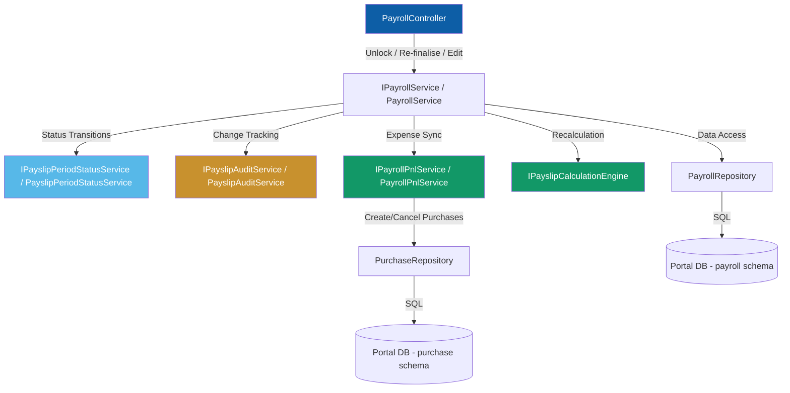
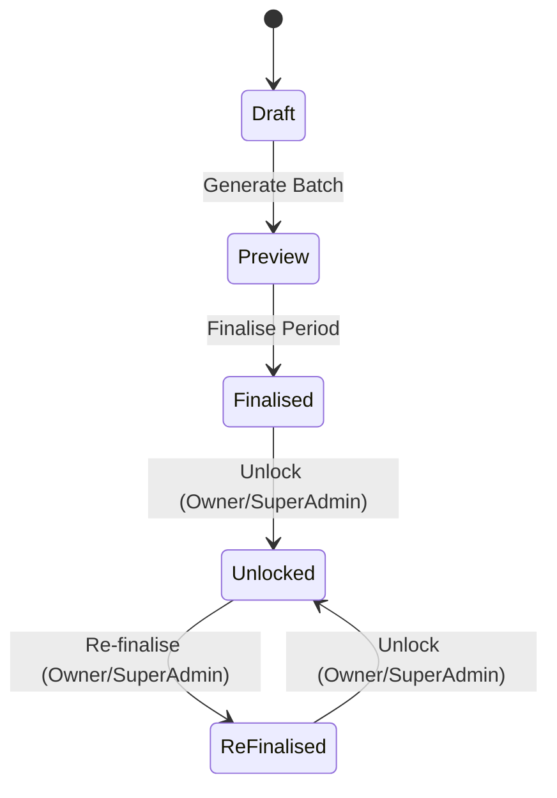
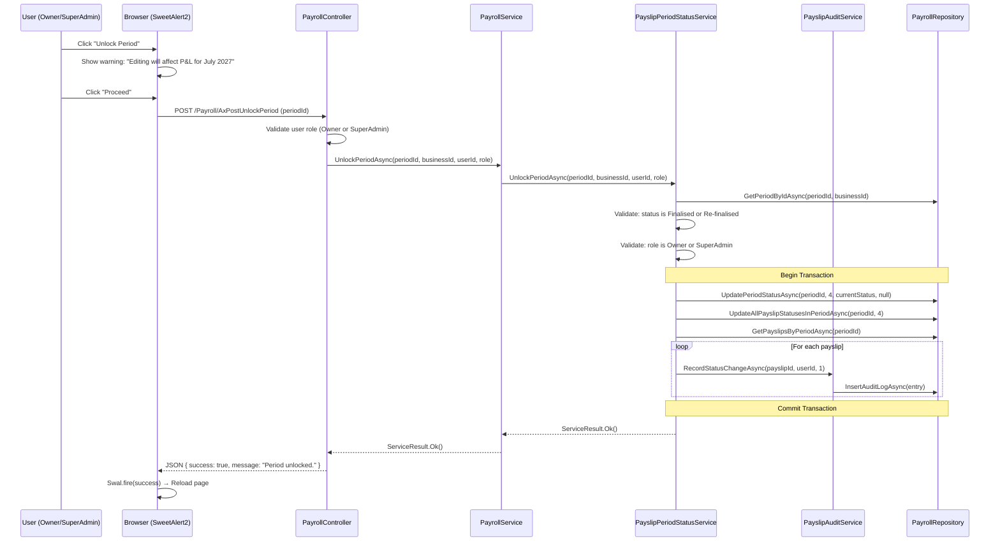
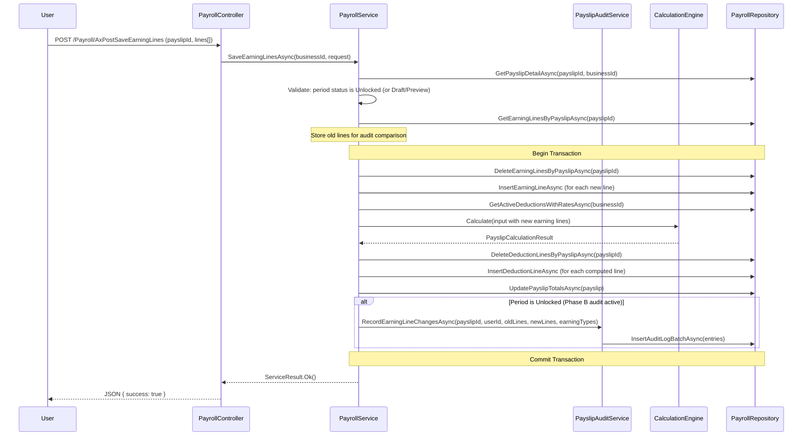
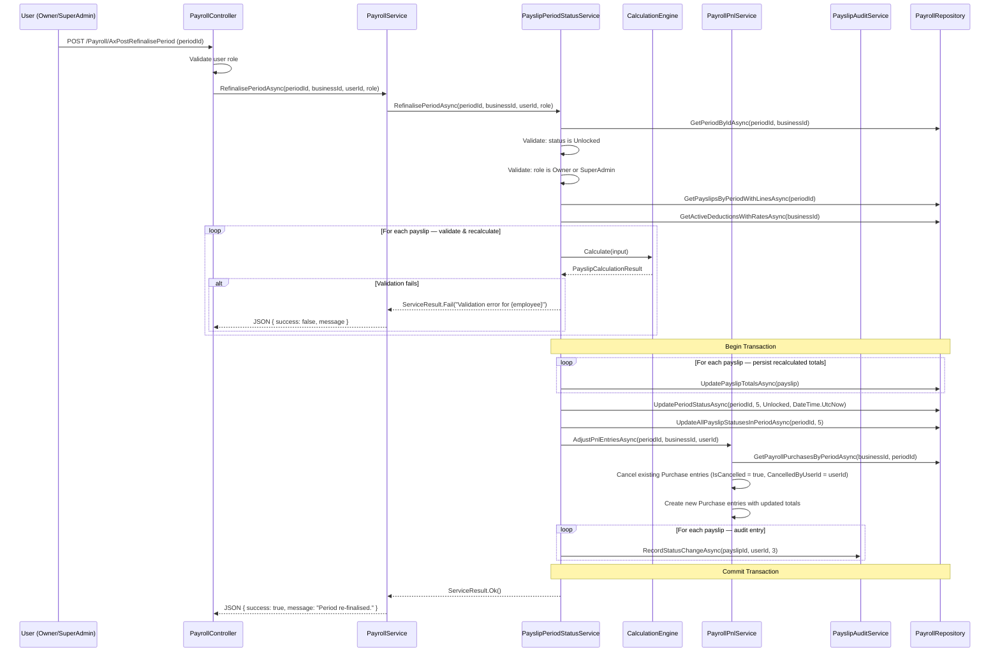
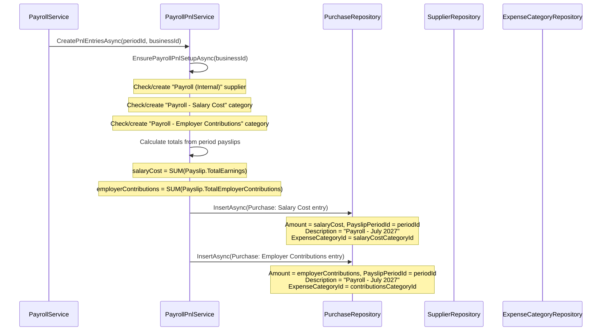

# Design Document — Payroll Phase B (Audit, Unlock, and P&L Integration)

## Overview

Phase B extends the Phase A Core Engine with three interconnected capabilities: (1) unlocking finalised payslip periods for correction, (2) recording every field-level change in an immutable audit trail, and (3) automatically synchronising payroll costs with the existing Purchase/Expense (P&L) system.

The period status lifecycle is extended from `Draft → Preview → Finalised` to include `Unlocked` and `Re-finalised` states, forming a cycle that permits repeated corrections. Only Owner and SuperAdmin roles can unlock or re-finalise periods.

P&L integration leverages the existing `[purchase]` schema — payroll creates `Purchase` records categorised under payroll-specific expense categories (Salary Cost and Employer Contributions), with a new `PayslipPeriodId` column linking them back to their source period.

### Key Design Decisions

| # | Decision | Rationale |
|---|----------|-----------|
| 1 | Payroll-specific audit log in `[payroll]` schema | Separate from platform `[audit].AuditLog` — field-level granularity with old/new values, immutable, specific to payslip edits |
| 2 | P&L via existing Purchase system | Reuses the established expense tracking infrastructure rather than creating a parallel system. Payroll entries are Purchase records with a payroll-specific supplier and expense categories. |
| 3 | Soft-delete pattern for P&L reversals | Reversed entries retain original values (IsCancelled = true), new entries link to the period. Full audit trail preserved. |
| 4 | Status transition state machine in service layer | Enforced programmatically — the PayslipStatusType lookup stores values, the service enforces valid transitions |
| 5 | Cascade status to payslips | When period status changes, all payslip statuses synchronise. Single source of truth at period level. |
| 6 | Auto-seeded "Payroll Internal" supplier | Each business gets a system supplier for payroll P&L entries — prevents polluting user-created supplier lists |
| 7 | Transaction boundary at operation level | Unlock, re-finalise, and P&L integration all execute within a single DB transaction for atomicity |

---

## Issue Resolutions Summary

The following issues were identified during design review and are addressed throughout this document:

| # | Severity | Issue | Resolution |
|---|----------|-------|------------|
| 1 | HIGH | Phase A doesn't cascade status to payslips | Added "Phase A Retroactive Fix" section — `UpdateAllPayslipStatusesInPeriodAsync` must be added to Phase A's `FinalisePeriodAsync` and batch generation before any other Phase B work |
| 2 | MEDIUM | Existing FinalisePeriodAsync needs transaction wrapping | Documented in "Appendix: Finalise Period Update" — backward-compatible refactor wrapping existing behaviour in a transaction with P&L call added |
| 3 | MEDIUM | No protection for system-generated Supplier | Added `IsSystemGenerated` BIT column to `[purchase].[Supplier]` table, UI hides/prevents deletion of system-generated suppliers |
| 4 | LOW | InvoiceDate calculation should be explicit | P&L Entry Structure table updated with explicit `new DateOnly(period.Year, period.Month, DateTime.DaysInMonth(period.Year, period.Month))` |
| 5 | HIGH | PeriodStatusNames dictionary needs replacing with DB lookup | Replace hardcoded dictionary with query to existing `[payroll].[PayslipStatusType]` table — load once via repository, remove static dictionary |
| 6 | MEDIUM | No concurrency control on status transitions | Added optimistic concurrency to `UpdatePeriodStatusAsync` with `WHERE PayslipStatusTypeId = @ExpectedCurrentStatus` and `@@ROWCOUNT` check |
| 7 | LOW | Ambiguous audit FieldName for duplicate earning types | Updated Audit Log Field Name Conventions with positional indexing: `EarningLine:{EarningTypeName}[{index}]:Amount` for duplicates |
| 8 | LOW | No CancelledByUserId on Purchase for P&L audit trail | Added `CancelledByUserId` NVARCHAR(450) NULL to Purchase ALTER script, set during P&L reversal |
| 9 | INFO | Cross-schema FK trade-off | Accepted — documented rationale note in P&L Integration Design section |
| 10 | LOW | No plan for P&L entries if module access revoked | Added note: existing Purchase records remain unchanged on subscription downgrade, PayslipPeriodId becomes informational-only |
| 11 | MEDIUM | Missing re-finalise confirmation dialog | Added `refinalisePeriod()` JavaScript function with SweetAlert2 informational confirmation pattern |

---

## Phase A Retroactive Fix (Prerequisite)

**This must be the first Phase B task before any other work begins.**

Phase A's current `FinalisePeriodAsync` only updates the PayslipPeriod status — it does NOT cascade the status to individual Payslip records. Phase B relies on payslips having matching statuses for edit-gating and audit logic.

### Changes Required to Phase A Code

1. **Add `UpdateAllPayslipStatusesInPeriodAsync` to PayrollRepository:**

```csharp
public async Task UpdateAllPayslipStatusesInPeriodAsync(int periodId, byte statusId)
{
    try
    {
        const string query = @"
            UPDATE [payroll].[Payslip]
            SET PayslipStatusTypeId = @StatusId
            WHERE PayslipPeriodId = @PeriodId";

        await _context.Database.ExecuteSqlRawAsync(query,
            new SqlParameter("@StatusId", statusId),
            new SqlParameter("@PeriodId", periodId)
        );
    }
    catch (Exception ex)
    {
        throw;
    }
}
```

2. **Update `FinalisePeriodAsync`** — add cascade call after period status update:
```csharp
await _payrollRepository.UpdatePeriodStatusAsync(id, 3, DateTime.UtcNow);
await _payrollRepository.UpdateAllPayslipStatusesInPeriodAsync(id, 3); // NEW
```

3. **Update batch generation (Preview transition)** — add cascade call after period moves to Preview:
```csharp
await _payrollRepository.UpdatePeriodStatusAsync(id, 2, null);
await _payrollRepository.UpdateAllPayslipStatusesInPeriodAsync(id, 2); // NEW
```

### Replace PeriodStatusNames Dictionary (Issue 5)

The existing `PayrollService.cs` contains a hardcoded `PeriodStatusNames` dictionary. This must be replaced with a database lookup to the `[payroll].[PayslipStatusType]` table (which already exists with columns `Id TINYINT, Name NVARCHAR(20)`).

**Add to PayrollRepository:**
```csharp
public async Task<Dictionary<byte, string>> GetStatusNamesAsync()
{
    try
    {
        const string query = @"
            SELECT PayslipStatusType.Id, PayslipStatusType.Name
            FROM [payroll].[PayslipStatusType]";

        var results = await _context.Set<PayslipStatusType>()
            .FromSqlRaw(query)
            .ToListAsync();

        return results.ToDictionary(x => x.Id, x => x.Name);
    }
    catch (Exception ex)
    {
        throw;
    }
}
```

**Remove from PayrollService.cs:**
```csharp
// DELETE THIS:
private static readonly Dictionary<byte, string> PeriodStatusNames = new()
{
    { 1, "Draft" }, { 2, "Preview" }, { 3, "Finalised" }
};
```

**Replace with injected/cached lookup:**
```csharp
// In PayrollService constructor or via lazy load:
private Dictionary<byte, string>? _statusNames;

private async Task<Dictionary<byte, string>> GetStatusNamesAsync()
{
    _statusNames ??= await _payrollRepository.GetStatusNamesAsync();
    return _statusNames;
}
```

---

## Architecture



### Layer Responsibilities (Phase B Additions)

| Layer | Component | Responsibility |
|-------|-----------|---------------|
| Service | `PayslipPeriodStatusService` | State machine enforcement, status transition validation, cascade to payslips |
| Service | `PayslipAuditService` | Field-level change detection, audit log entry creation, formatting conventions |
| Service | `PayrollPnlService` | P&L entry creation on finalise, reversal + recreation on re-finalise |
| Repository | `PayrollRepository` (extended) | New methods for audit log CRUD and period status queries |

The existing `PayrollService` orchestrates these services — it remains the single entry point from the controller layer.

---

## Components and Interfaces

### 1. PayrollController (Extended Endpoints)

```csharp
[Authorize]
[ModuleAccess(PortalModules.Payroll)]
public class PayrollController : Controller
{
    // === New Page Actions (Phase B) ===
    Task<IActionResult> PayslipAuditHistory(int payslipId)     // Audit timeline for a single payslip
    Task<IActionResult> PeriodAuditSummary(int periodId)       // Period-level audit summary

    // === New AJAX Endpoints (Phase B) ===
    Task<IActionResult> AxPostUnlockPeriod(int periodId)       // Unlock a finalised period
    Task<IActionResult> AxPostRefinalisePeriod(int periodId)   // Re-finalise an unlocked period
    Task<IActionResult> AxGetAuditHistory(int payslipId)       // Get audit entries for a payslip (JSON)
    Task<IActionResult> AxGetPeriodAuditSummary(int periodId)  // Get all audit entries for a period (JSON)
}
```

#### Role Detection Pattern (Owner vs SuperAdmin)

In this codebase, "Owner" is a claim-based check while "SuperAdmin" is a role-based check. The controller must detect authorization using the following exact pattern:

```csharp
var isOwner = User.HasClaim("IsOwner", "true");
var isSuperAdmin = User.IsInRole("SuperAdmin");
if (!isOwner && !isSuperAdmin)
    return Json(new { success = false, message = "Only the business owner or a SuperAdmin can perform this action." });

// Map to role string for service layer:
var userRole = isSuperAdmin ? "SuperAdmin" : isOwner ? "Owner" : "User";
```

The service layer receives a `string userRole` parameter. The controller is responsible for mapping claims to this role string before calling the service.
```

### 2. IPayslipPeriodStatusService

Encapsulates the state machine logic for period status transitions.

```csharp
public interface IPayslipPeriodStatusService
{
    /// <summary>
    /// Validates whether a transition from currentStatus to targetStatus is allowed.
    /// </summary>
    bool IsTransitionAllowed(byte currentStatusId, byte targetStatusId);

    /// <summary>
    /// Returns all valid target statuses from the given current status.
    /// </summary>
    IReadOnlyList<byte> GetAllowedTransitions(byte currentStatusId);

    /// <summary>
    /// Returns true if the given status allows payslip editing.
    /// Editable statuses: Draft (1), Preview (2), Unlocked (4).
    /// Non-editable statuses: Finalised (3), Re-finalised (5).
    /// </summary>
    bool IsEditableStatus(byte statusId);

    /// <summary>
    /// Executes the unlock transition: period → Unlocked, all payslips → Unlocked.
    /// Creates audit entries. Validates role permissions.
    /// </summary>
    Task<ServiceResult> UnlockPeriodAsync(int periodId, int businessId, string userId, string userRole);

    /// <summary>
    /// Executes re-finalisation: recalculates all payslips, transitions to Re-finalised,
    /// triggers P&L adjustment, creates audit entries.
    /// </summary>
    Task<ServiceResult> RefinalisePeriodAsync(int periodId, int businessId, string userId, string userRole);
}
```

### 3. IPayslipAuditService

Handles field-level change detection and audit log creation.

```csharp
public interface IPayslipAuditService
{
    /// <summary>
    /// Records a status-change audit event (Unlocked or Re-finalised) for a payslip.
    /// FieldName, OldValue, NewValue are null for these entries.
    /// </summary>
    Task RecordStatusChangeAsync(int payslipId, string userId, byte actionTypeId);

    /// <summary>
    /// Compares old and new earning lines, recording individual field changes.
    /// Handles additions, removals, and amount modifications.
    /// </summary>
    Task RecordEarningLineChangesAsync(
        int payslipId,
        string userId,
        List<PayslipEarningLine> oldLines,
        List<EarningLineInput> newLines,
        List<EarningType> earningTypes);

    /// <summary>
    /// Records a ManagerNotes change if old and new values differ.
    /// </summary>
    Task RecordManagerNotesChangeAsync(int payslipId, string userId, string? oldNotes, string? newNotes);

    /// <summary>
    /// Records a payslip addition or removal within an unlocked period.
    /// </summary>
    Task RecordPayslipAddedOrRemovedAsync(int payslipId, string userId, bool isAdded, string employeeName);

    /// <summary>
    /// Gets all audit entries for a payslip in reverse chronological order.
    /// </summary>
    Task<List<PayslipAuditLogDto>> GetAuditHistoryAsync(int payslipId, int businessId);

    /// <summary>
    /// Gets all audit entries for all payslips in a period, grouped by employee.
    /// </summary>
    Task<List<PeriodAuditGroupDto>> GetPeriodAuditSummaryAsync(int periodId, int businessId);
}
```

### 4. IPayrollPnlService

Manages the creation and reversal of P&L entries linked to payroll periods.

```csharp
public interface IPayrollPnlService
{
    /// <summary>
    /// Creates two Purchase entries (Salary Cost + Employer Contributions) for a finalised period.
    /// Must be called within an existing transaction.
    /// </summary>
    Task<ServiceResult> CreatePnlEntriesAsync(int periodId, int businessId);

    /// <summary>
    /// Reverses existing P&L entries (marks as cancelled) and creates new entries
    /// with recalculated totals. Used during re-finalisation.
    /// Must be called within an existing transaction.
    /// userId is required to populate CancelledByUserId on cancelled entries.
    /// </summary>
    Task<ServiceResult> AdjustPnlEntriesAsync(int periodId, int businessId, string userId);

    /// <summary>
    /// Ensures the business has the required payroll expense categories and internal supplier.
    /// Called once during first finalisation — idempotent.
    /// </summary>
    Task EnsurePayrollPnlSetupAsync(int businessId);
}
```

### 5. PayrollRepository (Extended Methods)

```csharp
public class PayrollRepository : GenericStoredProcedureRepository<PayslipPeriod>
{
    // === Phase B additions ===

    // Audit Log
    Task InsertAuditLogAsync(PayslipAuditLog entry);
    Task InsertAuditLogBatchAsync(List<PayslipAuditLog> entries);
    Task<List<PayslipAuditLog>> GetAuditLogsByPayslipAsync(int payslipId);
    Task<List<PayslipAuditLog>> GetAuditLogsByPeriodAsync(int periodId);

    // Period Status (extended with optimistic concurrency)
    Task<bool> UpdatePeriodStatusAsync(int id, byte newStatusId, byte expectedCurrentStatus, DateTime? processedAtUtc);
    Task UpdateAllPayslipStatusesInPeriodAsync(int periodId, byte statusId);
    Task<List<Payslip>> GetPayslipsByPeriodWithLinesAsync(int periodId);

    // P&L Integration
    Task<List<Purchase>> GetPayrollPurchasesByPeriodAsync(int businessId, int periodId);
}
```

### 6. Status Transition State Machine



#### Transition Matrix

| From \ To | Draft | Preview | Finalised | Unlocked | Re-finalised |
|-----------|-------|---------|-----------|----------|--------------|
| **Draft** | — | ✅ | ❌ | ❌ | ❌ |
| **Preview** | ❌ | — | ✅ | ❌ | ❌ |
| **Finalised** | ❌ | ❌ | — | ✅ | ❌ |
| **Unlocked** | ❌ | ❌ | ❌ | — | ✅ |
| **Re-finalised** | ❌ | ❌ | ❌ | ✅ | — |

#### Implementation

```csharp
public class PayslipPeriodStatusService : IPayslipPeriodStatusService
{
    // Status IDs match PayslipStatusType lookup
    private const byte Draft = 1;
    private const byte Preview = 2;
    private const byte Finalised = 3;
    private const byte Unlocked = 4;
    private const byte ReFinalised = 5;

    private static readonly Dictionary<byte, byte[]> AllowedTransitions = new()
    {
        { Draft, new[] { Preview } },
        { Preview, new[] { Finalised } },
        { Finalised, new[] { Unlocked } },
        { Unlocked, new[] { ReFinalised } },
        { ReFinalised, new[] { Unlocked } }
    };

    public bool IsTransitionAllowed(byte currentStatusId, byte targetStatusId)
    {
        return AllowedTransitions.TryGetValue(currentStatusId, out var allowed)
            && allowed.Contains(targetStatusId);
    }

    public bool IsEditableStatus(byte statusId)
    {
        // Editable: Draft (1), Preview (2), Unlocked (4)
        // Non-editable: Finalised (3), Re-finalised (5)
        return statusId is 1 or 2 or 4;
    }
}
```

#### Optimistic Concurrency on Status Transitions (Issue 6)

The `UpdatePeriodStatusAsync` repository method uses a `WHERE` clause that includes the expected current status. If another user has already changed the status (concurrent unlock/re-finalise), the update affects 0 rows and the service returns a conflict error.

```csharp
public async Task<bool> UpdatePeriodStatusAsync(int id, byte newStatusId, byte expectedCurrentStatus, DateTime? processedAtUtc)
{
    try
    {
        const string query = @"
            UPDATE [payroll].[PayslipPeriod]
            SET PayslipStatusTypeId = @NewStatusId,
                ProcessedAtUtc = @ProcessedAtUtc
            WHERE PayslipPeriod.Id = @Id
              AND PayslipPeriod.PayslipStatusTypeId = @ExpectedCurrentStatus";

        var rowsAffected = await _context.Database.ExecuteSqlRawAsync(query,
            new SqlParameter("@NewStatusId", newStatusId),
            new SqlParameter("@ProcessedAtUtc", processedAtUtc ?? (object)DBNull.Value),
            new SqlParameter("@Id", id),
            new SqlParameter("@ExpectedCurrentStatus", expectedCurrentStatus)
        );

        return rowsAffected == 1;
    }
    catch (Exception ex)
    {
        throw;
    }
}
```

**Service layer usage:**
```csharp
var updated = await _payrollRepository.UpdatePeriodStatusAsync(periodId, Unlocked, currentStatus, null);
if (!updated)
{
    return ServiceResult.Fail("Period status has been changed by another user. Please refresh and try again.");
}
```

---

## Data Models

### Database Schema (Phase B Additions)

```sql
-- ============================================================
-- Payroll Phase B — Schema Additions
-- ============================================================

USE [Portal]
GO

-- ============================================================
-- 1. Extend PayslipStatusType with new statuses
-- ============================================================
INSERT INTO [payroll].[PayslipStatusType] ([Id], [Name]) VALUES
    (4, 'Unlocked'),
    (5, 'Re-finalised')
GO

-- ============================================================
-- 2. PayslipAuditActionType (Lookup)
-- ============================================================
CREATE TABLE [payroll].[PayslipAuditActionType] (
    [Id]    TINYINT NOT NULL,
    [Name]  NVARCHAR(20) NOT NULL,
    CONSTRAINT [PK_PayslipAuditActionType] PRIMARY KEY CLUSTERED ([Id])
)
GO

INSERT INTO [payroll].[PayslipAuditActionType] ([Id], [Name]) VALUES
    (1, 'Unlocked'),
    (2, 'Edited'),
    (3, 'Re-finalised')
GO

-- ============================================================
-- 3. PayslipAuditLog
-- ============================================================
CREATE TABLE [payroll].[PayslipAuditLog] (
    [Id]                        INT IDENTITY(1,1) NOT NULL,
    [PayslipId]                 INT NOT NULL,
    [UserId]                    NVARCHAR(450) NOT NULL,
    [PayslipAuditActionTypeId]  TINYINT NOT NULL,
    [FieldName]                 NVARCHAR(100) NULL,
    [OldValue]                  NVARCHAR(500) NULL,
    [NewValue]                  NVARCHAR(500) NULL,
    [CreatedAtUtc]              DATETIME NOT NULL DEFAULT GETUTCDATE(),
    CONSTRAINT [PK_PayslipAuditLog] PRIMARY KEY CLUSTERED ([Id]),
    CONSTRAINT [FK_PayslipAuditLog_Payslip] FOREIGN KEY ([PayslipId])
        REFERENCES [payroll].[Payslip]([Id]),
    CONSTRAINT [FK_PayslipAuditLog_ActionType] FOREIGN KEY ([PayslipAuditActionTypeId])
        REFERENCES [payroll].[PayslipAuditActionType]([Id])
)
GO

-- Prevent cascade deletes: audit log survives payslip deletion
-- (This is enforced by the default NO ACTION on the FK above)

-- Performance index for audit history queries
CREATE NONCLUSTERED INDEX [IX_PayslipAuditLog_PayslipId]
    ON [payroll].[PayslipAuditLog] ([PayslipId]) INCLUDE ([CreatedAtUtc], [PayslipAuditActionTypeId])
GO

-- Index for period-level audit summary (join through Payslip → PayslipPeriod)
CREATE NONCLUSTERED INDEX [IX_PayslipAuditLog_CreatedAtUtc]
    ON [payroll].[PayslipAuditLog] ([CreatedAtUtc] DESC) INCLUDE ([PayslipId], [UserId])
GO
```

```sql
-- ============================================================
-- 4. P&L Integration — Add PayslipPeriodId to Purchase table
-- ============================================================
ALTER TABLE [purchase].[Purchase]
    ADD [PayslipPeriodId] INT NULL
GO

ALTER TABLE [purchase].[Purchase]
    ADD CONSTRAINT [FK_Purchase_PayslipPeriod] FOREIGN KEY ([PayslipPeriodId])
        REFERENCES [payroll].[PayslipPeriod]([Id])
GO

-- Index for finding payroll-generated purchases by period
CREATE NONCLUSTERED INDEX [IX_Purchase_PayslipPeriodId]
    ON [purchase].[Purchase] ([PayslipPeriodId]) WHERE [PayslipPeriodId] IS NOT NULL
GO

-- ============================================================
-- 5. Add CancelledByUserId to Purchase (P&L audit trail)
-- ============================================================
ALTER TABLE [purchase].[Purchase]
    ADD [CancelledByUserId] NVARCHAR(450) NULL
GO

-- ============================================================
-- 6. Add IsSystemGenerated to Supplier (protect payroll supplier)
-- ============================================================
ALTER TABLE [purchase].[Supplier]
    ADD [IsSystemGenerated] BIT NOT NULL DEFAULT 0
GO
```

### P&L Integration Design

Payroll integrates with the existing `[purchase]` schema by creating `Purchase` records. This requires:

1. **A "Payroll Internal" Supplier** per business — auto-created on first payroll finalisation with `IsSystemGenerated = 1`
2. **Two Expense Categories** per business — "Payroll - Salary Cost" and "Payroll - Employer Contributions", auto-created on first finalisation
3. **Purchase records** with `PayslipPeriodId` set, `PurchaseTypeId = 3` (Expense), `PurchaseOriginTypeId = 1` (Domestic), `VatAmount = 0`

> **Cross-schema FK rationale:** The Purchase table already references other schemas (e.g., `VatSubmissionPeriodId` references the VAT schema). Adding `PayslipPeriodId` follows the same established cross-schema pattern and avoids unnecessary complexity from a bridge table.

> **Subscription downgrade note:** If a business's Enterprise subscription is downgraded, existing payroll-generated Purchase records remain unchanged and continue to display in expense reports and P&L calculations. The `PayslipPeriodId` reference becomes informational-only. No automatic deletion or archival occurs — financial records are preserved regardless of subscription status.

#### System-Generated Supplier Protection

When `EnsurePayrollPnlSetupAsync` creates the "Payroll (Internal)" supplier, it sets `IsSystemGenerated = 1`. The UI must:
- Hide system-generated suppliers from the editable supplier list (filter `WHERE IsSystemGenerated = 0` in supplier management queries)
- Prevent deletion of system-generated suppliers (service layer validation: return error if `supplier.IsSystemGenerated == true`)

```sql
-- Example of what gets created per business:
-- Supplier: Name = 'Payroll (Internal)', BusinessId = @BusinessId, IsActive = 1, IsSystemGenerated = 1
-- ExpenseCategory: Name = 'Payroll - Salary Cost', BusinessId = @BusinessId, IsActive = 1
-- ExpenseCategory: Name = 'Payroll - Employer Contributions', BusinessId = @BusinessId, IsActive = 1
```

### Entity Classes (Phase B Additions)

```csharp
namespace Portal.Infrastructure.Entities;

public class PayslipAuditLog
{
    public int Id { get; set; }
    public int PayslipId { get; set; }
    public string UserId { get; set; } = string.Empty;
    public byte PayslipAuditActionTypeId { get; set; }
    public string? FieldName { get; set; }
    public string? OldValue { get; set; }
    public string? NewValue { get; set; }
    public DateTime CreatedAtUtc { get; set; }
}

public class PayslipAuditActionType
{
    public byte Id { get; set; }
    public string Name { get; set; } = string.Empty;
}
```

### Supplier Entity Extension

The existing `Supplier` entity gains an `IsSystemGenerated` flag:

```csharp
// Added to Portal.Infrastructure/Entities/Supplier.cs
public bool IsSystemGenerated { get; set; }
```

EF Core configuration:

```csharp
// In PortalDbContext.OnModelCreating → ConfigureSupplier
entity.Property(e => e.IsSystemGenerated).IsRequired().HasDefaultValue(false);
```

### Raw SQL Query Column Updates Required

After adding `PayslipPeriodId` and `CancelledByUserId` to the Purchase entity and `IsSystemGenerated` to the Supplier entity, EF Core's `FromSqlRaw` will throw because the entity expects these columns but existing raw SQL SELECT statements don't return them. All SELECT queries that use `ExecuteStoredProcedure` / `ExecuteSingleRecordStoredProcedure` (which call `FromSqlRaw`) must be updated.

**PurchaseRepository.cs — Add `[PayslipPeriodId], [CancelledByUserId]` to column lists in:**
- `GetAllByBusinessIdAsync` — SELECT from `[purchase].[Purchase]`
- `GetByIdAndBusinessIdAsync` — SELECT from `[purchase].[Purchase]`
- `GetFilteredAsync` — SELECT from `[purchase].[Purchase]`
- `GetUnassignedByDateRangeAsync` — SELECT from `[purchase].[Purchase]`

**SupplierRepository.cs — Add `[IsSystemGenerated]` to column lists in:**
- `GetAllByBusinessIdAsync` — SELECT from `[purchase].[Supplier]`
- `GetByIdAndBusinessIdAsync` — SELECT from `[purchase].[Supplier]`
- `GetPagedByBusinessIdAsync` — SELECT from `[purchase].[Supplier]` (also update the manual `DataReader` mapping to read the `IsSystemGenerated` column)

> **This is critical** — omitting these columns causes a runtime error identical to the `IsOnboardingDismissed` incident. The entity expects the column but the SQL doesn't return it, causing EF Core mapping to fail.

### DTO Models (Phase B)

```csharp
namespace Portal.Infrastructure.Models.Payroll;


// --- Audit History ---
public class PayslipAuditLogDto
{
    public int Id { get; set; }
    public string UserFullName { get; set; } = string.Empty;
    public string ActionName { get; set; } = string.Empty;
    public byte ActionTypeId { get; set; }
    public string? FieldName { get; set; }
    public string? OldValue { get; set; }
    public string? NewValue { get; set; }
    public DateTime CreatedAtUtc { get; set; }
}

public class PeriodAuditGroupDto
{
    public int PayslipId { get; set; }
    public string EmployeeName { get; set; } = string.Empty;
    public List<PayslipAuditLogDto> Entries { get; set; } = new();
}

// --- Unlock/Re-finalise Requests ---
public class UnlockPeriodRequest
{
    public int PeriodId { get; set; }
}

public class RefinalisePeriodRequest
{
    public int PeriodId { get; set; }
}
```

### Purchase Entity Extension

The existing `Purchase` entity gains a nullable `PayslipPeriodId` and `CancelledByUserId` property:

```csharp
// Added to Portal.Infrastructure/Entities/Purchase.cs
public int? PayslipPeriodId { get; set; }
public string? CancelledByUserId { get; set; }

// Navigation properties
public PayslipPeriod? PayslipPeriod { get; set; }
```

And the corresponding EF Core configuration:

```csharp
// In PortalDbContext.OnModelCreating → ConfigurePurchase
entity.Property(e => e.PayslipPeriodId).IsRequired(false);
entity.Property(e => e.CancelledByUserId).HasMaxLength(450).IsRequired(false);
entity.HasOne<PayslipPeriod>()
    .WithMany()
    .HasForeignKey(e => e.PayslipPeriodId)
    .OnDelete(DeleteBehavior.Restrict);
```

### Audit Log Field Name Conventions

| Change Type | FieldName Format | OldValue | NewValue |
|-------------|-----------------|----------|----------|
| Earning line amount changed (single) | `EarningLine:{EarningTypeName}:Amount` | Old amount as string | New amount as string |
| Earning line amount changed (duplicate) | `EarningLine:{EarningTypeName}[{0-based index}]:Amount` | Old amount as string | New amount as string |
| Earning line added (single) | `EarningLine:{EarningTypeName}` | `null` | Amount as string |
| Earning line added (duplicate) | `EarningLine:{EarningTypeName}[{0-based index}]` | `null` | Amount as string |
| Earning line removed (single) | `EarningLine:{EarningTypeName}` | Amount as string | `null` |
| Earning line removed (duplicate) | `EarningLine:{EarningTypeName}[{0-based index}]` | Amount as string | `null` |
| Manager notes changed | `ManagerNotes` | Old text (truncated to 500 chars) | New text (truncated to 500 chars) |
| Payslip added to period | `Payslip` | `null` | Employee name |
| Payslip removed from period | `Payslip` | Employee name | `null` |
| Unlock event | `null` | `null` | `null` |
| Re-finalise event | `null` | `null` | `null` |

**Disambiguation logic for duplicate earning types:** When an employee has multiple earning lines of the same `EarningTypeName` (e.g., two "Overtime" lines for different shifts/rates), a 0-based positional index is appended in square brackets. The index is determined by ordering the lines by their `Id` within the payslip. For single instances of an earning type, the simple format without index is used.

---

## Sequence Diagrams

### Unlock Period Flow



### Edit Payslip (After Unlock) Flow



### Re-finalise Period Flow



### P&L Integration Flow (First Finalisation)



---

## P&L Entry Structure

Each payroll finalisation creates exactly two `Purchase` records:

| Field | Salary Cost Entry | Employer Contributions Entry |
|-------|------------------|------------------------------|
| `BusinessId` | Current business | Current business |
| `SupplierId` | Payroll Internal supplier | Payroll Internal supplier |
| `ExpenseCategoryId` | "Payroll - Salary Cost" | "Payroll - Employer Contributions" |
| `PurchaseOriginTypeId` | 1 (Domestic) | 1 (Domestic) |
| `PurchaseTypeId` | 3 (Expense) | 3 (Expense) |
| `InvoiceNumber` | `PAY-{Year}-{Month:00}-SAL` | `PAY-{Year}-{Month:00}-EMP` |
| `InvoiceDate` | `new DateOnly(period.Year, period.Month, DateTime.DaysInMonth(period.Year, period.Month))` — last day of period month | `new DateOnly(period.Year, period.Month, DateTime.DaysInMonth(period.Year, period.Month))` — last day of period month |
| `Description` | "Payroll - {Month Name} {Year}" | "Payroll - {Month Name} {Year}" |
| `AmountExcludingVat` | SUM(TotalEarnings) | SUM(TotalEmployerContributions) |
| `VatAmount` | 0 | 0 |
| `TotalAmount` | SUM(TotalEarnings) | SUM(TotalEmployerContributions) |
| `PayslipPeriodId` | Period ID | Period ID |
| `IsCancelled` | false | false |

### P&L Reversal on Re-finalisation

When re-finalising:
1. Find existing Purchase records where `PayslipPeriodId = @PeriodId AND IsCancelled = 0`
2. Set `IsCancelled = true`, `CancelledAtUtc = GETUTCDATE()`, and `CancelledByUserId = @CurrentUserId` on each
3. Create two new Purchase records with the recalculated totals
4. Original records retain their values for historical audit

---

## View Layer

### Audit History Timeline (Payslip Detail)

Accessible from the payslip detail page via an "Audit History" tab or button. Renders a vertical timeline showing all changes in reverse chronological order.

**Timeline entry structure:**
- Avatar/icon for the user
- User full name + action badge (Unlocked / Edited / Re-finalised)
- Field name (human-readable, e.g., "Earning Line: Overtime - Amount")
- Old value → New value (with visual diff styling)
- Timestamp in business locale

**Status-change entries** (Unlocked, Re-finalised) display as simple event markers without field details.

### Unlock Confirmation Dialog

Uses SweetAlert2 with warning icon:

```javascript
async function unlockPeriod(periodId, monthName, year) {
    const result = await Swal.fire({
        title: 'Unlock Period?',
        text: `Editing will affect P&L for ${monthName} ${year}`,
        icon: 'warning',
        showCancelButton: true,
        confirmButtonText: 'Proceed',
        cancelButtonText: 'Cancel',
        confirmButtonColor: '#C24A4A'
    });

    if (!result.isConfirmed) return;

    BlockUI.show('Unlocking period...');
    try {
        const response = await fetch(`/Payroll/AxPostUnlockPeriod?periodId=${periodId}`, {
            method: 'POST',
            headers: { 'RequestVerificationToken': getAntiForgeryToken() }
        });
        const data = await response.json();
        BlockUI.hide();

        if (data.success) {
            await Swal.fire({ icon: 'success', title: 'Unlocked', text: data.message, confirmButtonColor: '#0D5EA6' });
            window.location.reload();
        } else {
            Swal.fire({ icon: 'error', title: 'Error', text: data.message, confirmButtonColor: '#0D5EA6' });
        }
    } catch (e) {
        BlockUI.hide();
        Swal.fire({ icon: 'error', title: 'Error', text: 'Something went wrong.', confirmButtonColor: '#0D5EA6' });
    }
}
```

### Re-finalise Confirmation Dialog

Uses SweetAlert2 with informational styling (not destructive — this is a corrective action):

```javascript
async function refinalisePeriod(periodId, monthName, year) {
    const result = await Swal.fire({
        title: 'Re-finalise this period?',
        text: `P&L entries will be updated to reflect your changes.`,
        icon: 'info',
        showCancelButton: true,
        confirmButtonText: 'Re-finalise',
        cancelButtonText: 'Cancel',
        confirmButtonColor: '#0D5EA6'
    });

    if (!result.isConfirmed) return;

    BlockUI.show('Re-finalising period...');
    try {
        const response = await fetch(`/Payroll/AxPostRefinalisePeriod?periodId=${periodId}`, {
            method: 'POST',
            headers: { 'RequestVerificationToken': getAntiForgeryToken() }
        });
        const data = await response.json();
        BlockUI.hide();

        if (data.success) {
            await Swal.fire({ icon: 'success', title: 'Re-finalised', text: data.message, confirmButtonColor: '#0D5EA6' });
            window.location.reload();
        } else {
            Swal.fire({ icon: 'error', title: 'Error', text: data.message, confirmButtonColor: '#0D5EA6' });
        }
    } catch (e) {
        BlockUI.hide();
        Swal.fire({ icon: 'error', title: 'Error', text: 'Something went wrong.', confirmButtonColor: '#0D5EA6' });
    }
}
```

### Period Detail View (Extended)

The existing period detail view gains:
- **Status badge** showing current status with colour coding (Draft=grey, Preview=blue, Finalised=green, Unlocked=amber, Re-finalised=green)
- **Unlock button** (visible only to Owner/SuperAdmin, only when status is Finalised or Re-finalised)
- **Re-finalise button** (visible only to Owner/SuperAdmin, only when status is Unlocked)
- **Audit Summary link** (visible to all payroll users)

### Payslip Detail View (Extended)

The existing payslip detail view gains:
- **"Audit History" button** linking to the audit timeline for this payslip
- **Edit controls** enabled when period is in Unlocked status
- **Read-only mode** enforced when period is Finalised or Re-finalised

---

## Error Handling

### Validation Errors (Service Layer)

| Scenario | Error Message |
|----------|--------------|
| Non-Owner/SuperAdmin attempts unlock | "Only the business owner or a SuperAdmin can unlock a finalised period." |
| Non-Owner/SuperAdmin attempts re-finalise | "Only the business owner or a SuperAdmin can re-finalise a period." |
| Unlock on non-finalised period | "Only Finalised or Re-finalised periods can be unlocked." |
| Re-finalise on non-unlocked period | "Only Unlocked periods can be re-finalised." |
| Re-finalise with validation error | "Cannot re-finalise: {employee} has no valid deduction rate for {period}." |
| P&L entry creation fails | "Failed to create P&L entries. Finalisation rolled back." |
| P&L adjustment fails | "Failed to adjust P&L entries. Re-finalisation rolled back." |
| Edit on locked period | "Payslips in a finalised period cannot be modified. Unlock the period first." |
| Payroll P&L setup fails | "Failed to initialise payroll expense categories." |
| Concurrent status change (optimistic concurrency) | "Period status has been changed by another user. Please refresh and try again." |
| Delete system-generated supplier | "This supplier is system-generated and cannot be deleted." |

### Exception Handling Pattern

Consistent with Phase A and platform conventions:

```csharp
// Service layer — transaction with rollback
public async Task<ServiceResult> RefinalisePeriodAsync(...)
{
    using var transaction = await _context.Database.BeginTransactionAsync();
    try
    {
        // ... business logic ...
        await transaction.CommitAsync();
        return ServiceResult.Ok();
    }
    catch (Exception ex)
    {
        await transaction.RollbackAsync();
        throw;
    }
}

// Controller layer — catch and return JSON
[HttpPost]
public async Task<IActionResult> AxPostUnlockPeriod(int periodId)
{
    try
    {
        var result = await _payrollService.UnlockPeriodAsync(periodId, businessId, userId, userRole);
        return Json(new { success = result.Success, message = result.Message ?? "Period unlocked successfully." });
    }
    catch (Exception ex)
    {
        return Json(new { success = false, message = "Something went wrong. Please try again." });
    }
}
```

---

## Correctness Properties

*A property is a characteristic or behavior that should hold true across all valid executions of a system — essentially, a formal statement about what the system should do. Properties serve as the bridge between human-readable specifications and machine-verifiable correctness guarantees.*

### Property 1: Status transition enforcement

*For any* PayslipPeriod with a current status S and any target status T, the system SHALL allow the transition if and only if (S, T) is in the set {(Draft, Preview), (Preview, Finalised), (Finalised, Unlocked), (Unlocked, Re-finalised), (Re-finalised, Unlocked)}. All other combinations SHALL be rejected.

**Validates: Requirements 1.2, 1.3, 1.4, 1.5**

### Property 2: Role-restricted operations

*For any* user with role R attempting an unlock or re-finalise action, the system SHALL succeed if and only if R is "Owner" or "SuperAdmin". All other roles SHALL be rejected with an authorisation error.

**Validates: Requirements 2.1, 11.1, 11.2, 11.5**

### Property 3: Period-payslip status synchronisation

*For any* period status transition (unlock or re-finalise), after the transition completes, all Payslip records within that period SHALL have a `PayslipStatusTypeId` equal to the period's new status.

**Validates: Requirements 2.4, 5.3**

### Property 4: Audit entry creation on status transition

*For any* period being unlocked or re-finalised containing N payslips, exactly N audit log entries SHALL be created, each with the correct `PayslipAuditActionTypeId` (1 for Unlock, 3 for Re-finalise), the acting user's `UserId`, and null FieldName/OldValue/NewValue.

**Validates: Requirements 2.5, 5.4**

### Property 5: Editability gated by period status

*For any* PayslipPeriod, modification of payslip earning lines, manager notes, or payslip addition/removal SHALL be permitted if and only if the period status is Draft, Preview, or Unlocked. Modification attempts on Finalised or Re-finalised periods SHALL be rejected.

**Validates: Requirements 3.1, 3.2, 3.3, 3.5**

### Property 6: Audit trail completeness for field edits

*For any* field modification on a payslip in an Unlocked period, the system SHALL create a PayslipAuditLog entry with ActionTypeId = 2 (Edited), the correct FieldName following naming conventions, and the serialised old and new values.

**Validates: Requirements 4.3, 4.4, 4.5, 4.6, 4.8**

### Property 7: P&L entries match period totals on finalisation

*For any* PayslipPeriod transitioning to Finalised (or Re-finalised), the resulting active (non-cancelled) Purchase records linked to that period SHALL have: one entry with amount equal to SUM(Payslip.TotalEarnings) and one entry with amount equal to SUM(Payslip.TotalEmployerContributions).

**Validates: Requirements 6.1, 6.2, 7.2**

### Property 8: P&L reversal preserves history

*For any* PayslipPeriod being re-finalised, the previously active Purchase records linked to that period SHALL be marked as cancelled (IsCancelled = true) with their original amounts preserved unchanged.

**Validates: Requirements 7.1, 7.6**

### Property 9: P&L description format

*For any* payroll-generated Purchase entry, the Description field SHALL match the format "Payroll - {MonthName} {Year}" where MonthName is the full English month name and Year is the 4-digit year of the associated period.

**Validates: Requirements 6.4**

### Property 10: Audit history ordering

*For any* payslip's audit history query, the returned entries SHALL be ordered by CreatedAtUtc descending (newest first).

**Validates: Requirements 9.2**

### Property 11: Re-finalisation validation gate

*For any* PayslipPeriod where at least one payslip fails calculation validation (e.g., missing deduction rate), re-finalisation SHALL be rejected and no status transition or P&L adjustment SHALL occur.

**Validates: Requirements 5.6**

### Property 12: ProcessedAtUtc timestamp on re-finalisation

*For any* PayslipPeriod transitioning to Re-finalised status, ProcessedAtUtc SHALL be set to a non-null UTC timestamp representing the moment of re-finalisation.

**Validates: Requirements 1.6**

### Property 13: Optimistic concurrency on status transitions

*For any* two concurrent status transition attempts on the same PayslipPeriod, exactly one SHALL succeed and the other SHALL be rejected with a conflict error. The rejected operation SHALL NOT modify any period status, payslip statuses, audit entries, or P&L records.

**Validates: Requirements 1.5, 2.3**

---

## Testing Strategy

### Why Property-Based Testing Applies

Phase B introduces a deterministic state machine (status transitions), role-based permission logic, and P&L synchronisation rules — all of which express universal properties over inputs. The state machine has a finite but meaningful input space (5 statuses × 5 targets = 25 combinations), and the permission/audit logic applies uniformly across all users and payslips. These are well-suited for property-based testing.

### Property-Based Testing Configuration

- **Library:** FsCheck (already in project — `FsCheck.dll` and `FsCheck.Xunit.dll` present in `build_check/`)
- **Minimum iterations:** 100 per property test
- **Tag format:** `Feature: payroll-phase-b, Property {N}: {property text}`

### Dual Testing Approach

| Test Type | Scope | Example |
|-----------|-------|---------|
| **Property tests** | State machine transitions, role enforcement, P&L total invariants, audit completeness | "For all (status, target) pairs, IsTransitionAllowed returns true iff pair is in the valid set" |
| **Unit tests** | Specific scenarios, edge cases, error messages | "Unlocking a Draft period returns the correct error message" |
| **Integration tests** | Transaction atomicity, P&L creation/reversal round-trip, cascade behaviour | "Re-finalise creates and cancels Purchase records within a single transaction" |

### Property Test Plan

| Property | Test Class | Generator Strategy |
|----------|-----------|-------------------|
| 1: Status transitions | `StatusTransitionPropertyTests` | Generate all byte pairs (0–5) × (0–5), verify against allowed set |
| 2: Role restrictions | `RoleRestrictionPropertyTests` | Generate random role strings, verify only Owner/SuperAdmin succeed |
| 3: Status sync | `PeriodPayslipStatusSyncPropertyTests` | Generate periods with 1–20 payslips, verify all statuses match after transition |
| 4: Audit on transition | `AuditStatusChangePropertyTests` | Generate periods with varying payslip counts, verify audit count = payslip count |
| 5: Editability gate | `EditabilityPropertyTests` | Generate all 5 statuses, verify edit allowed only for Draft/Preview/Unlocked |
| 6: Audit completeness | `AuditFieldEditPropertyTests` | Generate earning line modifications, verify correct audit entries |
| 7: P&L totals | `PnlTotalsPropertyTests` | Generate periods with random payslip amounts, verify Purchase totals = sums |
| 8: P&L reversal | `PnlReversalPropertyTests` | Generate re-finalise scenarios, verify old entries cancelled with preserved amounts |
| 9: P&L description | `PnlDescriptionPropertyTests` | Generate random year/month combinations, verify format "Payroll - {Month} {Year}" |
| 10: Audit ordering | `AuditOrderingPropertyTests` | Generate audit entries with random timestamps, verify descending order |
| 11: Validation gate | `RefinalisationValidationPropertyTests` | Generate periods with at least one invalid payslip, verify rejection |
| 12: ProcessedAt | `ProcessedAtTimestampPropertyTests` | Generate re-finalise operations, verify ProcessedAtUtc is set |
| 13: Concurrency | `ConcurrencyPropertyTests` | Generate concurrent status transitions on same period, verify only one succeeds and no partial state changes occur |

### Unit Test Plan

| Test Case | Input | Expected |
|-----------|-------|----------|
| Unlock Draft period | Period with StatusId=1 | Fail: "Only Finalised or Re-finalised periods can be unlocked." |
| Unlock by standard user | User with role "User" | Fail: "Only the business owner or a SuperAdmin can unlock." |
| Unlock Finalised period by Owner | Valid Owner, StatusId=3 | Success: period → Unlocked |
| Edit earning on Finalised period | Period StatusId=3 | Fail: "Payslips in a finalised period cannot be modified." |
| Re-finalise with missing rate | Period with employee missing rate | Fail: validation error with employee name |
| P&L description for January 2027 | Period Year=2027, Month=1 | "Payroll - January 2027" |
| P&L description for December 2025 | Period Year=2025, Month=12 | "Payroll - December 2025" |
| Audit FieldName for overtime change | EarningType="Overtime", field=Amount | "EarningLine:Overtime:Amount" |
| Audit FieldName for line removal | EarningType="Bonus" | "EarningLine:Bonus" |

### Integration Test Plan

| Test Area | Approach |
|-----------|----------|
| Full unlock → edit → re-finalise cycle | End-to-end with test database, verify status transitions, audit entries, P&L entries |
| P&L atomicity | Force a failure mid-transaction, verify rollback — no orphan entries |
| Cascade behaviour | Unlock period, verify all payslip statuses change |
| Concurrent access | Two users attempt unlock simultaneously — only one succeeds |
| Permission enforcement at API level | Call AxPostUnlockPeriod as non-Owner, verify 403/rejection |

### Test Framework

- **xUnit** for test runner (existing project standard)
- **Moq** for mocking interfaces (service and repository layers)
- **FsCheck + FsCheck.Xunit** for property-based tests
- **EF Core InMemory** for integration tests requiring database
- Tests located in `Portal.Tests` project

---

## DI Registration (Phase B Additions)

```csharp
// In Program.cs or service registration extension
builder.Services.AddScoped<IPayslipPeriodStatusService, PayslipPeriodStatusService>();
builder.Services.AddScoped<IPayslipAuditService, PayslipAuditService>();
builder.Services.AddScoped<IPayrollPnlService, PayrollPnlService>();
```

---

## DbContext Configuration (Phase B Additions)

```csharp
// Add to PortalDbContext
public DbSet<PayslipAuditLog> PayslipAuditLogs { get; set; } = null!;
public DbSet<PayslipAuditActionType> PayslipAuditActionTypes { get; set; } = null!;

// In OnModelCreating
private void ConfigurePayslipAuditLog(ModelBuilder modelBuilder)
{
    modelBuilder.Entity<PayslipAuditLog>(entity =>
    {
        entity.ToTable("PayslipAuditLog", "payroll");
        entity.HasKey(e => e.Id);
        entity.Property(e => e.PayslipId).IsRequired();
        entity.Property(e => e.UserId).HasMaxLength(450).IsRequired();
        entity.Property(e => e.PayslipAuditActionTypeId).IsRequired();
        entity.Property(e => e.FieldName).HasMaxLength(100);
        entity.Property(e => e.OldValue).HasMaxLength(500);
        entity.Property(e => e.NewValue).HasMaxLength(500);
        entity.Property(e => e.CreatedAtUtc).IsRequired().HasDefaultValueSql("GETUTCDATE()");

        entity.HasOne<Payslip>()
            .WithMany()
            .HasForeignKey(e => e.PayslipId)
            .OnDelete(DeleteBehavior.NoAction); // Prevent cascade delete

        entity.HasOne<PayslipAuditActionType>()
            .WithMany()
            .HasForeignKey(e => e.PayslipAuditActionTypeId)
            .OnDelete(DeleteBehavior.NoAction);
    });

    modelBuilder.Entity<PayslipAuditActionType>(entity =>
    {
        entity.ToTable("PayslipAuditActionType", "payroll");
        entity.HasKey(e => e.Id);
        entity.Property(e => e.Name).HasMaxLength(20).IsRequired();
    });
}

// Extend ConfigurePurchase
private void ConfigurePurchase(ModelBuilder modelBuilder)
{
    // ... existing configuration ...
    entity.Property(e => e.PayslipPeriodId).IsRequired(false);
    entity.Property(e => e.CancelledByUserId).HasMaxLength(450).IsRequired(false);
}
```

---

## Appendix: Modified PayrollService Interface (Phase B Additions)

```csharp
public interface IPayrollService
{
    // ... existing Phase A methods ...

    // Phase B: Unlock & Re-finalise
    Task<ServiceResult> UnlockPeriodAsync(int periodId, int businessId, string userId, string userRole);
    Task<ServiceResult> RefinalisePeriodAsync(int periodId, int businessId, string userId, string userRole);

    // Phase B: Audit History
    Task<List<PayslipAuditLogDto>> GetPayslipAuditHistoryAsync(int payslipId, int businessId);
    Task<List<PeriodAuditGroupDto>> GetPeriodAuditSummaryAsync(int periodId, int businessId);
}
```

## Appendix: Finalise Period Update (Phase A Modification)

> **Note:** This is a backward-compatible refactor — existing behavior is preserved (status update + cascade), but now wrapped in a transaction with the P&L call added. No breaking changes for existing callers.

The existing `FinalisePeriodAsync` method in `PayrollService` must be extended to call `IPayrollPnlService.CreatePnlEntriesAsync()` within the same transaction:

```csharp
public async Task<ServiceResult> FinalisePeriodAsync(int id, int businessId)
{
    var period = await _payrollRepository.GetPeriodByIdAsync(id, businessId);
    if (period == null) return ServiceResult.Fail("Period not found.");

    if (!_periodStatusService.IsTransitionAllowed(period.PayslipStatusTypeId, 3)) // 3 = Finalised
        return ServiceResult.Fail("Only periods in Preview status can be finalised.");

    using var transaction = await _context.Database.BeginTransactionAsync();
    try
    {
        var updated = await _payrollRepository.UpdatePeriodStatusAsync(id, 3, period.PayslipStatusTypeId, DateTime.UtcNow);
        if (!updated)
        {
            await transaction.RollbackAsync();
            return ServiceResult.Fail("Period status has been changed by another user. Please refresh and try again.");
        }

        await _payrollRepository.UpdateAllPayslipStatusesInPeriodAsync(id, 3);

        // Phase B: Create P&L entries
        var pnlResult = await _payrollPnlService.CreatePnlEntriesAsync(id, businessId);
        if (!pnlResult.Success)
        {
            await transaction.RollbackAsync();
            return ServiceResult.Fail(pnlResult.Message ?? "Failed to create P&L entries.");
        }

        await transaction.CommitAsync();
        return ServiceResult.Ok();
    }
    catch (Exception ex)
    {
        await transaction.RollbackAsync();
        throw;
    }
}
```
