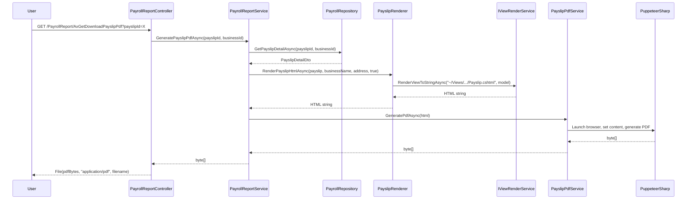
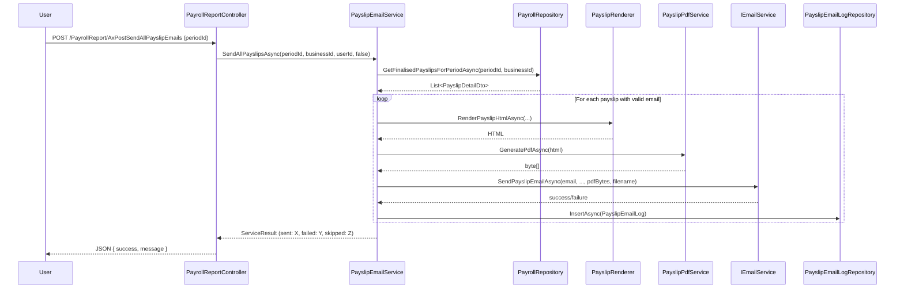
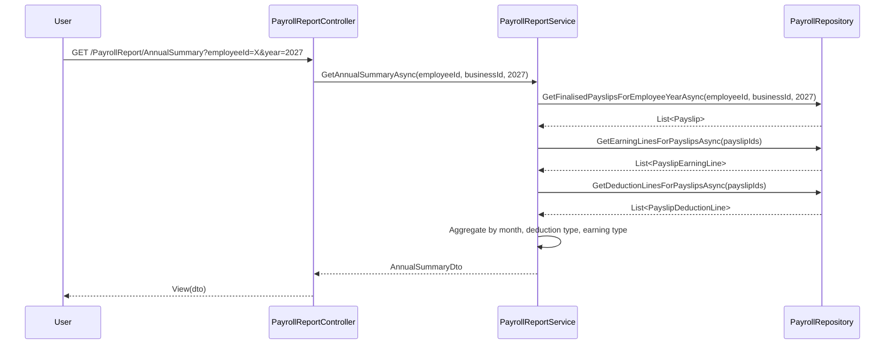

# Design Document: Payroll Phase C — Reporting & Export

## Overview

Phase C implements the reporting and export layer for the Payroll module, replacing the existing stub implementations of `IPayslipPdfService`, `IPayslipEmailService`, and `PayslipRenderer` with production-ready implementations. It also introduces new report views (Employee History, Annual Summary, Earnings Breakdown, Period Summary), Excel export via ClosedXML, and employee statement generation.

### Key Design Decisions

| Decision | Choice | Rationale |
|----------|--------|-----------|
| PDF Library | **PuppeteerSharp** | Already used for invoice PDFs (`InvoicePdfService`). Consistent infrastructure, proven A4 rendering, supports CSS print styles. |
| Template Engine | **Razor Views rendered to string** via `IViewRenderService` | Same pattern as `InvoiceRenderer`. Allows strongly-typed models, reusable partials, full Razor syntax. |
| Excel Export | **ClosedXML** | Already in project dependencies. Used by `ExcelParser`. |
| ZIP Generation | **System.IO.Compression** | Built-in .NET library. No additional dependency needed. |
| Email Integration | **IEmailService → IEmailSender** | Existing infrastructure with `SendEmailWithAttachmentAsync` (used for statements). Add new `Payroll` department to `EmailDepartmentEnum`. |
| Report Service | **New `IPayrollReportService`** | Separates reporting logic from core `IPayrollService` to avoid bloating the existing interface. |
| PayslipPdfService location | **Portal.Web** | Requires `IWebHostEnvironment` for logo file resolution and PuppeteerSharp — same as `InvoicePdfService`. Interface stays in Infrastructure. |
| PayslipRenderer location | **Portal.Web** | Requires `IViewRenderService` — a web-layer concern. Same as `InvoiceRenderer`. Interface stays in Infrastructure. |
| Batch email config | **appsettings + SignalR progress** | Configurable batch size with real-time progress feedback via SignalR hub. |

### Issue Resolutions Summary

| # | Severity | Issue | Resolution |
|---|----------|-------|-----------|
| 1 | HIGH | PayslipPdfService should be in Portal.Web | Moved to `Portal.Web/Services/PayslipPdfService.cs` (interface stays in Infrastructure) |
| 2 | HIGH | PayslipRenderer should be in Portal.Web | Moved to `Portal.Web/Services/PayslipRenderer.cs` (interface stays in Infrastructure) |
| 3 | Low | SQL script header documentation inconsistency | Tasks updated to reference `USE [Portal]` correctly |
| 4 | MEDIUM | No CancellationToken support on IPayslipPdfService | Added `CancellationToken` parameter and `GenerateBatchPdfAsync` method |
| 5 | MEDIUM | Batch PDF needs browser reuse | Added `GenerateBatchPdfAsync` with single browser instance |
| 6 | Info | IEmailService method ordering | Already correct, no fix needed |
| 7 | Low | PayslipEmailService may not be a pure stub | Tasks note to read existing implementation first |
| 8 | MEDIUM | No navigation links to report pages | Added Task 16.5 for navigation links |
| 9 | Info | PayrollReportService has many dependencies | Acceptable for MVP, no fix needed |
| 10 | MEDIUM | Email batch size limit with progress notifications | Added PayrollSettings config + SignalR progress hub |
| 11 | Low | File download endpoints need tenant isolation | Tasks note to pass `_tenantService.CurrentBusinessId` |

## Architecture

### Component Diagram

```mermaid
graph TD
    subgraph "Web Layer"
        PC[PayrollController - Phase C endpoints]
        PRC[PayrollReportController]
        PPDF[PayslipPdfService - Web project]
        PR[PayslipRenderer - Web project]
    end

    subgraph "Service Layer"
        PRS[PayrollReportService]
        PEM[PayslipEmailService - replaced stub]
    end

    subgraph "Infrastructure"
        VRS[IViewRenderService]
        ES[IEmailService / IEmailSender]
        REPO[PayrollRepository - new report methods]
        ELREPO[PayslipEmailLogRepository]
    end

    subgraph "External"
        PUPP[PuppeteerSharp - headless Chromium]
        SMTP[SMTP Server]
    end

    PC --> PPDF
    PC --> PEM
    PRC --> PRS
    PRS --> REPO
    PRS --> PPDF
    PPDF --> PR
    PR --> VRS
    PPDF --> PUPP
    PEM --> PPDF
    PEM --> ES
    PEM --> ELREPO
    ES --> SMTP
end
```

### Request Flow

1. **PDF Download**: Controller → `PayslipPdfService.GeneratePdfAsync()` → `PayslipRenderer.RenderPayslipHtmlAsync()` → `IViewRenderService` (Razor → HTML) → PuppeteerSharp (HTML → PDF bytes) → FileResult
2. **Email Send**: Controller → `PayslipEmailService.SendPayslipAsync()` → generate PDF → `IEmailService.SendPayslipEmailAsync()` → log to `PayslipEmailLog`
3. **Report View**: Controller → `PayrollReportService` → repository aggregation queries → View
4. **Excel Export**: Controller → `PayrollReportService` → ClosedXML workbook → FileResult

## Components and Interfaces

### 1. PayslipRenderer (Replace Stub)

**File**: `Portal.Web/Services/PayslipRenderer.cs`
**Interface**: `Portal.Infrastructure/Services/IPayslipRenderer.cs` (unchanged)

The current stub returns a basic `<h1>` string. The replacement renders the full branded A4 template via Razor. Lives in the Web project because it depends on `IViewRenderService` — same pattern as `InvoiceRenderer` at `Portal.Web/Services/InvoiceRenderer.cs`.

```csharp
public class PayslipRenderer : IPayslipRenderer
{
    private readonly IViewRenderService _viewRenderService;
    private readonly ILogoService _logoService;

    public PayslipRenderer(IViewRenderService viewRenderService, ILogoService logoService)
    {
        _viewRenderService = viewRenderService;
        _logoService = logoService;
    }

    public async Task<string> RenderPayslipHtmlAsync(
        PayslipDetailDto payslip, string businessName, string businessAddress, bool includeSignature)
    {
        try
        {
            var model = new PayslipPdfViewModel
            {
                Payslip = payslip,
                BusinessName = businessName,
                BusinessAddress = businessAddress,
                IncludeSignature = includeSignature
            };

            return await _viewRenderService.RenderViewToStringAsync(
                "~/Views/Payroll/PdfTemplates/Payslip.cshtml", model);
        }
        catch (Exception ex)
        {
            throw;
        }
    }
}
```

**Razor View Location**: `Portal.Web/Views/Payroll/PdfTemplates/Payslip.cshtml`

The Razor view implements the approved mockup layout (`.kiro/docs/mockups/payroll-phase-c-payslip-pdf.html`) with:
- Self-contained CSS (inline styles for PDF compatibility)
- A4 dimensions (210mm × 297mm)
- Portal brand colours (#0D5EA6 primary, Manrope headings, Inter body)
- Sections: Header (logo/business), Employee Details, Earnings table, Employee Deductions table, Net Salary box, Employer Contributions table, Total Cost summary, Manager Notes (conditional), Footer

### 2. PayslipPdfService (Replace Stub)

**File**: `Portal.Web/Services/PayslipPdfService.cs`
**Interface**: `Portal.Infrastructure/Services/IPayslipPdfService.cs` (unchanged)

Follows the same PuppeteerSharp pattern as `InvoicePdfService` at `Portal.Web/Services/InvoicePdfService.cs`. Lives in the Web project because it needs `IWebHostEnvironment` for logo file resolution.

The updated `IPayslipPdfService` interface:

```csharp
public interface IPayslipPdfService
{
    Task<byte[]> GeneratePdfAsync(string html, CancellationToken cancellationToken = default);
    Task<List<byte[]>> GenerateBatchPdfAsync(List<string> htmlDocuments, CancellationToken cancellationToken = default);
}
```

```csharp
public class PayslipPdfService : IPayslipPdfService
{
    private readonly IWebHostEnvironment _environment;
    private readonly ILogoService _logoService;
    private readonly ICurrentTenantService _tenantService;

    public PayslipPdfService(
        IWebHostEnvironment environment,
        ILogoService logoService,
        ICurrentTenantService tenantService)
    {
        _environment = environment;
        _logoService = logoService;
        _tenantService = tenantService;
    }

    public async Task<byte[]> GeneratePdfAsync(string html, CancellationToken cancellationToken = default)
    {
        try
        {
            // Embed logo as base64 for PDF (same pattern as InvoicePdfService)
            html = await EmbedLogoAsBase64Async(html);
            return await GeneratePdfFromHtmlAsync(html, cancellationToken);
        }
        catch (Exception ex)
        {
            throw;
        }
    }

    public async Task<List<byte[]>> GenerateBatchPdfAsync(List<string> htmlDocuments, CancellationToken cancellationToken = default)
    {
        try
        {
            await new BrowserFetcher().DownloadAsync();

            await using var browser = await Puppeteer.LaunchAsync(new LaunchOptions
            {
                Headless = true,
                Args = new[] { "--no-sandbox", "--disable-setuid-sandbox" }
            });

            var results = new List<byte[]>();
            foreach (var html in htmlDocuments)
            {
                cancellationToken.ThrowIfCancellationRequested();
                var embeddedHtml = await EmbedLogoAsBase64Async(html);

                await using var page = await browser.NewPageAsync();
                await page.SetContentAsync(embeddedHtml, new NavigationOptions
                {
                    WaitUntil = new[] { WaitUntilNavigation.Networkidle0 }
                });

                var pdfBytes = await page.PdfDataAsync(new PdfOptions
                {
                    Landscape = false,
                    Format = PaperFormat.A4,
                    PrintBackground = true,
                    MarginOptions = new MarginOptions
                    {
                        Top = "0mm", Bottom = "0mm", Left = "0mm", Right = "0mm"
                    }
                });
                results.Add(pdfBytes);
            }
            return results;
        }
        catch (Exception ex)
        {
            throw;
        }
    }

    private async Task<string> EmbedLogoAsBase64Async(string html)
    {
        // Same implementation as InvoicePdfService.EmbedLogoAsBase64Async
        // Replace  with base64 data URI
    }

    private static async Task<byte[]> GeneratePdfFromHtmlAsync(string html, CancellationToken cancellationToken = default)
    {
        await new BrowserFetcher().DownloadAsync();

        await using var browser = await Puppeteer.LaunchAsync(new LaunchOptions
        {
            Headless = true,
            Args = new[] { "--no-sandbox", "--disable-setuid-sandbox" }
        });

        cancellationToken.ThrowIfCancellationRequested();

        await using var page = await browser.NewPageAsync();
        await page.SetContentAsync(html, new NavigationOptions
        {
            WaitUntil = new[] { WaitUntilNavigation.Networkidle0 }
        });

        var pdfBytes = await page.PdfDataAsync(new PdfOptions
        {
            Landscape = false,
            Format = PaperFormat.A4,
            PrintBackground = true,
            MarginOptions = new MarginOptions
            {
                Top = "0mm", Bottom = "0mm", Left = "0mm", Right = "0mm"
            }
        });

        return pdfBytes;
    }
}
```

**Note**: Zero margins because the HTML template itself defines 48px/52px internal padding (matching the mockup). This ensures the payslip fills the page correctly.

### 3. PayslipEmailService (Replace Stub)

**File**: `Portal.Infrastructure/Services/PayslipEmailService.cs`

Requires dependency on `IPayslipPdfService`, `IPayslipRenderer`, `IPayrollService` (for data retrieval), `IEmailService`, `IBusinessService`, `PayslipEmailLogRepository`, `IOptions<PayrollSettings>`, and `IHubContext<PayrollHub>`.

The existing interface:
```csharp
public interface IPayslipEmailService
{
    Task<ServiceResult> SendPayslipAsync(int payslipId, int businessId, string userId, bool includeSignature);
    Task<ServiceResult> SendAllPayslipsAsync(int periodId, int businessId, string userId, bool includeSignature);
}
```

**Implementation approach**:

```csharp
public class PayslipEmailService : IPayslipEmailService
{
    private readonly IPayslipPdfService _pdfService;
    private readonly IPayslipRenderer _renderer;
    private readonly IEmailService _emailService;
    private readonly PayslipEmailLogRepository _emailLogRepository;
    private readonly PayrollRepository _payrollRepository;
    private readonly IBusinessService _businessService;
    private readonly PayrollSettings _settings;
    private readonly IHubContext<PayrollHub> _hubContext;

    public async Task<ServiceResult> SendPayslipAsync(int payslipId, int businessId, string userId, bool includeSignature)
    {
        try
        {
            // 1. Load payslip detail
            var payslip = await _payrollRepository.GetPayslipDetailAsync(payslipId, businessId);
            if (payslip == null) return ServiceResult.Fail("Payslip not found.");

            // 2. Validate employee has email
            if (string.IsNullOrWhiteSpace(payslip.EmployeeEmail))
                return ServiceResult.Fail("Employee email address not configured.");

            // 3. Load business info
            var business = await _businessService.GetBusinessByIdAsync(businessId);
            var profile = await _businessService.GetBusinessProfileAsync(businessId);

            // 4. Render HTML → PDF
            var html = await _renderer.RenderPayslipHtmlAsync(payslip, business.Name, profile?.Address ?? "", includeSignature);
            var pdfBytes = await _pdfService.GeneratePdfAsync(html);

            // 5. Build filename
            var monthName = CultureInfo.InvariantCulture.DateTimeFormat.GetMonthName(payslip.Month);
            var filename = $"{payslip.EmployeeName}_Payslip_{monthName}_{payslip.Year}.pdf";

            // 6. Send email with attachment
            await _emailService.SendPayslipEmailAsync(
                payslip.EmployeeEmail, payslip.EmployeeName, business.Name,
                monthName, payslip.Year, pdfBytes, filename);

            // 7. Log success
            await _emailLogRepository.InsertAsync(new PayslipEmailLog
            {
                PayslipId = payslipId,
                SentByUserId = userId,
                SentToEmail = payslip.EmployeeEmail,
                IsSuccess = true
            });

            return ServiceResult.Ok();
        }
        catch (Exception ex)
        {
            // Log failure
            await _emailLogRepository.InsertAsync(new PayslipEmailLog
            {
                PayslipId = payslipId,
                SentByUserId = userId,
                SentToEmail = "unknown",
                IsSuccess = false,
                FailureReason = ex.Message
            });
            throw;
        }
    }

    public async Task<ServiceResult> SendAllPayslipsAsync(int periodId, int businessId, string userId, bool includeSignature)
    {
        // 1. Get all payslips in period
        // 2. Filter to Finalised/Re-finalised status
        // 3. Filter to employees with valid email
        // 4. Check against BatchEmailMaxSize — return error if exceeded
        // 5. Iterate: for each payslip, call SendPayslipAsync
        // 6. Add delay of BatchEmailDelayBetweenSendsMs between sends
        // 7. After each send, broadcast SignalR progress via _hubContext:
        //    await _hubContext.Clients.User(userId).SendAsync("BatchEmailProgress", new { current, total, lastEmployee, status })
        // 8. Track success/fail/skipped counts
        // 9. Return ServiceResult with summary message
    }
}
```

### 4. IEmailService Extension

Add a new method to `IEmailService`:

```csharp
/// <summary>
/// Sends a payslip email with the PDF attached.
/// </summary>
Task SendPayslipEmailAsync(string toEmail, string employeeName, string businessName,
    string monthName, int year, byte[] pdfBytes, string filename);
```

Implementation in `PortalEmailService` uses `SendEmailWithAttachmentAsync` with:
- Subject: `"Your Payslip - {MonthName} {Year}"`
- Body: Branded HTML email with message "Please find attached your payslip for {MonthName} {Year}."
- Department: `EmailDepartmentEnum.Payroll` (new enum value)
- Attachment: PDF bytes with filename

### 5. IPayrollReportService (New)

**File**: `Portal.Infrastructure/Services/IPayrollReportService.cs`

Dedicated service for Phase C reporting logic, keeping `IPayrollService` focused on core CRUD/generation operations.

```csharp
public interface IPayrollReportService
{
    // Employee History
    Task<EmployeePayslipHistoryDto> GetEmployeeHistoryAsync(int employeeId, int businessId, int? year);

    // Annual Summary
    Task<AnnualSummaryDto> GetAnnualSummaryAsync(int employeeId, int businessId, int year);
    Task<byte[]> GenerateAnnualSummaryPdfAsync(int employeeId, int businessId, int year);

    // Earnings Breakdown
    Task<EarningsBreakdownDto> GetEarningsBreakdownAsync(int businessId, EarningsBreakdownFilter filter);
    Task<byte[]> ExportEarningsBreakdownToExcelAsync(int businessId, EarningsBreakdownFilter filter);

    // Period Summary
    Task<PeriodSummaryDto> GetPeriodSummaryAsync(int periodId, int businessId, int? departmentId);
    Task<byte[]> GeneratePeriodSummaryPdfAsync(int periodId, int businessId, int? departmentId);
    Task<byte[]> ExportPeriodSummaryToExcelAsync(int periodId, int businessId, int? departmentId);

    // Employee Statement
    Task<byte[]> GenerateEmployeeStatementPdfAsync(int employeeId, int businessId, int startYear, int startMonth, int endYear, int endMonth);

    // Download All (ZIP)
    Task<byte[]> GenerateAllPayslipsPdfZipAsync(int periodId, int businessId);

    // Email log
    Task<List<PayslipEmailLogDto>> GetEmailLogForPayslipAsync(int payslipId);
    Task<PayslipEmailSummaryDto> GetEmailSummaryForPeriodAsync(int periodId, int businessId);
    Task<PayslipEmailLogDto?> GetLastEmailForPayslipAsync(int payslipId);
}
```

### 6. PayrollReportController (New)

**File**: `Portal.Web/Controllers/PayrollReportController.cs`

Separated from `PayrollController` to keep Phase C endpoints isolated. Same authorization pattern.

```csharp
[Authorize]
[ModuleAccess(PortalModules.Payroll)]
public class PayrollReportController : Controller
{
    private readonly IPayrollReportService _reportService;
    private readonly IPayrollService _payrollService;
    private readonly ICurrentTenantService _tenantService;

    // Page Actions
    [HttpGet] EmployeeHistory(int employeeId, int? year)
    [HttpGet] AnnualSummary(int employeeId, int? year)
    [HttpGet] EarningsBreakdown(...)
    [HttpGet] PeriodSummary(int periodId, int? departmentId)

    // Download/Export Actions (Ajax GET endpoints returning file)
    [HttpGet] AxGetDownloadPayslipPdf(int payslipId)        // moves from PayrollController
    [HttpGet] AxGetDownloadAllPayslipsPdf(int periodId)     // new - ZIP
    [HttpGet] AxGetDownloadAnnualSummaryPdf(int employeeId, int year)
    [HttpGet] AxGetDownloadPeriodSummaryPdf(int periodId, int? departmentId)
    [HttpGet] AxGetDownloadEmployeeStatement(int employeeId, int startYear, int startMonth, int endYear, int endMonth)
    [HttpGet] AxGetExportEarningsBreakdown(...)              // Excel
    [HttpGet] AxGetExportPeriodSummary(int periodId, int? departmentId) // Excel

    // Email Actions (restricted to Owner/SuperAdmin)
    [HttpPost] AxPostSendPayslipEmail(int payslipId)        // moves from PayrollController
    [HttpPost] AxPostSendAllPayslipEmails(int periodId)     // moves from PayrollController

    // Email Log (Ajax)
    [HttpGet] AxGetEmailLog(int payslipId)
    [HttpGet] AxGetPeriodEmailSummary(int periodId)
}
```

**Role Restriction**: Email send actions check `User.HasClaim("IsOwner", "true") || User.IsInRole("SuperAdmin")` — return 403 if neither. UI hides buttons for non-Owner/non-SuperAdmin users via a ViewBag flag.

## Data Models

### Database Schema — PayslipEmailLog (New Table)

```sql
-- ============================================================
-- Phase C: PayslipEmailLog table for tracking email sends
-- ============================================================

USE [Portal]
GO

CREATE TABLE [payroll].[PayslipEmailLog] (
    [Id]              INT             IDENTITY(1,1) NOT NULL,
    [PayslipId]       INT             NOT NULL,
    [SentByUserId]    NVARCHAR(450)   NOT NULL,
    [SentToEmail]     NVARCHAR(256)   NOT NULL,
    [SentAtUtc]       DATETIME        NOT NULL CONSTRAINT [DF_PayslipEmailLog_SentAtUtc] DEFAULT (GETUTCDATE()),
    [IsSuccess]       BIT             NOT NULL,
    [FailureReason]   NVARCHAR(500)   NULL,
    [CreatedAtUtc]    DATETIME        NOT NULL CONSTRAINT [DF_PayslipEmailLog_CreatedAtUtc] DEFAULT (GETUTCDATE()),
    CONSTRAINT [PK_PayslipEmailLog] PRIMARY KEY CLUSTERED ([Id]),
    CONSTRAINT [FK_PayslipEmailLog_Payslip] FOREIGN KEY ([PayslipId]) REFERENCES [payroll].[Payslip]([Id])
);
GO

-- Index for querying email history by payslip
CREATE NONCLUSTERED INDEX [IX_PayslipEmailLog_PayslipId]
ON [payroll].[PayslipEmailLog] ([PayslipId])
INCLUDE ([SentAtUtc], [IsSuccess]);
GO
```

### EmailDepartmentEnum Extension

```csharp
// Add new value to existing enum
public enum EmailDepartmentEnum
{
    // ... existing values ...
    Payroll  // NEW — for payslip email sends
}
```

### EF Core Entity — PayslipEmailLog

```csharp
namespace Portal.Infrastructure.Entities;

/// <summary>
/// Tracks each payslip email send attempt.
/// Schema: [payroll].PayslipEmailLog
/// </summary>
public class PayslipEmailLog
{
    public int Id { get; set; }
    public int PayslipId { get; set; }
    public string SentByUserId { get; set; } = string.Empty;
    public string SentToEmail { get; set; } = string.Empty;
    public DateTime SentAtUtc { get; set; }
    public bool IsSuccess { get; set; }
    public string? FailureReason { get; set; }
    public DateTime CreatedAtUtc { get; set; }
}
```

### DbContext Configuration

```csharp
private static void ConfigurePayslipEmailLog(ModelBuilder modelBuilder)
{
    modelBuilder.Entity<PayslipEmailLog>(entity =>
    {
        entity.ToTable("PayslipEmailLog", "payroll");
        entity.HasKey(e => e.Id);
        entity.Property(e => e.PayslipId).IsRequired();
        entity.Property(e => e.SentByUserId).IsRequired().HasMaxLength(450);
        entity.Property(e => e.SentToEmail).IsRequired().HasMaxLength(256);
        entity.Property(e => e.SentAtUtc).IsRequired().HasDefaultValueSql("GETUTCDATE()");
        entity.Property(e => e.IsSuccess).IsRequired();
        entity.Property(e => e.FailureReason).HasMaxLength(500);
        entity.Property(e => e.CreatedAtUtc).IsRequired().HasDefaultValueSql("GETUTCDATE()");
    });
}
```

### DTO Models (New)

```csharp
namespace Portal.Infrastructure.Models.Payroll;

// --- PDF View Models ---

public class PayslipPdfViewModel
{
    public PayslipDetailDto Payslip { get; set; } = null!;
    public string BusinessName { get; set; } = string.Empty;
    public string BusinessAddress { get; set; } = string.Empty;
    public string? LogoUrl { get; set; }
    public bool IncludeSignature { get; set; }
}

public class AnnualSummaryPdfViewModel
{
    public string EmployeeName { get; set; } = string.Empty;
    public string? EmployeeSin { get; set; }
    public string BusinessName { get; set; } = string.Empty;
    public int Year { get; set; }
    public List<MonthlySummaryRow> MonthlyBreakdown { get; set; } = new();
    public List<DeductionSummaryRow> DeductionBreakdown { get; set; } = new();
    public List<DeductionSummaryRow> ContributionBreakdown { get; set; } = new();
    public decimal TotalGross { get; set; }
    public decimal TotalDeductions { get; set; }
    public decimal TotalNet { get; set; }
    public decimal TotalContributions { get; set; }
}

public class EmployeeStatementPdfViewModel
{
    public string EmployeeName { get; set; } = string.Empty;
    public string? Position { get; set; }
    public string? SocialInsuranceNumber { get; set; }
    public string? IdNumber { get; set; }
    public string BusinessName { get; set; } = string.Empty;
    public string BusinessAddress { get; set; } = string.Empty;
    public string PeriodFrom { get; set; } = string.Empty;
    public string PeriodTo { get; set; } = string.Empty;
    public decimal TotalGross { get; set; }
    public decimal TotalDeductions { get; set; }
    public decimal TotalNet { get; set; }
    public decimal TotalContributions { get; set; }
    public List<PayslipDetailDto> Payslips { get; set; } = new();
}

// --- Report DTOs ---

public class EmployeePayslipHistoryDto
{
    public int EmployeeId { get; set; }
    public string EmployeeName { get; set; } = string.Empty;
    public int? FilteredYear { get; set; }
    public List<int> AvailableYears { get; set; } = new();
    public List<PayslipHistoryItemDto> Payslips { get; set; } = new();
    public decimal SummaryTotalGross { get; set; }
    public decimal SummaryTotalNet { get; set; }
    public int SummaryCount { get; set; }
}

public class PayslipHistoryItemDto
{
    public int PayslipId { get; set; }
    public int Year { get; set; }
    public int Month { get; set; }
    public decimal TotalEarnings { get; set; }
    public decimal NetSalary { get; set; }
    public string Status { get; set; } = string.Empty;
}

public class AnnualSummaryDto
{
    public int EmployeeId { get; set; }
    public string EmployeeName { get; set; } = string.Empty;
    public int Year { get; set; }
    public List<int> AvailableYears { get; set; } = new();
    public decimal TotalGross { get; set; }
    public decimal TotalDeductions { get; set; }
    public decimal TotalNet { get; set; }
    public decimal TotalContributions { get; set; }
    public List<MonthlySummaryRow> MonthlyBreakdown { get; set; } = new();
    public List<DeductionSummaryRow> DeductionBreakdown { get; set; } = new();
    public List<DeductionSummaryRow> ContributionBreakdown { get; set; } = new();
    public List<EarningSummaryRow> EarningsBreakdown { get; set; } = new();
}

public class MonthlySummaryRow
{
    public int Month { get; set; }
    public decimal Gross { get; set; }
    public decimal Deductions { get; set; }
    public decimal Net { get; set; }
    public decimal Contributions { get; set; }
}

public class DeductionSummaryRow
{
    public string DeductionName { get; set; } = string.Empty;
    public decimal TotalAmount { get; set; }
    public int MonthsApplied { get; set; }
}

public class EarningSummaryRow
{
    public string EarningTypeName { get; set; } = string.Empty;
    public decimal TotalAmount { get; set; }
}

public class EarningsBreakdownFilter
{
    public int? FromYear { get; set; }
    public int? FromMonth { get; set; }
    public int? ToYear { get; set; }
    public int? ToMonth { get; set; }
    public int? EmployeeId { get; set; }
    public List<int>? EarningTypeIds { get; set; }
}

public class EarningsBreakdownDto
{
    public List<EarningTypeSummaryRow> TypeSummaries { get; set; } = new();
    public List<EarningDetailRow> Details { get; set; } = new();
    public EarningsBreakdownFilter AppliedFilter { get; set; } = new();
}

public class EarningTypeSummaryRow
{
    public int EarningTypeId { get; set; }
    public string EarningTypeName { get; set; } = string.Empty;
    public decimal TotalAmount { get; set; }
    public int LineCount { get; set; }
}

public class EarningDetailRow
{
    public string EmployeeName { get; set; } = string.Empty;
    public int Year { get; set; }
    public int Month { get; set; }
    public string EarningTypeName { get; set; } = string.Empty;
    public string? Description { get; set; }
    public decimal Amount { get; set; }
}

public class PeriodSummaryDto
{
    public int PeriodId { get; set; }
    public int Year { get; set; }
    public int Month { get; set; }
    public int? DepartmentFilter { get; set; }
    public List<PeriodSummaryRow> Rows { get; set; } = new();
    public decimal TotalGross { get; set; }
    public decimal TotalDeductions { get; set; }
    public decimal TotalNet { get; set; }
    public decimal TotalContributions { get; set; }
    public decimal TotalCost { get; set; }
}

public class PeriodSummaryRow
{
    public string EmployeeName { get; set; } = string.Empty;
    public string? DepartmentName { get; set; }
    public decimal TotalEarnings { get; set; }
    public decimal TotalDeductions { get; set; }
    public decimal NetSalary { get; set; }
    public decimal EmployerContributions { get; set; }
    public decimal TotalCost { get; set; }
}

public class PayslipEmailLogDto
{
    public int Id { get; set; }
    public int PayslipId { get; set; }
    public string SentByUserName { get; set; } = string.Empty;
    public string SentToEmail { get; set; } = string.Empty;
    public DateTime SentAtUtc { get; set; }
    public bool IsSuccess { get; set; }
    public string? FailureReason { get; set; }
}

public class PayslipEmailSummaryDto
{
    public int TotalSent { get; set; }
    public int TotalSuccessful { get; set; }
    public int TotalFailed { get; set; }
}
```

## Repository Layer

### PayslipEmailLogRepository (New)

**File**: `Portal.Infrastructure/Repositories/PayslipEmailLogRepository.cs`

```csharp
public class PayslipEmailLogRepository : GenericStoredProcedureRepository<PayslipEmailLog>
{
    public PayslipEmailLogRepository(PortalDbContext context) : base(context) { }

    public async Task InsertAsync(PayslipEmailLog entity)
    {
        try
        {
            const string query = @"
                INSERT INTO [payroll].[PayslipEmailLog]
                    ([PayslipId], [SentByUserId], [SentToEmail], [IsSuccess], [FailureReason])
                VALUES
                    (@PayslipId, @SentByUserId, @SentToEmail, @IsSuccess, @FailureReason)";

            await _context.Database.ExecuteSqlRawAsync(query,
                new SqlParameter("@PayslipId", entity.PayslipId),
                new SqlParameter("@SentByUserId", entity.SentByUserId),
                new SqlParameter("@SentToEmail", entity.SentToEmail),
                new SqlParameter("@IsSuccess", entity.IsSuccess),
                new SqlParameter("@FailureReason", entity.FailureReason ?? (object)DBNull.Value)
            );
        }
        catch (Exception ex)
        {
            throw;
        }
    }

    public async Task<List<PayslipEmailLog>> GetByPayslipIdAsync(int payslipId)
    {
        try
        {
            const string query = @"
                SELECT PayslipEmailLog.Id, PayslipEmailLog.PayslipId, PayslipEmailLog.SentByUserId,
                       PayslipEmailLog.SentToEmail, PayslipEmailLog.SentAtUtc, PayslipEmailLog.IsSuccess,
                       PayslipEmailLog.FailureReason, PayslipEmailLog.CreatedAtUtc
                FROM [payroll].[PayslipEmailLog]
                WHERE PayslipEmailLog.PayslipId = @PayslipId
                ORDER BY PayslipEmailLog.SentAtUtc DESC";

            return await _context.Set<PayslipEmailLog>()
                .FromSqlRaw(query, new SqlParameter("@PayslipId", payslipId))
                .ToListAsync();
        }
        catch (Exception ex)
        {
            throw;
        }
    }

    public async Task<PayslipEmailLog?> GetLastByPayslipIdAsync(int payslipId)
    {
        try
        {
            const string query = @"
                SELECT TOP 1 PayslipEmailLog.Id, PayslipEmailLog.PayslipId, PayslipEmailLog.SentByUserId,
                       PayslipEmailLog.SentToEmail, PayslipEmailLog.SentAtUtc, PayslipEmailLog.IsSuccess,
                       PayslipEmailLog.FailureReason, PayslipEmailLog.CreatedAtUtc
                FROM [payroll].[PayslipEmailLog]
                WHERE PayslipEmailLog.PayslipId = @PayslipId
                  AND PayslipEmailLog.IsSuccess = 1
                ORDER BY PayslipEmailLog.SentAtUtc DESC";

            return (await _context.Set<PayslipEmailLog>()
                .FromSqlRaw(query, new SqlParameter("@PayslipId", payslipId))
                .ToListAsync()).FirstOrDefault();
        }
        catch (Exception ex)
        {
            throw;
        }
    }
}
```

### PayrollRepository Extensions (Report Queries)

New methods added to existing `PayrollRepository`:

```csharp
// Employee History - all payslips for an employee, filtered by year
public async Task<List<Payslip>> GetPayslipsByEmployeeAsync(int employeeId, int businessId, int? year)

// Annual Summary - aggregate payslip data for employee + year (Finalised/Re-Finalised only)
public async Task<List<Payslip>> GetFinalisedPayslipsForEmployeeYearAsync(int employeeId, int businessId, int year)

// Earning lines for multiple payslips (for annual breakdown)
public async Task<List<PayslipEarningLine>> GetEarningLinesForPayslipsAsync(int[] payslipIds)

// Deduction lines for multiple payslips (for annual breakdown)
public async Task<List<PayslipDeductionLine>> GetDeductionLinesForPayslipsAsync(int[] payslipIds)

// Earnings Breakdown - filtered earning lines across periods/employees
public async Task<List<EarningDetailRow>> GetEarningsBreakdownAsync(int businessId, EarningsBreakdownFilter filter)

// Period Summary - all finalised payslip summaries for a period
public async Task<List<PayslipSummaryDto>> GetPeriodSummaryAsync(int periodId, int businessId, int? departmentId)

// Available years for employee (for year picker dropdowns)
public async Task<List<int>> GetAvailableYearsForEmployeeAsync(int employeeId, int businessId)

// Email summary for period
public async Task<PayslipEmailSummaryDto> GetEmailSummaryForPeriodAsync(int periodId, int businessId)
```

All queries filter to `PayslipStatusTypeId IN (3, 5)` (Finalised = 3, Re-Finalised = 5) for report accuracy. Uses full table names (no aliases) per project convention.

## Service Layer — PayrollReportService

**File**: `Portal.Infrastructure/Services/PayrollReportService.cs`

This is the main orchestration service for Phase C reports. It:
1. Queries data via `PayrollRepository`
2. Aggregates/transforms into report DTOs
3. Delegates PDF generation to the renderer + PuppeteerSharp pipeline
4. Delegates Excel generation to ClosedXML

### Excel Export Pattern

```csharp
public async Task<byte[]> ExportEarningsBreakdownToExcelAsync(int businessId, EarningsBreakdownFilter filter)
{
    try
    {
        var data = await GetEarningsBreakdownAsync(businessId, filter);

        using var workbook = new XLWorkbook();
        var worksheet = workbook.Worksheets.Add("Earnings Breakdown");

        // Headers
        worksheet.Cell(1, 1).Value = "Employee Name";
        worksheet.Cell(1, 2).Value = "Period";
        worksheet.Cell(1, 3).Value = "Earning Type";
        worksheet.Cell(1, 4).Value = "Description";
        worksheet.Cell(1, 5).Value = "Amount";

        // Style header row
        var headerRange = worksheet.Range(1, 1, 1, 5);
        headerRange.Style.Font.Bold = true;
        headerRange.Style.Fill.BackgroundColor = XLColor.FromHtml("#0D5EA6");
        headerRange.Style.Font.FontColor = XLColor.White;

        // Data rows
        var row = 2;
        foreach (var detail in data.Details)
        {
            worksheet.Cell(row, 1).Value = detail.EmployeeName;
            worksheet.Cell(row, 2).Value = $"{CultureInfo.InvariantCulture.DateTimeFormat.GetAbbreviatedMonthName(detail.Month)} {detail.Year}";
            worksheet.Cell(row, 3).Value = detail.EarningTypeName;
            worksheet.Cell(row, 4).Value = detail.Description ?? "";
            worksheet.Cell(row, 5).Value = detail.Amount;
            worksheet.Cell(row, 5).Style.NumberFormat.Format = "#,##0.00";
            row++;
        }

        worksheet.Columns().AdjustToContents();

        using var stream = new MemoryStream();
        workbook.SaveAs(stream);
        return stream.ToArray();
    }
    catch (Exception ex)
    {
        throw;
    }
}
```

### ZIP Generation Pattern (Download All)

```csharp
public async Task<byte[]> GenerateAllPayslipsPdfZipAsync(int periodId, int businessId)
{
    try
    {
        var payslips = await _payrollRepository.GetFinalisedPayslipsForPeriodAsync(periodId, businessId);
        var business = await _businessService.GetBusinessByIdAsync(businessId);
        var profile = await _businessService.GetBusinessProfileAsync(businessId);

        // Render all HTML documents first
        var htmlDocuments = new List<string>();
        var filenames = new List<string>();
        foreach (var payslip in payslips)
        {
            var html = await _renderer.RenderPayslipHtmlAsync(payslip, business.Name, profile?.Address ?? "", false);
            htmlDocuments.Add(html);

            var monthName = CultureInfo.InvariantCulture.DateTimeFormat.GetMonthName(payslip.Month);
            filenames.Add($"{payslip.EmployeeName}_Payslip_{monthName}_{payslip.Year}.pdf");
        }

        // Generate all PDFs with browser reuse via batch method
        var pdfBytesList = await _pdfService.GenerateBatchPdfAsync(htmlDocuments);

        // Package into ZIP
        using var memoryStream = new MemoryStream();
        using (var archive = new ZipArchive(memoryStream, ZipArchiveMode.Create, true))
        {
            for (int i = 0; i < pdfBytesList.Count; i++)
            {
                var entry = archive.CreateEntry(filenames[i], CompressionLevel.Optimal);
                using var entryStream = entry.Open();
                await entryStream.WriteAsync(pdfBytesList[i]);
            }
        }

        return memoryStream.ToArray();
    }
    catch (Exception ex)
    {
        throw;
    }
}
```

## View Layer

### Razor Views for PDF Templates

| View | Model | Purpose |
|------|-------|---------|
| `Views/Payroll/PdfTemplates/Payslip.cshtml` | `PayslipPdfViewModel` | Individual payslip PDF (per mockup) |
| `Views/Payroll/PdfTemplates/AnnualSummary.cshtml` | `AnnualSummaryPdfViewModel` | Annual summary PDF |
| `Views/Payroll/PdfTemplates/PeriodSummary.cshtml` | `PeriodSummaryDto` | Period summary table as PDF |
| `Views/Payroll/PdfTemplates/EmployeeStatement.cshtml` | `EmployeeStatementPdfViewModel` | Multi-payslip statement PDF |

All PDF templates:
- Self-contained HTML with inline CSS (no external stylesheets)
- A4 dimensions matching mockup structure
- Brand colours (#0D5EA6, Manrope headings, Inter body)
- Use `@model` directive for strong typing
- No JavaScript (PuppeteerSharp renders static HTML)

### Report Page Views

| View | Model | Route |
|------|-------|-------|
| `Views/PayrollReport/EmployeeHistory.cshtml` | `EmployeePayslipHistoryDto` | `/PayrollReport/EmployeeHistory?employeeId=X&year=Y` |
| `Views/PayrollReport/AnnualSummary.cshtml` | `AnnualSummaryDto` | `/PayrollReport/AnnualSummary?employeeId=X&year=Y` |
| `Views/PayrollReport/EarningsBreakdown.cshtml` | `EarningsBreakdownDto` | `/PayrollReport/EarningsBreakdown` |
| `Views/PayrollReport/PeriodSummary.cshtml` | `PeriodSummaryDto` | `/PayrollReport/PeriodSummary?periodId=X` |

All report views follow existing layout conventions:
- Topbar with eyebrow label, heading (42px Manrope), muted description
- Filter section (`.glass.card-pad`, `margin-bottom:22px`)
- Data table section (`.glass.card-pad`)
- Pagination where needed
- Mobile responsive (card-based at <810px, stacked filters, min 44px touch targets)

### Mobile Responsiveness

```css
@media (max-width: 810px) {
    /* Stack filter controls vertically */
    .filter-row { flex-direction: column; }
    .filter-row .field { min-width: 100%; }

    /* Convert wide tables to card-based layout or scrollable */
    .report-table-wrapper { overflow-x: auto; -webkit-overflow-scrolling: touch; }

    /* Ensure action buttons meet 44px minimum */
    .btn { min-height: 44px; min-width: 44px; }
}

@media (max-width: 375px) {
    .topbar h1 { font-size: 28px; }
    body { font-size: 14px; }
}
```

## Sequence Diagrams

### PDF Download Flow



### Batch Email Flow



### Report Generation Flow (Annual Summary)



## Error Handling

### Error Strategy by Layer

| Layer | Strategy | Example |
|-------|----------|---------|
| Repository | `try/catch (Exception ex) { throw; }` | All data access methods |
| Service | `try/catch` with ServiceResult.Fail for expected errors, rethrow for unexpected | Missing employee email, no payslips found |
| Controller | `try/catch` with JSON response (`{ success: false, message }`) | All AJAX endpoints |
| PDF Generation | Catch per-payslip failures, return error identifying the employee | Individual PDF: return error. Batch ZIP: skip failed, include error summary |
| Email Sending | Per-payslip error logging, continue batch | Log failure to PayslipEmailLog with `IsSuccess = false` and `FailureReason`, continue processing remaining |

### Specific Error Scenarios

1. **PDF generation fails for a specific payslip** (Req 2.7):
   - Single download: Return error JSON with employee name and failure reason
   - Batch ZIP: Skip failed payslip, return ZIP with successful ones + summary of failures
   
2. **Employee has no email** (Req 7.4):
   - Return `ServiceResult.Fail("Employee email address not configured.")`
   - UI disables the "Send by Email" button and shows tooltip

3. **Batch email — partial failures** (Req 7.10):
   - Each failure is logged to `PayslipEmailLog` with `IsSuccess = false`
   - Batch continues processing remaining employees
   - Final response includes count: sent, failed, skipped

4. **No finalised payslips for period/year** (Req 6.6, 3.7, 8.7):
   - Return DTO with empty lists
   - View renders empty state message

5. **Duplicate email prevention** (Req 7.12):
   - Query `PayslipEmailLog` for last successful send
   - If exists, controller returns warning JSON: `{ success: false, alreadySent: true, sentDate: "..." }`
   - Frontend shows SweetAlert2 confirmation: "This payslip was already emailed on {date}. Send again?"

### Performance Considerations

- **PDF generation timeout**: PuppeteerSharp has no explicit timeout in the existing pattern. For batch operations (ZIP with many payslips), use `GenerateBatchPdfAsync` which reuses the browser instance across iterations rather than launching per-payslip.
- **Batch email**: Sequential processing (not parallel) to avoid SMTP rate limits. Configurable delay between sends (see Batch Email Configuration below).
- **Report queries**: Aggregation queries should use database-level GROUP BY rather than loading all records into memory. The repository returns pre-aggregated data where possible.

### Batch Email Configuration and Progress Notifications

#### Configuration (appsettings.json)

```json
{
  "Payroll": {
    "BatchEmailMaxSize": 50,
    "BatchEmailDelayBetweenSendsMs": 500
  }
}
```

#### AppSettings Model

```csharp
namespace Portal.Infrastructure.Models;

public class PayrollSettings
{
    public int BatchEmailMaxSize { get; set; } = 50;
    public int BatchEmailDelayBetweenSendsMs { get; set; } = 500;
}
```

Register in DI:
```csharp
builder.Services.Configure<PayrollSettings>(builder.Configuration.GetSection("Payroll"));
```

Inject `IOptions<PayrollSettings>` into `PayslipEmailService`.

#### Progress Notification via SignalR

The platform already uses SignalR. For batch email sending:

1. Create a `PayrollHub` (or reuse an existing hub) with a client method `BatchEmailProgress`
2. During `SendAllPayslipsAsync`, after each email send, broadcast progress:

```csharp
await _hubContext.Clients.User(userId).SendAsync("BatchEmailProgress", new
{
    current = i + 1,
    total = eligibleCount,
    lastEmployee = employeeName,
    status = isSuccess ? "sent" : "failed"
});
```

3. The frontend subscribes to this event and updates a progress indicator (modal with progress bar or inline counter)
4. If `BatchEmailMaxSize` is exceeded, return error: "Batch size exceeds maximum ({max}). Please send in smaller groups or increase the limit in settings."

#### PayrollHub

**File**: `Portal.Web/Hubs/PayrollHub.cs`

```csharp
using Microsoft.AspNetCore.SignalR;

namespace Portal.Web.Hubs;

[Authorize]
public class PayrollHub : Hub
{
    // Empty hub — used only for grouping payroll-related real-time notifications
    // Client subscribes and receives BatchEmailProgress events via IHubContext
}
```

Map in `Program.cs`:
```csharp
app.MapHub<PayrollHub>("/hubs/payroll");
```

## Testing Strategy

### Assessment: Property-Based Testing Applicability

Phase C is primarily a **reporting and export** module with:
- CRUD operations (email log insert/read)
- PDF rendering (HTML template → binary output)
- Excel export (data → XLSX binary)
- Aggregation queries (database GROUP BY → DTO)
- Email sending (side effects via SMTP)

**Decision: PBT is NOT applicable for Phase C.** The reasons:

1. **PDF generation** is a side-effect-only operation producing binary output — no meaningful universal property to assert across random inputs. Visual correctness requires manual or snapshot testing.
2. **Excel export** produces binary XLSX files — testing requires parsing the output, which is effectively round-trip testing of ClosedXML itself (already tested by library authors).
3. **Email sending** is a side-effect-only operation — tested via mocks verifying correct calls.
4. **Report aggregation** operates on database data where the interesting bugs are in SQL queries, not in-memory transformations. Better served by integration tests with known seed data.
5. **UI rendering** (Razor views, responsive CSS) — visual regression territory, not PBT.

### Testing Approach

| Layer | Test Type | Framework |
|-------|-----------|-----------|
| Repository (report queries) | Integration tests | xUnit + PortalDbContext (in-memory or test DB) |
| Service (aggregation logic) | Unit tests with mocked repos | xUnit + Moq |
| Controller (endpoint routing) | Unit tests with mocked services | xUnit + Moq |
| PDF Renderer (HTML output) | Unit tests verifying HTML contains expected elements | xUnit + Moq (mock IViewRenderService) |
| Email Service (send logic) | Unit tests verifying correct calls to IEmailService | xUnit + Moq |
| Excel Export (content) | Integration tests reading generated XLSX | xUnit + ClosedXML |

### Key Test Scenarios

**PayslipRenderer Tests**:
- Verify model is correctly passed to IViewRenderService
- Verify correct view path is used

**PayslipPdfService Tests**:
- Cannot unit test PuppeteerSharp (requires browser). Integration test only.
- Verify that `GeneratePdfAsync` returns non-empty bytes when given valid HTML (integration)

**PayslipEmailService Tests**:
- Mock all dependencies
- Verify: payslip not found → Fail result
- Verify: no email address → Fail result
- Verify: successful send → IEmailService called with correct params + log entry created
- Verify: send failure → log entry with IsSuccess=false, batch continues

**PayrollReportService Tests**:
- Verify annual summary aggregation: given known payslip data, verify totals are correct
- Verify earnings breakdown filtering: given filter params, verify correct SQL params passed
- Verify period summary: given period with mixed statuses, only Finalised/Re-Finalised included
- Verify ZIP generation: given N payslips, ZIP contains N entries

**Controller Tests**:
- Verify role check for email send actions (non-Owner/non-SuperAdmin → 403)
- Verify correct service method called with correct params
- Verify file download returns correct content type and filename

## File Locations

| Component | Path |
|-----------|------|
| PayslipRenderer (replace stub) | `Portal.Web/Services/PayslipRenderer.cs` |
| IPayslipRenderer (interface) | `Portal.Infrastructure/Services/IPayslipRenderer.cs` |
| PayslipPdfService (replace stub) | `Portal.Web/Services/PayslipPdfService.cs` |
| IPayslipPdfService (interface) | `Portal.Infrastructure/Services/IPayslipPdfService.cs` |
| PayslipEmailService (replace stub) | `Portal.Infrastructure/Services/PayslipEmailService.cs` |
| IPayrollReportService | `Portal.Infrastructure/Services/IPayrollReportService.cs` |
| PayrollReportService | `Portal.Infrastructure/Services/PayrollReportService.cs` |
| PayslipEmailLog Entity | `Portal.Infrastructure/Entities/PayslipEmailLog.cs` |
| PayslipEmailLogRepository | `Portal.Infrastructure/Repositories/PayslipEmailLogRepository.cs` |
| Report DTOs | `Portal.Infrastructure/Models/Payroll/PayrollReportDtos.cs` |
| PDF View Models | `Portal.Infrastructure/Models/Payroll/PayslipPdfViewModels.cs` |
| PayrollSettings | `Portal.Infrastructure/Models/PayrollSettings.cs` |
| PayrollReportController | `Portal.Web/Controllers/PayrollReportController.cs` |
| PayrollHub | `Portal.Web/Hubs/PayrollHub.cs` |
| Payslip PDF Razor Template | `Portal.Web/Views/Payroll/PdfTemplates/Payslip.cshtml` |
| Annual Summary PDF Template | `Portal.Web/Views/Payroll/PdfTemplates/AnnualSummary.cshtml` |
| Period Summary PDF Template | `Portal.Web/Views/Payroll/PdfTemplates/PeriodSummary.cshtml` |
| Employee Statement PDF Template | `Portal.Web/Views/Payroll/PdfTemplates/EmployeeStatement.cshtml` |
| Employee History View | `Portal.Web/Views/PayrollReport/EmployeeHistory.cshtml` |
| Annual Summary View | `Portal.Web/Views/PayrollReport/AnnualSummary.cshtml` |
| Earnings Breakdown View | `Portal.Web/Views/PayrollReport/EarningsBreakdown.cshtml` |
| Period Summary View | `Portal.Web/Views/PayrollReport/PeriodSummary.cshtml` |
| SQL Script | `Portal.Database/Seeds/Seed_PayslipEmailLog.sql` |
| EmailDepartmentEnum Update | `Portal.Web/Services/Email/EmailDepartmentEnum.cs` |
| IEmailService Extension | `Portal.Infrastructure/Services/IEmailService.cs` |
| PortalEmailService Extension | `Portal.Web/Services/PortalEmailService.cs` |
| Unit Tests | `Portal.Tests/Unit/Payroll/PhaseC/` |

## DI Registration

Add to `Program.cs`:

```csharp
// Phase C: Reporting & Export
builder.Services.AddScoped<IPayrollReportService, PayrollReportService>();
builder.Services.AddScoped<PayslipEmailLogRepository>(sp =>
    new PayslipEmailLogRepository(sp.GetRequiredService<PortalDbContext>()));

// Phase C: Batch email configuration
builder.Services.Configure<PayrollSettings>(builder.Configuration.GetSection("Payroll"));

// Phase C: SignalR hub for payroll progress notifications
app.MapHub<PayrollHub>("/hubs/payroll");
```

The existing DI registrations for `IPayslipPdfService`, `IPayslipEmailService`, and `IPayslipRenderer` remain unchanged — they already point to the classes being replaced (the implementations change, not the registrations).

## PayslipRenderer Dependency Change

The `PayslipRenderer` stub currently has no constructor dependencies. The replacement requires `IViewRenderService` and `ILogoService`. The implementation moves from `Portal.Infrastructure/Services/` to `Portal.Web/Services/` (same as `InvoiceRenderer`). Update the DI registration:

```csharp
// Change from:
builder.Services.AddScoped<IPayslipRenderer, PayslipRenderer>();
// To (same line — constructor injection handles the rest):
builder.Services.AddScoped<IPayslipRenderer, PayslipRenderer>();
```

No registration change needed — DI will auto-resolve `IViewRenderService` and `ILogoService` via constructor injection. Ensure the `using` directive references the new namespace (`Portal.Web.Services`).

## PayslipPdfService Dependency Change

The `PayslipPdfService` stub currently has no constructor dependencies. The replacement requires `IWebHostEnvironment`, `ILogoService`, and `ICurrentTenantService`. The implementation moves from `Portal.Infrastructure/Services/` to `Portal.Web/Services/` (same as `InvoicePdfService`). Same pattern — DI auto-resolves. Ensure the `using` directive references the new namespace (`Portal.Web.Services`).

## PayslipEmailService Dependency Change

The `PayslipEmailService` stub currently has no constructor dependencies. The replacement requires:
- `IPayslipPdfService`
- `IPayslipRenderer`
- `IEmailService`
- `PayslipEmailLogRepository`
- `PayrollRepository`
- `IBusinessService`
- `ICurrentTenantService`
- `IOptions<PayrollSettings>`
- `IHubContext<PayrollHub>`

All already registered in the DI container.

