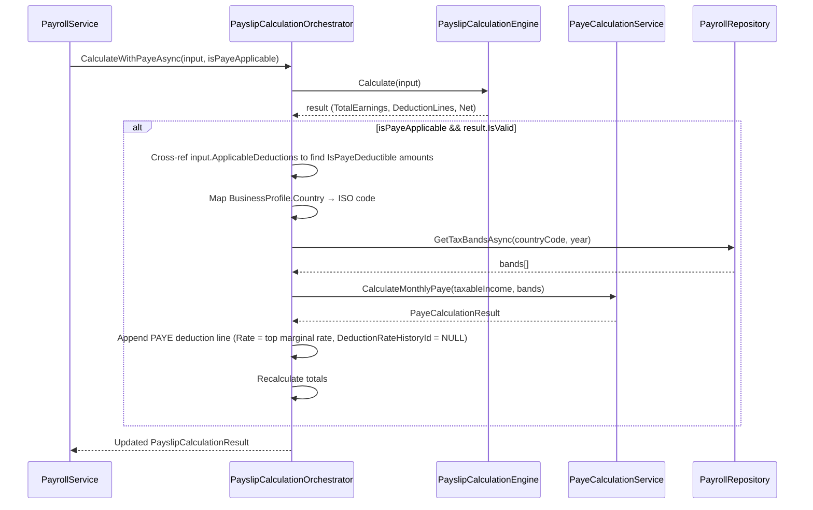

# Design Document: Payroll Phase D — Integration

## Overview

Phase D is the final integration layer of the Payroll module. It introduces PAYE income tax calculation using progressive tax bands (Cyprus 2024), integrates payroll data with the existing Business Applications Tracker (Compliance) module, provides an employer contribution breakdown report, and seeds country-specific deduction templates for multi-country expansion.

### Design Principles

1. **Extend, don't replace** — The existing `PayslipCalculationEngine` (Singleton, pure) remains unchanged. PAYE is computed in a new dedicated service, and its result is injected as a deduction line by the orchestration layer before net salary is finalised.
2. **Configuration over code** — Tax bands and country templates live in database tables, allowing new countries/rates without code deployments.
3. **Loose coupling** — Compliance integration occurs via a dedicated service that reads payslip data and writes to the Compliance module's `BusinessApplication` table through a well-defined interface.
4. **Audit trail** — Every compliance update is cross-referenced via a linking table preserving full history.

## Issue Resolutions Summary

| # | Issue | Resolution |
|---|-------|-----------|
| 1 | Deduction Code identification | Added `IsPayeDeductible` BIT flag to `DeductionType` and `CountryDeductionTemplate` tables. Orchestrator identifies PAYE-deductible deductions via this flag instead of matching Code strings. |
| 2 | ComputedDeductionLine has no Code property | Orchestrator cross-references `PayslipCalculationInput.ApplicableDeductions` (which contains `DeductionTypeWithHistory` with `Id`, `Code`, `IsPayeDeductible`) to identify PAYE-deductible amounts from the result's DeductionLines. |
| 3 | DueDate matching needs 1-month offset | Compliance integration uses `MONTH(DueDate) = @payrollMonth + 1` (with December wraparound to January of next year) since filing for July is due in August. |
| 4 | No country code on Business entity | Added static `CountryCodeMapping` dictionary in the orchestrator to map `BusinessProfile.Country` (e.g., "Cyprus") to ISO code (e.g., "CY") for PayeTaxBand lookup. |
| 5 | SaveEarningLinesAsync should also use orchestrator | Both `ConfirmBatchGenerationAsync` AND `SaveEarningLinesAsync` now use the orchestrator for PAYE calculation. |
| 6 | DeductionRateHistoryId = 0 violates FK | Made `PayslipDeductionLine.DeductionRateHistoryId` nullable (INT NULL). PAYE lines use NULL. |
| 7 | No navigation link to Contribution Report | Added sidebar navigation link to `/PayrollCompliance/ContributionReport` in the payroll section. |
| 8 | Tax band boundaries configurable per country | Confirmed: boundaries are fully configurable via `PayeTaxBand` table seed data per country. No code change needed. |
| 9 | Effective rate stored in database | PAYE deduction line `Rate` field stores the TOP MARGINAL RATE (highest band the employee falls into). Full band breakdown is reconstructable from the calculation result. |
| 10 | Compliance schema confirmed correct | No change needed. |

## Architecture

```mermaid
flowchart TD
    subgraph Calculation Flow
        A[PayslipCalculationEngine] -->|Existing: Earnings + SI/GESY| B[ComputedDeductionLines]
        B --> C[PayeCalculationService]
        C -->|PAYE deduction line| D[Final Payslip Result]
    end

    subgraph Compliance Integration
        E[PayslipPeriodStatusService] -->|On Finalise/Re-finalise| F[ComplianceIntegrationService]
        F --> G[BusinessApplication.EstimatedAmount]
        F --> H[PayslipPeriodComplianceFiling]
    end

    subgraph Template Management
        I[CountryTemplateService] --> J[CountryDeductionTemplate]
        I --> K[PayeTaxBand]
        L[SuperAdmin Controller] --> I
    end
```



### Calculation Order (Extended)

The existing engine computes deductions in the order they appear in `ApplicableDeductions`. Phase D introduces a two-pass approach:

1. **Pass 1 (Existing Engine)** — Computes all percentage-based deductions (SI, GESY, employer contributions) against TotalEarnings.
2. **Pass 2 (PAYE Service)** — Takes the Pass 1 result, identifies PAYE-deductible employee deductions (via `IsPayeDeductible` flag on the input's `ApplicableDeductions`), computes Taxable_Income = TotalEarnings - sum(PAYE-deductible amounts), applies progressive bands, returns monthly PAYE amount.
3. **Merge** — The orchestration layer appends the PAYE deduction line to the result and recalculates TotalEmployeeDeductions and NetSalary.

This preserves the purity of the existing engine while adding PAYE as a post-processing step.

> **Note (Issue 1 Resolution):** The orchestrator does NOT match deductions by Code string to determine which reduce the PAYE base. Instead, it uses the `IsPayeDeductible` BIT flag on `DeductionType`. This makes the system future-proof: if a new employee deduction should/shouldn't affect PAYE, just toggle the flag — no code changes needed.

## Components and Interfaces

### 1. PayeCalculationService

**Location:** `Portal.Infrastructure/Services/PayeCalculationService.cs`
**Registration:** Singleton (pure calculation, no I/O)

```csharp
public interface IPayeCalculationService
{
    PayeCalculationResult CalculateMonthlyPaye(decimal monthlyTaxableIncome, List<PayeTaxBand> bands);
}
```

**Input:** Monthly taxable income (TotalEarnings minus all PAYE-deductible employee deductions, identified via `IsPayeDeductible = 1` flag) and the applicable tax bands for the business's country/year.

**Output:**

```csharp
public class PayeCalculationResult
{
    public bool IsValid { get; set; } = true;
    public string? ValidationError { get; set; }
    public decimal AnnualProjectedIncome { get; set; }
    public decimal AnnualTax { get; set; }
    public decimal MonthlyPaye { get; set; }
    public decimal EffectiveRate { get; set; } // annual tax / annual projected income (blended)
    public decimal TopMarginalRate { get; set; } // highest band rate that applies to this income
    public List<PayeBandBreakdown> BandBreakdowns { get; set; } = new();
}

public class PayeBandBreakdown
{
    public decimal LowerBound { get; set; }
    public decimal? UpperBound { get; set; }
    public decimal Rate { get; set; }
    public decimal TaxableAmountInBand { get; set; }
    public decimal TaxForBand { get; set; }
}
```

**Algorithm:**
1. Compute `annualProjected = monthlyTaxableIncome * 12`
2. For each band ordered by LowerBound ascending:
   - Compute `bandWidth = (UpperBound ?? decimal.MaxValue) - LowerBound`
   - Compute `taxableInBand = Math.Min(Math.Max(annualProjected - LowerBound, 0), bandWidth)`
   - Compute `taxForBand = taxableInBand * Rate`
   - Accumulate into `annualTax`
   - If `taxableInBand > 0`, track this band's rate as `topMarginalRate`
3. Compute `monthlyPaye = Math.Round(annualTax / 12, 2, MidpointRounding.AwayFromZero)`
4. Compute `effectiveRate = annualProjected > 0 ? annualTax / annualProjected : 0`
5. Set `topMarginalRate` = the rate of the highest band where income falls (last band with taxableInBand > 0)

### 2. PayslipCalculationOrchestrator

**Location:** `Portal.Infrastructure/Services/PayslipCalculationOrchestrator.cs`
**Registration:** Scoped (needs repository access for tax bands)

This new service orchestrates the full calculation including PAYE:

```csharp
public interface IPayslipCalculationOrchestrator
{
    Task<PayslipCalculationResult> CalculateWithPayeAsync(PayslipCalculationInput input, bool isPayeApplicable);
}
```

**Flow:**
1. Call `_calculationEngine.Calculate(input)` — existing pure engine
2. If `!isPayeApplicable` or result is invalid, return as-is
3. Extract PAYE-deductible employee deduction amounts from result: build a lookup map from `input.ApplicableDeductions` (each `DeductionTypeWithHistory` has `Id`, `Code`, `IsPayeDeductible`). Sum `CalculatedAmount` from result's `DeductionLines` where the corresponding DeductionType has `IsPayeDeductible = 1 AND DeductionCategoryTypeId = 1`.
4. Compute `taxableIncome = result.TotalEarnings - payeDeductibleTotal`
5. Load tax bands from repository for the business's country and period year. Map `BusinessProfile.Country` → ISO code via static `CountryCodeMapping` dictionary (e.g., `{ "Cyprus" → "CY", "Malta" → "MT", "United Kingdom" → "GB" }`)
6. Call `_payeService.CalculateMonthlyPaye(taxableIncome, bands)`
7. If PAYE result is invalid, return validation error
8. Append PAYE `ComputedDeductionLine` to result:
   - `DeductionTypeId` = PAYE deduction type ID (loaded from DB)
   - `BaseAmount` = monthly taxable income
   - `Rate` = top marginal rate (the highest band rate that applies to this employee's income)
   - `CalculatedAmount` = monthly PAYE
   - `DeductionCategoryTypeId` = 1 (employee deduction)
   - `DeductionRateHistoryId` = NULL (PAYE uses bands, not rate history — column is nullable)
9. Recalculate `TotalEmployeeDeductions` and `NetSalary`
10. Return updated result

### 3. ComplianceIntegrationService

**Location:** `Portal.Infrastructure/Services/ComplianceIntegrationService.cs`
**Registration:** Scoped

```csharp
public interface IComplianceIntegrationService
{
    Task<ServiceResult> UpdateComplianceFilingFromPayrollAsync(
        int periodId, int businessId, string userId);
}
```

**Flow:**
1. Load all finalised payslips for the period
2. Sum employer SI contribution lines (Code = "SI_Contribution", DeductionCategoryTypeId = 2)
3. Find matching `BusinessApplication` where:
   - `BusinessId` = businessId
   - `ApplicationTypeId` corresponds to "Social Insurance" filing type
   - `DueDate` YEAR and MONTH match the payslip period + 1 month offset (filing for July is due in August). For December payrolls, look for DueDate in January of the following year (month=1, year+1).
4. If no matching filing found: log warning, return success (non-blocking)
5. Update `BusinessApplication.EstimatedAmount` with the calculated total
6. Create/update `PayslipPeriodComplianceFiling` cross-reference record
7. Return success

### 4. CountryTemplateService

**Location:** `Portal.Infrastructure/Services/CountryTemplateService.cs`
**Registration:** Scoped

```csharp
public interface ICountryTemplateService
{
    Task<List<CountryDeductionTemplateDto>> GetTemplatesByCountryAsync(string countryCode);
    Task<ServiceResult> CreateTemplateAsync(CreateCountryTemplateRequest request);
    Task<ServiceResult> UpdateTemplateAsync(UpdateCountryTemplateRequest request);
    Task<ServiceResult> DeactivateTemplateAsync(int templateId);
    Task<List<PayeTaxBandDto>> GetTaxBandsAsync(string countryCode, int? year);
    Task<ServiceResult> CreateTaxBandAsync(CreateTaxBandRequest request);
    Task<ServiceResult> UpdateTaxBandAsync(UpdateTaxBandRequest request);
    Task<ServiceResult> ImportCountryTemplatesForBusinessAsync(int businessId, string countryCode);
}
```

**`ImportCountryTemplatesForBusinessAsync` flow:**
1. Load active templates for the country
2. Check if business already has deduction types with matching codes — if duplicates found, return warning
3. For each template: create a `DeductionType` record (scoped to business) with `IsPayeDeductible` propagated from the template, and a `DeductionRateHistory` entry with `DefaultRate`
4. Create a PAYE `DeductionType` (Code: "PAYE", IsPercentage: false, DeductionCategoryTypeId: 1, IsPayeDeductible: 0) if not already present
5. Return success with count of imported templates

### 5. PayrollComplianceController (new)

**Location:** `Portal.Web/Controllers/PayrollComplianceController.cs`
**Registration:** Standard MVC controller

```csharp
[Authorize]
[ModuleAccess(PortalModules.Payroll)]
public class PayrollComplianceController : Controller
```

**Actions:**
- `ContributionReport(int? year, int? month)` — Page action for employer contribution report
- `AxGetContributionReportData(int periodId)` — AJAX: returns contribution breakdown data
- `AxGetDownloadContributionReportExcel(int periodId)` — AJAX: generates XLSX export
- `AxGetDownloadContributionReportPdf(int periodId)` — AJAX: generates PDF export

**Navigation:** Add a "Contribution Report" link in the payroll sidebar (same section as "Earnings Breakdown" and "Period Summary" from Phase C). Link: `/PayrollCompliance/ContributionReport`.

### 6. PayrollTemplateController (new, SuperAdmin only)

**Location:** `Portal.Web/Controllers/PayrollTemplateController.cs`

```csharp
[Authorize(Roles = "SuperAdmin")]
public class PayrollTemplateController : Controller
```

**Actions:**
- `Index()` — Page: list all country templates grouped by country
- `TaxBands(string countryCode)` — Page: list tax bands for a country
- `AxPostCreateTemplate(CreateCountryTemplateRequest request)` — AJAX: create template
- `AxPostUpdateTemplate(UpdateCountryTemplateRequest request)` — AJAX: update template
- `AxPostDeactivateTemplate(int id)` — AJAX: deactivate template
- `AxPostCreateTaxBand(CreateTaxBandRequest request)` — AJAX: create tax band
- `AxPostUpdateTaxBand(UpdateTaxBandRequest request)` — AJAX: update tax band

## Data Models

### Database Schema

#### New Table: `[payroll].[PayeTaxBand]`

```sql
USE [Portal]
GO

CREATE TABLE [payroll].[PayeTaxBand] (
    [Id]                INT IDENTITY(1,1) NOT NULL,
    [CountryCode]       NVARCHAR(3) NOT NULL,
    [LowerBound]        DECIMAL(18,2) NOT NULL,
    [UpperBound]        DECIMAL(18,2) NULL,  -- NULL = top band (no upper limit)
    [Rate]              DECIMAL(5,4) NOT NULL,  -- 0.0000 to 1.0000
    [EffectiveFromYear] INT NOT NULL,
    [EffectiveToYear]   INT NULL,  -- NULL = currently active
    [CreatedAtUtc]      DATETIME NOT NULL DEFAULT GETUTCDATE(),
    CONSTRAINT [PK_PayeTaxBand] PRIMARY KEY CLUSTERED ([Id]),
    CONSTRAINT [CK_PayeTaxBand_Rate] CHECK ([Rate] >= 0 AND [Rate] <= 1),
    CONSTRAINT [CK_PayeTaxBand_Bounds] CHECK ([UpperBound] IS NULL OR [LowerBound] < [UpperBound])
);
GO

CREATE NONCLUSTERED INDEX [IX_PayeTaxBand_Country_Year]
ON [payroll].[PayeTaxBand] ([CountryCode], [EffectiveFromYear])
INCLUDE ([LowerBound], [UpperBound], [Rate], [EffectiveToYear]);
GO
```

#### New Table: `[payroll].[CountryDeductionTemplate]`

```sql
CREATE TABLE [payroll].[CountryDeductionTemplate] (
    [Id]                        INT IDENTITY(1,1) NOT NULL,
    [CountryCode]               NVARCHAR(3) NOT NULL,
    [DeductionName]             NVARCHAR(100) NOT NULL,
    [Code]                      NVARCHAR(50) NOT NULL,
    [IsPercentage]              BIT NOT NULL DEFAULT 1,
    [DeductionCategoryTypeId]   TINYINT NOT NULL,
    [DefaultRate]               DECIMAL(5,4) NOT NULL,
    [IsPayeDeductible]          BIT NOT NULL DEFAULT 0,
    [SortOrder]                 INT NOT NULL DEFAULT 0,
    [IsActive]                  BIT NOT NULL DEFAULT 1,
    [CreatedAtUtc]              DATETIME NOT NULL DEFAULT GETUTCDATE(),
    CONSTRAINT [PK_CountryDeductionTemplate] PRIMARY KEY CLUSTERED ([Id]),
    CONSTRAINT [FK_CountryDeductionTemplate_Category] FOREIGN KEY ([DeductionCategoryTypeId])
        REFERENCES [payroll].[DeductionCategoryType]([Id])
);
GO

CREATE NONCLUSTERED INDEX [IX_CountryDeductionTemplate_Country]
ON [payroll].[CountryDeductionTemplate] ([CountryCode], [IsActive])
INCLUDE ([DeductionName], [Code], [DefaultRate], [SortOrder]);
GO
```

#### New Table: `[payroll].[PayslipPeriodComplianceFiling]`

```sql
CREATE TABLE [payroll].[PayslipPeriodComplianceFiling] (
    [Id]                    INT IDENTITY(1,1) NOT NULL,
    [PayslipPeriodId]       INT NOT NULL,
    [ComplianceFilingId]    INT NOT NULL,
    [ContributionTotal]     DECIMAL(18,2) NOT NULL,
    [UpdatedAtUtc]          DATETIME NOT NULL,
    [UpdatedByUserId]       NVARCHAR(450) NOT NULL,
    [CreatedAtUtc]          DATETIME NOT NULL DEFAULT GETUTCDATE(),
    CONSTRAINT [PK_PayslipPeriodComplianceFiling] PRIMARY KEY CLUSTERED ([Id]),
    CONSTRAINT [FK_PayslipPeriodCF_Period] FOREIGN KEY ([PayslipPeriodId])
        REFERENCES [payroll].[PayslipPeriod]([Id]),
    CONSTRAINT [FK_PayslipPeriodCF_Filing] FOREIGN KEY ([ComplianceFilingId])
        REFERENCES [compliance].[BusinessApplication]([Id])
);
GO

CREATE NONCLUSTERED INDEX [IX_PayslipPeriodCF_Period]
ON [payroll].[PayslipPeriodComplianceFiling] ([PayslipPeriodId])
INCLUDE ([ComplianceFilingId], [ContributionTotal], [UpdatedAtUtc]);
GO
```

#### Schema Modification: `[payroll].[Employee]`

```sql
ALTER TABLE [payroll].[Employee]
ADD [IsPayeApplicable] BIT NOT NULL DEFAULT 0;
GO
```

#### Schema Modification: `[payroll].[DeductionType]` — IsPayeDeductible flag

```sql
ALTER TABLE [payroll].[DeductionType]
ADD [IsPayeDeductible] BIT NOT NULL DEFAULT 0;
GO

-- Mark SI and GESY employee deductions as PAYE-deductible
-- (reduces PAYE taxable income when present)
UPDATE [payroll].[DeductionType]
SET [IsPayeDeductible] = 1
WHERE [Code] IN ('SI_Deduction', 'GESY_Deduction')
  AND [DeductionCategoryTypeId] = 1;
GO
```

> **Note (Issue 1):** The `IsPayeDeductible` flag indicates whether a deduction should be subtracted from gross earnings before PAYE calculation. This replaces hard-coded Code matching. Future employee deductions that should/shouldn't affect PAYE can be toggled via this flag without code changes.

#### Schema Modification: `[payroll].[PayslipDeductionLine]` — Nullable DeductionRateHistoryId

```sql
ALTER TABLE [payroll].[PayslipDeductionLine]
ALTER COLUMN [DeductionRateHistoryId] INT NULL;
GO
```

> **Note (Issue 6):** PAYE deduction lines do not use rate history (they use progressive bands). Making `DeductionRateHistoryId` nullable avoids FK constraint violations. PAYE lines will have `DeductionRateHistoryId = NULL`.

> **Note (Issue 8):** Tax band boundaries are fully configurable per country via the `PayeTaxBand` table. The precision (e.g., €19,500.01 vs €19,501.00) is determined by the seed data for each country and can be adjusted by SuperAdmin without code changes.

> **Note (Issue 9):** The PAYE deduction line's `Rate` field stores the TOP MARGINAL RATE (the highest band rate that applies to this employee's income, e.g., 30%), not the blended effective rate. This is clearer for display purposes: "PAYE 30%" is more meaningful than "PAYE 15.4%". The full band breakdown is computed at calculation time and can be reconstructed by re-running the calculation.

### EF Core Entities

#### PayeTaxBand Entity

```csharp
namespace Portal.Infrastructure.Entities;

public class PayeTaxBand
{
    public int Id { get; set; }
    public string CountryCode { get; set; } = string.Empty;
    public decimal LowerBound { get; set; }
    public decimal? UpperBound { get; set; }
    public decimal Rate { get; set; }
    public int EffectiveFromYear { get; set; }
    public int? EffectiveToYear { get; set; }
    public DateTime CreatedAtUtc { get; set; }
}
```

#### CountryDeductionTemplate Entity

```csharp
namespace Portal.Infrastructure.Entities;

public class CountryDeductionTemplate
{
    public int Id { get; set; }
    public string CountryCode { get; set; } = string.Empty;
    public string DeductionName { get; set; } = string.Empty;
    public string Code { get; set; } = string.Empty;
    public bool IsPercentage { get; set; } = true;
    public byte DeductionCategoryTypeId { get; set; }
    public decimal DefaultRate { get; set; }
    public bool IsPayeDeductible { get; set; }
    public int SortOrder { get; set; }
    public bool IsActive { get; set; } = true;
    public DateTime CreatedAtUtc { get; set; }
}
```

#### PayslipPeriodComplianceFiling Entity

```csharp
namespace Portal.Infrastructure.Entities;

public class PayslipPeriodComplianceFiling
{
    public int Id { get; set; }
    public int PayslipPeriodId { get; set; }
    public int ComplianceFilingId { get; set; }
    public decimal ContributionTotal { get; set; }
    public DateTime UpdatedAtUtc { get; set; }
    public string UpdatedByUserId { get; set; } = string.Empty;
    public DateTime CreatedAtUtc { get; set; }
}
```

#### Employee Entity Modification

Add to existing `Employee.cs`:

```csharp
public bool IsPayeApplicable { get; set; }
```

### DTOs and Request Models

```csharp
// PAYE DTOs
public class PayeTaxBandDto
{
    public int Id { get; set; }
    public string CountryCode { get; set; } = string.Empty;
    public decimal LowerBound { get; set; }
    public decimal? UpperBound { get; set; }
    public decimal Rate { get; set; }
    public int EffectiveFromYear { get; set; }
    public int? EffectiveToYear { get; set; }
}

// Country Template DTOs
public class CountryDeductionTemplateDto
{
    public int Id { get; set; }
    public string CountryCode { get; set; } = string.Empty;
    public string DeductionName { get; set; } = string.Empty;
    public string Code { get; set; } = string.Empty;
    public bool IsPercentage { get; set; }
    public byte DeductionCategoryTypeId { get; set; }
    public decimal DefaultRate { get; set; }
    public bool IsPayeDeductible { get; set; }
    public int SortOrder { get; set; }
    public bool IsActive { get; set; }
}

// Contribution Report DTOs
public class ContributionReportDto
{
    public int PeriodId { get; set; }
    public int Year { get; set; }
    public int Month { get; set; }
    public string MonthName { get; set; } = string.Empty;
    public List<ContributionTypeSummary> TypeSummaries { get; set; } = new();
    public List<EmployeeContributionDetail> EmployeeDetails { get; set; } = new();
    public decimal GrandTotal { get; set; }
    public ComplianceFilingLinkDto? ComplianceFilingLink { get; set; }
}

public class ContributionTypeSummary
{
    public string DeductionTypeName { get; set; } = string.Empty;
    public string Code { get; set; } = string.Empty;
    public decimal TotalAmount { get; set; }
}

public class EmployeeContributionDetail
{
    public int EmployeeId { get; set; }
    public string EmployeeName { get; set; } = string.Empty;
    public List<ContributionLineItem> Contributions { get; set; } = new();
    public decimal EmployeeTotal { get; set; }
}

public class ContributionLineItem
{
    public string DeductionTypeName { get; set; } = string.Empty;
    public decimal Amount { get; set; }
}

public class ComplianceFilingLinkDto
{
    public int FilingId { get; set; }
    public string Status { get; set; } = string.Empty;
    public decimal? EstimatedAmount { get; set; }
}

// Compliance Cross-Reference DTO
public class PayslipPeriodComplianceFilingDto
{
    public int Id { get; set; }
    public int ComplianceFilingId { get; set; }
    public decimal ContributionTotal { get; set; }
    public DateTime UpdatedAtUtc { get; set; }
    public string UpdatedByUserName { get; set; } = string.Empty;
}

// Request Models
public class CreateCountryTemplateRequest
{
    public string CountryCode { get; set; } = string.Empty;
    public string DeductionName { get; set; } = string.Empty;
    public string Code { get; set; } = string.Empty;
    public bool IsPercentage { get; set; } = true;
    public byte DeductionCategoryTypeId { get; set; }
    public decimal DefaultRate { get; set; }
    public bool IsPayeDeductible { get; set; }
    public int SortOrder { get; set; }
}

public class UpdateCountryTemplateRequest
{
    public int Id { get; set; }
    public string DeductionName { get; set; } = string.Empty;
    public decimal DefaultRate { get; set; }
    public int SortOrder { get; set; }
}

public class CreateTaxBandRequest
{
    public string CountryCode { get; set; } = string.Empty;
    public decimal LowerBound { get; set; }
    public decimal? UpperBound { get; set; }
    public decimal Rate { get; set; }
    public int EffectiveFromYear { get; set; }
    public int? EffectiveToYear { get; set; }
}

public class UpdateTaxBandRequest
{
    public int Id { get; set; }
    public decimal LowerBound { get; set; }
    public decimal? UpperBound { get; set; }
    public decimal Rate { get; set; }
    public int EffectiveFromYear { get; set; }
    public int? EffectiveToYear { get; set; }
}
```

### Seed Data

#### Cyprus PAYE Tax Bands (2024)

```sql
INSERT INTO [payroll].[PayeTaxBand] ([CountryCode], [LowerBound], [UpperBound], [Rate], [EffectiveFromYear], [EffectiveToYear])
VALUES
    ('CY', 0.00,     19500.00, 0.0000, 2024, NULL),
    ('CY', 19500.01, 28000.00, 0.2000, 2024, NULL),
    ('CY', 28000.01, 36300.00, 0.2500, 2024, NULL),
    ('CY', 36300.01, 60000.00, 0.3000, 2024, NULL),
    ('CY', 60000.01, NULL,     0.3500, 2024, NULL);
GO
```

#### Cyprus Country Deduction Templates

```sql
INSERT INTO [payroll].[CountryDeductionTemplate]
    ([CountryCode], [DeductionName], [Code], [IsPercentage], [DeductionCategoryTypeId], [DefaultRate], [IsPayeDeductible], [SortOrder])
VALUES
    ('CY', 'Social Insurance (Employee)',  'SI_Deduction',       1, 1, 0.0880, 1, 1),
    ('CY', 'GESY (Employee)',              'GESY_Deduction',     1, 1, 0.0265, 1, 2),
    ('CY', 'Social Insurance (Employer)',  'SI_Contribution',    1, 2, 0.0880, 0, 3),
    ('CY', 'Redundancy Fund',             'Redundancy',         1, 2, 0.0120, 0, 4),
    ('CY', 'Industrial Training',         'IndustrialTraining', 1, 2, 0.0050, 0, 5),
    ('CY', 'Social Cohesion',             'SocialCohesion',     1, 2, 0.0200, 0, 6),
    ('CY', 'GESY (Employer)',             'GESY_Contribution',  1, 2, 0.0290, 0, 7);
GO
```

**Note on IsPayeDeductible:** SI_Deduction and GESY_Deduction have `IsPayeDeductible = 1` — these are subtracted from gross before computing the PAYE taxable base. All other deductions (employer contributions) have `IsPayeDeductible = 0`.

**Note on Rate format:** The `CountryDeductionTemplate.DefaultRate` stores rates as decimals (0.0880 = 8.80%) to align with the `PayeTaxBand.Rate` format. However, the existing `DeductionRateHistory.Rate` stores rates as percentage values (8.80 = 8.80%). The `ImportCountryTemplatesForBusinessAsync` method must convert: `historyRate = template.DefaultRate * 100`.

## Integration Points

### Calculation Engine Modification

The existing `PayslipCalculationEngine` is NOT modified. Instead, the `PayslipCalculationOrchestrator` wraps it:



### Compliance Integration Hook

The compliance update is triggered during period finalisation/re-finalisation. The existing `PayslipPeriodStatusService` is extended with an event hook:

```csharp
// In PayslipPeriodStatusService — after successful status transition to Finalised/ReFinalised:
if (targetStatusId == Finalised || targetStatusId == ReFinalised)
{
    await _complianceIntegrationService.UpdateComplianceFilingFromPayrollAsync(periodId, businessId, userId);
}
```

### Compliance Filing Lookup

The system locates the correct filing by matching:
- `BusinessApplication.BusinessId` = current business
- `BusinessApplication.ApplicationTypeId` = Social Insurance filing type ID
- `DueDate` MONTH = payslip period month + 1 and YEAR = payslip period year (with December wraparound: if period month = 12, match MONTH = 1 and YEAR = period year + 1). This 1-month offset exists because filing for a given month is due the following month (e.g., July payroll → August filing DueDate).

### Employee PAYE Toggle Integration

When `ConfirmBatchGenerationAsync` runs (batch payslip generation), the orchestrator checks `Employee.IsPayeApplicable` to decide whether to include PAYE in the calculation for each employee.

### SaveEarningLinesAsync Integration

When `SaveEarningLinesAsync` runs (recalculation triggered by editing an employee's earning lines), it ALSO uses the orchestrator. This ensures PAYE is recalculated whenever earnings change. Both `ConfirmBatchGenerationAsync` AND `SaveEarningLinesAsync` call `await _orchestrator.CalculateWithPayeAsync(input, employee.IsPayeApplicable)` instead of the direct engine call.

## Repository Layer

### PayrollRepository Extensions

New methods added to the existing `PayrollRepository`:

```csharp
// PAYE Tax Bands
public async Task<List<PayeTaxBand>> GetTaxBandsAsync(string countryCode, int year)
public async Task<PayeTaxBand?> GetTaxBandByIdAsync(int id)
public async Task InsertTaxBandAsync(PayeTaxBand band)
public async Task<bool> UpdateTaxBandAsync(PayeTaxBand band)

// Country Templates
public async Task<List<CountryDeductionTemplate>> GetTemplatesByCountryAsync(string countryCode)
public async Task<CountryDeductionTemplate?> GetTemplateByIdAsync(int id)
public async Task InsertTemplateAsync(CountryDeductionTemplate template)
public async Task<bool> UpdateTemplateAsync(CountryDeductionTemplate template)
public async Task<bool> DeactivateTemplateAsync(int id)

// Compliance Cross-Reference
public async Task<List<PayslipPeriodComplianceFiling>> GetComplianceFilingsByPeriodAsync(int periodId)
public async Task InsertComplianceFilingLinkAsync(PayslipPeriodComplianceFiling link)

// Contribution Report
public async Task<List<ComputedDeductionLine>> GetEmployerContributionsForPeriodAsync(int periodId, int businessId)
public async Task<int?> GetPayeDeductionTypeIdForBusinessAsync(int businessId)

// Employee PAYE
public async Task<bool> UpdateEmployeePayeStatusAsync(int employeeId, int businessId, bool isPayeApplicable)

// PAYE-Deductible identification
public async Task<List<int>> GetPayeDeductibleDeductionTypeIdsForBusinessAsync(int businessId)
// Returns DeductionType IDs where IsPayeDeductible = 1 AND DeductionCategoryTypeId = 1 for this business
```

### ComplianceRepository Extensions

New methods needed in the existing compliance repository or a new helper:

```csharp
public async Task<BusinessApplication?> FindSocialInsuranceFilingAsync(int businessId, int year, int month)
// Note: Applies 1-month offset internally. For period month=7, looks for DueDate in month=8.
// For December (month=12), wraps to January of next year (month=1, year+1).
public async Task<bool> UpdateEstimatedAmountAsync(int filingId, decimal amount)
```

## Service Layer Details

### PayrollService Modifications

The existing `IPayrollService` gains:

```csharp
// Phase D: PAYE
Task<ServiceResult> UpdateEmployeePayeStatusAsync(int businessId, int employeeId, bool isPayeApplicable);
Task<decimal> GetProjectedAnnualIncomeAsync(int employeeId, int businessId);

// Phase D: Contribution Report
Task<ContributionReportDto> GetContributionReportAsync(int periodId, int businessId);
Task<byte[]> ExportContributionReportToExcelAsync(int periodId, int businessId);
Task<byte[]> GenerateContributionReportPdfAsync(int periodId, int businessId);

// Phase D: Compliance cross-reference display
Task<List<PayslipPeriodComplianceFilingDto>> GetComplianceFilingHistoryAsync(int periodId, int businessId);
```

### Batch Generation and SaveEarningLines Modification

Both `ConfirmBatchGenerationAsync` AND `SaveEarningLinesAsync` currently call `_calculationEngine.Calculate(input)`. Both are updated to:

```csharp
// Before (Phase A):
var result = _calculationEngine.Calculate(input);

// After (Phase D):
var result = await _orchestrator.CalculateWithPayeAsync(input, employee.IsPayeApplicable);
```

This ensures PAYE is recalculated whenever earnings change (batch generation or individual earning line save). When `IsPayeApplicable` is false, the orchestrator returns the same result as the original engine.

### Finalisation Hook

The existing `FinalisePeriodAsync` and `RefinalisePeriodAsync` methods are extended to call compliance integration after successful status transition:

```csharp
// After status update and audit log creation:
await _complianceIntegrationService.UpdateComplianceFilingFromPayrollAsync(periodId, businessId, userId);
```

## Controller Layer

### PayrollController Modifications

New AJAX endpoint for PAYE toggle:

```csharp
[HttpPost]
[ValidateAntiForgeryToken]
public async Task<IActionResult> AxPostToggleEmployeePaye(int employeeId, bool isPayeApplicable)
```

### PayrollComplianceController (New)

Full controller with page action + AJAX endpoints:

| HTTP | Action | Purpose |
|------|--------|---------|
| GET | `ContributionReport(int? year, int? month)` | Page: render report view |
| GET | `AxGetContributionReportData(int periodId)` | AJAX: JSON report data |
| GET | `AxGetDownloadContributionReportExcel(int periodId)` | AJAX: XLSX download |
| GET | `AxGetDownloadContributionReportPdf(int periodId)` | AJAX: PDF download |

### PayrollTemplateController (New, SuperAdmin)

| HTTP | Action | Purpose |
|------|--------|---------|
| GET | `Index()` | Page: list templates by country |
| GET | `TaxBands(string countryCode)` | Page: list tax bands |
| POST | `AxPostCreateTemplate(request)` | AJAX: create template |
| POST | `AxPostUpdateTemplate(request)` | AJAX: update template |
| POST | `AxPostDeactivateTemplate(int id)` | AJAX: deactivate |
| POST | `AxPostCreateTaxBand(request)` | AJAX: create band |
| POST | `AxPostUpdateTaxBand(request)` | AJAX: update band |

## View Layer

### Employee Profile — PAYE Toggle

Added to the existing Employee form view:

```html
<!-- PAYE Section -->
<div class="field" style="margin-top:18px;">
    <label class="toggle-label">
        <input type="checkbox" id="isPayeApplicable" />
        <span>Subject to PAYE Income Tax</span>
    </label>
    <p class="field-note">PAYE applies when projected annual income exceeds €19,500</p>
</div>
```

JavaScript handles the warning when enabling PAYE for employees below threshold.

### Contribution Report View

**Path:** `Portal.Web/Views/PayrollCompliance/ContributionReport.cshtml`

- Topbar: "Payroll", heading "Employer Contribution Report"
- Filter card: Period selector (year/month dropdowns), Filter/Clear buttons
- Summary card: One row per contribution type with total amount
- Detail card: Table with employee breakdown (Name, SI, Redundancy, Industrial Training, Social Cohesion, GESY, Total)
- Footer row: Grand total
- Compliance link: Status badge linking to filing if one exists
- Action buttons: "Export to Excel", "Download PDF"
- Empty state: "No finalised payslips for {Month Name} {Year}"

### Compliance Filing Detail Enhancement

The existing compliance filing detail view is extended to show:
- Source indicator: "Auto-calculated from Payroll — {Month Name} {Year}"
- Per-employee breakdown expandable section
- Manual override input with difference indicator

### SuperAdmin Template Management Views

**Path:** `Portal.Web/Views/PayrollTemplate/Index.cshtml` and `TaxBands.cshtml`

Simple CRUD interfaces with:
- Country tabs/dropdown
- Template list table (Name, Code, Category, Rate, Active status)
- Tax band table (Lower, Upper, Rate %, From Year, To Year)
- Add/Edit modals using SweetAlert2 forms
- Deactivate with confirmation dialog

## Error Handling

### PAYE Calculation Errors

| Scenario | Behaviour |
|----------|-----------|
| No tax bands for country/year | `PayeCalculationResult.IsValid = false`, validation error propagated to payslip |
| Tax bands have overlapping ranges | Data integrity enforced by CHECK constraints; service returns error if detected at runtime |
| Employee has no SI/GESY deductions | Taxable income = TotalEarnings (no deductions to subtract) |
| Negative taxable income | PAYE = €0 (cannot have negative tax) |

### Compliance Integration Errors

| Scenario | Behaviour |
|----------|-----------|
| No matching Social Insurance filing | Log warning via Serilog, continue without failing finalisation |
| Filing update fails (concurrency) | Log error, return `ServiceResult.Fail()`, period remains finalised |
| Cross-reference insert fails | Log error, filing update is still committed (non-critical audit record) |

### Template Management Errors

| Scenario | Behaviour |
|----------|-----------|
| Duplicate template import | Return warning with message, do not create duplicates |
| Deactivating template in use | Template deactivated; existing business deduction types unaffected (they are independent copies) |
| Invalid band data (LowerBound >= UpperBound) | Rejected by CHECK constraint, return validation error |

### Repository Pattern

All repository methods follow the existing pattern:

```csharp
try
{
    // Data access logic
}
catch (Exception ex)
{
    throw;
}
```

Controllers catch exceptions and return appropriate JSON responses:

```csharp
catch (Exception ex)
{
    return Json(new { success = false, message = "An unexpected error occurred." });
}
```

## Correctness Properties

*A property is a characteristic or behavior that should hold true across all valid executions of a system — essentially, a formal statement about what the system should do. Properties serve as the bridge between human-readable specifications and machine-verifiable correctness guarantees.*

### Property 1: Progressive Tax Band Calculation

*For any* monthly taxable income ≥ 0 and any valid set of non-overlapping tax bands ordered by LowerBound, the PAYE engine SHALL produce:
- A total annual tax equal to the sum of individual band taxes
- Each band's tax equal to `min(income_in_band, band_width) × rate`
- A monthly PAYE amount with exactly 2 decimal places
- A monthly PAYE = `Round(annual_tax / 12, 2, MidpointRounding.AwayFromZero)`

**Validates: Requirements 1.1, 1.4, 1.5, 1.6**

### Property 2: Taxable Income Equals Gross Minus PAYE-Deductible Amounts

*For any* payslip calculation where IsPayeApplicable is true, the PAYE deduction line's BaseAmount SHALL equal `TotalEarnings - sum(PAYE-deductible amounts)`, where PAYE-deductible amounts are the calculated deduction amounts from the existing engine for all DeductionTypes with `IsPayeDeductible = 1` and `DeductionCategoryTypeId = 1`.

**Validates: Requirements 1.3, 3.2, 3.6**

### Property 3: PAYE Skipped When Disabled

*For any* payslip calculation input where IsPayeApplicable is false, the orchestrator SHALL return a result with zero PAYE deduction lines (no line with PAYE DeductionType exists in the deduction lines collection).

**Validates: Requirements 2.3**

### Property 4: PAYE Line Included When Enabled

*For any* payslip calculation input where IsPayeApplicable is true and valid tax bands exist, the orchestrator SHALL return a result containing exactly one PAYE deduction line with DeductionCategoryTypeId = 1 and a non-negative CalculatedAmount.

**Validates: Requirements 3.1, 3.7**

### Property 5: Net Salary Invariant

*For any* valid payslip calculation result (with or without PAYE), the NetSalary SHALL equal `TotalEarnings - TotalEmployeeDeductions`, where TotalEmployeeDeductions is the sum of all deduction lines with DeductionCategoryTypeId = 1 (including PAYE if applicable).

**Validates: Requirements 3.3**

### Property 6: Compliance Sum Filters to SI Employer Only

*For any* set of finalised payslip deduction lines containing multiple employer contribution types (SI, Redundancy, Industrial Training, Social Cohesion, GESY), the compliance integration service SHALL compute a total that includes ONLY lines with Code "SI_Contribution" (DeductionCategoryTypeId = 2), excluding all other employer contribution types.

**Validates: Requirements 4.6**

## Testing Strategy

### Property-Based Testing (FsCheck + xUnit)

The project already uses FsCheck with xUnit (referenced in `Portal.Tests`). Property tests target the pure calculation logic:

- **Library:** FsCheck.Xunit (already in project)
- **Minimum iterations:** 100 per property
- **Tag format:** `Feature: payroll-phase-d, Property {N}: {title}`

Properties 1–5 target `PayeCalculationService` and `PayslipCalculationOrchestrator` (pure logic, in-memory, no DB access).
Property 6 targets `ComplianceIntegrationService` with mocked repository returning generated payslip data.

### Unit Tests (xUnit)

Example-based tests for specific boundary conditions:

| Test Case | Expected Result |
|-----------|-----------------|
| Monthly income €1,625 (annual €19,500) | PAYE = €0.00 |
| Monthly income €1,625.08 (annual €19,501) | PAYE = €0.02 |
| Monthly income €2,333.33 (annual €28,000) | PAYE = €141.67 |
| Monthly income €3,025 (annual €36,300) | PAYE = €347.92 |
| Monthly income €5,000 (annual €60,000) | PAYE = €660.42 |
| Monthly income €6,250 (annual €75,000) | PAYE = €1,098.33 |
| IsPayeApplicable = false | No PAYE line generated |
| No tax bands for year | Validation error returned |
| Zero earnings | PAYE = €0.00 |

### Integration Tests

- Compliance integration: verify filing amount updates on period finalisation
- Template import: verify deduction types and rate histories are created correctly
- Re-finalisation: verify compliance filing is updated with new amount and history is preserved
- Permission enforcement: verify unauthorised users are rejected

### Regression Tests

All existing Phase A/B/C tests must pass unchanged. The orchestrator returns identical results to the existing engine when `IsPayeApplicable` is false.
