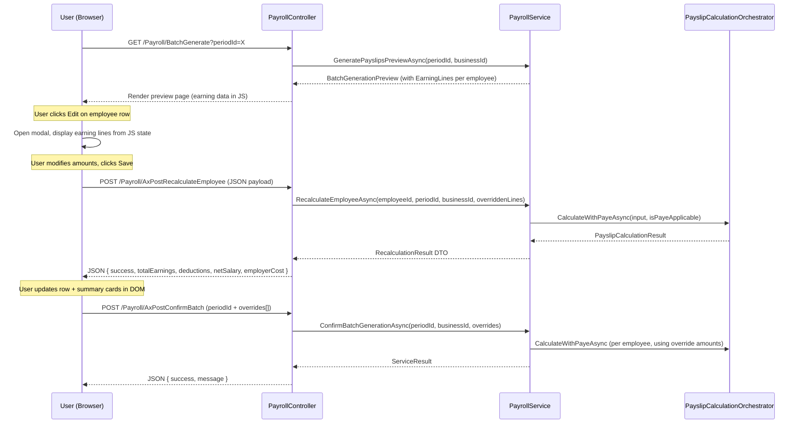
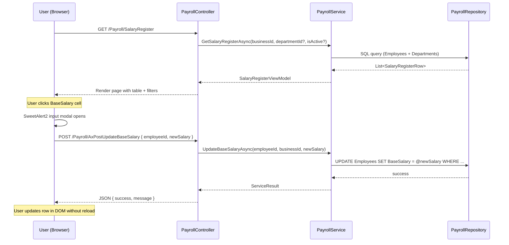

# Design Document: Payslip Earnings Override & Salary Register

## Overview

This design covers two Payroll enhancements within the existing Portal application:

1. **Editable Earnings at Batch Generate Preview** — Allows payroll managers to override individual employee earning lines on the preview page before confirming batch generation. Overrides trigger server-side recalculation via the existing `PayslipCalculationOrchestrator` and are ephemeral (per-session only).

2. **Salary Register Page** — A new page at `/Payroll/SalaryRegister` providing a tabular overview of all employees' salary data with department/status filtering and inline quick-edit of BaseSalary.

### Design Decisions

| Decision | Rationale |
|----------|-----------|
| Client-side override storage (JS object) | Overrides are session-scoped and never persisted. A JS `Map` keyed by employeeId avoids unnecessary server state. |
| Dedicated recalculation endpoint | Reuses the existing `PayslipCalculationOrchestrator.CalculateWithPayeAsync` to guarantee identical deduction/PAYE logic. |
| Override payload sent with confirm | `ConfirmBatchGenerationAsync` must accept overrides so it uses overridden amounts instead of re-loading defaults. |
| Salary Register as server-rendered page with AJAX filters | Matches the existing pattern (Employees, Periods pages) — initial load is server-rendered, filter changes use AJAX for snappy UX. |
| Quick-edit via SweetAlert2 input modal | Consistent with the project's BlockUI + SweetAlert2 pattern and avoids introducing new modal frameworks. |

---

## Architecture

### High-Level Flow — Editable Earnings



### High-Level Flow — Salary Register



---

## Components and Interfaces

### New Controller Endpoints

```csharp
// --- Editable Earnings ---
[HttpPost]
[ValidateAntiForgeryToken]
public async Task<IActionResult> AxPostRecalculateEmployee([FromBody] RecalculateEmployeeRequest request)

// Overloaded confirm that accepts overrides
[HttpPost]
[ValidateAntiForgeryToken]
public async Task<IActionResult> AxPostConfirmBatchWithOverrides([FromBody] ConfirmBatchWithOverridesRequest request)

// --- Salary Register ---
[HttpGet]
public async Task<IActionResult> SalaryRegister(int? departmentId, bool? isActive)

[HttpGet]
public async Task<IActionResult> AxGetSalaryRegisterData(int? departmentId, bool? isActive)

[HttpPost]
[ValidateAntiForgeryToken]
public async Task<IActionResult> AxPostUpdateBaseSalary([FromBody] UpdateBaseSalaryRequest request)
```

### New Service Methods (IPayrollService)

```csharp
Task<RecalculationResult> RecalculateEmployeeAsync(int employeeId, int periodId, int businessId, List<EarningLineOverride> overriddenLines);
Task<ServiceResult> ConfirmBatchGenerationWithOverridesAsync(int periodId, int businessId, List<EmployeeEarningsOverride> overrides);
Task<SalaryRegisterViewModel> GetSalaryRegisterAsync(int businessId, int? departmentId, bool? isActive);
Task<ServiceResult> UpdateBaseSalaryAsync(int employeeId, int businessId, decimal newSalary);
```

**Implementation note for `RecalculateEmployeeAsync`:** This method must fetch the full Employee record and applicable deductions (same setup as `GeneratePayslipsPreviewAsync`) to provide the orchestrator with employee-specific context (IsPayeApplicable, deduction rates for the period). The method also fetches the Period to determine the period date for rate history lookups.

**Implementation note for `ConfirmBatchGenerationWithOverridesAsync`:** Extract shared payslip creation logic from the existing `ConfirmBatchGenerationAsync` into a private helper to avoid code duplication.

### New Request/Response DTOs

```csharp
// --- Recalculate ---
public class RecalculateEmployeeRequest
{
    public int EmployeeId { get; set; }
    public int PeriodId { get; set; }
    public List<EarningLineOverride> EarningLines { get; set; } = new();
}

public class EarningLineOverride
{
    public int EarningTypeId { get; set; }
    public string? Description { get; set; }
    public decimal Amount { get; set; }
    public decimal? OvertimeMultiplier { get; set; }
    public decimal? OvertimeHours { get; set; }
}

public class RecalculationResult
{
    public bool Success { get; set; }
    public string? Error { get; set; }
    public decimal TotalEarnings { get; set; }
    public decimal TotalEmployeeDeductions { get; set; }
    public decimal NetSalary { get; set; }
    public decimal TotalEmployerContributions { get; set; }
}

// --- Confirm with Overrides ---
public class ConfirmBatchWithOverridesRequest
{
    public int PeriodId { get; set; }
    public List<EmployeeEarningsOverride> Overrides { get; set; } = new();
}

public class EmployeeEarningsOverride
{
    public int EmployeeId { get; set; }
    public List<EarningLineOverride> EarningLines { get; set; } = new();
}

// --- Salary Register ---
public class SalaryRegisterViewModel
{
    public List<SalaryRegisterRow> Employees { get; set; } = new();
    public List<DepartmentDto> Departments { get; set; } = new();
    public int? SelectedDepartmentId { get; set; }
    public bool? SelectedIsActive { get; set; }
    public int TotalEmployees { get; set; }
    public decimal TotalMonthlyPayroll { get; set; }
}

public class SalaryRegisterRow
{
    public int EmployeeId { get; set; }
    public string EmployeeName { get; set; } = string.Empty;
    public string? DepartmentName { get; set; }
    public string SalaryType { get; set; } = string.Empty; // "Monthly" or "Hourly"
    public decimal BaseSalary { get; set; }
    public decimal? HourlyRate { get; set; }
    public bool IsActive { get; set; }
}

// --- Update Base Salary ---
public class UpdateBaseSalaryRequest
{
    public int EmployeeId { get; set; }
    public decimal NewSalary { get; set; }
}
```

### Client-Side State Management (BatchGenerate.cshtml)

```javascript
// In-memory override store — keyed by employeeId
const earningsOverrides = new Map();

// Structure per entry:
// earningsOverrides.set(employeeId, {
//     earningLines: [ { earningTypeId, description, amount, overtimeMultiplier, overtimeHours } ],
//     result: { totalEarnings, totalEmployeeDeductions, netSalary, totalEmployerContributions }
// });

// Reset to Default: earningsOverrides.delete(employeeId) → recalculate with original lines
```

**Reset to Default behavior:** When the user clicks "Reset to Default" in the modal for a previously overridden employee, the override is removed from the Map and the row is recalculated using the original earning lines (fetched from the server-rendered initial data). The "modified" indicator is removed from the row.

---

## Data Models

### Existing Entities Used (no schema changes)

| Entity | Usage |
|--------|-------|
| `Employee` | Source of BaseSalary, HourlyRate, SalaryTypeId, DepartmentId, IsActive |
| `EmployeeDefaultEarnings` | Source of earning line breakdown per employee |
| `EarningType` | Lookup for earning type names/codes |
| `Department` | Lookup for department names |

### SalaryTypeId Mapping

| SalaryTypeId | Display |
|---|---|
| 1 | Monthly |
| 2 | Hourly |

### No New Database Tables Required

Both features operate on existing data:
- Earnings overrides are ephemeral (client-side + passed in AJAX calls)
- Salary Register reads existing Employee + Department data
- Quick-edit updates the existing `Employee.BaseSalary` column via `UpdateEmployeeAsync` in the repository

---


## Correctness Properties

*A property is a characteristic or behavior that should hold true across all valid executions of a system — essentially, a formal statement about what the system should do. Properties serve as the bridge between human-readable specifications and machine-verifiable correctness guarantees.*

### Property 1: Earning Line Validation Accepts Only Non-Negative Numerics

*For any* input value submitted as an earning line amount, the validation function SHALL accept it if and only if it is a finite numeric value greater than or equal to zero.

**Validates: Requirements 3.1, 3.2, 3.3, 3.4**

### Property 2: Recalculation Arithmetic Invariant

*For any* valid set of earning line amounts passed to the recalculation endpoint, the returned TotalEarnings SHALL equal the sum of all earning line amounts, and the returned NetSalary SHALL equal TotalEarnings minus TotalEmployeeDeductions.

**Validates: Requirements 4.1**

### Property 3: Calculation Engine Input-Source Agnosticism

*For any* valid set of earning lines, passing them to the calculation engine should produce identical results regardless of whether those lines originate from DefaultEarnings or from an earnings override — the engine's output is determined solely by its inputs.

**Validates: Requirements 8.2**

### Property 4: Override Does Not Mutate Permanent Data

*For any* employee and any set of earning line overrides applied and confirmed, the employee's BaseSalary and EmployeeDefaultEarnings records in the database SHALL remain identical to their values before the override operation.

**Validates: Requirements 5.2, 5.3**

### Property 5: Override State Correctly Reflected in UI

*For any* employee with an entry in the earningsOverrides Map, opening the edit modal SHALL display the overridden amounts (not the original defaults), and the corresponding table row SHALL carry the "modified" visual indicator class.

**Validates: Requirements 7.1, 1.4**

### Property 6: Summary Totals Equal Sum of Visible Employees

*For any* set of employee payslip previews (or salary register rows after filtering), the displayed Total Payroll Cost SHALL equal the sum of NetSalary across all visible employees, and Total Employer Contributions SHALL equal the sum of TotalEmployerContributions across all visible employees. For the Salary Register, TotalMonthlyPayroll SHALL equal the sum of BaseSalary for all filtered employees where SalaryTypeId = Monthly AND IsActive = true.

**Validates: Requirements 4.3, 9.5, 10.5**

### Property 7: Filter Correctness

*For any* department filter value and status filter value applied to the Salary Register, every employee in the returned result set SHALL have a DepartmentId matching the selected department (when not "All") and an IsActive value matching the selected status (when not "All").

**Validates: Requirements 10.2, 10.3**

### Property 8: Salary Register Ordering

*For any* set of employees returned by the Salary Register query, the result SHALL be ordered alphabetically by employee name in ascending order.

**Validates: Requirements 9.4**

### Property 9: Quick-Edit Salary Validation

*For any* input value submitted via the Quick Edit Salary modal, the validation function SHALL accept it if and only if it is a finite numeric value strictly greater than zero.

**Validates: Requirements 11.2**

### Property 10: Quick-Edit Salary Persistence

*For any* valid positive salary value confirmed through the Quick Edit Salary modal, querying the employee's BaseSalary after the operation SHALL return that exact value.

**Validates: Requirements 11.3**

---

## Error Handling

### Editable Earnings

| Scenario | Handling |
|----------|----------|
| Recalculation AJAX fails (network/server) | `BlockUI.hide()` → `Swal.fire({ icon: 'error' })` — row values remain unchanged |
| Recalculation returns invalid result (engine error) | Display error in SweetAlert2, keep previous row values |
| User enters invalid amount (negative/non-numeric) | Inline validation error below the field, Save button disabled |
| Confirm batch fails with overrides | SweetAlert2 error, user stays on preview page |
| Employee no longer active between preview and confirm | Server validates employee existence; returns error in ServiceResult |

### Salary Register

| Scenario | Handling |
|----------|----------|
| Quick-edit AJAX fails | `BlockUI.hide()` → `Swal.fire({ icon: 'error' })` — row value unchanged |
| Quick-edit with invalid value (≤ 0, non-numeric) | SweetAlert2 `inputValidator` rejects before submission |
| Employee not found (concurrent deletion) | Server returns `{ success: false, message: "Employee not found." }` |
| Page load with no employees | Empty state message within the `.glass.card-pad` section |

### Standard Error Pattern (all AJAX endpoints)

```csharp
catch (Exception ex)
{
    return Json(new { success = false, message = "An unexpected error occurred." });
}
```

---

## Testing Strategy

### Unit Tests (Example-Based)

| Area | Tests |
|------|-------|
| Modal rendering | Verify modal displays correct earning lines for employees with/without defaults |
| Cancel behavior | Verify cancel discards unsaved changes |
| Confirm payload | Verify overrides are correctly serialized and sent with confirm request |
| Filter defaults | Verify initial page load defaults to Active + All Departments |
| Sidebar position | Verify "Salary Register" nav item appears between "Employees" and "Periods" |
| Error responses | Verify error states show SweetAlert2 and preserve row data |

### Property-Based Tests (FsCheck + xUnit)

The project already uses FsCheck (present in build output). Each property test runs a minimum of 100 iterations.

| Property | Test Focus |
|----------|-----------|
| Property 1 | Generate random strings/numbers, verify validation accepts only numeric ≥ 0 |
| Property 2 | Generate random earning line amounts, verify TotalEarnings = sum and Net = Earnings - Deductions |
| Property 3 | Generate random earning lines, run engine with same inputs via two code paths, verify identical output |
| Property 4 | Generate random overrides, run confirm, verify BaseSalary and DefaultEarnings unchanged |
| Property 6 | Generate random employee sets with varying amounts, verify summary = sum of visible |
| Property 7 | Generate random employees with departments/statuses, apply filter, verify all results match |
| Property 8 | Generate random employee names, verify result is sorted ascending |
| Property 9 | Generate random values, verify validation accepts only positive numbers |
| Property 10 | Generate random positive decimals, run update, verify stored value matches |

### Property Test Configuration

- **Library**: FsCheck.Xunit (already in project)
- **Minimum iterations**: 100 per property
- **Tag format**: `// Feature: payslip-earnings-override, Property {N}: {title}`

### Integration Tests

| Scenario | Scope |
|----------|-------|
| Recalculation endpoint round-trip | POST with valid earning lines → verify response shape and calculation correctness |
| Confirm with overrides | POST confirm with overrides → verify payslip records use override amounts |
| Salary Register page load | GET /Payroll/SalaryRegister → verify 200 response with correct HTML structure |
| Quick-edit endpoint | POST update → verify database reflects new BaseSalary |
