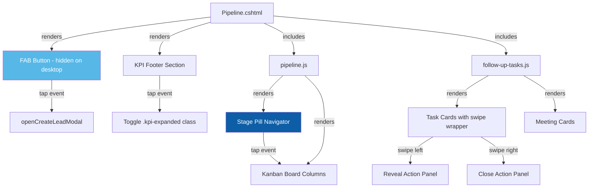
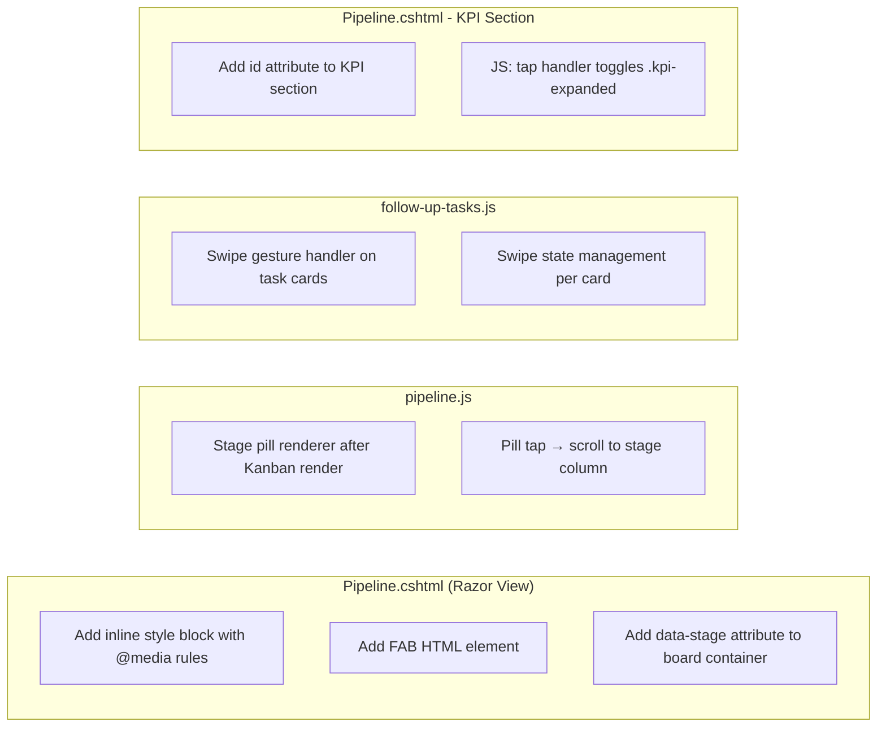

# Design Document: Pipeline Mobile Responsive

## Overview

This design introduces a mobile-responsive layer for the `/Sales/Pipeline` page, transforming it into a native-app-like experience on viewports ≤ 768px. All changes are CSS and JavaScript only — no server-side modifications, no new endpoints, no database changes.

The approach uses a combination of:
1. **CSS `@media (max-width: 768px)` rules** scoped in a `<style>` block within `Pipeline.cshtml`
2. **JavaScript enhancements** in `pipeline.js` for touch gestures, FAB behavior, stage pill navigation, and KPI expand/collapse

### Design Decisions

| Decision | Rationale |
|----------|-----------|
| Inline `<style>` block in Pipeline.cshtml with `@media` queries | Keeps mobile styles co-located with the view; no separate CSS file to manage or cache-bust independently. The styles are page-specific and relatively small (~150 lines). |
| Swipe gesture handler in pipeline.js via `touchstart`/`touchmove`/`touchend` | No external gesture library needed — the interaction is simple (horizontal translate with threshold). Keeps bundle size unchanged. |
| FAB as HTML element in the Razor view, visibility via media query | Pure CSS show/hide avoids JS viewport-detection race conditions. The FAB links to the existing `openCreateLeadModal()` function. |
| Stage pill navigator rendered by JS alongside Kanban board | Pills need dynamic stage data (names, colours) which is only available after the AJAX call returns. Rendering in JS keeps them synchronized with the Kanban columns. |
| KPI expand/collapse via JS class toggle | A single `.kpi-expanded` class on the footer section switches between compact 2×2 grid and full-size layout. Minimal JS, CSS handles the transition. |
| 44px minimum touch targets as CSS overrides | Meets WCAG 2.5.8 (Target Size) at Level AAA for mobile. Applied uniformly to buttons, dropdowns, and links within the `@media` block. |
| 40px swipe threshold before activation | Prevents accidental swipe triggers during vertical scrolling. Standard threshold used by native iOS/Android list interactions. |

---

## Architecture

### Component Interaction (Mobile Viewport)



### Change Scope



---

## Components and Interfaces

### 1. Inline `<style>` Block (Pipeline.cshtml)

Added within the `@section Scripts` or before the topbar. Contains all `@media (max-width: 768px)` rules.

**Key CSS rules:**

```css
@media (max-width: 768px) {
    /* Topbar */
    .topbar { flex-direction: column; align-items: flex-start; gap: 12px; }
    .topbar-heading { font-size: 28px; }
    .topbar .btn-primary[onclick*="openCreateLeadModal"] { display: none; }

    /* Filter Panel — scoped to #pipelineFilters to avoid affecting modals */
    #pipelineFilters .field { min-width: 100% !important; }
    #pipelineFilters select,
    #pipelineFilters .btn { min-height: 44px; width: 100%; }

    /* Task Cards */
    .task-card-action { flex-wrap: wrap; position: relative; overflow: hidden; }
    .task-card-action > div:last-child { 
        width: 100%; justify-content: flex-start; margin-top: 8px; flex-wrap: wrap; 
    }
    .task-card-action .btn { min-width: 44px; min-height: 44px; }

    /* Kanban Board */
    .pipeline-board { scroll-snap-type: x mandatory; -webkit-overflow-scrolling: touch; }
    .pipeline-column { scroll-snap-align: start; min-width: 85vw !important; }

    /* Stage Pill Navigator */
    .stage-pill-nav { display: flex; }

    /* Meeting Cards */
    #upcomingMeetingsList > a > div { flex-direction: column; align-items: flex-start; }
    #upcomingMeetingsList > a > div > div:last-child { align-items: flex-start; flex-direction: row; gap: 8px; }

    /* KPI Footer */
    .kpi-footer { display: grid; grid-template-columns: 1fr 1fr; gap: 8px; cursor: pointer; }
    .kpi-footer .kpi-value { font-size: 20px; }
    .kpi-footer .kpi-label { font-size: 10px; }
    .kpi-footer.kpi-expanded .kpi-value { font-size: 28px; }
    .kpi-footer.kpi-expanded .kpi-label { font-size: 12px; }

    /* FAB */
    .pipeline-fab { display: flex; }

    /* Touch targets & spacing */
    .btn, a.btn, select, button { min-height: 44px; min-width: 44px; }
    .glass.card-pad { padding: 16px; }
    .task-card-action .btn + .btn { margin-left: 8px; }

    /* Content padding */
    body > .content-area { padding-left: 16px; padding-right: 16px; }
}

/* Desktop: hide mobile-only elements */
.stage-pill-nav { display: none; }
.pipeline-fab { display: none; }
```

### 2. FAB HTML Element (Pipeline.cshtml)

Placed at the end of the view, before the `@section Scripts` block:

```html
<!-- Floating Action Button — Mobile only -->
<button class="pipeline-fab" onclick="openCreateLeadModal()" aria-label="Create new lead">
    <svg width="24" height="24" fill="none" stroke="#fff" stroke-width="2.5" viewBox="0 0 24 24">
        <line x1="12" y1="5" x2="12" y2="19"/><line x1="5" y1="12" x2="19" y2="12"/>
    </svg>
</button>
```

**CSS for FAB:**
```css
.pipeline-fab {
    display: none; /* shown via @media */
    position: fixed;
    bottom: calc(24px + env(safe-area-inset-bottom, 0px));
    right: 24px;
    width: 56px;
    height: 56px;
    border-radius: 50%;
    background: #0D5EA6;
    color: #fff;
    border: none;
    box-shadow: 0 4px 16px rgba(13, 94, 166, 0.35);
    align-items: center;
    justify-content: center;
    cursor: pointer;
    z-index: 900;
    transition: transform 0.15s, box-shadow 0.15s;
}
.pipeline-fab:active {
    transform: scale(0.92);
    box-shadow: 0 2px 8px rgba(13, 94, 166, 0.25);
}
```

### 3. Stage Pill Navigator (pipeline.js)

Rendered dynamically after `renderKanban()` completes:

```javascript
function renderStagePillNav(stages) {
    var existing = document.getElementById('stagePillNav');
    if (existing) existing.remove();

    var nav = document.createElement('div');
    nav.id = 'stagePillNav';
    nav.className = 'stage-pill-nav';

    stages.forEach(function (stage, index) {
        var pill = document.createElement('button');
        pill.className = 'stage-pill';
        pill.textContent = stage.stageName;
        pill.style.cssText = 'background:' + (stage.colour || '#8a9bab') + '18;color:' + (stage.colour || '#8a9bab') + ';border:1.5px solid ' + (stage.colour || '#8a9bab') + '30;';
        pill.setAttribute('aria-label', 'Scroll to ' + stage.stageName + ' stage');
        pill.onclick = function () { scrollToStage(index); };
        nav.appendChild(pill);
    });

    var board = document.getElementById('pipelineBoard');
    board.parentNode.insertBefore(nav, board);
}

function scrollToStage(index) {
    var columns = document.querySelectorAll('.pipeline-column');
    if (columns[index]) {
        columns[index].scrollIntoView({ behavior: 'smooth', block: 'nearest', inline: 'start' });
    }
}
```

**CSS for pills:**
```css
.stage-pill-nav {
    display: none; /* shown via @media */
    gap: 8px;
    overflow-x: auto;
    padding: 8px 0 12px 0;
    -webkit-overflow-scrolling: touch;
}
.stage-pill {
    flex-shrink: 0;
    padding: 6px 14px;
    border-radius: 20px;
    font-size: 12px;
    font-weight: 700;
    cursor: pointer;
    white-space: nowrap;
    min-height: 44px;
    display: flex;
    align-items: center;
}
```

### 4. Swipe Gesture Handler (follow-up-tasks.js)

Adds touch event listeners to task cards for swipe-to-reveal actions:

```javascript
function initSwipeGesture(cardElement) {
    if (window.innerWidth > 768) return; // desktop — no swipe
    if (!('ontouchstart' in window)) return; // no touch support

    var startX = 0;
    var currentX = 0;
    var isSwiping = false;
    var threshold = 40; // minimum px before activation
    var revealWidth = 140; // width of action panel

    // Add CSS transition for smooth snap animation
    cardElement.style.transition = 'transform 0.2s ease';

    cardElement.addEventListener('touchstart', function (e) {
        startX = e.touches[0].clientX;
        currentX = startX;
        isSwiping = true;
        // Remove transition during drag for responsive feel
        cardElement.style.transition = 'none';
    }, { passive: true });

    cardElement.addEventListener('touchmove', function (e) {
        if (!isSwiping) return;
        currentX = e.touches[0].clientX;
        var deltaX = startX - currentX;

        if (Math.abs(deltaX) > threshold) {
            var translate = Math.min(deltaX, revealWidth);
            if (translate > 0) {
                cardElement.style.transform = 'translateX(-' + translate + 'px)';
            }
        }
    }, { passive: true });

    cardElement.addEventListener('touchend', function () {
        isSwiping = false;
        // Restore transition for snap animation
        cardElement.style.transition = 'transform 0.2s ease';
        var deltaX = startX - currentX;

        if (deltaX > threshold) {
            // Close any other revealed cards first
            document.querySelectorAll('.swipe-revealed').forEach(function (other) {
                if (other !== cardElement) {
                    other.style.transform = 'translateX(0)';
                    other.classList.remove('swipe-revealed');
                }
            });
            // Snap open
            cardElement.style.transform = 'translateX(-' + revealWidth + 'px)';
            cardElement.classList.add('swipe-revealed');
        } else {
            // Snap closed
            cardElement.style.transform = 'translateX(0)';
            cardElement.classList.remove('swipe-revealed');
        }
    });
}
```

The swipe reveals a hidden action panel (Complete + Snooze) positioned absolutely behind the card.

### 5. KPI Expand/Collapse (pipeline.js)

```javascript
function initKpiToggle() {
    var kpiSection = document.getElementById('kpiFooterSection');
    if (!kpiSection) return;

    kpiSection.addEventListener('click', function () {
        if (window.innerWidth > 768) return; // only on mobile
        kpiSection.classList.toggle('kpi-expanded');
    });
}
```

### 6. Task Card Mobile Layout Adaptation (follow-up-tasks.js)

The `renderTaskCard()` function already outputs a flex container with action buttons at the end. The CSS `@media` rules handle the layout change:
- Action buttons wrap to a new row below the title
- Unprocessed and Complete buttons become icon-only (text hidden via CSS, icons shown)
- Title gets `text-overflow: ellipsis` with `overflow: hidden`

```css
@media (max-width: 768px) {
    .task-card-action {
        flex-wrap: wrap;
        padding: 12px 16px;
        position: relative;
    }
    .task-card-action > div:last-child {
        width: 100%;
        margin-top: 10px;
        gap: 8px;
    }
    .task-card-action > div:nth-child(3) > div:first-child {
        white-space: nowrap;
        overflow: hidden;
        text-overflow: ellipsis;
        max-width: calc(100vw - 100px);
    }
}
```

---

## Data Models

No new data models are required. All mobile responsive changes operate on existing data structures:

| Existing Data | Usage in Mobile |
|---------------|-----------------|
| `stages[]` from `AxGetPipelineData` | Stage names and colours used for pill navigator rendering |
| Task objects from `AxGetTodaysActions` | Same card data, different layout via CSS |
| Meeting objects from `AxGetUpcomingMeetingsBrief` | Same card data, full-width vertical layout via CSS |
| KPI values (computed in `updatePipelineKpis`) | Same values, compact/expanded display via CSS class toggle |

No schema changes. No new server-side endpoints.

---

## Error Handling

| Scenario | Handling |
|----------|----------|
| Swipe gesture fails (touch events not supported) | Feature detection: only attach listeners if `'ontouchstart' in window`. Desktop users unaffected. |
| Stage pill nav rendered with zero stages | If `stages.length === 0`, skip pill nav rendering entirely. |
| FAB clicked but Create Lead modal data not loaded | `openCreateLeadModal()` already handles this — modal shows with whatever data is available (the lookups load on DOMContentLoaded). |
| KPI section not found in DOM | `initKpiToggle()` returns early if `getElementById` returns null. |
| Viewport resize from mobile to desktop mid-session | CSS `@media` handles layout reflow automatically. JS checks `window.innerWidth` on gesture init, but swipe handlers remain passive and harmless on desktop-width viewports. |
| Swipe conflicts with vertical scroll | 40px horizontal threshold ensures vertical scrolling is not intercepted. `passive: true` on touch listeners preserves browser scroll performance. |

---

## Testing Strategy

### Why Property-Based Testing Does Not Apply

This feature consists entirely of:
- **CSS media queries** (layout/styling rules)
- **DOM manipulation** (show/hide elements, class toggling)
- **Touch gesture handling** (browser event listeners)

There are no pure functions with meaningful input variation, no data transformations, no serialization, and no business logic. PBT requires universally quantified properties over input spaces — CSS and DOM interactions don't have that characteristic. The correct testing approach is visual/manual testing combined with example-based automated tests.

### Unit Tests (Example-Based)

| Area | Test |
|------|------|
| Stage pill rendering | Verify `renderStagePillNav()` creates one button per stage with correct colour and text |
| Pill click scrolls to column | Verify `scrollToStage(index)` calls `scrollIntoView` on the correct `.pipeline-column` |
| KPI toggle class | Verify clicking KPI section adds/removes `.kpi-expanded` class |
| Swipe threshold | Verify swipe of < 40px does NOT reveal the action panel |
| Swipe activation | Verify swipe of ≥ 40px reveals the action panel (translateX applied) |
| Swipe close | Verify swipe right on revealed card returns to `translateX(0)` |
| FAB visibility | Verify `.pipeline-fab` has `display:none` at viewport > 768px |
| Desktop no-swipe | Verify swipe handler does not attach when `window.innerWidth > 768` |

### Visual/Manual Testing

| Scenario | Verification |
|----------|-------------|
| Task card layout at 375px (iPhone SE) | Buttons below title, no overflow, 44px tap targets |
| Task card layout at 768px | Buttons inline (desktop layout preserved) |
| Kanban board horizontal scroll | Single column visible, snap-scrolls between stages |
| Stage pills scroll to correct column | Tap each pill, verify board scrolls to matching column |
| FAB visible on mobile, hidden on desktop | Resize viewport, confirm show/hide at 768px breakpoint |
| KPI compact → expanded | Tap KPI footer, values grow to full size |
| Filter dropdowns full-width | All dropdowns and buttons stack vertically at 100% width |
| Meeting cards full-width | Cards stack vertically with no horizontal overflow |
| Topbar heading 28px | Measure font-size, confirm view toggle buttons stack below title |
| Swipe left reveals Complete + Snooze | Swipe 40px+ on task card, action panel slides in |
| No accidental swipe on vertical scroll | Scroll page vertically, confirm no horizontal card movement |

### Integration Tests

| Scenario | Scope |
|----------|-------|
| Pipeline page loads on mobile UA | GET /Sales/Pipeline with mobile User-Agent → verify 200, FAB element present in HTML |
| Stage pill nav rendered after data load | Load page, wait for AJAX completion → verify `#stagePillNav` contains correct number of buttons |
| Swipe + Complete action | Swipe card → tap Complete → verify task is marked complete via existing endpoint |

### Browser/Device Coverage

| Device | Viewport | Priority |
|--------|----------|----------|
| iPhone SE | 375×667 | High |
| iPhone 14 Pro | 393×852 | High |
| Samsung Galaxy S23 | 360×780 | High |
| iPad Mini (portrait) | 744×1133 | Medium (below 768px breakpoint) |
| Desktop Chrome | 1440×900 | High (regression — verify no changes) |

