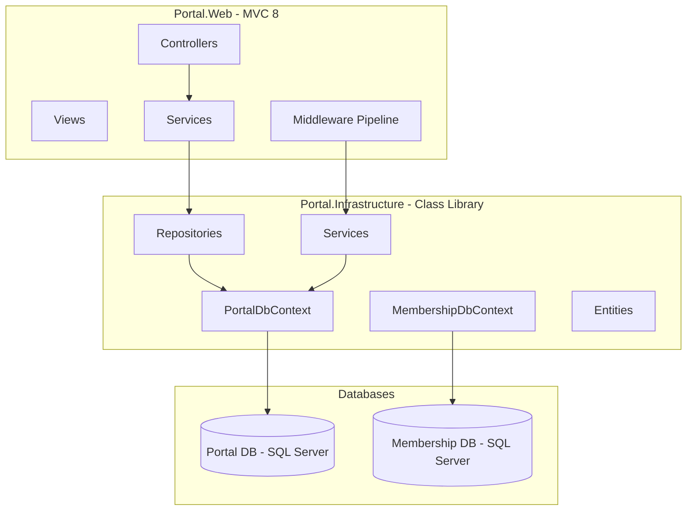

# Design Document: Platform Foundation

## Overview

Platform Foundation (Module 0) establishes the core infrastructure for the Portal multi-tenant back-office platform. It delivers the ASP.NET Core MVC 8 web project (`Portal.Web`), dependency injection wiring, dual-database configuration (Portal + Membership), invitation-only authentication, shared layout, structured logging, the generic repository base class, and business administration screens.

All subsequent modules (Quotation Platform, Invoicing, Revenue Control) depend on this foundation being operational. The design prioritises convention consistency, tenant isolation, and security-by-default.

## Architecture



### Project References

```
Portal.Web (net8.0, MVC)
  └── Portal.Infrastructure (net8.0, Class Library)
        ├── Data/ (PortalDbContext, MembershipDbContext)
        ├── Entities/ (EF Core entities)
        ├── Repositories/ (GenericStoredProcedureRepository + derived)
        └── Services/ (ICurrentTenantService, IBusinessService, IEmailService)
```

### Middleware Pipeline Order

```csharp
// Program.cs pipeline configuration order
app.UseStaticFiles();
app.UseSerilogRequestLogging();
app.UseRouting();
app.UseAuthentication();
app.UseAuthorization();
app.MapControllerRoute(...);
```

## Components and Interfaces

### Portal.Web Components

| Component | Responsibility |
|-----------|---------------|
| `Program.cs` | Host builder, DI registration, middleware pipeline |
| `BusinessClaimsPrincipalFactory` | Custom `IUserClaimsPrincipalFactory<ApplicationUser>` that injects BusinessId claim on sign-in |
| `InvitationController` | Handles invitation creation (SuperAdmin) and registration (invited user) |
| `BusinessController` | CRUD operations for Business and BusinessProfile (SuperAdmin) |
| `AccountController` | Login, logout, access denied |
| `_Layout.cshtml` | Shared layout with sidebar + topbar |

### Portal.Infrastructure Components

| Component | Responsibility |
|-----------|---------------|
| `PortalDbContext` | EF Core context for Portal DB with global query filters (already exists) |
| `MembershipDbContext` | EF Core context for Membership DB (Identity tables + Invitation) |
| `ApplicationUser` | Identity user entity extended with `BusinessId` foreign key |
| `Invitation` | Entity representing a pending invitation token |
| `GenericStoredProcedureRepository<T>` | Base class with `ExecuteStoredProcedure` and `ExecuteSingleRecordStoredProcedure` |
| `BusinessRepository` | Repository for Business CRUD operations |
| `IBusinessService` / `BusinessService` | Business logic for tenant administration |
| `IEmailService` | Interface for sending invitation emails (implementation deferred) |
| `ICurrentTenantService` / `CurrentTenantService` | Resolves BusinessId from claims (already exists) |

### Key Interfaces

```csharp
// Portal.Infrastructure/Services/IBusinessService.cs
public interface IBusinessService
{
    Task<List<Business>> GetAllBusinessesAsync();
    Task<Business?> GetBusinessByIdAsync(int id);
    Task<Business> CreateBusinessAsync(string name);
    Task UpdateBusinessAsync(Business business);
    Task DeactivateBusinessAsync(int id);
    Task<bool> IsBusinessNameUniqueAsync(string name, int? excludeId = null);
    Task<BusinessProfile?> GetBusinessProfileAsync(int businessId);
    Task SaveBusinessProfileAsync(BusinessProfile profile);
}

// Portal.Infrastructure/Services/IEmailService.cs
public interface IEmailService
{
    Task SendInvitationEmailAsync(string toEmail, string invitationLink, string businessName);
}

// Portal.Infrastructure/Services/IInvitationService.cs
public interface IInvitationService
{
    Task<Invitation> CreateInvitationAsync(string email, int businessId, string createdByUserId);
    Task<Invitation?> ValidateTokenAsync(string token);
    Task MarkAsUsedAsync(int invitationId);
}
```

### BusinessClaimsPrincipalFactory

```csharp
// Portal.Web/Security/BusinessClaimsPrincipalFactory.cs
public class BusinessClaimsPrincipalFactory : UserClaimsPrincipalFactory<ApplicationUser, IdentityRole>
{
    public BusinessClaimsPrincipalFactory(
        UserManager<ApplicationUser> userManager,
        RoleManager<IdentityRole> roleManager,
        IOptions<IdentityOptions> options)
        : base(userManager, roleManager, options) { }

    protected override async Task<ClaimsIdentity> GenerateClaimsAsync(ApplicationUser user)
    {
        var identity = await base.GenerateClaimsAsync(user);

        if (user.BusinessId.HasValue)
        {
            identity.AddClaim(new Claim("BusinessId", user.BusinessId.Value.ToString()));
        }

        return identity;
    }
}
```

### GenericStoredProcedureRepository

```csharp
// Portal.Infrastructure/Repositories/GenericStoredProcedureRepository.cs
public class GenericStoredProcedureRepository<T> where T : class
{
    protected readonly DbContext _context;

    public GenericStoredProcedureRepository(DbContext context)
    {
        _context = context;
    }

    protected async Task<List<T>> ExecuteStoredProcedure(string sqlQuery, params object[] parameters)
        => await _context.Set<T>().FromSqlRaw(sqlQuery, parameters).ToListAsync();

    protected async Task<T?> ExecuteSingleRecordStoredProcedure(string sqlQuery, params object[] parameters)
        => (await _context.Set<T>().FromSqlRaw(sqlQuery, parameters).ToListAsync()).FirstOrDefault();
}
```

## Data Models

### Membership Database Schema

The Membership database contains ASP.NET Core Identity tables plus custom extensions.

#### ApplicationUser (extends IdentityUser)

| Property | Type | Description |
|----------|------|-------------|
| Id | string | ASP.NET Identity primary key (GUID) |
| BusinessId | int? | FK to Portal.Business — nullable for SuperAdmin accounts |
| FirstName | string | User's first name |
| LastName | string | User's last name |
| IsActive | bool | Whether the user account is active |
| CreatedAtUtc | DateTime | Account creation timestamp |

```csharp
// Portal.Infrastructure/Entities/Identity/ApplicationUser.cs
public class ApplicationUser : IdentityUser
{
    public int? BusinessId { get; set; }
    public string FirstName { get; set; } = null!;
    public string LastName { get; set; } = null!;
    public bool IsActive { get; set; } = true;
    public DateTime CreatedAtUtc { get; set; } = DateTime.UtcNow;
}
```

#### Invitation

| Column | Type | Constraints | Description |
|--------|------|-------------|-------------|
| Id | int | PK, Identity | Auto-increment primary key |
| Email | nvarchar(256) | NOT NULL | Invited email address |
| BusinessId | int | NOT NULL | Target business for the invited user |
| Token | nvarchar(128) | NOT NULL, UNIQUE | Unique invitation token |
| CreatedAtUtc | datetime2 | NOT NULL | When the invitation was created |
| ExpiresAtUtc | datetime2 | NOT NULL | Token expiry (CreatedAtUtc + 72 hours) |
| IsUsed | bit | NOT NULL, DEFAULT 0 | Whether the invitation has been redeemed |
| CreatedByUserId | nvarchar(450) | NOT NULL | The SuperAdmin who created the invitation |

```csharp
// Portal.Infrastructure/Entities/Identity/Invitation.cs
public class Invitation
{
    public int Id { get; set; }
    public string Email { get; set; } = null!;
    public int BusinessId { get; set; }
    public string Token { get; set; } = null!;
    public DateTime CreatedAtUtc { get; set; }
    public DateTime ExpiresAtUtc { get; set; }
    public bool IsUsed { get; set; }
    public string CreatedByUserId { get; set; } = null!;
}
```

#### MembershipDbContext

```csharp
// Portal.Infrastructure/Data/MembershipDbContext.cs
public class MembershipDbContext : IdentityDbContext<ApplicationUser, IdentityRole, string>
{
    public MembershipDbContext(DbContextOptions<MembershipDbContext> options) : base(options) { }

    public DbSet<Invitation> Invitations { get; set; } = null!;

    protected override void OnModelCreating(ModelBuilder builder)
    {
        base.OnModelCreating(builder);

        builder.Entity<Invitation>(entity =>
        {
            entity.HasKey(e => e.Id);
            entity.HasIndex(e => e.Token).IsUnique();
            entity.HasIndex(e => e.Email);
            entity.Property(e => e.Email).HasMaxLength(256).IsRequired();
            entity.Property(e => e.Token).HasMaxLength(128).IsRequired();
            entity.Property(e => e.CreatedByUserId).HasMaxLength(450).IsRequired();
        });

        builder.Entity<ApplicationUser>(entity =>
        {
            entity.Property(e => e.FirstName).HasMaxLength(100).IsRequired();
            entity.Property(e => e.LastName).HasMaxLength(100).IsRequired();
        });
    }
}
```

### Existing Portal Database Entities (Reference)

The following entities already exist in `Portal.Infrastructure/Entities/`:

- **Business**: `Id`, `Name`, `IsActive`, `CreatedAtUtc`, `UpdatedAtUtc`
- **BusinessProfile**: `Id`, `BusinessId`, `CompanyRegistrationNumber`, `VatRegistrationNumber`, `VatRegistrationDate`, `VatPeriodLengthInMonths`, address fields, contact fields

### DI Registration Summary

```csharp
// Program.cs - Service Registration
builder.Services.AddDbContext<PortalDbContext>(options =>
    options.UseSqlServer(builder.Configuration.GetConnectionString("PortalDb")));

builder.Services.AddDbContext<MembershipDbContext>(options =>
    options.UseSqlServer(builder.Configuration.GetConnectionString("MembershipDb")));

builder.Services.AddIdentity<ApplicationUser, IdentityRole>(options =>
{
    options.Password.RequireDigit = true;
    options.Password.RequiredLength = 8;
    options.Password.RequireNonAlphanumeric = true;
    options.Password.RequireUppercase = true;
    options.Lockout.MaxFailedAccessAttempts = 5;
    options.Lockout.DefaultLockoutTimeSpan = TimeSpan.FromMinutes(15);
})
.AddEntityFrameworkStores<MembershipDbContext>()
.AddDefaultTokenProviders()
.AddClaimsPrincipalFactory<BusinessClaimsPrincipalFactory>();

builder.Services.AddHttpContextAccessor();
builder.Services.AddScoped<ICurrentTenantService, CurrentTenantService>();
builder.Services.AddScoped<IBusinessService, BusinessService>();
builder.Services.AddScoped<IInvitationService, InvitationService>();
builder.Services.AddScoped<IEmailService, StubEmailService>(); // Replace with real implementation later

builder.Services.ConfigureApplicationCookie(options =>
{
    options.LoginPath = "/Account/Login";
    options.AccessDeniedPath = "/Account/AccessDenied";
    options.ExpireTimeSpan = TimeSpan.FromHours(8);
    options.SlidingExpiration = true;
});
```

### Serilog Configuration

```csharp
// Program.cs - Serilog setup
builder.Host.UseSerilog((context, services, configuration) => configuration
    .ReadFrom.Configuration(context.Configuration)
    .Enrich.FromLogContext()
    .Enrich.WithProperty("Application", "Portal.Web")
    .Enrich.WithCorrelationId()
    .WriteTo.Console(outputTemplate: "[{Timestamp:HH:mm:ss} {Level:u3}] {Message:lj} {Properties:j}{NewLine}{Exception}")
    .WriteTo.File("logs/portal-.log",
        rollingInterval: RollingInterval.Day,
        outputTemplate: "{Timestamp:yyyy-MM-dd HH:mm:ss.fff zzz} [{Level:u3}] [{CorrelationId}] [{UserId}] [{BusinessId}] {Message:lj}{NewLine}{Exception}"));
```

### Layout Structure

```
_Layout.cshtml
├── <aside> Sidebar (fixed, 260px width)
│   ├── Logo / Brand
│   ├── Navigation Groups (by module)
│   │   ├── Platform (Dashboard, Businesses, Users)
│   │   ├── Quotations
│   │   ├── Invoicing
│   │   └── Revenue
│   └── Active state highlighting
├── <header> Topbar (sticky)
│   ├── Page title / breadcrumb
│   └── User context (name + business name + logout)
└── <main> Content area
    └── @RenderBody()
```


## Correctness Properties

*A property is a characteristic or behavior that should hold true across all valid executions of a system — essentially, a formal statement about what the system should do. Properties serve as the bridge between human-readable specifications and machine-verifiable correctness guarantees.*

### Property 1: Tenant resolution from claims

*For any* authenticated HTTP request where the user's claims principal contains a "BusinessId" claim with a valid integer value, the `ICurrentTenantService.CurrentBusinessId` property shall return that exact integer value.

**Validates: Requirements 3.3**

### Property 2: Password policy enforcement

*For any* password string, the Identity password validator shall accept it if and only if it contains at least 8 characters, at least one digit, at least one uppercase letter, and at least one non-alphanumeric character. All other passwords shall be rejected.

**Validates: Requirements 4.3**

### Property 3: Invitation creation produces unique token with correct expiry

*For any* valid email address and BusinessId, creating an invitation shall produce a token that is unique across all existing invitations, and the `ExpiresAtUtc` shall equal `CreatedAtUtc` plus exactly 72 hours.

**Validates: Requirements 5.1, 5.2**

### Property 4: Registration with valid token creates correctly associated user

*For any* valid (non-expired, unused) invitation token and valid registration data, completing registration shall create a user account whose `BusinessId` matches the invitation's `BusinessId`.

**Validates: Requirements 5.4**

### Property 5: Expired or invalid tokens are rejected

*For any* invitation token that is expired (current time > ExpiresAtUtc) or has already been used (IsUsed = true) or does not exist, the token validation shall return null/failure and registration shall be prevented.

**Validates: Requirements 5.5**

### Property 6: SuperAdmin role required for admin endpoints

*For any* authenticated user who does not have the "SuperAdmin" role, requests to invitation creation endpoints and business administration endpoints shall return a 403 Forbidden response.

**Validates: Requirements 5.7, 10.7**

### Property 7: BusinessId claim injection on authentication

*For any* `ApplicationUser` with a non-null `BusinessId`, the `BusinessClaimsPrincipalFactory` shall produce a `ClaimsPrincipal` containing a "BusinessId" claim whose value equals the user's `BusinessId` as a string.

**Validates: Requirements 6.1**

### Property 8: Login denied for users without BusinessId

*For any* `ApplicationUser` whose `BusinessId` is null (and who is not a SuperAdmin), the login process shall deny authentication and not produce a valid session.

**Validates: Requirements 6.3**

### Property 9: Topbar displays user and business context

*For any* authenticated user with an associated Business, the rendered topbar shall contain the user's display name and the Business name.

**Validates: Requirements 7.5**

### Property 10: Log enrichment with request context

*For any* log entry produced during an authenticated HTTP request, the structured log output shall contain properties for CorrelationId, UserId, and BusinessId.

**Validates: Requirements 8.2**

### Property 11: Exception logging with full context

*For any* unhandled exception occurring during request processing, the system shall produce a log entry containing the exception message, full stack trace, and request context (CorrelationId, UserId, BusinessId).

**Validates: Requirements 8.4**

### Property 12: Business creation sets IsActive to true

*For any* valid business name submitted through the creation flow, the resulting Business record shall have `IsActive` set to `true` and `CreatedAtUtc` set to the current UTC time.

**Validates: Requirements 10.2**

### Property 13: BusinessProfile save round-trip

*For any* valid BusinessProfile data (company registration, VAT details, address, contact info), saving and then retrieving the profile for the same BusinessId shall return equivalent field values.

**Validates: Requirements 10.3**

### Property 14: Business deactivation sets IsActive to false

*For any* active Business (IsActive = true), invoking the deactivation operation shall result in the Business record having `IsActive` set to `false`.

**Validates: Requirements 10.4**

### Property 15: Business name uniqueness enforcement

*For any* two Business records in the system, their `Name` values shall be distinct (case-insensitive). Attempting to create or update a Business with a name that already exists shall be rejected.

**Validates: Requirements 10.5**

### Property 16: VatPeriodLengthInMonths validation

*For any* integer value, saving a BusinessProfile shall succeed if and only if `VatPeriodLengthInMonths` is one of {1, 2, 3, 4, 6, 12}. All other values shall be rejected.

**Validates: Requirements 10.6**

## Error Handling

### Strategy by Layer

| Layer | Approach | Example |
|-------|----------|---------|
| Repository | `try/catch` with `throw;` — never swallow exceptions | `catch (Exception) { throw; }` |
| Service | Catch specific exceptions, wrap in domain-meaningful results | Return `Result<T>` or throw domain exceptions |
| Controller | Catch, log via Serilog, return appropriate HTTP response | 500 for unhandled, 400 for validation, 403 for auth |
| Middleware | Global exception handler logs and returns generic error page | `app.UseExceptionHandler("/Error")` |

### Specific Error Scenarios

| Scenario | Handling |
|----------|----------|
| Invalid invitation token | Return validation error, display "Invalid or expired invitation" |
| Duplicate business name | Return validation error, display "Business name already exists" |
| Invalid VatPeriodLengthInMonths | Return validation error, display allowed values |
| User without BusinessId attempts login | Deny sign-in, display "Account not linked to a business" |
| Database connection failure | Log critical error, return 500 with generic error page |
| Expired invitation token | Return validation error, display "Invitation has expired" |
| Duplicate email registration | Return validation error, display "Account already exists" |

### Global Exception Handling

```csharp
// Middleware pipeline
app.UseExceptionHandler("/Home/Error");
app.UseStatusCodePagesWithReExecute("/Home/StatusCode/{0}");
```

All unhandled exceptions are caught by the global exception handler, logged with full context via Serilog, and a user-friendly error page is displayed.

## Testing Strategy

### Dual Testing Approach

This feature requires both unit tests and property-based tests for comprehensive coverage.

### Property-Based Testing

**Library**: [FsCheck.Xunit](https://github.com/fscheck/FsCheck) (v2.16+) with xUnit integration

**Configuration**:
- Minimum 100 iterations per property test
- Each test tagged with: `Feature: platform-foundation, Property {number}: {property_text}`
- Custom generators for domain types (email addresses, business names, invitation tokens)

**Properties to implement**:
| Property | Test Focus |
|----------|-----------|
| 1 | CurrentTenantService resolves BusinessId from any valid claim |
| 2 | Password validator accepts/rejects based on policy rules |
| 3 | Invitation service produces unique tokens with 72h expiry |
| 4 | Registration creates user with correct BusinessId association |
| 5 | Token validation rejects expired/used/invalid tokens |
| 6 | Non-SuperAdmin users get 403 on admin endpoints |
| 7 | BusinessClaimsPrincipalFactory injects correct BusinessId claim |
| 8 | Null-BusinessId users are denied login |
| 9 | Topbar renders user name and business name |
| 10 | Log entries contain CorrelationId, UserId, BusinessId |
| 11 | Unhandled exceptions produce enriched log entries |
| 12 | Business creation always sets IsActive = true |
| 13 | BusinessProfile save/load round-trip preserves all fields |
| 14 | Deactivation sets IsActive = false |
| 15 | Duplicate business names are rejected |
| 16 | VatPeriodLengthInMonths only accepts {1,2,3,4,6,12} |

### Unit Testing

**Framework**: xUnit with Moq for mocking

**Focus areas**:
- Specific examples for invitation flow (happy path, expired token, used token)
- Integration tests for DI container resolution (PortalDbContext, MembershipDbContext scoping)
- Edge cases: empty email, null BusinessId, concurrent invitation creation
- Controller authorization attribute verification
- Layout rendering with specific user/business combinations

### Test Project Structure

```
tests/
  Portal.Web.Tests/
    Properties/        (Property-based tests)
    Unit/              (Unit tests)
    Integration/       (DI and middleware tests)
```

### Key Testing Decisions

1. **FsCheck over manual randomization** — provides shrinking, reproducibility, and statistical coverage
2. **In-memory database for repository tests** — EF Core InMemory provider for fast isolated tests
3. **TestServer for controller/middleware tests** — `WebApplicationFactory<Program>` for integration scenarios
4. **Custom Arbitraries** — generators for `ApplicationUser`, `Invitation`, `Business`, `BusinessProfile` with valid constraints
