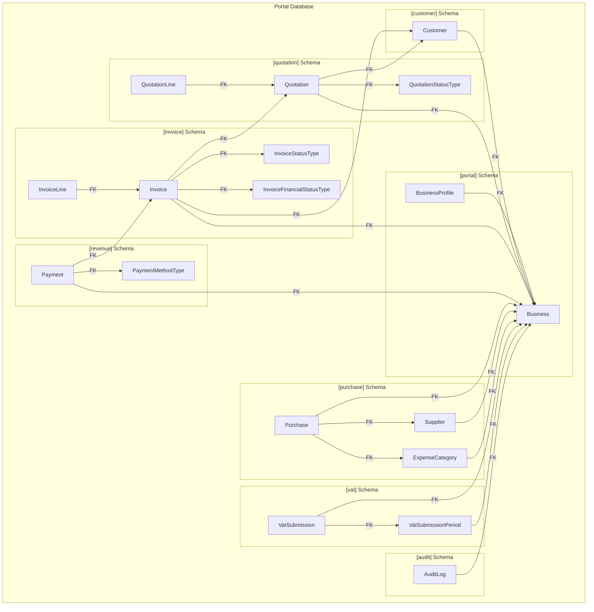
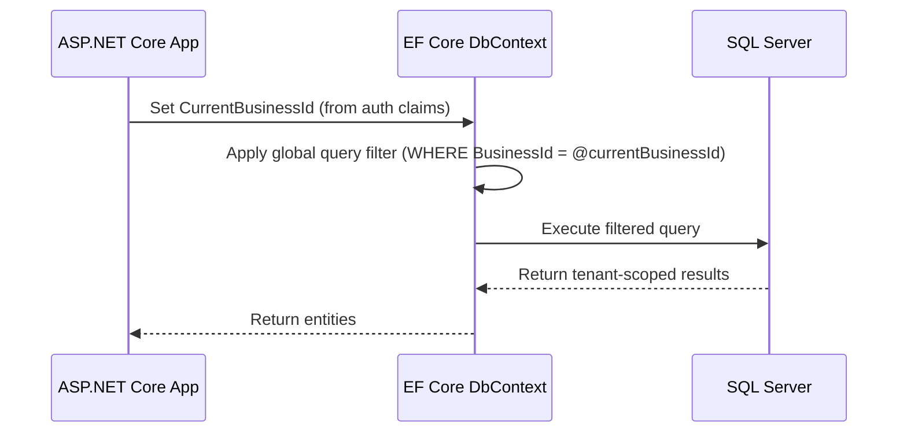

# Design Document: Portal Database Schema

## Overview

This design defines the complete SQL Server database schema for the 3 Inventors Portal — a multi-tenant back-office operational platform. The schema spans 8 SQL Server schemas (`portal`, `customer`, `quotation`, `invoice`, `revenue`, `purchase`, `vat`, `audit`) within a single database, using a shared `BusinessId` column on all data tables for tenant isolation.

The database follows a Database-First approach with EF Core scaffolding. Tenant boundaries are enforced at the application layer via EF Core global query filters on `BusinessId`. Reference/lookup tables are shared across tenants and do not carry a `BusinessId` column.

### Key Design Decisions

1. **Single database, multiple schemas** — Simplifies deployment and cross-module queries while maintaining logical separation and permission boundaries.
2. **BusinessId on all data tables** — Enables EF Core global query filters for tenant isolation without requiring separate databases per tenant.
3. **Reference tables without BusinessId** — `QuotationStatusType`, `InvoiceStatusType`, `InvoiceFinancialStatusType`, and `PaymentMethodType` are system-wide lookup tables shared across all tenants.
4. **Non-clustered indexes on BusinessId** — Every tenant-scoped table gets a non-clustered index on `BusinessId` to optimise filtered queries.
5. **Filtered unique index on Invoice.QuotationId** — Prevents duplicate quotation-to-invoice conversions while allowing multiple NULL values (independent invoices).
6. **Cascading deletes on line items only** — `QuotationLine` and `InvoiceLine` cascade from their parent; all other relationships use NO ACTION to prevent accidental data loss.
7. **Append-only audit log** — No UPDATE or DELETE permitted on `[audit].AuditLog`.
8. **Soft-delete for payments** — Payments are never physically deleted; voiding sets `IsVoided = 1`.

## Architecture

### Database Layout



### Cross-Schema Reference Strategy

Foreign keys freely reference tables in other schemas. EF Core maps these relationships using fully qualified schema.table references in `OnModelCreating`. The Database-First scaffolding handles this natively.

### Tenant Isolation Strategy



Every `DbSet<T>` for a tenant-scoped entity has a global query filter:
```csharp
modelBuilder.Entity<Customer>().HasQueryFilter(e => e.BusinessId == _currentBusinessId);
```

## Components and Interfaces

### Schema Creation Scripts

Each schema is created with a `CREATE SCHEMA` statement before any table creation:

```sql
CREATE SCHEMA [portal];
CREATE SCHEMA [customer];
CREATE SCHEMA [quotation];
CREATE SCHEMA [invoice];
CREATE SCHEMA [revenue];
CREATE SCHEMA [purchase];
CREATE SCHEMA [vat];
CREATE SCHEMA [audit];
```

### EF Core DbContext Configuration

The `PortalDbContext` will:
1. Map each entity to its schema-qualified table name
2. Apply global query filters on `BusinessId` for all tenant-scoped entities
3. Configure relationships, indexes, and constraints via Fluent API
4. Expose `ICurrentTenantService` to resolve the current `BusinessId` from authentication claims

### Index Strategy

| Index Type | Applied To | Purpose |
|-----------|-----------|---------|
| Non-clustered on `BusinessId` | All tenant-scoped tables | Optimise tenant-filtered queries |
| Unique on `Business.Name` | `[portal].Business` | Prevent duplicate tenant names |
| Unique on `BusinessProfile.BusinessId` | `[portal].BusinessProfile` | Enforce 1:1 relationship |
| Filtered unique on `Invoice.QuotationId` (WHERE QuotationId IS NOT NULL) | `[invoice].Invoice` | Prevent duplicate conversions |
| Unique on `(BusinessId, PeriodStartDate)` | `[vat].VatSubmissionPeriod` | Prevent duplicate periods |
| Unique on `(BusinessId, VatSubmissionPeriodId)` | `[vat].VatSubmission` | Prevent duplicate submissions |

## Data Models

### [portal].Business

| Column | Type | Constraints |
|--------|------|-------------|
| Id | int | PK, IDENTITY(1,1) |
| Name | nvarchar(200) | NOT NULL, UNIQUE |
| IsActive | bit | NOT NULL, DEFAULT 1 |
| CreatedAtUtc | datetime2 | NOT NULL, DEFAULT GETUTCDATE() |
| UpdatedAtUtc | datetime2 | NOT NULL, DEFAULT GETUTCDATE() |

### [portal].BusinessProfile

| Column | Type | Constraints |
|--------|------|-------------|
| Id | int | PK, IDENTITY(1,1) |
| BusinessId | int | FK → [portal].Business(Id), UNIQUE |
| CompanyRegistrationNumber | nvarchar(50) | NOT NULL |
| VatRegistrationNumber | nvarchar(50) | NOT NULL |
| VatRegistrationDate | date | NOT NULL |
| VatPeriodLengthInMonths | int | NOT NULL, CHECK (VatPeriodLengthInMonths IN (1,2,3,4,6,12)) |
| AddressLine1 | nvarchar(200) | NOT NULL |
| AddressLine2 | nvarchar(200) | NULL |
| City | nvarchar(100) | NOT NULL |
| PostalCode | nvarchar(20) | NOT NULL |
| Country | nvarchar(100) | NOT NULL |
| TelephoneNumber | nvarchar(30) | NULL |
| MobileNumber | nvarchar(30) | NULL |
| Email | nvarchar(200) | NOT NULL |

### [customer].Customer

| Column | Type | Constraints |
|--------|------|-------------|
| Id | int | PK, IDENTITY(1,1) |
| BusinessId | int | FK → [portal].Business(Id), NOT NULL |
| Name | nvarchar(200) | NOT NULL |
| Email | nvarchar(200) | NULL |
| TelephoneNumber | nvarchar(30) | NULL |
| AddressLine1 | nvarchar(200) | NULL |
| AddressLine2 | nvarchar(200) | NULL |
| City | nvarchar(100) | NULL |
| PostalCode | nvarchar(20) | NULL |
| Country | nvarchar(100) | NULL |
| IsActive | bit | NOT NULL, DEFAULT 1 |
| CreatedAtUtc | datetime2 | NOT NULL, DEFAULT GETUTCDATE() |
| UpdatedAtUtc | datetime2 | NOT NULL, DEFAULT GETUTCDATE() |

**Index**: IX_Customer_BusinessId (non-clustered on BusinessId)

### [quotation].QuotationStatusType (Reference Table)

| Column | Type | Constraints |
|--------|------|-------------|
| Id | int | PK |
| Name | nvarchar(50) | NOT NULL |

**Seed Data**: (1, 'Draft'), (2, 'Sent'), (3, 'Accepted'), (4, 'Converted'), (5, 'Archived')

### [quotation].Quotation

| Column | Type | Constraints |
|--------|------|-------------|
| Id | int | PK, IDENTITY(1,1) |
| BusinessId | int | FK → [portal].Business(Id), NOT NULL |
| CustomerId | int | FK → [customer].Customer(Id), NOT NULL |
| QuotationStatusTypeId | int | FK → [quotation].QuotationStatusType(Id), NOT NULL |
| Reference | nvarchar(100) | NOT NULL |
| ValidUntil | date | NULL |
| Subtotal | decimal(18,2) | NOT NULL |
| TaxAmount | decimal(18,2) | NOT NULL |
| TotalAmount | decimal(18,2) | NOT NULL |
| Notes | nvarchar(max) | NULL |
| CreatedAtUtc | datetime2 | NOT NULL, DEFAULT GETUTCDATE() |
| UpdatedAtUtc | datetime2 | NOT NULL, DEFAULT GETUTCDATE() |

**Index**: IX_Quotation_BusinessId (non-clustered on BusinessId)

### [quotation].QuotationLine

| Column | Type | Constraints |
|--------|------|-------------|
| Id | int | PK, IDENTITY(1,1) |
| QuotationId | int | FK → [quotation].Quotation(Id), ON DELETE CASCADE, NOT NULL |
| Description | nvarchar(500) | NOT NULL |
| Quantity | decimal(18,4) | NOT NULL |
| UnitPrice | decimal(18,2) | NOT NULL |
| LineTotal | decimal(18,2) | NOT NULL |
| SortOrder | int | NOT NULL |

### [invoice].InvoiceStatusType (Reference Table)

| Column | Type | Constraints |
|--------|------|-------------|
| Id | int | PK |
| Name | nvarchar(50) | NOT NULL |

**Seed Data**: (1, 'Draft'), (2, 'Issued'), (3, 'Cancelled')

### [invoice].InvoiceFinancialStatusType (Reference Table)

| Column | Type | Constraints |
|--------|------|-------------|
| Id | int | PK |
| Name | nvarchar(50) | NOT NULL |

**Seed Data**: (1, 'Unpaid'), (2, 'PartiallyPaid'), (3, 'Paid'), (4, 'Overdue'), (5, 'WrittenOff')

### [invoice].Invoice

| Column | Type | Constraints |
|--------|------|-------------|
| Id | int | PK, IDENTITY(1,1) |
| BusinessId | int | FK → [portal].Business(Id), NOT NULL |
| CustomerId | int | FK → [customer].Customer(Id), NOT NULL |
| QuotationId | int | FK → [quotation].Quotation(Id), NULL |
| InvoiceStatusTypeId | int | FK → [invoice].InvoiceStatusType(Id), NOT NULL |
| InvoiceFinancialStatusTypeId | int | FK → [invoice].InvoiceFinancialStatusType(Id), NOT NULL |
| InvoiceNumber | nvarchar(50) | NOT NULL |
| InvoiceDate | date | NOT NULL |
| DueDate | date | NOT NULL |
| Subtotal | decimal(18,2) | NOT NULL |
| TaxAmount | decimal(18,2) | NOT NULL |
| TotalAmount | decimal(18,2) | NOT NULL |
| CurrencyCode | nvarchar(3) | NOT NULL, DEFAULT 'EUR' |
| Notes | nvarchar(max) | NULL |
| CreatedAtUtc | datetime2 | NOT NULL, DEFAULT GETUTCDATE() |
| UpdatedAtUtc | datetime2 | NOT NULL, DEFAULT GETUTCDATE() |

**Indexes**:
- IX_Invoice_BusinessId (non-clustered on BusinessId)
- UX_Invoice_QuotationId (unique filtered index on QuotationId WHERE QuotationId IS NOT NULL)

### [invoice].InvoiceLine

| Column | Type | Constraints |
|--------|------|-------------|
| Id | int | PK, IDENTITY(1,1) |
| InvoiceId | int | FK → [invoice].Invoice(Id), ON DELETE CASCADE, NOT NULL |
| Description | nvarchar(500) | NOT NULL |
| Quantity | decimal(18,4) | NOT NULL |
| UnitPrice | decimal(18,2) | NOT NULL |
| LineTotal | decimal(18,2) | NOT NULL |
| SortOrder | int | NOT NULL |

### [revenue].PaymentMethodType (Reference Table)

| Column | Type | Constraints |
|--------|------|-------------|
| Id | int | PK |
| Name | nvarchar(50) | NOT NULL |
| IsActive | bit | NOT NULL, DEFAULT 1 |

**Seed Data**: (1, 'Cash'), (2, 'BankTransfer'), (3, 'Card'), (4, 'Cheque'), (5, 'Other')

### [revenue].Payment

| Column | Type | Constraints |
|--------|------|-------------|
| Id | int | PK, IDENTITY(1,1) |
| BusinessId | int | FK → [portal].Business(Id), NOT NULL |
| InvoiceId | int | FK → [invoice].Invoice(Id), NOT NULL |
| PaymentMethodTypeId | int | FK → [revenue].PaymentMethodType(Id), NOT NULL |
| PaymentDateUtc | datetime2 | NOT NULL |
| Amount | decimal(18,2) | NOT NULL |
| Reference | nvarchar(200) | NULL |
| Notes | nvarchar(max) | NULL |
| IsVoided | bit | NOT NULL, DEFAULT 0 |
| CreatedAtUtc | datetime2 | NOT NULL, DEFAULT GETUTCDATE() |
| CreatedByUserId | nvarchar(450) | NULL |

**Index**: IX_Payment_BusinessId (non-clustered on BusinessId)

### [purchase].Supplier

| Column | Type | Constraints |
|--------|------|-------------|
| Id | int | PK, IDENTITY(1,1) |
| BusinessId | int | FK → [portal].Business(Id), NOT NULL |
| Name | nvarchar(200) | NOT NULL |
| IsActive | bit | NOT NULL, DEFAULT 1 |
| CreatedAtUtc | datetime2 | NOT NULL, DEFAULT GETUTCDATE() |

**Index**: IX_Supplier_BusinessId (non-clustered on BusinessId)

### [purchase].ExpenseCategory

| Column | Type | Constraints |
|--------|------|-------------|
| Id | int | PK, IDENTITY(1,1) |
| BusinessId | int | FK → [portal].Business(Id), NOT NULL |
| Name | nvarchar(100) | NOT NULL |
| IsActive | bit | NOT NULL, DEFAULT 1 |

**Index**: IX_ExpenseCategory_BusinessId (non-clustered on BusinessId)

### [purchase].Purchase

| Column | Type | Constraints |
|--------|------|-------------|
| Id | int | PK, IDENTITY(1,1) |
| BusinessId | int | FK → [portal].Business(Id), NOT NULL |
| SupplierId | int | FK → [purchase].Supplier(Id), NOT NULL |
| ExpenseCategoryId | int | FK → [purchase].ExpenseCategory(Id), NOT NULL |
| InvoiceNumber | nvarchar(100) | NULL |
| InvoiceDate | date | NOT NULL |
| Description | nvarchar(500) | NOT NULL |
| AmountExcludingVat | decimal(18,2) | NOT NULL |
| VatAmount | decimal(18,2) | NOT NULL |
| TotalAmount | decimal(18,2) | NOT NULL |
| IsEuReverseCharge | bit | NOT NULL, DEFAULT 0 |
| Country | nvarchar(100) | NULL |
| Notes | nvarchar(max) | NULL |
| CreatedAtUtc | datetime2 | NOT NULL, DEFAULT GETUTCDATE() |
| UpdatedAtUtc | datetime2 | NOT NULL, DEFAULT GETUTCDATE() |

**Index**: IX_Purchase_BusinessId (non-clustered on BusinessId)

### [vat].VatSubmissionPeriod

| Column | Type | Constraints |
|--------|------|-------------|
| Id | int | PK, IDENTITY(1,1) |
| BusinessId | int | FK → [portal].Business(Id), NOT NULL |
| PeriodStartDate | date | NOT NULL |
| PeriodEndDate | date | NOT NULL |
| PeriodLabel | nvarchar(100) | NOT NULL |
| CreatedAtUtc | datetime2 | NOT NULL, DEFAULT GETUTCDATE() |

**Indexes**:
- IX_VatSubmissionPeriod_BusinessId (non-clustered on BusinessId)
- UX_VatSubmissionPeriod_BusinessId_PeriodStartDate (unique on BusinessId, PeriodStartDate)

### [vat].VatSubmission

| Column | Type | Constraints |
|--------|------|-------------|
| Id | int | PK, IDENTITY(1,1) |
| BusinessId | int | FK → [portal].Business(Id), NOT NULL |
| VatSubmissionPeriodId | int | FK → [vat].VatSubmissionPeriod(Id), NOT NULL |
| TotalOutputVat | decimal(18,2) | NOT NULL |
| TotalInputVat | decimal(18,2) | NOT NULL |
| NetVatPayable | decimal(18,2) | NOT NULL |
| IsSubmitted | bit | NOT NULL, DEFAULT 0 |
| SubmittedAtUtc | datetime2 | NULL |
| Notes | nvarchar(max) | NULL |
| CreatedAtUtc | datetime2 | NOT NULL, DEFAULT GETUTCDATE() |

**Indexes**:
- IX_VatSubmission_BusinessId (non-clustered on BusinessId)
- UX_VatSubmission_BusinessId_VatSubmissionPeriodId (unique on BusinessId, VatSubmissionPeriodId)

### [audit].AuditLog

| Column | Type | Constraints |
|--------|------|-------------|
| Id | bigint | PK, IDENTITY(1,1) |
| BusinessId | int | FK → [portal].Business(Id), NULL |
| UserId | nvarchar(450) | NULL |
| Action | nvarchar(50) | NOT NULL |
| TableName | nvarchar(200) | NOT NULL |
| RecordId | nvarchar(50) | NOT NULL |
| OldValues | nvarchar(max) | NULL |
| NewValues | nvarchar(max) | NULL |
| Timestamp | datetime2 | NOT NULL, DEFAULT GETUTCDATE() |

**Index**: IX_AuditLog_BusinessId (non-clustered on BusinessId)


## Correctness Properties

*A property is a characteristic or behavior that should hold true across all valid executions of a system — essentially, a formal statement about what the system should do. Properties serve as the bridge between human-readable specifications and machine-verifiable correctness guarantees.*

### Property 1: Unique Business Name Enforcement

*For any* two Business records with the same Name value, the database SHALL reject the second insert with a unique constraint violation.

**Validates: Requirements 1.2**

### Property 2: VatPeriodLengthInMonths CHECK Constraint

*For any* integer value not in the set {1, 2, 3, 4, 6, 12}, inserting or updating a BusinessProfile record with that value in VatPeriodLengthInMonths SHALL be rejected by the CHECK constraint. *For any* value in the set {1, 2, 3, 4, 6, 12}, the operation SHALL succeed.

**Validates: Requirements 2.3**

### Property 3: Foreign Key Referential Integrity

*For any* tenant-scoped table with a BusinessId column, inserting a record where BusinessId does not exist in [portal].Business SHALL be rejected by the foreign key constraint.

**Validates: Requirements 3.2, 10.1**

### Property 4: Cascade Delete on Line Items

*For any* Quotation with N associated QuotationLines, or any Invoice with M associated InvoiceLines, deleting the parent record SHALL result in all child line items being deleted (child count drops to zero for that parent).

**Validates: Requirements 4.4, 5.6**

### Property 5: Filtered Unique Index on Invoice.QuotationId

*For any* non-NULL QuotationId value that already exists on an Invoice record, attempting to create a second Invoice with the same QuotationId SHALL be rejected. Meanwhile, *for any* number of Invoice records with NULL QuotationId, all inserts SHALL succeed without constraint violation.

**Validates: Requirements 5.5**

### Property 6: VAT Period Generation Correctness

*For any* BusinessProfile with a VatRegistrationDate and VatPeriodLengthInMonths, the generated VatSubmissionPeriod records SHALL form a contiguous, non-overlapping sequence where each period's duration equals VatPeriodLengthInMonths, and PeriodStartDate of period N+1 equals PeriodEndDate of period N + 1 day.

**Validates: Requirements 8.3**

### Property 7: VAT Uniqueness Constraints

*For any* Business, attempting to insert two VatSubmissionPeriod records with the same PeriodStartDate SHALL be rejected. *For any* Business and VatSubmissionPeriod, attempting to insert two VatSubmission records for the same period SHALL be rejected.

**Validates: Requirements 8.4, 8.5**

### Property 8: Tenant Isolation via BusinessId and Index

*For any* table classified as tenant-scoped (all tables except QuotationStatusType, InvoiceStatusType, InvoiceFinancialStatusType, PaymentMethodType), the table SHALL have a BusinessId column with a foreign key to [portal].Business(Id) and a non-clustered index on that column.

**Validates: Requirements 10.1, 10.3**

### Property 9: EF Core Global Query Filter Tenant Isolation

*For any* tenant-scoped entity queried through EF Core, and *for any* BusinessId value set as the current tenant, the query results SHALL contain only records where BusinessId matches the current tenant — no records from other tenants SHALL be returned.

**Validates: Requirements 10.2**

### Property 10: Naming Convention Compliance

*For any* table in the database, the primary key column SHALL be named "Id". *For any* foreign key column, it SHALL be named as `<ReferencedTableName>Id`. *For any* BIT column, its name SHALL start with "Is" or "Has". *For any* table or column name, it SHALL conform to PascalCase (first character uppercase, no underscores or spaces).

**Validates: Requirements 12.1, 12.2, 12.3, 12.4**

### Property 11: One-to-One BusinessProfile Enforcement

*For any* BusinessId that already has a BusinessProfile record, attempting to insert a second BusinessProfile with the same BusinessId SHALL be rejected by the unique constraint.

**Validates: Requirements 2.2**

## Error Handling

### Database-Level Error Handling

| Scenario | Mechanism | Behaviour |
|----------|-----------|-----------|
| Duplicate Business Name | Unique constraint violation | SQL Server raises error 2627 |
| Invalid VatPeriodLengthInMonths | CHECK constraint violation | SQL Server raises error 547 |
| Orphan FK reference (e.g., invalid BusinessId) | FK constraint violation | SQL Server raises error 547 |
| Duplicate QuotationId on Invoice | Filtered unique index violation | SQL Server raises error 2601 |
| Duplicate VatSubmissionPeriod | Unique constraint violation | SQL Server raises error 2627 |
| Attempt to DELETE Payment | Application-layer rejection | Service layer throws `InvalidOperationException` |
| Attempt to UPDATE/DELETE AuditLog | Application-layer rejection | Service layer throws `InvalidOperationException` |

### EF Core Error Handling Strategy

1. **DbUpdateException** — Caught in repository layer, rethrown with `throw;` per repository standards.
2. **Constraint violation mapping** — The service layer inspects `SqlException.Number` to provide user-friendly error messages:
   - 2627 / 2601 → "A record with this value already exists"
   - 547 → "Referenced record does not exist" or "Cannot delete — dependent records exist"
3. **Concurrency conflicts** — Use `RowVersion` (timestamp) columns if optimistic concurrency is needed in future phases.

### Tenant Isolation Failure Mode

If `CurrentBusinessId` is not set (null or 0), the global query filter returns zero results rather than throwing. The application layer validates that a valid tenant context exists before any data operation.

## Testing Strategy

### Dual Testing Approach

This schema requires both unit tests and property-based tests for comprehensive coverage.

**Unit Tests** (specific examples and edge cases):
- Verify all 8 schemas exist in the database
- Verify each table exists with correct columns and types
- Verify seed data in reference tables matches expected values
- Verify cross-schema FK relationships resolve correctly
- Verify EU reverse charge allows VatAmount = 0
- Verify AuditLog append-only behaviour (DELETE/UPDATE rejected)
- Verify Payment soft-delete pattern (IsVoided flag)

**Property-Based Tests** (universal properties across generated inputs):
- Unique constraint enforcement (Business.Name, BusinessProfile.BusinessId, VatSubmissionPeriod, VatSubmission)
- CHECK constraint on VatPeriodLengthInMonths (valid vs invalid values)
- FK referential integrity across all tenant-scoped tables
- Cascade delete behaviour on line items
- Filtered unique index on Invoice.QuotationId (non-NULL uniqueness + NULL allowance)
- VAT period generation correctness (contiguous, non-overlapping)
- Tenant isolation (query filter returns only matching BusinessId records)
- Naming convention compliance across all metadata

### Property-Based Testing Configuration

- **Library**: FsCheck.Xunit (for .NET / C# property-based testing)
- **Minimum iterations**: 100 per property test
- **Tag format**: `Feature: portal-database-schema, Property {number}: {property_text}`
- Each correctness property is implemented by a single property-based test
- Generators produce random but valid Business, Customer, Quotation, Invoice, Payment, Purchase, and VatSubmissionPeriod instances

### Test Categories

| Category | Framework | Focus |
|----------|-----------|-------|
| Schema structure | xUnit | Table/column existence, types, constraints |
| Seed data | xUnit | Reference table values |
| Constraint enforcement | FsCheck.Xunit | Unique, CHECK, FK violations |
| Cascade behaviour | FsCheck.Xunit | Parent delete → child removal |
| Tenant isolation | FsCheck.Xunit | Global query filter correctness |
| Naming conventions | FsCheck.Xunit | Metadata compliance |
| VAT period logic | FsCheck.Xunit | Period generation algorithm |

### Integration Test Database

Tests run against a dedicated SQL Server LocalDB or Docker container instance. Each test class creates a fresh database, applies migrations, and tears down after completion. This ensures tests are isolated and repeatable.
