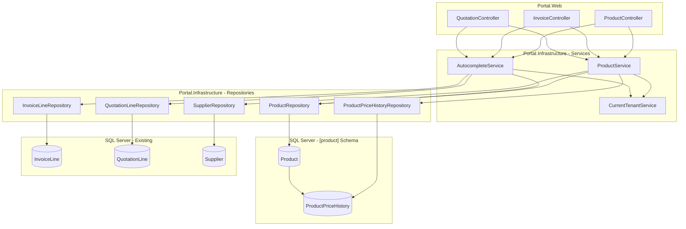
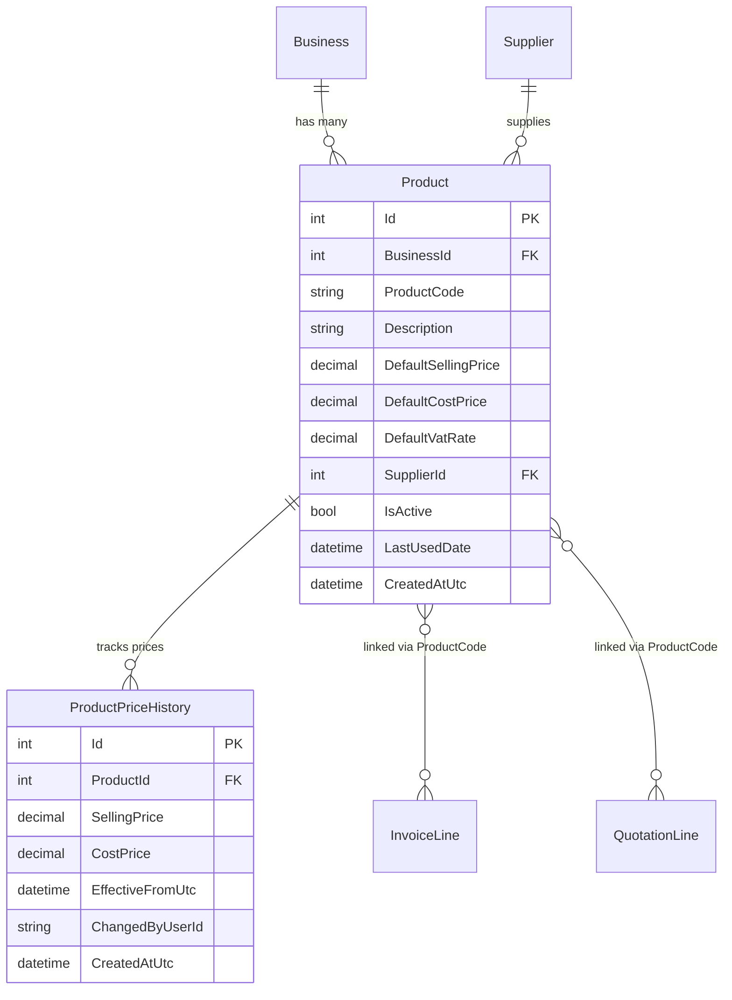

# Design Document: Product Catalog

## Overview

The Product Catalog module introduces a centralised product registry that replaces the existing `[quotation].[LineItemCatalog]` table. It provides a dedicated `[product]` schema with two tables — `Product` and `ProductPriceHistory` — enabling businesses to maintain a master list of products with pricing, supplier associations, price change tracking, and usage analytics.

The module integrates into the existing Portal architecture following the established MVC + Service Layer pattern:

- **Database layer**: New `[product]` schema with migration scripts, extending `InvoiceLine` and `QuotationLine` with a nullable `ProductCode` column
- **Infrastructure layer**: New entities (`Product`, `ProductPriceHistory`), repository (`ProductRepository`, `ProductPriceHistoryRepository`), and service (`ProductService`) with interface
- **Web layer**: `ProductController` for the management UI, autocomplete API endpoints integrated into Invoice/Quotation line item forms
- **Auto-population**: Background logic that links line items to existing products or creates new product records when invoices/quotations are saved

Tenant isolation is enforced at the service layer using `ICurrentTenantService.CurrentBusinessId`, consistent with all other modules.

## Architecture



### Key Design Decisions

1. **Separate schema (`[product]`)**: Keeps the product catalog isolated from quotation/invoice schemas, enabling independent evolution and clear ownership boundaries.

2. **ProductCode on line items (not FK to Product.Id)**: Using a nullable `nvarchar(50)` ProductCode column rather than a foreign key avoids tight coupling. Line items can exist without a linked product, and the auto-population logic operates as a best-effort enrichment.

3. **Price history as append-only log**: `ProductPriceHistory` is insert-only. Price changes never modify existing history rows, providing a complete audit trail.

4. **Auto-population is fire-and-forget**: If the auto-population logic fails after a line item is persisted, the failure is logged but the line item remains intact. This prevents catalog issues from blocking core invoicing/quotation workflows.

5. **Autocomplete combines catalog + historical usage**: The autocomplete endpoint searches both the Product table and historical InvoiceLine/QuotationLine records, giving users access to their full history even for items not yet in the catalog.

## Components and Interfaces

### Entities (Portal.Infrastructure/Entities)

#### Product.cs
```csharp
namespace Portal.Infrastructure.Entities;

/// <summary>
/// A master catalog record representing a sellable item or service, scoped to a business tenant.
/// Schema: [product].Product
/// </summary>
public class Product
{
    public int Id { get; set; }
    public int BusinessId { get; set; }
    public string ProductCode { get; set; } = null!;
    public string Description { get; set; } = null!;
    public decimal DefaultSellingPrice { get; set; }
    public decimal DefaultCostPrice { get; set; }
    public decimal DefaultVatRate { get; set; }
    public int? SupplierId { get; set; }
    public bool IsActive { get; set; }
    public DateTime? LastUsedDate { get; set; }
    public DateTime CreatedAtUtc { get; set; }

    // Navigation properties
    public Business Business { get; set; } = null!;
    public Supplier? Supplier { get; set; }
    public ICollection<ProductPriceHistory> PriceHistory { get; set; } = new List<ProductPriceHistory>();
}
```

#### ProductPriceHistory.cs
```csharp
namespace Portal.Infrastructure.Entities;

/// <summary>
/// A historical record capturing each change to a product's selling or cost price.
/// Schema: [product].ProductPriceHistory
/// </summary>
public class ProductPriceHistory
{
    public int Id { get; set; }
    public int ProductId { get; set; }
    public decimal SellingPrice { get; set; }
    public decimal CostPrice { get; set; }
    public DateTime EffectiveFromUtc { get; set; }
    public string ChangedByUserId { get; set; } = null!;
    public DateTime CreatedAtUtc { get; set; }

    // Navigation properties
    public Product Product { get; set; } = null!;
}
```

### Service Interfaces (Portal.Infrastructure/Services)

#### IProductService.cs
```csharp
namespace Portal.Infrastructure.Services;

public interface IProductService
{
    // CRUD
    Task<ServiceResult> CreateProductAsync(Product product, string userId);
    Task<ServiceResult> UpdateProductAsync(Product product, string userId);
    Task<ServiceResult> DeactivateProductAsync(int productId);
    Task<Product?> GetProductByIdAsync(int productId);

    // Listing & Search
    Task<PagedResult<Product>> GetProductsPagedAsync(string? searchTerm, int page, int pageSize = 15);

    // KPIs & Analytics
    Task<ProductKpiDto> GetKpisAsync();
    Task<List<ProductUsageDto>> GetTopProductsByUsageAsync(int top = 10);

    // Auto-population (called after line item persistence)
    Task AutoPopulateFromLineItemAsync(string? productCode, string description, decimal unitPrice, decimal vatRate, string userId);

    // Price History
    Task<List<ProductPriceHistory>> GetPriceHistoryAsync(int productId);
}
```

#### IProductAutocompleteService.cs
```csharp
namespace Portal.Infrastructure.Services;

public interface IProductAutocompleteService
{
    Task<List<AutocompleteResultDto>> SearchAsync(string query, int maxResults = 20);
}
```

### DTOs (Portal.Infrastructure/Models)

#### ProductKpiDto.cs
```csharp
namespace Portal.Infrastructure.Models;

public class ProductKpiDto
{
    public int TotalProducts { get; set; }
    public int ActiveProducts { get; set; }
    public decimal AverageSellingPrice { get; set; }
    public string? BestSellerDescription { get; set; }
    public int BestSellerUsageCount { get; set; }
}
```

#### ProductUsageDto.cs
```csharp
namespace Portal.Infrastructure.Models;

public class ProductUsageDto
{
    public string Description { get; set; } = null!;
    public int UsageCount { get; set; }
}
```

#### AutocompleteResultDto.cs
```csharp
namespace Portal.Infrastructure.Models;

public class AutocompleteResultDto
{
    public string Source { get; set; } = null!; // "Product", "Invoice", "Quotation"
    public string? ProductCode { get; set; }
    public string Description { get; set; } = null!;
    public decimal UnitPrice { get; set; }
    public decimal? VatRate { get; set; }
    public decimal? CostPrice { get; set; }
    public string? SupplierName { get; set; }
    public DateTime? Date { get; set; }
}
```

### Controller (Portal.Web/Controllers)

#### ProductController.cs

```csharp
[Authorize]
[ModuleAccess(PortalModules.Products)]
public class ProductController : Controller
{
    // Index — paginated product list with search, KPIs, chart
    // Create (POST) — create new product
    // Edit (POST) — update existing product
    // Deactivate (POST) — soft-delete
    // Autocomplete (GET) — JSON endpoint for line item forms
    // PriceHistory (GET) — partial view for price history section
}
```

### Repositories (Portal.Infrastructure/Repositories)

#### ProductRepository.cs
- `GetPagedByBusinessIdAsync(int businessId, string? search, int offset, int pageSize)` → `(List<Product>, int totalCount)`
- `GetByIdAndBusinessIdAsync(int id, int businessId)` → `Product?`
- `GetByProductCodeAndBusinessIdAsync(string productCode, int businessId)` → `Product?`
- `GetByDescriptionAndBusinessIdAsync(string description, int businessId)` → `Product?`
- `InsertAsync(Product product)` → `int` (new Id)
- `UpdateAsync(Product product)` → `void`
- `DeactivateAsync(int id, int businessId)` → `void`
- `GetKpiDataAsync(int businessId)` → `ProductKpiDto`
- `GetTopByUsageAsync(int businessId, int top)` → `List<ProductUsageDto>`
- `SearchForAutocompleteAsync(int businessId, string query, int maxResults)` → `List<Product>`

#### ProductPriceHistoryRepository.cs
- `InsertAsync(ProductPriceHistory entry)` → `void`
- `GetByProductIdAsync(int productId)` → `List<ProductPriceHistory>`

## Data Models

### Database Schema

#### [product].[Product]

| Column | Type | Nullable | Default | Notes |
|--------|------|----------|---------|-------|
| Id | INT IDENTITY(1,1) | NOT NULL | — | Primary Key |
| BusinessId | INT | NOT NULL | — | FK → [portal].[Business] |
| ProductCode | NVARCHAR(50) | NOT NULL | — | Unique per BusinessId |
| Description | NVARCHAR(500) | NOT NULL | — | |
| DefaultSellingPrice | DECIMAL(18,2) | NOT NULL | — | Min 0.00 |
| DefaultCostPrice | DECIMAL(18,2) | NOT NULL | — | Min 0.00 |
| DefaultVatRate | DECIMAL(5,2) | NOT NULL | — | Range 0.00–99.99 |
| SupplierId | INT | NULL | — | FK → [purchase].[Supplier] |
| IsActive | BIT | NOT NULL | 1 | |
| LastUsedDate | DATETIME2 | NULL | — | |
| CreatedAtUtc | DATETIME2 | NOT NULL | GETUTCDATE() | |

**Constraints:**
- `PK_Product` — Clustered on Id
- `FK_Product_Business` — BusinessId → [portal].[Business](Id)
- `FK_Product_Supplier` — SupplierId → [purchase].[Supplier](Id), ON DELETE SET NULL
- `UQ_Product_BusinessId_ProductCode` — Unique(BusinessId, ProductCode)
- `CK_Product_DefaultSellingPrice` — DefaultSellingPrice >= 0
- `CK_Product_DefaultCostPrice` — DefaultCostPrice >= 0
- `CK_Product_DefaultVatRate` — DefaultVatRate BETWEEN 0.00 AND 99.99

**Indexes:**
- `IX_Product_BusinessId` — Nonclustered on BusinessId
- `IX_Product_BusinessId_ProductCode` — Nonclustered on (BusinessId, ProductCode)

#### [product].[ProductPriceHistory]

| Column | Type | Nullable | Default | Notes |
|--------|------|----------|---------|-------|
| Id | INT IDENTITY(1,1) | NOT NULL | — | Primary Key |
| ProductId | INT | NOT NULL | — | FK → [product].[Product] |
| SellingPrice | DECIMAL(18,2) | NOT NULL | — | Min 0.00 |
| CostPrice | DECIMAL(18,2) | NOT NULL | — | Min 0.00 |
| EffectiveFromUtc | DATETIME2 | NOT NULL | — | |
| ChangedByUserId | NVARCHAR(450) | NOT NULL | — | |
| CreatedAtUtc | DATETIME2 | NOT NULL | GETUTCDATE() | |

**Constraints:**
- `PK_ProductPriceHistory` — Clustered on Id
- `FK_ProductPriceHistory_Product` — ProductId → [product].[Product](Id), ON DELETE CASCADE

**Indexes:**
- `IX_ProductPriceHistory_ProductId` — Nonclustered on ProductId

#### Modifications to Existing Tables

**[invoice].[InvoiceLine]** — Add column:
- `ProductCode NVARCHAR(50) NULL`

**[quotation].[QuotationLine]** — Add column:
- `ProductCode NVARCHAR(50) NULL`

### Entity Relationship Diagram



### Migration Scripts

The following migration scripts will be created in `Portal.Database/Migrations/`:

1. **051_CreateProductSchema.sql** — Creates the `[product]` schema
2. **052_CreateProductTable.sql** — Creates `[product].[Product]` with all constraints and indexes
3. **053_CreateProductPriceHistoryTable.sql** — Creates `[product].[ProductPriceHistory]` with FK and index
4. **054_AddProductCodeToInvoiceLine.sql** — Adds nullable ProductCode to `[invoice].[InvoiceLine]`
5. **055_AddProductCodeToQuotationLine.sql** — Adds nullable ProductCode to `[quotation].[QuotationLine]`
6. **056_MigrateLineItemCatalogToProduct.sql** — Data migration from `[quotation].[LineItemCatalog]` to `[product].[Product]`


## Correctness Properties

*A property is a characteristic or behavior that should hold true across all valid executions of a system — essentially, a formal statement about what the system should do. Properties serve as the bridge between human-readable specifications and machine-verifiable correctness guarantees.*

### Property 1: Product creation persists with correct defaults

*For any* valid ProductCode (non-empty, ≤50 chars), Description (non-empty, ≤500 chars), DefaultSellingPrice (≥0), DefaultCostPrice (≥0), and DefaultVatRate (0–99.99), creating a product SHALL result in a persisted record with IsActive=true and CreatedAtUtc set to the current UTC time.

**Validates: Requirements 2.1**

### Property 2: Duplicate ProductCode rejection

*For any* existing Product with a given ProductCode and BusinessId, attempting to create another Product with the same ProductCode (case-insensitive) and BusinessId SHALL return an error, and the total product count SHALL remain unchanged.

**Validates: Requirements 2.3**

### Property 3: Invalid input rejection

*For any* ProductCode or Description that is empty or composed entirely of whitespace, a create or edit request SHALL return a validation error and the product state SHALL remain unchanged.

**Validates: Requirements 2.7**

### Property 4: Price update creates history record

*For any* product update where DefaultSellingPrice or DefaultCostPrice changes, the system SHALL insert a new ProductPriceHistory record with the new SellingPrice, new CostPrice, EffectiveFromUtc equal to the current UTC time, and ChangedByUserId equal to the authenticated user's identifier.

**Validates: Requirements 1.6, 2.5, 5.8**

### Property 5: Product creation includes initial price history

*For any* newly created Product (whether via manual creation or auto-population), the system SHALL insert an initial ProductPriceHistory record with SellingPrice matching DefaultSellingPrice, CostPrice matching DefaultCostPrice, and EffectiveFromUtc set to the current UTC time.

**Validates: Requirements 2.8, 5.6**

### Property 6: Deactivation sets IsActive to false

*For any* active Product, submitting a deactivate request SHALL result in IsActive being set to false, with all other product fields remaining unchanged.

**Validates: Requirements 2.6**

### Property 7: Search filter correctness

*For any* search term and set of products, the filtered results SHALL contain only products whose ProductCode or Description contains the search term (case-insensitive partial match), and SHALL contain ALL such matching products within the current page.

**Validates: Requirements 3.5**

### Property 8: Pagination correctness

*For any* total product count and page number, the paginated result SHALL contain at most 15 items, the "Showing X-Y of Z" values SHALL satisfy X = ((page-1) * 15) + 1, Y = min(page * 15, totalCount), and Z = totalCount.

**Validates: Requirements 3.3, 3.4**

### Property 9: KPI calculation correctness

*For any* set of products belonging to a business, Total Products SHALL equal the count of all products, Active Products SHALL equal the count where IsActive=true, Average Selling Price SHALL equal the mean of DefaultSellingPrice across active products, and Best Seller SHALL be the product with the highest Usage_Count.

**Validates: Requirements 3.6**

### Property 10: Top products by usage ordering

*For any* set of products with usage counts, the top-10 result SHALL be sorted in descending order by Usage_Count and SHALL contain at most 10 entries.

**Validates: Requirements 3.7**

### Property 11: Autocomplete minimum query length

*For any* query string shorter than 2 characters, the autocomplete service SHALL return zero results. For any query of 2 or more characters, the service SHALL return matching results (if any exist).

**Validates: Requirements 4.1**

### Property 12: Autocomplete result completeness

*For any* matching Product, the autocomplete result SHALL include ProductCode, Description, DefaultSellingPrice, and SupplierName (or empty if no supplier). For any matching historical InvoiceLine or QuotationLine, the result SHALL include Description, UnitPrice, the parent document date, and a source indicator ("Invoice" or "Quotation").

**Validates: Requirements 4.2, 4.3, 4.4**

### Property 13: Autocomplete results sorted by most recent date

*For any* set of autocomplete results, the results SHALL be ordered by date descending (most recent first), using LastUsedDate for products, InvoiceDate for invoice lines, and CreatedAtUtc for quotation lines.

**Validates: Requirements 4.5**

### Property 14: Autocomplete result limit

*For any* autocomplete query that matches more than 20 items, the service SHALL return exactly 20 results (the 20 most recent by date).

**Validates: Requirements 4.6**

### Property 15: Auto-population matching priority

*For any* new line item with a ProductCode, the system SHALL first search for an existing Product with matching ProductCode (case-insensitive) for the same BusinessId. For any new line item without a ProductCode but with a Description, the system SHALL search for an existing Product with an exact Description match (case-insensitive) for the same BusinessId.

**Validates: Requirements 5.1, 5.2**

### Property 16: LastUsedDate update on match

*For any* line item that matches an existing Product (by ProductCode or Description), the system SHALL update the Product's LastUsedDate to the current UTC time.

**Validates: Requirements 5.3**

### Property 17: Auto-creation when no match exists and ProductCode is present

*For any* line item with a ProductCode that does not match any existing Product for the same BusinessId, the system SHALL create a new Product with: ProductCode from the line item, Description from the line item, DefaultSellingPrice from UnitPrice, DefaultCostPrice=0.00, DefaultVatRate from VatRate (or 0.00), IsActive=true, and LastUsedDate set to current UTC time.

**Validates: Requirements 5.4**

### Property 18: No auto-creation without ProductCode

*For any* line item without a ProductCode and without a Description match, the system SHALL NOT create a new Product record, and the total product count SHALL remain unchanged.

**Validates: Requirements 5.5**

### Property 19: Existing product prices preserved on auto-population match

*For any* line item that matches an existing Product where the line item's UnitPrice differs from the Product's DefaultSellingPrice, the system SHALL NOT update the Product's DefaultSellingPrice or DefaultCostPrice. Only LastUsedDate SHALL be updated.

**Validates: Requirements 5.7**

### Property 20: Tenant isolation

*For any* data access operation (query, create, update, deactivate), the system SHALL only return or modify Products belonging to the authenticated user's BusinessId. Products belonging to other BusinessIds SHALL be treated as non-existent. New Products SHALL always be stamped with the authenticated BusinessId.

**Validates: Requirements 7.1, 7.2, 7.3, 7.4, 7.6, 7.7**

### Property 21: Price history ordered descending

*For any* product's price history retrieval, the records SHALL be ordered by EffectiveFromUtc descending (most recent first).

**Validates: Requirements 8.1**

## Error Handling

### Service Layer Error Handling

| Scenario | Behaviour |
|----------|-----------|
| Duplicate ProductCode on create | Return `ServiceResult.Fail("ProductCode already exists for this business.")` |
| Empty ProductCode or Description | Return `ServiceResult.Fail("ProductCode and Description are required.")` |
| SupplierId not found or wrong business | Return `ServiceResult.Fail("Supplier not found or does not belong to this business.")` |
| Product not found on edit/deactivate | Return `ServiceResult.Fail("Product not found.")` |
| Product belongs to different business | Return `ServiceResult.Fail("Product not found.")` (treat as not found) |
| BusinessId cannot be resolved (=0) | Return empty results / `ServiceResult.Fail(...)` |
| Auto-population failure after line item persisted | Log error via `ILogger`, do NOT throw, line item remains unlinked |
| Database timeout or connection failure | Let exception propagate (repository rethrows), controller handles |

### Controller Layer Error Handling

| Scenario | Behaviour |
|----------|-----------|
| AJAX create/edit/deactivate failure | Return `Json(new { success = false, message = "..." })` |
| Autocomplete service exception | Return empty JSON array `[]` (suppress error, user continues typing) |
| Unhandled exception | Global exception handler returns 500 page |

### Repository Layer

All repositories follow the established pattern:
```csharp
try
{
    // data access
}
catch (Exception)
{
    throw;
}
```

Exceptions propagate to the service layer, which decides whether to handle gracefully (auto-population) or let them bubble up to the controller.

## Testing Strategy

### Property-Based Testing

**Library**: [FsCheck.Xunit](https://github.com/fscheck/FsCheck) (integrates with the existing xUnit test project in `Portal.Tests`)

**Configuration**: Minimum 100 iterations per property test.

**Tag format**: Each property test is annotated with a comment referencing the design property:
```csharp
// Feature: product-catalog, Property 2: Duplicate ProductCode rejection
```

**Scope**: Properties 1–21 above are implemented as property-based tests targeting the `ProductService` and `ProductAutocompleteService` classes with an in-memory EF Core database or mocked repositories.

### Unit Tests (Example-Based)

| Area | Tests |
|------|-------|
| ProductController.Index | Returns ViewResult with correct ViewData |
| ProductController.Create | Returns JSON with success/failure |
| Create form rendering | All required fields present |
| Edit form pre-population | Fields populated with current values |
| Deactivate confirmation | SweetAlert2 dialog triggered |
| Autocomplete selection (JS) | Form fields auto-filled correctly |
| Empty price history display | "No price changes recorded" message shown |
| Supplier dropdown | Populated with active suppliers only |

### Integration Tests

| Area | Tests |
|------|-------|
| Migration scripts | Run against test database, verify schema |
| LineItemCatalog migration | Verify data mapping correctness |
| Unique constraint enforcement | Verify DB rejects duplicate BusinessId+ProductCode |
| Cascade delete | Delete product → price history deleted |
| Autocomplete response time | < 500ms under normal load |

### Edge Case Tests

| Area | Tests |
|------|-------|
| BusinessId = 0 (unresolved) | Zero results returned |
| Auto-population DB failure | Line item preserved, error logged |
| Autocomplete service failure | Empty array returned, no UI disruption |
| No autocomplete matches | No dropdown displayed |
| Product with no price history | Empty state message displayed |
