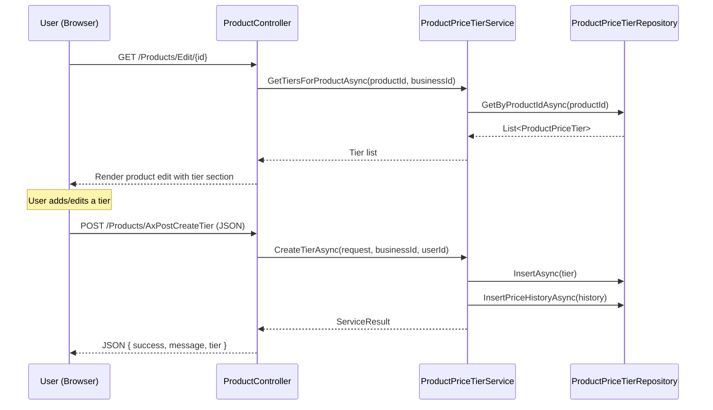
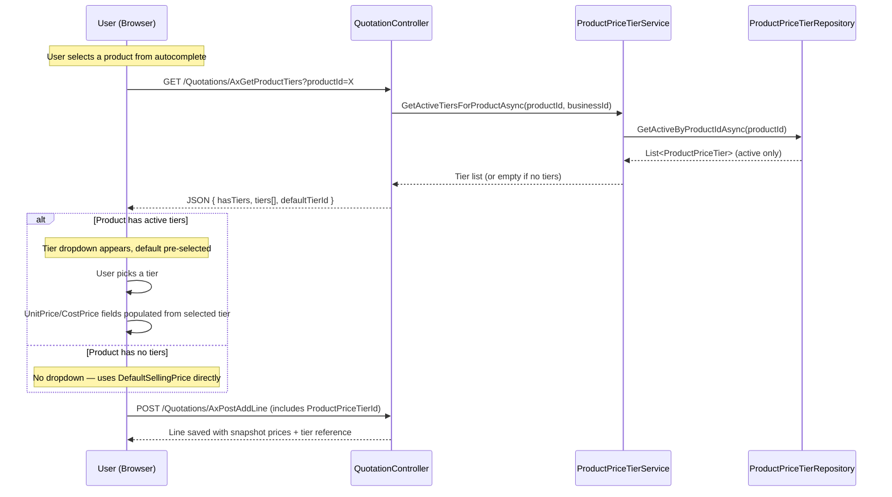

# Design Document: Product Price Tiers

## Overview

This feature extends the product catalog to support multiple named pricing levels per product (e.g., Retail, Wholesale, VIP). Each tier holds its own SellingPrice and CostPrice. During quotation/invoice creation, users choose a tier from a dropdown, and the selected tier's price is snapshotted into the line item. Products without tiers continue to work exactly as today using DefaultSellingPrice/DefaultCostPrice.

### Design Decisions

| Decision | Rationale |
|----------|-----------|
| New `[product].[ProductPriceTier]` table | Keeps tier data co-located with product data in the existing `[product]` schema. |
| Nullable `ProductPriceTierId` on QuotationLine and InvoiceLine | Maintains backward compatibility — NULL means "no tier used" (legacy behavior). |
| Extend `ProductPriceHistory` with nullable `ProductPriceTierId` | Reuses existing audit infrastructure rather than creating a separate tier-history table. |
| Soft-delete via `IsActive` flag | Deactivated tiers remain for historical reference without polluting selection UI. Reactivation is supported. |
| First tier seeds from DefaultSellingPrice/DefaultCostPrice | Smooth transition when a user decides to add tiers to an existing product. The "Add Price Tiers" CTA pre-fills the modal with product defaults — the user can edit before submitting. The service does NOT force-override submitted values; seeding is a UI convenience. |
| Snapshot-at-selection pattern | Matches existing UnitPrice snapshot behavior — financial integrity preserved. |
| Single default tier constraint enforced in service layer | Database CHECK constraints cannot easily enforce "exactly one" across rows; service layer atomicity via transaction is clearer. |
| BusinessId scoping through parent Product FK | No BusinessId on ProductPriceTier itself — multi-tenancy inherited via the Product relationship. |
| DefaultSellingPrice kept in sync with default tier | When the default tier's SellingPrice changes, `Product.DefaultSellingPrice` and `Product.DefaultCostPrice` are updated atomically. This prevents dangerous drift between the product's listed price and the actual default tier price. |
| Filtered unique index on TierName (active only) | Allows reuse of a deactivated tier's name for a new active tier. `UNIQUE WHERE IsActive = 1`. |
| Snapshot TierName on QuotationLine/InvoiceLine | Stores the tier name at time of selection for full audit fidelity, independent of later tier renames. |
| VAT rate is product-level, not tier-level | Different pricing tiers share the same VAT rate (defined on Product). This keeps VAT governance simple and avoids compliance complexity. |
| Max 20 active tiers per product | Service layer enforces a soft limit to prevent UI degradation (tier selector dropdown). |
| Deactivated products show tiers in read-only mode | When a product is deactivated, its tier section remains visible but non-editable for historical reference. |
| Tier reactivation supported | Deactivated tiers can be restored. Filtered unique index prevents name conflicts with currently active tiers. |

---

## Architecture

### High-Level Flow — Tier Management (Product Edit Page)



### High-Level Flow — Tier Selection in Quotation/Invoice Creation



---

## Components and Interfaces

### New Service Interface — IProductPriceTierService

```csharp
public interface IProductPriceTierService
{
    // Tier CRUD
    Task<ServiceResult> CreateTierAsync(CreateTierRequest request, int businessId, string userId);
    Task<ServiceResult> UpdateTierAsync(UpdateTierRequest request, int businessId, string userId);
    Task<ServiceResult> SetDefaultTierAsync(int tierId, int productId, int businessId);
    Task<ServiceResult> DeactivateTierAsync(int tierId, int productId, int businessId);
    Task<ServiceResult> ReactivateTierAsync(int tierId, int productId, int businessId);

    // Queries
    Task<List<ProductPriceTier>> GetTiersForProductAsync(int productId, int businessId);
    Task<List<ProductPriceTier>> GetActiveTiersForProductAsync(int productId, int businessId);
    Task<ProductPriceTier?> GetTierByIdAsync(int tierId, int productId, int businessId);
}
```

#### Key Service Behaviors

**DefaultSellingPrice Sync (Critical):**
- `UpdateTierAsync`: If the updated tier `IsDefault = true`, also UPDATE `Product.DefaultSellingPrice` and `Product.DefaultCostPrice` to match the new tier values within the same transaction.
- `SetDefaultTierAsync`: After switching the default flag, UPDATE `Product.DefaultSellingPrice` and `Product.DefaultCostPrice` to match the newly-designated default tier's values.
- `CreateTierAsync`: If the new tier is marked as default (first tier or explicit request), sync Product defaults.

**Tier Count Limit:**
- `CreateTierAsync` rejects if the product already has 20 active tiers: `"Maximum of 20 price tiers per product reached."`

**Reactivation:**
- `ReactivateTierAsync`: Sets `IsActive = true`. Rejected if the tier's current TierName conflicts with another active tier (filtered unique index prevents this at DB level too). Rejected if active tier count would exceed 20.

### New Repository — ProductPriceTierRepository

```csharp
public class ProductPriceTierRepository : GenericStoredProcedureRepository<ProductPriceTier>
{
    // Insert, Update, Deactivate (soft), GetByProductId, GetActiveByProductId, GetById
    // Follows existing ProductRepository patterns (raw SQL, full table names, no aliases)
}
```

### New Controller Endpoints (ProductController)

```csharp
// Tier Management
[HttpPost]
[ValidateAntiForgeryToken]
public async Task<IActionResult> AxPostCreateTier([FromBody] CreateTierRequest request)

[HttpPost]
[ValidateAntiForgeryToken]
public async Task<IActionResult> AxPostUpdateTier([FromBody] UpdateTierRequest request)

[HttpPost]
[ValidateAntiForgeryToken]
public async Task<IActionResult> AxPostSetDefaultTier([FromBody] SetDefaultTierRequest request)

[HttpPost]
[ValidateAntiForgeryToken]
public async Task<IActionResult> AxPostDeactivateTier([FromBody] DeactivateTierRequest request)

[HttpPost]
[ValidateAntiForgeryToken]
public async Task<IActionResult> AxPostReactivateTier([FromBody] ReactivateTierRequest request)

[HttpGet]
public async Task<IActionResult> AxGetProductTiers(int productId)
```

### New Controller Endpoints (QuotationController / InvoiceController)

```csharp
// Fetch active tiers for tier selector dropdown
[HttpGet]
public async Task<IActionResult> AxGetProductTiersForSelection(int productId)
```

### Request/Response DTOs

```csharp
public class CreateTierRequest
{
    public int ProductId { get; set; }
    public string TierName { get; set; } = null!;
    public decimal SellingPrice { get; set; }
    public decimal CostPrice { get; set; }
    public bool IsDefault { get; set; }
}

public class UpdateTierRequest
{
    public int TierId { get; set; }
    public int ProductId { get; set; }
    public string TierName { get; set; } = null!;
    public decimal SellingPrice { get; set; }
    public decimal CostPrice { get; set; }
}

public class SetDefaultTierRequest
{
    public int TierId { get; set; }
    public int ProductId { get; set; }
}

public class DeactivateTierRequest
{
    public int TierId { get; set; }
    public int ProductId { get; set; }
}

public class ReactivateTierRequest
{
    public int TierId { get; set; }
    public int ProductId { get; set; }
}

public class ProductTierSelectionResponse
{
    public bool HasTiers { get; set; }
    public int? DefaultTierId { get; set; }
    public string CurrencySymbol { get; set; } = "€";
    public List<TierOption> Tiers { get; set; } = new();
}

public class TierOption
{
    public int Id { get; set; }
    public string TierName { get; set; } = null!;
    public decimal SellingPrice { get; set; }
    public decimal CostPrice { get; set; }
    public bool IsDefault { get; set; }
}
```

### UI Flow — Tier Management (Product Edit Page)

1. Product edit page loads with a "Price Tiers" card section below product details
2. If product is deactivated (`IsActive = false`): tier section renders in **read-only mode** — tiers displayed but no action buttons
3. If no tiers exist (and product is active), a single CTA button: "Add Price Tiers" (triggers first-tier creation seeded from DefaultSellingPrice/DefaultCostPrice)
4. If tiers exist, display a table: TierName | SellingPrice | CostPrice | IsDefault (badge) | Status (Active/Inactive) | Actions
5. Actions for active tiers: Edit, Set Default, Deactivate
6. Actions for inactive tiers: Reactivate (shown with muted styling)
7. "Add Tier" button opens SweetAlert2 modal with TierName, SellingPrice, CostPrice fields — blocked if 20 active tiers already exist
8. Edit opens same modal pre-filled
9. Set Default uses SweetAlert2 confirmation → BlockUI → AJAX → reload tier table
10. Deactivate uses SweetAlert2 destructive confirmation → BlockUI → AJAX → tier shows as inactive
11. Reactivate uses SweetAlert2 confirmation → BlockUI → AJAX → tier becomes active again

### UI Flow — Tier Selector (Quotation/Invoice Line Item)

1. When user selects a product from autocomplete, AJAX call fetches tiers for that product
2. If `hasTiers = false`: no tier dropdown shown, UnitPrice/CostPrice filled from product defaults (existing behavior)
3. If `hasTiers = true`: a dropdown appears showing tier names with prices (e.g., "Retail — R150.00")
4. Default tier is pre-selected, UnitPrice/CostPrice populated from default tier
5. User can change tier selection — price fields update to selected tier's values
6. On line save, `ProductPriceTierId` is included in the request payload
7. For draft quotation re-selection: fetches CURRENT tier price (not cached) — ensuring draft lines get latest pricing

---

## Data Models

### New Table: `[product].[ProductPriceTier]`

```sql
CREATE TABLE [product].[ProductPriceTier]
(
    [Id]                INT IDENTITY(1,1) NOT NULL,
    [ProductId]         INT NOT NULL,
    [TierName]          NVARCHAR(100) NOT NULL,
    [SellingPrice]      DECIMAL(18,2) NOT NULL,
    [CostPrice]         DECIMAL(18,2) NOT NULL,
    [IsDefault]         BIT NOT NULL DEFAULT 0,
    [IsActive]          BIT NOT NULL DEFAULT 1,
    [CreatedAtUtc]      DATETIME NOT NULL DEFAULT GETUTCDATE(),
    [UpdatedAtUtc]      DATETIME NOT NULL DEFAULT GETUTCDATE(),

    CONSTRAINT [PK_ProductPriceTier] PRIMARY KEY CLUSTERED ([Id]),
    CONSTRAINT [FK_ProductPriceTier_Product] FOREIGN KEY ([ProductId])
        REFERENCES [product].[Product]([Id])
);
GO

-- Filtered unique index: allows reuse of deactivated tier names
CREATE UNIQUE INDEX [UQ_ProductPriceTier_ActiveName]
    ON [product].[ProductPriceTier] ([ProductId], [TierName])
    WHERE [IsActive] = 1;
GO

-- Covering index for frequent active-tier queries
CREATE NONCLUSTERED INDEX [IX_ProductPriceTier_ProductId_IsActive]
    ON [product].[ProductPriceTier] ([ProductId], [IsActive])
    INCLUDE ([TierName], [SellingPrice], [CostPrice], [IsDefault]);
GO
```

### ALTER TABLE: `[product].[ProductPriceHistory]`

```sql
ALTER TABLE [product].[ProductPriceHistory]
    ADD [ProductPriceTierId] INT NULL;

ALTER TABLE [product].[ProductPriceHistory]
    ADD CONSTRAINT [FK_ProductPriceHistory_ProductPriceTier]
        FOREIGN KEY ([ProductPriceTierId])
        REFERENCES [product].[ProductPriceTier]([Id]);
```

### ALTER TABLE: `[quotation].[QuotationLine]`

```sql
ALTER TABLE [quotation].[QuotationLine]
    ADD [ProductPriceTierId] INT NULL;

ALTER TABLE [quotation].[QuotationLine]
    ADD [PriceTierName] NVARCHAR(100) NULL;

ALTER TABLE [quotation].[QuotationLine]
    ADD CONSTRAINT [FK_QuotationLine_ProductPriceTier]
        FOREIGN KEY ([ProductPriceTierId])
        REFERENCES [product].[ProductPriceTier]([Id]);
```

### ALTER TABLE: `[invoice].[InvoiceLine]`

```sql
ALTER TABLE [invoice].[InvoiceLine]
    ADD [ProductPriceTierId] INT NULL;

ALTER TABLE [invoice].[InvoiceLine]
    ADD [PriceTierName] NVARCHAR(100) NULL;

ALTER TABLE [invoice].[InvoiceLine]
    ADD CONSTRAINT [FK_InvoiceLine_ProductPriceTier]
        FOREIGN KEY ([ProductPriceTierId])
        REFERENCES [product].[ProductPriceTier]([Id]);
```

### New Entity: ProductPriceTier

```csharp
namespace Portal.Infrastructure.Entities;

/// <summary>
/// A named pricing level for a product (e.g., Retail, Wholesale, VIP).
/// Schema: [product].[ProductPriceTier]
/// </summary>
public class ProductPriceTier
{
    public int Id { get; set; }
    public int ProductId { get; set; }
    public string TierName { get; set; } = null!;
    public decimal SellingPrice { get; set; }
    public decimal CostPrice { get; set; }
    public bool IsDefault { get; set; }
    public bool IsActive { get; set; }
    public DateTime CreatedAtUtc { get; set; }
    public DateTime UpdatedAtUtc { get; set; }

    // Navigation properties
    public Product Product { get; set; } = null!;
}
```

### Updated Entity: ProductPriceHistory (add nullable tier reference)

```csharp
// Add to existing ProductPriceHistory class:
public int? ProductPriceTierId { get; set; }

// Navigation property
public ProductPriceTier? ProductPriceTier { get; set; }
```

### Updated Entity: QuotationLine (add nullable tier reference)

```csharp
// Add to existing QuotationLine class:
public int? ProductPriceTierId { get; set; }
public string? PriceTierName { get; set; }

// Navigation property
public ProductPriceTier? ProductPriceTier { get; set; }
```

### Updated Entity: InvoiceLine (add nullable tier reference)

```csharp
// Add to existing InvoiceLine class:
public int? ProductPriceTierId { get; set; }
public string? PriceTierName { get; set; }

// Navigation property
public ProductPriceTier? ProductPriceTier { get; set; }
```

### Key Constraints & Indexes

| Constraint/Index | Purpose |
|-----------|---------|
| `UQ_ProductPriceTier_ActiveName` (ProductId, TierName) WHERE IsActive=1 | Unique active tier names per product; allows reuse of deactivated names |
| `IX_ProductPriceTier_ProductId_IsActive` | Covering index for active-tier queries |
| FK to Product | Cascading tenant scope |
| FK on QuotationLine/InvoiceLine (nullable) | Audit traceability without breaking legacy lines |
| `PriceTierName` snapshot on lines | Full audit fidelity independent of later tier renames |

### Quotation-to-Invoice Conversion (Critical Integration Point)

When `InvoiceService.ConvertFromQuotationAsync` copies QuotationLines to InvoiceLines, it MUST also map:
- `line.ProductPriceTierId` → `invoiceLine.ProductPriceTierId`
- `line.PriceTierName` → `invoiceLine.PriceTierName`

This ensures the invoice retains full pricing audit trail, including which tier was used and what it was called at the time of quotation.

### Product Deactivation + Tier Visibility

When `Product.IsActive = false`:
- The product's tier section on the edit page renders in **read-only mode** (no Add/Edit/Deactivate/Reactivate buttons)
- Tier data remains visible for historical reference
- The product won't appear in quotation/invoice product selectors, so tiers are implicitly excluded from selection

---


## Correctness Properties

*A property is a characteristic or behavior that should hold true across all valid executions of a system — essentially, a formal statement about what the system should do. Properties serve as the bridge between human-readable specifications and machine-verifiable correctness guarantees.*

### Property 1: Tier Creation Round-Trip

*For any* valid tier name, selling price (≥ 0), and cost price (≥ 0), creating a tier for a product and then reading it back SHALL produce a record with identical TierName, SellingPrice, CostPrice, ProductId, and IsActive=true.

**Validates: Requirements 1.1**

### Property 2: Tier Name Uniqueness Enforcement (Active Tiers Only)

*For any* product and any tier name that already exists as an active tier for that product, attempting to create or rename another active tier to the same name SHALL be rejected by the service, and the total active tier count for the product SHALL remain unchanged. A deactivated tier's name MAY be reused by a new active tier.

**Validates: Requirements 1.2, 2.2**

### Property 3: Exactly One Default Tier Invariant

*For any* product that has one or more active price tiers, after any valid sequence of tier operations (create, set default, deactivate non-default, reactivate), the count of tiers with IsDefault=true SHALL always be exactly one.

**Validates: Requirements 1.3, 2.3, 2.4**

### Property 4: First Tier Seeds From Product Defaults

*For any* product with zero existing tiers, when the first tier is created via the "Add Price Tiers" action, the tier's SellingPrice SHALL equal the product's DefaultSellingPrice, the tier's CostPrice SHALL equal the product's DefaultCostPrice, and IsDefault SHALL be true.

**Validates: Requirements 1.4, 8.3**

### Property 5: Price Update Creates Append-Only History

*For any* tier and any new valid SellingPrice or CostPrice, after updating the tier's price N times, the ProductPriceHistory table SHALL contain exactly N records for that tier's ProductPriceTierId, each with the correct SellingPrice, CostPrice, ProductId, ChangedByUserId, and monotonically increasing EffectiveFromUtc values.

**Validates: Requirements 2.1, 7.1, 7.2**

### Property 6: Active Tier Filter Excludes Deactivated

*For any* product with a mix of active and inactive tiers, querying the active tiers list SHALL return only tiers where IsActive=true, and SHALL never include any tier where IsActive=false.

**Validates: Requirements 3.1, 3.3**

### Property 7: Deactivation Preserves All Data

*For any* tier that is deactivated, the tier record SHALL still exist in the database with all original field values preserved (except IsActive which becomes false), and all associated ProductPriceHistory records SHALL remain unchanged.

**Validates: Requirements 3.4**

### Property 8: Tier Selection Snapshot Integrity

*For any* product with active tiers and any selected tier, the created QuotationLine SHALL have UnitPrice equal to the tier's current SellingPrice, CostPrice equal to the tier's current CostPrice, and ProductPriceTierId equal to the selected tier's Id at the moment of selection.

**Validates: Requirements 4.3, 4.4, 4.5, 6.4**

### Property 9: Zero-Tier Backward Compatibility

*For any* product with zero active price tiers, creating a QuotationLine SHALL use UnitPrice equal to the product's DefaultSellingPrice and CostPrice equal to the product's DefaultCostPrice, with ProductPriceTierId=NULL.

**Validates: Requirements 5.2, 8.2**

### Property 10: Existing Lines Immutable After Tier Modification

*For any* existing QuotationLine or InvoiceLine that references a ProductPriceTierId, updating that tier's SellingPrice/CostPrice or deactivating that tier SHALL leave the line's UnitPrice, CostPrice, and ProductPriceTierId completely unchanged.

**Validates: Requirements 6.1, 6.2**

### Property 11: Draft Re-Selection Uses Current Price

*For any* draft quotation and any tier whose price has been updated since the line was last saved, re-selecting the same product and tier SHALL populate the line with the tier's CURRENT SellingPrice and CostPrice (not the previously cached values).

**Validates: Requirements 6.3**

### Property 12: Multi-Tenant Data Isolation

*For any* tier operation (create, update, deactivate, reactivate, query) and any ProductId that does not belong to the authenticated user's BusinessId, the operation SHALL be rejected and SHALL not return, modify, or create any tier data.

**Validates: Requirements 9.1, 9.2, 9.3**

### Property 13: DefaultSellingPrice Sync on Default Tier Change

*For any* product with tiers, after updating the default tier's SellingPrice or designating a new default tier, `Product.DefaultSellingPrice` SHALL equal the current default tier's SellingPrice, and `Product.DefaultCostPrice` SHALL equal the current default tier's CostPrice.

**Validates: Requirements 2.1, 2.3**

### Property 14: Active Tier Count Limit

*For any* product, the count of tiers where IsActive=true SHALL never exceed 20. Any create or reactivate operation that would cause the count to exceed 20 SHALL be rejected.

**Validates: Requirements 1.1, 3.1**

### Property 15: Reactivation Preserves Tier Data

*For any* deactivated tier that is reactivated, the tier's TierName, SellingPrice, CostPrice, and ProductId SHALL remain unchanged from their values before deactivation (only IsActive changes from false to true and UpdatedAtUtc is refreshed).

**Validates: Requirements 3.4**

### Property 16: PriceTierName Snapshot Immutability

*For any* QuotationLine or InvoiceLine that has a non-null PriceTierName, renaming the referenced ProductPriceTier SHALL NOT change the PriceTierName stored on the line.

**Validates: Requirements 6.1, 6.4**

---

## Error Handling

### Tier Management Errors

| Scenario | Handling |
|----------|----------|
| Duplicate tier name (among active tiers) | Service returns `{ success: false, message: "A tier with this name already exists for this product." }` |
| Attempt to deactivate default tier | Service returns `{ success: false, message: "Cannot deactivate the default tier. Set another tier as default first." }` |
| Attempt to remove only default without replacement | Service rejects and returns `{ success: false, message: "A product must always have exactly one default tier." }` |
| Attempt to create tier when 20 active tiers exist | Service returns `{ success: false, message: "Maximum of 20 price tiers per product reached." }` |
| Attempt to reactivate tier when 20 active tiers exist | Service returns `{ success: false, message: "Maximum of 20 price tiers per product reached. Deactivate another tier first." }` |
| Attempt to reactivate tier with name conflict | Service returns `{ success: false, message: "An active tier with this name already exists. Rename the conflicting tier first." }` |
| Product not found or doesn't belong to business | Service returns `{ success: false, message: "Product not found." }` (generic to avoid information leakage) |
| Tier not found | Service returns `{ success: false, message: "Price tier not found." }` |
| Invalid price (negative) | Server-side validation rejects: `{ success: false, message: "Price values must be zero or greater." }` |
| Empty tier name | Server-side validation rejects: `{ success: false, message: "Tier name is required." }` |
| Tier name too long (>100 chars) | Server-side validation rejects: `{ success: false, message: "Tier name must be 100 characters or fewer." }` |

### Tier Selection Errors (Quotation/Invoice)

| Scenario | Handling |
|----------|----------|
| Product has tiers but selected tier is now inactive | AJAX returns `{ success: false, message: "This price tier is no longer available. Please select another." }` |
| Product belongs to different business | Same as product-not-found handling |
| Network failure during tier fetch | `BlockUI.hide()` → `Swal.fire({ icon: 'error' })` — tier dropdown not shown, user can retry |

### Standard Error Pattern

```csharp
catch (Exception ex)
{
    // Controller-level: log and return generic error
    return Json(new { success = false, message = "An unexpected error occurred." });
}
```

### Validation Rules (Service Layer)

| Field | Rule |
|-------|------|
| TierName | Required, non-empty, max 100 chars, unique among active tiers for the product |
| SellingPrice | Required, decimal ≥ 0 |
| CostPrice | Required, decimal ≥ 0 |
| ProductId | Required, must belong to authenticated user's BusinessId |
| TierId (for updates) | Required, must exist and belong to specified product |
| Active tier count | Max 20 per product (enforced on create and reactivate) |

---

## Testing Strategy

### Unit Tests (Example-Based)

| Area | Tests |
|------|-------|
| First tier creation | Verify first tier seeds from DefaultSellingPrice/DefaultCostPrice and is marked default |
| Deactivate default tier blocked | Verify service rejects deactivation of default tier |
| Tier selector response shape | Verify API returns correct JSON structure with hasTiers, defaultTierId, tiers[] |
| Zero-tier product selection | Verify no tier selector data returned and defaults are used |
| QuotationLine tier reference | Verify ProductPriceTierId is stored on line creation |
| InvoiceLine tier reference | Verify tier ID carries over from quotation-to-invoice conversion |
| Rename to duplicate blocked | Verify service rejects rename to existing name |

### Property-Based Tests (FsCheck + xUnit)

The project uses FsCheck (already in build output). Each property test runs a minimum of 100 iterations.

| Property | Test Focus |
|----------|-----------|
| Property 1 | Generate random tier names/prices, create and read back, verify round-trip |
| Property 2 | Generate random tier names, attempt duplicate, verify rejection and count unchanged |
| Property 3 | Generate random sequences of tier operations, verify exactly one default after each |
| Property 4 | Generate random products with varying DefaultSellingPrice/CostPrice, verify first tier seeds correctly |
| Property 5 | Generate N random price updates for a tier, verify N history records with correct data |
| Property 6 | Generate products with random active/inactive tier mixes, verify filter correctness |
| Property 7 | Generate tiers with history, deactivate, verify no data loss |
| Property 8 | Generate random tier selections, verify snapshot equals tier's current values |
| Property 9 | Generate products with no tiers, create lines, verify DefaultSellingPrice/DefaultCostPrice used |
| Property 10 | Generate lines with tier refs, update tier prices, verify lines unchanged |
| Property 11 | Generate draft lines, update tier price, re-select, verify new price applied |
| Property 12 | Generate cross-business tier operations, verify all rejected |

### Property Test Configuration

- **Library**: FsCheck.Xunit (already in project)
- **Minimum iterations**: 100 per property
- **Tag format**: `// Feature: product-price-tiers, Property {N}: {title}`

### Integration Tests

| Scenario | Scope |
|----------|-------|
| Create tier endpoint round-trip | POST create → GET tiers → verify tier in list |
| Set default tier | POST set default → verify old default is unset |
| Deactivate tier | POST deactivate → verify excluded from active list |
| Tier selection in quotation flow | Select product → get tiers → add line → verify snapshot |
| Price history creation | Update tier price → query history → verify record exists |
| Multi-tenant isolation | Attempt operations across businesses → verify 403/rejection |
