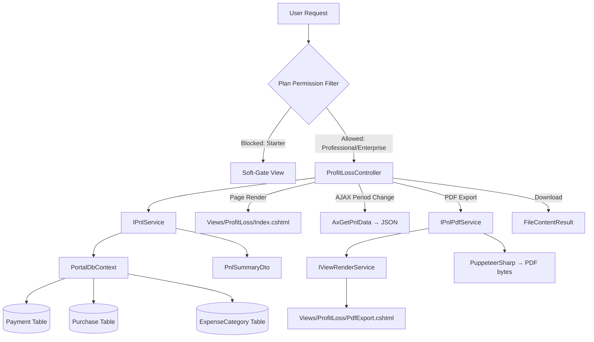

# Design Document: Profit & Loss Summary

## Overview

This design implements a period-based Profit & Loss (P&L) reporting module that computes Revenue, Cost of Goods Sold (COGS), Operating Expenses, Gross Profit, and Net Profit from existing `Payment` and `Purchase` data. The module includes summary cards, an expense category breakdown table, year-over-year trend comparison, and PDF export — all following the approved mockup at `.kiro/docs/mockups/pnl-summary.html`.

No new database tables are required. All data is derived from existing `[revenue].[Payment]` and `[purchase].[Purchase]` tables, with classification driven by `PurchaseType` and `ExpenseCategory` lookups.

### Design Decisions

1. **Pure computation service** — `PnlService` performs all arithmetic and filtering logic as a stateless service. It receives a date range and returns a fully computed DTO. This makes the core logic independently testable without controllers or views.

2. **Reuse existing PDF pattern** — Follow the `InvoicePdfService` approach: render a dedicated Razor view to HTML via `IViewRenderService`, then convert to PDF with PuppeteerSharp. This avoids introducing a new PDF library.

3. **AJAX period switching** — Period changes use AJAX (with BlockUI) to reload only the data partial, avoiding full page reloads. The initial page load is server-rendered for SEO and fast first paint.

4. **Leverage EF Core global query filter** — The `PortalDbContext` already applies a global query filter on `BusinessId` via `ICurrentTenantService`. The service benefits from this automatically, but we also explicitly scope queries as defence-in-depth.

5. **No caching** — P&L figures are computed on-demand. The queries are simple aggregations on indexed columns (`PaymentDateUtc`, `InvoiceDate`, `BusinessId`, `PurchaseTypeId`, `IsCancelled`, `IsVoided`). Caching adds complexity without clear benefit at current scale.

6. **Plan gating already wired** — The `ModuleControllerMap` already maps `PortalModules.Pnl` to controllers `"ProfitLoss", "Pnl"`. The `PlanPermissionFilter` will block Starter plan users automatically when the controller is decorated with `[ModuleAccess(PortalModules.Pnl)]`.

---

## Architecture



### Request Flow

1. **Page Load** — `GET /ProfitLoss` → Controller calls `IPnlService.GetSummaryAsync(period)` → returns `PnlSummaryDto` → renders `Index.cshtml`
2. **Period Change (AJAX)** — `GET /ProfitLoss/AxGetPnlData?period=...` → Service computes → returns JSON → client re-renders cards/table
3. **PDF Export** — `GET /ProfitLoss/ExportPdf?period=...` → Service computes → `IPnlPdfService.GenerateAsync(dto)` → returns `FileContentResult`

---

## Components and Interfaces

### 1. IPnlService / PnlService

**Location:** `Portal.Infrastructure/Services/IPnlService.cs` and `Portal.Infrastructure/Services/PnlService.cs`

```csharp
public interface IPnlService
{
    /// <summary>
    /// Computes the full P&L summary for the given period, including trend comparison.
    /// </summary>
    Task<PnlSummaryDto> GetSummaryAsync(PnlPeriodRequest request);

    /// <summary>
    /// Resolves a predefined period label to concrete start/end dates based on current UTC date.
    /// </summary>
    PnlDateRange ResolvePeriod(PnlPeriodType periodType, DateTime referenceDate);

    /// <summary>
    /// Validates a custom date range (start must be <= end).
    /// </summary>
    PnlValidationResult ValidateCustomRange(DateOnly startDate, DateOnly endDate);
}
```

**Responsibilities:**
- Query `Payment` records: sum `Amount` where `IsVoided == false` and `PaymentDateUtc` within period
- Query `Purchase` records: sum `TotalAmount` grouped by `PurchaseTypeId` where `IsCancelled == false` and `InvoiceDate` within period
- Compute derived figures: GrossProfit, NetProfit, GrossMargin, NetMargin
- Compute expense category breakdown with percentages and ordering
- Compute year-over-year trend comparison by shifting period back 12 months
- All queries scoped to `ICurrentTenantService.CurrentBusinessId`

### 2. IPnlPdfService / PnlPdfService

**Location:** `Portal.Infrastructure/Services/IPnlPdfService.cs` and `Portal.Web/Services/PnlPdfService.cs`

```csharp
public interface IPnlPdfService
{
    /// <summary>
    /// Generates a PDF byte array from a fully computed P&L summary.
    /// </summary>
    Task<byte[]> GenerateAsync(PnlPdfModel model, CancellationToken cancellationToken = default);
}
```

**Responsibilities:**
- Accept a `PnlPdfModel` containing all computed data + business name + period dates
- Render `Views/ProfitLoss/PdfExport.cshtml` via `IViewRenderService`
- Embed business logo as base64 (same pattern as `InvoicePdfService`)
- Convert HTML to PDF via PuppeteerSharp (A4, portrait, print background)
- Return PDF byte array

### 3. ProfitLossController

**Location:** `Portal.Web/Controllers/ProfitLossController.cs`

```csharp
[Authorize]
[ModuleAccess(PortalModules.Pnl)]
public class ProfitLossController : Controller
{
    // GET /ProfitLoss — Initial page load
    public async Task<IActionResult> Index(string? period, string? startDate, string? endDate);

    // GET /ProfitLoss/AxGetPnlData — AJAX period change
    [HttpGet]
    public async Task<IActionResult> AxGetPnlData(string period, string? startDate, string? endDate);

    // GET /ProfitLoss/ExportPdf — PDF download
    [HttpGet]
    public async Task<IActionResult> ExportPdf(string period, string? startDate, string? endDate);
}
```

**Responsibilities:**
- Parse period parameter into `PnlPeriodRequest`
- Delegate computation to `IPnlService`
- Map `PnlSummaryDto` to `PnlViewModel` for the view
- Handle validation errors for custom date ranges
- Return appropriate responses (View, JSON, FileContentResult)

### 4. Views

| View | Purpose |
|------|---------|
| `Views/ProfitLoss/Index.cshtml` | Full page with period selector, summary cards, breakdown table, trend table |
| `Views/ProfitLoss/_PnlContent.cshtml` | Partial for AJAX reload (cards + tables without layout) |
| `Views/ProfitLoss/PdfExport.cshtml` | Self-contained HTML for PDF rendering (inline styles, no external dependencies) |

---

## Data Models

### PnlPeriodType (Enum)

```csharp
public enum PnlPeriodType
{
    CurrentMonth,
    PreviousMonth,
    CurrentQuarter,
    CurrentYear,
    Custom
}
```

### PnlPeriodRequest

```csharp
public class PnlPeriodRequest
{
    public PnlPeriodType PeriodType { get; set; }
    public DateOnly? CustomStartDate { get; set; }
    public DateOnly? CustomEndDate { get; set; }
}
```

### PnlDateRange

```csharp
public class PnlDateRange
{
    public DateOnly StartDate { get; set; }
    public DateOnly EndDate { get; set; }
}
```

### PnlValidationResult

```csharp
public class PnlValidationResult
{
    public bool IsValid { get; set; }
    public string? ErrorMessage { get; set; }
}
```

### PnlSummaryDto

```csharp
public class PnlSummaryDto
{
    // Period info
    public DateOnly PeriodStart { get; set; }
    public DateOnly PeriodEnd { get; set; }

    // Core figures
    public decimal Revenue { get; set; }
    public decimal Cogs { get; set; }
    public decimal GrossProfit { get; set; }
    public decimal OperatingExpenses { get; set; }
    public decimal NetProfit { get; set; }

    // Margins (percentage, 0–100 scale)
    public decimal GrossMargin { get; set; }
    public decimal NetMargin { get; set; }

    // Trend comparison (null if no comparison data available)
    public PnlTrendDto? Trend { get; set; }

    // Expense breakdown
    public List<PnlCategoryBreakdownDto> CategoryBreakdown { get; set; } = new();

    // Empty state flag
    public bool HasData { get; set; }
}
```

### PnlTrendDto

```csharp
public class PnlTrendDto
{
    public decimal PreviousRevenue { get; set; }
    public decimal PreviousCogs { get; set; }
    public decimal PreviousGrossProfit { get; set; }
    public decimal PreviousOperatingExpenses { get; set; }
    public decimal PreviousNetProfit { get; set; }

    // Percentage changes (null if previous value was zero — "no comparison data")
    public decimal? RevenueChange { get; set; }
    public decimal? CogsChange { get; set; }
    public decimal? GrossProfitChange { get; set; }
    public decimal? OperatingExpensesChange { get; set; }
    public decimal? NetProfitChange { get; set; }
}
```

### PnlCategoryBreakdownDto

```csharp
public class PnlCategoryBreakdownDto
{
    public int ExpenseCategoryId { get; set; }
    public string CategoryName { get; set; } = null!;
    public string ExpenseTypeName { get; set; } = null!;  // "Services" or "Goods"
    public int PurchaseTypeId { get; set; }  // 2 = Stock (COGS), 3 = Expense (OpEx)
    public string PurchaseTypeName { get; set; } = null!;  // "Stock" or "Expense"
    public decimal TotalAmount { get; set; }
    public decimal PercentageOfTotal { get; set; }  // Percentage of (COGS + OpEx) combined
}
```

### PnlViewModel (for the View)

```csharp
public class PnlViewModel
{
    public PnlSummaryDto Summary { get; set; } = null!;
    public PnlPeriodType SelectedPeriod { get; set; }
    public string? CustomStartDate { get; set; }
    public string? CustomEndDate { get; set; }
    public string CurrencySymbol { get; set; } = "€";
}
```

### PnlPdfModel (for PDF rendering)

```csharp
public class PnlPdfModel
{
    public string BusinessName { get; set; } = null!;
    public string CurrencySymbol { get; set; } = "€";
    public PnlSummaryDto Summary { get; set; } = null!;
}
```

---

## Correctness Properties

*A property is a characteristic or behavior that should hold true across all valid executions of a system — essentially, a formal statement about what the system should do. Properties serve as the bridge between human-readable specifications and machine-verifiable correctness guarantees.*

### Property 1: Revenue computation includes only valid payments for the current tenant and period

*For any* set of Payment records with varying `IsVoided`, `PaymentDateUtc`, and `BusinessId` values, the computed Revenue SHALL equal the sum of `Amount` for only those payments where `IsVoided == false`, `PaymentDateUtc` falls within the specified period, and `BusinessId` matches the current tenant.

**Validates: Requirements 1.1, 8.1**

### Property 2: Purchase classification separates COGS and Operating Expenses correctly with tenant isolation

*For any* set of Purchase records with varying `PurchaseTypeId`, `IsCancelled`, `InvoiceDate`, and `BusinessId` values, the computed COGS SHALL equal the sum of `TotalAmount` for non-cancelled purchases with `PurchaseTypeId == 2` within the period for the current tenant, AND the computed Operating Expenses SHALL equal the sum of `TotalAmount` for non-cancelled purchases with `PurchaseTypeId == 3` within the period for the current tenant.

**Validates: Requirements 1.2, 1.3, 8.2**

### Property 3: Derived profit figures maintain arithmetic invariants

*For any* P&L computation, `GrossProfit` SHALL equal `Revenue - COGS` AND `NetProfit` SHALL equal `GrossProfit - OperatingExpenses`.

**Validates: Requirements 1.4, 1.5**

### Property 4: Margin formulas are correctly applied with zero-revenue protection

*For any* P&L computation, if `Revenue > 0` then `GrossMargin` SHALL equal `(GrossProfit / Revenue) * 100` and `NetMargin` SHALL equal `(NetProfit / Revenue) * 100`; if `Revenue == 0` then both `GrossMargin` and `NetMargin` SHALL equal `0`.

**Validates: Requirements 1.6, 1.7**

### Property 5: Predefined period resolution produces correct date boundaries

*For any* reference date, `ResolvePeriod(CurrentMonth, date)` SHALL return the first and last day of that month, `ResolvePeriod(PreviousMonth, date)` SHALL return the first and last day of the preceding month, `ResolvePeriod(CurrentQuarter, date)` SHALL return the first day of the current calendar quarter and today's date, and `ResolvePeriod(CurrentYear, date)` SHALL return January 1st of that year and today's date.

**Validates: Requirements 2.1, 2.3**

### Property 6: Custom date range validation accepts valid ranges and rejects invalid ones

*For any* pair of dates `(startDate, endDate)`, the validation SHALL pass if and only if `startDate <= endDate`, and SHALL return a validation error otherwise.

**Validates: Requirements 2.4, 2.5**

### Property 7: Comparison period is exactly one year earlier than the selected period

*For any* date range `(startDate, endDate)`, the comparison period SHALL have `startDate` shifted back by one year and `endDate` shifted back by one year.

**Validates: Requirements 4.1**

### Property 8: Trend percentage change formula is correctly applied

*For any* pair of current and previous period values, the percentage change SHALL equal `((current - previous) / |previous|) * 100` when `previous != 0`, and SHALL be `null` (no comparison data) when `previous == 0`.

**Validates: Requirements 4.2, 4.4**

### Property 9: Expense breakdown percentages sum to 100%

*For any* non-empty set of expense category amounts, the sum of all `PercentageOfTotal` values in the breakdown SHALL equal 100% (within floating-point tolerance of ±0.1%).

**Validates: Requirements 3.4, 9.2**

### Property 10: Expense breakdown is ordered by amount descending

*For any* expense breakdown result with more than one category, each category's `TotalAmount` SHALL be greater than or equal to the next category's `TotalAmount` in the list.

**Validates: Requirements 9.3**

### Property 11: Expense breakdown includes category name and expense type classification

*For any* expense category that has purchases in the period, the breakdown result SHALL include the `CategoryName` from `ExpenseCategory.Name` and the `ExpenseTypeName` from the related `ExpenseType.Name` (Services or Goods).

**Validates: Requirements 9.4**

### Property 12: PDF rendered content contains all required fields

*For any* valid `PnlPdfModel`, the rendered HTML output SHALL contain the business name, period start date, period end date, Revenue, COGS, Gross Profit, Gross Margin, Operating Expenses, Net Profit, Net Margin, and at least one expense category row.

**Validates: Requirements 5.2**

### Property 13: PDF filename follows the specified format

*For any* business name and date range, the generated filename SHALL match the pattern `PnL_{BusinessName}_{StartDate}_{EndDate}.pdf` where dates are formatted as `yyyyMMdd` and business name has spaces replaced with underscores.

**Validates: Requirements 5.3**

---

## Error Handling

| Scenario | Response | Format |
|----------|----------|--------|
| Custom date range invalid (start > end) | Return validation error message | JSON `{ success: false, message: "Start date must be before or equal to end date." }` for AJAX; redirect with TempData error for page load |
| No financial data for period | Display empty state message | View with `HasData == false` shows "No financial data exists for this period" |
| No comparison data for previous year | Show "No comparison data available" | `Trend` is null or individual change values are null; view shows informational badge |
| PDF generation fails (PuppeteerSharp timeout) | Return error response | JSON `{ success: false, message: "PDF generation failed. Please try again." }` or error view |
| Database query timeout | Exception propagates to global error handler | 500 error page |
| Module access blocked (Starter plan) | PlanPermissionFilter returns soft-gate view | Handled by existing infrastructure — no custom logic needed |

### AJAX Error Pattern

All AJAX endpoints in `ProfitLossController` follow the project's standard pattern:

```csharp
[HttpGet]
public async Task<IActionResult> AxGetPnlData(string period, string? startDate, string? endDate)
{
    try
    {
        // Parse and validate
        // Compute via IPnlService
        // Return JSON
        return Json(new { success = true, data = viewModel });
    }
    catch (Exception ex)
    {
        return Json(new { success = false, message = "Failed to load P&L data. Please try again." });
    }
}
```

---

## Testing Strategy

### Unit Tests (xUnit)

| Area | Tests |
|------|-------|
| `PnlService.GetSummaryAsync` | Revenue/COGS/OpEx computation with mock DbContext; empty dataset; mixed data |
| `PnlService.ResolvePeriod` | All period types with various reference dates; edge cases (month boundaries, year boundaries, leap year) |
| `PnlService.ValidateCustomRange` | Valid ranges; equal dates; inverted dates |
| Margin calculations | Zero revenue; positive/negative margins; large values |
| Trend computation | Normal comparison; no previous data; zero previous values |
| Expense breakdown | Correct grouping; correct percentages; correct ordering; empty categories |
| `ProfitLossController` | Period parsing; validation error handling; empty state |
| PDF filename generation | Various business names; date formatting |

### Property-Based Tests (FsCheck with xUnit)

The project uses C# with xUnit. Property-based tests will use **FsCheck.Xunit** for generating random inputs.

Each property test runs a minimum of **100 iterations** and is tagged with a comment referencing the design property.

| Property | Generator Strategy |
|----------|-------------------|
| Property 1 (Revenue) | Random list of Payment records (varying IsVoided, PaymentDateUtc, BusinessId, Amount) + random period + random tenant BusinessId |
| Property 2 (COGS/OpEx classification) | Random list of Purchase records (varying PurchaseTypeId, IsCancelled, InvoiceDate, BusinessId, TotalAmount) |
| Property 3 (Arithmetic invariants) | Random Revenue, COGS, OpEx decimal values |
| Property 4 (Margin formulas) | Random Revenue (including zero), COGS, OpEx decimal values |
| Property 5 (Period resolution) | Random DateTime values across different months/years including leap years |
| Property 6 (Date validation) | Random DateOnly pairs (both valid and invalid ranges) |
| Property 7 (Comparison period shift) | Random date ranges including leap year boundaries |
| Property 8 (Trend change formula) | Random current/previous decimal pairs including zero previous |
| Property 9 (Percentage sum) | Random lists of positive decimal amounts (1–20 items) |
| Property 10 (Ordering) | Random lists of positive decimal amounts |
| Property 11 (Breakdown completeness) | Random ExpenseCategory/ExpenseType combinations |
| Property 12 (PDF content) | Random PnlPdfModel instances with varying data |
| Property 13 (PDF filename) | Random business names (with spaces, special chars) and date ranges |

### Integration Tests

| Area | Tests |
|------|-------|
| Controller + Service pipeline | End-to-end with in-memory database; verify correct figures returned |
| PDF export | Verify non-empty byte array returned for valid data |
| Plan gating | Verify Starter plan is blocked, Professional is allowed |
| Tenant isolation | Two businesses with data; verify no cross-tenant leakage |

### Test Configuration

```
Property test minimum iterations: 100
Testing framework: xUnit
Property testing library: FsCheck.Xunit
Tag format: Feature: profit-loss-summary, Property {N}: {property_text}
```
