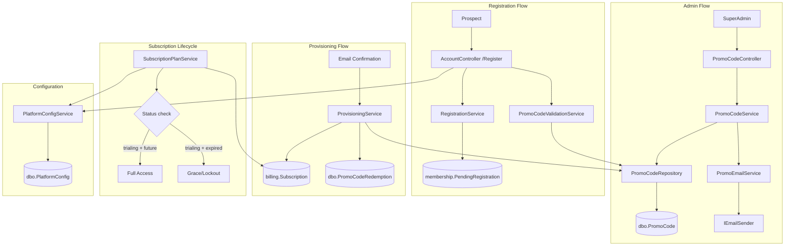

# Design Document: Promo Code System

## Overview

The Promo Code System provides a complete promotional trial flow for the Portal platform. Super admins can generate promo codes (email-bound or generic) that grant prospects a free "Business" plan trial without Stripe checkout. The system integrates with the existing registration, provisioning, and subscription lifecycle infrastructure.

The architecture introduces four new components:
1. **PlatformConfigService** — Reusable key-value configuration reader from `[dbo].[PlatformConfig]`
2. **PromoCodeService** — Code generation, validation, administration, and email delivery
3. **PromoCodeController** — Admin CRUD and actions under the Administration section
4. **PromoCode provisioning path** — Extension of the existing `ProvisioningService` to handle promo code redemptions

The design minimizes changes to existing infrastructure by reusing the `SubscriptionPlanService` expiry detection (which already handles "trialing" status) and extending the `RegistrationService` / `ProvisioningService` with a promo code branch.

## Architecture



### Key Design Decisions

1. **No separate PromoCode provisioning service** — The existing `ProvisioningService` is extended with a `ProvisionPromoTrialAsync` method. This avoids duplicating the Business/UserBusiness/Permission creation logic and keeps transaction management centralized.

2. **PendingRegistration extended with PromoCodeId** — Rather than a separate tracking table, we add a nullable `PromoCodeId` column to the existing `PendingRegistration` table (Membership DB). This keeps the registration-to-provisioning flow unified.

3. **Existing expiry detection handles trial end** — The `SubscriptionPlanService` already treats "trialing" as an active status and checks `CurrentPeriodEnd`. No new cron jobs or background services are needed.

4. **Code generation uses cryptographic randomness** — `RandomNumberGenerator` ensures unpredictable codes without the need for external dependencies.

5. **Optimistic concurrency for redemption** — The concurrent redemption guard uses a WHERE clause (`CurrentRedemptions < MaxRedemptions`) in the UPDATE statement within the transaction, rather than pessimistic locking.

## Components and Interfaces

### 1. PlatformConfigService

```csharp
public interface IPlatformConfigService
{
    Task<string?> GetValueAsync(string key);
    Task SetValueAsync(string key, string value);
}

public class PlatformConfigService : IPlatformConfigService
{
    // Scoped service — caches values in HttpContext.Items for request lifetime
    // Case-insensitive key lookup via LOWER() comparison
}
```

**Registration:** Scoped in DI container. Injected where feature flags or platform settings are needed.

### 2. PromoCodeService

```csharp
public interface IPromoCodeService
{
    Task<PromoCodeCreateResult> CreateAsync(CreatePromoCodeRequest request, string createdByUserId);
    Task<PromoCodeValidationResult> ValidateAsync(string code, string? registrationEmail);
    Task<ServiceResult> RevokeAsync(int promoCodeId);
    Task<PagedResult<PromoCodeListItem>> GetAllAsync(PromoCodeFilter filter);
    Task<PromoCode?> GetByIdAsync(int id);
}
```

**Code Generation Algorithm:**
- Character set: `ABCDEFGHJKLMNPQRSTUVWXYZ23456789` (32 chars — excludes O, 0, I, l, 1)
- Length: 8 characters
- Source: `System.Security.Cryptography.RandomNumberGenerator`
- Collision retry: up to 5 attempts with uniqueness check against DB

### 3. PromoCodeValidationService

```csharp
public interface IPromoCodeValidationService
{
    Task<PromoCodeValidationResult> ValidateForRegistrationAsync(string code, string registrationEmail);
}

public class PromoCodeValidationResult
{
    public bool IsValid { get; set; }
    public string? ErrorMessage { get; set; }  // User-facing, no internal details
    public int? PromoCodeId { get; set; }       // Only populated when valid, for internal use
    public int? DurationMonths { get; set; }    // Only populated when valid
}
```

**Validation Rules (server-side, in order):**
1. Code exists in `[dbo].[PromoCode]` (case-insensitive, trimmed)
2. `IsRevoked = 0`
3. `ExpiresAtUtc > GETUTCDATE()`
4. `CurrentRedemptions < MaxRedemptions`
5. If `BoundEmail IS NOT NULL`: registration email matches (case-insensitive)

For rule 5, a mismatch returns the same generic "invalid code" message as a non-existent code (security requirement 9.5).

### 4. PromoCodeRepository

```csharp
public class PromoCodeRepository : GenericStoredProcedureRepository<PromoCode>
{
    public async Task<int> InsertAsync(PromoCode entity);
    public async Task<PromoCode?> GetByCodeAsync(string code);
    public async Task<bool> CodeExistsAsync(string code);
    public async Task<bool> RevokeAsync(int id);
    public async Task<bool> IncrementRedemptionsAsync(int id);  // Atomic with WHERE guard
    public async Task<PagedResult<PromoCode>> GetFilteredAsync(PromoCodeFilter filter);
}
```

### 5. PromoCodeRedemptionRepository

```csharp
public class PromoCodeRedemptionRepository : GenericStoredProcedureRepository<PromoCodeRedemption>
{
    public async Task<int> InsertAsync(PromoCodeRedemption entity);
}
```

### 6. PromoCodeController

```csharp
[Authorize(Roles = "SuperAdmin")]
[Route("Admin/PromoCodes")]
public class PromoCodeController : Controller
{
    // GET  /Admin/PromoCodes          — Index (list + create form)
    // POST /Admin/PromoCodes/Create   — Create promo code (AJAX)
    // POST /Admin/PromoCodes/Revoke   — Revoke promo code (AJAX)
    // POST /Admin/PromoCodes/SendCode — Send email (AJAX)
}
```

### 7. PromoEmailService

```csharp
public interface IPromoEmailService
{
    Task<bool> SendPromoCodeEmailAsync(string recipientEmail, string code, int durationMonths, DateTime expiresAtUtc);
}
```

Uses the existing `IEmailSender` infrastructure with a new `EmailDepartmentEnum.PromoCode` value. Email template follows the branded pattern from `PortalEmailService`.

### 8. Extended ProvisioningService

```csharp
// New method added to IProvisioningService
Task<ProvisioningResult> ProvisionPromoTrialAsync(PromoProvisioningRequest request);

public class PromoProvisioningRequest
{
    public string UserId { get; set; }
    public int PendingRegistrationId { get; set; }
    public int PlanId { get; set; }
    public int PromoCodeId { get; set; }
    public int DurationMonths { get; set; }
}
```

**Transaction scope:**
1. Create Business
2. Create UserBusiness
3. Create Subscription (Status="trialing", StripeSubscriptionId=NULL, period = now + DurationMonths)
4. Create UserBusinessPermissions (all Business plan features)
5. INCREMENT PromoCode.CurrentRedemptions WHERE CurrentRedemptions < MaxRedemptions (atomic guard)
6. Create PromoCodeRedemption record
7. Mark PendingRegistration as completed

If step 5 returns 0 rows affected → rollback entire transaction and return failure.

## Data Models

### New Tables

#### [dbo].[PlatformConfig]

| Column | Type | Nullable | Default | Notes |
|--------|------|----------|---------|-------|
| Key | NVARCHAR(256) | NOT NULL | — | PRIMARY KEY |
| Value | NVARCHAR(MAX) | NOT NULL | — | |
| Description | NVARCHAR(500) | NULL | — | |
| LastModifiedAtUtc | DATETIME | NOT NULL | GETUTCDATE() | |

#### [dbo].[PromoCode]

| Column | Type | Nullable | Default | Notes |
|--------|------|----------|---------|-------|
| Id | INT IDENTITY | NOT NULL | — | PRIMARY KEY |
| Code | NVARCHAR(50) | NOT NULL | — | UNIQUE |
| DurationMonths | INT | NOT NULL | — | CHECK (1-24) |
| MaxRedemptions | INT | NOT NULL | — | CHECK (> 0) |
| CurrentRedemptions | INT | NOT NULL | 0 | CHECK (>= 0, <= MaxRedemptions) |
| ExpiresAtUtc | DATETIME | NOT NULL | — | |
| BoundEmail | NVARCHAR(256) | NULL | — | |
| IsRevoked | BIT | NOT NULL | 0 | |
| CreatedByUserId | NVARCHAR(450) | NOT NULL | — | |
| CreatedAtUtc | DATETIME | NOT NULL | GETUTCDATE() | |

#### [dbo].[PromoCodeRedemption]

| Column | Type | Nullable | Default | Notes |
|--------|------|----------|---------|-------|
| Id | INT IDENTITY | NOT NULL | — | PRIMARY KEY |
| PromoCodeId | INT | NOT NULL | — | FK → dbo.PromoCode.Id |
| UserId | NVARCHAR(450) | NOT NULL | — | |
| BusinessId | INT | NOT NULL | — | FK → dbo.Business.Id |
| RedeemedAtUtc | DATETIME | NOT NULL | — | |
| CreatedAtUtc | DATETIME | NOT NULL | GETUTCDATE() | |

### Modified Tables

#### [membership].[PendingRegistration] — Add Column

| Column | Type | Nullable | Default | Notes |
|--------|------|----------|---------|-------|
| PromoCodeId | INT | NULL | NULL | FK → dbo.PromoCode.Id (cross-DB logical reference, no physical FK) |

### Entity Classes

```csharp
namespace Portal.Infrastructure.Entities;

public class PromoCode
{
    public int Id { get; set; }
    public string Code { get; set; } = null!;
    public int DurationMonths { get; set; }
    public int MaxRedemptions { get; set; }
    public int CurrentRedemptions { get; set; }
    public DateTime ExpiresAtUtc { get; set; }
    public string? BoundEmail { get; set; }
    public bool IsRevoked { get; set; }
    public string CreatedByUserId { get; set; } = null!;
    public DateTime CreatedAtUtc { get; set; }

    // Navigation
    public ICollection<PromoCodeRedemption> Redemptions { get; set; } = new List<PromoCodeRedemption>();
}

public class PromoCodeRedemption
{
    public int Id { get; set; }
    public int PromoCodeId { get; set; }
    public string UserId { get; set; } = null!;
    public int BusinessId { get; set; }
    public DateTime RedeemedAtUtc { get; set; }
    public DateTime CreatedAtUtc { get; set; }

    // Navigation
    public PromoCode PromoCode { get; set; } = null!;
    public Business Business { get; set; } = null!;
}

public class PlatformConfig
{
    public string Key { get; set; } = null!;
    public string Value { get; set; } = null!;
    public string? Description { get; set; }
    public DateTime LastModifiedAtUtc { get; set; }
}
```

### Migration Files

- `081_CreatePlatformConfigTable.sql`
- `082_CreatePromoCodeTable.sql`
- `083_CreatePromoCodeRedemptionTable.sql`
- `084_SeedPlatformConfig.sql`
- `Membership/005_AddPromoCodeIdToPendingRegistration.sql`

## Correctness Properties

*A property is a characteristic or behavior that should hold true across all valid executions of a system — essentially, a formal statement about what the system should do. Properties serve as the bridge between human-readable specifications and machine-verifiable correctness guarantees.*

### Property 1: Generated code format invariant

*For any* invocation of the code generator, the produced code SHALL be exactly 8 characters long, composed only of characters from the set `ABCDEFGHJKLMNPQRSTUVWXYZ23456789`, and SHALL NOT contain any of the ambiguous characters `O`, `0`, `I`, `l`, or `1`.

**Validates: Requirements 2.1**

### Property 2: Email-bound forces single redemption

*For any* promo code creation request where BoundEmail is a non-null, non-empty string, the resulting PromoCode record SHALL have MaxRedemptions equal to 1, regardless of any other MaxRedemptions value provided in the request.

**Validates: Requirements 2.2**

### Property 3: Expiry date validation

*For any* DateTime value provided as an expiry date, the validation SHALL accept the value if and only if it is at least 1 day (24 hours) in the future relative to the current UTC time.

**Validates: Requirements 2.5**

### Property 4: Duration validation range

*For any* integer value provided as DurationMonths, the validation SHALL accept the value if and only if it is between 1 and 24 inclusive.

**Validates: Requirements 2.6**

### Property 5: MaxRedemptions validation range

*For any* integer value provided as MaxRedemptions for a generic (non-email-bound) code, the validation SHALL accept the value if and only if it is between 1 and 500 inclusive.

**Validates: Requirements 2.7**

### Property 6: Status derivation determinism

*For any* PromoCode record state (IsRevoked, ExpiresAtUtc, CurrentRedemptions, MaxRedemptions), the derived status SHALL be exactly one of "Revoked" (when IsRevoked=true), "Redeemed" (when CurrentRedemptions=MaxRedemptions and not revoked), "Expired" (when ExpiresAtUtc < now and not revoked and not fully redeemed), or "Active" (otherwise). The derivation SHALL be deterministic and mutually exclusive.

**Validates: Requirements 3.3**

### Property 7: Status filter correctness

*For any* list of PromoCode records and any selected status filter value, the filtered result SHALL contain exactly those records whose derived status matches the filter value.

**Validates: Requirements 3.4**

### Property 8: Non-active codes cannot be revoked

*For any* PromoCode whose derived status is "Revoked", "Redeemed", or "Expired", an attempt to revoke it SHALL return a failure result without modifying the record.

**Validates: Requirements 3.6**

### Property 9: Promo email content completeness

*For any* valid PromoCode with a Code value, DurationMonths, and ExpiresAtUtc, the generated promotional email HTML SHALL contain: the Code string, the DurationMonths value, the ExpiresAtUtc formatted date, and a hyperlink matching the pattern `/Account/Register?promoCode={Code}`.

**Validates: Requirements 4.1, 4.3**

### Property 10: Email sending is read-only

*For any* PromoCode record, invoking the send email operation SHALL not modify any field of the PromoCode record (CurrentRedemptions, IsRevoked, ExpiresAtUtc, etc.).

**Validates: Requirements 4.5**

### Property 11: Composite promo code validation

*For any* PromoCode state and current UTC time, the validation function SHALL return valid if and only if: the code exists AND IsRevoked is false AND ExpiresAtUtc > current UTC time AND CurrentRedemptions < MaxRedemptions.

**Validates: Requirements 5.5**

### Property 12: Email-bound email match validation

*For any* email-bound PromoCode (BoundEmail is not null) and any registration email string, the validation SHALL succeed if and only if the registration email matches BoundEmail using case-insensitive comparison (after trimming whitespace).

**Validates: Requirements 5.6**

### Property 13: Subscription trial period calculation

*For any* PromoCode with DurationMonths value D (1 ≤ D ≤ 24), when provisioning creates a subscription, the CurrentPeriodEnd SHALL equal CurrentPeriodStart plus exactly D calendar months.

**Validates: Requirements 6.2**

### Property 14: Concurrent redemption atomicity

*For any* PromoCode with CurrentRedemptions = MaxRedemptions - 1, if N concurrent provisioning attempts execute simultaneously, at most one SHALL succeed in incrementing CurrentRedemptions, and the final CurrentRedemptions SHALL never exceed MaxRedemptions.

**Validates: Requirements 6.6**

### Property 15: Trialing and active expiry equivalence

*For any* subscription record, the `SubscriptionPlanService` expiry detection SHALL produce identical access results for Status="trialing" and Status="active" given the same CurrentPeriodEnd value relative to the current UTC time.

**Validates: Requirements 7.2, 7.5**

### Property 16: Case-insensitive config lookup

*For any* PlatformConfig record with key K, querying with any case variation of K (uppercase, lowercase, mixed) SHALL return the same Value.

**Validates: Requirements 8.2**

### Property 17: No internal details in validation response

*For any* promo code validation result returned to the registration page client, the response object SHALL NOT contain the fields: Id, CreatedByUserId, CurrentRedemptions, or MaxRedemptions.

**Validates: Requirements 9.3**

### Property 18: Input sanitization idempotence

*For any* string input to the promo code field, the sanitization function (trim whitespace + convert to uppercase) SHALL be idempotent — applying it twice produces the same result as applying it once.

**Validates: Requirements 9.4**

## Error Handling

### Service Layer Errors

| Scenario | Handling | User Impact |
|----------|----------|-------------|
| Code generation collision (5 retries) | Log Warning, return error result | SweetAlert2 error: "Code generation failed. Please try again." |
| Promo code not found during validation | Return invalid result | Validation error on form field |
| Email send failure | Log Warning, return false | SweetAlert2 error: "Email could not be sent." |
| Provisioning transaction failure | Rollback, Log Error, return failure | Redirect to error page with Stripe checkout link |
| Concurrent redemption race lost | Rollback, Log Info, return failure | Redirect to "code no longer valid" page |
| PlatformConfig key not found | Return null (no exception) | Feature flag defaults to "off" behavior |

### Controller Layer Errors

All AJAX endpoints follow the existing pattern:
```csharp
return Json(new { success = false, message = "User-friendly error message" });
```

BlockUI.show() before request, BlockUI.hide() in both success and catch paths, SweetAlert2 for result display.

### Repository Layer Errors

All repositories follow the standard try/catch + rethrow pattern:
```csharp
catch (Exception)
{
    throw;
}
```

### Logging Strategy

| Event | Level | Structured Properties |
|-------|-------|---------------------|
| Promo code created | Information | UserId, PromoCodeId, Code, Type (Email/Generic) |
| Promo code revoked | Information | UserId, PromoCodeId |
| Promo code redeemed | Information | UserId, PromoCodeId, BusinessId |
| Code generation collision | Warning | AttemptNumber, ExistingCode |
| Email send failure | Warning | RecipientEmail, PromoCodeId, Exception |
| Provisioning failure | Error | UserId, PromoCodeId, Exception |
| Concurrent redemption race | Information | UserId, PromoCodeId, CurrentRedemptions |

## Testing Strategy

### Property-Based Tests (xUnit + FsCheck)

The feature contains significant pure logic suitable for property-based testing:
- Code generation format validation
- Input validation functions (duration, max redemptions, expiry date, email format)
- Status derivation logic
- Promo code composite validation
- Input sanitization

**Configuration:**
- Library: FsCheck.Xunit (integrates with xUnit test runner)
- Minimum iterations: 100 per property
- Tag format: `Feature: promo-code-system, Property {N}: {title}`

Each correctness property (1–18) maps to a single property-based test where applicable. Properties involving database transactions or external services (14, 15) will use mocked dependencies.

### Unit Tests (xUnit)

- PromoCodeService.CreateAsync — happy path, email-bound override, collision retry
- PromoCodeValidationService — each failure reason returns correct error message
- Status derivation — boundary examples (exact expiry moment, exact max redemptions)
- PromoEmailService — email HTML structure verification
- PlatformConfigService — cache hit, cache miss, missing key
- ProvisioningService.ProvisionPromoTrialAsync — successful provisioning, invalid code rejection

### Integration Tests

- Full registration-to-provisioning flow with promo code
- Concurrent redemption test (multiple threads competing for last redemption)
- Database constraint enforcement (DurationMonths, CurrentRedemptions)
- SubscriptionPlanService treating trialing same as active for expiry

### UI/E2E Tests (Manual)

- Admin page: create code, view table, filter, revoke, send email
- Registration page: promo field visibility toggle, pre-population from URL, validation messages
- Subscription indicator: trial badge display
- Lockout screen: Subscribe button navigation
