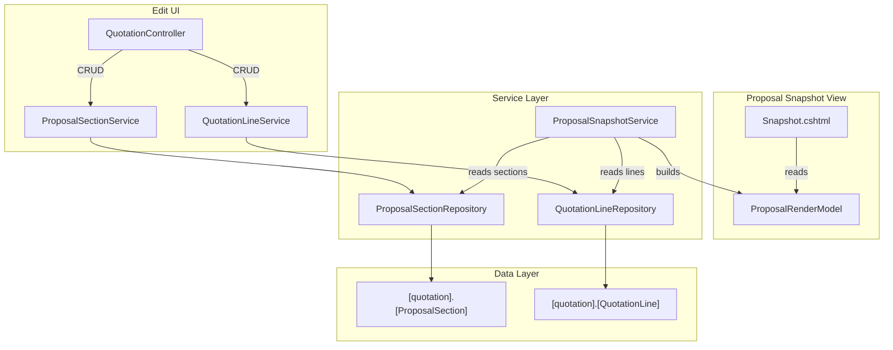

# Design Document: Proposal Rendering Enhancements

## Overview

This feature enhances the proposal snapshot renderer and supporting data layer with four capabilities:

1. **Per-Section Totals Box** — Renders a calculated totals summary below each section's line items table. Subscription sections show Monthly / Daily / Annual breakdown; OneTime sections show a simple subtotal.

2. **Narrative Section Type** — Introduces a new `SectionType` discriminator on `ProposalSection` allowing sections to be either "LineItems" (table of priced lines) or "Narrative" (rich text content card with no line items table).

3. **Section Emphasis & Accent Color** — Adds `IsEmphasized` and `AccentColor` fields to `ProposalSection`, enabling a Signal Card pattern (4px left border accent) for visually distinguishing important content blocks.

4. **Line Item Subtitle** — Adds a `Subtitle` field to `QuotationLine`, rendered below the bold Description title in a smaller muted font for professional two-line formatting.

All changes are additive schema extensions with safe defaults, ensuring backward compatibility with existing data. The rendering logic is entirely within the Razor view (`Snapshot.cshtml`) and the render model construction in the service layer.

## Architecture



### Key Architectural Decisions

| Decision | Rationale |
|----------|-----------|
| Totals calculated in Razor view | Totals are purely presentational (sum of existing LineTotal values). No business logic — just formatting. Keeps the render model lean and avoids duplicating computed values in the database. |
| SectionType as string discriminator (not separate table) | Only two values ("LineItems", "Narrative") with no additional metadata. A lookup table would be over-engineering for a simple type flag. |
| IsEmphasized + AccentColor on ProposalSection | Keeps emphasis styling co-located with the section entity. No need for a separate styling table — these are simple rendering hints. |
| Subtitle on QuotationLine (not splitting Description) | Preserves backward compatibility. Existing lines continue to work with Description only. Subtitle is purely additive. |
| Default values ensure backward compatibility | `SectionType = 'LineItems'`, `IsEmphasized = 0`, `AccentColor = NULL`, `Subtitle = NULL` — all existing records remain valid without data migration. |

## Components and Interfaces

### Modified Components

#### 1. `ProposalSection` Entity

Add three new properties:

```csharp
public string SectionType { get; set; } = "LineItems";
public bool IsEmphasized { get; set; }
public string? AccentColor { get; set; }
```

#### 2. `QuotationLine` Entity

Add one new property:

```csharp
public string? Subtitle { get; set; }
```

#### 3. `ProposalSectionRenderModel`

Add three new properties:

```csharp
public string SectionType { get; set; } = "LineItems";
public bool IsEmphasized { get; set; }
public string? AccentColor { get; set; }
```

#### 4. `ProposalLineRenderModel`

Add one new property:

```csharp
public string? Subtitle { get; set; }
```

#### 5. `ProposalSectionRepository`

- SELECT queries updated to include `[SectionType]`, `[IsEmphasized]`, `[AccentColor]` columns
- INSERT/UPDATE queries updated to include the three new parameters

#### 6. `QuotationLineRepository` (or equivalent line CRUD)

- SELECT queries updated to include `[Subtitle]` column
- INSERT/UPDATE queries updated to include `[Subtitle]` parameter

#### 7. `PortalDbContext.ConfigureProposalSection`

- Add `.Property(e => e.SectionType).IsRequired().HasMaxLength(20).HasDefaultValue("LineItems")`
- Add `.Property(e => e.IsEmphasized).IsRequired().HasDefaultValue(false)`
- Add `.Property(e => e.AccentColor).HasMaxLength(20)`

#### 8. `PortalDbContext.ConfigureQuotationLine`

- Add `.Property(e => e.Subtitle).HasMaxLength(1000)`

#### 9. `Snapshot.cshtml` (Proposal Renderer)

- Render Narrative sections as content cards (heading + description body, no table)
- Apply Signal Card pattern (4px left border) when `IsEmphasized` is true
- Render per-section totals box below line items tables
- Render Subtitle below Description in line items rows
- Calculate subscription totals (Monthly, Daily = Monthly/30, Annual = Monthly×12)
- Calculate one-time subtotals (sum of LineTotal)

#### 10. `ProposalSectionService.AddSectionAsync` / `UpdateSectionAsync`

- Accept and persist `SectionType`, `IsEmphasized`, `AccentColor` parameters

## Data Models

### Schema Extension: `[quotation].[ProposalSection]`

```sql
ALTER TABLE [quotation].[ProposalSection]
    ADD [SectionType] NVARCHAR(20) NOT NULL DEFAULT 'LineItems';

ALTER TABLE [quotation].[ProposalSection]
    ADD [IsEmphasized] BIT NOT NULL DEFAULT 0;

ALTER TABLE [quotation].[ProposalSection]
    ADD [AccentColor] NVARCHAR(20) NULL;
```

### Schema Extension: `[quotation].[QuotationLine]`

```sql
ALTER TABLE [quotation].[QuotationLine]
    ADD [Subtitle] NVARCHAR(1000) NULL;
```

### Updated Entity: `ProposalSection`

```csharp
namespace Portal.Infrastructure.Entities;

public class ProposalSection
{
    public int Id { get; set; }
    public int QuotationId { get; set; }
    public string Name { get; set; } = null!;
    public int SortOrder { get; set; }
    public string ColumnConfiguration { get; set; } = null!;
    public string? Description { get; set; }
    public string? Notes { get; set; }
    public string SectionType { get; set; } = "LineItems";
    public bool IsEmphasized { get; set; }
    public string? AccentColor { get; set; }

    // Navigation properties
    public Quotation Quotation { get; set; } = null!;
    public ICollection<QuotationLine> QuotationLines { get; set; } = new List<QuotationLine>();
}
```

### Updated Entity: `QuotationLine`

```csharp
namespace Portal.Infrastructure.Entities;

public class QuotationLine
{
    public int Id { get; set; }
    public int QuotationId { get; set; }
    public string Description { get; set; } = null!;
    public decimal Quantity { get; set; }
    public decimal UnitPrice { get; set; }
    public decimal VatRate { get; set; }
    public decimal Discount { get; set; }
    public string DiscountType { get; set; } = "Percentage";
    public decimal LineTotal { get; set; }
    public int SortOrder { get; set; }
    public string? ReferenceUrl { get; set; }
    public int? ProposalSectionId { get; set; }
    public string? Subtitle { get; set; }

    // Navigation properties
    public Quotation Quotation { get; set; } = null!;
    public ProposalSection? ProposalSection { get; set; }
}
```

### Updated Render Models

```csharp
public class ProposalSectionRenderModel
{
    public string Name { get; set; } = null!;
    public string? Description { get; set; }
    public string? Notes { get; set; }
    public string ColumnConfiguration { get; set; } = null!;
    public int SortOrder { get; set; }
    public string SectionType { get; set; } = "LineItems";
    public bool IsEmphasized { get; set; }
    public string? AccentColor { get; set; }
    public List<ProposalLineRenderModel> Lines { get; set; } = new();
}

public class ProposalLineRenderModel
{
    public string Description { get; set; } = null!;
    public decimal Quantity { get; set; }
    public decimal UnitPrice { get; set; }
    public decimal VatRate { get; set; }
    public decimal Discount { get; set; }
    public string DiscountType { get; set; } = "Percentage";
    public decimal LineTotal { get; set; }
    public int SortOrder { get; set; }
    public string? ReferenceUrl { get; set; }
    public string? Subtitle { get; set; }
}
```

### EF Core Configuration Updates

```csharp
// In ConfigureProposalSection:
entity.Property(e => e.SectionType)
    .IsRequired()
    .HasMaxLength(20)
    .HasDefaultValue("LineItems");

entity.Property(e => e.IsEmphasized)
    .IsRequired()
    .HasDefaultValue(false);

entity.Property(e => e.AccentColor)
    .HasMaxLength(20);

// In ConfigureQuotationLine:
entity.Property(e => e.Subtitle)
    .HasMaxLength(1000);
```

### Updated Repository Queries

```sql
-- ProposalSectionRepository.GetByQuotationIdAsync
SELECT [Id], [QuotationId], [Name], [SortOrder], [ColumnConfiguration],
       [Description], [Notes], [SectionType], [IsEmphasized], [AccentColor]
FROM [quotation].[ProposalSection]
WHERE [QuotationId] = @QuotationId
ORDER BY [SortOrder]

-- ProposalSectionRepository.InsertAsync
INSERT INTO [quotation].[ProposalSection]
    ([QuotationId], [Name], [SortOrder], [ColumnConfiguration],
     [Description], [Notes], [SectionType], [IsEmphasized], [AccentColor])
VALUES
    (@QuotationId, @Name, @SortOrder, @ColumnConfiguration,
     @Description, @Notes, @SectionType, @IsEmphasized, @AccentColor)

-- ProposalSectionRepository.UpdateAsync
UPDATE [quotation].[ProposalSection]
SET [Name] = @Name, [SortOrder] = @SortOrder, [ColumnConfiguration] = @ColumnConfiguration,
    [Description] = @Description, [Notes] = @Notes,
    [SectionType] = @SectionType, [IsEmphasized] = @IsEmphasized, [AccentColor] = @AccentColor
WHERE [Id] = @Id
```


## Correctness Properties

*A property is a characteristic or behavior that should hold true across all valid executions of a system — essentially, a formal statement about what the system should do. Properties serve as the bridge between human-readable specifications and machine-verifiable correctness guarantees.*

### Property 1: Subscription section totals calculation

*For any* subscription section containing N lines with LineTotal values, the Section_Totals_Box should display: Total Monthly = sum of all LineTotals, Total Daily Cost = Math.Round(Total Monthly / 30, 2), and Total Annual = Total Monthly × 12.

**Validates: Requirements 1.2, 1.3**

### Property 2: OneTime section subtotal calculation

*For any* OneTime section containing N lines with LineTotal values, the Section_Totals_Box should display a Section Subtotal equal to the sum of all LineTotals in that section.

**Validates: Requirements 2.1, 2.2**

### Property 3: Monetary value formatting with currency symbol

*For any* currency symbol and any non-negative monetary value, the formatted string produced by the renderer should begin with the currency symbol followed by the value formatted to 2 decimal places.

**Validates: Requirements 1.5, 2.3, 6.5**

### Property 4: Daily cost "/day" suffix formatting

*For any* monetary value rendered as a daily cost (in both per-line columns and section totals), the formatted string should end with the "/day" suffix.

**Validates: Requirements 1.4, 6.4**

### Property 5: Narrative section rendering

*For any* ProposalSection with SectionType "Narrative" and a non-null Description, the rendered output should contain the section Name as a heading and the Description as body content, and should NOT contain a line items table element for that section.

**Validates: Requirements 3.2, 3.3**

### Property 6: SectionType persistence and default value

*For any* ProposalSection inserted without an explicit SectionType value, reading it back should yield SectionType = "LineItems". For any ProposalSection inserted with SectionType "Narrative", reading it back should yield SectionType = "Narrative".

**Validates: Requirements 3.1, 3.4**

### Property 7: Emphasis accent color resolution

*For any* ProposalSection with IsEmphasized = true and a non-null AccentColor, the rendered section card should have a left border using that AccentColor. For any ProposalSection with IsEmphasized = true and a null AccentColor, the rendered section card should have a left border using the default color #0D5EA6.

**Validates: Requirements 4.2, 4.3, 4.4**

### Property 8: Emphasis and AccentColor field round-trip

*For any* ProposalSection with IsEmphasized set to true or false and AccentColor set to any valid string (or null), inserting and then reading back the section should yield identical IsEmphasized and AccentColor values.

**Validates: Requirements 4.1, 4.5**

### Property 9: Subtitle rendering

*For any* QuotationLine with a non-null, non-empty Subtitle, the rendered line item row should contain both the Description (as bold title) and the Subtitle (as muted secondary text). For any QuotationLine with a null or empty Subtitle, the rendered row should contain only the Description without a subtitle element.

**Validates: Requirements 5.3, 5.4, 5.5**

### Property 10: Subtitle field round-trip

*For any* QuotationLine with a Subtitle value (including null), inserting or updating the line and reading it back should yield the same Subtitle value.

**Validates: Requirements 5.1, 5.6**

### Property 11: Per-line subscription column calculations

*For any* QuotationLine in a Subscription section with a given UnitPrice, the rendered Daily Cost column value should equal Math.Round(UnitPrice / 30, 2) and the Annual Price column value should equal UnitPrice × 12.

**Validates: Requirements 6.1, 6.2, 6.3**

### Property 12: Render model field mapping from entities

*For any* ProposalSection entity with given SectionType, IsEmphasized, and AccentColor values, and for any QuotationLine entity with a given Subtitle value, the constructed ProposalSectionRenderModel and ProposalLineRenderModel should have field values identical to their source entities.

**Validates: Requirements 8.5, 8.6**

## Error Handling

| Scenario | Handling |
|----------|----------|
| SectionType contains invalid value (not "LineItems" or "Narrative") | Service layer validates SectionType against allowed values before persisting. Returns validation error to controller. Renderer treats unknown SectionType as "LineItems" (defensive fallback). |
| AccentColor contains invalid CSS color string | No server-side validation — AccentColor is rendered directly as a CSS value. The browser gracefully ignores invalid color values. UI input should constrain to valid hex colors. |
| Narrative section with lines assigned to it | Renderer ignores lines for Narrative sections (does not render table). Lines remain in the database but are not displayed. Service layer may warn but does not prevent this state. |
| Subtitle exceeds 1000 characters | Database constraint (NVARCHAR(1000)) enforces max length. EF Core `HasMaxLength(1000)` provides model-level validation. Service trims or rejects oversized input. |
| Division by zero in daily cost calculation | Not possible — dividing by the constant 30. No risk of division by zero. |
| Empty section (no lines) totals calculation | Sum of zero lines = 0. Totals box renders €0.00 values. No special handling needed. |
| IsEmphasized = true on a LineItems section | Valid combination. Signal Card pattern applies to both Narrative and LineItems sections. The left border accent renders regardless of SectionType. |
| Null Description on a Narrative section | Renderer checks for null/empty Description and renders only the heading (Name) without body content. No error thrown. |

## Testing Strategy

### Property-Based Testing

**Library**: [FsCheck.Xunit](https://github.com/fscheck/FsCheck) (integrates with xUnit, the standard .NET PBT library)

**Configuration**: Minimum 100 iterations per property test.

**Tag format**: Each test method is annotated with a comment:
```
// Feature: proposal-rendering-enhancements, Property {number}: {property_text}
```

Each correctness property (1–12) maps to a single property-based test that generates random inputs and verifies the universal quantification holds.

**Key generators needed**:
- `ProposalSectionRenderModel` generator — random Name, optional Description (up to 2000 chars), optional Notes (up to 4000 chars), SectionType ("LineItems" or "Narrative"), ColumnConfiguration ("OneTime" or "Subscription"), IsEmphasized (bool), optional AccentColor (valid hex color or null), SortOrder (positive int)
- `ProposalLineRenderModel` generator — random Description (non-empty), optional Subtitle (up to 1000 chars or null), Quantity (positive decimal), UnitPrice (positive decimal), VatRate (0–100), Discount (non-negative), DiscountType ("Percentage" or "Fixed"), LineTotal (positive decimal), SortOrder (positive int)
- `CurrencySymbol` generator — random string from common symbols ("€", "$", "£", "¥", "R")
- `AccentColor` generator — random valid hex color strings (#RRGGBB format) or null

### Unit Testing

**Framework**: xUnit with Moq for service-layer mocking.

**Focus areas**:
- Migration backward compatibility: existing ProposalSection rows get SectionType="LineItems", IsEmphasized=false, AccentColor=NULL after migration
- Migration backward compatibility: existing QuotationLine rows get Subtitle=NULL after migration
- Narrative section with empty Description — renders heading only
- Subscription section with 0 lines — totals box shows €0.00
- AccentColor edge cases: null, empty string, valid hex, named CSS color
- SectionType validation: reject values other than "LineItems" and "Narrative"
- Render model construction with mixed section types in same quotation
- Subtitle with special characters (HTML entities, newlines) — rendered safely

### Integration Testing

- End-to-end section CRUD: create section with SectionType="Narrative" → verify render model has correct SectionType
- Emphasis toggle: update IsEmphasized from false to true → verify rendered output includes left border
- Subtitle persistence: create line with Subtitle → read back → verify Subtitle matches
- Full proposal render: quotation with mixed sections (Narrative + Subscription + OneTime) → verify all section types render correctly with appropriate totals boxes
