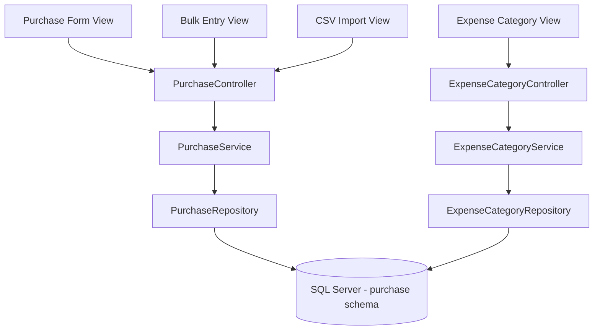
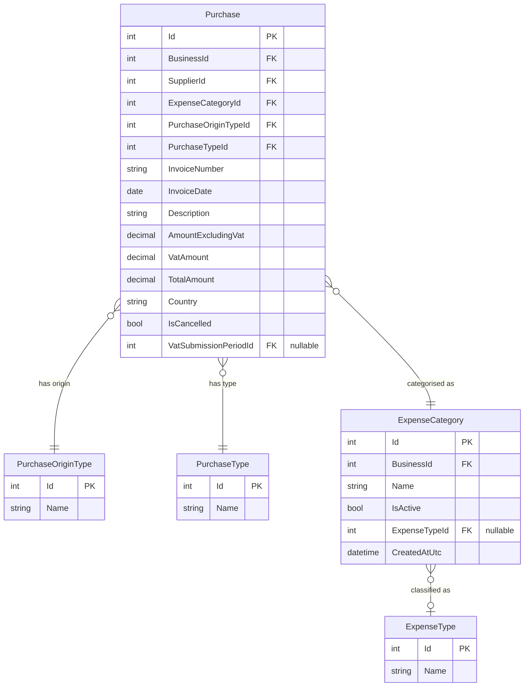

# Design Document: Purchase Classification Enhancements

## Overview

This feature extends the Portal's purchase classification system with three new dimensions:

1. **EU Paid Origin Type** — A fourth `PurchaseOriginType` entry (Id=4, "EuPaid") for EU purchases where VAT was actually charged and paid, distinct from EU Reverse Charge where VAT is zero.
2. **Expense Type on Expense Categories** — A new `ExpenseType` lookup table (Services/Goods) with a nullable FK on `ExpenseCategory`, enforced on new categories but optional for legacy data until edited.
3. **Purchase Type Classification** — A new `PurchaseType` lookup table (Asset/Stock/Expense) with a NOT NULL FK on `Purchase`, defaulting existing records to Expense (Id=3).

All changes propagate consistently across the single Purchase form, Bulk Entry form, CSV Import, Purchase List, and the Expense Category management UI.

### Design Decisions

| Decision | Rationale |
|----------|-----------|
| Extend existing `PurchaseOriginType` lookup with Id=4 | Maintains the established pattern; no schema redesign needed |
| `ExpenseTypeId` is nullable on `ExpenseCategory` | Allows backward compatibility with legacy categories created before this feature |
| `PurchaseTypeId` is NOT NULL with default of 3 (Expense) | Ensures data integrity; existing purchases get a sensible default via migration |
| Radio buttons for Purchase Type on single form, dropdown on bulk form | Matches existing UX patterns (origin type uses radio on single, dropdown on bulk) |
| Expense Type displayed as read-only on purchase forms | It's a property of the category, not the purchase — avoids data duplication |

## Architecture

The feature follows the established MVC + Service Layer pattern:

```
Controller (PurchaseController, ExpenseCategoryController)
    ↓
Service (PurchaseService, ExpenseCategoryService)
    ↓
Repository (PurchaseRepository, ExpenseCategoryRepository)
    ↓
Database ([purchase] schema — SQL Server)
```

### Affected Layers



### Key Architectural Constraints

- **Database-First**: New tables and columns are defined via SQL migration scripts, then EF Core entities are updated to match.
- **Tenant Scoping**: All queries filter by `BusinessId` from `ICurrentTenantService`.
- **Lookup Tables**: `PurchaseOriginType`, `ExpenseType`, and `PurchaseType` are system-wide (no `BusinessId`), seeded with static data.
- **Validation**: Service layer validates all business rules; controller performs only structural/format validation.

## Components and Interfaces

### New Entities

```csharp
// Portal.Infrastructure/Entities/ExpenseType.cs
public class ExpenseType
{
    public int Id { get; set; }
    public string Name { get; set; } = null!;
}

// Portal.Infrastructure/Entities/PurchaseType.cs
public class PurchaseType
{
    public int Id { get; set; }
    public string Name { get; set; } = null!;
}
```

### Modified Entities

```csharp
// Portal.Infrastructure/Entities/ExpenseCategory.cs — add:
public int? ExpenseTypeId { get; set; }
public ExpenseType? ExpenseType { get; set; }

// Portal.Infrastructure/Entities/Purchase.cs — add:
public int PurchaseTypeId { get; set; }
public PurchaseType PurchaseType { get; set; } = null!;
```

### Service Interface Changes

```csharp
// IPurchaseService — no new methods needed, but validation logic updates internally

// IExpenseCategoryService — add ExpenseTypeId to create/update flows
// The existing CreateExpenseCategoryAsync and UpdateExpenseCategoryAsync
// will now validate ExpenseTypeId presence on the entity.
```

### Controller Changes

**PurchaseController**:
- `ValidateBulkRow`: Extend validation range for `PurchaseOriginTypeId` from 1–3 to 1–4; add `PurchaseTypeId` validation (1–3).
- `ResolvePurchaseOriginTypeId`: Add "eupaid" / "eu paid" mappings → 4.
- `ParseCsvRow`: Support column 11 for PurchaseType (case-insensitive, defaults to "Expense").
- `MapFormToEntity`: Map `PurchaseTypeId` from view model.
- `BuildFormViewModelAsync`: Load `PurchaseType` lookup and `ExpenseType` data.

**ExpenseCategoryController**:
- `Create`: Accept `expenseTypeId` parameter; reject if missing.
- `Edit`: Accept `expenseTypeId` parameter; reject if missing.

### View Model Changes

```csharp
// PurchaseFormViewModel — add:
public int PurchaseTypeId { get; set; } = 3; // Default: Expense
public List<PurchaseType> PurchaseTypes { get; set; } = new();

// BulkPurchaseRowDto — add:
public int PurchaseTypeId { get; set; } = 3; // Default: Expense

// CsvPurchaseRowDto — add:
public string? PurchaseType { get; set; }
public int? ResolvedPurchaseTypeId { get; set; }
```

## Data Models

### New Tables

#### `[purchase].[ExpenseType]` (Lookup)

| Column | Type | Nullable | Notes |
|--------|------|----------|-------|
| Id | INT | NOT NULL | PK, not identity (seeded) |
| Name | NVARCHAR(50) | NOT NULL | "Services" or "Goods" |

Seed data:
- Id=1, Name="Services"
- Id=2, Name="Goods"

#### `[purchase].[PurchaseType]` (Lookup)

| Column | Type | Nullable | Notes |
|--------|------|----------|-------|
| Id | INT | NOT NULL | PK, not identity (seeded) |
| Name | NVARCHAR(50) | NOT NULL | "Asset", "Stock", or "Expense" |

Seed data:
- Id=1, Name="Asset"
- Id=2, Name="Stock"
- Id=3, Name="Expense"

### Modified Tables

#### `[purchase].[PurchaseOriginType]` — New Seed Row

| Id | Name |
|----|------|
| 4 | EuPaid |

#### `[purchase].[ExpenseCategory]` — New Column

| Column | Type | Nullable | Default | FK |
|--------|------|----------|---------|-----|
| ExpenseTypeId | INT | NULL | NULL | → [purchase].[ExpenseType](Id) |

#### `[purchase].[Purchase]` — New Column

| Column | Type | Nullable | Default | FK |
|--------|------|----------|---------|-----|
| PurchaseTypeId | INT | NOT NULL | 3 (Expense) | → [purchase].[PurchaseType](Id) |

### Migration Scripts

Three new migration scripts (continuing from 066):

1. **067_CreateExpenseTypeTable.sql** — Creates `[purchase].[ExpenseType]`, seeds Services/Goods, adds `ExpenseTypeId` FK to `[purchase].[ExpenseCategory]`.
2. **068_CreatePurchaseTypeTable.sql** — Creates `[purchase].[PurchaseType]`, seeds Asset/Stock/Expense, adds `PurchaseTypeId` column to `[purchase].[Purchase]` with default 3, adds FK constraint.
3. **069_AddEuPaidOriginType.sql** — Inserts Id=4 "EuPaid" into `[purchase].[PurchaseOriginType]`.

### Entity Relationship Diagram




## Correctness Properties

*A property is a characteristic or behavior that should hold true across all valid executions of a system — essentially, a formal statement about what the system should do. Properties serve as the bridge between human-readable specifications and machine-verifiable correctness guarantees.*

### Property 1: Origin Type Validation Range

*For any* purchase with a `PurchaseOriginTypeId` value in {1, 2, 3, 4} and otherwise valid fields, the service validation SHALL accept the purchase. *For any* `PurchaseOriginTypeId` value outside {1, 2, 3, 4} (e.g., 0, 5, -1, 99), the service validation SHALL reject the purchase.

**Validates: Requirements 6.1**

### Property 2: Country Required for Non-Domestic Origin Types

*For any* purchase with `PurchaseOriginTypeId` in {2, 3, 4} (EU Reverse Charge, Non-EU, EU Paid) and an empty or null `Country` value, the service validation SHALL reject the purchase. *For any* purchase with `PurchaseOriginTypeId` in {2, 3, 4} and a non-empty `Country` value (with otherwise valid fields), the service validation SHALL accept the purchase.

**Validates: Requirements 1.3, 1.5, 6.3**

### Property 3: TotalAmount Computation by Origin Type

*For any* purchase with valid `AmountExcludingVat` (> 0) and valid `VatAmount` (≥ 0):
- If `PurchaseOriginTypeId` is 2 (EU Reverse Charge), then after applying origin type logic, `VatAmount` SHALL be 0 and `TotalAmount` SHALL equal `AmountExcludingVat`.
- If `PurchaseOriginTypeId` is 1, 3, or 4 (Domestic, Non-EU, EU Paid), then after applying origin type logic, `TotalAmount` SHALL equal `AmountExcludingVat + VatAmount`.

**Validates: Requirements 6.2**

### Property 4: CSV Origin Type Resolver

*For any* case variation of the strings "EuPaid", "eu paid", or "eupaid", the `ResolvePurchaseOriginTypeId` function SHALL return 4. The existing mappings for "Domestic" → 1, "EuReverseCharge"/"eu reverse charge"/"eurc"/"eu rc" → 2, and "NonEu"/"non-eu"/"non eu" → 3 SHALL continue to resolve correctly. *For any* string that does not match a known origin type name, the function SHALL return null.

**Validates: Requirements 1.9, 6.5**

### Property 5: CSV PurchaseType Resolver

*For any* case variation of "Asset", the PurchaseType resolver SHALL return 1. *For any* case variation of "Stock", it SHALL return 2. *For any* case variation of "Expense", it SHALL return 3. *For any* empty, null, or absent value, it SHALL default to 3 (Expense). *For any* unrecognised string, it SHALL return null (invalid).

**Validates: Requirements 6.6**

### Property 6: PurchaseTypeId Validation Range

*For any* purchase with a `PurchaseTypeId` value in {1, 2, 3} and otherwise valid fields, the service validation SHALL accept the purchase. *For any* `PurchaseTypeId` value outside {1, 2, 3} (e.g., 0, 4, -1), the service validation SHALL reject the purchase.

**Validates: Requirements 3.3, 3.4, 6.4**

### Property 7: ExpenseTypeId Required on Category Save

*For any* expense category creation or update where `ExpenseTypeId` is null or not in {1, 2}, the service SHALL reject the operation. *For any* expense category creation or update where `ExpenseTypeId` is in {1, 2} (with otherwise valid fields), the service SHALL accept and persist the value.

**Validates: Requirements 2.3, 2.4, 2.7**

### Property 8: Form Mapping Consistency

*For any* valid purchase input data (SupplierId, ExpenseCategoryId, PurchaseOriginTypeId, PurchaseTypeId, InvoiceDate, InvoiceNumber, Description, AmountExcludingVat, VatAmount, Country), mapping through the single-form path (`MapFormToEntity`) and the bulk-entry path SHALL produce `Purchase` entities with identical values for all user-entered fields.

**Validates: Requirements 4.5**

### Property 9: Purchase Type Filtering

*For any* list of purchases and a selected `PurchaseTypeId` filter value in {1, 2, 3}, the filtered result SHALL contain only purchases whose `PurchaseTypeId` matches the filter value, and SHALL contain all such matching purchases from the original list.

**Validates: Requirements 5.4**

## Error Handling

### Service Layer Errors

| Scenario | Error Response | HTTP Status |
|----------|---------------|-------------|
| Invalid PurchaseOriginTypeId (not 1–4) | `{ success: false, message: "Invalid purchase origin type." }` | 200 (JSON) |
| Invalid PurchaseTypeId (not 1–3) | `{ success: false, message: "Purchase type is required. Select Asset, Stock, or Expense." }` | 200 (JSON) |
| Missing Country for EU Paid | `{ success: false, message: "Country is required for EU Paid purchases." }` | 200 (JSON) |
| Missing ExpenseTypeId on category save | `{ success: false, message: "Expense Type is required. Select Services or Goods." }` | 200 (JSON) |
| Bulk entry with mixed errors | `{ success: false, message: "N row(s) have validation errors.", errors: [...] }` | 200 (JSON) |
| CSV import with unrecognised PurchaseType | Row marked invalid with error message; user can correct before confirming | 200 (JSON) |

### Error Handling Patterns

- **Repository layer**: try/catch with `throw;` (rethrow to preserve stack trace).
- **Service layer**: Returns `ServiceResult.Fail(message)` for business rule violations; exceptions propagate for infrastructure failures.
- **Controller layer**: Catches service failures and returns `Json(new { success = false, message })`.
- **UI layer**: SweetAlert2 displays error messages; BlockUI is always hidden in both success and error paths.

### Migration Safety

- All migration scripts are idempotent (use `IF NOT EXISTS` checks).
- The `PurchaseTypeId` column is added with `DEFAULT (3)` so existing rows are automatically populated.
- The `ExpenseTypeId` column is nullable, so no existing `ExpenseCategory` rows are affected.
- The new `PurchaseOriginType` seed row (Id=4) uses an explicit Id, avoiding identity conflicts.

## Testing Strategy

### Property-Based Tests (fast-check)

The project will use **fast-check** (JavaScript/TypeScript PBT library) for property-based testing of the pure logic functions extracted from the service layer. Each property test runs a minimum of 100 iterations.

**Target functions for PBT:**
- `ResolvePurchaseOriginTypeId(string)` — pure function, string → int?
- `ResolvePurchaseTypeId(string)` — new pure function, string → int?
- `ApplyOriginTypeLogic(Purchase)` — pure mutation function
- `ValidatePurchaseOriginTypeId(int)` — range check
- `ValidatePurchaseTypeId(int)` — range check
- `ValidateCountryForOriginType(int originTypeId, string? country)` — conditional validation
- `ValidateExpenseTypeId(int?)` — nullable range check
- Purchase type filtering logic

Each property test is tagged with:
```
// Feature: purchase-classification-enhancements, Property {N}: {property_text}
```

### Unit Tests (xUnit)

Example-based tests for:
- Controller action responses (correct JSON structure)
- View model population (dropdowns contain all options in correct order)
- CSV parsing with column 11 (PurchaseType) present and absent
- Edit form pre-population with existing PurchaseTypeId
- Inline expense category creation with ExpenseType selection
- EU Paid badge rendering in purchase list

### Integration Tests

- End-to-end purchase creation via single form with EU Paid origin type
- End-to-end bulk entry with mixed origin types including EU Paid
- CSV import with PurchaseType column present/absent
- VAT period assignment for EU Paid purchases (VatAmount included in input VAT)
- Migration verification: existing purchases have PurchaseTypeId=3 after migration

### Test Configuration

- Property tests: minimum 100 iterations per property
- Unit tests: xUnit with Moq for service/repository mocking
- Integration tests: use in-memory database or test SQL Server instance
- All tests run in CI pipeline before merge
