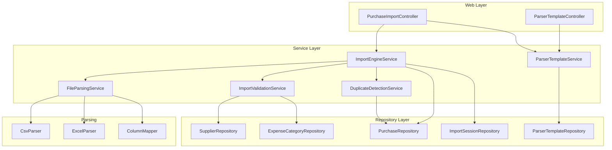
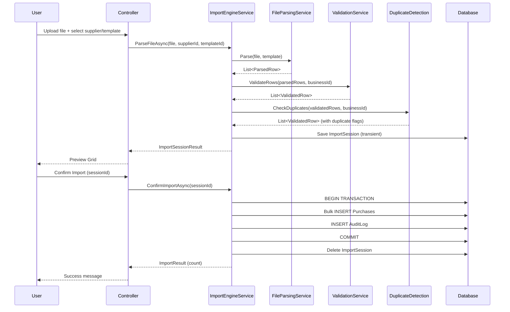

# Design Document: Purchase Import Automation

## Overview

Purchase Import Automation provides a self-service bulk import workflow for recording purchases from supplier-provided CSV and Excel files. The feature replaces the manual SQL-script-based process with a three-step user flow: **Upload → Preview & Review → Confirm Import**.

The system uses configurable parser templates to handle diverse supplier file formats. Each template defines column mappings, header/data row positions, and format-specific settings (date patterns, decimal separators). Supplier profiles store default values (expense category, origin type, country) so recurring imports auto-populate fields not present in the file.

The feature is gated behind the Professional+ subscription tier (module key: `purchase_import`) and supports platform-admin-managed templates as a service offering.

**Key design goals:**
- Zero-touch recurring imports (template + defaults = no manual mapping)
- Comprehensive validation with inline preview editing
- Advisory duplicate detection (non-blocking)
- Transactional bulk insert with full audit trail
- RFC 4180-compliant CSV parsing

## Architecture

The feature follows the existing Controller → Service → Repository layering. New components live in a dedicated `[import]` SQL schema and follow established patterns.



### Request Flow



## Components and Interfaces

### Controllers

**PurchaseImportController** — Handles the import workflow UI and AJAX endpoints.

```csharp
[Authorize]
[ModuleAccess(PortalModules.PurchaseImport)]
public class PurchaseImportController : Controller
{
    // Page actions
    public IActionResult Index();                    // Upload page (Step 1)
    public IActionResult Preview(int sessionId);     // Preview page (Step 2)

    // AJAX endpoints
    [HttpPost] public Task<IActionResult> AxPostParseFile(IFormFile file, int supplierId, int? templateId);
    [HttpPost] public Task<IActionResult> AxPostConfirmImport(int sessionId);
    [HttpPost] public Task<IActionResult> AxPostUpdateRow(int sessionId, int rowIndex, string field, string value);
    [HttpPost] public Task<IActionResult> AxPostRemoveRow(int sessionId, int rowIndex);
}
```

**ParserTemplateController** — CRUD for parser templates (separate from import flow).

```csharp
[Authorize]
[ModuleAccess(PortalModules.PurchaseImport)]
public class ParserTemplateController : Controller
{
    public IActionResult Index();                     // Template list (Step 3 tab)
    [HttpPost] public Task<IActionResult> AxPostCreateTemplate(ParserTemplateFormModel model);
    [HttpPost] public Task<IActionResult> AxPostUpdateTemplate(ParserTemplateFormModel model);
    [HttpPost] public Task<IActionResult> AxPostDeleteTemplate(int templateId);
}
```

### Services

**IImportEngineService** — Orchestrates the full import lifecycle.

```csharp
public interface IImportEngineService
{
    Task<ServiceResult<ImportSessionResult>> ParseFileAsync(Stream fileStream, string fileName, int supplierId, int? templateId);
    Task<ServiceResult<ImportSessionResult>> RevalidateRowAsync(int sessionId, int rowIndex, string field, string value);
    Task<ServiceResult> RemoveRowAsync(int sessionId, int rowIndex);
    Task<ServiceResult<ImportConfirmationResult>> ConfirmImportAsync(int sessionId);
}
```

**IFileParsingService** — Low-level file parsing (CSV/Excel) using templates.

```csharp
public interface IFileParsingService
{
    List<ParsedRow> ParseCsv(Stream stream, ParserTemplate template);
    List<ParsedRow> ParseExcel(Stream stream, ParserTemplate template);
    List<ParsedRow> AutoDetectAndParse(Stream stream, string fileExtension);
}
```

**IImportValidationService** — Row-level validation against business rules.

```csharp
public interface IImportValidationService
{
    Task<List<ValidatedRow>> ValidateRowsAsync(List<ParsedRow> rows, int supplierId, int businessId);
    Task<ValidatedRow> ValidateRowAsync(ParsedRow row, int supplierId, int businessId);
}
```

**IDuplicateDetectionService** — Advisory duplicate checking.

```csharp
public interface IDuplicateDetectionService
{
    Task<List<DuplicateCheckResult>> CheckDuplicatesAsync(List<ValidatedRow> rows, int businessId);
}
```

**IParserTemplateService** — Template CRUD and resolution.

```csharp
public interface IParserTemplateService
{
    Task<List<ParserTemplate>> GetTemplatesForSupplierAsync(int supplierId);
    Task<ParserTemplate?> GetTemplateByIdAsync(int templateId);
    Task<ServiceResult<int>> CreateTemplateAsync(ParserTemplate template);
    Task<ServiceResult> UpdateTemplateAsync(ParserTemplate template);
    Task<ServiceResult> DeleteTemplateAsync(int templateId);
}
```

### Parsing Components

**CsvParser** — RFC 4180-compliant CSV parser.
- Handles quoted fields with embedded commas, newlines, and escaped quotes
- Preserves whitespace in quoted fields
- Trims whitespace in unquoted fields
- Configurable field delimiter (defaults to comma)

**ExcelParser** — Excel file reader using ClosedXML (MIT-licensed).
- Reads specified worksheet (or first by default)
- Supports .xlsx and .xls formats
- Extracts cell values with type-aware conversion

**ColumnMapper** — Applies column mappings to raw row data.
- Resolves source columns by header name or positional index
- Applies date format parsing using configured patterns
- Applies decimal parsing using configured separator (period/comma)
- Skips columns marked as "skip"

### Libraries

| Library | Purpose | License |
|---------|---------|---------|
| ClosedXML | Excel parsing (.xlsx) | MIT |
| ExcelDataReader | Excel parsing (.xls legacy) | MIT |
| CsvHelper (optional) | CSV parsing reference, but custom RFC 4180 parser preferred for round-trip property | Dual MS-PL/Apache-2.0 |

**Decision**: Use a custom CSV parser for the core parsing logic rather than CsvHelper. This gives us full control over RFC 4180 compliance and enables the round-trip property (format→parse→format). ClosedXML handles Excel formats.

## Data Models

### New Schema: [import]

```sql
CREATE SCHEMA [import]
GO
```

### ParserTemplate Table

```sql
CREATE TABLE [import].[ParserTemplate] (
    [Id]                INT IDENTITY(1,1) NOT NULL,
    [BusinessId]        INT NOT NULL,
    [SupplierId]        INT NOT NULL,
    [Name]              NVARCHAR(200) NOT NULL,
    [FileFormatType]    NVARCHAR(10) NOT NULL,          -- 'CSV' or 'Excel'
    [HeaderRow]         INT NOT NULL DEFAULT 1,
    [DataStartRow]      INT NOT NULL DEFAULT 2,
    [SheetName]         NVARCHAR(100) NULL,             -- Excel only
    [ColumnMappingsJson] NVARCHAR(MAX) NOT NULL,        -- JSON array of mappings
    [IsManaged]         BIT NOT NULL DEFAULT 0,
    [IsActive]          BIT NOT NULL DEFAULT 1,
    [CreatedAtUtc]      DATETIME NOT NULL DEFAULT GETUTCDATE(),
    [UpdatedAtUtc]      DATETIME NOT NULL DEFAULT GETUTCDATE(),
    CONSTRAINT [PK_ParserTemplate] PRIMARY KEY ([Id]),
    CONSTRAINT [FK_ParserTemplate_Business] FOREIGN KEY ([BusinessId]) REFERENCES [dbo].[Business]([Id]),
    CONSTRAINT [FK_ParserTemplate_Supplier] FOREIGN KEY ([SupplierId]) REFERENCES [purchase].[Supplier]([Id])
);
```

### ColumnMappingsJson Schema (stored as JSON)

```json
[
    {
        "sourceColumn": "Date",
        "sourceIndex": null,
        "targetField": "InvoiceDate",
        "format": "dd/MM/yyyy",
        "isSkipped": false
    },
    {
        "sourceColumn": "Amount",
        "sourceIndex": null,
        "targetField": "AmountExcludingVat",
        "format": ".",
        "isSkipped": false
    },
    {
        "sourceColumn": "Tax",
        "sourceIndex": null,
        "targetField": "VatAmount",
        "format": ".",
        "isSkipped": false
    }
]
```

### SupplierImportProfile Table

```sql
CREATE TABLE [import].[SupplierImportProfile] (
    [Id]                    INT IDENTITY(1,1) NOT NULL,
    [BusinessId]            INT NOT NULL,
    [SupplierId]            INT NOT NULL,
    [DefaultExpenseCategoryId]   INT NULL,
    [DefaultPurchaseOriginTypeId] INT NULL,
    [DefaultCountry]        NVARCHAR(100) NULL,
    [CreatedAtUtc]          DATETIME NOT NULL DEFAULT GETUTCDATE(),
    [UpdatedAtUtc]          DATETIME NOT NULL DEFAULT GETUTCDATE(),
    CONSTRAINT [PK_SupplierImportProfile] PRIMARY KEY ([Id]),
    CONSTRAINT [FK_SupplierImportProfile_Business] FOREIGN KEY ([BusinessId]) REFERENCES [dbo].[Business]([Id]),
    CONSTRAINT [FK_SupplierImportProfile_Supplier] FOREIGN KEY ([SupplierId]) REFERENCES [purchase].[Supplier]([Id]),
    CONSTRAINT [FK_SupplierImportProfile_ExpenseCategory] FOREIGN KEY ([DefaultExpenseCategoryId]) REFERENCES [purchase].[ExpenseCategory]([Id]),
    CONSTRAINT [FK_SupplierImportProfile_OriginType] FOREIGN KEY ([DefaultPurchaseOriginTypeId]) REFERENCES [purchase].[PurchaseOriginType]([Id]),
    CONSTRAINT [UQ_SupplierImportProfile_Business_Supplier] UNIQUE ([BusinessId], [SupplierId])
);
```

### ImportSession Table

Import sessions are transient — they hold parsed data during the review step and are deleted after confirmation or timeout.

```sql
CREATE TABLE [import].[ImportSession] (
    [Id]                INT IDENTITY(1,1) NOT NULL,
    [BusinessId]        INT NOT NULL,
    [SupplierId]        INT NOT NULL,
    [ParserTemplateId]  INT NULL,
    [FileName]          NVARCHAR(500) NOT NULL,
    [TotalRows]         INT NOT NULL,
    [ValidRows]         INT NOT NULL,
    [InvalidRows]       INT NOT NULL,
    [RowDataJson]       NVARCHAR(MAX) NOT NULL,         -- JSON: validated rows with status
    [IsConfirmed]       BIT NOT NULL DEFAULT 0,
    [CreatedAtUtc]      DATETIME NOT NULL DEFAULT GETUTCDATE(),
    CONSTRAINT [PK_ImportSession] PRIMARY KEY ([Id]),
    CONSTRAINT [FK_ImportSession_Business] FOREIGN KEY ([BusinessId]) REFERENCES [dbo].[Business]([Id]),
    CONSTRAINT [FK_ImportSession_Supplier] FOREIGN KEY ([SupplierId]) REFERENCES [purchase].[Supplier]([Id]),
    CONSTRAINT [FK_ImportSession_Template] FOREIGN KEY ([ParserTemplateId]) REFERENCES [import].[ParserTemplate]([Id])
);
```

### C# Entity Models

```csharp
public class ParserTemplate
{
    public int Id { get; set; }
    public int BusinessId { get; set; }
    public int SupplierId { get; set; }
    public string Name { get; set; } = null!;
    public string FileFormatType { get; set; } = null!;  // "CSV" or "Excel"
    public int HeaderRow { get; set; } = 1;
    public int DataStartRow { get; set; } = 2;
    public string? SheetName { get; set; }
    public string ColumnMappingsJson { get; set; } = null!;
    public bool IsManaged { get; set; }
    public bool IsActive { get; set; } = true;
    public DateTime CreatedAtUtc { get; set; }
    public DateTime UpdatedAtUtc { get; set; }

    // Navigation
    public Business Business { get; set; } = null!;
    public Supplier Supplier { get; set; } = null!;
}

public class SupplierImportProfile
{
    public int Id { get; set; }
    public int BusinessId { get; set; }
    public int SupplierId { get; set; }
    public int? DefaultExpenseCategoryId { get; set; }
    public int? DefaultPurchaseOriginTypeId { get; set; }
    public string? DefaultCountry { get; set; }
    public DateTime CreatedAtUtc { get; set; }
    public DateTime UpdatedAtUtc { get; set; }

    // Navigation
    public Business Business { get; set; } = null!;
    public Supplier Supplier { get; set; } = null!;
    public ExpenseCategory? DefaultExpenseCategory { get; set; }
    public PurchaseOriginType? DefaultPurchaseOriginType { get; set; }
}

public class ImportSession
{
    public int Id { get; set; }
    public int BusinessId { get; set; }
    public int SupplierId { get; set; }
    public int? ParserTemplateId { get; set; }
    public string FileName { get; set; } = null!;
    public int TotalRows { get; set; }
    public int ValidRows { get; set; }
    public int InvalidRows { get; set; }
    public string RowDataJson { get; set; } = null!;
    public bool IsConfirmed { get; set; }
    public DateTime CreatedAtUtc { get; set; }

    // Navigation
    public Business Business { get; set; } = null!;
    public Supplier Supplier { get; set; } = null!;
    public ParserTemplate? ParserTemplate { get; set; }
}
```

### Intermediate DTOs

```csharp
/// <summary>
/// A single column mapping entry within a parser template.
/// </summary>
public class ColumnMapping
{
    public string? SourceColumn { get; set; }       // Header name (null if using index)
    public int? SourceIndex { get; set; }           // Zero-based positional index
    public string TargetField { get; set; } = null!; // e.g., "InvoiceDate"
    public string? Format { get; set; }             // Date pattern or decimal separator
    public bool IsSkipped { get; set; }
}

/// <summary>
/// A row extracted from the uploaded file before validation.
/// </summary>
public class ParsedRow
{
    public int RowNumber { get; set; }
    public DateOnly? InvoiceDate { get; set; }
    public string? InvoiceNumber { get; set; }
    public string? Description { get; set; }
    public decimal? AmountExcludingVat { get; set; }
    public decimal? VatAmount { get; set; }
    public decimal? TotalAmount { get; set; }
    public string? PurchaseOriginTypeName { get; set; }
    public int? PurchaseOriginTypeId { get; set; }
    public string? Country { get; set; }
    public string? Notes { get; set; }
    public string? ExpenseCategoryName { get; set; }
    public int? ExpenseCategoryId { get; set; }
    public Dictionary<string, string> RawValues { get; set; } = new();
}

/// <summary>
/// A parsed row after validation, with status and error messages.
/// </summary>
public class ValidatedRow
{
    public ParsedRow Data { get; set; } = null!;
    public RowValidationStatus Status { get; set; }
    public List<string> Errors { get; set; } = new();
    public List<string> Warnings { get; set; } = new();
    public bool IsDuplicate { get; set; }
    public bool IsRemoved { get; set; }
}

public enum RowValidationStatus
{
    Valid,
    Warning,
    Invalid
}

/// <summary>
/// Result returned to the UI after parsing.
/// </summary>
public class ImportSessionResult
{
    public int SessionId { get; set; }
    public int TotalRows { get; set; }
    public int ValidRows { get; set; }
    public int InvalidRows { get; set; }
    public int WarningRows { get; set; }
    public decimal BatchTotal { get; set; }
    public List<ValidatedRow> Rows { get; set; } = new();
}

/// <summary>
/// Result after successful import confirmation.
/// </summary>
public class ImportConfirmationResult
{
    public int ImportedCount { get; set; }
    public decimal TotalAmount { get; set; }
}
```

### Target Fields Enum

```csharp
public static class ImportTargetFields
{
    public const string InvoiceDate = "InvoiceDate";
    public const string InvoiceNumber = "InvoiceNumber";
    public const string Description = "Description";
    public const string AmountExcludingVat = "AmountExcludingVat";
    public const string VatAmount = "VatAmount";
    public const string TotalAmount = "TotalAmount";
    public const string PurchaseOriginType = "PurchaseOriginType";
    public const string Country = "Country";
    public const string Notes = "Notes";

    public static readonly string[] Required = { InvoiceDate, AmountExcludingVat };
    public static readonly string[] RequiredAlternate = { InvoiceDate, TotalAmount };

    public static readonly string[] All =
    {
        InvoiceDate, InvoiceNumber, Description, AmountExcludingVat,
        VatAmount, TotalAmount, PurchaseOriginType, Country, Notes
    };
}
```

## Correctness Properties

*A property is a characteristic or behavior that should hold true across all valid executions of a system — essentially, a formal statement about what the system should do. Properties serve as the bridge between human-readable specifications and machine-verifiable correctness guarantees.*

### Property 1: File Extension Validation

*For any* filename string, the file upload validation result (accept/reject) shall equal whether the file's extension (case-insensitive) is a member of the set {csv, xlsx, xls}.

**Validates: Requirements 1.1, 1.2**

### Property 2: Parser Template Round-Trip

*For any* valid parser template configuration (name, supplier, format type, header row, data start row, and column mappings list), persisting the template and then retrieving it shall produce an equivalent configuration with all fields preserved.

**Validates: Requirements 2.2**

### Property 3: Column Mapping Resolution

*For any* column mapping that specifies either a source header name or a source positional index, and *for any* row of source data containing that header/position, applying the mapping shall extract the value from the correct source column.

**Validates: Requirements 2.3**

### Property 4: Supplier Profile Default Resolution

*For any* parsed row and *for any* supplier import profile, the resolved value for each defaultable field (ExpenseCategoryId, PurchaseOriginTypeId, Country) shall equal the file-provided value when present, or the supplier profile default when the file value is absent.

**Validates: Requirements 4.2, 4.3, 4.4, 4.5**

### Property 5: Origin-Type Validation Constraints

*For any* parsed row where PurchaseOriginTypeId resolves to EU Reverse Charge (2), validation shall fail if VatAmount > 0 OR Country is empty. *For any* parsed row where PurchaseOriginTypeId resolves to Non-EU (3), validation shall fail if Country is empty.

**Validates: Requirements 5.7, 5.8**

### Property 6: Expense Category Case-Insensitive Resolution

*For any* active expense category name belonging to a business, and *for any* casing variant of that name (upper, lower, mixed), category resolution shall return the same ExpenseCategoryId.

**Validates: Requirements 5.6**

### Property 7: TotalAmount Computation Invariant

*For any* parsed row where TotalAmount is not explicitly provided by the source file, the computed TotalAmount shall equal AmountExcludingVat + VatAmount.

**Validates: Requirements 5.9**

### Property 8: Duplicate Detection

*For any* import row and *for any* set of existing Purchase records belonging to the same business, the row shall be flagged as a potential duplicate if and only if there exists an existing Purchase with matching SupplierId, InvoiceNumber, InvoiceDate, and TotalAmount.

**Validates: Requirements 10.1, 10.2**

### Property 9: CSV Round-Trip

*For any* valid purchase row data, formatting the row as a CSV line and then parsing that line back shall produce values equivalent to the original row data.

**Validates: Requirements 11.2**

### Property 10: CSV Quoted Field Parsing (RFC 4180)

*For any* string value containing commas, newlines, or double-quote characters, when that value is properly quoted per RFC 4180 (enclosed in double quotes with internal quotes escaped as ""), parsing shall extract the original string value with leading/trailing whitespace preserved.

**Validates: Requirements 11.1, 11.3**

### Property 11: CSV Unquoted Field Trimming

*For any* string value with leading or trailing whitespace, when that value appears as an unquoted CSV field, parsing shall produce the trimmed version of the string.

**Validates: Requirements 11.4**

### Property 12: Preview Summary Invariant

*For any* import session, the TotalRows count shall equal ValidRows + InvalidRows (where warning rows are counted as valid for import purposes).

**Validates: Requirements 6.6**

### Property 13: Required Field Validation

*For any* set of column mappings that does not include at least one mapping to InvoiceDate AND at least one mapping to either AmountExcludingVat or TotalAmount, template validation shall report an error identifying the missing required field(s).

**Validates: Requirements 3.6, 3.7**

### Property 14: Date Format Round-Trip

*For any* valid DateOnly value and *for any* supported date format pattern (dd/MM/yyyy, yyyy-MM-dd, MM/dd/yyyy), formatting the date with that pattern and then parsing with the same pattern shall produce the original date.

**Validates: Requirements 3.2**

### Property 15: Decimal Separator Round-Trip

*For any* positive decimal value (up to 2 decimal places) and *for either* decimal separator (period or comma), formatting the value with that separator and then parsing with the same separator shall produce the original decimal value.

**Validates: Requirements 3.3**

## Error Handling

### File Upload Errors

| Error Condition | User Message | HTTP Status |
|----------------|--------------|-------------|
| Unsupported extension | "Only CSV, XLSX, and XLS files are accepted." | 400 |
| File exceeds 5 MB | "File size exceeds the 5 MB limit." | 400 |
| File exceeds 500 rows | "File contains more than 500 data rows." | 400 |
| No file provided | "Please select a file to upload." | 400 |
| Corrupted/unreadable file | "The file could not be read. Please verify the format." | 400 |

### Parsing Errors

| Error Condition | Handling |
|----------------|----------|
| Header row not found | Return error: "Header row {n} not found. File has fewer rows." |
| Column mapping mismatch | Mark row invalid with specific field error |
| Date parse failure | Mark row invalid: "Invalid date format in row {n}. Expected: {pattern}" |
| Numeric parse failure | Mark row invalid: "Invalid number in row {n}, column '{name}'" |
| Required field missing | Mark row invalid: "{FieldName} is required" |

### Validation Errors (Row-Level)

Row validation errors are non-fatal — they appear in the preview grid for user correction. Only rows that remain invalid after user review are excluded from the confirmed import.

| Rule | Error Message |
|------|--------------|
| InvoiceDate is not a valid date | "Invalid invoice date" |
| AmountExcludingVat <= 0 | "Amount must be greater than zero" |
| VatAmount < 0 | "VAT amount cannot be negative" |
| EU Reverse Charge with VAT > 0 | "EU Reverse Charge purchases must have zero VAT" |
| EU RC / Non-EU without Country | "Country is required for this origin type" |
| Expense category not found | "Category '{name}' not found" |

### Transaction Errors

If the bulk insert transaction fails:
- All inserts are rolled back (no partial data)
- Error logged to audit system
- User receives: "Import failed. No records were created. Please try again."
- Import session is preserved (not deleted) so the user can retry

### Session Cleanup

- Sessions older than 24 hours are cleaned up by a background job (or on next access)
- Confirmed sessions are deleted immediately after successful import
- Manual cancellation deletes the session

## Testing Strategy

### Property-Based Tests (FsCheck + xUnit)

The feature has 15 correctness properties suitable for property-based testing. Each will be implemented as a dedicated test class using FsCheck with minimum 100 iterations per property.

**Library**: FsCheck.Xunit (already in project)

**Test tag format**: `// Feature: purchase-import-automation, Property {n}: {title}`

Properties to implement:
1. File extension validation (pure function)
2. Parser template persistence round-trip (in-memory EF Core)
3. Column mapping resolution (pure function)
4. Supplier profile default resolution (pure function)
5. Origin-type validation constraints (pure function)
6. Expense category case-insensitive resolution (in-memory DB)
7. TotalAmount computation invariant (pure function)
8. Duplicate detection (in-memory DB)
9. CSV round-trip (pure function — highest value)
10. CSV quoted field parsing (pure function)
11. CSV unquoted field trimming (pure function)
12. Preview summary invariant (pure function)
13. Required field validation (pure function)
14. Date format round-trip (pure function)
15. Decimal separator round-trip (pure function)

### Unit Tests (xUnit)

Focus on specific examples and edge cases not covered by properties:
- Template CRUD operations (create, update, delete)
- Managed template access control (business user cannot edit)
- Auto-detection header matching
- Excel worksheet selection (first vs named)
- File size boundary (exactly 5 MB, 5 MB + 1 byte)
- Row count boundary (500, 501)
- Subscription tier gating (Foundation → 403)
- Import confirmation with zero valid rows → rejection
- Audit log entry creation after successful import

### Integration Tests

- Full upload → parse → preview → confirm flow with in-memory database
- Transaction rollback on simulated DB failure
- Multi-tenant isolation (BusinessId scoping)
- Concurrent import sessions for same business

### Property Test Configuration

Each property test must:
- Run minimum 100 iterations (`MaxTest = 100`)
- Reference the design property in a comment
- Use custom generators for domain-specific types (DateOnly, decimal amounts, CSV content)
- Mock external dependencies (DB, file system) for pure logic tests
