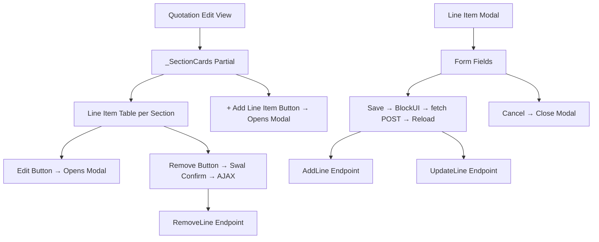

# Design Document: Quotation Edit Modal Lines

## Overview

This design transforms the Quotation Edit view's line item management from dense inline forms into a clean two-layer interface: a compact, scannable table for viewing and a centered modal for editing/creating. The approach eliminates visual overload when quotations have many line items, while preserving all existing backend endpoints and AJAX patterns.

The redesign is scoped exclusively to the Edit view (`/Quotation/Edit/{id}`). The Create view remains unchanged.

### Design Decisions

1. **Single shared modal for Add and Edit** — One `<div>` serves both modes, populated dynamically via JS. This reduces DOM size and ensures consistent styling.
2. **Page reload after save** — Matches the existing pattern in `quotation-line-save.js`. No SPA-style partial DOM updates are needed since the current flow already reloads on AddLine and flashes on UpdateLine. For the modal redesign, both Add and Edit will reload on success for simplicity and data consistency.
3. **No backend changes** — The modal form submits to the same `AddLine`/`UpdateLine` endpoints using the same `FormData` shape. The antiforgery token is included as a hidden field.
4. **Reuse existing BlockUI + Swal patterns** — `BlockUI.show()` before fetch, `BlockUI.hide()` after response, `Swal.fire()` on error. Success triggers `location.reload()`.
5. **Catalog autocomplete in modal** — The existing autocomplete logic is re-bound when the modal opens in Add mode, targeting the modal's description field.

## Architecture

The feature is entirely frontend/view-layer. No new controllers, services, or database changes are required.



### File Changes

| File | Change Type | Description |
|------|-------------|-------------|
| `Views/Quotation/_SectionCards.cshtml` | Major rewrite | Replace inline forms with compact tables + "Add Line Item" buttons |
| `Views/Quotation/_LineItemModal.cshtml` | New partial | Modal HTML structure with form fields |
| `wwwroot/js/quotation-line-modal.js` | New file | Modal open/close, populate fields, form submission via AJAX |
| `wwwroot/css/quotation-line-modal.css` | New file | Modal styling, table styling within section cards |
| `Views/Quotation/Edit.cshtml` | Minor update | Include new partial and script/style references |

## Components and Interfaces

### 1. Line Item Table (Razor — `_SectionCards.cshtml`)

Each section card renders a `<table>` instead of a grid of inline forms.

**Table columns:**
| # | Column | Content | Style |
|---|--------|---------|-------|
| 1 | # | Row number (1-based within section) | Muted, narrow |
| 2 | Description | Description (bold) + Subtitle (muted, smaller, below) | Wide |
| 3 | Qty | `line.Quantity` formatted | Right-aligned |
| 4 | Unit Price | `line.UnitPrice` formatted with currency | Right-aligned |
| 5 | Discount | Dash if 0, green minus-prefixed amount if > 0 | Right-aligned |
| 6 | Total | `line.LineTotal` bold | Right-aligned |
| 7 | Actions | Edit button + Remove (×) button | Narrow |

**Section header:**
```html
<div class="section-header">
    <div>
        <h3>Section Name</h3>
        <span class="section-summary">{count} item(s) · Subtotal {currency}{amount}</span>
    </div>
    <div class="section-actions">
        <!-- reorder ↑↓, Edit Section, Remove — unchanged behaviour -->
    </div>
</div>
```

**"+ Add Line Item" button** sits below the table within each section card.

### 2. Line Item Modal (Razor — `_LineItemModal.cshtml`)

A fixed-position overlay with a centered card containing the full form.

**Structure:**
```html
<div id="lineItemModal" class="modal-overlay" style="display:none;">
    <div class="modal-card">
        <div class="modal-header">
            <h3 id="lineModalTitle">Edit Line Item</h3>
            <p id="lineModalSubtitle" class="muted">Update the details for this line item.</p>
        </div>
        <form id="lineItemForm" method="post">
            <!-- antiforgery token -->
            <input type="hidden" name="__RequestVerificationToken" />
            <input type="hidden" id="lineModalLineId" name="lineId" />
            <input type="hidden" id="lineModalSectionId" name="ProposalSectionId" />
            <input type="hidden" name="ProductCode" />
            
            <!-- Row 1: Description (full width) -->
            <!-- Row 2: Subtitle + Reference URL (2-col) -->
            <!-- Row 3: Qty, Unit Price, VAT%, Cost Price (4-col) -->
            <!-- Row 4: Discount, Discount Type, Move to Section (3-col) -->
            <!-- Advanced: Reverse Charge checkbox -->
        </form>
        <div class="modal-footer">
            <button id="lineModalSubmitBtn" type="button" class="btn btn-primary">Save Changes</button>
            <button type="button" class="btn btn-secondary" onclick="hideLineItemModal()">Cancel</button>
        </div>
    </div>
</div>
```

### 3. Modal JavaScript Module (`quotation-line-modal.js`)

**Public API:**
```javascript
// Opens modal in edit mode, pre-fills from data attributes
function showEditLineModal(lineId, sectionId)

// Opens modal in add mode with defaults
function showAddLineModal(sectionId)

// Closes modal without saving
function hideLineItemModal()
```

**Internal flow for submission:**
1. Gather form data from modal fields
2. Determine endpoint URL: `/Quotation/AddLine/{quotationId}` or `/Quotation/UpdateLine/{quotationId}/{lineId}`
3. Check if "Move to Section" changed (edit mode only) — if so, call `/api/sections/move-line` first
4. `BlockUI.show('Saving...')`
5. `fetch(url, { method: 'POST', body: formData })`
6. Parse JSON response
7. `BlockUI.hide()`
8. On success: `location.reload()`
9. On failure: `Swal.fire({ icon: 'error', ... })` — modal stays open

### 4. General Section Banner

The General section card includes an informational alert above its table:

```html
<div class="info-banner">
    <svg><!-- info icon --></svg>
    <span>The General section always appears at the bottom. Create a named section and move items to reorder.</span>
</div>
```

Styled with a muted background, soft border, and the info icon from the design system.

### 5. Remove Line Flow

The Remove button (×) on each table row triggers:
1. `Swal.fire({ title: 'Remove this line item?', ... showCancelButton: true, confirmButtonColor: '#C24A4A' })`
2. On confirm: `BlockUI.show()` → `fetch('/Quotation/RemoveLine/{quotationId}/{lineId}', { method: 'POST', body: formData with antiforgery })` → `BlockUI.hide()` → on success `location.reload()`, on error `Swal.fire({ icon: 'error', ... })`

## Data Models

No new backend models are required. The existing models serve all needs:

### Existing Models Used

| Model | Role in Feature |
|-------|-----------------|
| `QuotationEditViewModel` | Page-level view model with `DisplayLines`, `Sections`, totals |
| `QuotationLineDisplayViewModel` | Wraps `QuotationLine` with `ProductTypeName` |
| `QuotationLine` | Entity with all line fields (Description, Subtitle, Qty, UnitPrice, VatRate, Discount, DiscountType, CostPrice, ReferenceUrl, IsReverseCharge, ProposalSectionId, SortOrder) |
| `ProposalSection` | Section entity with Name, SortOrder, SectionType, etc. |

### Data Flow for Modal Population (Edit Mode)

Line item data is rendered as `data-*` attributes on each table row:
```html
<tr data-line-id="@line.Id"
    data-description="@line.Description"
    data-subtitle="@(line.Subtitle ?? "")"
    data-reference-url="@(line.ReferenceUrl ?? "")"
    data-quantity="@line.Quantity.ToString("G")"
    data-unit-price="@line.UnitPrice.ToString("G")"
    data-vat-rate="@line.VatRate.ToString("G")"
    data-discount="@line.Discount.ToString("G")"
    data-discount-type="@line.DiscountType"
    data-cost-price="@(line.CostPrice?.ToString("G") ?? "")"
    data-is-reverse-charge="@(line.IsReverseCharge ? "true" : "false")"
    data-product-code="@(line.ProductCode ?? "")"
    data-section-id="@(line.ProposalSectionId?.ToString() ?? "")">
```

The JS reads these attributes to populate the modal form fields when "Edit" is clicked.

### Computed Display Values

| Value | Formula | Display Location |
|-------|---------|------------------|
| Line Total | `Quantity × UnitPrice − DiscountAmount` | Table "Total" column |
| Discount Amount | If `DiscountType == "Percentage"`: `UnitPrice × Qty × (Discount / 100)`. If `"Fixed"`: `Discount` | Table "Discount" column |
| Section Subtotal | Sum of `LineTotal` for all lines in section | Section summary |
| Section Item Count | Count of lines in section | Section summary |

These are computed server-side (already available via `line.LineTotal`) and rendered directly in Razor. No client-side recalculation needed for the table.

## Correctness Properties

*A property is a characteristic or behavior that should hold true across all valid executions of a system — essentially, a formal statement about what the system should do. Properties serve as the bridge between human-readable specifications and machine-verifiable correctness guarantees.*

### Property 1: Line total computation correctness

*For any* line item with quantity > 0, unit price ≥ 0, discount ≥ 0, and discount type in {Percentage, Fixed}, the computed line total SHALL equal `quantity × unitPrice − discountAmount` where discountAmount is `unitPrice × quantity × (discount / 100)` for Percentage type, or `discount` for Fixed type.

**Validates: Requirements 1.5**

### Property 2: Discount display formatting

*For any* line item, if the discount value equals 0 the discount column SHALL render a dash character (`-`); if the discount value is greater than 0 the discount column SHALL render the computed discount amount prefixed with a minus sign (`-`), regardless of all other field values.

**Validates: Requirements 1.3, 1.4**

### Property 3: Modal pre-population round-trip

*For any* line item with arbitrary field values stored as data attributes on a table row, opening the Edit modal SHALL produce form field values identical to the source data attributes for all fields: description, subtitle, reference URL, quantity, unit price, VAT%, discount, discount type, cost price, reverse charge state, and current section.

**Validates: Requirements 2.1**

### Property 4: Section summary computation

*For any* section containing zero or more line items with arbitrary positive line totals, the section summary text SHALL display the exact item count and the sum of all line totals formatted to two decimal places with the business currency symbol.

**Validates: Requirements 4.2, 4.3**

### Property 5: Reverse charge toggle

*For any* initial VAT rate value, checking the Reverse Charge checkbox SHALL set the VAT% field to 0 and make it read-only; subsequently unchecking the Reverse Charge checkbox SHALL restore the VAT% field to its previous value and make it editable.

**Validates: Requirements 2.5**

## Error Handling

| Scenario | Behaviour |
|----------|-----------|
| AJAX save fails (network error, timeout) | `BlockUI.hide()` → `Swal.fire({ icon: 'error', text: 'Unable to reach the server...' })`. Modal remains open. |
| AJAX save returns `{ success: false }` | `BlockUI.hide()` → `Swal.fire({ icon: 'error', text: data.message })`. Modal remains open. |
| AJAX remove fails | `BlockUI.hide()` → `Swal.fire({ icon: 'error', text: data.message or fallback })`. |
| Move-to-section fails | `BlockUI.hide()` → `Swal.fire({ icon: 'error' })`. Modal remains open with selection reverted. |
| Form validation (required fields) | HTML5 `required` attribute prevents submission. Browser shows native validation tooltip. |
| Antiforgery token missing/expired | Server returns 400 → caught as `!response.ok` → error Swal displayed. |

**Timeout handling:** The fetch call uses an `AbortController` with a 30-second timeout (matching existing `quotation-line-save.js` pattern).

## Testing Strategy

### Unit Tests (Example-Based)

| Test | What it verifies |
|------|------------------|
| Table renders correct column count | 7 columns per row |
| Edit button opens modal with correct title | "Edit Line Item" + subtitle |
| Add button opens modal with correct title | "Add Line Item" + subtitle |
| Add mode pre-fills defaults | qty=1, discount=0, VAT=business default |
| Cancel closes modal without triggering fetch | No network call made |
| Reverse Charge toggle sets VAT to 0 and readonly | DOM state after click |
| Section summary shows "0 items" when empty | Correct text for empty sections |
| General section banner text is present | Informational text rendered |
| Remove button shows Swal confirm before AJAX | Swal.fire called with correct params |
| Modal overlay click closes modal | Event listener on background |

### Property-Based Tests

Property-based testing applies to the pure computation functions extracted for this feature:

- **Library**: fast-check (JavaScript)
- **Minimum iterations**: 100

| Property | Tag |
|----------|-----|
| Line total computation | `Feature: quotation-edit-modal-lines, Property 1: Line total equals qty × unitPrice − discountAmount` |
| Discount display formatting | `Feature: quotation-edit-modal-lines, Property 2: Zero discount shows dash, positive shows minus-prefixed amount` |
| Modal pre-population round-trip | `Feature: quotation-edit-modal-lines, Property 3: Edit button populates modal fields matching data attributes` |
| Section summary computation | `Feature: quotation-edit-modal-lines, Property 4: Summary shows correct count and sum of line totals` |
| Reverse charge VAT behaviour | `Feature: quotation-edit-modal-lines, Property 5: Reverse charge sets VAT to 0 and readonly` |

### Integration Tests

| Test | Scope |
|------|-------|
| AddLine endpoint accepts modal form data | POST with all fields → returns `{ success: true }` |
| UpdateLine endpoint accepts modal form data | POST with changed fields → returns `{ success: true }` |
| RemoveLine endpoint removes line | POST → line no longer in DB |
| Move-line endpoint reassigns section | POST → line.ProposalSectionId updated |

### Manual Testing

- Visual regression: compare table layout across 1, 5, 10+ line items
- Modal responsiveness on mobile viewport
- Keyboard navigation: Tab through modal fields, Escape to close
- Catalog autocomplete within modal description field
