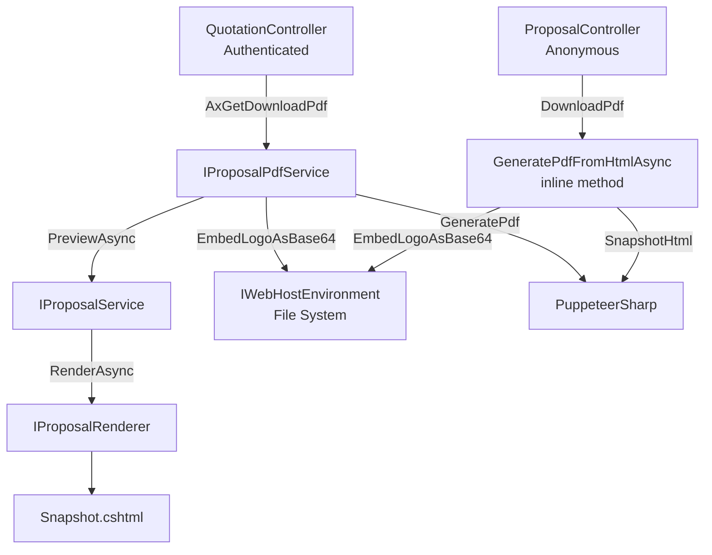

# Design Document: Quotation PDF Download

## Overview

This feature adds a dedicated PDF download capability for quotation proposals, replacing the current `window.print()` workaround on the Proposal Snapshot view. The design follows the established Invoice PDF Download pattern, introducing a new `IProposalPdfService` interface for decoupled, reusable PDF generation using PuppeteerSharp.

The feature provides PDF download from three access points:
1. **Authenticated**: Quotation Detail page button
2. **Authenticated**: Quotation Index page action link
3. **Anonymous**: Shared Proposal view (token-based)

### Design Rationale

- **Reuse over duplication**: A dedicated `IProposalPdfService` mirrors `IInvoicePdfService`, keeping PDF generation decoupled from controllers for future reuse (e.g., email attachments).
- **Existing infrastructure**: Leverages `IProposalService.PreviewAsync()` for HTML generation rather than duplicating rendering logic.
- **Consistent UX**: Same BlockUI → fetch → blob download → SweetAlert2 error pattern used across all PDF download flows in the application.

## Architecture



### Flow: Authenticated Download (Detail/Index pages)

1. User clicks "Download PDF" → JavaScript triggers `BlockUI.show('Generating PDF...')`
2. `fetch('/Quotation/AxGetDownloadPdf/{id}')` sends GET request
3. `QuotationController.AxGetDownloadPdf(int id)`:
   - Validates quotation exists and belongs to current business
   - Resolves primary logo for hero/meta parameters
   - Calls `IProposalPdfService.GenerateAsync(quotationId, heroLogoIds, metaLogoId, ct)`
   - Returns `File(pdfBytes, "application/pdf", filename)`
4. JavaScript receives blob → extracts filename from Content-Disposition → triggers download → `BlockUI.hide()`

### Flow: Anonymous Download (Shared Proposal)

1. Customer clicks "Download PDF" on shared proposal → `BlockUI.show('Generating PDF...')`
2. `fetch('/proposal/{token}/download-pdf')` sends GET request
3. `ProposalController.DownloadPdf(string token)`:
   - Validates token, active status, and expiry
   - Retrieves `SnapshotHtml` from `ProposalShare`
   - Removes `.download-bar` element from HTML
   - Embeds logos as base64 data URIs
   - Generates PDF using PuppeteerSharp (inline, same pattern as `InvoiceViewController`)
   - Returns `File(pdfBytes, "application/pdf", filename)`
4. JavaScript receives blob → triggers download → `BlockUI.hide()`

## Components and Interfaces

### IProposalPdfService (New Interface)

**Location**: `Portal.Infrastructure/Services/IProposalPdfService.cs`

```csharp
namespace Portal.Infrastructure.Services;

/// <summary>
/// Generates a PDF byte array for a given quotation proposal using the Snapshot view.
/// </summary>
public interface IProposalPdfService
{
    /// <summary>
    /// Renders the proposal snapshot to HTML and converts it to a PDF document.
    /// </summary>
    /// <param name="quotationId">The quotation identifier.</param>
    /// <param name="heroLogoIds">List of hero logo identifiers for the proposal header.</param>
    /// <param name="metaLogoId">Optional meta logo identifier.</param>
    /// <param name="cancellationToken">Optional cancellation token (30-second timeout applied by caller).</param>
    /// <returns>PDF file as a byte array.</returns>
    Task<byte[]> GenerateAsync(int quotationId, List<int> heroLogoIds, int? metaLogoId, CancellationToken cancellationToken = default);
}
```

### ProposalPdfService (New Implementation)

**Location**: `Portal.Web/Services/ProposalPdfService.cs`

**Dependencies**:
- `IProposalService` — obtains HTML via `PreviewAsync`
- `IWebHostEnvironment` — resolves physical file paths for logo embedding
- `ILogoService` — retrieves business logos for base64 embedding
- `ICurrentTenantService` — resolves current business context

**Responsibilities**:
1. Calls `IProposalService.PreviewAsync(quotationId, heroLogoIds, metaLogoId)` to get rendered HTML
2. Post-processes HTML: replaces `` with base64 data URIs
3. Removes `.download-bar` element from HTML (CSS selector-based removal via regex)
4. Launches PuppeteerSharp headless browser
5. Sets HTML content with `WaitUntilNavigation.Networkidle0`
6. Generates PDF: A4 portrait, `PrintBackground = true`, zero margins
7. Respects CancellationToken

### QuotationController (Modified)

**New Injection**: `IProposalPdfService _proposalPdfService`, `ILogger<QuotationController> _logger`

**New Action**: `AxGetDownloadPdf(int id)` — `[HttpGet]`
- Validates quotation ownership
- Resolves primary logo
- Calls `_proposalPdfService.GenerateAsync()`
- Returns file or error JSON

**New Helper**: `GenerateProposalPdfFilename(string reference)` — `private static`
- Sanitizes filename: removes `< > : " / \ | ? *` and ASCII control characters
- Trims leading/trailing whitespace, spaces, or dots
- Fallback: `QUO-download.pdf`
- Format: `QUO-{sanitizedReference}.pdf`

### ProposalController (Modified)

**New Injection**: `IWebHostEnvironment _environment`, `ILogoService _logoService`, `IProposalService _proposalService` (already injected), `ILogger<ProposalController> _logger`

**New Action**: `DownloadPdf(string token)` — `[HttpGet("/proposal/{token}/download-pdf")]`
- Validates share token, active status, expiry, and non-null SnapshotHtml
- Removes `.download-bar` from SnapshotHtml
- Embeds logos as base64 data URIs
- Generates PDF inline (same pattern as `InvoiceViewController.DownloadPdf`)
- Uses quotation reference from share's navigation property for filename

### UI Changes

**Quotation Detail View** (`Views/Quotation/Detail.cshtml`):
- New "Download PDF" button: `<button class="btn btn-secondary" onclick="downloadQuotationPdf(@quotation.Id)">Download PDF</button>`
- JavaScript function: `downloadQuotationPdf(quotationId)` using standard BlockUI → fetch → blob download pattern

**Quotation Index View** (`Views/Quotation/Index.cshtml`):
- New "PDF" action link: `<a href="javascript:void(0)" onclick="downloadQuotationPdf(@item.Id)" class="tbl-action tbl-action--secondary">PDF</a>`
- JavaScript function: same `downloadQuotationPdf(quotationId)` pattern

**Shared Proposal View** (injected via `ProposalController.ViewProposal`):
- Replace `window.print()` button with "Download PDF" button
- JavaScript function: `downloadProposalPdf()` targeting `/proposal/{token}/download-pdf`

## Data Models

### Existing Entities (No Changes Required)

| Entity | Key Fields Used |
|--------|----------------|
| `Quotation` | `Id`, `BusinessId`, `Reference` |
| `ProposalShare` | `Id`, `QuotationId`, `BusinessId`, `ShareToken`, `SnapshotHtml`, `IsActive`, `ExpiresAtUtc` |
| `BusinessLogo` | `Id`, `BusinessId`, `IsPrimary`, `PublicUrl`, `ContentType` |

### Service Registration

```csharp
// Program.cs
builder.Services.AddScoped<IProposalPdfService, ProposalPdfService>();
```

### PDF Generation Configuration (Constants)

| Parameter | Value |
|-----------|-------|
| Paper Format | A4 Portrait |
| Print Background | `true` |
| Margins (all sides) | `"0mm"` |
| Wait Condition | `WaitUntilNavigation.Networkidle0` |
| Timeout | 30 seconds (via CancellationTokenSource) |
| Browser Args | `--no-sandbox`, `--disable-setuid-sandbox` |


## Correctness Properties

*A property is a characteristic or behavior that should hold true across all valid executions of a system — essentially, a formal statement about what the system should do. Properties serve as the bridge between human-readable specifications and machine-verifiable correctness guarantees.*

### Property 1: Proposal PDF filename format

*For any* non-empty quotation reference string that contains at least one character that is not in `< > : " / \ | ? *`, is not an ASCII control character, is not whitespace, and is not a dot, the generated filename SHALL start with `"QUO-"` and end with `".pdf"`.

**Validates: Requirements 2.2, 5.1, 6.9**

### Property 2: Filename sanitization removes all invalid characters and trims

*For any* arbitrary string used as a quotation reference, the generated filename SHALL never contain any of the characters `< > : " / \ | ? *` or ASCII control characters (0x00–0x1F), and the portion between `"QUO-"` and `".pdf"` SHALL not have leading or trailing whitespace, spaces, or dots.

**Validates: Requirements 5.2**

### Property 3: Logo data URI encoding round-trip

*For any* non-empty byte array and valid MIME content type string, encoding the bytes to a base64 data URI (format: `data:{contentType};base64,{encodedBytes}`) and then decoding the base64 portion SHALL yield the original byte array.

**Validates: Requirements 1.8, 4.2, 6.8**

### Property 4: Download bar exclusion from PDF HTML

*For any* HTML string that contains a `<div class="download-bar">...</div>` element, after applying the download bar removal processing, the resulting HTML SHALL NOT contain any element with class `download-bar`.

**Validates: Requirements 4.6, 6.10**

## Error Handling

### ProposalPdfService

| Scenario | Behaviour |
|----------|-----------|
| Quotation not found | Exception from `IProposalService.PreviewAsync` propagates to caller |
| Renderer throws | Exception propagates unmodified to caller |
| Logo file not found on disk | Image tag left unchanged; processing continues for remaining images |
| CancellationToken cancelled | `OperationCanceledException` thrown after PDF generation step |
| PuppeteerSharp failure | Exception propagates to caller |

### QuotationController.AxGetDownloadPdf

| Scenario | Response |
|----------|----------|
| Quotation not found | `404 Not Found` |
| Quotation belongs to different business | `404 Not Found` |
| `OperationCanceledException` | `500 JSON: { success: false, message: "PDF generation timed out. Please try again." }` |
| Any other exception | Log error + `500 JSON: { success: false, message: "Failed to generate PDF. Please try again." }` |

### ProposalController.DownloadPdf (Anonymous)

| Scenario | Response |
|----------|----------|
| Token is null/whitespace | `404 Not Found` |
| Share not found | `404 Not Found` |
| Share inactive or expired | `404 Not Found` |
| SnapshotHtml is null/empty | `404 Not Found` |
| `OperationCanceledException` | `500 JSON: { success: false, message: "PDF generation timed out. Please try again." }` |
| Any other exception | Log error + `500 JSON: { success: false, message: "Failed to generate PDF. Please try again." }` |

### Client-Side Error Handling

All three UI access points (Detail, Index, Shared) follow the same pattern:

1. Non-OK response or non-PDF content type → Parse JSON body → SweetAlert2 error with `data.message`
2. JSON parse failure → SweetAlert2 with generic "Failed to generate PDF" message
3. Network error (fetch throws) → SweetAlert2 with connection problem message
4. Always call `BlockUI.hide()` before showing error dialogs

## Testing Strategy

### Unit Tests

**File**: `Portal.Tests/Unit/Services/ProposalPdfFilenameTests.cs`
- Test `GenerateProposalPdfFilename` with normal reference (e.g., "2025-00042") → returns "QUO-2025-00042.pdf"
- Test with invalid chars (e.g., "2025/00:042") → returns "QUO-200042.pdf"
- Test with all invalid chars (e.g., "<>:\"|?*") → returns "QUO-download.pdf"
- Test with empty string → returns "QUO-download.pdf"
- Test with whitespace-only string → returns "QUO-download.pdf"
- Test with leading/trailing dots (e.g., "..2025..") → returns "QUO-2025.pdf"
- Test with leading/trailing spaces (e.g., " 2025 ") → returns "QUO-2025.pdf"

**File**: `Portal.Tests/Unit/Controllers/QuotationControllerDownloadPdfTests.cs`
- Test `AxGetDownloadPdf` with non-existent quotation ID → returns NotFound
- Test with quotation belonging to different business → returns NotFound
- Test with mocked service throwing `OperationCanceledException` → returns 500 JSON with timeout message
- Test with mocked service throwing generic exception → returns 500 JSON with generic message (no internals exposed)
- Test success path → returns FileResult with "application/pdf" content type and correct filename

**File**: `Portal.Tests/Unit/Controllers/ProposalControllerDownloadPdfTests.cs`
- Test `DownloadPdf` with invalid/null token → returns NotFound
- Test with expired share → returns NotFound
- Test with inactive share → returns NotFound
- Test with null SnapshotHtml → returns NotFound
- Test with valid active share → returns FileResult with "application/pdf" content type

### Property-Based Tests

**Library**: FsCheck.Xunit (already available in project)
**Configuration**: `[Property(MaxTest = 100)]` on each test method
**File**: `Portal.Tests/PropertyBased/ProposalPdfFilenamePropertyTests.cs`

Each property test uses reflection to invoke the private static `GenerateProposalPdfFilename` method (same pattern as `InvoicePdfFilenamePropertyTests.cs`).

**Property 1 Implementation**:
- Tag: `Feature: quotation-pdf-download, Property 1: Proposal PDF filename format`
- Generate `NonEmptyString` filtered to contain at least one valid character
- Assert: result starts with `"QUO-"` and ends with `".pdf"`

**Property 2 Implementation**:
- Tag: `Feature: quotation-pdf-download, Property 2: Filename sanitization removes all invalid characters and trims`
- Generate arbitrary strings (including null)
- Assert: result never contains any of `< > : " / \ | ? *` or control characters
- Assert: the reference portion (between "QUO-" and ".pdf") has no leading/trailing whitespace or dots

**Property 3 Implementation**:
- Tag: `Feature: quotation-pdf-download, Property 3: Logo data URI encoding round-trip`
- Generate `NonEmptyArray<byte>` and `NonEmptyString` for content type
- Encode to `data:{mimeType};base64,{base64}` format
- Decode base64 portion and assert equality with original bytes

**Property 4 Implementation**:
- Tag: `Feature: quotation-pdf-download, Property 4: Download bar exclusion from PDF HTML`
- Generate arbitrary HTML strings, inject a `<div class="download-bar">` element at a random position
- Apply the removal function
- Assert: result does not contain `class="download-bar"` or the injected element

### Integration Tests (Manual/CI)

- End-to-end PDF generation with real PuppeteerSharp (verify PDF byte array is non-empty and starts with PDF magic bytes `%PDF-`)
- Visual fidelity comparison (manual review of generated PDF against Snapshot view in browser)
