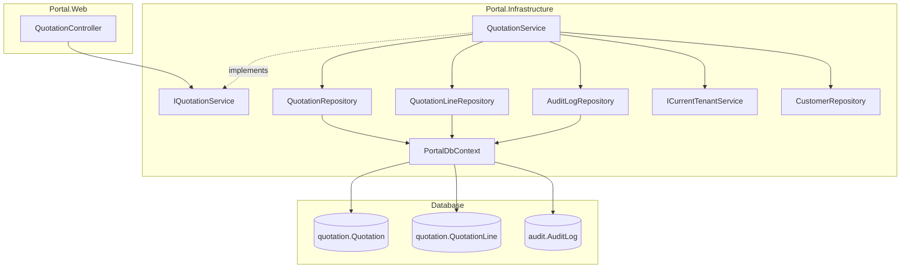
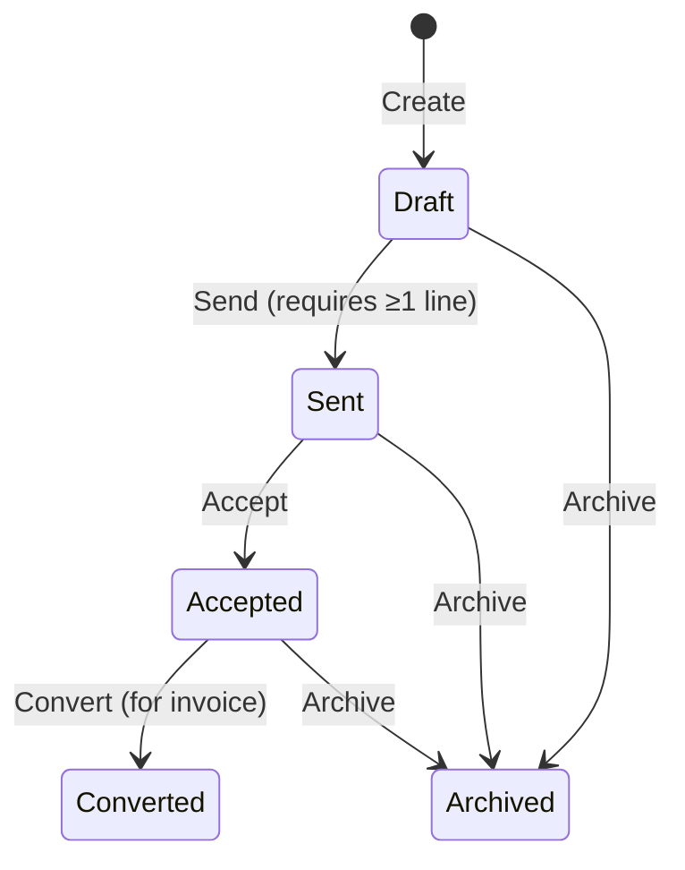

# Design Document: Quotation Platform

## Overview

Quotation Platform (Module 2) delivers tenant-scoped quotation management with line items, lifecycle state transitions, pricing calculations, and audit logging within the Portal platform. It adds `QuotationRepository`, `QuotationLineRepository`, `AuditLogRepository`, `IQuotationService`/`QuotationService`, and `QuotationController` following the exact patterns established in Module 1 (Customer Registry).

The Quotation, QuotationLine, and QuotationStatusType entities and database tables already exist in the `[quotation]` schema. This module implements the application layer — repositories, service, controller, view models, and Razor views — to expose quotation management to authenticated tenant users.

Key design decisions:

- **VatRate added to QuotationLine**: The requirements specify per-line TaxAmount calculation via `LineTotal × VatRate / 100`. The current `[quotation].[QuotationLine]` table lacks a VatRate column. A new migration adds `VatRate DECIMAL(5,2) NOT NULL DEFAULT 0` to the table, and the entity is updated accordingly.
- **Reference generation**: Format `QUO-{BusinessId}-{sequential}` where sequential is a zero-padded 5-digit number derived from `MAX(Id) + 1` for the tenant's quotations. Example: `QUO-3-00042`.
- **Audit logging via AuditLogRepository**: A dedicated `AuditLogRepository` handles inserts into `[audit].[AuditLog]`. The service calls it directly during status transitions — no EF Core interceptor needed for this module.
- **Line item management via server-side form posts**: Add/edit/remove line items use separate POST actions on the controller. No JavaScript frameworks. Consistent with existing patterns.
- **Quotation editing is Draft-only**: Only quotations in Draft status can have their fields or line items modified. All other statuses are read-only.
- **Repository uses raw SQL** via `GenericStoredProcedureRepository<T>`, consistent with `CustomerRepository` and `BusinessRepository`.

## Architecture



### Layer Responsibilities

| Layer | Component | Responsibility |
|-------|-----------|---------------|
| Controller | `QuotationController` | HTTP concerns, authorization, anti-forgery, model binding, view selection, catches exceptions |
| Service | `QuotationService` | Business logic, validation, lifecycle enforcement, pricing calculation, audit logging, tenant assignment |
| Repository | `QuotationRepository` | Raw SQL execution against `[quotation].[Quotation]` |
| Repository | `QuotationLineRepository` | Raw SQL execution against `[quotation].[QuotationLine]` |
| Repository | `AuditLogRepository` | Raw SQL insert into `[audit].[AuditLog]` |
| Infrastructure | `PortalDbContext` | Global query filter on `Quotation.BusinessId` (already configured) |

### Lifecycle State Machine



Valid transitions:
| From | To |
|------|-----|
| Draft (1) | Sent (2) |
| Draft (1) | Archived (5) |
| Sent (2) | Accepted (3) |
| Sent (2) | Archived (5) |
| Accepted (3) | Converted (4) |
| Accepted (3) | Archived (5) |

## Components and Interfaces

### IQuotationService

```csharp
// Portal.Infrastructure/Services/IQuotationService.cs
public interface IQuotationService
{
    Task<List<QuotationListDto>> GetQuotationsAsync(int? statusFilter = null, int? customerFilter = null, DateTime? dateFrom = null, DateTime? dateTo = null);
    Task<Quotation?> GetQuotationByIdAsync(int id);
    Task<List<QuotationLine>> GetQuotationLinesAsync(int quotationId);
    Task<Quotation> CreateQuotationAsync(int customerId, DateOnly? validUntil, string? notes);
    Task UpdateQuotationAsync(int quotationId, int customerId, DateOnly? validUntil, string? notes);
    Task TransitionStatusAsync(int quotationId, int newStatusId, string userId);
    Task<QuotationLine> AddLineAsync(int quotationId, string description, decimal quantity, decimal unitPrice, decimal vatRate);
    Task UpdateLineAsync(int lineId, string description, decimal quantity, decimal unitPrice, decimal vatRate);
    Task RemoveLineAsync(int lineId);
    bool IsExpired(Quotation quotation);
    Dictionary<int, List<int>> GetValidTransitions();
}
```

### QuotationService

```csharp
// Portal.Infrastructure/Services/QuotationService.cs
public class QuotationService : IQuotationService
{
    private readonly QuotationRepository _quotationRepository;
    private readonly QuotationLineRepository _quotationLineRepository;
    private readonly AuditLogRepository _auditLogRepository;
    private readonly CustomerRepository _customerRepository;
    private readonly ICurrentTenantService _currentTenantService;

    // Valid status transitions dictionary
    private static readonly Dictionary<int, List<int>> ValidTransitions = new()
    {
        { 1, new List<int> { 2, 5 } },  // Draft → Sent, Archived
        { 2, new List<int> { 3, 5 } },  // Sent → Accepted, Archived
        { 3, new List<int> { 4, 5 } },  // Accepted → Converted, Archived
    };

    // Validates CustomerId belongs to current tenant
    // Generates Reference as "QUO-{BusinessId}-{sequential}"
    // Enforces Draft-only editing
    // Computes LineTotal, Subtotal, TaxAmount, TotalAmount
    // Logs status transitions to AuditLog
    // Throws ArgumentException on validation failure
    // Throws InvalidOperationException on lifecycle violations
}
```

### QuotationRepository

```csharp
// Portal.Infrastructure/Repositories/QuotationRepository.cs
public class QuotationRepository : GenericStoredProcedureRepository<Quotation>
{
    public QuotationRepository(DbContext context) : base(context) { }

    public async Task<List<Quotation>> GetAllByBusinessIdAsync(int businessId);
    public async Task<Quotation?> GetByIdAndBusinessIdAsync(int id, int businessId);
    public async Task InsertAsync(Quotation entity);
    public async Task UpdateAsync(Quotation entity);
    public async Task<int> GetNextSequentialNumberAsync(int businessId);
}
```

### QuotationLineRepository

```csharp
// Portal.Infrastructure/Repositories/QuotationLineRepository.cs
public class QuotationLineRepository : GenericStoredProcedureRepository<QuotationLine>
{
    public QuotationLineRepository(DbContext context) : base(context) { }

    public async Task<List<QuotationLine>> GetByQuotationIdAsync(int quotationId);
    public async Task<QuotationLine?> GetByIdAsync(int id);
    public async Task InsertAsync(QuotationLine entity);
    public async Task UpdateAsync(QuotationLine entity);
    public async Task DeleteAsync(int id);
    public async Task DeleteAllByQuotationIdAsync(int quotationId);
}
```

### AuditLogRepository

```csharp
// Portal.Infrastructure/Repositories/AuditLogRepository.cs
public class AuditLogRepository : GenericStoredProcedureRepository<AuditLog>
{
    public AuditLogRepository(DbContext context) : base(context) { }

    public async Task InsertAsync(AuditLog entity);
}
```

### QuotationController

```csharp
// Portal.Web/Controllers/QuotationController.cs
[Authorize]
public class QuotationController : Controller
{
    private readonly IQuotationService _quotationService;
    private readonly ICustomerService _customerService;

    public QuotationController(IQuotationService quotationService, ICustomerService customerService) { ... }

    [HttpGet] public async Task<IActionResult> Index(int? status, int? customer, DateTime? dateFrom, DateTime? dateTo);
    [HttpGet] public async Task<IActionResult> Create();
    [HttpPost][ValidateAntiForgeryToken] public async Task<IActionResult> Create(QuotationCreateViewModel model);
    [HttpGet] public async Task<IActionResult> Edit(int id);
    [HttpPost][ValidateAntiForgeryToken] public async Task<IActionResult> Edit(int id, QuotationEditViewModel model);
    [HttpGet] public async Task<IActionResult> Detail(int id);
    [HttpPost][ValidateAntiForgeryToken] public async Task<IActionResult> TransitionStatus(int id, int newStatusId);
    [HttpPost][ValidateAntiForgeryToken] public async Task<IActionResult> AddLine(int quotationId, QuotationLineFormViewModel model);
    [HttpPost][ValidateAntiForgeryToken] public async Task<IActionResult> UpdateLine(int quotationId, int lineId, QuotationLineFormViewModel model);
    [HttpPost][ValidateAntiForgeryToken] public async Task<IActionResult> RemoveLine(int quotationId, int lineId);
}
```

## Data Models

### Quotation Entity (existing — no changes)

Already defined in `Portal.Infrastructure/Entities/Quotation.cs`:

| Property | Type | Nullable | Description |
|----------|------|----------|-------------|
| Id | int | No | PK, identity |
| BusinessId | int | No | FK to [portal].Business |
| CustomerId | int | No | FK to [customer].Customer |
| QuotationStatusTypeId | int | No | FK to [quotation].QuotationStatusType |
| Reference | string | No | Unique reference (max 100) |
| ValidUntil | DateOnly? | Yes | Expiry date |
| Subtotal | decimal | No | Sum of all LineTotal values |
| TaxAmount | decimal | No | Sum of all (LineTotal × VatRate / 100) |
| TotalAmount | decimal | No | Subtotal + TaxAmount |
| Notes | string? | Yes | Free-text notes |
| CreatedAtUtc | DateTime | No | Creation timestamp |
| UpdatedAtUtc | DateTime | No | Last update timestamp |

### QuotationLine Entity (modified — VatRate added)

Current entity at `Portal.Infrastructure/Entities/QuotationLine.cs` needs a `VatRate` property:

| Property | Type | Nullable | Description |
|----------|------|----------|-------------|
| Id | int | No | PK, identity |
| QuotationId | int | No | FK to [quotation].Quotation |
| Description | string | No | Line description (max 500) |
| Quantity | decimal | No | Quantity (18,4) |
| UnitPrice | decimal | No | Unit price (18,2) |
| VatRate | decimal | No | VAT percentage (5,2), e.g. 15.00 for 15% |
| LineTotal | decimal | No | Computed: Quantity × UnitPrice (18,2) |
| SortOrder | int | No | Display order |

### QuotationStatusType Entity (existing — no changes)

Seeded values: Draft (1), Sent (2), Accepted (3), Converted (4), Archived (5).

### AuditLog Entity (existing — no changes)

Used for recording status transitions.

### Database Migration Required

A new migration `020_AddVatRateToQuotationLine.sql` adds:

```sql
ALTER TABLE [quotation].[QuotationLine]
    ADD [VatRate] DECIMAL(5,2) NOT NULL CONSTRAINT [DF_QuotationLine_VatRate] DEFAULT 0;
```

### View Models

#### QuotationListDto

```csharp
public class QuotationListDto
{
    public int Id { get; set; }
    public string Reference { get; set; } = null!;
    public string CustomerName { get; set; } = null!;
    public string StatusName { get; set; } = null!;
    public int QuotationStatusTypeId { get; set; }
    public decimal TotalAmount { get; set; }
    public DateOnly? ValidUntil { get; set; }
    public DateTime CreatedAtUtc { get; set; }
    public bool IsExpired { get; set; }
}
```

#### QuotationListViewModel

```csharp
public class QuotationListViewModel
{
    public List<QuotationListDto> Quotations { get; set; } = new();
    public int? StatusFilter { get; set; }
    public int? CustomerFilter { get; set; }
    public DateTime? DateFrom { get; set; }
    public DateTime? DateTo { get; set; }
    public List<Customer> Customers { get; set; } = new();
    public List<QuotationStatusType> Statuses { get; set; } = new();
}
```

#### QuotationCreateViewModel

```csharp
public class QuotationCreateViewModel
{
    [Required(ErrorMessage = "Customer is required")]
    public int CustomerId { get; set; }

    public DateOnly? ValidUntil { get; set; }

    [MaxLength(4000)]
    public string? Notes { get; set; }

    public List<Customer> Customers { get; set; } = new();
}
```

#### QuotationEditViewModel

```csharp
public class QuotationEditViewModel
{
    public int Id { get; set; }
    public string Reference { get; set; } = null!;

    [Required(ErrorMessage = "Customer is required")]
    public int CustomerId { get; set; }

    public DateOnly? ValidUntil { get; set; }

    [MaxLength(4000)]
    public string? Notes { get; set; }

    public List<QuotationLine> Lines { get; set; } = new();
    public decimal Subtotal { get; set; }
    public decimal TaxAmount { get; set; }
    public decimal TotalAmount { get; set; }
    public List<Customer> Customers { get; set; } = new();
}
```

#### QuotationDetailViewModel

```csharp
public class QuotationDetailViewModel
{
    public Quotation Quotation { get; set; } = null!;
    public List<QuotationLine> Lines { get; set; } = new();
    public string CustomerName { get; set; } = null!;
    public string StatusName { get; set; } = null!;
    public bool IsExpired { get; set; }
    public List<int> AvailableTransitions { get; set; } = new();
}
```

#### QuotationLineFormViewModel

```csharp
public class QuotationLineFormViewModel
{
    [Required(ErrorMessage = "Description is required")]
    [MaxLength(500)]
    public string Description { get; set; } = null!;

    [Required]
    [Range(0.0001, double.MaxValue, ErrorMessage = "Quantity must be greater than zero")]
    public decimal Quantity { get; set; }

    [Required]
    [Range(0, double.MaxValue, ErrorMessage = "Unit price must be zero or greater")]
    public decimal UnitPrice { get; set; }

    [Required]
    [Range(0, 100, ErrorMessage = "VAT rate must be between 0 and 100")]
    public decimal VatRate { get; set; }
}
```

### DI Registration

```csharp
// Program.cs — added registrations
builder.Services.AddScoped<QuotationRepository>();
builder.Services.AddScoped<QuotationLineRepository>();
builder.Services.AddScoped<AuditLogRepository>();
builder.Services.AddScoped<IQuotationService, QuotationService>();
```

### Reference Generation Strategy

Format: `QUO-{BusinessId}-{SequentialNumber:D5}`

The sequential number is derived from:
```sql
SELECT ISNULL(MAX([Id]), 0) + 1 FROM [quotation].[Quotation] WHERE [BusinessId] = @BusinessId
```

This produces references like `QUO-3-00001`, `QUO-3-00002`, etc. The reference is generated at creation time and never changes.

### Pricing Calculation Logic

When any line item is added, edited, or removed:

1. **LineTotal** = `Quantity × UnitPrice` (computed per line, stored on QuotationLine)
2. **Subtotal** = `SUM(LineTotal)` across all lines for the quotation
3. **TaxAmount** = `SUM(LineTotal × VatRate / 100)` across all lines
4. **TotalAmount** = `Subtotal + TaxAmount`

All values use `decimal` with precision (18,2) for storage. Calculations use full decimal precision before rounding to 2 decimal places via `Math.Round(value, 2, MidpointRounding.AwayFromZero)`.


## Correctness Properties

*A property is a characteristic or behavior that should hold true across all valid executions of a system — essentially, a formal statement about what the system should do. Properties serve as the bridge between human-readable specifications and machine-verifiable correctness guarantees.*

### Property 1: Tenant isolation on retrieval

*For any* set of quotations distributed across multiple tenants, all retrieval operations (list, get by Id, filtered queries) executed in the context of a specific tenant shall return only quotations whose BusinessId matches that tenant's BusinessId. Quotations belonging to other tenants shall never appear in results, and attempting to access a specific quotation belonging to a different tenant shall return null.

**Validates: Requirements 1.2, 1.3, 3.3, 7.2, 7.3, 7.4**

### Property 2: Quotation creation invariants

*For any* valid creation input (valid CustomerId belonging to current tenant, optional ValidUntil, optional Notes), creating a quotation shall produce a record where: BusinessId equals the current tenant's BusinessId, QuotationStatusTypeId equals 1 (Draft), Reference matches the pattern `QUO-{BusinessId}-{NNNNN}` and is unique within the tenant, Subtotal/TaxAmount/TotalAmount are all 0, CreatedAtUtc and UpdatedAtUtc are set to the current UTC time, and all provided field values are persisted and retrievable.

**Validates: Requirements 1.4, 3.4, 3.5**

### Property 3: Quotation update round-trip

*For any* existing Draft quotation and valid update data (valid CustomerId, optional ValidUntil, optional Notes), updating the quotation shall persist all changed field values and set UpdatedAtUtc to the current UTC time. Retrieving the quotation after update shall return the new field values.

**Validates: Requirements 1.5, 3.6, 8.1**

### Property 4: Lifecycle transition correctness

*For any* quotation with current status S and requested target status T, the transition shall succeed if and only if (S, T) is in the set {(Draft, Sent), (Draft, Archived), (Sent, Accepted), (Sent, Archived), (Accepted, Converted), (Accepted, Archived)}. On success, QuotationStatusTypeId shall equal T and UpdatedAtUtc shall be refreshed. On failure (invalid pair), an InvalidOperationException shall be thrown and the quotation shall remain unchanged. Additionally, transitioning to Sent shall require at least one line item. Expiry status (ValidUntil < today) shall not block any valid transition.

**Validates: Requirements 4.1, 4.2, 4.3, 4.6, 8.4**

### Property 5: Draft-only editing

*For any* quotation whose QuotationStatusTypeId is not 1 (Draft), any attempt to update quotation fields, add a line item, update a line item, or remove a line item shall be rejected with an InvalidOperationException. For any quotation in Draft status, these operations shall be permitted (assuming valid input).

**Validates: Requirements 4.4, 4.5**

### Property 6: Pricing computation invariant

*For any* quotation with a set of line items where each line has Quantity > 0, UnitPrice >= 0, and VatRate in [0, 100]: each line's LineTotal shall equal `Math.Round(Quantity × UnitPrice, 2)`, the quotation's Subtotal shall equal the sum of all LineTotal values, the quotation's TaxAmount shall equal `Math.Round(SUM(LineTotal × VatRate / 100), 2)`, and the quotation's TotalAmount shall equal Subtotal + TaxAmount. This invariant shall hold after every add, edit, or remove operation on line items.

**Validates: Requirements 5.1, 5.2, 5.3, 6.1, 6.2, 6.3, 6.4**

### Property 7: Line item and customer validation

*For any* line item input where Description is null or whitespace, or Quantity is less than or equal to zero, or UnitPrice is less than zero, or VatRate is outside [0, 100], the add/update operation shall be rejected with an ArgumentException. For any CustomerId that does not belong to the current tenant or does not exist, quotation creation/update shall be rejected with an ArgumentException.

**Validates: Requirements 5.5, 5.6, 5.7, 5.8, 3.7, 3.8**

### Property 8: Expiry computation

*For any* quotation, `IsExpired` shall return true if and only if ValidUntil is not null and ValidUntil < today's date (DateOnly). If ValidUntil is null or ValidUntil >= today, IsExpired shall return false.

**Validates: Requirements 8.2**

### Property 9: Audit log correctness for status transitions

*For any* valid status transition on a quotation, an AuditLog record shall be inserted with: BusinessId matching the quotation's BusinessId, UserId matching the authenticated user, Action equal to "StatusTransition", TableName equal to "quotation.Quotation", RecordId equal to the quotation's Id (as string), OldValues containing the previous status name, NewValues containing the new status name, and Timestamp set to the current UTC time. Previously created AuditLog records shall remain unchanged after subsequent transitions.

**Validates: Requirements 9.1, 9.2, 9.4**

### Property 10: Filter correctness

*For any* combination of status filter, customer filter, and date range filter applied to the quotation list, every quotation in the returned results shall satisfy all applied conditions simultaneously: if a status filter is provided, QuotationStatusTypeId matches; if a customer filter is provided, CustomerId matches; if a date range is provided, CreatedAtUtc falls within the range. No quotation satisfying all conditions shall be excluded from results.

**Validates: Requirements 14.1, 14.2, 14.3, 14.4, 14.5**

### Property 11: Validation failure preserves form state

*For any* invalid model state or business rule violation (ArgumentException, InvalidOperationException) during create, edit, or line item operations, the controller shall return the form view (not a redirect) with the error message present in ModelState and submitted values preserved.

**Validates: Requirements 10.7, 10.8**

### Property 12: Line item ordering invariant

*For any* quotation with multiple line items, retrieving the lines shall return them ordered by SortOrder in ascending order. When a new line is added, its SortOrder shall be greater than all existing lines' SortOrder values for that quotation.

**Validates: Requirements 2.2, 5.4**

## Error Handling

### Strategy by Layer

| Layer | Pattern | Behaviour |
|-------|---------|-----------|
| Repository | `try/catch` with `throw;` | Never swallows exceptions. Rethrows to preserve stack trace. |
| Service | Throws `ArgumentException` | Validation failures (empty description, invalid quantity, invalid customer) throw with descriptive message. |
| Service | Throws `InvalidOperationException` | Lifecycle violations (invalid transition, editing non-Draft quotation, entity not found). |
| Controller | Catches `ArgumentException` | Adds message to `ModelState`, redisplays form. |
| Controller | Catches `InvalidOperationException` | Adds message to `ModelState`, redisplays form or redirects with TempData error. |
| Controller | Returns `NotFound()` | When service returns null (quotation not found or wrong tenant). |

### Specific Error Scenarios

| Scenario | Layer | Response |
|----------|-------|----------|
| Description is null/whitespace | Service | `ArgumentException("Line item description is required")` |
| Quantity <= 0 | Service | `ArgumentException("Quantity must be greater than zero")` |
| UnitPrice < 0 | Service | `ArgumentException("Unit price must be zero or greater")` |
| VatRate outside [0, 100] | Service | `ArgumentException("VAT rate must be between 0 and 100")` |
| CustomerId invalid/wrong tenant | Service | `ArgumentException("Customer not found or does not belong to this business")` |
| Invalid status transition | Service | `InvalidOperationException("Cannot transition from {current} to {target}")` |
| Editing non-Draft quotation | Service | `InvalidOperationException("Quotation can only be edited in Draft status")` |
| Transition to Sent with no lines | Service | `InvalidOperationException("Quotation must have at least one line item before sending")` |
| Quotation not found by Id | Service | Returns `null` → Controller returns `NotFound()` |
| Quotation belongs to different tenant | Service | Returns `null` (global query filter) → Controller returns `NotFound()` |
| Database connection failure | Repository | Exception propagates → global exception handler logs and returns error page |

## Testing Strategy

### Dual Testing Approach

This module requires both unit tests and property-based tests for comprehensive coverage.

### Property-Based Testing

**Library**: [FsCheck.Xunit](https://github.com/fscheck/FsCheck) (v2.16+) with xUnit integration

**Configuration**:
- Minimum 100 iterations per property test
- Each test tagged with: `Feature: quotation-platform, Property {number}: {property_text}`
- Custom generators for:
  - Valid quotation data (CustomerId from tenant's customers, optional ValidUntil, optional Notes)
  - Valid line item data (non-whitespace Description max 500, Quantity > 0 with precision 18,4, UnitPrice >= 0 with precision 18,2, VatRate in [0, 100] with precision 5,2)
  - Invalid line item data (whitespace descriptions, zero/negative quantities, negative prices, out-of-range VatRates)
  - Status transition pairs (both valid and invalid combinations)
  - BusinessId values (positive integers representing different tenants)
  - Date ranges for filter testing

**Properties to implement**:

| Property | Test Focus | Pattern |
|----------|-----------|---------|
| 1 | Tenant isolation — insert quotations for multiple tenants, verify retrieval only returns current tenant's | Invariant |
| 2 | Creation invariants — create with random valid data, verify BusinessId, status=Draft, Reference format, timestamps | Invariant |
| 3 | Update round-trip — update with random valid data, retrieve and compare changed fields | Round-trip |
| 4 | Lifecycle transitions — test all (current, target) pairs, verify success/failure matches valid set | Invariant |
| 5 | Draft-only editing — attempt edits on quotations in each status, verify only Draft allows | Invariant |
| 6 | Pricing computation — add/edit/remove lines with random values, verify LineTotal/Subtotal/TaxAmount/TotalAmount | Invariant |
| 7 | Input validation — generate invalid inputs, verify rejection with ArgumentException | Error condition |
| 8 | Expiry computation — generate quotations with various ValidUntil values, verify IsExpired | Invariant |
| 9 | Audit logging — perform transitions, verify AuditLog records created with correct fields | Invariant |
| 10 | Filter correctness — generate quotation sets, apply random filter combinations, verify all results match | Metamorphic |
| 11 | Validation failure — submit invalid models, verify view returned (not redirect) with errors | Invariant |
| 12 | Line ordering — add multiple lines, verify retrieval order matches SortOrder ascending | Invariant |

### Unit Testing

**Framework**: xUnit with Moq for mocking

**Focus areas**:
- Specific examples: create quotation, add 3 lines, verify totals match expected values
- Edge cases: transition to Sent with zero lines (should fail), create with null ValidUntil, VatRate = 0 (no tax)
- Error messages: verify exact exception messages for each validation scenario
- Controller authorization: verify `[Authorize]` attribute present
- Controller anti-forgery: verify `[ValidateAntiForgeryToken]` on all POST actions
- Integration: DI container resolves `IQuotationService` correctly
- Reference generation: verify format and uniqueness across multiple creations

### Test Project Structure

```
tests/
  Portal.Infrastructure.Tests/
    Properties/
      QuotationServicePropertyTests.cs
      QuotationRepositoryPropertyTests.cs
      QuotationLineRepositoryPropertyTests.cs
    Unit/
      QuotationServiceTests.cs
      QuotationRepositoryTests.cs
  Portal.Web.Tests/
    Properties/
      QuotationControllerPropertyTests.cs
    Unit/
      QuotationControllerTests.cs
```

### Key Testing Decisions

1. **FsCheck over manual randomization** — provides shrinking, reproducibility, and statistical coverage
2. **In-memory database for repository tests** — EF Core InMemory provider for fast isolated tests (global query filters work with InMemory provider)
3. **Moq for service-level tests** — mock repositories and `ICurrentTenantService` to isolate business logic
4. **Custom Arbitraries** — generators for `Quotation`, `QuotationLine` entities respecting field constraints (max lengths, valid formats, decimal precision)
5. **Each correctness property implemented by a single property-based test** — one FsCheck `[Property]` method per design property
6. **Pricing tests use known decimal values** — avoid floating-point comparison issues by generating values with at most 2 decimal places for prices and 4 for quantities
